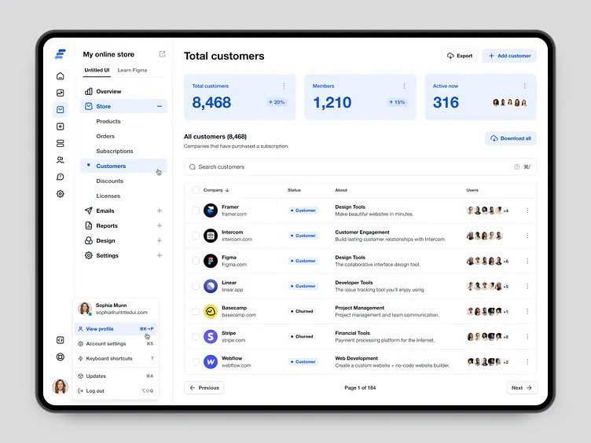

# Customer Management API

🔗 **Live Interactive Swagger Documentation**: [https://hagiakhanh.github.io/bbv-dbms/online-store/](https://hagiakhanh.github.io/bbv-dbms/online-store/)

This API list is inferred only from the visible elements of the Customer Management screen. It does not include APIs for pages whose content is not shown, such as Products, Orders, Subscriptions, Discounts, Reports, Design, or Settings.

## 1. Authentication

| Method | Endpoint | Path parameters | Query / filters & Pagination | Request body | Response | Authorize | UI component |
| ------ | -------- | --------------- | ---------------------------- | ------------ | -------- | --------- | ------------ |
| POST | `/auth/login` | None | None | `LoginRequest` | `AuthResponse` | None | Sign in to the administration dashboard |
| POST | `/auth/refresh-token` | None | None | `RefreshTokenRequest` | `AuthResponse` | None | Issue a new access token |
| POST | `/auth/logout` | None | `allDevices` | None | `MessageResponse` | User | `Log out` action in the account menu |
| GET | `/users/me` | None | `includeRole`, `includeStore` | None | `CurrentUserResponse` | User | Display the current user's name, email, avatar, role, and store |

## 2. Store and Page Context

| Method | Endpoint | Path parameters | Query / filters & Pagination | Request body | Response | Authorize | UI component |
| ------ | -------- | --------------- | ---------------------------- | ------------ | -------- | --------- | ------------ |
| GET | `/store` | None | None | None | `StoreResponse` | User | Display the store name, plan, live status, and storefront URL |
| GET | `/updates/unread-count` | None | None | None | `UnreadCountResponse` | User | Display the unread count next to `Updates` |

## 3. Customer Summary

| Method | Endpoint | Path parameters | Query / filters & Pagination | Request body | Response | Authorize | UI component |
| ------ | -------- | --------------- | ---------------------------- | ------------ | -------- | --------- | ------------ |
| GET | `/customers/summary` | None | `from`, `to`, `timezone` | None | `CustomerSummaryResponse` | Admin | Display `Total customers`, `Members`, `Active now`, and growth percentages |

## 4. Customer List and CRUD

| Method | Endpoint | Path parameters | Query / filters & Pagination | Request body | Response | Authorize | UI component |
| ------ | -------- | --------------- | ---------------------------- | ------------ | -------- | --------- | ------------ |
| GET | `/customers` | None | `search`, `status`, `sort`, `page`, `pageSize` | None | `PagedResult<CustomerListItemResponse>` | Admin | Customer table, search, sorting, and pagination |
| GET | `/customers/{customerId}` | `customerId` | None | None | `CustomerDetailResponse` | Admin | Open customer details from a row or the row action menu |
| POST | `/customers` | None | None | `CreateCustomerRequest` | `CustomerDetailResponse` | Admin | `Add customer` button |
| PUT | `/customers/{customerId}` | `customerId` | None | `UpdateCustomerRequest` | `CustomerDetailResponse` | Admin | Edit a customer from the row action menu |
| PATCH | `/customers/{customerId}/status` | `customerId` | None | `UpdateCustomerStatusRequest` | `CustomerDetailResponse` | Admin | Change a customer status, such as `Customer` or `Churned` |
| DELETE | `/customers/{customerId}` | `customerId` | None | None | `MessageResponse` | Admin | Delete a customer from the row action menu |

## 5. Customer Export

| Method | Endpoint | Path parameters | Query / filters & Pagination | Request body | Response | Authorize | UI component |
| ------ | -------- | --------------- | ---------------------------- | ------------ | -------- | --------- | ------------ |
| GET | `/customers/export` | None | `scope`, `format`, `search`, `status`, `sort` | None | File | Admin | `Export` and `Download all` buttons |

## 6. Optional Bulk Actions

The table contains row-selection checkboxes, so the following APIs may be added if the interface supports bulk actions.

| Method | Endpoint | Path parameters | Query / filters & Pagination | Request body | Response | Authorize | UI component |
| ------ | -------- | --------------- | ---------------------------- | ------------ | -------- | --------- | ------------ |
| PATCH | `/customers/bulk-status` | None | `notifyCustomers` | `BulkUpdateCustomerStatusRequest` | `BulkOperationResponse` | Admin | Change the status of selected customers |
| POST | `/customers/bulk-delete` | None | None | `BulkDeleteCustomersRequest` | `BulkOperationResponse` | Admin | Delete selected customers |
| POST | `/customers/bulk-export` | None | `format` | `BulkCustomerIdsRequest` | File | Admin | Export selected customers |
