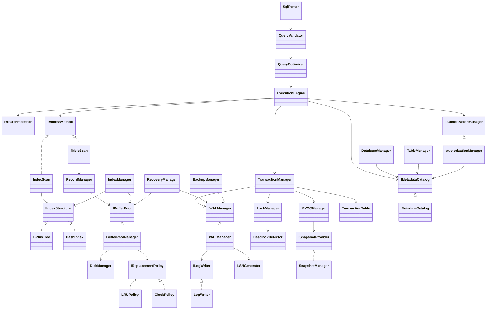
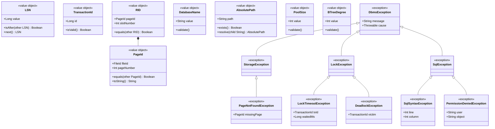
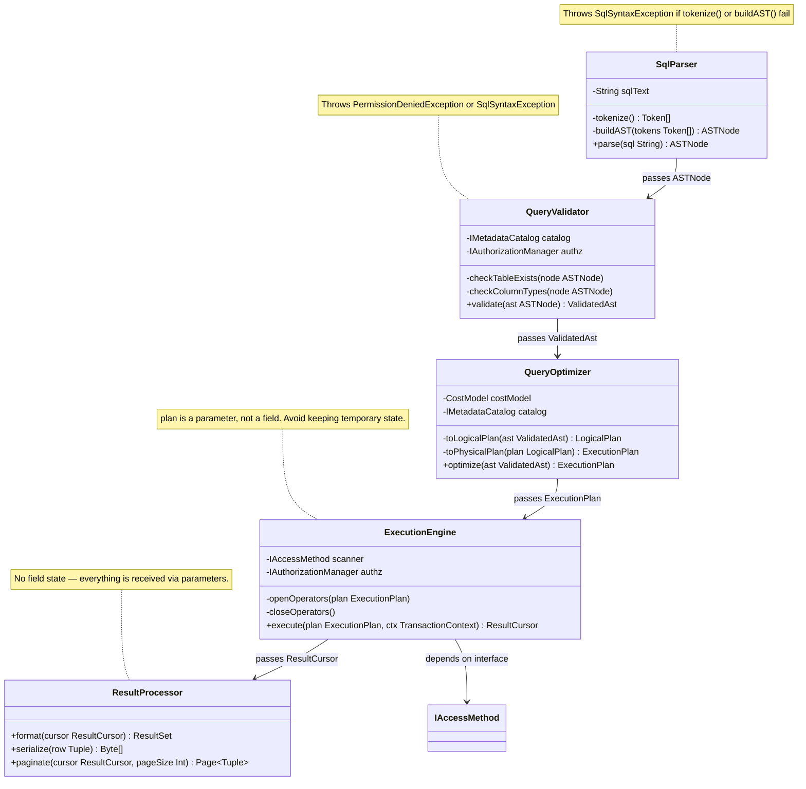
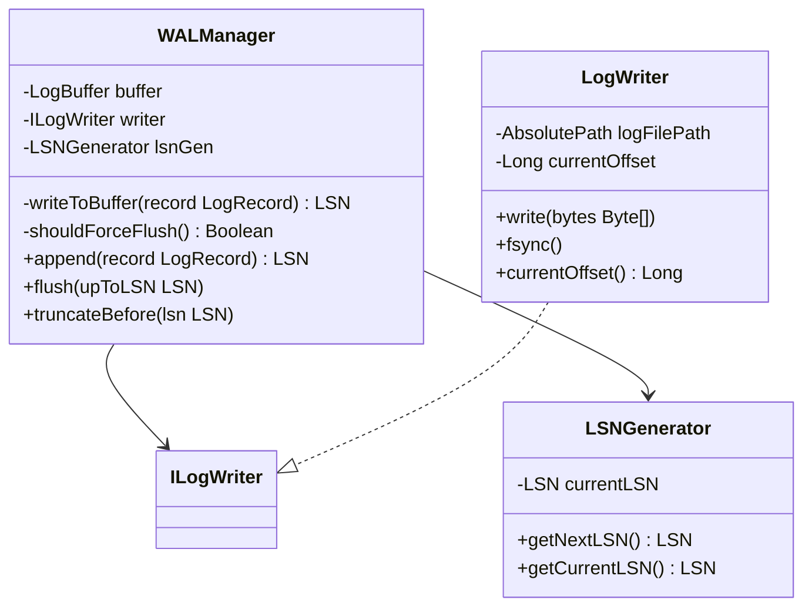
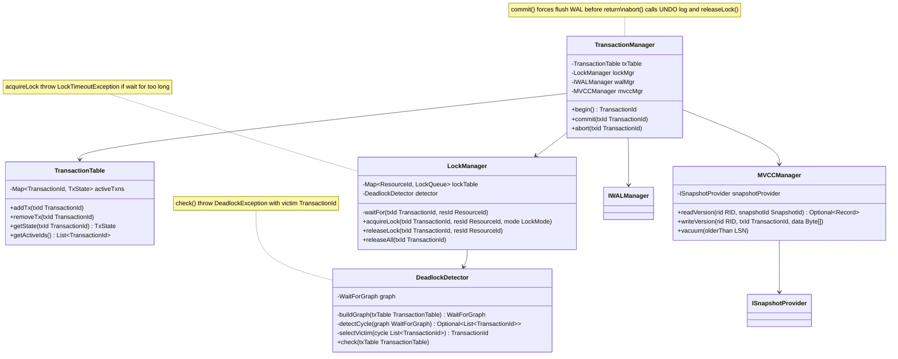
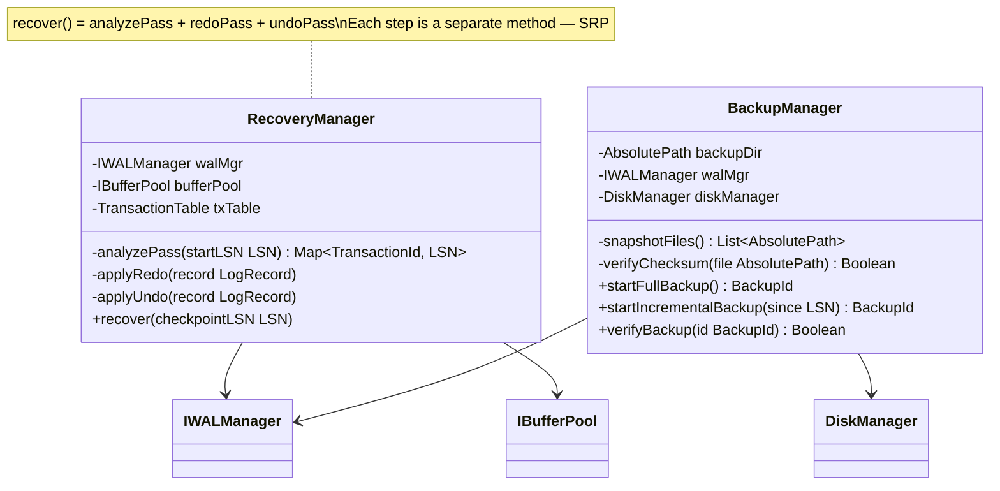
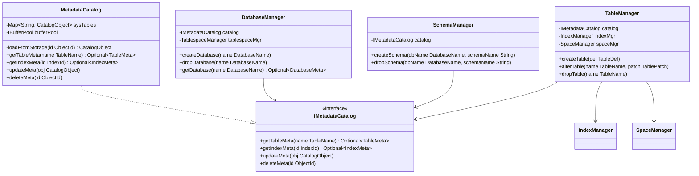
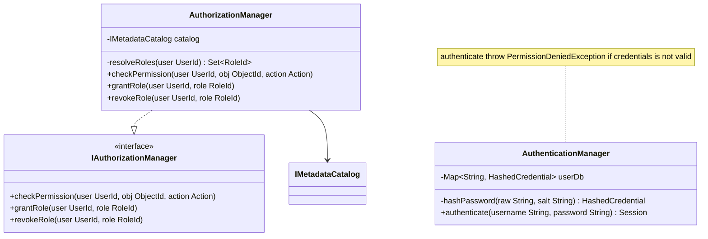

# This overview of DBMS Mindmap

<!-- ```mermaid
graph LR
    %% Styles cho nền tối (GitHub Dark Mode)
    classDef default fill:#2d2d2d,stroke:#888,stroke-width:1px,color:#fff;
    classDef root fill:#ff8888,stroke:#ff5555,stroke-width:2px,font-weight:bold,color:#000;
    classDef layer1 fill:#99ccff,stroke:#5ba3e3,stroke-width:1.5px,font-weight:bold,color:#000;
    classDef layer2 fill:#5fbb97,stroke:#3a9672,stroke-width:1.5px,font-weight:bold,color:#000;

    %% Tăng độ tương phản cho đường nối liên kết giữa các node
    linkStyle default stroke:#ffffff,stroke-width:1.5px;

    db((DBMS)):::root

    %% ===== BÊN TRÁI (module 1-4) =====

    %% 1. Query Processor
    qp[1. Query Processor]:::layer1 --- db
    qp_sp[SQL Parser]:::layer2 --- qp
    qp_qo[Query Optimizer]:::layer2 --- qp
    qp_qe[Query Execution]:::layer2 --- qp
    qp_qv[Query Validation]:::layer2 --- qp
    qp_rp[Result Processing]:::layer2 --- qp

    %% 2. Storage Engine
    se[2. Storage Engine]:::layer1 --- db
    se_df[Data File Manager]:::layer2 --- se
    se_pm[Page Manager]:::layer2 --- se
    se_bp[Buffer Pool + Cache]:::layer2 --- se
    se_rm[Record Management]:::layer2 --- se
    se_im[Index Management]:::layer2 --- se
    se_am[Access Methods]:::layer2 --- se
    se_sa[Storage Allocation]:::layer2 --- se
    se_lf[Log File / WAL]:::layer2 --- se

    %% 3. Transaction & Concurrency
    tx[3. Transaction & Concurrency]:::layer1 --- db
    tx_cc[Concurrency Control]:::layer2 --- tx
    tx_dl[Deadlock Handler]:::layer2 --- tx
    tx_tm[Transaction Manager]:::layer2 --- tx
    tx_lm[Lock Manager]:::layer2 --- tx
    tx_im[Isolation Management]:::layer2 --- tx

    %% 4. Backup & Durability
    bd[4. Backup & Durability]:::layer1 --- db
    bd_bm[Backup Management]:::layer2 --- bd
    bd_rm[Restore Management]:::layer2 --- bd
    bd_tl[Transaction Logging]:::layer2 --- bd
    bd_re[Recovery Manager]:::layer2 --- bd
    bd_cp[Checkpoint Manager]:::layer2 --- bd
    bd_rp[Replication & HA]:::layer2 --- bd

    %% ===== BÊN PHẢI (module 5-8) =====

    %% 5. Performance & Memory
    db --- pf[5. Performance & Memory]:::layer1
    pf --- pf_qa[Performance Analyzer]:::layer2
    pf --- pf_ch[Caching Systems]:::layer2
    pf --- pf_mm[Memory Management]:::layer2
    pf --- pf_dd[Data Distribution]:::layer2
    pf --- pf_ct[Connection & Threads]:::layer2

    %% 6. Database Object Management
    db --- om[6. Object Management]:::layer1
    om --- om_dm[Database Management]:::layer2
    om --- om_sm[Schema Management]:::layer2
    om --- om_tm[Table Management]:::layer2
    om --- om_vm[View Management]:::layer2
    om --- om_rm[Relationship Management]:::layer2
    om --- om_idx[Index Definition]:::layer2
    om --- om_cm[Constraint Management]:::layer2
    om --- om_com[Column Management]:::layer2
    om --- om_po[Programmable Objects]:::layer2
    om --- om_dt[Data Type System]:::layer2
    om --- om_mm[Metadata Management]:::layer2

    %% 7. Security & Access Control
    db --- sa[7. Security & Access Control]:::layer1
    sa --- sa_au[Authentication]:::layer2
    sa --- sa_az[Authorization]:::layer2
    sa --- sa_ac[Access Control Filters]:::layer2
    sa --- sa_um[User Management]:::layer2
    sa --- sa_ec[Encryption Engine]:::layer2
    sa --- sa_ad[Auditing]:::layer2

    %% 8. Administration & Monitoring
    db --- am[8. Admin & Monitoring]:::layer1
    am --- am_bs[Background Strategy]:::layer2
    am --- am_ml[Monitoring & Logging]:::layer2
    am --- am_cm[Configuration]:::layer2
    am --- am_ie[Import & Export]:::layer2
``` -->


## Diagram 10 — Full Dependency Overview (Cross-Layer)



---

## Diagram 1 — Value Objects & Exception Hierarchy

> This is the foundation of the entire system. Every class uses these types instead of primitives.



---

---

## Diagram 2 — Interface Contracts (DIP Foundation)

> All high-level classes depend on these interfaces, regardless of their implementations.

```mermaid
classDiagram

    %% ── INTERFACES ─────────────────────────────────────────
    class IBufferPool {
        <<interface>>
        +fetchPage(id PageId) Page
        +unpinPage(id PageId)
        +flushPage(id PageId)
        +markDirty(id PageId)
    }
    class IWALManager {
        <<interface>>
        +append(record LogRecord) LSN
        +flush(upToLSN LSN)
        +truncateBefore(lsn LSN)
    }
    class ILogWriter {
        <<interface>>
        +write(bytes Byte[])
        +fsync()
        +currentOffset() Long
    }
    class IIndexStructure {
        <<interface>>
        +insert(key Key, rid RID)
        +delete(key Key)
        +search(key Key) Optional~RID~
        +rangeScan(from Key, to Key) Iterator~RID~
    }
    class IReplacementPolicy {
        <<interface>>
        +recordAccess(frameId Int)
        +evictFrame() Optional~Int~
        +pin(frameId Int)
        +unpin(frameId Int)
    }
    class ISnapshotProvider {
        <<interface>>
        +createSnapshot(txId TransactionId) SnapshotId
        +releaseSnapshot(id SnapshotId)
        +isVisible(txId TransactionId, snapshotId SnapshotId) Boolean
    }
    class IAccessMethod {
        <<interface>>
        +open(ctx ScanContext)
        +next() Optional~Tuple~
        +close()
    }

    %% ── IMPLEMENTATIONS ────────────────────────────────────
    class BufferPoolManager {
        -Page[] frames
        -PageTable pageTable
        -IReplacementPolicy policy
        -findInCache(id PageId) Optional~Page~
        -loadFromDisk(id PageId) Page
        -evictIfFull()
        +fetchPage(id PageId) Page
        +unpinPage(id PageId)
        +flushPage(id PageId)
        +markDirty(id PageId)
    }
    class WALManager {
        -LogBuffer buffer
        -ILogWriter writer
        -LSNGenerator lsnGen
        -writeToBuffer(record LogRecord) LSN
        -shouldForceFlush() Boolean
        +append(record LogRecord) LSN
        +flush(upToLSN LSN)
        +truncateBefore(lsn LSN)
    }
    class LogWriter {
        -AbsolutePath logFilePath
        -Long currentOffset
        +write(bytes Byte[])
        +fsync()
        +currentOffset() Long
    }
    class BPlusTree {
        -PageId rootPageId
        -BTreeDegree degree
        -IBufferPool bufferPool
        -splitNode(nodeId PageId) PageId
        -propagateSplit(child PageId, parent PageId)
        -findLeaf(key Key) PageId
        +insert(key Key, rid RID)
        +delete(key Key)
        +search(key Key) Optional~RID~
        +rangeScan(from Key, to Key) Iterator~RID~
    }
    class HashIndex {
        -PageId directoryPageId
        -IBufferPool bufferPool
        -resolveChain(hash Int) PageId
        +insert(key Key, rid RID)
        +delete(key Key)
        +search(key Key) Optional~RID~
        +rangeScan(from Key, to Key) Iterator~RID~
    }
    class LRUPolicy {
        -PoolSize frameCount
        -LinkedHashMap~Int~ usageOrder
        +recordAccess(frameId Int)
        +evictFrame() Optional~Int~
        +pin(frameId Int)
        +unpin(frameId Int)
    }
    class ClockPolicy {
        -PoolSize frameCount
        -Boolean[] referenceBits
        -Int clockHand
        +recordAccess(frameId Int)
        +evictFrame() Optional~Int~
        +pin(frameId Int)
        +unpin(frameId Int)
    }
    class SnapshotManager {
        -List~Snapshot~ activeSnapshots
        -Snapshot buildSnapshot(txId TransactionId) Snapshot
        +createSnapshot(txId TransactionId) SnapshotId
        +releaseSnapshot(id SnapshotId)
        +isVisible(txId TransactionId, snapshotId SnapshotId) Boolean
    }
    class TableScan {
        -TableId tableId
        -RID currentRid
        -RecordManager recordMgr
        +open(ctx ScanContext)
        +next() Optional~Tuple~
        +close()
    }
    class IndexScan {
        -IndexId indexId
        -Key searchKey
        -IIndexStructure index
        +open(ctx ScanContext)
        +next() Optional~Tuple~
        +close()
    }

    IBufferPool <|.. BufferPoolManager
    IWALManager <|.. WALManager
    ILogWriter <|.. LogWriter
    IIndexStructure <|.. BPlusTree
    IIndexStructure <|.. HashIndex
    IReplacementPolicy <|.. LRUPolicy
    IReplacementPolicy <|.. ClockPolicy
    ISnapshotProvider <|.. SnapshotManager
    IAccessMethod <|.. TableScan
    IAccessMethod <|.. IndexScan

    WALManager --> ILogWriter
    BufferPoolManager --> IReplacementPolicy
```



---

## Diagram 3 — Query Processor Layer



---

## Diagram 4 — Storage Engine Layer

```mermaid
classDiagram

    class DiskManager {
        -Map~FileId, FileHandle~ openFiles
        -AbsolutePath dataDir
        -ensureOpen(path AbsolutePath) FileHandle
        +readPage(id PageId) Byte[]
        +writePage(id PageId, data Byte[])
        +allocateFile(path AbsolutePath) FileId
    }
    note for DiskManager "Throws StorageException if file does not exist"

    class TablespaceManager {
        -Map~TablespaceId, Tablespace~ tablespaces
        -IMetadataCatalog catalog
        +createTablespace(name String, path AbsolutePath)
        +getTablespace(id TablespaceId) Tablespace
        +mapDatabaseToFile(db DatabaseName) AbsolutePath
    }

    class PageManager {
        -DiskManager diskManager
        -SpaceManager spaceMgr
        +allocatePage(tableId TableId) PageId
        +fetchPage(id PageId) RawPage
        +freePage(id PageId)
    }

    class PageFormatter {
        -formatHeader(page RawPage) PageHeader
        -computeFreeSpace(page RawPage) Int
        +formatSlottedPage(page RawPage) FormattedPage
        +insertTuple(page FormattedPage, tuple Byte[]) SlotId
    }
    note for PageFormatter "insertTuple throw StorageException if does not have enough free space"

    class BufferPoolManager {
        -Page[] frames
        -PageTable pageTable
        -IReplacementPolicy policy
        -DiskManager diskManager
        -findInCache(id PageId) Optional~Page~
        -loadFromDisk(id PageId) Page
        -evictIfFull()
        +fetchPage(id PageId) Page
        +unpinPage(id PageId)
        +flushPage(id PageId)
        +markDirty(id PageId)
    }

    class RecordManager {
        -IBufferPool bufferPool
        -RecordLayoutManager layoutMgr
        -RIDGenerator ridGen
        +insertRecord(tableId TableId, data Byte[]) RID
        +deleteRecord(rid RID)
        +updateRecord(rid RID, data Byte[])
        +readRecord(rid RID) Optional~Record~
    }

    class RecordLayoutManager {
        -Schema schema
        +getFieldOffset(colId ColId) Int
        +serialize(record Record) Byte[]
        +deserialize(data Byte[]) Record
    }

    class RIDGenerator {
        -PageId currentPageId
        -Int nextSlotId
        +generateNextRID(tableId TableId) RID
    }

    class IndexManager {
        -IBufferPool bufferPool
        -IMetadataCatalog catalog
        -Map~IndexId, IIndexStructure~ indexCache
        +createIndex(def IndexDef) IndexId
        +dropIndex(id IndexId)
        +getIndex(id IndexId) IIndexStructure
    }

    class SpaceManager {
        -ExtentManager extentMgr
        +allocateSpace(size Int) ExtentId
        +freeSpace(extent ExtentId)
        +availableSpace() Long
    }

    class ExtentManager {
        -Map~ExtentId, ExtentInfo~ extents
        -SegmentManager segMgr
        +allocateExtent(segId SegmentId) ExtentId
        +freeExtent(id ExtentId)
    }

    class SegmentManager {
        -Map~SegmentId, SegmentInfo~ segments
        +createSegment(tableId TableId) SegmentId
        +growSegment(id SegmentId)
        +dropSegment(id SegmentId)
    }

    RecordManager --> IBufferPool
    IndexManager --> IBufferPool
    BufferPoolManager --> DiskManager
    BufferPoolManager --> IReplacementPolicy
    PageManager --> DiskManager
    PageManager --> SpaceManager
    DiskManager --> TablespaceManager
    SpaceManager --> ExtentManager
    ExtentManager --> SegmentManager
    RecordManager --> RecordLayoutManager
    RecordManager --> RIDGenerator
    IndexManager *-- IIndexStructure
```



---

## Diagram 5 — WAL & Logging Layer



---

## Diagram 6 — Transaction Layer



---

## Diagram 7 — Recovery & Backup Layer



---

## Diagram 8 — Database Object Management Layer



---

## Diagram 9 — Security Layer



# Unit Test Specifications

## DiskManager
* `DiskManagerInitialize_NewDatabase_CreatesDataFiles`
* `DiskManagerReadPage_ValidPageId_ReturnsRawBytes`
* `DiskManagerReadPage_InvalidPageId_ThrowsFileNotFoundException`
* `DiskManagerWritePage_ValidPageId_WritesBytesCorrectly`

## TablespaceManager
* `TablespaceManagerAllocateTablespace_WithinQuota_ReturnsTablespaceId`
* `TablespaceManagerAllocateTablespace_ExceedsQuota_ThrowsQuotaExceededException`

## PageFormatter
* `PageFormatterFormat_NewRawPage_SetsHeaderCorrectly`
* `PageFormatterAddTuple_ToFormattedPage_UpdatesSlotArrayAndFreeSpace`
* `PageFormatterAddTuple_InsufficientSpace_ThrowsPageOverflowException`

## PageManager
* `PageManagerGetPage_FromCacheOrDisk_ReturnsFormattedPage`
* `PageManagerFlushDirtyPage_WritesToDisk_AndClearsDirtyFlag`

## BufferPoolManager
* `BufferPoolManagerFetchPage_NotInCache_LoadsFromDiskAndPins`
* `BufferPoolManagerFetchPage_InCache_IncrementsPinCount`
* `BufferPoolManagerUnpinPage_PinCountZero_LeavesPageUnpinned`
* `BufferPoolManagerUnpinPage_DirtyPage_MarksAsDirty`
* `BufferPoolManagerEvictPage_WhenCapacityFull_EvictsLeastRecentlyUsed`
* `BufferPoolManagerFlushAll_DirtiesOnlyWritesDirtyPages`

## LRUPolicy
* `LRUPolicySelectVictim_AfterMultipleAccesses_ReturnsLeastRecentlyUsed`

## ClockPolicy
* `ClockPolicySelectVictim_ReferenceBitHandling_EvictsCorrectPage`

## RecordManager
* `RecordManagerSerializeTuple_CorrectByteLayout`
* `RecordManagerDeserializeRecord_ValidBytes_ReturnsEquivalentTuple`

## RIDGenerator
* `RIDGeneratorGenerate_UniqueAcrossThreads_ReturnsUniqueRID`

## BPlusTree
* `BPlusTreeInsert_KeyCausesLeafSplit_CreatesNewRoot`
* `BPlusTreeSearch_ExistingKey_ReturnsCorrectLeafNode`
* `BPlusTreeSearch_NonExistingKey_ReturnsNull`
* `BPlusTreeDelete_KeyLeavesNodeUnderflow_PerformsMergeOrBorrow`

## HashIndex
* `HashIndexInsert_DuplicateKey_ThrowsDuplicateKeyException`
* `HashIndexLookup_ExistingKey_ReturnsRidList`
* `HashIndexDelete_ExistingKey_RemovesEntry`

## TableScan
* `TableScanInitialize_EmptyTable_ReturnsNoRows`
* `TableScanNext_IteratesAllRows_InOrder`

## IndexScan
* `IndexScanInitialize_WithBTreeIndex_ReturnsRowsInKeyOrder`

## SpaceManager
* `SpaceManagerAllocateExtent_WhenFreeSpaceAvailable_ReturnsExtentId`
* `SpaceManagerFreeExtent_ValidId_MarksAsFree`

## ExtentManager
* `ExtentManagerAllocateSegment_WithinLimits_ReturnsSegmentId`

## SegmentManager
* `SegmentManagerAllocatePage_InSegment_ReturnsPageId`

## WALManager
* `WALManagerAppendLogRecord_ValidRecord_AppendsToBuffer`
* `WALManagerAppendLogRecord_BufferFull_TriggersFlush`

## LogWriter
* `LogWriterFlush_EmptyBuffer_DoesNothing`
* `LogWriterFlush_NonEmptyBuffer_WritesToDiskAndUpdatesLSN`

## LSNGenerator
* `LSNGeneratorNext_IncrementsMonotonically_ReturnsHigherLSN`

## PageHeader
* `PageHeaderParseHeader_FromRawBytes_ReturnsCorrectValues`

## LRUCache
* `LRUCacheGet_AddsToCache_AndEvictsOldestWhenFull`

## TransactionManager
* `TransactionManagerBeginTransaction_ReturnsActiveContext`
* `TransactionManagerCommitTransaction_WithAllLocks_ReleasesLocksAndMarksCommitted`
* `TransactionManagerAbortTransaction_RollsBackChanges_AndReleasesLocks`
* `TransactionManagerCommitTransaction_WhenDeadlockDetected_ThrowsDeadlockException`

## TransactionTable
* `TransactionTableAddTransaction_NewEntry_AppearInActiveList`
* `TransactionTableRemoveTransaction_WhenCommittedOrAborted_NotPresentInActiveList`

## LockManager
* `LockManagerAcquireSharedLock_WhenNoConflict_GrantsImmediately`
* `LockManagerAcquireExclusiveLock_WhenSharedExists_WaitsInQueue`
* `LockManagerReleaseLock_TriggersNextWaitingTransaction`
* `LockManagerUpgradeLock_FromSharedToExclusive_IfNoOtherShared_Grants`

## MVCCManager
* `MVCCManagerCreateVersion_OnUpdate_GeneratesNewVersionChainNode`
* `MVCCManagerReadVisibleVersion_ForSnapshot_ReturnsCorrectVersion`
* `MVCCManagerCleanupObsoleteVersions_AfterCheckpoint_RemovesOldVersions`

## SnapshotManager
* `SnapshotManagerCreateSnapshot_IncludesAllActiveTxIds`
* `SnapshotManagerIsVisible_VisibleForCommittedTx_ReturnsTrue`
* `SnapshotManagerIsVisible_InvisibleForFutureTx_ReturnsFalse`

## DeadlockDetector
* `DeadlockDetectorDetectCycle_WithTwoTx_ReturnsTrueAndVictimChosen`
* `DeadlockDetectorResolveDeadlock_KillsVictimAndUnblocksOtherTx`

## TransactionContext
* `TransactionContextEquals_TwoContextsWithSameId_ReturnsTrue`

## LockQueue
* `LockQueueEnqueue_WhenLockBusy_AddsToQueueInOrder`
* `LockQueueDequeue_AfterRelease_RemovesFirstInQueue`

## SqlParser
* `SqlParserParse_ValidSelectStatement_ReturnsValidAst`
* `SqlParserParse_SelectWithJoin_ReturnsAstContainingJoinNode`
* `SqlParserParse_InvalidSyntax_ThrowsSqlSyntaxException`
* `SqlParserParse_LexicalTokens_CorrectlyIdentifiesKeywordsAndIdentifiers`

## QueryValidator
* `QueryValidatorValidate_ValidAst_AcceptsWithoutError`
* `QueryValidatorValidate_UnknownTable_ThrowsSqlException`
* `QueryValidatorValidate_ColumnTypeMismatch_ThrowsSqlException`

## QueryOptimizer
* `QueryOptimizerApplyRule_PredicatePushdown_MovesFilterBelowScan`
* `QueryOptimizerApplyRule_JoinReordering_ChoosesCheapestJoinOrder`
* `QueryOptimizerEstimateCost_IndexAvailable_ReturnsLowerCostThanSeqScan`
* `QueryOptimizerGeneratePhysicalPlan_FromLogicalPlan_ProducesExecutionPlan`

## ExecutionEngine
* `ExecutionEngineExecute_SequentialScan_ReturnsAllRows`
* `ExecutionEngineExecute_HashJoin_CorrectlyMatchesRows`
* `ExecutionEngineExecute_Projection_OutputsOnlySelectedColumns`
* `ExecutionEngineExecute_Aggregation_GroupByCorrectResult`
* `ExecutionEngineExecute_SortOperator_SortsRowsAccordingToOrderBy`

## ResultProcessor
* `ResultProcessorProcessResultSet_ToResultCursor_ReturnsCursorWithCorrectMetadata`
* `ResultProcessorFormatResult_WithJsonFormatter_ReturnsValidJson`

## ASTNode
* `ASTNodeEquals_SameStructure_ReturnsTrue`

## Token
* `TokenIsKeyword_ReturnsTrueForSelect`

## CostModel
* `CostModelCalculateCost_ForLogicalPlan_ReturnsExpectedValue`

## LogicalPlan
* `LogicalPlanValidate_NoCycles_InPlanGraph`

## ExecutionPlan
* `ExecutionPlanClone_DeepCopy_ReturnsIndependentCopy`

## DatabaseManager
* `DatabaseManagerCreateDatabase_ValidName_AddsToSystemCatalog`
* `DatabaseManagerDropDatabase_Existing_RemovesCatalogEntriesAndPhysicalFiles`
* `DatabaseManagerGetDatabaseMeta_ReturnsCorrectMetadata`

## SchemaManager
* `SchemaManagerCreateSchema_ValidDefinition_AddsToCatalog`
* `SchemaManagerResolveSchema_Existing_ReturnsSchemaObject`
* `SchemaManagerRenameSchema_UpdatesAllDependentObjects`

## TableManager
* `TableManagerCreateTable_WithColumns_AddsTableToCatalog`
* `TableManagerAlterTable_AddColumn_UpdatesTableMetaAndPhysicalStorage`
* `TableManagerDropTable_RemovesCatalogAndPhysicalPages`

## IndexManager
* `IndexManagerCreateIndex_OnColumn_AddsIndexMetaAndBuildsStructure`
* `IndexManagerDropIndex_RemovesMetaAndPhysicalStructure`

## MetadataCatalog
* `MetadataCatalogLookupTable_Existing_ReturnsTableMeta`
* `MetadataCatalogLookupColumn_Existing_ReturnsColumnMeta`

## ConstraintManager
* `ConstraintManagerAddPrimaryKey_ValidColumns_SetsUniqueConstraint`
* `ConstraintManagerAddForeignKey_ValidReference_EnforcesReferentialIntegrity`
* `ConstraintManagerValidateInsert_WithConstraintViolations_ThrowsConstraintException`

## CatalogObject
* `CatalogObjectEquals_TwoObjectsSameId_ReturnsTrue`

## ObjectId
* `ObjectIdGenerate_UniqueAcrossCatalog_ReturnsUniqueId`

## TableMeta
* `TableMetaClone_DeepCopy_ReturnsIndependentMeta`

## IndexMeta
* `IndexMetaUpdateStatistics_UpdatesCostEstimates`

## AuthenticationManager
* `AuthenticationManagerAuthenticate_ValidCredentials_ReturnsSession`
* `AuthenticationManagerAuthenticate_InvalidPassword_ThrowsAuthenticationException`
* `AuthenticationManagerHashPassword_ProducesDeterministicHash_WithSalt`

## AuthorizationManager
* `AuthorizationManagerAuthorize_UserHasPermission_ReturnsTrue`
* `AuthorizationManagerAuthorize_UserMissingPermission_ThrowsPermissionDeniedException`
* `AuthorizationManagerCheckRoleHierarchy_InheritedPermissions_AreEffectivePermissions`

## Session
* `SessionIsActive_AfterLogout_ReturnsFalse`

## RoleId / UserId
* `RoleId_UserIdEquals_SameGuid_ReturnsTrue`

---

# Integration Test Specifications

| ID | Test Group / Scenario | Key Components Involved | Success Criteria |
| :--- | :--- | :--- | :--- |
| **1** | **Startup / Database Lifecycle**<br>_Create‑Open‑Close‑Drop Database_ | DatabaseManager, DiskManager, TablespaceManager, BufferPoolManager, WALManager | • Database directory and system‑catalog files are created.<br>• On open, catalog is loaded without errors.<br>• After close, all dirty pages are flushed and WAL is checkpointed.<br>• Drop removes all physical files and releases any allocated buffers. |
| **2** | **Schema Management**<br>_Create Schema → Create Table → Create Index → Drop Index → Drop Table → Drop Schema_ | SchemaManager, TableManager, IndexManager, MetadataCatalog, BufferPoolManager, BPlusTree | • All catalog entries exist after each creation step.<br>• Index structure is built and searchable.<br>• Dropping an index removes its physical pages and catalog entry.<br>• Dropping the table removes its pages, index pages, and updates the catalog.<br>• No orphaned files remain on disk. |
| **3** | **Basic DML Flow**<br>_INSERT → SELECT → UPDATE → DELETE (single‑table, no indexes)_ | SqlParser, QueryValidator, ExecutionEngine, TransactionManager, RecordManager, BufferPoolManager, WALManager | • INSERT writes a new tuple, WAL records the operation, and page becomes dirty.<br>• SELECT returns the inserted row.<br>• UPDATE modifies the row, creates a new MVCC version, and logs the change.<br>• DELETE marks the tuple as deleted (tombstone) and logs it.<br>• After a commit, data is persisted on disk and visible to a new transaction. |
| **4** | **Index‑Driven DML**<br>_INSERT + SELECT with Index Scan (B+Tree index on primary key)_ | SqlParser, QueryValidator, ExecutionEngine, BPlusTree, BufferPoolManager, WALManager | • INSERT updates the B+Tree leaf nodes correctly (split if needed).<br>• SELECT using WHERE pk = ? triggers an IndexScan and returns the correct tuple in $O(\log N)$ page reads.<br>• The number of I/O operations matches the expected tree depth. |
| **5** | **Complex Query**<br>_JOIN + FILTER + PROJECTION + ORDER BY (two tables, one indexed)_ | SqlParser, QueryValidator, QueryOptimizer, ExecutionEngine, BPlusTree, HashIndex, ResultProcessor, BufferPoolManager | • Optimizer rewrites the logical plan (predicate push‑down, join reordering).<br>• Physical plan uses an IndexScan on the indexed table, a HashJoin on the join key, and a Sort operator for the final ordering.<br>• Result set matches the expected row count and ordering. |
| **6** | **Transaction Isolation (MVCC)**<br>_Concurrent Readers & Writers (Snapshot Isolation)_ | TransactionManager, MVCCManager, LockManager, SnapshotManager, ExecutionEngine, BufferPoolManager, WALManager | • Transaction A (reader) starts and takes a snapshot.<br>• Transaction B (writer) updates the same rows and commits.<br>• Transaction A’s subsequent SELECT still sees the pre‑commit version (no dirty reads).<br>• After A commits, a new transaction sees the post‑commit version. |
| **7** | **Deadlock Detection & Resolution**<br>_Two‑Transaction Circular Wait_ | TransactionManager, LockManager, DeadlockDetector, WALManager | • Tx 1 acquires an exclusive lock on Table X, then requests a lock on Table Y.<br>• Tx 2 acquires an exclusive lock on Table Y, then requests a lock on Table X.<br>• Deadlock detector identifies the cycle, aborts the victim (the younger transaction), and releases its locks.<br>• The survivor transaction completes successfully. |
| **8** | **Recovery (WAL + Checkpoint)**<br>_Crash‑Recovery Scenario_ | WALManager, LogWriter, LSNGenerator, TransactionManager, RecoveryManager, DiskManager, BufferPoolManager | 1. Begin a transaction, perform several INSERT/UPDATE operations (WAL records are written).<br>2. Force a checkpoint – all dirty pages flushed, WAL checkpoint record written.<br>3. Simulate a crash (process termination) without a clean shutdown.<br>4. Restart DBMS → Recovery manager reads WAL from the last checkpoint LSN, re‑applies REDO for committed transactions and UNDO for incomplete ones.<br>5. After recovery the database state matches the state at the moment of the last successful commit. |
| **9** | **Backup & Restore**<br>_Full Physical Backup → Restore to New Instance_ | BackupManager (if present), DiskManager, TablespaceManager, MetadataCatalog | • A full backup copies all data files, tablespace files, and catalog files to a backup directory.<br>• Restoring copies the backup set into a new data directory and starts the DBMS pointing at that directory.<br>• After restore, a simple SELECT on a known table returns the exact same data as before the backup. |
| **10** | **Security / Access Control**<br>_Authentication → Authorization → Operation_ | AuthenticationManager, AuthorizationManager, Session, TransactionManager, ExecutionEngine | • Valid user credentials produce a session token.<br>• The session’s role grants SELECT on Table A but not DELETE.<br>• An attempt to DELETE rows on Table A fails with PermissionDeniedException.<br>• Changing the role to include DELETE and re‑authenticating allows the operation. |
| **11** | **Performance‑Metrics Collection**<br>_Run a Query and Verify Metrics are Logged_ | PerformanceMetricsCollector, ExecutionEngine, LogWriter, WALManager | • After a query finishes, the metrics collector records execution time, rows read, pages fetched, and CPU usage.<br>• A log entry containing these metrics appears in the system log file. |
| **12** | **Parallel Bulk Load**<br>_COPY / Bulk INSERT of 1M rows_ | CsvImporter (or similar), TransactionManager, BufferPoolManager, WALManager, BPlusTree | • Bulk load runs inside a single transaction.<br>• All rows are inserted, index is built (or updated) incrementally.<br>• After commit, a SELECT verifies the exact row count.<br>• Duration and I/O statistics are within expected thresholds (e.g., < 30 s on a test dataset). |
| **13** | **Distributed Query**<br>_Partitioned Scan + Remote Execution_ | PartitionRouter, RemoteExecutionManager, ExecutionEngine, BufferPoolManager | • Table is partitioned across two logical nodes.<br>• A query with a filter that touches both partitions is dispatched.<br>• Each node scans its local pages, returns a partial result set.<br>• The coordinator merges the partial results and returns the final set.<br>• Result matches a single‑node execution baseline. |
