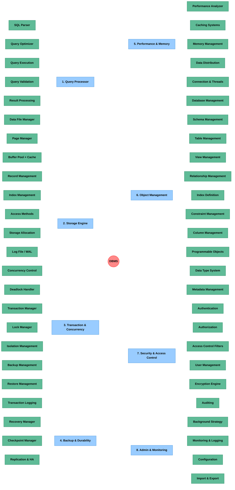

# This overview of DBMS Mindmap

```mermaid
graph LR
    %% Styles cho nền tối (GitHub Dark Mode)
    classDef default fill:#2d2d2d,stroke:#888,stroke-width:1px,color:#fff;
    classDef root fill:#ff8888,stroke:#ff5555,stroke-width:2px,font-weight:bold,color:#000;
    classDef layer1 fill:#99ccff,stroke:#5ba3e3,stroke-width:1.5px,font-weight:bold,color:#000;
    classDef layer2 fill:#5fbb97,stroke:#3a9672,stroke-width:1.5px,font-weight:bold,color:#000;

    %% Tăng độ tương phản cho đường nối liên kết giữa các node
    linkStyle default stroke:#ffffff,stroke-width:1.5px;

    db((DBMS)):::root

    %% ===== BÊN TRÁI (module 1-4) =====

    %% 1. Query Processor
    qp[1. Query Processor]:::layer1 --- db
    qp_sp[SQL Parser]:::layer2 --- qp
    qp_qo[Query Optimizer]:::layer2 --- qp
    qp_qe[Query Execution]:::layer2 --- qp
    qp_qv[Query Validation]:::layer2 --- qp
    qp_rp[Result Processing]:::layer2 --- qp

    %% 2. Storage Engine
    se[2. Storage Engine]:::layer1 --- db
    se_df[Data File Manager]:::layer2 --- se
    se_pm[Page Manager]:::layer2 --- se
    se_bp[Buffer Pool + Cache]:::layer2 --- se
    se_rm[Record Management]:::layer2 --- se
    se_im[Index Management]:::layer2 --- se
    se_am[Access Methods]:::layer2 --- se
    se_sa[Storage Allocation]:::layer2 --- se
    se_lf[Log File / WAL]:::layer2 --- se

    %% 3. Transaction & Concurrency
    tx[3. Transaction & Concurrency]:::layer1 --- db
    tx_cc[Concurrency Control]:::layer2 --- tx
    tx_dl[Deadlock Handler]:::layer2 --- tx
    tx_tm[Transaction Manager]:::layer2 --- tx
    tx_lm[Lock Manager]:::layer2 --- tx
    tx_im[Isolation Management]:::layer2 --- tx

    %% 4. Backup & Durability
    bd[4. Backup & Durability]:::layer1 --- db
    bd_bm[Backup Management]:::layer2 --- bd
    bd_rm[Restore Management]:::layer2 --- bd
    bd_tl[Transaction Logging]:::layer2 --- bd
    bd_re[Recovery Manager]:::layer2 --- bd
    bd_cp[Checkpoint Manager]:::layer2 --- bd
    bd_rp[Replication & HA]:::layer2 --- bd

    %% ===== BÊN PHẢI (module 5-8) =====

    %% 5. Performance & Memory
    db --- pf[5. Performance & Memory]:::layer1
    pf --- pf_qa[Performance Analyzer]:::layer2
    pf --- pf_ch[Caching Systems]:::layer2
    pf --- pf_mm[Memory Management]:::layer2
    pf --- pf_dd[Data Distribution]:::layer2
    pf --- pf_ct[Connection & Threads]:::layer2

    %% 6. Database Object Management
    db --- om[6. Object Management]:::layer1
    om --- om_dm[Database Management]:::layer2
    om --- om_sm[Schema Management]:::layer2
    om --- om_tm[Table Management]:::layer2
    om --- om_vm[View Management]:::layer2
    om --- om_rm[Relationship Management]:::layer2
    om --- om_idx[Index Definition]:::layer2
    om --- om_cm[Constraint Management]:::layer2
    om --- om_com[Column Management]:::layer2
    om --- om_po[Programmable Objects]:::layer2
    om --- om_dt[Data Type System]:::layer2
    om --- om_mm[Metadata Management]:::layer2

    %% 7. Security & Access Control
    db --- sa[7. Security & Access Control]:::layer1
    sa --- sa_au[Authentication]:::layer2
    sa --- sa_az[Authorization]:::layer2
    sa --- sa_ac[Access Control Filters]:::layer2
    sa --- sa_um[User Management]:::layer2
    sa --- sa_ec[Encryption Engine]:::layer2
    sa --- sa_ad[Auditing]:::layer2

    %% 8. Administration & Monitoring
    db --- am[8. Admin & Monitoring]:::layer1
    am --- am_bs[Background Strategy]:::layer2
    am --- am_ml[Monitoring & Logging]:::layer2
    am --- am_cm[Configuration]:::layer2
    am --- am_ie[Import & Export]:::layer2
```