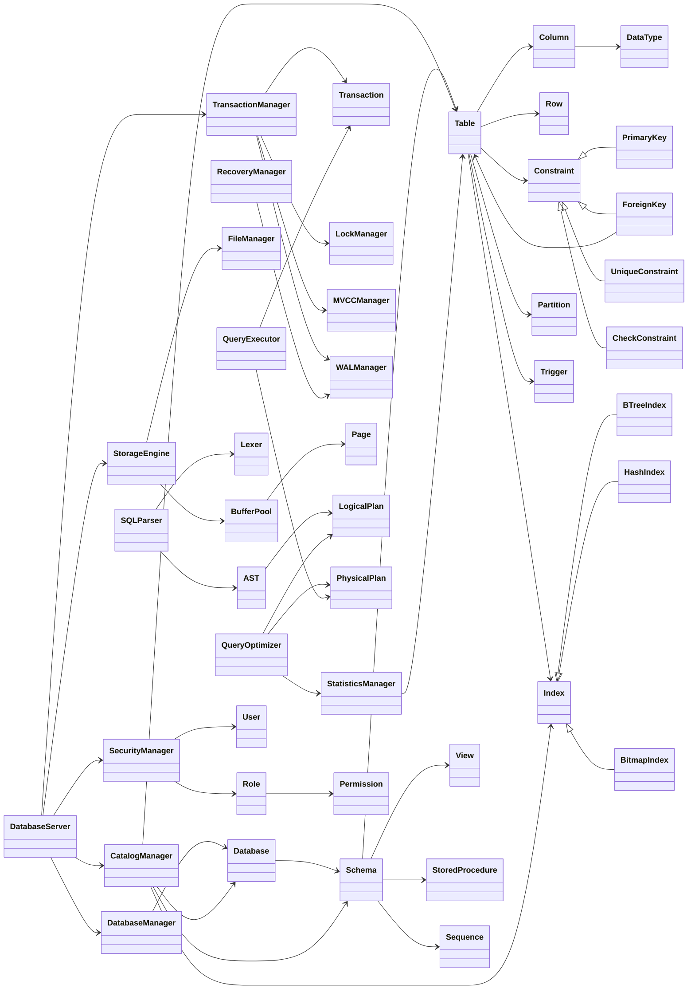
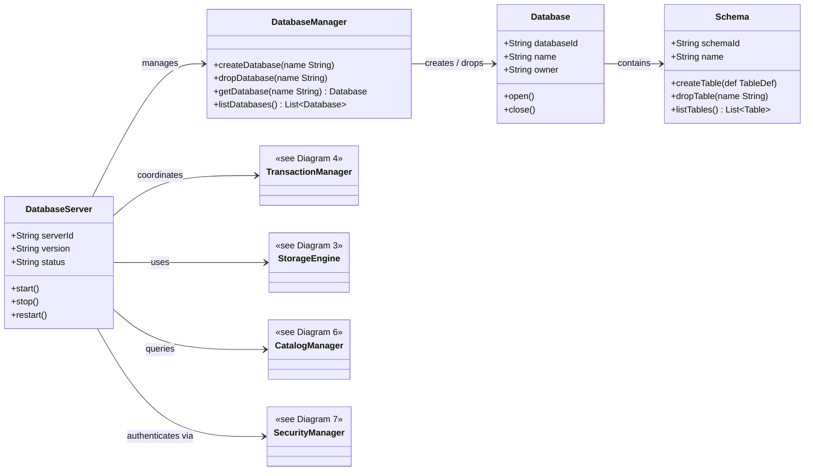
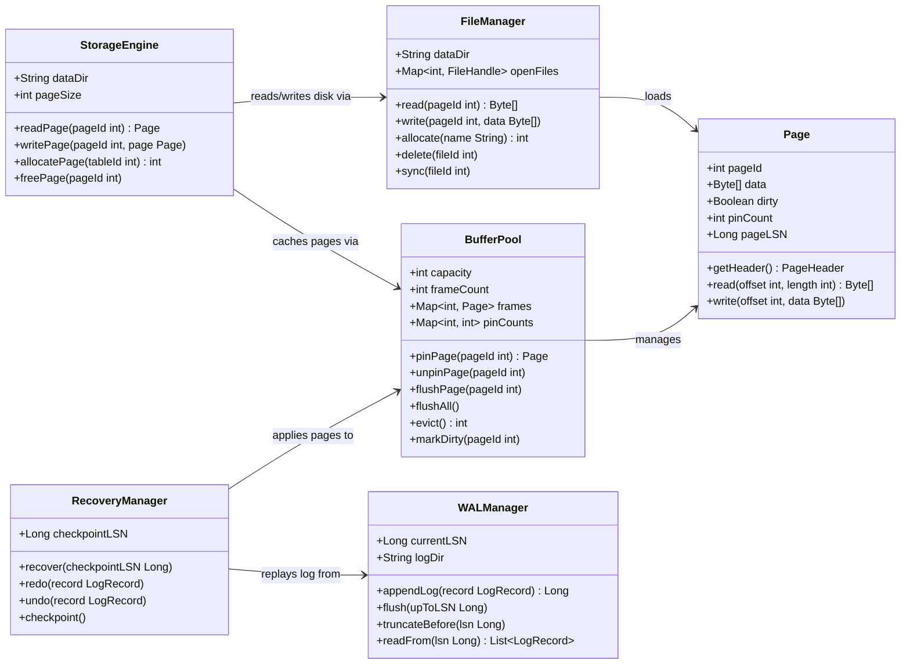
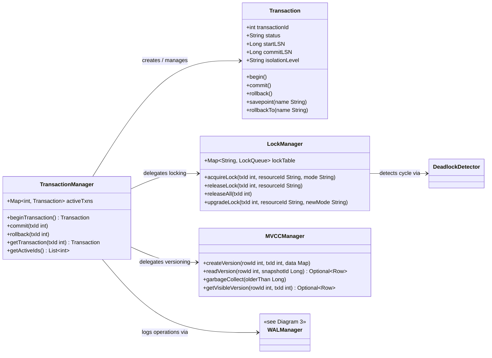
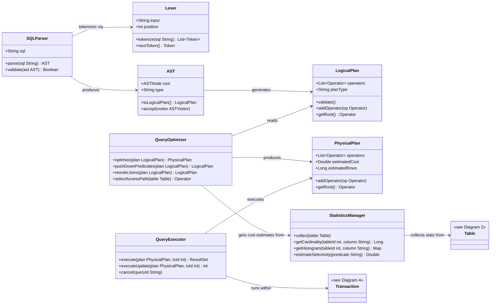
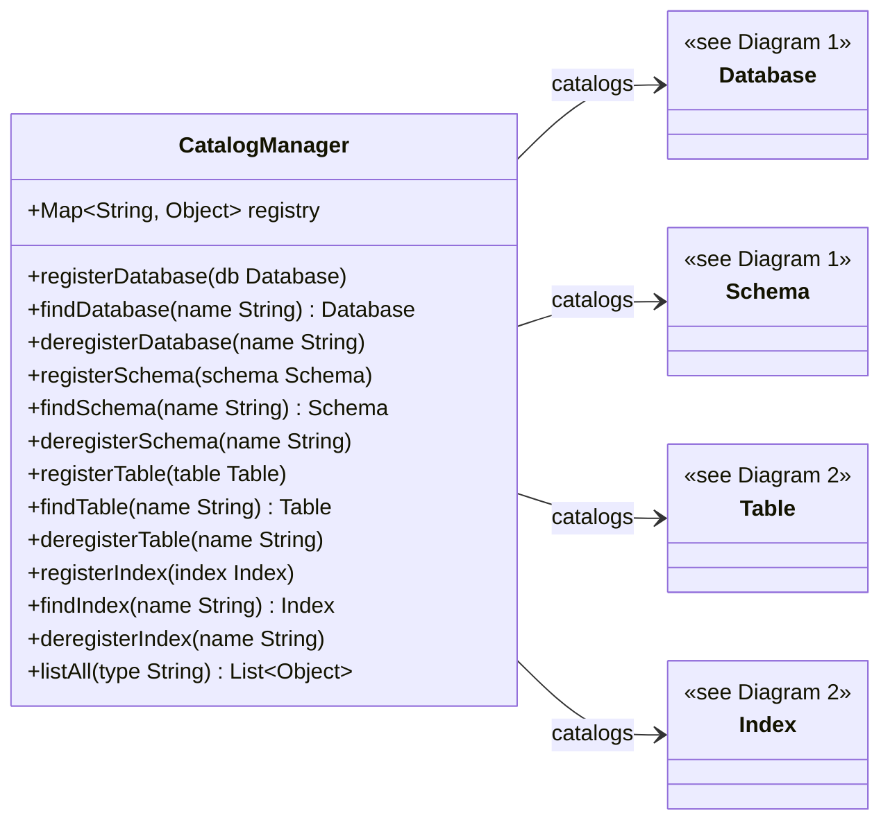
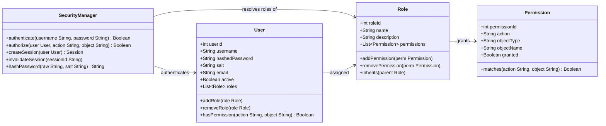

# This overview of DBMS Mindmap

<!-- ```mermaid
graph LR
    %% Styles cho nền tối (GitHub Dark Mode)
    classDef default fill:#2d2d2d,stroke:#888,stroke-width:1px,color:#fff;
    classDef root fill:#ff8888,stroke:#ff5555,stroke-width:2px,font-weight:bold,color:#000;
    classDef layer1 fill:#99ccff,stroke:#5ba3e3,stroke-width:1.5px,font-weight:bold,color:#000;
    classDef layer2 fill:#5fbb97,stroke:#3a9672,stroke-width:1.5px,font-weight:bold,color:#000;

    %% Tăng độ tương phản cho đường nối liên kết giữa các node
    linkStyle default stroke:#ffffff,stroke-width:1.5px;

    db((DBMS)):::root

    %% ===== BÊN TRÁI (module 1-4) =====

    %% 1. Query Processor
    qp[1. Query Processor]:::layer1 --- db
    qp_sp[SQL Parser]:::layer2 --- qp
    qp_qo[Query Optimizer]:::layer2 --- qp
    qp_qe[Query Execution]:::layer2 --- qp
    qp_qv[Query Validation]:::layer2 --- qp
    qp_rp[Result Processing]:::layer2 --- qp

    %% 2. Storage Engine
    se[2. Storage Engine]:::layer1 --- db
    se_df[Data File Manager]:::layer2 --- se
    se_pm[Page Manager]:::layer2 --- se
    se_bp[Buffer Pool + Cache]:::layer2 --- se
    se_rm[Record Management]:::layer2 --- se
    se_im[Index Management]:::layer2 --- se
    se_am[Access Methods]:::layer2 --- se
    se_sa[Storage Allocation]:::layer2 --- se
    se_lf[Log File / WAL]:::layer2 --- se

    %% 3. Transaction & Concurrency
    tx[3. Transaction & Concurrency]:::layer1 --- db
    tx_cc[Concurrency Control]:::layer2 --- tx
    tx_dl[Deadlock Handler]:::layer2 --- tx
    tx_tm[Transaction Manager]:::layer2 --- tx
    tx_lm[Lock Manager]:::layer2 --- tx
    tx_im[Isolation Management]:::layer2 --- tx

    %% 4. Backup & Durability
    bd[4. Backup & Durability]:::layer1 --- db
    bd_bm[Backup Management]:::layer2 --- bd
    bd_rm[Restore Management]:::layer2 --- bd
    bd_tl[Transaction Logging]:::layer2 --- bd
    bd_re[Recovery Manager]:::layer2 --- bd
    bd_cp[Checkpoint Manager]:::layer2 --- bd
    bd_rp[Replication & HA]:::layer2 --- bd

    %% ===== BÊN PHẢI (module 5-8) =====

    %% 5. Performance & Memory
    db --- pf[5. Performance & Memory]:::layer1
    pf --- pf_qa[Performance Analyzer]:::layer2
    pf --- pf_ch[Caching Systems]:::layer2
    pf --- pf_mm[Memory Management]:::layer2
    pf --- pf_dd[Data Distribution]:::layer2
    pf --- pf_ct[Connection & Threads]:::layer2

    %% 6. Database Object Management
    db --- om[6. Object Management]:::layer1
    om --- om_dm[Database Management]:::layer2
    om --- om_sm[Schema Management]:::layer2
    om --- om_tm[Table Management]:::layer2
    om --- om_vm[View Management]:::layer2
    om --- om_rm[Relationship Management]:::layer2
    om --- om_idx[Index Definition]:::layer2
    om --- om_cm[Constraint Management]:::layer2
    om --- om_com[Column Management]:::layer2
    om --- om_po[Programmable Objects]:::layer2
    om --- om_dt[Data Type System]:::layer2
    om --- om_mm[Metadata Management]:::layer2

    %% 7. Security & Access Control
    db --- sa[7. Security & Access Control]:::layer1
    sa --- sa_au[Authentication]:::layer2
    sa --- sa_az[Authorization]:::layer2
    sa --- sa_ac[Access Control Filters]:::layer2
    sa --- sa_um[User Management]:::layer2
    sa --- sa_ec[Encryption Engine]:::layer2
    sa --- sa_ad[Auditing]:::layer2

    %% 8. Administration & Monitoring
    db --- am[8. Admin & Monitoring]:::layer1
    am --- am_bs[Background Strategy]:::layer2
    am --- am_ml[Monitoring & Logging]:::layer2
    am --- am_cm[Configuration]:::layer2
    am --- am_ie[Import & Export]:::layer2
``` -->


---

## Diagram 0 — Full Dependency Overview

> Tổng quan toàn bộ hệ thống — xem chi tiết từng nhóm tại Diagram 1–7.



---

## Diagram 1 — Server & Database Management

> `DatabaseServer` là entry point khởi động toàn bộ hệ thống. `DatabaseManager` quản lý vòng đời database. `Database` và `Schema` là container chứa mọi đối tượng dữ liệu.



---

## Diagram 2 — Database Objects

> Cấu trúc dữ liệu cốt lõi: Table, Column, Constraint, Index và các đối tượng lập trình (View, Procedure, Trigger, Sequence, Partition).

```mermaid
classDiagram
direction TB

    %% ── Core Table Objects ───────────────────────────────
    class Table {
        +int tableId
        +String name
        +String schemaId
        +insert(row Row)
        +update(rowId int, values Map)
        +delete(rowId int)
        +truncate()
    }

    class Column {
        +int columnId
        +String name
        +DataType dataType
        +Boolean nullable
        +Object defaultValue
        +validate(value Object) Boolean
    }

    class Row {
        +int rowId
        +Map~String, Object~ values
        +int version
        +Long createdBy
        +Long deletedBy
    }

    class DataType {
        <<enumeration>>
        INTEGER
        BIGINT
        VARCHAR
        TEXT
        BOOLEAN
        DATE
        TIMESTAMP
        FLOAT
        DOUBLE
        DECIMAL
        BLOB
    }

    %% ── Constraints ──────────────────────────────────────
    class Constraint {
        <<abstract>>
        +int constraintId
        +String name
        +String type
        +validate(row Row) Boolean
        +isEnabled() Boolean
        +enable()
        +disable()
    }

    class PrimaryKey {
        +int constraintId
        +String name
        +List~String~ columns
        +validate(row Row) Boolean
    }

    class ForeignKey {
        +int constraintId
        +String name
        +String referenceTable
        +List~String~ referenceColumns
        +String onDelete
        +String onUpdate
        +validate(row Row) Boolean
    }

    class UniqueConstraint {
        +int constraintId
        +String name
        +List~String~ columns
        +validate(row Row) Boolean
    }

    class CheckConstraint {
        +int constraintId
        +String name
        +String expression
        +validate(row Row) Boolean
    }

    %% ── Indexes ──────────────────────────────────────────
    class Index {
        <<abstract>>
        +int indexId
        +String name
        +List~String~ columns
        +Boolean isUnique
        +search(key Object) Optional~int~
        +insertKey(key Object, rowId int)
        +deleteKey(key Object)
        +rebuild()
    }

    class BTreeIndex {
        +int indexId
        +String name
        +int degree
        +search(key Object) Optional~int~
        +insertKey(key Object, rowId int)
        +deleteKey(key Object)
        +rangeScan(from Object, to Object) List~int~
        +rebuild()
    }

    class HashIndex {
        +int indexId
        +String name
        +int bucketCount
        +search(key Object) Optional~int~
        +insertKey(key Object, rowId int)
        +deleteKey(key Object)
        +rebuild()
    }

    class BitmapIndex {
        +int indexId
        +String name
        +List~String~ distinctValues
        +search(key Object) Optional~int~
        +insertKey(key Object, rowId int)
        +deleteKey(key Object)
        +rebuild()
    }

    %% ── Other Database Objects ───────────────────────────
    class Partition {
        +int partitionId
        +String name
        +String partitionKey
        +String method
        +String expression
        +route(row Row) int
    }

    class View {
        +int viewId
        +String name
        +String queryDefinition
        +Boolean isMaterialized
        +refresh()
    }

    class StoredProcedure {
        +int procedureId
        +String name
        +List~String~ parameters
        +String body
        +execute(params Map) Object
        +compile()
    }

    class Trigger {
        +int triggerId
        +String name
        +String timing
        +String event
        +String body
        +Boolean enabled
        +fire(row Row)
        +enable()
        +disable()
    }

    class Sequence {
        +int sequenceId
        +String name
        +Long currentValue
        +Long increment
        +Long minValue
        +Long maxValue
        +Boolean cycle
        +nextValue() Long
        +reset(value Long)
    }

    %% ── Relationships ────────────────────────────────────
    Table --> Column       : has
    Table --> Row          : stores
    Table --> Constraint   : enforces
    Table --> Index        : indexed by
    Table --> Partition    : partitioned into
    Table --> Trigger      : fired by

    Column --> DataType    : typed as

    Constraint <|-- PrimaryKey
    Constraint <|-- ForeignKey
    Constraint <|-- UniqueConstraint
    Constraint <|-- CheckConstraint

    ForeignKey --> Table   : references

    Index <|-- BTreeIndex
    Index <|-- HashIndex
    Index <|-- BitmapIndex
```



---

## Diagram 3 — Storage Engine

> Tầng lưu trữ vật lý: đọc/ghi page từ đĩa, quản lý buffer pool, WAL log và recovery.



---

## Diagram 4 — Transaction & Concurrency

> Đảm bảo tính ACID: quản lý giao dịch, lock, phát hiện deadlock và MVCC phiên bản dữ liệu.



---

## Diagram 5 — Query Processor

> Pipeline xử lý SQL: tokenize → parse → build AST → optimize → execute → return result.



---

## Diagram 6 — Catalog & Metadata

> Tầng catalog tập trung: lưu và tra cứu metadata của mọi đối tượng trong hệ thống (Database, Schema, Table, Index).



---

## Diagram 7 — Security

> Tầng bảo mật: xác thực người dùng (Authentication), phân quyền (Authorization) và kiểm soát truy cập qua User/Role/Permission.



---

# Unit Test Specifications

---

## Group 1 — Database Object Management

### MetadataCatalog
* `LookupTable_Existing_ReturnsTableDef`
* `LookupColumn_Existing_ReturnsColumnDef`
* `UpdateMeta_ShouldPersistChangeToCatalogStore`
* `DeleteMeta_ShouldRemoveEntryFromCatalog`

### CatalogObject
* `Equals_TwoObjectsSameId_ReturnsTrue`

### ObjectId
* `Generate_UniqueAcrossCatalog_ReturnsUniqueId`

### SchemaManager
* `CreateSchema_ValidDefinition_AddsToCatalog`
* `ResolveSchema_Existing_ReturnsSchemaObject`
* `RenameSchema_UpdatesAllDependentObjects`
* `DropSchema_RemovesAllChildObjectsFromCatalog`

### Schema
* `AddTable_ShouldAppearInTableList`
* `DropTable_ShouldRemoveFromTableList`
* `CreateView_ShouldRegisterViewInSchema`
* `CreateProcedure_ShouldRegisterProcedureInSchema`
* `ValidateDuplicateObjectName_ShouldThrow`

### TableManager
* `CreateTable_WithColumns_AddsTableToCatalog`
* `AlterTable_AddColumn_UpdatesTableDefAndPhysicalStorage`
* `DropTable_RemovesCatalogAndPhysicalPages`

### Table
* `InsertRow_ShouldIncreaseRowCount`
* `UpdateRow_ShouldModifyExistingData`
* `DeleteRow_ShouldDecreaseRowCount`
* `Truncate_ShouldRemoveAllRowsAndResetSpace`
* `AddColumn_ShouldUpdateSchemaAndStorage`
* `RemoveColumn_ShouldInvalidateDependentIndexes`
* `AddConstraint_ShouldEnforceOnNextWrite`
* `DropConstraint_ShouldAllowPreviouslyBlockedData`
* `CreateIndex_ShouldBuildIndexStructureOnExistingData`
* `DropIndex_ShouldRemoveIndexAndFreeSpace`
* `CreatePartition_ShouldRouteDataToCorrectPartition`
* `RebuildIndexes_ShouldProduceConsistentIndexState`
* `Clone_DeepCopy_ReturnsIndependentTableDef`

### Column
* `ValidateNullable_NullInNotNullColumn_ShouldThrow`
* `ValidateDataType_MismatchedType_ShouldThrow`
* `ValidateLength_ExceedsMaxLength_ShouldThrow`
* `ApplyDefaultValue_WhenNoValueProvided_ShouldInsertDefault`
* `ChangeDataType_ShouldMigrateExistingDataOrThrow`
* `EvaluateComputedColumn_ShouldReturnDerivedValue`

### Row
* `CreateRow_ShouldAssignUniqueRID`
* `CloneVersion_ShouldCreateIndependentMVCCVersion`
* `Serialize_ThenDeserialize_ShouldProduceIdenticalRow`
* `CalculateRowSize_ShouldMatchPhysicalStorageUsage`
* `CompareRows_SameData_ShouldReturnEqual`

### ConstraintManager
* `AddPrimaryKey_ValidColumns_SetsUniqueConstraint`
* `AddForeignKey_ValidReference_EnforcesReferentialIntegrity`
* `ValidateInsert_WithConstraintViolations_ThrowsConstraintException`

### Constraint
* `ValidatePrimaryKey_DuplicateValue_ShouldThrow`
* `ValidateUnique_DuplicateValue_ShouldThrow`
* `ValidateForeignKey_NoParentRow_ShouldThrow`
* `ValidateCheckConstraint_ViolatedExpression_ShouldThrow`
* `CascadeDelete_ShouldRemoveDependentChildRows`
* `CascadeUpdate_ShouldPropagateKeyChange`
* `DisableConstraint_ShouldAllowViolatingInsert`
* `EnableConstraint_WithExistingViolation_ShouldThrow`

### IndexManager
* `CreateIndex_OnColumn_AddsIndexDefAndBuildsStructure`
* `DropIndex_RemovesDefAndPhysicalStructure`

### Index
* `Search_ExistingKey_ShouldReturnCorrectRID`
* `Search_NonExistingKey_ShouldReturnEmpty`
* `InsertKey_CausingNodeSplit_ShouldMaintainOrder`
* `DeleteKey_CausingUnderflow_ShouldRebalance`
* `RangeScan_ShouldReturnAllKeysInRange`
* `Rebuild_ShouldProduceConsistentStructure`
* `EstimateSelectivity_ShouldReturnReasonableCardinality`
* `UpdateStatistics_ShouldUpdateCostEstimates`

### BPlusTree
* `Insert_KeyCausesLeafSplit_CreatesNewRoot`
* `Search_ExistingKey_ReturnsCorrectLeafNode`
* `Search_NonExistingKey_ReturnsNull`
* `Delete_KeyLeavesNodeUnderflow_PerformsMergeOrBorrow`

### HashIndex
* `Insert_DuplicateKey_ThrowsDuplicateKeyException`
* `Lookup_ExistingKey_ReturnsRidList`
* `Delete_ExistingKey_RemovesEntry`

### Partition
* `RouteInsert_ShouldGoToCorrectPartition`
* `MovePartition_ShouldRelocateDataWithoutLoss`
* `QueryAcrossPartitions_ShouldMergeResults`

---

## Group 2 — Programmable Objects

### View
* `CreateView_ValidDefinition_ShouldResolveAgainstBaseTables`
* `QueryView_ShouldReturnLiveDataFromBaseTables`
* `DropView_ShouldNotAffectBaseTables`
* `ValidateDefinition_ReferencesNonExistentTable_ShouldThrow`

### StoredProcedure
* `Compile_ValidBody_ShouldCachePlan`
* `Execute_WithValidParameters_ShouldReturnExpectedResult`
* `Execute_WithInvalidParameters_ShouldThrow`
* `HandleException_WithinBody_ShouldRollbackAndPropagate`

### Trigger
* `BeforeInsert_ShouldFireBeforeRowIsWritten`
* `AfterInsert_ShouldFireAfterRowIsCommitted`
* `BeforeUpdate_ShouldAllowModifyingNewValues`
* `AfterDelete_ShouldCascadeToAuditLog`
* `DisableTrigger_ShouldSkipFiringOnDML`
* `EnableTrigger_ShouldResumeNormalFiring`

---

## Group 3 — Server & Database Lifecycle

### DatabaseServer
* `StartServer_ShouldInitializeAllServices`
* `StopServer_ShouldShutdownGracefully`
* `RecoverAfterCrash_ShouldReplayWAL`
* `RejectDuplicateDatabaseName`

### DatabaseManager
* `CreateDatabase_ValidName_AddsToSystemCatalog`
* `DropDatabase_Existing_RemovesCatalogEntriesAndPhysicalFiles`
* `GetDatabase_ReturnsCorrectMetadata`

### Database
* `Open_ShouldLoadStorageAndCatalog`
* `Close_ShouldFlushAllDirtyBuffers`
* `Drop_ShouldRemoveAllMetadataAndFiles`
* `Exists_ReturnsTrueForExistingName`

---

## Group 4 — Storage Engine

### DiskManager
* `Initialize_NewDatabase_CreatesDataFiles`
* `ReadPage_ValidPageId_ReturnsRawBytes`
* `ReadPage_InvalidPageId_ThrowsFileNotFoundException`
* `WritePage_ValidPageId_WritesBytesCorrectly`

### TablespaceManager
* `AllocateTablespace_WithinQuota_ReturnsTablespaceId`
* `AllocateTablespace_ExceedsQuota_ThrowsQuotaExceededException`

### SpaceManager / ExtentManager / SegmentManager
* `AllocateExtent_WhenFreeSpaceAvailable_ReturnsExtentId`
* `FreeExtent_ValidId_MarksAsFree`
* `AllocateSegment_WithinLimits_ReturnsSegmentId`
* `AllocatePage_InSegment_ReturnsPageId`

### PageFormatter
* `Format_NewRawPage_SetsHeaderCorrectly`
* `AddTuple_ToFormattedPage_UpdatesSlotArrayAndFreeSpace`
* `AddTuple_InsufficientSpace_ThrowsPageOverflowException`

### PageManager
* `GetPage_FromCacheOrDisk_ReturnsFormattedPage`
* `FlushDirtyPage_WritesToDisk_AndClearsDirtyFlag`

### PageHeader
* `ParseHeader_FromRawBytes_ReturnsCorrectValues`

### RecordManager
* `SerializeTuple_CorrectByteLayout`
* `DeserializeRecord_ValidBytes_ReturnsEquivalentTuple`

### RIDGenerator
* `Generate_UniqueAcrossThreads_ReturnsUniqueRID`

---

## Group 5 — Buffer Pool & Cache

### BufferPoolManager
* `FetchPage_NotInCache_LoadsFromDiskAndPins`
* `FetchPage_InCache_IncrementsPinCount`
* `UnpinPage_PinCountZero_LeavesPageUnpinned`
* `UnpinPage_DirtyPage_MarksAsDirty`
* `EvictPage_WhenCapacityFull_EvictsLeastRecentlyUsed`
* `FlushAll_WritesOnlyDirtyPages`

### LRUPolicy
* `SelectVictim_AfterMultipleAccesses_ReturnsLeastRecentlyUsed`

### ClockPolicy
* `SelectVictim_ReferenceBitHandling_EvictsCorrectPage`

### LRUCache
* `Get_AddsToCache_AndEvictsOldestWhenFull`

---

## Group 6 — WAL & Recovery

### WALManager
* `AppendLogRecord_ValidRecord_AppendsToBuffer`
* `AppendLogRecord_BufferFull_TriggersFlush`

### LogWriter
* `Flush_EmptyBuffer_DoesNothing`
* `Flush_NonEmptyBuffer_WritesToDiskAndUpdatesLSN`

### LSNGenerator
* `Next_IncrementsMonotonically_ReturnsHigherLSN`

---

## Group 7 — Transaction & Concurrency

### TransactionManager
* `BeginTransaction_ReturnsActiveContext`
* `CommitTransaction_WithAllLocks_ReleasesLocksAndMarksCommitted`
* `AbortTransaction_RollsBackChanges_AndReleasesLocks`
* `CommitTransaction_WhenDeadlockDetected_ThrowsDeadlockException`

### Transaction
* `CommitChanges_ShouldPersistAllWrites`
* `RollbackChanges_ShouldUndoAllWrites`
* `CreateSavepoint_ShouldMarkPartialRollbackPoint`
* `RollbackToSavepoint_ShouldUndoOnlyPostSavepointChanges`
* `SetIsolationLevel_ShouldAffectVisibility`
* `Timeout_ShouldAutoRollback`

### TransactionTable
* `AddTransaction_NewEntry_AppearInActiveList`
* `RemoveTransaction_WhenCommittedOrAborted_NotPresentInActiveList`

### TransactionContext
* `Equals_TwoContextsWithSameId_ReturnsTrue`

### LockManager
* `AcquireSharedLock_WhenNoConflict_GrantsImmediately`
* `AcquireExclusiveLock_WhenSharedExists_WaitsInQueue`
* `ReleaseLock_TriggersNextWaitingTransaction`
* `UpgradeLock_FromSharedToExclusive_IfNoOtherShared_Grants`

### LockQueue
* `Enqueue_WhenLockBusy_AddsToQueueInOrder`
* `Dequeue_AfterRelease_RemovesFirstInQueue`

### MVCCManager
* `CreateVersion_OnUpdate_GeneratesNewVersionChainNode`
* `ReadVisibleVersion_ForSnapshot_ReturnsCorrectVersion`
* `CleanupObsoleteVersions_AfterCheckpoint_RemovesOldVersions`

### SnapshotManager
* `CreateSnapshot_IncludesAllActiveTxIds`
* `IsVisible_VisibleForCommittedTx_ReturnsTrue`
* `IsVisible_InvisibleForFutureTx_ReturnsFalse`

### DeadlockDetector
* `DetectCycle_WithTwoTx_ReturnsTrueAndVictimChosen`
* `ResolveDeadlock_KillsVictimAndUnblocksOtherTx`

---

## Group 8 — Query Processing

### SqlParser
* `Parse_ValidSelectStatement_ReturnsValidAst`
* `Parse_SelectWithJoin_ReturnsAstContainingJoinNode`
* `Parse_InvalidSyntax_ThrowsSqlSyntaxException`
* `Parse_LexicalTokens_CorrectlyIdentifiesKeywordsAndIdentifiers`

### ASTNode
* `Equals_SameStructure_ReturnsTrue`

### Token
* `IsKeyword_ReturnsTrueForSelect`

### QueryValidator
* `Validate_ValidAst_AcceptsWithoutError`
* `Validate_UnknownTable_ThrowsSqlException`
* `Validate_ColumnTypeMismatch_ThrowsSqlException`

### QueryOptimizer
* `ApplyRule_PredicatePushdown_MovesFilterBelowScan`
* `ApplyRule_JoinReordering_ChoosesCheapestJoinOrder`
* `EstimateCost_IndexAvailable_ReturnsLowerCostThanSeqScan`
* `GeneratePhysicalPlan_FromLogicalPlan_ProducesExecutionPlan`

### CostModel
* `CalculateCost_ForLogicalPlan_ReturnsExpectedValue`

### LogicalPlan
* `Validate_NoCycles_InPlanGraph`

### ExecutionPlan
* `Clone_DeepCopy_ReturnsIndependentCopy`

### ExecutionEngine
* `Execute_SequentialScan_ReturnsAllRows`
* `Execute_HashJoin_CorrectlyMatchesRows`
* `Execute_Projection_OutputsOnlySelectedColumns`
* `Execute_Aggregation_GroupByCorrectResult`
* `Execute_SortOperator_SortsRowsAccordingToOrderBy`

### TableScan
* `Initialize_EmptyTable_ReturnsNoRows`
* `Next_IteratesAllRows_InOrder`

### IndexScan
* `Initialize_WithBTreeIndex_ReturnsRowsInKeyOrder`

### ResultProcessor
* `ProcessResultSet_ToResultCursor_ReturnsCursorWithCorrectMetadata`
* `FormatResult_WithJsonFormatter_ReturnsValidJson`

---

## Group 9 — Security & Access Control

### AuthenticationManager
* `Authenticate_ValidCredentials_ReturnsSession`
* `Authenticate_InvalidPassword_ThrowsAuthenticationException`
* `HashPassword_ProducesDeterministicHash_WithSalt`

### AuthorizationManager
* `Authorize_UserHasPermission_ReturnsTrue`
* `Authorize_UserMissingPermission_ThrowsPermissionDeniedException`
* `CheckRoleHierarchy_InheritedPermissions_AreEffectivePermissions`

### Session
* `IsActive_AfterLogout_ReturnsFalse`

### RoleId / UserId
* `Equals_SameGuid_ReturnsTrue`

---

## Group 10 — Operations & Infrastructure

### StatisticsManager
* `CollectStatistics_ShouldPopulateHistogram`
* `EstimateCardinality_ShouldInfluenceOptimizerChoice`
* `RefreshStatistics_AfterBulkInsert_ShouldUpdateRowCount`

### BackupManager
* `FullBackup_ShouldCopyAllDataAndCatalogFiles`
* `RestoreBackup_ShouldProduceSameDatabaseState`
* `IncrementalBackup_ShouldOnlyCopyChangedPages`
* `VerifyBackup_CorruptedFile_ShouldThrow`

### ReplicationManager
* `ReplicateLog_ShouldApplyWALToReplica`
* `Failover_ShouldPromoteReplicaToLeader`
* `Heartbeat_WhenPrimaryDown_ShouldTriggerElection`
* `SynchronizeReplica_ShouldCatchUpLaggedNode`

### MonitoringManager
* `CollectMetrics_AfterQuery_ShouldRecordExecutionTime`
* `DetectSlowQuery_ExceedsThreshold_ShouldRaiseAlert`
* `CaptureDeadlock_ShouldLogInvolvedTransactions`

### ConnectionPool
* `AcquireConnection_WhenPoolNotFull_ShouldReturnConnection`
* `ReuseConnection_AfterRelease_ShouldNotCreateNew`
* `EvictIdleConnection_ExceedsTimeout_ShouldClose`
* `MaxPoolSize_AllConnectionsInUse_ShouldBlockOrThrow`

---

# Integration Test Specifications

| ID | Test Group / Scenario | Key Components Involved | Success Criteria |
| :--- | :--- | :--- | :--- |
| **1** | **Startup / Database Lifecycle**<br>_Create‑Open‑Close‑Drop Database_ | DatabaseManager, DiskManager, TablespaceManager, BufferPoolManager, WALManager | • Database directory and system‑catalog files are created.<br>• On open, catalog is loaded without errors.<br>• After close, all dirty pages are flushed and WAL is checkpointed.<br>• Drop removes all physical files and releases any allocated buffers. |
| **2** | **Schema Management**<br>_Create Schema → Create Table → Create Index → Drop Index → Drop Table → Drop Schema_ | SchemaManager, TableManager, IndexManager, MetadataCatalog, BufferPoolManager, BPlusTree | • All catalog entries exist after each creation step.<br>• Index structure is built and searchable.<br>• Dropping an index removes its physical pages and catalog entry.<br>• Dropping the table removes its pages, index pages, and updates the catalog.<br>• No orphaned files remain on disk. |
| **3** | **Basic DML Flow**<br>_INSERT → SELECT → UPDATE → DELETE (single‑table, no indexes)_ | SqlParser, QueryValidator, ExecutionEngine, TransactionManager, RecordManager, BufferPoolManager, WALManager | • INSERT writes a new tuple, WAL records the operation, and page becomes dirty.<br>• SELECT returns the inserted row.<br>• UPDATE modifies the row, creates a new MVCC version, and logs the change.<br>• DELETE marks the tuple as deleted (tombstone) and logs it.<br>• After a commit, data is persisted on disk and visible to a new transaction. |
| **4** | **Index‑Driven DML**<br>_INSERT + SELECT with Index Scan (B+Tree index on primary key)_ | SqlParser, QueryValidator, ExecutionEngine, BPlusTree, BufferPoolManager, WALManager | • INSERT updates the B+Tree leaf nodes correctly (split if needed).<br>• SELECT using WHERE pk = ? triggers an IndexScan and returns the correct tuple in $O(\log N)$ page reads.<br>• The number of I/O operations matches the expected tree depth. |
| **5** | **Complex Query**<br>_JOIN + FILTER + PROJECTION + ORDER BY (two tables, one indexed)_ | SqlParser, QueryValidator, QueryOptimizer, ExecutionEngine, BPlusTree, HashIndex, ResultProcessor, BufferPoolManager | • Optimizer rewrites the logical plan (predicate push‑down, join reordering).<br>• Physical plan uses an IndexScan on the indexed table, a HashJoin on the join key, and a Sort operator for the final ordering.<br>• Result set matches the expected row count and ordering. |
| **6** | **Transaction Isolation (MVCC)**<br>_Concurrent Readers & Writers (Snapshot Isolation)_ | TransactionManager, MVCCManager, LockManager, SnapshotManager, ExecutionEngine, BufferPoolManager, WALManager | • Transaction A (reader) starts and takes a snapshot.<br>• Transaction B (writer) updates the same rows and commits.<br>• Transaction A's subsequent SELECT still sees the pre‑commit version (no dirty reads).<br>• After A commits, a new transaction sees the post‑commit version. |
| **7** | **Deadlock Detection & Resolution**<br>_Two‑Transaction Circular Wait_ | TransactionManager, LockManager, DeadlockDetector, WALManager | • Tx 1 acquires an exclusive lock on Table X, then requests a lock on Table Y.<br>• Tx 2 acquires an exclusive lock on Table Y, then requests a lock on Table X.<br>• Deadlock detector identifies the cycle, aborts the victim (the younger transaction), and releases its locks.<br>• The survivor transaction completes successfully. |
| **8** | **Recovery (WAL + Checkpoint)**<br>_Crash‑Recovery Scenario_ | WALManager, LogWriter, LSNGenerator, TransactionManager, RecoveryManager, DiskManager, BufferPoolManager | 1. Begin a transaction, perform several INSERT/UPDATE operations (WAL records are written).<br>2. Force a checkpoint – all dirty pages flushed, WAL checkpoint record written.<br>3. Simulate a crash (process termination) without a clean shutdown.<br>4. Restart DBMS → Recovery manager reads WAL from the last checkpoint LSN, re‑applies REDO for committed transactions and UNDO for incomplete ones.<br>5. After recovery the database state matches the state at the moment of the last successful commit. |
| **9** | **Backup & Restore**<br>_Full Physical Backup → Restore to New Instance_ | BackupManager (if present), DiskManager, TablespaceManager, MetadataCatalog | • A full backup copies all data files, tablespace files, and catalog files to a backup directory.<br>• Restoring copies the backup set into a new data directory and starts the DBMS pointing at that directory.<br>• After restore, a simple SELECT on a known table returns the exact same data as before the backup. |
| **10** | **Security / Access Control**<br>_Authentication → Authorization → Operation_ | AuthenticationManager, AuthorizationManager, Session, TransactionManager, ExecutionEngine | • Valid user credentials produce a session token.<br>• The session's role grants SELECT on Table A but not DELETE.<br>• An attempt to DELETE rows on Table A fails with PermissionDeniedException.<br>• Changing the role to include DELETE and re‑authenticating allows the operation. |
| **11** | **Performance‑Metrics Collection**<br>_Run a Query and Verify Metrics are Logged_ | PerformanceMetricsCollector, ExecutionEngine, LogWriter, WALManager | • After a query finishes, the metrics collector records execution time, rows read, pages fetched, and CPU usage.<br>• A log entry containing these metrics appears in the system log file. |
| **12** | **Parallel Bulk Load**<br>_COPY / Bulk INSERT of 1M rows_ | CsvImporter (or similar), TransactionManager, BufferPoolManager, WALManager, BPlusTree | • Bulk load runs inside a single transaction.<br>• All rows are inserted, index is built (or updated) incrementally.<br>• After commit, a SELECT verifies the exact row count.<br>• Duration and I/O statistics are within expected thresholds (e.g., < 30 s on a test dataset). |
| **13** | **Distributed Query**<br>_Partitioned Scan + Remote Execution_ | PartitionRouter, RemoteExecutionManager, ExecutionEngine, BufferPoolManager | • Table is partitioned across two logical nodes.<br>• A query with a filter that touches both partitions is dispatched.<br>• Each node scans its local pages, returns a partial result set.<br>• The coordinator merges the partial results and returns the final set.<br>• Result matches a single‑node execution baseline. |
