# DBMS Core Architecture Flowchart

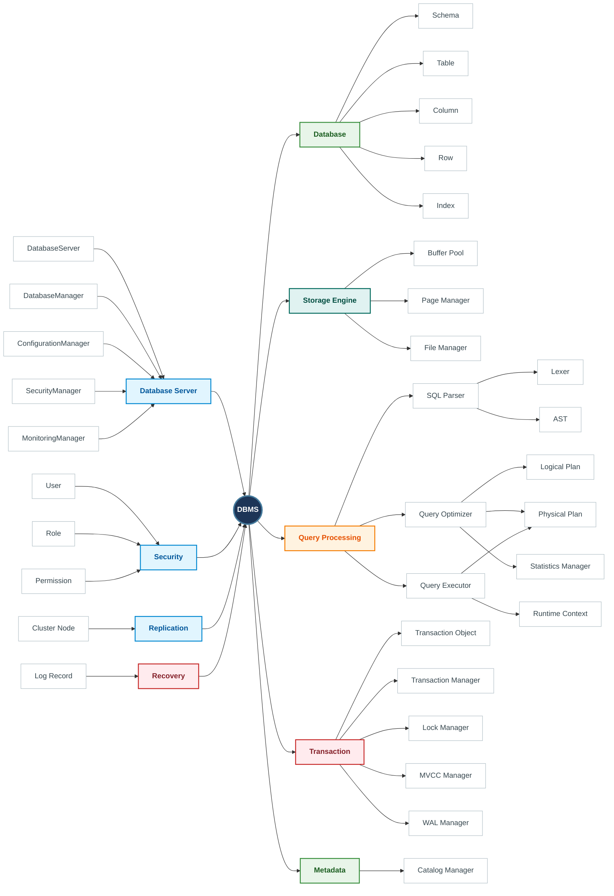

# This overview of DBMS Mindmap

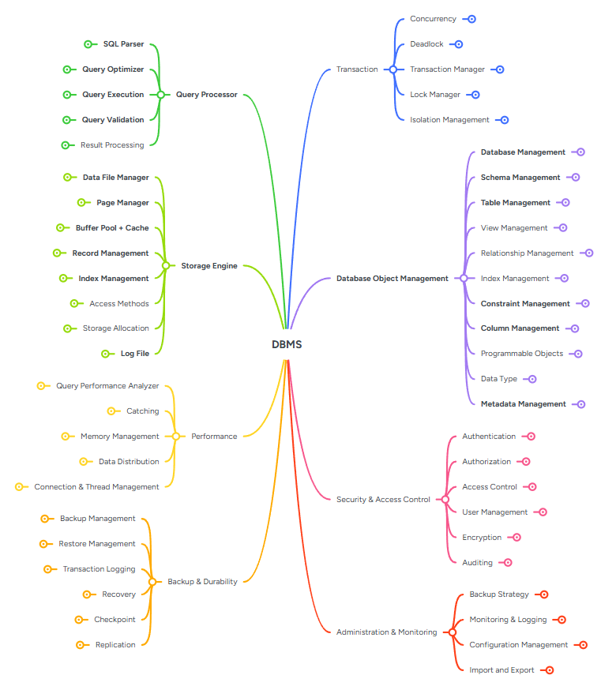

## Diagram — Full Dependency Overview (Cross-Layer)

```mermaid
classDiagram
direction LR
%% =====================================================
%% Server
%% =====================================================
class DatabaseServer {
    +ServerId : int
    +Version : string
    +Status : ServerStatus
    +Start()
    +Stop()
    +Restart()
}
class DatabaseManager {
    -catalog : CatalogManager
    +CreateDatabase(name : string)
    +DropDatabase(name : string)
    +GetDatabase(name : string) Database
    +ListDatabases() List~Database~
}
%% =====================================================
%% Database Objects (Pure Domain Models)
%% =====================================================
class Database {
    +DatabaseId : int
    +Name : string
    +Owner : string
    +Schemas : List~Schema~
}
class Schema {
    +SchemaId : int
    +Name : string
    +Tables : List~Table~
    +Views : List~View~
    +Procedures : List~StoredProcedure~
    +Sequences : List~Sequence~
}
%% =====================================================
%% Domain Services (Business Logic on Domain Objects)
%% =====================================================
class SchemaService {
    -catalog : CatalogManager
    -storage : StorageEngine
    +CreateTable(schema : Schema, def : TableDef) Table
    +DropTable(schema : Schema, name : string)
    +CreateView(schema : Schema, name : string, query : string) View
    +DropView(schema : Schema, name : string)
}
note for SchemaService "DDL service — orchestrates CatalogManager\n+ StorageEngine to create/drop objects"
class RecordManager {
    -storage : StorageEngine
    -catalog : CatalogManager
    +Insert(table : Table, row : Row) RID
    +Update(table : Table, rid : RID, row : Row)
    +Delete(table : Table, rid : RID)
    +Read(table : Table, rid : RID) Row
    +Scan(table : Table) List~Row~
}
note for RecordManager "DML service — translates Row operations\ninto StorageEngine page reads/writes"
class Table {
    +TableId : int
    +Name : string
    +Columns : List~Column~
    +Constraints : List~Constraint~
    +Indexes : List~Index~
    +Partitions : List~Partition~
    +Triggers : List~Trigger~
}
class Column {
    +ColumnId : int
    +Name : string
    +DataType : DataType
    +Nullable : bool
    +DefaultValue : object
}
class Row {
    +RowId : RID
    +Data : RecordData
    +Version : long
}
class RecordData {
    <<value object>>
    +Bytes : Byte[]
    +Length : int
}
class RID {
    <<value object>>
    +PageId : int
    +SlotNumber : int
    +Equals(other : RID) bool
}
class DataType {
    <<enumeration>>
    INT
    BIGINT
    VARCHAR
    BOOLEAN
    FLOAT
    DATETIME
}
%% =====================================================
%% Constraints
%% =====================================================
class Constraint {
    <<abstract>>
    +Name : string
    +Validate(row : Row) bool
}
class PrimaryKey {
    +Columns : List~Column~
}
class ForeignKey {
    +ReferenceTable : Table
    +ReferenceColumns : List~Column~
}
class UniqueConstraint
class CheckConstraint {
    +Expression : string
}
%% =====================================================
%% Indexes
%% =====================================================
class Index {
    <<abstract>>
    +IndexId : int
    +Name : string
    +Columns : List~Column~
    +Search(key : object) RID
    +InsertKey(key : object, rid : RID)
    +DeleteKey(key : object)
}
class BTreeIndex
class HashIndex
class BitmapIndex
%% =====================================================
%% Other Database Objects (Pure Domain Models)
%% =====================================================
class Partition {
    +PartitionKey : string
    +PartitionType : PartitionType
}
class View {
    +ViewId : int
    +Name : string
    +QueryDefinition : string
}
class StoredProcedure {
    +Name : string
    +Parameters : List~Column~
    +Body : string
}
class Trigger {
    +Name : string
    +Event : TriggerEvent
    +Timing : TriggerTiming
    +Body : string
}
class Sequence {
    +Name : string
    +CurrentValue : long
    +Increment : long
    +NextValue() long
}
%% =====================================================
%% Transaction
%% =====================================================
class Transaction {
    +TransactionId : int
    +Status : TxStatus
    +Begin()
    +Commit()
    +Rollback()
}
class TransactionManager {
    -txTable : TransactionTable
    -lockMgr : LockManager
    -walMgr : WALManager
    -mvccMgr : MVCCManager
    +Begin() Transaction
    +Commit(txId : int)
    +Abort(txId : int)
}
class LockManager {
    -lockTable : Map~string, LockQueue~
    -detector : DeadlockDetector
    +AcquireLock(txId : int, resId : string, mode : LockMode)
    +ReleaseLock(txId : int, resId : string)
    +ReleaseAll(txId : int)
}
note for LockManager "AcquireLock() throws LockTimeoutException\nor DeadlockException on conflict"
class MVCCManager {
    +CreateVersion(rid : RID, txId : int, data : RecordData)
    +ReadVersion(rid : RID, snapshotId : long) Row
    +GarbageCollect(olderThan : long)
}
%% =====================================================
%% Storage Engine
%% =====================================================
class StorageEngine {
    +ReadPage(id : PageId) Byte[]
    +WritePage(id : PageId, data : Byte[])
    +AllocatePage(tableId : int) PageId
}
class BufferPool {
    -frames : Page[]
    -policy : ReplacementPolicy
    +FetchPage(id : PageId) Page
    +UnpinPage(id : PageId)
    +FlushPage(id : PageId)
    +MarkDirty(id : PageId)
}
class Page {
    +PageId : int
    +Data : Byte[]
    +IsDirty : bool
    +PinCount : int
}
class FileManager {
    -dataDir : string
    +Read(pageId : PageId) Byte[]
    +Write(pageId : PageId, data : Byte[])
    +AllocateFile(path : string) int
}
class WALManager {
    -buffer : LogBuffer
    +Append(record : LogRecord) long
    +Flush(upToLSN : long)
    +Truncate(beforeLSN : long)
}
class RecoveryManager {
    -walMgr : WALManager
    +Recover(checkpointLSN : long)
}
%% =====================================================
%% Catalog
%% =====================================================
class CatalogManager {
    -sysTables : Map~string, object~
    +RegisterTable(table : Table)
    +GetTable(name : string) Table
    +GetIndex(name : string) Index
    +DeleteMeta(id : int)
}
note for CatalogManager "GetTable() / GetIndex() throws\nNotFoundException if not found"
%% =====================================================
%% Query Processor
%% =====================================================
class SQLParser {
    +Parse(sql : string) ASTNode
    -Tokenize(sql : string) Token[]
    -BuildAST(tokens : Token[]) ASTNode
}
note for SQLParser "Parse() throws SqlSyntaxException\non invalid input"
class Lexer {
    +Tokenize(sql : string) Token[]
}
class AST {
    +Root : ASTNode
    +ToLogicalPlan() LogicalPlan
}
class LogicalPlan {
    +Operators : List~Operator~
}
class PhysicalPlan {
    +Operators : List~Operator~
}
class QueryOptimizer {
    -costModel : CostModel
    -catalog : CatalogManager
    +Optimize(ast : ASTNode) PhysicalPlan
}
class QueryExecutor {
    +Execute(plan : PhysicalPlan, tx : Transaction) ResultCursor
}
class StatisticsManager {
    +Collect(table : Table)
    +GetStats(tableId : int) TableStats
}
%% =====================================================
%% Security
%% =====================================================
class SecurityManager {
    -userDb : Map~string, HashedCredential~
    +Authenticate(username : string, password : string) Session
    +CheckPermission(user : string, obj : int, action : string) bool
    +GrantRole(user : string, role : string)
    +RevokeRole(user : string, role : string)
}
note for SecurityManager "Authenticate() throws\nPermissionDeniedException if invalid"
class User {
    +UserId : int
    +Username : string
    +PasswordHash : string
}
class Role {
    +RoleId : int
    +Name : string
}
class Permission {
    +Action : string
    +ObjectId : int
}
%% =====================================================
%% Relationships
%% =====================================================
DatabaseServer --> DatabaseManager
DatabaseServer --> TransactionManager
DatabaseServer --> StorageEngine
DatabaseServer --> CatalogManager
DatabaseServer --> SecurityManager
DatabaseManager --> Database
SchemaService --> CatalogManager
SchemaService --> StorageEngine
SchemaService --> Schema
SchemaService --> Table
RecordManager --> StorageEngine
RecordManager --> CatalogManager
RecordManager --> Table
RecordManager --> Row
Database "1" *-- "many" Schema
Schema "1" *-- "many" Table
Schema "1" *-- "many" View
Schema "1" *-- "many" StoredProcedure
Schema "1" *-- "many" Sequence
Table "1" *-- "many" Column
Table "1" *-- "many" Constraint
Table "1" *-- "many" Index
Table "1" *-- "many" Partition
Table "1" *-- "many" Trigger
Table "1" *-- "many" Row
Row *-- RID
Row *-- RecordData
Column --> DataType
Constraint <|-- PrimaryKey
Constraint <|-- ForeignKey
Constraint <|-- UniqueConstraint
Constraint <|-- CheckConstraint
ForeignKey --> Table
Index <|-- BTreeIndex
Index <|-- HashIndex
Index <|-- BitmapIndex
TransactionManager --> Transaction
TransactionManager --> LockManager
TransactionManager --> MVCCManager
TransactionManager --> WALManager
StorageEngine --> BufferPool
StorageEngine --> FileManager
BufferPool --> Page
RecoveryManager --> WALManager
CatalogManager --> Database
CatalogManager --> Schema
CatalogManager --> Table
CatalogManager --> Index
SQLParser --> Lexer
SQLParser --> AST
AST --> LogicalPlan
QueryOptimizer --> LogicalPlan
QueryOptimizer --> PhysicalPlan
QueryOptimizer --> StatisticsManager
StatisticsManager --> Table
QueryExecutor --> PhysicalPlan
QueryExecutor --> Transaction
SecurityManager --> User
SecurityManager --> Role
Role --> Permission
```

---

## Split Class Diagrams

To avoid clutter in a single large diagram, the architecture can be broken down into 7 logical components.

### 1. Server & Database Management

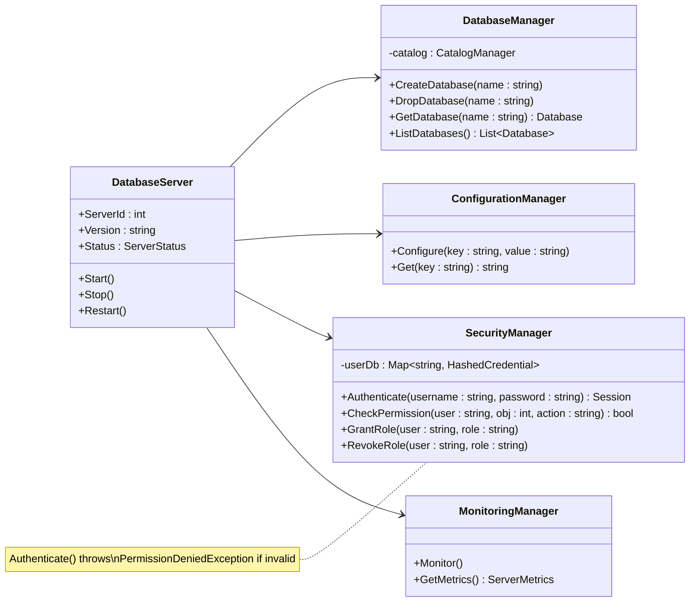

## Server & Database Management

### DatabaseServer
* `Start_ShouldInitializeAllServices`
* `Start_ShouldOpenNetworkPortForConnections`
* `Start_ShouldStartBackgroundWorkers`
* `Start_ShouldStartInSafeMode_WhenConfigured`
* `Start_ShouldReject_WhenServerAlreadyRunning`
* `Stop_ShouldShutdownAllServices`
* `Stop_ShouldFlushDirtyPagesBeforeShutdown`
* `Stop_ShouldRejectNewConnections_WhileShuttingDown`
* `Stop_ShouldWaitForActiveTransactions_WhenGraceful`
* `Stop_ShouldTerminateActiveConnections_WhenForced`
* `Restart_ShouldRestartServerSuccessfully`
* `RecoverAfterCrash_ShouldReplayWAL`
* `HandleSignal_ShouldInitiateGracefulShutdown`
* `GetStatus_ShouldReturnCorrectServerState`

### DatabaseManager
* `CreateDatabase_ShouldCreateDatabaseSuccessfully`
* `CreateDatabase_ShouldRejectDuplicateDatabaseName`
* `CreateDatabase_ShouldRejectInvalidName`
* `DropDatabase_ShouldRemoveDatabaseSuccessfully`
* `DropDatabase_ShouldRejectOpenDatabase`
* `DropDatabase_ShouldForceCloseConnections_WhenCascade`
* `OpenDatabase_ShouldLoadStorageAndCatalog`
* `OpenDatabase_ShouldReject_WhenDatabaseIsOffline`
* `CloseDatabase_ShouldFlushDirtyBuffers`
* `GetDatabase_ShouldReturnExistingDatabase`
* `ListDatabases_ShouldReturnAllDatabases`
* `RenameDatabase_ShouldUpdateNameSuccessfully`
* `RenameDatabase_ShouldRejectDuplicateName`
* `SetDatabaseState_ShouldSetToReadOnly`
* `SetDatabaseState_ShouldSetToOffline`
* `AttachDatabase_ShouldRegisterExistingDatabaseFiles`
* `DetachDatabase_ShouldUnregisterButKeepFiles`

### ConfigurationManager
* `LoadConfiguration_ShouldLoadServerConfiguration`
* `LoadConfiguration_ShouldUseDefaultConfiguration_WhenFileNotExists`
* `UpdateConfiguration_ShouldPersistChanges`
* `GetConfiguration_ShouldReturnConfiguredValue`

### MonitoringManager
* `CollectMetrics_ShouldCollectServerMetrics`
* `CollectMetrics_ShouldCollectBufferPoolStatistics`
* `CollectMetrics_ShouldCollectTransactionStatistics`
* `GetMetrics_ShouldReturnLatestMetrics`

### SessionManager
* `CreateSession_ShouldInitializeContextForUser`
* `CloseSession_ShouldReleaseAllSessionResources`
* `SessionTimeout_ShouldCloseIdleConnection`
* `ExecuteQuery_ShouldUseSessionContext`
* `SetSessionVariable_ShouldUpdateSessionState`
* `KillSession_ShouldTerminateActiveQueryAndRollback`

### ConnectionManager
* `AcceptConnection_ShouldCreateNewConnectionHandler`
* `CloseConnection_ShouldReleaseSocketResources`
* `GetActiveConnections_ShouldReturnCurrentConnectionCount`
* `ConnectionPool_ShouldReuseIdleConnections`

### WorkerPool
* `SubmitTask_ShouldExecuteTaskInBackground`
* `Worker_ShouldProcessQueueContinuously`
* `Shutdown_ShouldWaitForActiveTasksToComplete`

### BackupManager
* `CreateFullBackup_ShouldExportEntireDatabase`
* `CreateIncrementalBackup_ShouldExportOnlyChangedData`
* `RestoreBackup_ShouldRecoverDatabaseFromBackupFile`

### Integration
* `StartServer_ShouldLoadConfigurationBeforeInitializingServices`
* `StartServer_ShouldInitializeDatabaseManager`
* `StartServer_ShouldInitializeStorageEngine`
* `StopServer_ShouldFlushDirtyPagesBeforeShutdown`
* `StopServer_ShouldShutdownAllManagers`
* `RestartServer_ShouldRecoverDatabaseAfterUnexpectedShutdown`
* `CreateDatabase_ShouldRegisterDatabaseInCatalog`
* `OpenDatabase_ShouldInitializeStorageEngine`
* `CloseDatabase_ShouldFlushPendingChanges`

### 2. Database Objects

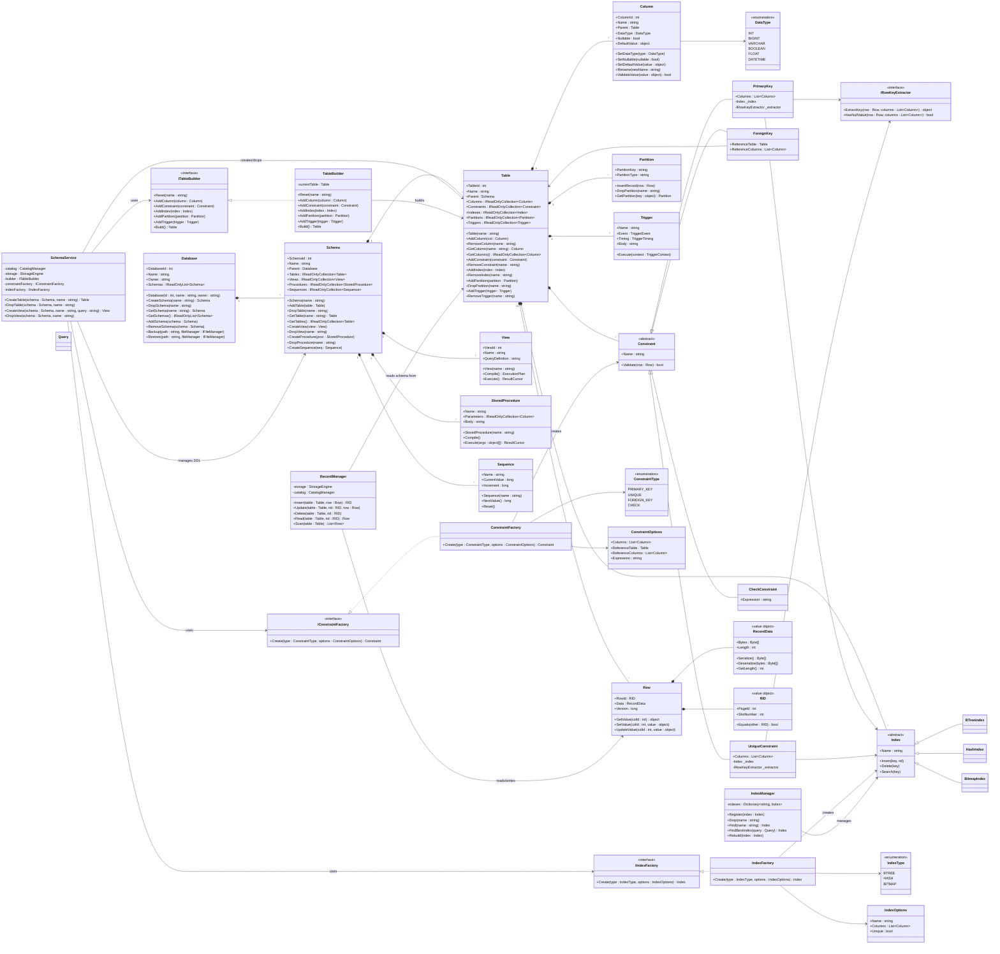
## Database Objects

### Database
* `Constructor_ShouldInitializeDatabaseWithValidData`
* `Constructor_ShouldThrow_WhenNameIsNullOrWhiteSpace`
* `ChangeOwner_ShouldUpdateOwnerCorrectly`
* `CreateSchema_ShouldAddSchemaToDatabase`
* `CreateSchema_ShouldThrow_WhenSchemaNameIsNullOrWhiteSpace`
* `CreateSchema_ShouldRejectDuplicateSchemaName`
* `DropSchema_ShouldRemoveExistingSchema`
* `DropSchema_ShouldThrow_WhenSchemaDoesNotExist`
* `GetSchema_ShouldReturnExistingSchema`
* `GetSchema_ShouldThrow_WhenSchemaDoesNotExist`
* `GetSchemas_ShouldReturnAllSchemas`
* `Backup_ShouldCreateBackupSuccessfully`
* `Restore_ShouldRestoreDatabaseSuccessfully`

### Schema
* `Constructor_ShouldInitializeSchemaWithValidName`
* `Constructor_ShouldThrow_WhenNameIsNullOrWhiteSpace`
* `AddTable_ShouldAddTableSuccessfully`
* `AddTable_ShouldThrow_WhenTableIsNull`
* `AddTable_ShouldRejectDuplicateTableName`
* `DropTable_ShouldRemoveExistingTable`
* `DropTable_ShouldThrow_WhenTableDoesNotExist`
* `GetTable_ShouldReturnTable_WhenExists`
* `GetTable_ShouldReturnNull_WhenTableDoesNotExist`
* `GetTables_ShouldReturnAllTables`
* `CreateView_ShouldRegisterView`
* `CreateView_ShouldThrow_WhenViewIsNull`
* `DropView_ShouldRemoveView`
* `CreateProcedure_ShouldRegisterProcedure`
* `CreateProcedure_ShouldThrow_WhenProcedureIsNull`
* `DropProcedure_ShouldRemoveProcedure`
* `CreateSequence_ShouldRegisterSequence`
* `CreateSequence_ShouldThrow_WhenSequenceIsNull`

### Table
* `Constructor_ShouldInitializeTableWithValidName`
* `Constructor_ShouldThrow_WhenNameIsNullOrWhiteSpace`
* `AddColumn_ShouldAddColumnSuccessfully`
* `AddColumn_ShouldThrow_WhenColumnIsNull`
* `AddColumn_ShouldRejectDuplicateColumnName`
* `RemoveColumn_ShouldRemoveExistingColumn`
* `GetColumn_ShouldReturnColumn_WhenExists`
* `GetColumn_ShouldReturnNull_WhenColumnDoesNotExist`
* `GetColumns_ShouldReturnAllColumns`
* `AddConstraint_ShouldRegisterConstraint`
* `AddConstraint_ShouldThrow_WhenConstraintIsNull`
* `RemoveConstraint_ShouldRemoveConstraint`
* `AddIndex_ShouldRegisterIndex`
* `RemoveIndex_ShouldRemoveIndex`
* `AddPartition_ShouldRegisterPartition`
* `DropPartition_ShouldRemovePartition`
* `AddTrigger_ShouldRegisterTrigger`
* `RemoveTrigger_ShouldRemoveTrigger`

### Column
* `SetDataType_ShouldUpdateDataType`
* `SetNullable_ShouldUpdateNullableFlag`
* `SetDefaultValue_ShouldUpdateDefaultValue`
* `Rename_ShouldUpdateColumnName`
* `ValidateValue_ShouldAcceptValidValue`
* `ValidateValue_ShouldRejectInvalidValue`

### Row
* `GetValue_ShouldReturnCorrectColumnValue`
* `SetValue_ShouldUpdateCorrectColumnValue`
* `UpdateValue_ShouldModifyColumnValue`
* `UpdateValue_ShouldIncreaseVersion`
* `UpdateValue_ShouldRejectInvalidColumn`

### RecordData
* `Serialize_ShouldConvertRecordToBytes`
* `Deserialize_ShouldRestoreRecordCorrectly`
* `GetLength_ShouldReturnCorrectByteLength`

### RID
* `Equals_ShouldReturnTrue_ForSamePageAndSlot`
* `Equals_ShouldReturnFalse_ForDifferentLocation`

### View
* `Compile_ShouldGenerateExecutionPlan`
* `Compile_ShouldRejectInvalidQuery`
* `Execute_ShouldReturnExpectedResults`

### StoredProcedure
* `Compile_ShouldCompileProcedure`
* `Compile_ShouldRejectInvalidProcedure`
* `Execute_ShouldExecuteProcedureSuccessfully`

### Sequence
* `NextValue_ShouldReturnIncrementedValue`
* `NextValue_ShouldRespectCustomIncrement`
* `NextValue_ShouldThrow_WhenOverflowOccurs`
* `Reset_ShouldResetToInitialValue`

### Partition
* `InsertRecord_ShouldRouteRecordToCorrectPartition`
* `InsertRecord_ShouldRejectInvalidPartitionKey`
* `DropPartition_ShouldRemovePartition`
* `GetPartition_ShouldReturnPartition`

### Trigger
* `Execute_ShouldRunBeforeInsertTrigger`
* `Execute_ShouldRunAfterUpdateTrigger`
* `Execute_ShouldRunAfterDeleteTrigger`
* `Execute_ShouldThrow_WhenConditionFails`
* `Execute_ShouldAbortTransaction_OnFailure`

### UserDefinedFunction
* `CreateFunction_ShouldRegisterUDF`
* `DropFunction_ShouldRemoveUDF`
* `Execute_ShouldEvaluateFunctionLogic`

### Cursor
* `Open_ShouldInitializeResultSet`
* `FetchNext_ShouldReturnNextRow`
* `Close_ShouldReleaseResources`

### Integration
* `Database_CreateSchema_ShouldRegisterSchema`
* `Schema_AddTable_ShouldRegisterTable`
* `Table_AddColumn_ShouldRegisterColumn`
* `Table_AddConstraint_ShouldRegisterConstraint`
* `Table_AddIndex_ShouldRegisterIndex`
* `Table_AddTrigger_ShouldRegisterTrigger`
* `Sequence_ShouldGenerateUniqueValues`
* `View_ShouldReferenceExistingTables`
* `StoredProcedure_ShouldAccessDatabaseObjects`

## Constraints & Indexes

### PrimaryKeyConstraint
* `Validate_ShouldAcceptUniqueKey`
* `Validate_ShouldRejectDuplicateKey`
* `Validate_ShouldRejectNullKey`
* `Validate_ShouldRejectCompositeKeyWithMissingColumn`

### ForeignKeyConstraint
* `Validate_ShouldAcceptExistingReferencedRow`
* `Validate_ShouldRejectMissingReferencedRow`
* `Validate_ShouldRejectDeleteReferencedRow_WhenRestrictEnabled`
* `Validate_ShouldCascadeDelete_WhenCascadeEnabled`
* `Validate_ShouldCascadeUpdate_WhenCascadeUpdateEnabled`

### UniqueConstraint
* `Validate_ShouldAcceptUniqueValue`
* `Validate_ShouldRejectDuplicateValue`
* `Validate_ShouldAcceptMultipleNullValues_WhenSupported`

### CheckConstraint
* `Validate_ShouldAcceptValidExpression`
* `Validate_ShouldRejectInvalidExpression`
* `Validate_ShouldRejectNull_WhenColumnIsRequired`

### ConstraintManager
* `ValidateInsert_ShouldValidateAllConstraints`
* `ValidateUpdate_ShouldValidateAllConstraints`
* `ValidateDelete_ShouldValidateForeignKeys`
* `Validate_ShouldStopAtFirstConstraintViolation`

### Index
* `Build_ShouldCreateIndexSuccessfully`
* `Insert_ShouldAddKeyToIndex`
* `Delete_ShouldRemoveKeyFromIndex`
* `Update_ShouldUpdateIndexedKey`
* `Search_ShouldReturnMatchingRID`
* `Search_ShouldReturnEmpty_WhenKeyDoesNotExist`

### BTreeIndex
* `Insert_ShouldKeepTreeBalanced`
* `Search_ShouldFindExistingKey`
* `SearchRange_ShouldReturnSortedRecords`
* `Delete_ShouldRebalanceTreeAfterDeletion`
* `SplitNode_ShouldCreateBalancedTree`

### HashIndex
* `Insert_ShouldStoreKeyInBucket`
* `Search_ShouldFindExistingKey`
* `Search_ShouldReturnEmpty_WhenKeyDoesNotExist`
* `Delete_ShouldRemoveExistingKey`
* `HandleCollision_ShouldStoreMultipleKeysInSameBucket`

### BitmapIndex
* `Build_ShouldGenerateBitmapSuccessfully`
* `Search_ShouldReturnMatchingRows`
* `Update_ShouldRefreshBitmap`
* `Delete_ShouldClearCorrespondingBit`

### IndexManager
* `CreateIndex_ShouldRegisterIndex`
* `CreateIndex_ShouldRejectDuplicateIndexName`
* `DropIndex_ShouldRemoveExistingIndex`
* `DropIndex_ShouldThrow_WhenIndexDoesNotExist`
* `FindBestIndex_ShouldReturnOptimalIndexForQuery`
* `RebuildIndex_ShouldRebuildCorruptedIndex`

### Integration
* `InsertRecord_ShouldUpdateAllRelatedIndexes`
* `DeleteRecord_ShouldRemoveKeysFromIndexes`
* `UpdateIndexedColumn_ShouldUpdateIndexAutomatically`
* `InsertRecord_ShouldValidateConstraintsBeforeUpdatingIndexes`
* `ConstraintFailure_ShouldRollbackIndexChanges`
* `ForeignKeyCascadeDelete_ShouldUpdateIndexes`
* `RebuildIndex_ShouldPreserveSearchResults`

## Domain Services

### SchemaService
* `CreateSchema_ShouldCreateSchemaSuccessfully`
* `CreateSchema_ShouldRejectDuplicateSchemaName`
* `DropSchema_ShouldRemoveExistingSchema`
* `DropSchema_ShouldThrow_WhenSchemaDoesNotExist`
* `RenameSchema_ShouldUpdateSchemaName`
* `RenameSchema_ShouldRejectDuplicateName`
* `GetSchema_ShouldReturnExistingSchema`
* `GetSchema_ShouldThrow_WhenSchemaDoesNotExist`

### TableService
* `CreateTable_ShouldCreateTableSuccessfully`
* `CreateTable_ShouldRejectDuplicateTableName`
* `DropTable_ShouldRemoveExistingTable`
* `DropTable_ShouldThrow_WhenTableDoesNotExist`
* `RenameTable_ShouldRenameTableSuccessfully`
* `RenameTable_ShouldRejectDuplicateTableName`
* `GetTable_ShouldReturnExistingTable`
* `GetTable_ShouldThrow_WhenTableDoesNotExist`

### RecordManager
* `InsertRecord_ShouldInsertSuccessfully`
* `InsertRecord_ShouldValidateConstraintsBeforeInsert`
* `InsertRecord_ShouldUpdateIndexes`
* `UpdateRecord_ShouldModifyExistingRecord`
* `UpdateRecord_ShouldValidateConstraints`
* `UpdateRecord_ShouldUpdateIndexes`
* `DeleteRecord_ShouldRemoveRecordSuccessfully`
* `DeleteRecord_ShouldRemoveIndexEntries`
* `DeleteRecord_ShouldValidateForeignKeyConstraints`
* `GetRecord_ShouldReturnExistingRecord`
* `GetRecord_ShouldReturnNull_WhenRecordDoesNotExist`

### MetadataManager
* `RegisterTable_ShouldStoreMetadata`
* `RegisterIndex_ShouldStoreMetadata`
* `RemoveTable_ShouldDeleteMetadata`
* `RemoveIndex_ShouldDeleteMetadata`
* `GetMetadata_ShouldReturnRegisteredObject`

### Dependency Integration
* `CreateTable_ShouldRegisterMetadata`
* `DropTable_ShouldRemoveMetadata`
* `InsertRecord_ShouldValidateConstraintsBeforeInsert`
* `InsertRecord_ShouldUpdateIndexesAfterInsert`
* `UpdateRecord_ShouldSynchronizeIndexes`
* `DeleteRecord_ShouldSynchronizeIndexes`
* `DeleteRecord_ShouldUpdateMetadataStatistics`

### 3. Storage Engine

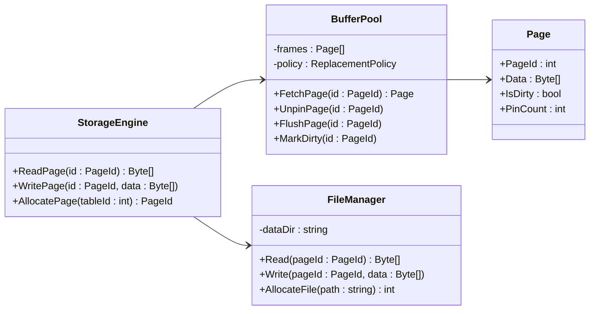

## Storage Engine

### StorageEngine
* `CreateDatabase_ShouldInitializeStorageFiles`
* `OpenDatabase_ShouldLoadExistingStorage`
* `CloseDatabase_ShouldFlushDirtyPages`
* `DropDatabase_ShouldDeleteStorageFiles`
* `AllocatePage_ShouldReturnNewPage`
* `FreePage_ShouldReleasePageSuccessfully`

### BufferPool
* `FetchPage_ShouldLoadPageIntoBuffer`
* `FetchPage_ShouldReturnCachedPage_WhenAlreadyLoaded`
* `UnpinPage_ShouldDecreasePinCount`
* `FlushPage_ShouldWriteDirtyPageToDisk`
* `FlushAllPages_ShouldPersistAllDirtyPages`
* `EvictPage_ShouldUseReplacementPolicy`
* `EvictPage_ShouldNotEvictPinnedPage`

### Page
* `InsertRecord_ShouldInsertSuccessfully`
* `InsertRecord_ShouldReject_WhenPageIsFull`
* `DeleteRecord_ShouldRemoveRecord`
* `UpdateRecord_ShouldModifyExistingRecord`
* `FindRecord_ShouldReturnExistingRecord`
* `Compact_ShouldReclaimFreeSpace`

### FileManager
* `CreateFile_ShouldCreateNewDataFile`
* `OpenFile_ShouldOpenExistingFile`
* `CloseFile_ShouldReleaseFileHandle`
* `DeleteFile_ShouldDeleteExistingFile`
* `ReadPage_ShouldReturnRequestedPage`
* `WritePage_ShouldPersistPageData`
* `ReadPage_ShouldThrow_WhenPageDoesNotExist`

### WALManager
* `WriteLog_ShouldAppendLogRecord`
* `WriteLog_ShouldAssignIncreasingLSN`
* `FlushLog_ShouldPersistPendingLogs`
* `Recover_ShouldReplayCommittedTransactions`
* `Recover_ShouldUndoUncommittedTransactions`
* `Checkpoint_ShouldCreateCheckpointRecord`

### RecoveryManager
* `Recover_ShouldRedoCommittedTransactions`
* `Recover_ShouldUndoIncompleteTransactions`
* `Recover_ShouldRestoreConsistentDatabase`
* `Recover_ShouldIgnoreAlreadyAppliedLogs`
* `Recover_ShouldHandleEmptyLogFile`

### FreeSpaceManager
* `AllocatePage_ShouldReturnAvailablePage`
* `AllocatePage_ShouldCreateNewPage_WhenNoFreePageExists`
* `ReleasePage_ShouldReturnPageToFreeList`
* `FindFreePage_ShouldReturnPageWithEnoughSpace`

### Integration
* `InsertRecord_ShouldAllocatePage_WhenCurrentPageIsFull`
* `InsertRecord_ShouldWriteWALBeforeWritingPage`
* `UpdateRecord_ShouldMarkPageAsDirty`
* `DeleteRecord_ShouldMarkPageAsDirty`
* `FlushPage_ShouldWritePageToDiskAfterLogFlush`
* `Recovery_ShouldReplayWALAfterCrash`
* `BufferPool_ShouldReadPageThroughFileManager`
* `BufferPool_ShouldWritePageThroughFileManager`
* `Checkpoint_ShouldReduceRecoveryTime`
* `Restart_ShouldRecoverDatabaseToConsistentState`

### 4. Transaction & Concurrency

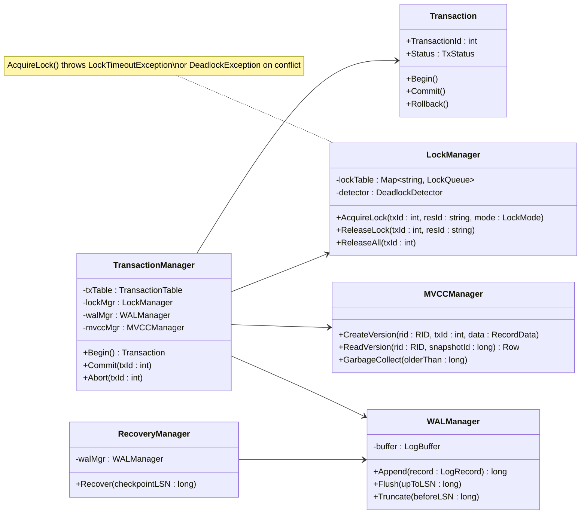

### Transaction
* `Begin_ShouldCreateActiveTransaction`
* `Commit_ShouldPersistChanges`
* `Rollback_ShouldUndoAllChanges`
* `Commit_ShouldThrow_WhenTransactionAlreadyCompleted`
* `Rollback_ShouldThrow_WhenTransactionAlreadyCompleted`
* `SetSavepoint_ShouldCreateSavepoint`
* `RollbackToSavepoint_ShouldRestorePreviousState`

### TransactionManager
* `BeginTransaction_ShouldReturnNewTransaction`
* `BeginTransaction_ShouldRespectIsolationLevel`
* `CommitTransaction_ShouldCommitSuccessfully`
* `RollbackTransaction_ShouldRollbackSuccessfully`
* `CommitTransaction_ShouldReleaseAllLocks`
* `RollbackTransaction_ShouldReleaseAllLocks`
* `GetTransaction_ShouldReturnActiveTransaction`
* `CleanupCompletedTransactions_ShouldRemoveCompletedTransactions`

### IsolationLevels
* `ReadUncommitted_ShouldAllowDirtyReads`
* `ReadCommitted_ShouldPreventDirtyReads`
* `RepeatableRead_ShouldPreventNonRepeatableReads`
* `Serializable_ShouldPreventPhantomReads`
* `SnapshotIsolation_ShouldReadFromConsistentSnapshot`

### LockManager
* `AcquireSharedLock_ShouldGrantLock_WhenNoConflict`
* `AcquireExclusiveLock_ShouldGrantLock_WhenResourceIsFree`
* `AcquireExclusiveLock_ShouldWait_WhenSharedLockExists`
* `AcquireSharedLock_ShouldWait_WhenExclusiveLockExists`
* `ReleaseLock_ShouldFreeLockedResource`
* `ReleaseAllLocks_ShouldReleaseTransactionLocks`
* `DetectDeadlock_ShouldIdentifyCircularWait`
* `DetectDeadlock_ShouldChooseVictimTransaction`

### MVCCManager
* `CreateVersion_ShouldCreateNewRecordVersion`
* `Read_ShouldReturnCorrectVersionForTransaction`
* `Update_ShouldGenerateNewVersion`
* `Delete_ShouldMarkVersionAsDeleted`
* `GarbageCollect_ShouldRemoveObsoleteVersions`
* `Read_ShouldIgnoreUncommittedVersion`

### DeadlockDetector
* `DetectDeadlock_ShouldReturnFalse_WhenNoCycleExists`
* `DetectDeadlock_ShouldReturnTrue_WhenCycleExists`
* `SelectVictim_ShouldChooseLowestPriorityTransaction`
* `ResolveDeadlock_ShouldAbortVictimTransaction`

### Scheduler
* `ScheduleTransaction_ShouldExecuteSerializableSchedule`
* `ScheduleTransaction_ShouldAllowConcurrentReads`
* `ScheduleTransaction_ShouldBlockConflictingWrites`
* `ScheduleTransaction_ShouldResumeWaitingTransaction`

### Integration
* `ConcurrentRead_ShouldAllowMultipleReaders`
* `ConcurrentWrite_ShouldAllowOnlyOneWriter`
* `ReadWhileWrite_ShouldWaitForExclusiveLock`
* `Deadlock_ShouldRollbackVictimTransaction`
* `Rollback_ShouldUndoAllDataChanges`
* `Commit_ShouldPersistChangesAndReleaseLocks`
* `MVCC_ShouldAllowSnapshotReadDuringConcurrentUpdate`
* `Transaction_ShouldRecoverCorrectlyAfterCrash`
* `Checkpoint_ShouldCommitCompletedTransactionsOnly`

### 5. Query Processor

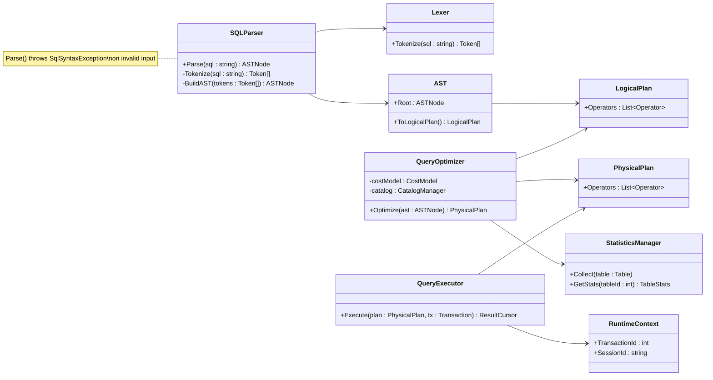

## Query Processor

### SQLParser
* `ParseSelect_ShouldGenerateAST`
* `ParseInsert_ShouldGenerateAST`
* `ParseUpdate_ShouldGenerateAST`
* `ParseDelete_ShouldGenerateAST`
* `ParseCreate_ShouldGenerateASTForDDL`
* `ParseDrop_ShouldGenerateASTForDDL`
* `ParseAlter_ShouldGenerateASTForDDL`
* `Parse_ShouldThrow_WhenSqlSyntaxIsInvalid`
* `Parse_ShouldThrow_WhenStatementIsEmpty`

### Lexer
* `Tokenize_ShouldSplitSqlIntoTokens`
* `Tokenize_ShouldRecognizeKeywords`
* `Tokenize_ShouldRecognizeIdentifiers`
* `Tokenize_ShouldRecognizeOperators`
* `Tokenize_ShouldRecognizeStringAndNumberLiterals`
* `Tokenize_ShouldThrow_WhenInvalidCharacterExists`

### AST
* `BuildAST_ShouldCreateCorrectSyntaxTree`
* `BuildAST_ShouldPreserveOperatorPrecedence`
* `BuildAST_ShouldThrow_WhenTokenSequenceIsInvalid`

### SemanticAnalyzer (Binder)
* `Bind_ShouldResolveTableNames`
* `Bind_ShouldResolveColumnNames`
* `Bind_ShouldThrow_WhenTableDoesNotExist`
* `Bind_ShouldThrow_WhenColumnDoesNotExist`
* `Bind_ShouldValidateDataTypesForOperators`

### LogicalPlan
* `GeneratePlan_ShouldCreateTableScan`
* `GeneratePlan_ShouldCreateProjection`
* `GeneratePlan_ShouldCreateFilter`
* `GeneratePlan_ShouldCreateJoin`
* `GeneratePlan_ShouldCreateAggregation`
* `GeneratePlan_ShouldCreateSort_ForOrderBy`
* `GeneratePlan_ShouldCreateLimit_ForLimitClause`
* `GeneratePlan_ShouldCreateGroupBy_ForAggregation`

### QueryOptimizer
* `Optimize_ShouldChooseIndexScan_WhenIndexExists`
* `Optimize_ShouldChooseTableScan_WhenNoIndexExists`
* `Optimize_ShouldOptimizeJoinOrder`
* `Optimize_ShouldApplyPredicatePushdown`
* `Optimize_ShouldApplyProjectionPushdown`
* `Optimize_ShouldApplySubqueryFlattening`
* `Optimize_ShouldChooseCoveringIndex_WhenApplicable`
* `Optimize_ShouldEliminateRedundantConditions`
* `Optimize_ShouldEstimateCostForExecutionPlan`

### StatisticsManager
* `CollectStatistics_ShouldUpdateTableStatistics`
* `GetStatistics_ShouldReturnExistingStatistics`
* `EstimateRowCount_ShouldReturnEstimatedRows`
* `UpdateHistogram_ShouldUpdateDataDistribution`
* `InvalidateStatistics_ShouldClearOldStats`

### PlanCache
* `GetCachedPlan_ShouldReturnOptimizedPlan_ForIdenticalQuery`
* `CachePlan_ShouldStoreOptimizedPlan`
* `EvictPlan_ShouldRemoveLeastRecentlyUsedPlan`
* `InvalidateCache_ShouldClearAllPlans_WhenSchemaChanges`

### PhysicalPlan
* `GeneratePhysicalPlan_ShouldCreateExecutableOperators`
* `GeneratePhysicalPlan_ShouldSelectBestExecutionStrategy`
* `GeneratePhysicalPlan_ShouldRespectOptimizerDecision`
* `Execute_ShouldProduceCorrectPipeline`

### QueryExecutor
* `ExecuteSelect_ShouldReturnMatchingRows`
* `ExecuteInsert_ShouldInsertRecord`
* `ExecuteUpdate_ShouldModifyExistingRows`
* `ExecuteDelete_ShouldDeleteMatchingRows`
* `ExecuteJoin_ShouldReturnJoinedRows`
* `ExecuteAggregate_ShouldReturnAggregatedResult`
* `ExecuteGroupBy_ShouldGroupAndAggregateCorrectly`
* `ExecuteOrderBy_ShouldReturnSortedRows`
* `ExecuteLimit_ShouldReturnLimitedRows`
* `ExecuteSubquery_ShouldEvaluateAndReturnResults`
* `Execute_ShouldThrow_WhenTableDoesNotExist`
* `Execute_ShouldThrow_WhenExecutionPlanIsInvalid`
* `Execute_ShouldThrow_WhenMemoryLimitExceeded`

### Physical Operators
* `NestedLoopJoin_ShouldReturnJoinedRows`
* `HashJoin_ShouldReturnJoinedRows`
* `SortMergeJoin_ShouldReturnJoinedRows`
* `IndexScan_ShouldRetrieveRowsUsingIndex`
* `TableScan_ShouldRetrieveAllRows`
* `SortOperator_ShouldSortRowsAccordingToKeys`

### Expressions & Built-in Functions
* `EvaluateMathExpression_ShouldReturnCorrectResult`
* `EvaluateLogicalExpression_ShouldReturnCorrectResult`
* `EvaluateStringFunction_ShouldReturnCorrectResult`
* `EvaluateDateFunction_ShouldReturnCorrectResult`
* `AggregateFunction_Count_ShouldReturnNumberOfRows`
* `AggregateFunction_Sum_ShouldReturnSumOfValues`
* `CastExpression_ShouldConvertDataTypes`
* `Expression_ShouldThrow_WhenTypeMismatch`

### Integration
* `ParseSelect_ShouldGenerateLogicalPlan`
* `LogicalPlan_ShouldBeOptimizedBeforeExecution`
* `Optimizer_ShouldGeneratePhysicalPlan`
* `PhysicalPlan_ShouldExecuteSuccessfully`
* `InsertQuery_ShouldUpdateIndexes`
* `UpdateQuery_ShouldValidateConstraints`
* `DeleteQuery_ShouldRespectForeignKeys`
* `QueryExecution_ShouldRunInsideTransaction`
* `ExecutionFailure_ShouldRollbackTransaction`
* `Optimizer_ShouldUseLatestStatistics`
* `ComplexQuery_ShouldExecuteSuccessfully`
* `QueryExecutor_ShouldSpillToDisk_WhenMemoryExceeded`
* `QueryExecutor_ShouldHandleConcurrentQueries_Correctly`
* `Optimizer_ShouldReplan_WhenStatisticsChangeDrastically`

### 6. Catalog & Metadata

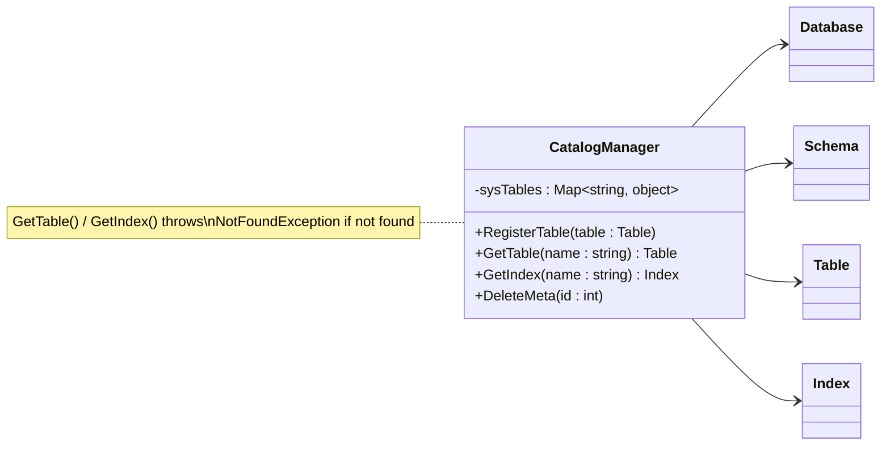

## Catalog

### CatalogManager
* `RegisterDatabase_ShouldAddDatabaseMetadata`
* `RegisterDatabase_ShouldRejectDuplicateDatabase`
* `RemoveDatabase_ShouldDeleteDatabaseMetadata`
* `GetDatabase_ShouldReturnExistingDatabase`
* `GetDatabase_ShouldThrow_WhenDatabaseDoesNotExist`

### Schema Metadata
* `RegisterSchema_ShouldAddSchemaMetadata`
* `RegisterSchema_ShouldRejectDuplicateSchema`
* `RemoveSchema_ShouldDeleteSchemaMetadata`
* `GetSchema_ShouldReturnExistingSchema`

### Table Metadata
* `RegisterTable_ShouldAddTableMetadata`
* `RegisterTable_ShouldRejectDuplicateTable`
* `RemoveTable_ShouldDeleteTableMetadata`
* `GetTable_ShouldReturnExistingTable`

### Column Metadata
* `RegisterColumn_ShouldAddColumnMetadata`
* `RemoveColumn_ShouldDeleteColumnMetadata`
* `GetColumns_ShouldReturnTableColumns`

### Index Metadata
* `RegisterIndex_ShouldAddIndexMetadata`
* `RemoveIndex_ShouldDeleteIndexMetadata`
* `GetIndex_ShouldReturnExistingIndex`

### Constraint Metadata
* `RegisterConstraint_ShouldAddConstraintMetadata`
* `RemoveConstraint_ShouldDeleteConstraintMetadata`
* `GetConstraints_ShouldReturnTableConstraints`

### Metadata Lookup
* `FindTable_ShouldReturnQualifiedTable`
* `FindColumn_ShouldReturnQualifiedColumn`
* `ResolveObjectName_ShouldResolveSchemaObject`
* `ObjectExists_ShouldReturnTrue_WhenObjectExists`
* `ObjectExists_ShouldReturnFalse_WhenObjectDoesNotExist`

### Dependency Management
* `DropTable_ShouldReject_WhenReferencedByForeignKey`
* `DropSchema_ShouldReject_WhenSchemaContainsObjects`
* `DropDatabase_ShouldReject_WhenDatabaseContainsSchemas`

### Integration
* `CreateDatabase_ShouldRegisterMetadata`
* `DropDatabase_ShouldRemoveMetadata`
* `CreateSchema_ShouldRegisterMetadata`
* `CreateTable_ShouldRegisterMetadata`
* `DropTable_ShouldRemoveMetadata`
* `CreateIndex_ShouldRegisterMetadata`
* `DropIndex_ShouldRemoveMetadata`
* `CreateConstraint_ShouldRegisterMetadata`
* `CatalogLookup_ShouldSupportQueryProcessor`
* `Catalog_ShouldRemainConsistentAfterRollback`

### 7. Security

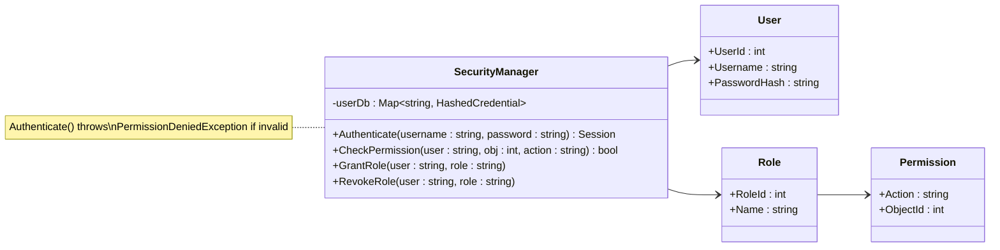

## Security & Access Control

### AuthenticationManager
* `Login_ShouldAuthenticateValidUser`
* `Login_ShouldRejectInvalidUsernameOrPassword`
* `Login_ShouldRejectLockedAccount`
* `Logout_ShouldInvalidateSession`
* `ValidateSession_ShouldReturnTrue_ForValidSession`
* `ValidateSession_ShouldReturnFalse_ForExpiredSession`

### UserManager
* `CreateUser_ShouldCreateUserSuccessfully`
* `CreateUser_ShouldRejectDuplicateUsername`
* `DeleteUser_ShouldRemoveExistingUser`
* `ChangePassword_ShouldUpdatePassword`
* `ChangePassword_ShouldRejectIncorrectOldPassword`
* `AssignRole_ShouldAssignRoleToUser`
* `RemoveRole_ShouldRemoveRoleFromUser`

### RoleManager
* `CreateRole_ShouldCreateRoleSuccessfully`
* `CreateRole_ShouldRejectDuplicateRole`
* `DeleteRole_ShouldRemoveRole`
* `AssignPermission_ShouldAddPermissionToRole`
* `RemovePermission_ShouldRemovePermissionFromRole`
* `GetPermissions_ShouldReturnAssignedPermissions`

### PermissionManager
* `GrantPermission_ShouldGrantPermission`
* `RevokePermission_ShouldRemovePermission`
* `HasPermission_ShouldReturnTrue_WhenPermissionExists`
* `HasPermission_ShouldReturnFalse_WhenPermissionDoesNotExist`

### AuthorizationManager
* `Authorize_ShouldAllowAuthorizedUser`
* `Authorize_ShouldRejectUnauthorizedUser`
* `Authorize_ShouldCheckRolePermissions`
* `Authorize_ShouldCheckObjectPermissions`
* `Authorize_ShouldRejectAccessToNonExistingObject`

### SecurityManager
* `Authenticate_ShouldValidateUserCredentials`
* `Authorize_ShouldVerifyUserPermission`
* `CreateUser_ShouldDelegateToUserManager`
* `CreateRole_ShouldDelegateToRoleManager`
* `GrantPermission_ShouldDelegateToPermissionManager`
* `AuditSecurityEvent_ShouldRecordSecurityEvent`

### Integration
* `Login_ShouldCreateAuthenticatedSession`
* `Logout_ShouldInvalidateSession`
* `UserWithRole_ShouldInheritRolePermissions`
* `PermissionRevoked_ShouldImmediatelyDenyAccess`
* `UnauthorizedAccess_ShouldBeRejected`
* `AuthorizedQuery_ShouldExecuteSuccessfully`
* `UnauthorizedQuery_ShouldThrowAccessDeniedException`
* `DropDatabase_ShouldRequireAdminPermission`
* `CreateTable_ShouldRequireCreatePermission`
* `GrantPermission_ShouldTakeEffectImmediately`

### 8. Replication & High Availability

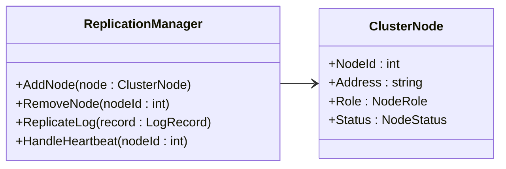

## Replication & High Availability

### ReplicationManager
* `AddNode_ShouldRegisterNewReplica`
* `RemoveNode_ShouldUnregisterReplica`
* `LeaderElection_ShouldElectNewLeader_WhenCurrentLeaderFails`
* `ReplicateLog_ShouldSendLogToAllFollowers`
* `ReplicateLog_ShouldWaitForQuorum_WhenSynchronous`
* `HandleHeartbeat_ShouldUpdateNodeStatusToActive`
* `DetectFailure_ShouldMarkNodeOffline_WhenHeartbeatMissed`

### ClusterNode
* `SyncState_ShouldCatchUpWithLeader`
* `PromoteToLeader_ShouldChangeRoleAndStartAcceptingWrites`
* `DemoteToFollower_ShouldChangeRoleAndStopAcceptingWrites`

### Integration
* `Replication_ShouldKeepFollowerDataConsistentWithLeader`
* `Failover_ShouldAutomaticallySwitchToStandby`
* `NetworkPartition_ShouldPreventSplitBrain`

