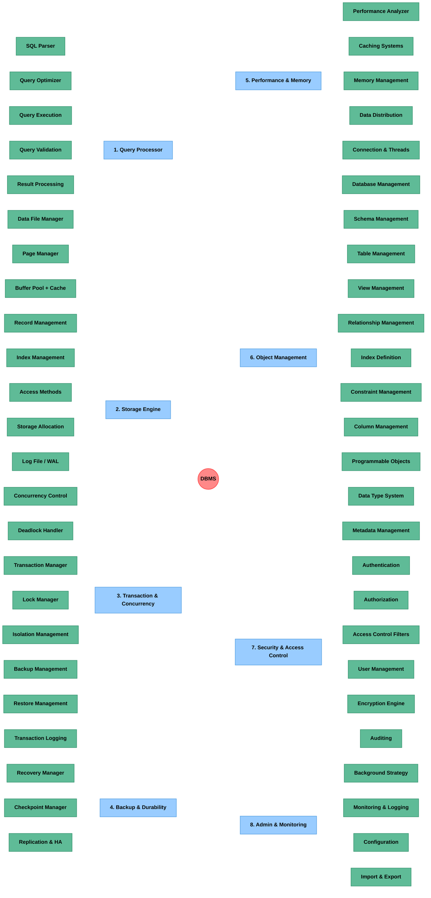

# This overview of DBMS Mindmap

```mermaid
graph LR
    %% Styles cho nền tối (GitHub Dark Mode)
    classDef default fill:#2d2d2d,stroke:#888,stroke-width:1px,color:#fff;
    classDef root fill:#ff8888,stroke:#ff5555,stroke-width:2px,font-weight:bold,color:#000;
    classDef layer1 fill:#99ccff,stroke:#5ba3e3,stroke-width:1.5px,font-weight:bold,color:#000;
    classDef layer2 fill:#5fbb97,stroke:#3a9672,stroke-width:1.5px,font-weight:bold,color:#000;

    %% Tăng độ tương phản cho đường nối liên kết giữa các node
    linkStyle default stroke:#ffffff,stroke-width:1.5px;

    db((DBMS)):::root

    %% ===== BÊN TRÁI (module 1-4) =====

    %% 1. Query Processor
    qp[1. Query Processor]:::layer1 --- db
    qp_sp[SQL Parser]:::layer2 --- qp
    qp_qo[Query Optimizer]:::layer2 --- qp
    qp_qe[Query Execution]:::layer2 --- qp
    qp_qv[Query Validation]:::layer2 --- qp
    qp_rp[Result Processing]:::layer2 --- qp

    %% 2. Storage Engine
    se[2. Storage Engine]:::layer1 --- db
    se_df[Data File Manager]:::layer2 --- se
    se_pm[Page Manager]:::layer2 --- se
    se_bp[Buffer Pool + Cache]:::layer2 --- se
    se_rm[Record Management]:::layer2 --- se
    se_im[Index Management]:::layer2 --- se
    se_am[Access Methods]:::layer2 --- se
    se_sa[Storage Allocation]:::layer2 --- se
    se_lf[Log File / WAL]:::layer2 --- se

    %% 3. Transaction & Concurrency
    tx[3. Transaction & Concurrency]:::layer1 --- db
    tx_cc[Concurrency Control]:::layer2 --- tx
    tx_dl[Deadlock Handler]:::layer2 --- tx
    tx_tm[Transaction Manager]:::layer2 --- tx
    tx_lm[Lock Manager]:::layer2 --- tx
    tx_im[Isolation Management]:::layer2 --- tx

    %% 4. Backup & Durability
    bd[4. Backup & Durability]:::layer1 --- db
    bd_bm[Backup Management]:::layer2 --- bd
    bd_rm[Restore Management]:::layer2 --- bd
    bd_tl[Transaction Logging]:::layer2 --- bd
    bd_re[Recovery Manager]:::layer2 --- bd
    bd_cp[Checkpoint Manager]:::layer2 --- bd
    bd_rp[Replication & HA]:::layer2 --- bd

    %% ===== BÊN PHẢI (module 5-8) =====

    %% 5. Performance & Memory
    db --- pf[5. Performance & Memory]:::layer1
    pf --- pf_qa[Performance Analyzer]:::layer2
    pf --- pf_ch[Caching Systems]:::layer2
    pf --- pf_mm[Memory Management]:::layer2
    pf --- pf_dd[Data Distribution]:::layer2
    pf --- pf_ct[Connection & Threads]:::layer2

    %% 6. Database Object Management
    db --- om[6. Object Management]:::layer1
    om --- om_dm[Database Management]:::layer2
    om --- om_sm[Schema Management]:::layer2
    om --- om_tm[Table Management]:::layer2
    om --- om_vm[View Management]:::layer2
    om --- om_rm[Relationship Management]:::layer2
    om --- om_idx[Index Definition]:::layer2
    om --- om_cm[Constraint Management]:::layer2
    om --- om_com[Column Management]:::layer2
    om --- om_po[Programmable Objects]:::layer2
    om --- om_dt[Data Type System]:::layer2
    om --- om_mm[Metadata Management]:::layer2

    %% 7. Security & Access Control
    db --- sa[7. Security & Access Control]:::layer1
    sa --- sa_au[Authentication]:::layer2
    sa --- sa_az[Authorization]:::layer2
    sa --- sa_ac[Access Control Filters]:::layer2
    sa --- sa_um[User Management]:::layer2
    sa --- sa_ec[Encryption Engine]:::layer2
    sa --- sa_ad[Auditing]:::layer2

    %% 8. Administration & Monitoring
    db --- am[8. Admin & Monitoring]:::layer1
    am --- am_bs[Background Strategy]:::layer2
    am --- am_ml[Monitoring & Logging]:::layer2
    am --- am_cm[Configuration]:::layer2
    am --- am_ie[Import & Export]:::layer2
```

## Class diagram

```mermaid
classDiagram
    %% ==========================================
    %% LAYER 1: QUERY PROCESSOR
    %% ==========================================
    class SqlParser {
        +String sqlText
        +ASTNode ast
        +tokenize()
        +parse()
        +buildAST() ASTNode
    }
    class QueryValidator {
        +ASTNode ast
        +MetadataCatalog catalog
        +validateSyntax()
        +validateSemantics()
        +checkPrivileges()
    }
    class QueryOptimizer {
        +ASTNode validatedAst
        +CostModel costModel
        +generateLogicalPlan()
        +generatePhysicalPlan() ExecutionPlan
        +optimize() ExecutionPlan
    }
    class ExecutionEngine {
        +ExecutionPlan plan
        +TransactionContext txContext
        +execute() ResultSet
        +initPhysicalOperators()
        +getNextTuple() Tuple
    }
    class ResultProcessor {
        +TupleBuffer outputBuffer
        +ResultSet resultSet
        +formatTuple()
        +serialize()
        +getCursor()
    }

    %% ==========================================
    %% LAYER 2: STORAGE ENGINE (Disk, Buffer, Page)
    %% ==========================================
    class DiskManager {
        +Map openFiles
        +String dataDir
        +readPage(pageId, buffer)
        +writePage(pageId, buffer)
        +allocateFile()
    }
    class TablespaceManager {
        +Map tablespaces
        +createTablespace()
        +getTablespace()
        +mapToFile()
    }
    class PageManager {
        +DiskManager diskManager
        +allocatePage()
        +fetchPage()
        +freePage()
    }
    class PageFormatter {
        +PageHeader header
        +SlotArray slots
        +formatSlottedPage()
        +insertTuple()
    }
    class BufferPoolManager {
        +Page[] frames
        +PageTable pageTable
        +ReplacementPolicy policy
        +fetchPage(pageId) Page
        +unpinPage(pageId)
        +flushPage(pageId)
    }
    class ReplacementPolicy {
        +Int frameCount
        +recordAccess(frameId)
        +evictFrame() FrameId
    }

    %% ==========================================
    %% LAYER 2: STORAGE ENGINE (Record, Index)
    %% ==========================================
    class RecordManager {
        +BufferPoolManager bpm
        +insertRecord(record) RID
        +deleteRecord(rid)
        +updateRecord(rid, record)
        +readRecord(rid) Record
    }
    class RecordLayoutManager {
        +Schema schema
        +Int fixedLength
        +getFieldOffset(colId)
        +serialize()
    }
    class RIDGenerator {
        +PageId currentPageId
        +Int nextSlotId
        +generateNextRID()
    }
    class IndexManager {
        +BufferPoolManager bpm
        +MetadataCatalog catalog
        +createIndex()
        +dropIndex()
        +getIndex()
    }
    class BPlusTree {
        +PageId rootPageId
        +Int degree
        +insert(key, rid)
        +search(key)
        +rangeScan()
    }
    class HashIndex {
        +PageId directoryPageId
        +insert(key, rid)
        +search(key)
    }

    %% ==========================================
    %% LAYER 2: STORAGE ENGINE (Access, Space, Log)
    %% ==========================================
    class AccessMethod {
        <<interface>>
        +ExecutionPlan plan
        +init()
        +next()
        +close()
    }
    class TableScan {
        +TableId tableId
        +RID currentRid
        +init()
        +next()
    }
    class IndexScan {
        +IndexId indexId
        +Key searchKey
        +init()
        +next()
    }
    class SpaceManager {
        +ExtentManager extentMgr
        +allocateSpace()
        +freeSpace()
    }
    class ExtentManager {
        +Map extents
        +allocateExtent()
    }
    class SegmentManager {
        +Map segments
        +createSegment()
        +growSegment()
    }
    class WALManager {
        +LogBuffer buffer
        +LogWriter writer
        +appendLogRecord(record) LSN
        +flushLog()
    }
    class LogWriter {
        +File logFile
        +Int currentOffset
        +write(data)
        +fsync()
    }
    class LSNGenerator {
        +LSN currentLSN
        +getNextLSN()
    }

    %% ==========================================
    %% LAYER 4: BACKUP & DURABILITY
    %% ==========================================
    class RecoveryManager {
        +WALManager walMgr
        +BufferPoolManager bpm
        +analyzePass()
        +redoPass()
        +undoPass()
    }
    class BackupManager {
        +String backupDir
        +WALManager walMgr
        +startFullBackup()
        +startIncrementalBackup()
    }

    %% ==========================================
    %% LAYER 5: TRANSACTION
    %% ==========================================
    class TransactionManager {
        +TransactionTable txTable
        +LockManager lockMgr
        +WALManager walMgr
        +begin() TxId
        +commit(txId)
        +abort(txId)
    }
    class TransactionTable {
        +Map activeTxns
        +addTx()
        +removeTx()
    }
    class LockManager {
        +Map lockTable
        +DeadlockDetector detector
        +acquireLock(txId, resId) Boolean
        +releaseLock(txId, resId)
    }
    class MVCCManager {
        +SnapshotManager snapshotMgr
        +readVersion(rid, txId) Record
        +writeVersion(rid, txId)
    }
    class SnapshotManager {
        +List activeSnapshots
        +createSnapshot()
        +isVisible(txId)
    }
    class DeadlockDetector {
        +WaitForGraph graph
        +buildGraph()
        +detectCycle()
    }

    %% ==========================================
    %% LAYER 6: DATABASE OBJECT MANAGEMENT
    %% ==========================================
    class DatabaseManager {
        +MetadataCatalog catalog
        +createDatabase()
        +dropDatabase()
    }
    class SchemaManager {
        +DatabaseId dbId
        +createSchema()
    }
    class TableManager {
        +SchemaId schemaId
        +IndexManager indexMgr
        +createTable()
        +alterTable()
    }
    class MetadataCatalog {
        +Map sysTables
        +getTableMeta()
        +updateMeta()
    }

    %% ==========================================
    %% LAYER 7: SECURITY & ACCESS CONTROL
    %% ==========================================
    class AuthenticationManager {
        +Map userDb
        +authenticate()
        +hashPassword()
    }
    class AuthorizationManager {
        +MetadataCatalog catalog
        +checkPermission()
        +grantRole()
    }

    %% ==========================================
    %% RELATIONSHIPS (Core Backbone)
    %% ==========================================
    
    %% Query -> Execution
    SqlParser --> QueryValidator : passes AST
    QueryValidator --> QueryOptimizer : passes Validated AST
    QueryOptimizer --> ExecutionEngine : passes Plan
    ExecutionEngine --> ResultProcessor : generates Tuples
    
    %% Execution -> Access & Metadata & Security
    ExecutionEngine --> AccessMethod : calls
    ExecutionEngine --> MetadataCatalog : reads schema
    ExecutionEngine --> AuthorizationManager : verifies rights
    ExecutionEngine --> TransactionManager : manages scope

    %% Access -> Record & Index
    AccessMethod <|-- TableScan
    AccessMethod <|-- IndexScan
    TableScan ..> RecordManager : fetches records
    IndexScan ..> IndexManager : fetches RIDs
    
    %% Record & Index -> Buffer Pool
    RecordManager --> BufferPoolManager : requests pages
    IndexManager --> BufferPoolManager : requests pages
    IndexManager *-- BPlusTree
    IndexManager *-- HashIndex
    RecordManager --> RecordLayoutManager : formats
    RecordManager --> RIDGenerator : uses
    
    %% Buffer Pool -> Disk & Space
    BufferPoolManager --> DiskManager : I/O
    BufferPoolManager --> ReplacementPolicy : chooses eviction
    PageManager --> DiskManager : delegates
    DiskManager --> TablespaceManager : maps files
    SpaceManager --> ExtentManager : orchestrates
    ExtentManager --> SegmentManager : orchestrates
    
    %% Transaction -> Concurrency & Logging
    TransactionManager --> TransactionTable : tracks
    TransactionManager --> LockManager : uses 2PL
    TransactionManager --> MVCCManager : visibility
    TransactionManager --> WALManager : forces log (durability)
    
    LockManager --> DeadlockDetector : monitors
    MVCCManager --> SnapshotManager : coordinates
    
    %% Logging -> Durability & Recovery
    WALManager --> LogWriter : persists
    WALManager --> LSNGenerator : sequences
    RecoveryManager --> WALManager : replays logs
    BackupManager --> WALManager : archives logs
    RecoveryManager --> BufferPoolManager : restores state
    
    %% Object Management
    DatabaseManager --> MetadataCatalog : stores
    TableManager --> MetadataCatalog : stores
    SchemaManager --> MetadataCatalog : stores
    
    %% Security
    AuthorizationManager --> MetadataCatalog : checks roles
```