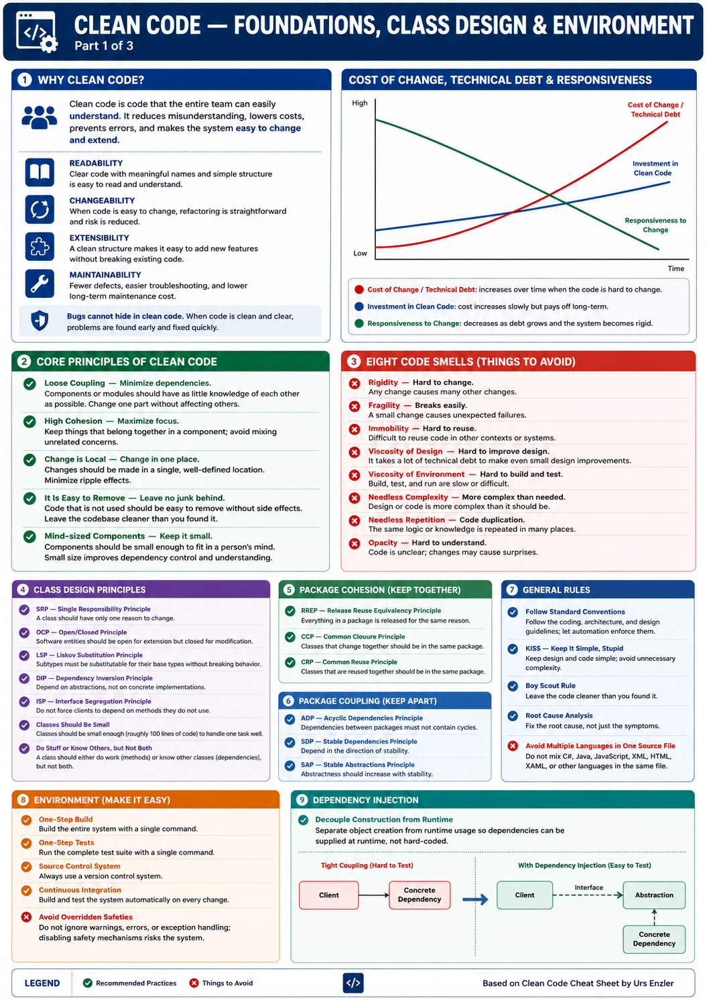
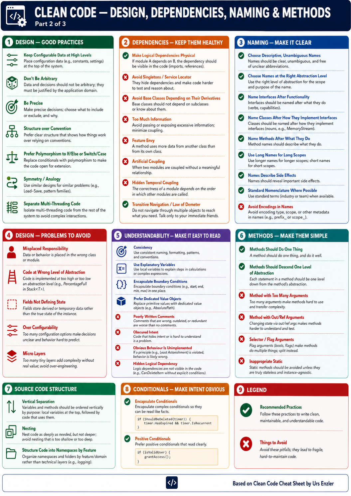
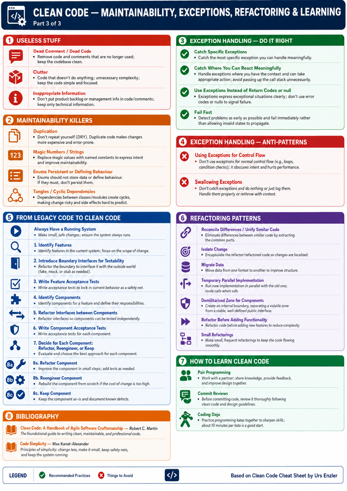
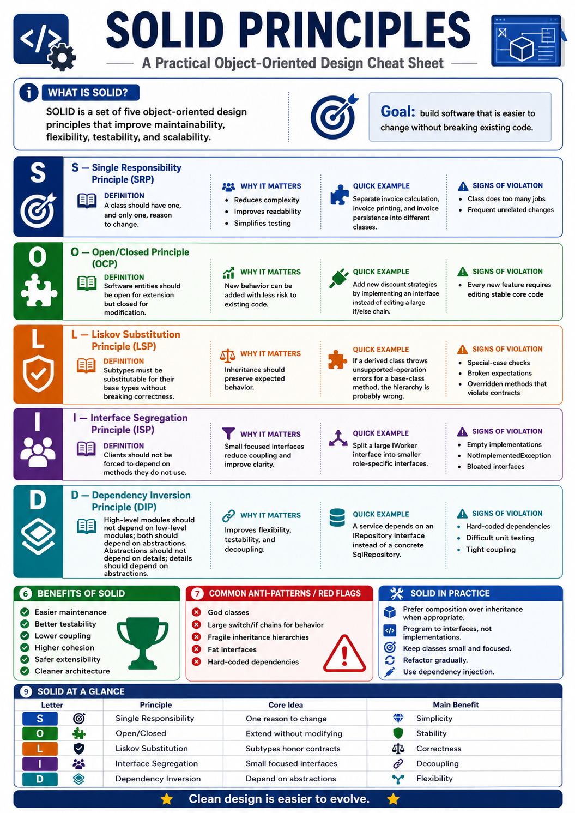
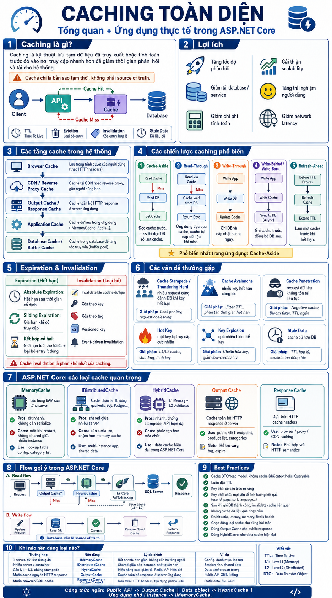

# MVP should be implemented first.

```mermaid
flowchart LR
    MVP((DBMS API MVP))

    %% =====================================================
    %% Main modules
    %% =====================================================
    MVP --> Objects["Database Object Management"]
    MVP --> Catalog["Catalog & Metadata"]
    MVP --> Query["Minimal Query Processing"]
    MVP --> Security["Authentication & Authorization"]
    MVP --> System["Basic System API"]

    %% =====================================================
    %% Database objects
    %% =====================================================
    Objects --> Database["Database"]
    Objects --> Schema["Schema"]
    Objects --> Table["Table"]

    Table --> Column["Column"]
    Table --> Constraint["Constraint"]
    Table --> Index["Index"]

    %% =====================================================
    %% Database APIs
    %% =====================================================
    Database --> CreateDatabase["POST /databases"]
    Database --> ListDatabases["GET /databases"]
    Database --> GetDatabase["GET /databases/{db}"]
    Database --> RenameDatabase["PATCH /databases/{db}"]
    Database --> DropDatabase["DELETE /databases/{db}"]

    %% =====================================================
    %% Schema APIs
    %% =====================================================
    Schema --> CreateSchema["POST /databases/{db}/schemas"]
    Schema --> ListSchemas["GET /databases/{db}/schemas"]
    Schema --> GetSchema["GET /schemas/{schema}"]
    Schema --> RenameSchema["PATCH /schemas/{schema}"]
    Schema --> DropSchema["DELETE /schemas/{schema}"]

    %% =====================================================
    %% Table APIs
    %% =====================================================
    Table --> CreateTable["POST /schemas/{schema}/tables"]
    Table --> ListTables["GET /schemas/{schema}/tables"]
    Table --> GetTable["GET /tables/{table}"]
    Table --> RenameTable["PATCH /tables/{table}"]
    Table --> DropTable["DELETE /tables/{table}"]

    %% =====================================================
    %% Column APIs
    %% =====================================================
    Column --> AddColumn["POST /tables/{table}/columns"]
    Column --> ListColumns["GET /tables/{table}/columns"]
    Column --> GetColumn["GET /tables/{table}/columns/{column}"]
    Column --> AlterColumn["PATCH /tables/{table}/columns/{column}"]
    Column --> DropColumn["DELETE /tables/{table}/columns/{column}"]

    %% =====================================================
    %% Constraint APIs
    %% =====================================================
    Constraint --> AddConstraint["POST /tables/{table}/constraints"]
    Constraint --> ListConstraints["GET /tables/{table}/constraints"]
    Constraint --> GetConstraint["GET /tables/{table}/constraints/{constraint}"]
    Constraint --> DropConstraint["DELETE /tables/{table}/constraints/{constraint}"]

    Constraint --> PrimaryKey["Primary Key"]
    Constraint --> ForeignKey["Foreign Key"]
    Constraint --> Unique["Unique"]
    Constraint --> Check["Check"]

    %% =====================================================
    %% Index APIs
    %% =====================================================
    Index --> CreateIndex["POST /tables/{table}/indexes"]
    Index --> ListIndexes["GET /tables/{table}/indexes"]
    Index --> GetIndex["GET /tables/{table}/indexes/{index}"]
    Index --> DropIndex["DELETE /tables/{table}/indexes/{index}"]

    Index --> BTree["B+ Tree Index"]
    Index --> Hash["Hash Index"]

    %% =====================================================
    %% Catalog APIs
    %% =====================================================
    Catalog --> CatalogTree["GET /catalog/tree"]
    Catalog --> DatabaseMetadata["GET /catalog/databases/{db}"]
    Catalog --> SchemaMetadata["GET /catalog/schemas/{schema}"]
    Catalog --> TableMetadata["GET /catalog/tables/{table}"]
    Catalog --> SearchCatalog["GET /catalog/search"]
    Catalog --> GenerateDDL["GET /catalog/objects/{objectId}/ddl"]

    %% =====================================================
    %% Minimal Query APIs
    %% =====================================================
    Query --> ParseDDL["POST /queries/parse"]
    Query --> ValidateDDL["POST /queries/validate"]
    Query --> ExecuteDDL["POST /queries/execute"]

    ExecuteDDL --> CreateDDL["CREATE DATABASE / SCHEMA / TABLE"]
    ExecuteDDL --> AlterDDL["ALTER TABLE"]
    ExecuteDDL --> DropDDL["DROP DATABASE / SCHEMA / TABLE"]

    %% =====================================================
    %% Security APIs
    %% =====================================================
    Security --> Login["POST /auth/login"]
    Security --> CurrentUser["GET /auth/me"]

    %% =====================================================
    %% Basic System API
    %% =====================================================
    System --> Health["GET /health"]
```

# DBMS API MVP Documentation

## 1. Authentication and Authorization APIs

| No. | API Name         | Method | Endpoint      | Description                                                  | Request               | Success Response                                  |
| --: | ---------------- | :----: | ------------- | ------------------------------------------------------------ | --------------------- | ------------------------------------------------- |
|   1 | Login            | `POST` | `/auth/login` | Authenticates a user and returns a JWT access token          | Username and password | `200 OK` – Access token and user information      |
|   2 | Get Current User |  `GET` | `/auth/me`    | Retrieves information about the currently authenticated user | Bearer token          | `200 OK` – User, role, and permission information |

---

## 2. Database APIs

| No. | API Name        |  Method  | Endpoint          | Description                                     | Request                                   | Success Response                       |
| --: | --------------- | :------: | ----------------- | ----------------------------------------------- | ----------------------------------------- | -------------------------------------- |
|   1 | Create Database |  `POST`  | `/databases`      | Creates a new database                          | Database name, owner, and character set   | `201 Created` – Newly created database |
|   2 | List Databases  |   `GET`  | `/databases`      | Retrieves the databases available in the system | Optional pagination and search parameters | `200 OK` – Database list               |
|   3 | Get Database    |   `GET`  | `/databases/{db}` | Retrieves detailed information about a database | Database name or ID                       | `200 OK` – Database details            |
|   4 | Rename Database |  `PATCH` | `/databases/{db}` | Renames an existing database                    | New database name                         | `200 OK` – Updated database            |
|   5 | Drop Database   | `DELETE` | `/databases/{db}` | Removes a database from the system              | Database name or ID                       | `204 No Content`                       |

---

## 3. Schema APIs

| No. | API Name      |  Method  | Endpoint                  | Description                                   | Request               | Success Response                     |
| --: | ------------- | :------: | ------------------------- | --------------------------------------------- | --------------------- | ------------------------------------ |
|   1 | Create Schema |  `POST`  | `/databases/{db}/schemas` | Creates a new schema inside a database        | Schema name and owner | `201 Created` – Newly created schema |
|   2 | List Schemas  |   `GET`  | `/databases/{db}/schemas` | Retrieves the schemas belonging to a database | Database name or ID   | `200 OK` – Schema list               |
|   3 | Get Schema    |   `GET`  | `/schemas/{schema}`       | Retrieves detailed information about a schema | Schema name or ID     | `200 OK` – Schema details            |
|   4 | Rename Schema |  `PATCH` | `/schemas/{schema}`       | Renames an existing schema                    | New schema name       | `200 OK` – Updated schema            |
|   5 | Drop Schema   | `DELETE` | `/schemas/{schema}`       | Removes a schema                              | Schema name or ID     | `204 No Content`                     |

---

## 4. Table APIs

| No. | API Name     |  Method  | Endpoint                   | Description                                     | Request                                       | Success Response                    |
| --: | ------------ | :------: | -------------------------- | ----------------------------------------------- | --------------------------------------------- | ----------------------------------- |
|   1 | Create Table |  `POST`  | `/schemas/{schema}/tables` | Creates a new table inside a schema             | Table name, columns, constraints, and indexes | `201 Created` – Newly created table |
|   2 | List Tables  |   `GET`  | `/schemas/{schema}/tables` | Retrieves the tables belonging to a schema      | Schema name or ID                             | `200 OK` – Table list               |
|   3 | Get Table    |   `GET`  | `/tables/{table}`          | Retrieves the structure and metadata of a table | Table name or ID                              | `200 OK` – Table details            |
|   4 | Rename Table |  `PATCH` | `/tables/{table}`          | Renames an existing table                       | New table name                                | `200 OK` – Updated table            |
|   5 | Drop Table   | `DELETE` | `/tables/{table}`          | Removes a table                                 | Table name or ID                              | `204 No Content`                    |

---

## 5. Column APIs

| No. | API Name     |  Method  | Endpoint                           | Description                                            | Request                                                      | Success Response                     |
| --: | ------------ | :------: | ---------------------------------- | ------------------------------------------------------ | ------------------------------------------------------------ | ------------------------------------ |
|   1 | Add Column   |  `POST`  | `/tables/{table}/columns`          | Adds a new column to a table                           | Name, data type, length, nullable setting, and default value | `201 Created` – Newly created column |
|   2 | List Columns |   `GET`  | `/tables/{table}/columns`          | Retrieves all columns belonging to a table             | Table name or ID                                             | `200 OK` – Column list               |
|   3 | Get Column   |   `GET`  | `/tables/{table}/columns/{column}` | Retrieves detailed information about a column          | Table and column name or ID                                  | `200 OK` – Column details            |
|   4 | Alter Column |  `PATCH` | `/tables/{table}/columns/{column}` | Changes the name, data type, or properties of a column | Properties to update                                         | `200 OK` – Updated column            |
|   5 | Drop Column  | `DELETE` | `/tables/{table}/columns/{column}` | Removes a column from a table                          | Column name or ID                                            | `204 No Content`                     |

---

## 6. Constraint APIs

| No. | API Name         |  Method  | Endpoint                                   | Description                                       | Request                                    | Success Response                         |
| --: | ---------------- | :------: | ------------------------------------------ | ------------------------------------------------- | ------------------------------------------ | ---------------------------------------- |
|   1 | Add Constraint   |  `POST`  | `/tables/{table}/constraints`              | Adds a constraint to a table                      | Constraint name, type, and related columns | `201 Created` – Newly created constraint |
|   2 | List Constraints |   `GET`  | `/tables/{table}/constraints`              | Retrieves all constraints belonging to a table    | Table name or ID                           | `200 OK` – Constraint list               |
|   3 | Get Constraint   |   `GET`  | `/tables/{table}/constraints/{constraint}` | Retrieves detailed information about a constraint | Constraint name or ID                      | `200 OK` – Constraint details            |
|   4 | Drop Constraint  | `DELETE` | `/tables/{table}/constraints/{constraint}` | Removes a constraint from a table                 | Constraint name or ID                      | `204 No Content`                         |

### Constraint Types

| Constraint Type | Description                                   |
| --------------- | --------------------------------------------- |
| `PRIMARY_KEY`   | Defines the primary key of a table            |
| `FOREIGN_KEY`   | Defines a reference to another table          |
| `UNIQUE`        | Ensures that values are unique                |
| `CHECK`         | Validates data using a conditional expression |

---

## 7. Index APIs

| No. | API Name     |  Method  | Endpoint                          | Description                                   | Request                                             | Success Response                    |
| --: | ------------ | :------: | --------------------------------- | --------------------------------------------- | --------------------------------------------------- | ----------------------------------- |
|   1 | Create Index |  `POST`  | `/tables/{table}/indexes`         | Creates an index for one or more columns      | Index name, index type, columns, and unique setting | `201 Created` – Newly created index |
|   2 | List Indexes |   `GET`  | `/tables/{table}/indexes`         | Retrieves all indexes belonging to a table    | Table name or ID                                    | `200 OK` – Index list               |
|   3 | Get Index    |   `GET`  | `/tables/{table}/indexes/{index}` | Retrieves detailed information about an index | Index name or ID                                    | `200 OK` – Index details            |
|   4 | Drop Index   | `DELETE` | `/tables/{table}/indexes/{index}` | Removes an index from a table                 | Index name or ID                                    | `204 No Content`                    |

### Index Types

| Index Type | Description                                                    |
| ---------- | -------------------------------------------------------------- |
| `BTREE`    | Supports equality searches, range searches, and sorting        |
| `HASH`     | Optimized for exact-match searches using the equality operator |

---

## 8. Catalog and Metadata APIs

| No. | API Name              | Method | Endpoint                          | Description                                                                                 | Request                             | Success Response                     |
| --: | --------------------- | :----: | --------------------------------- | ------------------------------------------------------------------------------------------- | ----------------------------------- | ------------------------------------ |
|   1 | Get Catalog Tree      |  `GET` | `/catalog/tree`                   | Retrieves the hierarchical structure of databases, schemas, tables, and their child objects | Optional database and depth filters | `200 OK` – Catalog tree              |
|   2 | Get Database Metadata |  `GET` | `/catalog/databases/{db}`         | Retrieves metadata for a database                                                           | Database name or ID                 | `200 OK` – Database metadata         |
|   3 | Get Schema Metadata   |  `GET` | `/catalog/schemas/{schema}`       | Retrieves metadata for a schema                                                             | Schema name or ID                   | `200 OK` – Schema metadata           |
|   4 | Get Table Metadata    |  `GET` | `/catalog/tables/{table}`         | Retrieves complete metadata for a table                                                     | Table name or ID                    | `200 OK` – Table metadata            |
|   5 | Search Catalog        |  `GET` | `/catalog/search`                 | Searches for database objects in the catalog                                                | Keyword and object type             | `200 OK` – Matching database objects |
|   6 | Generate DDL          |  `GET` | `/catalog/objects/{objectId}/ddl` | Generates a DDL statement from an object's metadata                                         | Object ID                           | `200 OK` – DDL script                |

---

## 9. Minimal Query Processing APIs

| No. | API Name     | Method | Endpoint            | Description                                                         | Request                         | Success Response                  |
| --: | ------------ | :----: | ------------------- | ------------------------------------------------------------------- | ------------------------------- | --------------------------------- |
|   1 | Parse DDL    | `POST` | `/queries/parse`    | Parses a DDL statement and converts it into an Abstract Syntax Tree | Database context and SQL string | `200 OK` – AST and statement type |
|   2 | Validate DDL | `POST` | `/queries/validate` | Validates DDL syntax, semantics, and database object references     | Database context and SQL string | `200 OK` – Validation result      |
|   3 | Execute DDL  | `POST` | `/queries/execute`  | Executes a DDL statement and updates the catalog                    | Database context and SQL string | `200 OK` – Execution result       |

### DDL Statements Supported in the MVP

| Group  | Supported Statements                               |
| ------ | -------------------------------------------------- |
| Create | `CREATE DATABASE`, `CREATE SCHEMA`, `CREATE TABLE` |
| Alter  | `ALTER TABLE`                                      |
| Drop   | `DROP DATABASE`, `DROP SCHEMA`, `DROP TABLE`       |

---

## 10. System APIs

| No. | API Name     | Method | Endpoint  | Description                                                            | Request | Success Response         |
| --: | ------------ | :----: | --------- | ---------------------------------------------------------------------- | ------- | ------------------------ |
|   1 | Health Check |  `GET` | `/health` | Checks the operational status of the DBMS API and its basic components | None    | `200 OK` – System status |




# API Important in DBMS

```mermaid
flowchart LR
    DBMSAPI((DBMS REST API v1))

    %% =====================================================
    %% Left Side: Administration APIs flowing toward DBMS API
    %% =====================================================
    ServerAPI["Server Administration"] --> DBMSAPI
    SecurityAPI["Authentication & Security"] --> DBMSAPI
    SessionAPI["Session & Connection"] --> DBMSAPI
    RecoveryAPI["Backup & Recovery"] --> DBMSAPI

    %% =====================================================
    %% Right Side: Main DBMS APIs flowing from DBMS API
    %% =====================================================
    DBMSAPI --> ObjectAPI["Database Object APIs"]
    DBMSAPI --> CatalogAPI["Catalog & Metadata APIs"]
    DBMSAPI --> QueryAPI["Query Processing APIs"]
    DBMSAPI --> TransactionAPI["Transaction APIs"]
    DBMSAPI --> MonitoringAPI["Monitoring & Audit APIs"]

    %% =====================================================
    %% Server Administration
    %% =====================================================
    ServerStatus["GET /server/status"] --> ServerAPI
    ServerStart["POST /server/start"] --> ServerAPI
    ServerStop["POST /server/stop"] --> ServerAPI
    ServerRestart["POST /server/restart"] --> ServerAPI
    ServerRecover["POST /server/recover"] --> ServerAPI
    ServerConfig["GET /server/configuration"] --> ServerAPI
    UpdateServerConfig["PATCH /server/configuration"] --> ServerAPI

    %% =====================================================
    %% Authentication & Security
    %% =====================================================
    Login["POST /auth/login"] --> SecurityAPI
    RefreshToken["POST /auth/refresh"] --> SecurityAPI
    Logout["POST /auth/logout"] --> SecurityAPI
    CurrentUser["GET /auth/me"] --> SecurityAPI

    CreateUser["POST /users"] --> SecurityAPI
    ListUsers["GET /users"] --> SecurityAPI
    GetUser["GET /users/{userId}"] --> SecurityAPI
    UpdateUser["PATCH /users/{userId}"] --> SecurityAPI
    DeleteUser["DELETE /users/{userId}"] --> SecurityAPI

    CreateRole["POST /roles"] --> SecurityAPI
    ListRoles["GET /roles"] --> SecurityAPI
    AssignRole["POST /users/{userId}/roles"] --> SecurityAPI
    RemoveRole["DELETE /users/{userId}/roles/{roleId}"] --> SecurityAPI
    GrantPermission["POST /roles/{roleId}/permissions"] --> SecurityAPI
    RevokePermission["DELETE /roles/{roleId}/permissions/{permissionId}"] --> SecurityAPI

    %% =====================================================
    %% Session & Connection
    %% =====================================================
    OpenSession["POST /sessions"] --> SessionAPI
    GetSession["GET /sessions/{sessionId}"] --> SessionAPI
    ListSessions["GET /sessions"] --> SessionAPI
    ChangeDatabase["PATCH /sessions/{sessionId}/database"] --> SessionAPI
    CloseSession["DELETE /sessions/{sessionId}"] --> SessionAPI

    %% =====================================================
    %% Backup & Recovery
    %% =====================================================
    CreateBackup["POST /backups"] --> RecoveryAPI
    ListBackups["GET /backups"] --> RecoveryAPI
    GetBackup["GET /backups/{backupId}"] --> RecoveryAPI
    RestoreBackup["POST /backups/{backupId}/restore"] --> RecoveryAPI
    RecoveryStatus["GET /recovery/status"] --> RecoveryAPI

    %% =====================================================
    %% Database Object APIs
    %% =====================================================
    ObjectAPI --> DatabaseAPI["Database"]
    ObjectAPI --> SchemaAPI["Schema"]
    ObjectAPI --> TableAPI["Table"]
    ObjectAPI --> ViewAPI["View - Phase 2"]
    ObjectAPI --> SequenceAPI["Sequence - Phase 2"]
    ObjectAPI --> ProcedureAPI["Stored Procedure - Phase 2"]

    %% Database APIs
    DatabaseAPI --> CreateDatabase["POST /databases"]
    DatabaseAPI --> ListDatabases["GET /databases"]
    DatabaseAPI --> GetDatabase["GET /databases/{db}"]
    DatabaseAPI --> UpdateDatabase["PATCH /databases/{db}"]
    DatabaseAPI --> DropDatabase["DELETE /databases/{db}"]

    %% Schema APIs
    SchemaAPI --> CreateSchema["POST /databases/{db}/schemas"]
    SchemaAPI --> ListSchemas["GET /databases/{db}/schemas"]
    SchemaAPI --> GetSchema["GET /schemas/{schema}"]
    SchemaAPI --> UpdateSchema["PATCH /schemas/{schema}"]
    SchemaAPI --> DropSchema["DELETE /schemas/{schema}"]

    %% Table APIs
    TableAPI --> CreateTable["POST /schemas/{schema}/tables"]
    TableAPI --> ListTables["GET /schemas/{schema}/tables"]
    TableAPI --> GetTable["GET /tables/{table}"]
    TableAPI --> UpdateTable["PATCH /tables/{table}"]
    TableAPI --> DropTable["DELETE /tables/{table}"]

    TableAPI --> ColumnAPI["Column"]
    TableAPI --> ConstraintAPI["Constraint"]
    TableAPI --> IndexAPI["Index"]

    %% Column APIs
    ColumnAPI --> AddColumn["POST /tables/{table}/columns"]
    ColumnAPI --> ListColumns["GET /tables/{table}/columns"]
    ColumnAPI --> UpdateColumn["PATCH /tables/{table}/columns/{column}"]
    ColumnAPI --> DropColumn["DELETE /tables/{table}/columns/{column}"]

    %% Constraint APIs
    ConstraintAPI --> AddConstraint["POST /tables/{table}/constraints"]
    ConstraintAPI --> ListConstraints["GET /tables/{table}/constraints"]
    ConstraintAPI --> GetConstraint["GET /tables/{table}/constraints/{constraint}"]
    ConstraintAPI --> DropConstraint["DELETE /tables/{table}/constraints/{constraint}"]

    %% Index APIs
    IndexAPI --> CreateIndex["POST /tables/{table}/indexes"]
    IndexAPI --> ListIndexes["GET /tables/{table}/indexes"]
    IndexAPI --> GetIndex["GET /tables/{table}/indexes/{index}"]
    IndexAPI --> RebuildIndex["POST /tables/{table}/indexes/{index}/rebuild"]
    IndexAPI --> DropIndex["DELETE /tables/{table}/indexes/{index}"]

    %% =====================================================
    %% Catalog & Metadata APIs
    %% =====================================================
    CatalogAPI --> CatalogTree["GET /catalog/tree"]
    CatalogAPI --> DatabaseMetadata["GET /catalog/databases/{db}"]
    CatalogAPI --> SchemaMetadata["GET /catalog/schemas/{schema}"]
    CatalogAPI --> TableMetadata["GET /catalog/tables/{table}"]
    CatalogAPI --> SearchMetadata["GET /catalog/search?keyword={keyword}"]
    CatalogAPI --> ObjectDependencies["GET /catalog/objects/{objectId}/dependencies"]
    CatalogAPI --> GenerateDDL["GET /catalog/objects/{objectId}/ddl"]
    CatalogAPI --> RefreshCatalog["POST /catalog/refresh"]

    %% =====================================================
    %% Query Processing APIs
    %% =====================================================
    QueryAPI --> ParseQuery["POST /queries/parse"]
    QueryAPI --> ValidateQuery["POST /queries/validate"]
    QueryAPI --> ExplainQuery["POST /queries/explain"]
    QueryAPI --> ExecuteQuery["POST /queries/execute"]
    QueryAPI --> CancelQuery["POST /queries/{queryId}/cancel"]
    QueryAPI --> QueryStatus["GET /queries/{queryId}/status"]
    QueryAPI --> QueryResult["GET /queries/{queryId}/result"]

    ExplainQuery --> LogicalPlan["Logical Plan"]
    ExplainQuery --> PhysicalPlan["Physical Plan"]
    ExplainQuery --> EstimatedCost["Estimated Cost"]
    ExplainQuery --> SelectedIndex["Selected Index"]

    ExecuteQuery --> DDLQuery["DDL: CREATE / ALTER / DROP"]
    ExecuteQuery --> DMLQuery["DML: INSERT / UPDATE / DELETE"]
    ExecuteQuery --> SelectQuery["SELECT"]
    ExecuteQuery --> TransactionContext["Transaction ID"]
    ExecuteQuery --> SessionContext["Session ID"]

    %% =====================================================
    %% Transaction APIs
    %% =====================================================
    TransactionAPI --> BeginTransaction["POST /transactions"]
    TransactionAPI --> GetTransaction["GET /transactions/{transactionId}"]
    TransactionAPI --> ListTransactions["GET /transactions"]
    TransactionAPI --> CommitTransaction["POST /transactions/{transactionId}/commit"]
    TransactionAPI --> RollbackTransaction["POST /transactions/{transactionId}/rollback"]
    TransactionAPI --> CreateSavepoint["POST /transactions/{transactionId}/savepoints"]
    TransactionAPI --> RollbackSavepoint["POST /transactions/{transactionId}/savepoints/{savepoint}/rollback"]
    TransactionAPI --> ReleaseSavepoint["DELETE /transactions/{transactionId}/savepoints/{savepoint}"]

    BeginTransaction --> ReadCommitted["Read Committed"]
    BeginTransaction --> RepeatableRead["Repeatable Read"]
    BeginTransaction --> Serializable["Serializable"]
    BeginTransaction --> Snapshot["Snapshot - Phase 2"]

    %% =====================================================
    %% Monitoring & Audit APIs
    %% =====================================================
    MonitoringAPI --> Health["GET /health"]
    MonitoringAPI --> Readiness["GET /health/ready"]
    MonitoringAPI --> Liveness["GET /health/live"]
    MonitoringAPI --> Metrics["GET /monitoring/metrics"]
    MonitoringAPI --> ActiveQueries["GET /monitoring/queries"]
    MonitoringAPI --> SlowQueries["GET /monitoring/slow-queries"]
    MonitoringAPI --> ActiveLocks["GET /monitoring/locks"]
    MonitoringAPI --> Deadlocks["GET /monitoring/deadlocks"]
    MonitoringAPI --> AuditLogs["GET /audit-logs"]
```

## 1. API Overview

The DBMS REST API provides administrative, security, session, database object, query processing, transaction, recovery, monitoring, and audit operations for the database management system.

### Base URL

```text
/api/v1
```

### Main Modules

| Module                      | Description                                                                         |
| --------------------------- | ----------------------------------------------------------------------------------- |
| Server Administration       | Manages the DBMS server lifecycle and runtime configuration                         |
| Authentication and Security | Manages authentication, users, roles, and permissions                               |
| Session and Connection      | Manages client sessions and active database contexts                                |
| Backup and Recovery         | Creates backups, restores data, and monitors recovery operations                    |
| Database Object APIs        | Manages databases, schemas, tables, columns, constraints, and indexes               |
| Catalog and Metadata        | Provides metadata lookup, dependency analysis, and DDL generation                   |
| Query Processing            | Parses, validates, explains, executes, and cancels SQL queries                      |
| Transaction Management      | Manages transactions, isolation levels, commits, rollbacks, and savepoints          |
| Monitoring and Audit        | Provides health checks, metrics, query monitoring, lock information, and audit logs |

---

# 2. Server Administration APIs

| No. | API Name                    |  Method | Endpoint                | Description                                       | Request                        | Success Response                  |
| --: | --------------------------- | :-----: | ----------------------- | ------------------------------------------------- | ------------------------------ | --------------------------------- |
|   1 | Get Server Status           |  `GET`  | `/server/status`        | Retrieves the current status of the DBMS server   | None                           | `200 OK` – Server status          |
|   2 | Start Server                |  `POST` | `/server/start`         | Starts the DBMS server                            | Optional startup configuration | `200 OK` – Server started         |
|   3 | Stop Server                 |  `POST` | `/server/stop`          | Stops the DBMS server                             | Optional force flag            | `200 OK` – Server stopped         |
|   4 | Restart Server              |  `POST` | `/server/restart`       | Restarts the DBMS server                          | Optional restart configuration | `200 OK` – Server restarted       |
|   5 | Recover Server              |  `POST` | `/server/recover`       | Starts server recovery using logs or checkpoints  | Recovery options               | `202 Accepted` – Recovery started |
|   6 | Get Server Configuration    |  `GET`  | `/server/configuration` | Retrieves the active server configuration         | None                           | `200 OK` – Configuration          |
|   7 | Update Server Configuration | `PATCH` | `/server/configuration` | Updates one or more server configuration settings | Configuration values           | `200 OK` – Updated configuration  |

---

# 3. Authentication APIs

| No. | API Name         | Method | Endpoint        | Description                                                | Request                          | Success Response                    |
| --: | ---------------- | :----: | --------------- | ---------------------------------------------------------- | -------------------------------- | ----------------------------------- |
|   1 | Login            | `POST` | `/auth/login`   | Authenticates a user and returns access and refresh tokens | Username and password            | `200 OK` – Authentication tokens    |
|   2 | Refresh Token    | `POST` | `/auth/refresh` | Generates a new access token using a refresh token         | Refresh token                    | `200 OK` – New access token         |
|   3 | Logout           | `POST` | `/auth/logout`  | Invalidates the current refresh token or session           | Refresh token or session context | `204 No Content`                    |
|   4 | Get Current User |  `GET` | `/auth/me`      | Retrieves the currently authenticated user                 | Bearer token                     | `200 OK` – Current user information |

---

# 4. User Management APIs

| No. | API Name    |  Method  | Endpoint          | Description                                 | Request                                   | Success Response                   |
| --: | ----------- | :------: | ----------------- | ------------------------------------------- | ----------------------------------------- | ---------------------------------- |
|   1 | Create User |  `POST`  | `/users`          | Creates a new database user                 | Username, password, and user properties   | `201 Created` – Newly created user |
|   2 | List Users  |   `GET`  | `/users`          | Retrieves users in the system               | Optional pagination and search parameters | `200 OK` – User list               |
|   3 | Get User    |   `GET`  | `/users/{userId}` | Retrieves detailed information about a user | User ID                                   | `200 OK` – User details            |
|   4 | Update User |  `PATCH` | `/users/{userId}` | Updates user information or account status  | Properties to update                      | `200 OK` – Updated user            |
|   5 | Delete User | `DELETE` | `/users/{userId}` | Deletes or disables a user account          | User ID                                   | `204 No Content`                   |

---

# 5. Role and Permission APIs

| No. | API Name          |  Method  | Endpoint                                     | Description                         | Request                            | Success Response                    |
| --: | ----------------- | :------: | -------------------------------------------- | ----------------------------------- | ---------------------------------- | ----------------------------------- |
|   1 | Create Role       |  `POST`  | `/roles`                                     | Creates a new security role         | Role name and description          | `201 Created` – Newly created role  |
|   2 | List Roles        |   `GET`  | `/roles`                                     | Retrieves all available roles       | Optional pagination and search     | `200 OK` – Role list                |
|   3 | Assign Role       |  `POST`  | `/users/{userId}/roles`                      | Assigns one or more roles to a user | Role IDs                           | `200 OK` – Updated role assignments |
|   4 | Remove Role       | `DELETE` | `/users/{userId}/roles/{roleId}`             | Removes a role from a user          | User ID and role ID                | `204 No Content`                    |
|   5 | Grant Permission  |  `POST`  | `/roles/{roleId}/permissions`                | Grants permissions to a role        | Permission IDs or permission names | `200 OK` – Updated permissions      |
|   6 | Revoke Permission | `DELETE` | `/roles/{roleId}/permissions/{permissionId}` | Revokes a permission from a role    | Role ID and permission ID          | `204 No Content`                    |

---

# 6. Session and Connection APIs

| No. | API Name                |  Method  | Endpoint                         | Description                               | Request                               | Success Response                    |
| --: | ----------------------- | :------: | -------------------------------- | ----------------------------------------- | ------------------------------------- | ----------------------------------- |
|   1 | Open Session            |  `POST`  | `/sessions`                      | Opens a new database session              | Optional database and session options | `201 Created` – Session information |
|   2 | Get Session             |   `GET`  | `/sessions/{sessionId}`          | Retrieves a specific session              | Session ID                            | `200 OK` – Session details          |
|   3 | List Sessions           |   `GET`  | `/sessions`                      | Retrieves active and recent sessions      | Optional status and user filters      | `200 OK` – Session list             |
|   4 | Change Session Database |  `PATCH` | `/sessions/{sessionId}/database` | Changes the active database for a session | Database name or ID                   | `200 OK` – Updated session          |
|   5 | Close Session           | `DELETE` | `/sessions/{sessionId}`          | Closes an active session                  | Session ID                            | `204 No Content`                    |

---

# 7. Backup and Recovery APIs

| No. | API Name            | Method | Endpoint                      | Description                                         | Request                                     | Success Response                    |
| --: | ------------------- | :----: | ----------------------------- | --------------------------------------------------- | ------------------------------------------- | ----------------------------------- |
|   1 | Create Backup       | `POST` | `/backups`                    | Creates a backup of a database or the entire server | Backup type and target database             | `202 Accepted` – Backup job started |
|   2 | List Backups        |  `GET` | `/backups`                    | Retrieves available backup records                  | Optional database, type, and status filters | `200 OK` – Backup list              |
|   3 | Get Backup          |  `GET` | `/backups/{backupId}`         | Retrieves details of a backup                       | Backup ID                                   | `200 OK` – Backup details           |
|   4 | Restore Backup      | `POST` | `/backups/{backupId}/restore` | Restores data from a backup                         | Restore options and target database         | `202 Accepted` – Restore started    |
|   5 | Get Recovery Status |  `GET` | `/recovery/status`            | Retrieves the current server recovery status        | None                                        | `200 OK` – Recovery information     |

---

# 8. Database APIs

| No. | API Name        |  Method  | Endpoint          | Description                                         | Request                                            | Success Response                       |
| --: | --------------- | :------: | ----------------- | --------------------------------------------------- | -------------------------------------------------- | -------------------------------------- |
|   1 | Create Database |  `POST`  | `/databases`      | Creates a new database                              | Database name, owner, character set, and collation | `201 Created` – Newly created database |
|   2 | List Databases  |   `GET`  | `/databases`      | Retrieves databases available to the user           | Optional pagination and search parameters          | `200 OK` – Database list               |
|   3 | Get Database    |   `GET`  | `/databases/{db}` | Retrieves database details                          | Database name or ID                                | `200 OK` – Database details            |
|   4 | Update Database |  `PATCH` | `/databases/{db}` | Updates database properties or renames the database | Properties to update                               | `200 OK` – Updated database            |
|   5 | Drop Database   | `DELETE` | `/databases/{db}` | Deletes a database                                  | Database name or ID                                | `204 No Content`                       |

---

# 9. Schema APIs

| No. | API Name      |  Method  | Endpoint                  | Description                               | Request               | Success Response                     |
| --: | ------------- | :------: | ------------------------- | ----------------------------------------- | --------------------- | ------------------------------------ |
|   1 | Create Schema |  `POST`  | `/databases/{db}/schemas` | Creates a schema inside a database        | Schema name and owner | `201 Created` – Newly created schema |
|   2 | List Schemas  |   `GET`  | `/databases/{db}/schemas` | Retrieves schemas belonging to a database | Database name or ID   | `200 OK` – Schema list               |
|   3 | Get Schema    |   `GET`  | `/schemas/{schema}`       | Retrieves schema details                  | Schema name or ID     | `200 OK` – Schema details            |
|   4 | Update Schema |  `PATCH` | `/schemas/{schema}`       | Updates schema properties or renames it   | Properties to update  | `200 OK` – Updated schema            |
|   5 | Drop Schema   | `DELETE` | `/schemas/{schema}`       | Deletes a schema                          | Schema name or ID     | `204 No Content`                     |

---

# 10. Table APIs

| No. | API Name     |  Method  | Endpoint                   | Description                                 | Request              | Success Response                    |
| --: | ------------ | :------: | -------------------------- | ------------------------------------------- | -------------------- | ----------------------------------- |
|   1 | Create Table |  `POST`  | `/schemas/{schema}/tables` | Creates a table inside a schema             | Table definition     | `201 Created` – Newly created table |
|   2 | List Tables  |   `GET`  | `/schemas/{schema}/tables` | Retrieves tables belonging to a schema      | Schema name or ID    | `200 OK` – Table list               |
|   3 | Get Table    |   `GET`  | `/tables/{table}`          | Retrieves table structure and metadata      | Table name or ID     | `200 OK` – Table details            |
|   4 | Update Table |  `PATCH` | `/tables/{table}`          | Renames a table or updates table properties | Properties to update | `200 OK` – Updated table            |
|   5 | Drop Table   | `DELETE` | `/tables/{table}`          | Deletes a table                             | Table name or ID     | `204 No Content`                    |

---

# 11. Column APIs

| No. | API Name      |  Method  | Endpoint                           | Description                                                     | Request              | Success Response                     |
| --: | ------------- | :------: | ---------------------------------- | --------------------------------------------------------------- | -------------------- | ------------------------------------ |
|   1 | Add Column    |  `POST`  | `/tables/{table}/columns`          | Adds a column to a table                                        | Column definition    | `201 Created` – Newly created column |
|   2 | List Columns  |   `GET`  | `/tables/{table}/columns`          | Retrieves columns belonging to a table                          | Table name or ID     | `200 OK` – Column list               |
|   3 | Update Column |  `PATCH` | `/tables/{table}/columns/{column}` | Changes a column name, data type, default value, or nullability | Properties to update | `200 OK` – Updated column            |
|   4 | Drop Column   | `DELETE` | `/tables/{table}/columns/{column}` | Removes a column from a table                                   | Column name or ID    | `204 No Content`                     |

---

# 12. Constraint APIs

| No. | API Name         |  Method  | Endpoint                                   | Description                                | Request               | Success Response                         |
| --: | ---------------- | :------: | ------------------------------------------ | ------------------------------------------ | --------------------- | ---------------------------------------- |
|   1 | Add Constraint   |  `POST`  | `/tables/{table}/constraints`              | Adds a constraint to a table               | Constraint definition | `201 Created` – Newly created constraint |
|   2 | List Constraints |   `GET`  | `/tables/{table}/constraints`              | Retrieves constraints belonging to a table | Table name or ID      | `200 OK` – Constraint list               |
|   3 | Get Constraint   |   `GET`  | `/tables/{table}/constraints/{constraint}` | Retrieves constraint details               | Constraint name or ID | `200 OK` – Constraint details            |
|   4 | Drop Constraint  | `DELETE` | `/tables/{table}/constraints/{constraint}` | Removes a constraint from a table          | Constraint name or ID | `204 No Content`                         |

---

# 13. Index APIs

| No. | API Name      |  Method  | Endpoint                                  | Description                                    | Request                  | Success Response                    |
| --: | ------------- | :------: | ----------------------------------------- | ---------------------------------------------- | ------------------------ | ----------------------------------- |
|   1 | Create Index  |  `POST`  | `/tables/{table}/indexes`                 | Creates an index for one or more table columns | Index definition         | `201 Created` – Newly created index |
|   2 | List Indexes  |   `GET`  | `/tables/{table}/indexes`                 | Retrieves indexes belonging to a table         | Table name or ID         | `200 OK` – Index list               |
|   3 | Get Index     |   `GET`  | `/tables/{table}/indexes/{index}`         | Retrieves index details                        | Index name or ID         | `200 OK` – Index details            |
|   4 | Rebuild Index |  `POST`  | `/tables/{table}/indexes/{index}/rebuild` | Rebuilds an existing index                     | Optional rebuild options | `202 Accepted` – Rebuild started    |
|   5 | Drop Index    | `DELETE` | `/tables/{table}/indexes/{index}`         | Removes an index                               | Index name or ID         | `204 No Content`                    |

---

# 14. Phase 2 Database Objects

The following database object types are planned for Phase 2.

| Object Type      | Planned Functionality                               |
| ---------------- | --------------------------------------------------- |
| View             | Create, retrieve, update, and drop database views   |
| Sequence         | Create and manage numeric sequences                 |
| Stored Procedure | Create, execute, update, and drop stored procedures |

## Proposed View Endpoints

|  Method  | Endpoint                  | Description   |
| :------: | ------------------------- | ------------- |
|  `POST`  | `/schemas/{schema}/views` | Create a view |
|   `GET`  | `/schemas/{schema}/views` | List views    |
|   `GET`  | `/views/{view}`           | Get a view    |
|  `PATCH` | `/views/{view}`           | Update a view |
| `DELETE` | `/views/{view}`           | Drop a view   |

## Proposed Sequence Endpoints

|  Method  | Endpoint                           | Description             |
| :------: | ---------------------------------- | ----------------------- |
|  `POST`  | `/schemas/{schema}/sequences`      | Create a sequence       |
|   `GET`  | `/schemas/{schema}/sequences`      | List sequences          |
|   `GET`  | `/sequences/{sequence}`            | Get a sequence          |
|  `POST`  | `/sequences/{sequence}/next-value` | Retrieve the next value |
| `DELETE` | `/sequences/{sequence}`            | Drop a sequence         |

## Proposed Stored Procedure Endpoints

|  Method  | Endpoint                          | Description                |
| :------: | --------------------------------- | -------------------------- |
|  `POST`  | `/schemas/{schema}/procedures`    | Create a stored procedure  |
|   `GET`  | `/schemas/{schema}/procedures`    | List stored procedures     |
|   `GET`  | `/procedures/{procedure}`         | Get procedure metadata     |
|  `POST`  | `/procedures/{procedure}/execute` | Execute a stored procedure |
| `DELETE` | `/procedures/{procedure}`         | Drop a stored procedure    |

---

# 15. Catalog and Metadata APIs

| No. | API Name                | Method | Endpoint                                   | Description                                                     | Request                             | Success Response                 |
| --: | ----------------------- | :----: | ------------------------------------------ | --------------------------------------------------------------- | ----------------------------------- | -------------------------------- |
|   1 | Get Catalog Tree        |  `GET` | `/catalog/tree`                            | Retrieves the hierarchical catalog structure                    | Optional database and depth filters | `200 OK` – Catalog tree          |
|   2 | Get Database Metadata   |  `GET` | `/catalog/databases/{db}`                  | Retrieves metadata for a database                               | Database name or ID                 | `200 OK` – Database metadata     |
|   3 | Get Schema Metadata     |  `GET` | `/catalog/schemas/{schema}`                | Retrieves metadata for a schema                                 | Schema name or ID                   | `200 OK` – Schema metadata       |
|   4 | Get Table Metadata      |  `GET` | `/catalog/tables/{table}`                  | Retrieves complete table metadata                               | Table name or ID                    | `200 OK` – Table metadata        |
|   5 | Search Metadata         |  `GET` | `/catalog/search?keyword={keyword}`        | Searches catalog objects by name or type                        | Keyword and optional filters        | `200 OK` – Search results        |
|   6 | Get Object Dependencies |  `GET` | `/catalog/objects/{objectId}/dependencies` | Retrieves objects that depend on or are referenced by an object | Object ID                           | `200 OK` – Dependency graph      |
|   7 | Generate DDL            |  `GET` | `/catalog/objects/{objectId}/ddl`          | Generates a DDL script for an object                            | Object ID                           | `200 OK` – DDL script            |
|   8 | Refresh Catalog         | `POST` | `/catalog/refresh`                         | Reloads or rebuilds catalog metadata                            | Optional database or object scope   | `202 Accepted` – Refresh started |

---

# 16. Query Processing APIs

| No. | API Name         | Method | Endpoint                    | Description                                                          | Request                                      | Success Response                        |
| --: | ---------------- | :----: | --------------------------- | -------------------------------------------------------------------- | -------------------------------------------- | --------------------------------------- |
|   1 | Parse Query      | `POST` | `/queries/parse`            | Parses SQL and returns an Abstract Syntax Tree                       | SQL string and session context               | `200 OK` – Parsed query                 |
|   2 | Validate Query   | `POST` | `/queries/validate`         | Validates SQL syntax, semantics, permissions, and referenced objects | SQL string and session context               | `200 OK` – Validation result            |
|   3 | Explain Query    | `POST` | `/queries/explain`          | Generates a logical and physical execution plan                      | SQL string and explain options               | `200 OK` – Execution plan               |
|   4 | Execute Query    | `POST` | `/queries/execute`          | Executes DDL, DML, or SELECT statements                              | SQL, session ID, and optional transaction ID | `200 OK` or `202 Accepted`              |
|   5 | Cancel Query     | `POST` | `/queries/{queryId}/cancel` | Requests cancellation of an active query                             | Query ID                                     | `202 Accepted` – Cancellation requested |
|   6 | Get Query Status |  `GET` | `/queries/{queryId}/status` | Retrieves the current status of a query                              | Query ID                                     | `200 OK` – Query status                 |
|   7 | Get Query Result |  `GET` | `/queries/{queryId}/result` | Retrieves the result of a completed query                            | Query ID and optional pagination             | `200 OK` – Query result                 |

---

# 17. Transaction APIs

| No. | API Name              |  Method  | Endpoint                                                        | Description                                | Request                                    | Success Response                        |
| --: | --------------------- | :------: | --------------------------------------------------------------- | ------------------------------------------ | ------------------------------------------ | --------------------------------------- |
|   1 | Begin Transaction     |  `POST`  | `/transactions`                                                 | Starts a new transaction                   | Session ID, database, and isolation level  | `201 Created` – Transaction information |
|   2 | Get Transaction       |   `GET`  | `/transactions/{transactionId}`                                 | Retrieves transaction details              | Transaction ID                             | `200 OK` – Transaction details          |
|   3 | List Transactions     |   `GET`  | `/transactions`                                                 | Retrieves active or completed transactions | Optional session, user, and status filters | `200 OK` – Transaction list             |
|   4 | Commit Transaction    |  `POST`  | `/transactions/{transactionId}/commit`                          | Commits an active transaction              | Transaction ID                             | `200 OK` – Transaction committed        |
|   5 | Rollback Transaction  |  `POST`  | `/transactions/{transactionId}/rollback`                        | Rolls back an active transaction           | Transaction ID                             | `200 OK` – Transaction rolled back      |
|   6 | Create Savepoint      |  `POST`  | `/transactions/{transactionId}/savepoints`                      | Creates a named savepoint                  | Savepoint name                             | `201 Created` – Savepoint created       |
|   7 | Rollback to Savepoint |  `POST`  | `/transactions/{transactionId}/savepoints/{savepoint}/rollback` | Rolls back changes after a savepoint       | Transaction ID and savepoint name          | `200 OK` – Rolled back to savepoint     |
|   8 | Release Savepoint     | `DELETE` | `/transactions/{transactionId}/savepoints/{savepoint}`          | Removes a savepoint                        | Transaction ID and savepoint name          | `204 No Content`                        |

---

# 18. Monitoring APIs

| No. | API Name           | Method | Endpoint                   | Description                                           | Request                                      | Success Response                      |
| --: | ------------------ | :----: | -------------------------- | ----------------------------------------------------- | -------------------------------------------- | ------------------------------------- |
|   1 | Health Check       |  `GET` | `/health`                  | Retrieves the overall health status of the DBMS API   | None                                         | `200 OK` or `503 Service Unavailable` |
|   2 | Readiness Check    |  `GET` | `/health/ready`            | Indicates whether the DBMS is ready to accept traffic | None                                         | `200 OK` or `503 Service Unavailable` |
|   3 | Liveness Check     |  `GET` | `/health/live`             | Indicates whether the DBMS process is alive           | None                                         | `200 OK` or `503 Service Unavailable` |
|   4 | Get Metrics        |  `GET` | `/monitoring/metrics`      | Retrieves system and database performance metrics     | Optional metric filters                      | `200 OK` – Metrics                    |
|   5 | Get Active Queries |  `GET` | `/monitoring/queries`      | Retrieves currently executing queries                 | Optional session, user, and duration filters | `200 OK` – Active query list          |
|   6 | Get Slow Queries   |  `GET` | `/monitoring/slow-queries` | Retrieves queries exceeding the slow-query threshold  | Time range and duration threshold            | `200 OK` – Slow query list            |
|   7 | Get Active Locks   |  `GET` | `/monitoring/locks`        | Retrieves active locks and waiting transactions       | Optional transaction and object filters      | `200 OK` – Lock list                  |
|   8 | Get Deadlocks      |  `GET` | `/monitoring/deadlocks`    | Retrieves detected deadlock records                   | Optional time range                          | `200 OK` – Deadlock list              |

---

# 19. Audit Log APIs

| No. | API Name       | Method | Endpoint      | Description                                                              | Request                                         | Success Response          |
| --: | -------------- | :----: | ------------- | ------------------------------------------------------------------------ | ----------------------------------------------- | ------------------------- |
|   1 | Get Audit Logs |  `GET` | `/audit-logs` | Retrieves security, administration, and database operation audit records | Optional user, action, object, and time filters | `200 OK` – Audit log list |



# Clean Code
  

# Solid


# ASP.NET CORE


# Entity Framework Core


# Object Lifecycle


# Dependency Injection


# Restful Api 


# GraphQL


# Authentication and Authorization


# JWT


# Caching

