# Clean Code
  

# Solid

# ASP.NET CORE

# Entity Framework Core

# Object Lifecycle

# Dependency Injection

# Restful Api 

# GraphQL

# Authentication and Authorization

# JWT

# Caching

# MVP should be implemented first.

```mermaid
flowchart LR
    MVP((DBMS API MVP))

    %% =====================================================
    %% Main modules
    %% =====================================================
    MVP --> Objects["Database Object Management"]
    MVP --> Catalog["Catalog & Metadata"]
    MVP --> Query["Minimal Query Processing"]
    MVP --> Security["Authentication & Authorization"]
    MVP --> System["Basic System API"]

    %% =====================================================
    %% Database objects
    %% =====================================================
    Objects --> Database["Database"]
    Objects --> Schema["Schema"]
    Objects --> Table["Table"]

    Table --> Column["Column"]
    Table --> Constraint["Constraint"]
    Table --> Index["Index"]

    %% =====================================================
    %% Database APIs
    %% =====================================================
    Database --> CreateDatabase["POST /databases"]
    Database --> ListDatabases["GET /databases"]
    Database --> GetDatabase["GET /databases/{db}"]
    Database --> RenameDatabase["PATCH /databases/{db}"]
    Database --> DropDatabase["DELETE /databases/{db}"]

    %% =====================================================
    %% Schema APIs
    %% =====================================================
    Schema --> CreateSchema["POST /databases/{db}/schemas"]
    Schema --> ListSchemas["GET /databases/{db}/schemas"]
    Schema --> GetSchema["GET /schemas/{schema}"]
    Schema --> RenameSchema["PATCH /schemas/{schema}"]
    Schema --> DropSchema["DELETE /schemas/{schema}"]

    %% =====================================================
    %% Table APIs
    %% =====================================================
    Table --> CreateTable["POST /schemas/{schema}/tables"]
    Table --> ListTables["GET /schemas/{schema}/tables"]
    Table --> GetTable["GET /tables/{table}"]
    Table --> RenameTable["PATCH /tables/{table}"]
    Table --> DropTable["DELETE /tables/{table}"]

    %% =====================================================
    %% Column APIs
    %% =====================================================
    Column --> AddColumn["POST /tables/{table}/columns"]
    Column --> ListColumns["GET /tables/{table}/columns"]
    Column --> GetColumn["GET /tables/{table}/columns/{column}"]
    Column --> AlterColumn["PATCH /tables/{table}/columns/{column}"]
    Column --> DropColumn["DELETE /tables/{table}/columns/{column}"]

    %% =====================================================
    %% Constraint APIs
    %% =====================================================
    Constraint --> AddConstraint["POST /tables/{table}/constraints"]
    Constraint --> ListConstraints["GET /tables/{table}/constraints"]
    Constraint --> GetConstraint["GET /tables/{table}/constraints/{constraint}"]
    Constraint --> DropConstraint["DELETE /tables/{table}/constraints/{constraint}"]

    Constraint --> PrimaryKey["Primary Key"]
    Constraint --> ForeignKey["Foreign Key"]
    Constraint --> Unique["Unique"]
    Constraint --> Check["Check"]

    %% =====================================================
    %% Index APIs
    %% =====================================================
    Index --> CreateIndex["POST /tables/{table}/indexes"]
    Index --> ListIndexes["GET /tables/{table}/indexes"]
    Index --> GetIndex["GET /tables/{table}/indexes/{index}"]
    Index --> DropIndex["DELETE /tables/{table}/indexes/{index}"]

    Index --> BTree["B+ Tree Index"]
    Index --> Hash["Hash Index"]

    %% =====================================================
    %% Catalog APIs
    %% =====================================================
    Catalog --> CatalogTree["GET /catalog/tree"]
    Catalog --> DatabaseMetadata["GET /catalog/databases/{db}"]
    Catalog --> SchemaMetadata["GET /catalog/schemas/{schema}"]
    Catalog --> TableMetadata["GET /catalog/tables/{table}"]
    Catalog --> SearchCatalog["GET /catalog/search"]
    Catalog --> GenerateDDL["GET /catalog/objects/{objectId}/ddl"]

    %% =====================================================
    %% Minimal Query APIs
    %% =====================================================
    Query --> ParseDDL["POST /queries/parse"]
    Query --> ValidateDDL["POST /queries/validate"]
    Query --> ExecuteDDL["POST /queries/execute"]

    ExecuteDDL --> CreateDDL["CREATE DATABASE / SCHEMA / TABLE"]
    ExecuteDDL --> AlterDDL["ALTER TABLE"]
    ExecuteDDL --> DropDDL["DROP DATABASE / SCHEMA / TABLE"]

    %% =====================================================
    %% Security APIs
    %% =====================================================
    Security --> Login["POST /auth/login"]
    Security --> CurrentUser["GET /auth/me"]

    %% =====================================================
    %% Basic System API
    %% =====================================================
    System --> Health["GET /health"]
```

# API Important in DBMS

```mermaid
flowchart LR
    DBMSAPI((DBMS REST API v1))

    %% =====================================================
    %% Left Side: Administration APIs flowing toward DBMS API
    %% =====================================================
    ServerAPI["Server Administration"] --> DBMSAPI
    SecurityAPI["Authentication & Security"] --> DBMSAPI
    SessionAPI["Session & Connection"] --> DBMSAPI
    RecoveryAPI["Backup & Recovery"] --> DBMSAPI

    %% =====================================================
    %% Right Side: Main DBMS APIs flowing from DBMS API
    %% =====================================================
    DBMSAPI --> ObjectAPI["Database Object APIs"]
    DBMSAPI --> CatalogAPI["Catalog & Metadata APIs"]
    DBMSAPI --> QueryAPI["Query Processing APIs"]
    DBMSAPI --> TransactionAPI["Transaction APIs"]
    DBMSAPI --> MonitoringAPI["Monitoring & Audit APIs"]

    %% =====================================================
    %% Server Administration
    %% =====================================================
    ServerStatus["GET /server/status"] --> ServerAPI
    ServerStart["POST /server/start"] --> ServerAPI
    ServerStop["POST /server/stop"] --> ServerAPI
    ServerRestart["POST /server/restart"] --> ServerAPI
    ServerRecover["POST /server/recover"] --> ServerAPI
    ServerConfig["GET /server/configuration"] --> ServerAPI
    UpdateServerConfig["PATCH /server/configuration"] --> ServerAPI

    %% =====================================================
    %% Authentication & Security
    %% =====================================================
    Login["POST /auth/login"] --> SecurityAPI
    RefreshToken["POST /auth/refresh"] --> SecurityAPI
    Logout["POST /auth/logout"] --> SecurityAPI
    CurrentUser["GET /auth/me"] --> SecurityAPI

    CreateUser["POST /users"] --> SecurityAPI
    ListUsers["GET /users"] --> SecurityAPI
    GetUser["GET /users/{userId}"] --> SecurityAPI
    UpdateUser["PATCH /users/{userId}"] --> SecurityAPI
    DeleteUser["DELETE /users/{userId}"] --> SecurityAPI

    CreateRole["POST /roles"] --> SecurityAPI
    ListRoles["GET /roles"] --> SecurityAPI
    AssignRole["POST /users/{userId}/roles"] --> SecurityAPI
    RemoveRole["DELETE /users/{userId}/roles/{roleId}"] --> SecurityAPI
    GrantPermission["POST /roles/{roleId}/permissions"] --> SecurityAPI
    RevokePermission["DELETE /roles/{roleId}/permissions/{permissionId}"] --> SecurityAPI

    %% =====================================================
    %% Session & Connection
    %% =====================================================
    OpenSession["POST /sessions"] --> SessionAPI
    GetSession["GET /sessions/{sessionId}"] --> SessionAPI
    ListSessions["GET /sessions"] --> SessionAPI
    ChangeDatabase["PATCH /sessions/{sessionId}/database"] --> SessionAPI
    CloseSession["DELETE /sessions/{sessionId}"] --> SessionAPI

    %% =====================================================
    %% Backup & Recovery
    %% =====================================================
    CreateBackup["POST /backups"] --> RecoveryAPI
    ListBackups["GET /backups"] --> RecoveryAPI
    GetBackup["GET /backups/{backupId}"] --> RecoveryAPI
    RestoreBackup["POST /backups/{backupId}/restore"] --> RecoveryAPI
    RecoveryStatus["GET /recovery/status"] --> RecoveryAPI

    %% =====================================================
    %% Database Object APIs
    %% =====================================================
    ObjectAPI --> DatabaseAPI["Database"]
    ObjectAPI --> SchemaAPI["Schema"]
    ObjectAPI --> TableAPI["Table"]
    ObjectAPI --> ViewAPI["View - Phase 2"]
    ObjectAPI --> SequenceAPI["Sequence - Phase 2"]
    ObjectAPI --> ProcedureAPI["Stored Procedure - Phase 2"]

    %% Database APIs
    DatabaseAPI --> CreateDatabase["POST /databases"]
    DatabaseAPI --> ListDatabases["GET /databases"]
    DatabaseAPI --> GetDatabase["GET /databases/{db}"]
    DatabaseAPI --> UpdateDatabase["PATCH /databases/{db}"]
    DatabaseAPI --> DropDatabase["DELETE /databases/{db}"]

    %% Schema APIs
    SchemaAPI --> CreateSchema["POST /databases/{db}/schemas"]
    SchemaAPI --> ListSchemas["GET /databases/{db}/schemas"]
    SchemaAPI --> GetSchema["GET /schemas/{schema}"]
    SchemaAPI --> UpdateSchema["PATCH /schemas/{schema}"]
    SchemaAPI --> DropSchema["DELETE /schemas/{schema}"]

    %% Table APIs
    TableAPI --> CreateTable["POST /schemas/{schema}/tables"]
    TableAPI --> ListTables["GET /schemas/{schema}/tables"]
    TableAPI --> GetTable["GET /tables/{table}"]
    TableAPI --> UpdateTable["PATCH /tables/{table}"]
    TableAPI --> DropTable["DELETE /tables/{table}"]

    TableAPI --> ColumnAPI["Column"]
    TableAPI --> ConstraintAPI["Constraint"]
    TableAPI --> IndexAPI["Index"]

    %% Column APIs
    ColumnAPI --> AddColumn["POST /tables/{table}/columns"]
    ColumnAPI --> ListColumns["GET /tables/{table}/columns"]
    ColumnAPI --> UpdateColumn["PATCH /tables/{table}/columns/{column}"]
    ColumnAPI --> DropColumn["DELETE /tables/{table}/columns/{column}"]

    %% Constraint APIs
    ConstraintAPI --> AddConstraint["POST /tables/{table}/constraints"]
    ConstraintAPI --> ListConstraints["GET /tables/{table}/constraints"]
    ConstraintAPI --> GetConstraint["GET /tables/{table}/constraints/{constraint}"]
    ConstraintAPI --> DropConstraint["DELETE /tables/{table}/constraints/{constraint}"]

    %% Index APIs
    IndexAPI --> CreateIndex["POST /tables/{table}/indexes"]
    IndexAPI --> ListIndexes["GET /tables/{table}/indexes"]
    IndexAPI --> GetIndex["GET /tables/{table}/indexes/{index}"]
    IndexAPI --> RebuildIndex["POST /tables/{table}/indexes/{index}/rebuild"]
    IndexAPI --> DropIndex["DELETE /tables/{table}/indexes/{index}"]

    %% =====================================================
    %% Catalog & Metadata APIs
    %% =====================================================
    CatalogAPI --> CatalogTree["GET /catalog/tree"]
    CatalogAPI --> DatabaseMetadata["GET /catalog/databases/{db}"]
    CatalogAPI --> SchemaMetadata["GET /catalog/schemas/{schema}"]
    CatalogAPI --> TableMetadata["GET /catalog/tables/{table}"]
    CatalogAPI --> SearchMetadata["GET /catalog/search?keyword={keyword}"]
    CatalogAPI --> ObjectDependencies["GET /catalog/objects/{objectId}/dependencies"]
    CatalogAPI --> GenerateDDL["GET /catalog/objects/{objectId}/ddl"]
    CatalogAPI --> RefreshCatalog["POST /catalog/refresh"]

    %% =====================================================
    %% Query Processing APIs
    %% =====================================================
    QueryAPI --> ParseQuery["POST /queries/parse"]
    QueryAPI --> ValidateQuery["POST /queries/validate"]
    QueryAPI --> ExplainQuery["POST /queries/explain"]
    QueryAPI --> ExecuteQuery["POST /queries/execute"]
    QueryAPI --> CancelQuery["POST /queries/{queryId}/cancel"]
    QueryAPI --> QueryStatus["GET /queries/{queryId}/status"]
    QueryAPI --> QueryResult["GET /queries/{queryId}/result"]

    ExplainQuery --> LogicalPlan["Logical Plan"]
    ExplainQuery --> PhysicalPlan["Physical Plan"]
    ExplainQuery --> EstimatedCost["Estimated Cost"]
    ExplainQuery --> SelectedIndex["Selected Index"]

    ExecuteQuery --> DDLQuery["DDL: CREATE / ALTER / DROP"]
    ExecuteQuery --> DMLQuery["DML: INSERT / UPDATE / DELETE"]
    ExecuteQuery --> SelectQuery["SELECT"]
    ExecuteQuery --> TransactionContext["Transaction ID"]
    ExecuteQuery --> SessionContext["Session ID"]

    %% =====================================================
    %% Transaction APIs
    %% =====================================================
    TransactionAPI --> BeginTransaction["POST /transactions"]
    TransactionAPI --> GetTransaction["GET /transactions/{transactionId}"]
    TransactionAPI --> ListTransactions["GET /transactions"]
    TransactionAPI --> CommitTransaction["POST /transactions/{transactionId}/commit"]
    TransactionAPI --> RollbackTransaction["POST /transactions/{transactionId}/rollback"]
    TransactionAPI --> CreateSavepoint["POST /transactions/{transactionId}/savepoints"]
    TransactionAPI --> RollbackSavepoint["POST /transactions/{transactionId}/savepoints/{savepoint}/rollback"]
    TransactionAPI --> ReleaseSavepoint["DELETE /transactions/{transactionId}/savepoints/{savepoint}"]

    BeginTransaction --> ReadCommitted["Read Committed"]
    BeginTransaction --> RepeatableRead["Repeatable Read"]
    BeginTransaction --> Serializable["Serializable"]
    BeginTransaction --> Snapshot["Snapshot - Phase 2"]

    %% =====================================================
    %% Monitoring & Audit APIs
    %% =====================================================
    MonitoringAPI --> Health["GET /health"]
    MonitoringAPI --> Readiness["GET /health/ready"]
    MonitoringAPI --> Liveness["GET /health/live"]
    MonitoringAPI --> Metrics["GET /monitoring/metrics"]
    MonitoringAPI --> ActiveQueries["GET /monitoring/queries"]
    MonitoringAPI --> SlowQueries["GET /monitoring/slow-queries"]
    MonitoringAPI --> ActiveLocks["GET /monitoring/locks"]
    MonitoringAPI --> Deadlocks["GET /monitoring/deadlocks"]
    MonitoringAPI --> AuditLogs["GET /audit-logs"]
```
