# Design Patterns in DBMS

This document summarizes the Design Patterns applied in various components of the DBMS.

| Module | Feature / Class | Design Pattern | Why Use It |
| :--- | :--- | :--- | :--- |
| **Database Objects** | `Database` → `Schema` → `Table` | **Composite** | Database Objects have a tree structure (Hierarchy). Allows uniform operations on objects. |
| | `TableFactory`, `IndexFactory`, `ConstraintFactory` | **Factory Method** | DDL (`CREATE TABLE`, `CREATE INDEX`) instantiates the correct object independent of constructors. |
| | `Constraint`, `Index` | **Strategy** | Enables changing algorithms for `Validate()`, `Search()` (PK, FK, Unique, BTree, Hash...) without modifying the client. |
| | `SchemaVisitor`, `MetadataVisitor` | **Visitor** | Used by Backup, Export, Statistics, and Dependency Scan to traverse the entire object tree. |
| | `CreateTableCommand`, `DropTableCommand` | **Command** | Encapsulates each DDL as a command, making rollback and transactions easier. |
| | `CatalogManager` | **Repository (Catalog)**| Centralizes metadata access so the Query Processor doesn't access objects directly. |
| **Query Processing** | `AST` | **Interpreter** | Parses SQL into an AST and "interprets" it. |
| | `LogicalPlanBuilder`, `PhysicalPlanBuilder` | **Builder** | Constructs the Execution Plan step-by-step from the AST. |
| | `AST Visitor` | **Visitor** | Optimizer traverses the AST without modifying AST classes. |
| | `JoinStrategy`, `ScanStrategy` | **Strategy** | Implements Nested Loop, Hash Join, Merge Join, Index Scan, etc. |
| | `Parser` → `Validator` → `Optimizer` → `Executor` | **Pipeline (Chain)** | Follows the standard query processing flow of a DBMS. |
| | `ResultCursor` | **Iterator** | Yields results row by row instead of loading the entire dataset into memory. |
| **Storage Engine** | `StorageEngine` | **Facade** | Hides `BufferPool`, `FileManager`, `WAL`, and `Recovery` behind `ReadPage()` and `WritePage()` APIs. |
| | `ReplacementPolicy` | **Strategy** | Allows easy switching of cache algorithms like LRU, Clock, MRU... |
| | `Page` | **State** | Behavior changes based on page state: Dirty, Clean, Pinned, Free... |
| | `Page` / `RecordData` | **Flyweight** | Reduces the allocation of large `Byte[]` objects, saving memory. |
| | Read Pipeline | **Chain of Responsibility**| `BufferPool` → `Disk` → `Recovery` → `WAL` when reading a page. |
| | `BufferPool`, `WALManager` | **Singleton** | Ensures only a single instance exists within a database instance. |
| | `RecoveryManager` | **Template Method** | Recovery always follows Analysis → REDO → UNDO steps, but individual DBMS implementations can override them. |
---

## Visual Summary

| Feature | Problem to Solve | Pattern | Idea |
| :--- | :--- | :--- | :--- |
| **Database Manager** | | | |
| Open / Close Database | Initializing a database requires coordinating complex subsystems (Storage, Catalog, BufferPool). | **Facade** | `DatabaseManager` acts as a Facade, hiding the complexity and providing a simple API. |
| DB Instance Control | Prevent creating multiple instances of the same database which could cause system conflicts. | **Singleton** | Ensures that each Database is managed by a single object. |
| **Schema & Table Operations** | | | |
| Create Table | Table has many complex components (Column, Constraint, Index...). | **Builder** | Construct the Table step by step instead of using a long constructor. |
| Constraint Validation | Each type of Constraint has a different validation algorithm. | **Strategy** | Encapsulate each validation algorithm into its own Strategy. |
| Index Creation | DBMS supports multiple different types of Indexes. | **Factory Method** | Let the Factory decide whether to instantiate `BTreeIndex`, `HashIndex`, or `BitmapIndex`. |
| Object Hierarchy | Schema contains Table, Table contains Column, Constraint, Index forming a complex collection. | **Composite** | Structure objects in a tree hierarchy to allow uniform operations. |

## Sequence Diagrams & Pattern Explanations

### 1. Database Manager - Open / Close Database (Facade Pattern)

**Why use it?** `DatabaseManager` acts as a Facade. Opening or closing a database involves complex coordination between the Catalog, Storage Engine, and Buffer Pool. Instead of forcing the client to initialize and manage these subsystems individually, the Facade provides a single `OpenDatabase` method.

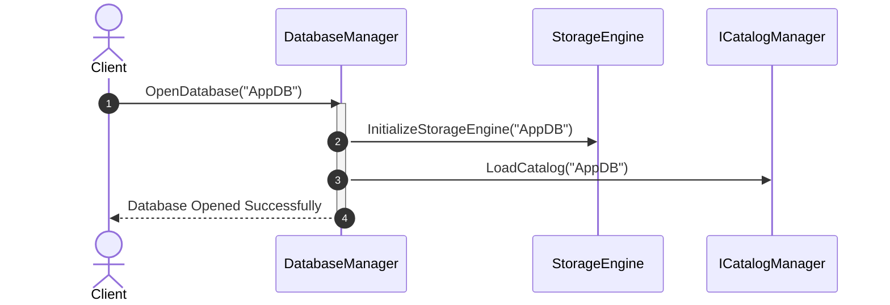

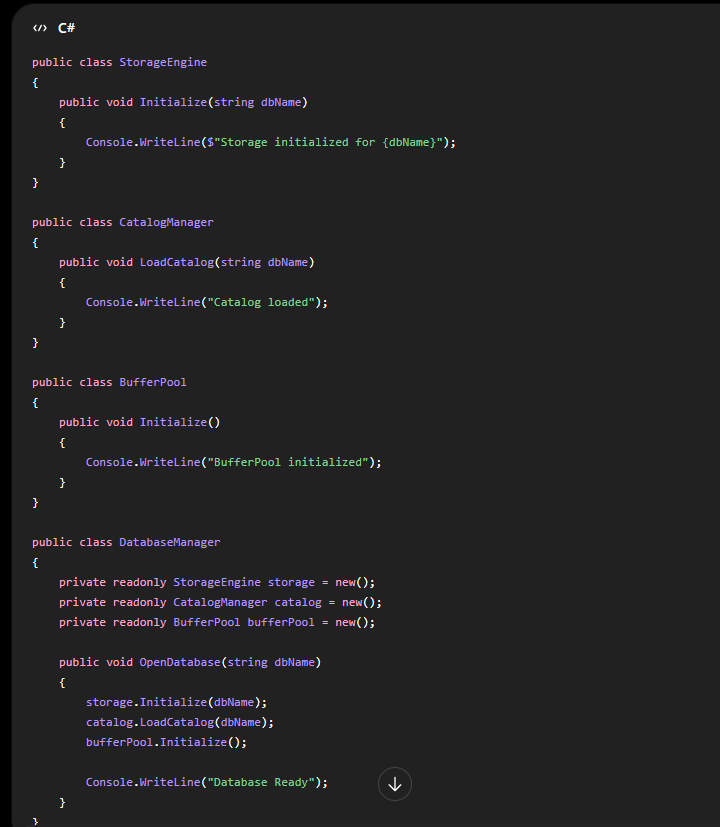

### 2. Database Manager - DB Instance Control (Singleton Pattern)

**Why use it?** We must ensure that only a single `DatabaseManager` (and internal managers like `BufferPool` or `WALManager`) instance coordinates operations across the entire DBMS process. Creating multiple instances would cause conflicts when accessing underlying files or managing memory buffers.

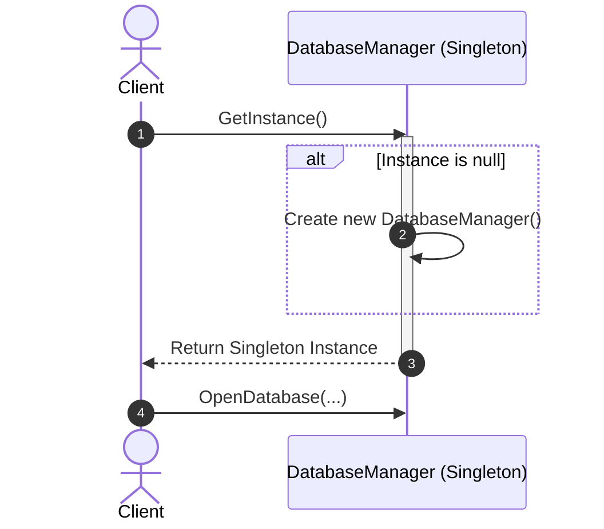

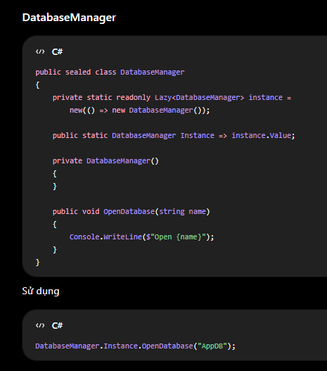

### 3. Schema & Table Operations - Create Table (Builder Pattern)

**Why use it?** A `Table` object is highly complex. It contains multiple `Column`s, `Constraint`s (Primary Key, Foreign Key), and `Index`es. A constructor with all these parameters would be unwieldy (Telescoping Constructor Anti-pattern). A `TableBuilder` allows step-by-step construction of the Table object.

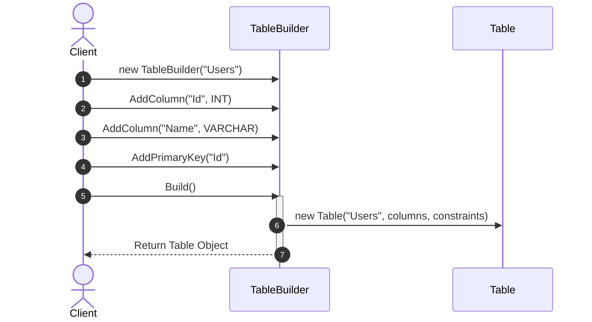

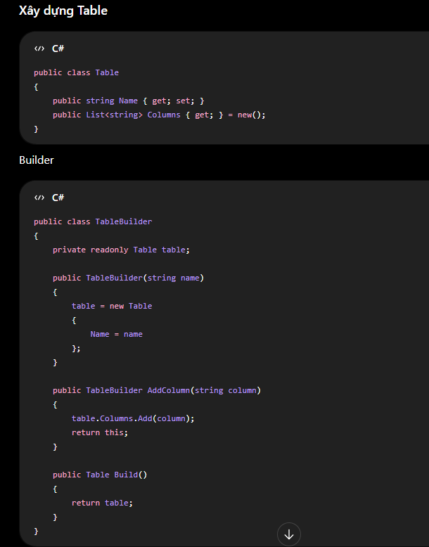
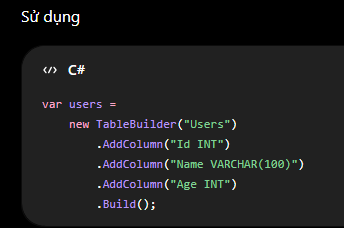

### 4. Schema & Table Operations - Constraint Validation (Strategy Pattern)

**Why use it?** Different constraints (Primary Key, Unique, Foreign Key, Check) require entirely different logic to validate a row. The Strategy pattern defines a common `Validate(Row)` interface in an abstract `Constraint` base class. This allows the `RecordManager` to validate rows without knowing the specific constraint details, making it easy to add new constraints later.

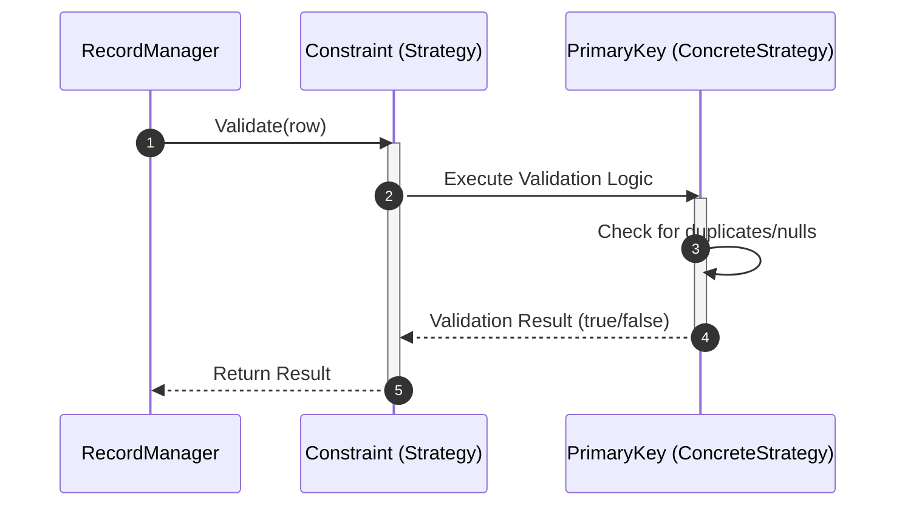

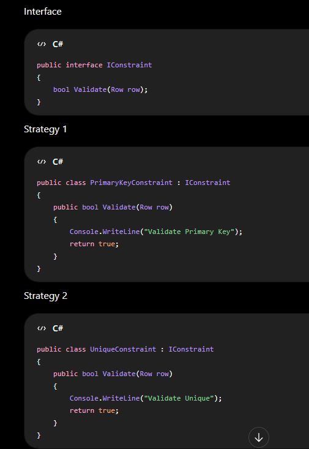
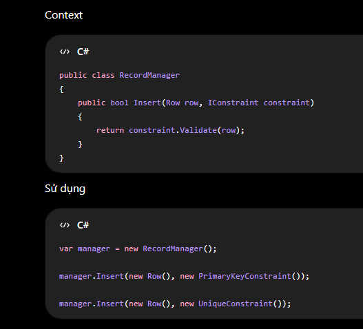

### 5. Schema & Table Operations - Index Creation (Factory Method Pattern)

**Why use it?** A DBMS can support multiple types of indexes (`BTreeIndex`, `HashIndex`, etc.). The exact type of index to create may depend on column types or user requests. A Factory Method encapsulates the instantiation logic, returning a common `Index` base class interface so the `Table` doesn't depend on concrete index classes.

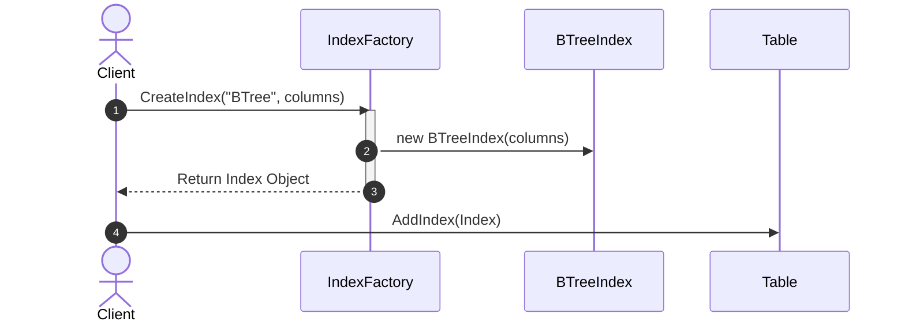

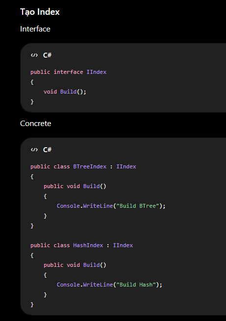
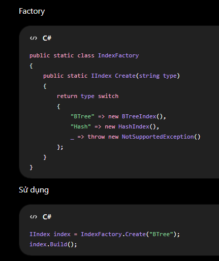

### 6. Schema & Table Operations - Object Hierarchy (Composite Pattern)

**Why use it?** Database metadata forms a natural tree structure: `Database` -> `Schema` -> `Table` -> `Column`/`Constraint`. The Composite pattern lets clients treat individual objects (like a Table) and compositions of objects (like a Schema) uniformly. For example, dropping a Schema cascades down to drop all Tables and Columns it contains without the client managing the loops.

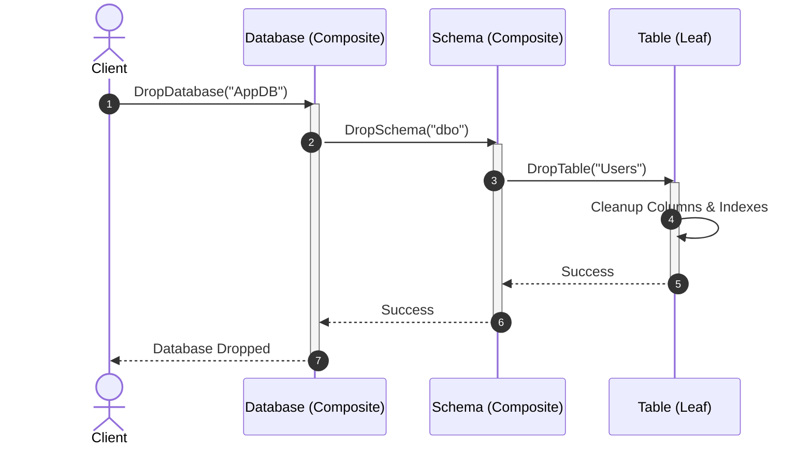

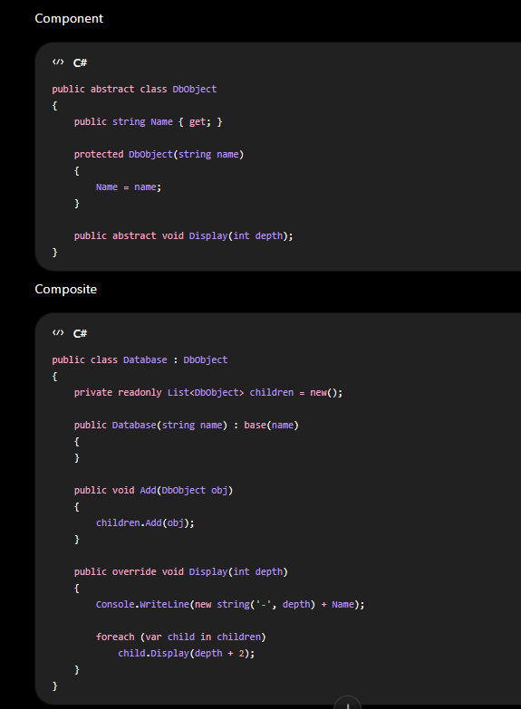
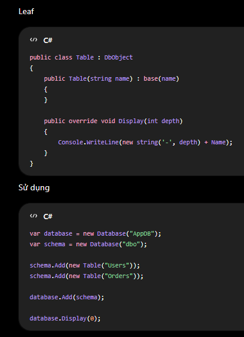
