# Features and Design Pattern Follow
This document outlines the Design Patterns implemented within various core components of the BBV-DBMS.

## Visual Summary Database Object

| Priority | Module | Main Feature | Main Classes | Application | Design Pattern | Progress |
| :---: | :--- | :--- | :--- | :--- | :--- | :---: |
| 🔥 Critical | Database Object | Metadata Hierarchy | `Database`, `Schema`, `Table`, child objects | Treats Database, Schema, Table, and Column objects uniformly as nodes in a hierarchy. | **Composite** | Completed |
| 🔥 Critical | Database Object | Table Definition, Complex Table Construction | `TableDefinition`, `TableBuilder`, `TableDirector` | Separates the construction of complex Table objects from their representation. | **Builder** | Completed |
| 🔥 Critical | Database Object | Constraint Object Creation | `ConstraintFactory` | Encapsulates the instantiation logic for various types of constraints. | **Factory Method** | Completed |
| 🔥 Critical | Database Object | Constraint Validation | Constraint validators | Defines a family of validation algorithms for different constraints and makes them interchangeable. | **Strategy** | Completed |
| 🔥 Critical | Database Object | Index Object Creation | `IndexFactory` | Encapsulates the instantiation logic for different types of indexes. | **Factory Method** | Completed |
| 🔥 Critical | Database Object | Encapsulate DDL Requests | DDL commands and executor | Encapsulates DDL requests as objects, allowing for logging, queuing, and execution. | **Command** | Completed |
| 🔥 Critical | Database Object | Coordinate Create/Drop/Alter | `SchemaService`, `DatabaseService` | Provides a simplified, unified interface to the complex subsystems involved in metadata modifications. | **Facade** | Completed |
| 🔴 High | Database Object | Metadata Traversal | `CatalogIterator`, `IIterableCatalog` | Provides a way to sequentially access metadata objects without exposing their underlying representation. | **Iterator** | Completed |
| 🔴 High | Metadata Events | Cache, Statistics, Audit Reactions | Event publisher and handlers | Defines a one-to-many dependency so that when metadata changes, all dependent components are notified. | **Observer** | Completed |
| 🔴 High | Database Object | Standardized DDL Execution Lifecycle | `DDLCommandTemplate`, `CreateTableCommand`, `AlterTableCommand`, `DropTableCommand` | Defines a fixed execution workflow for validating, checking permissions, applying metadata changes, persisting catalog data, and publishing events while allowing each DDL command to customize specific steps. | **Template Method** | Completed |
| 🟡 Medium | Metadata Utility | Export DDL, Dependency Scan | Visitors or traversal services | Separates metadata analysis and export algorithms from the object structure on which they operate. | **Visitor** | Not Started |
| 🟡 Medium | Trigger | Execute Trigger Actions | `TriggerExecutor`, trigger actions | Encapsulates trigger actions as objects for execution. | **Command** | Not Started |


---

```mermaid
classDiagram
direction LR

%% =====================================================
%% 1. EXTERNAL PORTS
%% =====================================================

class IDdlRequestSource {
    <<Client Port>>
    +Submit(command : IDdlCommand) DdlResult
}

class IStorageObjectPort {
    <<External Port>>
    +AllocateTable(table : Table)
    +DropTable(tableId : int)
    +AllocateIndex(index : Index)
    +DropIndex(indexId : int)
}

class IMetadataTransactionPort {
    <<External Port>>
    +Begin()
    +Commit()
    +Rollback()
}

%% =====================================================
%% 2. COMPOSITE — CATALOG OBJECT HIERARCHY
%% =====================================================

class ICatalogComponent {
    <<Component / Visitable Element>>
    +Name : string
    +Accept(visitor : IMetadataVisitor)
}

class ICatalogComposite {
    <<Composite>>
    +Children : IReadOnlyCollection~ICatalogComponent~
}

ICatalogComponent <|-- ICatalogComposite

class Database {
    <<Composite>>
    +DatabaseId : int
    +Name : string
    +Owner : string
    +Schemas : IReadOnlyCollection~Schema~
    +AddSchema(schema : Schema)
    +RemoveSchema(name : string)
    +GetSchema(name : string) Schema
    +CreateSchemaIterator() ICatalogIterator~Schema~
}

class Schema {
    <<Composite>>
    +SchemaId : int
    +Name : string
    +Parent : Database
    +Tables : IReadOnlyCollection~Table~
    +Views : IReadOnlyCollection~View~
    +Procedures : IReadOnlyCollection~StoredProcedure~
    +Sequences : IReadOnlyCollection~Sequence~
    +AddTable(table : Table)
    +RemoveTable(name : string)
    +GetTable(name : string) Table
    +CreateTableIterator() ICatalogIterator~Table~
}

class Table {
    <<Composite / Product>>
    +TableId : int
    +Name : string
    +Parent : Schema
    +Columns : IReadOnlyCollection~Column~
    +Constraints : IReadOnlyCollection~Constraint~
    +Indexes : IReadOnlyCollection~Index~
    +Partitions : IReadOnlyCollection~Partition~
    +Triggers : IReadOnlyCollection~Trigger~
    +AddColumn(column : Column)
    +RemoveColumn(name : string)
    +AddConstraint(constraint : Constraint)
    +AddIndex(index : Index)
    +AddPartition(partition : Partition)
    +AddTrigger(trigger : Trigger)
    +CreateColumnIterator() ICatalogIterator~Column~
}

class Column {
    <<Leaf>>
    +ColumnId : int
    +Name : string
    +DataType : DataType
    +Nullable : bool
    +DefaultValue : object
    +Rename(newName : string)
}

class View {
    <<Leaf>>
    +ViewId : int
    +Name : string
    +QueryDefinition : string
}

class StoredProcedure {
    <<Leaf>>
    +ProcedureId : int
    +Name : string
    +Body : string
}

class Sequence {
    <<Leaf>>
    +SequenceId : int
    +Name : string
    +CurrentValue : long
    +Increment : long
    +NextValue() long
}

class Partition {
    <<Leaf>>
    +PartitionId : int
    +Name : string
    +PartitionKey : string
    +PartitionType : PartitionType
}

class Trigger {
    <<Leaf>>
    +TriggerId : int
    +Name : string
    +Event : TriggerEvent
    +Timing : TriggerTiming
    +Body : string
}

ICatalogComposite <|.. Database
ICatalogComposite <|.. Schema
ICatalogComposite <|.. Table

ICatalogComponent <|.. Column
ICatalogComponent <|.. Constraint
ICatalogComponent <|.. Index
ICatalogComponent <|.. Partition
ICatalogComponent <|.. Trigger
ICatalogComponent <|.. View
ICatalogComponent <|.. StoredProcedure
ICatalogComponent <|.. Sequence

Database "1" *-- "*" Schema : contains
Schema "1" *-- "*" Table : contains
Schema "1" *-- "*" View : contains
Schema "1" *-- "*" StoredProcedure : contains
Schema "1" *-- "*" Sequence : contains
Table "1" *-- "*" Column : contains
Table "1" *-- "*" Constraint : contains
Table "1" *-- "*" Index : contains
Table "1" *-- "*" Partition : contains
Table "1" *-- "*" Trigger : contains

Column --> DataType
Partition --> PartitionType
Trigger --> TriggerEvent
Trigger --> TriggerTiming

%% =====================================================
%% 3. STRATEGY — CONSTRAINT VALIDATION
%% =====================================================

class Constraint {
    <<Abstract Strategy / Leaf>>
    +ConstraintId : int
    +Name : string
    +Validate(context : ConstraintValidationContext) ConstraintValidationResult
}

class PrimaryKeyConstraint {
    <<Concrete Strategy>>
    +Columns : IReadOnlyCollection~Column~
}

class UniqueConstraint {
    <<Concrete Strategy>>
    +Columns : IReadOnlyCollection~Column~
}

class ForeignKeyConstraint {
    <<Concrete Strategy>>
    +Columns : IReadOnlyCollection~Column~
    +ReferenceTable : Table
    +ReferenceColumns : IReadOnlyCollection~Column~
}

class CheckConstraint {
    <<Concrete Strategy>>
    +Expression : string
}

class ConstraintValidationContext {
    <<Context Data>>
    +Table : Table
    +Values : IReadOnlyDictionary~int, object~
    +Operation : ValidationOperation
}

class ConstraintValidationResult {
    <<Result>>
    +IsValid : bool
    +Message : string
}

class IRowKeyExtractor {
    <<Collaborator>>
    +ExtractKey(values : IReadOnlyDictionary~int, object~, columns : IReadOnlyCollection~Column~) object
    +HasNullValue(values : IReadOnlyDictionary~int, object~, columns : IReadOnlyCollection~Column~) bool
}

Constraint <|-- PrimaryKeyConstraint
Constraint <|-- UniqueConstraint
Constraint <|-- ForeignKeyConstraint
Constraint <|-- CheckConstraint
Constraint --> ConstraintValidationContext : validates
Constraint --> ConstraintValidationResult : returns
ConstraintValidationContext --> Table
ConstraintValidationContext --> ValidationOperation
PrimaryKeyConstraint --> IRowKeyExtractor
UniqueConstraint --> IRowKeyExtractor
ForeignKeyConstraint --> Table : references
PrimaryKeyConstraint --> Index : checks uniqueness
UniqueConstraint --> Index : checks uniqueness

%% =====================================================
%% 4. INDEX DOMAIN OBJECTS
%% Chỉ mô tả metadata; thao tác vật lý thuộc Storage Engine.
%% =====================================================

class Index {
    <<abstract Leaf>>
    +IndexId : int
    +Name : string
    +Columns : IReadOnlyCollection~Column~
    +Unique : bool
}

class BTreeIndex
class HashIndex
class BitmapIndex

Index <|-- BTreeIndex
Index <|-- HashIndex
Index <|-- BitmapIndex
Index --> Column : indexes

%% =====================================================
%% 5. CONSTRUCTION DATA
%% =====================================================

class TableDefinition {
    <<Construction Data>>
    +Name : string
    +Columns : IReadOnlyCollection~ColumnDefinition~
    +Constraints : IReadOnlyCollection~ConstraintOptions~
    +Indexes : IReadOnlyCollection~IndexOptions~
    +Partitions : IReadOnlyCollection~PartitionDefinition~
    +Triggers : IReadOnlyCollection~TriggerDefinition~
    +Validate() DefinitionValidationResult
}

class ColumnDefinition {
    <<DTO>>
    +Name : string
    +DataType : DataType
    +Nullable : bool
    +DefaultValue : object
}

class ConstraintOptions {
    <<DTO>>
    +Type : ConstraintType
    +Name : string
    +Columns : IReadOnlyCollection~string~
    +ReferenceTable : string
    +ReferenceColumns : IReadOnlyCollection~string~
    +Expression : string
}

class IndexOptions {
    <<DTO>>
    +Type : IndexType
    +Name : string
    +Columns : IReadOnlyCollection~string~
    +Unique : bool
}

class PartitionDefinition {
    <<DTO>>
    +Name : string
    +PartitionKey : string
    +Type : PartitionType
}

class TriggerDefinition {
    <<DTO>>
    +Name : string
    +Event : TriggerEvent
    +Timing : TriggerTiming
    +Body : string
}

class DefinitionValidationResult {
    <<Result>>
    +IsValid : bool
    +Errors : IReadOnlyCollection~string~
}

TableDefinition "1" *-- "*" ColumnDefinition
TableDefinition "1" *-- "*" ConstraintOptions
TableDefinition "1" *-- "*" IndexOptions
TableDefinition "1" *-- "*" PartitionDefinition
TableDefinition "1" *-- "*" TriggerDefinition
TableDefinition --> DefinitionValidationResult : returns
ColumnDefinition --> DataType
ConstraintOptions --> ConstraintType
IndexOptions --> IndexType
PartitionDefinition --> PartitionType
TriggerDefinition --> TriggerEvent
TriggerDefinition --> TriggerTiming

%% =====================================================
%% 6. BUILDER — TABLE CONSTRUCTION
%% =====================================================

class ITableBuilder {
    <<Builder>>
    +Reset()
    +SetName(name : string)
    +AddColumn(column : Column)
    +AddConstraint(constraint : Constraint)
    +AddIndex(index : Index)
    +AddPartition(partition : Partition)
    +AddTrigger(trigger : Trigger)
    +Build() Table
}

class TableBuilder {
    <<Concrete Builder>>
    -currentTable : Table
    -initialized : bool
    +Reset()
    +SetName(name : string)
    +AddColumn(column : Column)
    +AddConstraint(constraint : Constraint)
    +AddIndex(index : Index)
    +AddPartition(partition : Partition)
    +AddTrigger(trigger : Trigger)
    +Build() Table
    -EnsureInitialized()
    -ValidateBeforeBuild()
}

class TableDirector {
    <<Director>>
    -builder : ITableBuilder
    -constraintFactory : IConstraintFactory
    -indexFactory : IIndexFactory
    +Construct(definition : TableDefinition) Table
    -CreateColumn(definition : ColumnDefinition) Column
    -CreatePartition(definition : PartitionDefinition) Partition
    -CreateTrigger(definition : TriggerDefinition) Trigger
    -CreateBuildContext(tableName : string, columns : IReadOnlyCollection~Column~) TableBuildContext
}

class TableBuildContext {
    <<Build Context>>
    +TableName : string
    +Columns : IReadOnlyCollection~Column~
    +FindColumn(name : string) Column
}

ITableBuilder <|.. TableBuilder
TableDirector --> ITableBuilder : directs
TableDirector --> IConstraintFactory : creates constraints
TableDirector --> IIndexFactory : creates indexes
TableDirector --> TableDefinition : reads
TableDirector --> ColumnDefinition : creates columns
TableDirector --> PartitionDefinition : creates partitions
TableDirector --> TriggerDefinition : creates triggers
TableDirector --> TableBuildContext : creates
TableBuilder --> Table : builds
TableBuilder --> Column : adds
TableBuilder --> Constraint : adds
TableBuilder --> Index : adds
TableBuilder --> Partition : adds
TableBuilder --> Trigger : adds
TableBuildContext --> Column : resolves

%% =====================================================
%% 7. FACTORY METHOD — DYNAMIC OBJECT CREATION
%% =====================================================

class IConstraintFactory {
    <<Factory>>
    +Create(options : ConstraintOptions, context : TableBuildContext) Constraint
}

class ConstraintFactory {
    <<Concrete Factory>>
    +Create(options : ConstraintOptions, context : TableBuildContext) Constraint
}

class IIndexFactory {
    <<Factory>>
    +Create(options : IndexOptions, context : TableBuildContext) Index
}

class IndexFactory {
    <<Concrete Factory>>
    +Create(options : IndexOptions, context : TableBuildContext) Index
}

IConstraintFactory <|.. ConstraintFactory
IIndexFactory <|.. IndexFactory
IConstraintFactory --> ConstraintOptions : reads
IConstraintFactory --> TableBuildContext : resolves columns
IConstraintFactory --> Constraint : creates
IIndexFactory --> IndexOptions : reads
IIndexFactory --> TableBuildContext : resolves columns
IIndexFactory --> Index : creates

%% =====================================================
%% 8. FACADE — APPLICATION ENTRY POINT
%% Facade chỉ điều phối domain và subsystem.
%% Transaction workflow thuộc DdlCommandTemplate.
%% =====================================================

class IDatabaseService {
    <<Facade Interface>>
    +CreateSchema(database : Database, name : string) Schema
    +DropSchema(database : Database, name : string, cascade : bool)
    +RenameSchema(database : Database, oldName : string, newName : string)
}

class DatabaseService {
    <<Facade>>
    -catalog : ICatalogManager
}

class ISchemaService {
    <<Facade Interface>>
    +CreateTable(schema : Schema, definition : TableDefinition) Table
    +DropTable(schema : Schema, name : string, cascade : bool)
    +AlterTable(table : Table, operation : TableAlterOperation)
    +CreateView(schema : Schema, definition : ViewDefinition) View
    +CreateProcedure(schema : Schema, definition : ProcedureDefinition) StoredProcedure
    +CreateSequence(schema : Schema, definition : SequenceDefinition) Sequence
}

class SchemaService {
    <<Facade>>
    -catalog : ICatalogManager
    -tableDirector : TableDirector
    -storage : IStorageObjectPort
}

IDatabaseService <|.. DatabaseService
ISchemaService <|.. SchemaService

DatabaseService --> ICatalogManager : coordinates metadata
DatabaseService --> Database : manages

SchemaService --> ICatalogManager : coordinates metadata
SchemaService --> TableDirector : builds tables
SchemaService --> IStorageObjectPort : coordinates storage
SchemaService --> Schema : manages

%% =====================================================
%% 9. COMMAND + TEMPLATE METHOD — DDL EXECUTION
%% Command đóng gói yêu cầu DDL.
%% Template Method cố định workflow chung cho mọi DDL command.
%% =====================================================

class IDdlCommand {
    <<Command>>
    +Execute() DdlResult
}

class DdlCommandTemplate {
    <<Abstract Command / Template Method>>

    #catalog : ICatalogManager
    #transaction : IMetadataTransactionPort
    #eventCollector : IMetadataEventCollector
    #eventDispatcher : MetadataEventCommitDispatcher
    #context : MetadataChangeContext
    #affectedObject : ICatalogComponent

    +Execute() DdlResult

    #Validate()*
    #CheckPreconditions()*
    #ApplyChange() ICatalogComponent*
    #PersistMetadata(component : ICatalogComponent)
    #CreateEvent(component : ICatalogComponent) MetadataEvent*
    #RecordEvent(event : MetadataEvent)
    #CreateSuccessResult(component : ICatalogComponent) DdlResult
    #CreateFailureResult(message : string) DdlResult
}

class CreateSchemaCommand {
    <<Concrete Command>>
    -receiver : IDatabaseService
    -database : Database
    -schemaName : string

    #Validate()
    #CheckPreconditions()
    #ApplyChange() ICatalogComponent
    #CreateEvent(component : ICatalogComponent) MetadataEvent
}

class CreateTableCommand {
    <<Concrete Command>>
    -receiver : ISchemaService
    -schema : Schema
    -definition : TableDefinition

    #Validate()
    #CheckPreconditions()
    #ApplyChange() ICatalogComponent
    #CreateEvent(component : ICatalogComponent) MetadataEvent
}

class AlterTableCommand {
    <<Concrete Command>>
    -receiver : ISchemaService
    -table : Table
    -operation : TableAlterOperation

    #Validate()
    #CheckPreconditions()
    #ApplyChange() ICatalogComponent
    #CreateEvent(component : ICatalogComponent) MetadataEvent
}

class DropTableCommand {
    <<Concrete Command>>
    -receiver : ISchemaService
    -schema : Schema
    -tableName : string
    -cascade : bool

    #Validate()
    #CheckPreconditions()
    #ApplyChange() ICatalogComponent
    #CreateEvent(component : ICatalogComponent) MetadataEvent
}

class IDdlCommandExecutor {
    <<Invoker Interface>>
    +Execute(command : IDdlCommand) DdlResult
}

class DdlCommandExecutor {
    <<Invoker>>
    +Execute(command : IDdlCommand) DdlResult
}

class DdlResult {
    <<Result>>
    +Success : bool
    +Message : string
    +AffectedObject : ICatalogComponent
}

IDdlCommand <|.. DdlCommandTemplate

DdlCommandTemplate <|-- CreateSchemaCommand
DdlCommandTemplate <|-- CreateTableCommand
DdlCommandTemplate <|-- AlterTableCommand
DdlCommandTemplate <|-- DropTableCommand

IDdlCommandExecutor <|.. DdlCommandExecutor
IDdlCommandExecutor --> IDdlCommand : invokes
IDdlRequestSource --> IDdlCommandExecutor : submits

DdlCommandTemplate --> ICatalogManager : persists metadata
DdlCommandTemplate --> IMetadataTransactionPort : controls transaction
DdlCommandTemplate --> IMetadataEventCollector : records events
DdlCommandTemplate --> MetadataEventCommitDispatcher : dispatches after commit
DdlCommandTemplate --> MetadataChangeContext : uses
DdlCommandTemplate --> MetadataEvent : creates
DdlCommandTemplate --> ICatalogComponent : processes
DdlCommandTemplate --> DdlResult : returns

CreateSchemaCommand --> IDatabaseService : receiver
CreateSchemaCommand --> Database : target

CreateTableCommand --> ISchemaService : receiver
CreateTableCommand --> Schema : target
CreateTableCommand --> TableDefinition : carries

AlterTableCommand --> ISchemaService : receiver
AlterTableCommand --> Table : target
AlterTableCommand --> TableAlterOperation : carries

DropTableCommand --> ISchemaService : receiver
DropTableCommand --> Schema : target

DdlResult --> ICatalogComponent : affected object

%% =====================================================
%% 10. CATALOG COORDINATION
%% Không biểu diễn Repository Pattern hoặc persistence implementation.
%% =====================================================

class ICatalogManager {
    <<Subsystem Interface>>
    +Register(component : ICatalogComponent, context : MetadataChangeContext)
    +Update(component : ICatalogComponent, context : MetadataChangeContext)
    +Remove(component : ICatalogComponent, context : MetadataChangeContext)
    +GetDatabase(name : string) Database
    +GetSchema(databaseId : int, name : string) Schema
    +GetTable(schemaId : int, name : string) Table
    +ObjectExists(parent : ICatalogComposite, name : string) bool
}

class CatalogManager {
    <<Subsystem>>
    +Register(component : ICatalogComponent, context : MetadataChangeContext)
    +Update(component : ICatalogComponent, context : MetadataChangeContext)
    +Remove(component : ICatalogComponent, context : MetadataChangeContext)
    +GetDatabase(name : string) Database
    +GetSchema(databaseId : int, name : string) Schema
    +GetTable(schemaId : int, name : string) Table
    +ObjectExists(parent : ICatalogComposite, name : string) bool
}

ICatalogManager <|.. CatalogManager
ICatalogManager --> ICatalogComponent : manages
ICatalogManager --> ICatalogComposite : searches

%% =====================================================
%% 11. OBSERVER — METADATA EVENTS
%% =====================================================

class MetadataChangeContext {
    <<Event Context>>
    +Actor : string
    +SessionId : string
    +TransactionId : string
    +Timestamp : DateTime
}

class MetadataEvent {
    <<Event>>
    +EventId : Guid
    +EventType : MetadataEventType
    +ObjectName : string
    +Context : MetadataChangeContext
    +PreviousSnapshot : MetadataSnapshot
    +CurrentSnapshot : MetadataSnapshot
}

class MetadataSnapshot {
    <<Event Data>>
    +Properties : IReadOnlyDictionary~string, object~
}

class IMetadataEventCollector {
    <<Transactional Event Collector>>
    +Add(event : MetadataEvent)
    +GetPendingEvents() IReadOnlyCollection~MetadataEvent~
    +Clear()
}

class MetadataEventCollector {
    <<Concrete Event Collector>>
    -pendingEvents : List~MetadataEvent~
    +Add(event : MetadataEvent)
    +GetPendingEvents() IReadOnlyCollection~MetadataEvent~
    +Clear()
}

class IMetadataEventPublisher {
    <<Subject>>
    +Subscribe(observer : IMetadataObserver)
    +Unsubscribe(observer : IMetadataObserver)
    +Publish(event : MetadataEvent)
}

class MetadataEventPublisher {
    <<Concrete Subject>>
    -observers : List~IMetadataObserver~
    +Subscribe(observer : IMetadataObserver)
    +Unsubscribe(observer : IMetadataObserver)
    +Publish(event : MetadataEvent)
}

class IMetadataObserver {
    <<Observer>>
    +OnMetadataChanged(event : MetadataEvent)
}

class MetadataEventCommitDispatcher {
    <<Commit Dispatcher>>
    -collector : IMetadataEventCollector
    -publisher : IMetadataEventPublisher
    +DispatchCommittedEvents()
    +DiscardRolledBackEvents()
}

class CatalogCacheObserver {
    <<Concrete Observer>>
    -cache : ICatalogCache
    +OnMetadataChanged(event : MetadataEvent)
}

class MetadataStatisticsObserver {
    <<Concrete Observer>>
    -statisticsStore : IMetadataStatisticsStore
    +OnMetadataChanged(event : MetadataEvent)
}

class MetadataAuditObserver {
    <<Concrete Observer>>
    -auditStore : IMetadataAuditStore
    +OnMetadataChanged(event : MetadataEvent)
}

class ICatalogCache {
    <<Cache Port>>
    +Get(name : string) ICatalogComponent
    +Set(component : ICatalogComponent)
    +Remove(name : string)
    +InvalidateChildren(parentName : string)
}

class IMetadataStatisticsStore {
    <<Statistics Port>>
    +IncrementObjectCount()
    +DecrementObjectCount()
    +RecordModification(timestamp : DateTime)
}

class IMetadataAuditStore {
    <<Audit Port>>
    +Append(event : MetadataEvent)
}

IMetadataEventCollector <|.. MetadataEventCollector
IMetadataEventPublisher <|.. MetadataEventPublisher
IMetadataObserver <|.. CatalogCacheObserver
IMetadataObserver <|.. MetadataStatisticsObserver
IMetadataObserver <|.. MetadataAuditObserver
MetadataEventCollector o-- "*" MetadataEvent : pending
MetadataEventCommitDispatcher --> IMetadataEventCollector : reads or clears
MetadataEventCommitDispatcher --> IMetadataEventPublisher : publishes after commit
MetadataEventPublisher o-- "*" IMetadataObserver : notifies
MetadataEventPublisher --> MetadataEvent : publishes
IMetadataObserver --> MetadataEvent : receives
CatalogCacheObserver --> ICatalogCache
MetadataStatisticsObserver --> IMetadataStatisticsStore
MetadataAuditObserver --> IMetadataAuditStore
MetadataEvent --> MetadataEventType
MetadataEvent --> MetadataChangeContext
MetadataEvent --> MetadataSnapshot
ICatalogCache --> ICatalogComponent : caches
IMetadataAuditStore --> MetadataEvent : stores

%% =====================================================
%% 12. ITERATOR — METADATA TRAVERSAL
%% =====================================================

class ICatalogIterator~T~ {
    <<Iterator>>
    +MoveNext() bool
    +Current : T
}

class CatalogIterator~T~ {
    <<Concrete Iterator>>
    -items : IReadOnlyList~T~
    -position : int
    +MoveNext() bool
    +Current : T
}

class CatalogTraversalService {
    <<Iterator Client>>
    +TraverseDatabase(database : Database)
    +TraverseSchema(schema : Schema)
    +TraverseTable(table : Table)
}

ICatalogIterator~T~ <|.. CatalogIterator~T~
Database --> ICatalogIterator~Schema~ : creates
Schema --> ICatalogIterator~Table~ : creates
Table --> ICatalogIterator~Column~ : creates
CatalogTraversalService --> Database
CatalogTraversalService --> Schema
CatalogTraversalService --> Table

%% =====================================================
%% 13. VISITOR — METADATA UTILITY
%% Adds metadata operations without modifying catalog objects.
%% =====================================================

class IMetadataVisitor {
    <<Visitor>>
    +VisitDatabase(database : Database)
    +VisitSchema(schema : Schema)
    +VisitTable(table : Table)
    +VisitColumn(column : Column)
    +VisitConstraint(constraint : Constraint)
    +VisitIndex(index : Index)
    +VisitPartition(partition : Partition)
    +VisitTrigger(trigger : Trigger)
    +VisitView(view : View)
    +VisitStoredProcedure(procedure : StoredProcedure)
    +VisitSequence(sequence : Sequence)
}

class DdlExportVisitor {
    <<Concrete Visitor>>
    -ddl : StringBuilder
    +VisitDatabase(database : Database)
    +VisitSchema(schema : Schema)
    +VisitTable(table : Table)
    +VisitColumn(column : Column)
    +VisitConstraint(constraint : Constraint)
    +VisitIndex(index : Index)
    +VisitPartition(partition : Partition)
    +VisitTrigger(trigger : Trigger)
    +VisitView(view : View)
    +VisitStoredProcedure(procedure : StoredProcedure)
    +VisitSequence(sequence : Sequence)
    +GetResult() string
}

class DependencyScanVisitor {
    <<Concrete Visitor>>
    -dependencies : List~MetadataDependency~
    +VisitDatabase(database : Database)
    +VisitSchema(schema : Schema)
    +VisitTable(table : Table)
    +VisitColumn(column : Column)
    +VisitConstraint(constraint : Constraint)
    +VisitIndex(index : Index)
    +VisitPartition(partition : Partition)
    +VisitTrigger(trigger : Trigger)
    +VisitView(view : View)
    +VisitStoredProcedure(procedure : StoredProcedure)
    +VisitSequence(sequence : Sequence)
    +GetDependencies() IReadOnlyCollection~MetadataDependency~
}

class MetadataDependency {
    <<Visitor Result>>
    +SourceName : string
    +TargetName : string
    +DependencyType : MetadataDependencyType
}

IMetadataVisitor <|.. DdlExportVisitor
IMetadataVisitor <|.. DependencyScanVisitor

ICatalogComponent ..> IMetadataVisitor : accepts
DdlExportVisitor --> ICatalogComponent : visits
DependencyScanVisitor --> ICatalogComponent : scans
DependencyScanVisitor --> MetadataDependency : creates
MetadataDependency --> MetadataDependencyType

%% =====================================================
%% 14. SUPPORTING TYPES
%% =====================================================

class TableAlterOperation {
    <<Command Data>>
    +Type : TableAlterType
    +Payload : object
}

class ViewDefinition {
    <<DTO>>
    +Name : string
    +QueryDefinition : string
}

class ProcedureDefinition {
    <<DTO>>
    +Name : string
    +Body : string
}

class SequenceDefinition {
    <<DTO>>
    +Name : string
    +StartValue : long
    +Increment : long
}

class DataType {
    <<enumeration>>
    INT
    BIGINT
    VARCHAR
    BOOLEAN
    FLOAT
    DECIMAL
    DATETIME
}

class ConstraintType {
    <<enumeration>>
    PRIMARY_KEY
    UNIQUE
    FOREIGN_KEY
    CHECK
}

class IndexType {
    <<enumeration>>
    BTREE
    HASH
    BITMAP
}

class PartitionType {
    <<enumeration>>
    RANGE
    LIST
    HASH
}

class TriggerEvent {
    <<enumeration>>
    INSERT
    UPDATE
    DELETE
}

class TriggerTiming {
    <<enumeration>>
    BEFORE
    AFTER
    INSTEAD_OF
}

class ValidationOperation {
    <<enumeration>>
    INSERT
    UPDATE
}

class TableAlterType {
    <<enumeration>>
    ADD_COLUMN
    DROP_COLUMN
    ADD_CONSTRAINT
    DROP_CONSTRAINT
    ADD_INDEX
    DROP_INDEX
    RENAME
}

class MetadataEventType {
    <<enumeration>>
    CREATED
    UPDATED
    RENAMED
    REMOVED
}

class MetadataDependencyType {
    <<enumeration>>
    CONTAINS
    REFERENCES
    DEPENDS_ON
    INDEXES
    TRIGGERS
}

TableAlterOperation --> TableAlterType
SchemaService --> TableAlterOperation
SchemaService --> ViewDefinition
SchemaService --> ProcedureDefinition
SchemaService --> SequenceDefinition
```

## Visual Summary Database Server & Database Lifecycle

| Priority | Module | Main Feature | Main Classes | Application | Design Pattern | Progress |
| :---: | :--- | :--- | :--- | :--- | :--- | :---: |
| 🔥 Critical | Server Management | Server Lifecycle | `DatabaseServer` | Provides a unified interface for starting, stopping, restarting, and recovering the database server. | **Facade** | Completed |
| 🔥 Critical | Server Management | Server State Management | `DatabaseServer`, `IServerState` | Encapsulates behaviors for Stopped, Running, Recovering, and Failed states. | **State** | Completed |
| 🔥 Critical | Database Management | Database Lifecycle | `DatabaseManager` | Coordinates catalog and connection pool operations for creating, opening, closing, and dropping databases. | **Facade** | Not Started |
| 🔥 Critical | Security | Authentication | `SecurityManager`, `IAuthenticationStrategy` | Supports password, token, certificate, and external authentication mechanisms. | **Strategy** | Not Started |
| 🔥 Critical | Security | Authorization | `SecurityManager`, `IAuthorizationStrategy` | Supports RBAC, ACL, and policy-based permission checking. | **Strategy** | Not Started |
| 🔴 High | Database Management | Database Creation | `IDatabaseFactory`, `DatabaseFactory` | Centralizes the construction and initialization of database objects. | **Factory Method** | Not Started |
| 🔴 High | Database Management | Database State | `Database`, `IDatabaseState` | Controls database behavior in Online, Offline, ReadOnly, and Restoring states. | **State** | Not Started |
| 🔴 High | Configuration | Configuration Loading | `ConfigurationManager`, `IConfigurationLoader` | Supports loading configuration from JSON, XML, environment variables, or command-line sources. | **Strategy** | Not Started |
| 🔴 High | Security | Protected Database Access | `SecuredDatabaseProxy` | Validates permissions before forwarding operations to database objects. | **Proxy** | Not Started |
| 🔴 High | Monitoring | Metrics Collection | `MonitoringManager`, `IMetricCollector` | Separates CPU, memory, query, transaction, and connection metric collection. | **Strategy** | Not Started |
| 🔴 High | Monitoring | Runtime Event Monitoring | `MonitoringManager`, event publishers | Receives query, transaction, connection, and error events from server components. | **Observer** | Not Started |
| 🟡 Medium | Server Management | Administrative Operations | `StartServerCommand`, `StopServerCommand`, `RecoverServerCommand` | Encapsulates server operations for auditing, scheduling, and retrying. | **Command** | Not Started |
| 🟡 Medium | Configuration | Dynamic Configuration | `ConfigurationManager`, configuration observers | Notifies dependent components when configuration values change. | **Observer** | Not Started |
| 🟢 Low | Monitoring | Metrics Export | `PrometheusMetricsAdapter`, `OpenTelemetryAdapter` | Converts internal server metrics into external monitoring formats. | **Adapter** | Not Started |


## Sequence Diagrams (Database Manager & Metadata)

### 1. Hierarchy Management (Composite Pattern)

**Purpose:**  
Represent metadata as a tree so parent and child objects are managed uniformly.

**Application:**  
`Database → Schema → Table → Column`

#### Class Diagram

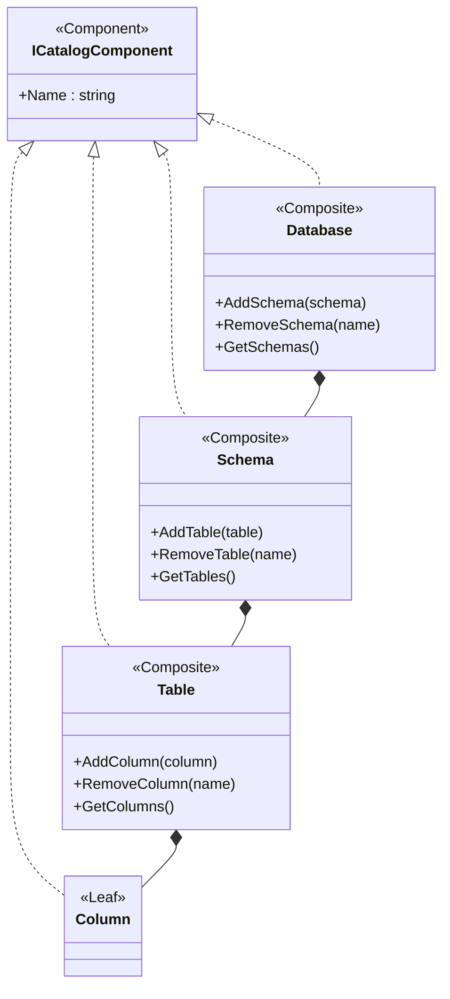
```mermaid
classDiagram
direction TB

class ICatalogComponent{
    <<Component>>
    +Name : string
}

class Database{
    <<Composite>>
    +AddSchema(schema)
    +RemoveSchema(name)
    +GetSchemas()
}

class Schema{
    <<Composite>>
    +AddTable(table)
    +RemoveTable(name)
    +GetTables()
}

class Table{
    <<Composite>>
    +AddColumn(column)
    +RemoveColumn(name)
    +GetColumns()
}

class Column{
    <<Leaf>>
}

ICatalogComponent <|.. Database
ICatalogComponent <|.. Schema
ICatalogComponent <|.. Table
ICatalogComponent <|.. Column

Database *-- Schema
Schema *-- Table
Table *-- Column
```

#### Sequence Diagram

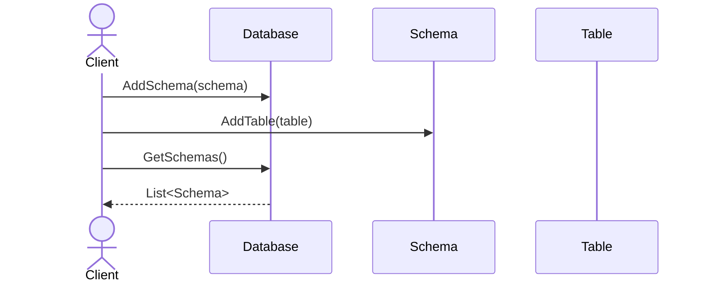
```mermaid
sequenceDiagram
    actor Client
    participant DB as Database
    participant Schema
    participant Table

    Client->>DB: AddSchema(schema)
    Client->>Schema: AddTable(table)
    Client->>DB: GetSchemas()
    DB-->>Client: List<Schema>
```

#### Simplified Code

```csharp
public interface ICatalogComponent
{
    string Name { get; }
}

public class Database : ICatalogComponent
{
    public string Name { get; init; }

    // Add a child Schema
    public void AddSchema(Schema schema) { }

    // Remove a child Schema
    public void RemoveSchema(string name) { }

    // Return all child Schemas
    public IReadOnlyCollection<Schema> GetSchemas() => [];
}

public class Schema : ICatalogComponent
{
    public string Name { get; init; }

    // Add a child Table
    public void AddTable(Table table) { }

    // Return all child Tables
    public IReadOnlyCollection<Table> GetTables() => [];
}

public class Table : ICatalogComponent
{
    public string Name { get; init; }

    // Add a child Column
    public void AddColumn(Column column) { }

    // Return all child Columns
    public IReadOnlyCollection<Column> GetColumns() => [];
}

public class Column : ICatalogComponent
{
    public string Name { get; init; }
}
```

**Benefits**

- Models metadata as a tree structure.
- Parent and child objects are managed consistently.
- Easy to traverse the metadata hierarchy.

**Application:** Models the metadata tree: Database → Schema → Table → Column.

**Why apply?** Composite Pattern structures data into a tree form, providing uniform Add/Remove functions. The diagram below shows assigning objects together to form a parent-child structure, making it easy to access the entire branch (e.g., `GetSchemas()`, `GetTables()`).

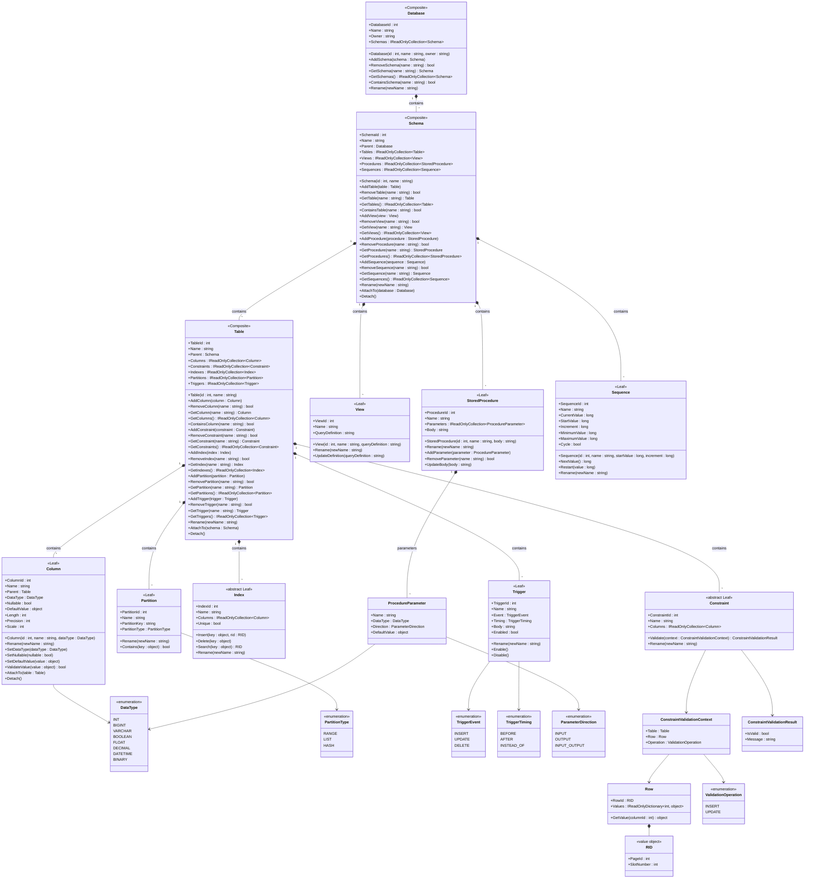
```mermaid
classDiagram
direction TB

%% =====================================================
%% Composite Root
%% =====================================================

class Database {
    <<Composite>>
    +DatabaseId : int
    +Name : string
    +Owner : string
    +Schemas : IReadOnlyCollection~Schema~

    +Database(id : int, name : string, owner : string)

    +AddSchema(schema : Schema)
    +RemoveSchema(name : string) bool
    +GetSchema(name : string) Schema
    +GetSchemas() IReadOnlyCollection~Schema~
    +ContainsSchema(name : string) bool
    +Rename(newName : string)
}

%% =====================================================
%% Schema Composite
%% =====================================================

class Schema {
    <<Composite>>
    +SchemaId : int
    +Name : string
    +Parent : Database

    +Tables : IReadOnlyCollection~Table~
    +Views : IReadOnlyCollection~View~
    +Procedures : IReadOnlyCollection~StoredProcedure~
    +Sequences : IReadOnlyCollection~Sequence~

    +Schema(id : int, name : string)

    +AddTable(table : Table)
    +RemoveTable(name : string) bool
    +GetTable(name : string) Table
    +GetTables() IReadOnlyCollection~Table~
    +ContainsTable(name : string) bool

    +AddView(view : View)
    +RemoveView(name : string) bool
    +GetView(name : string) View
    +GetViews() IReadOnlyCollection~View~

    +AddProcedure(procedure : StoredProcedure)
    +RemoveProcedure(name : string) bool
    +GetProcedure(name : string) StoredProcedure
    +GetProcedures() IReadOnlyCollection~StoredProcedure~

    +AddSequence(sequence : Sequence)
    +RemoveSequence(name : string) bool
    +GetSequence(name : string) Sequence
    +GetSequences() IReadOnlyCollection~Sequence~

    +Rename(newName : string)
    +AttachTo(database : Database)
    +Detach()
}

%% =====================================================
%% Table Composite
%% =====================================================

class Table {
    <<Composite>>
    +TableId : int
    +Name : string
    +Parent : Schema

    +Columns : IReadOnlyCollection~Column~
    +Constraints : IReadOnlyCollection~Constraint~
    +Indexes : IReadOnlyCollection~Index~
    +Partitions : IReadOnlyCollection~Partition~
    +Triggers : IReadOnlyCollection~Trigger~

    +Table(id : int, name : string)

    +AddColumn(column : Column)
    +RemoveColumn(name : string) bool
    +GetColumn(name : string) Column
    +GetColumns() IReadOnlyCollection~Column~
    +ContainsColumn(name : string) bool

    +AddConstraint(constraint : Constraint)
    +RemoveConstraint(name : string) bool
    +GetConstraint(name : string) Constraint
    +GetConstraints() IReadOnlyCollection~Constraint~

    +AddIndex(index : Index)
    +RemoveIndex(name : string) bool
    +GetIndex(name : string) Index
    +GetIndexes() IReadOnlyCollection~Index~

    +AddPartition(partition : Partition)
    +RemovePartition(name : string) bool
    +GetPartition(name : string) Partition
    +GetPartitions() IReadOnlyCollection~Partition~

    +AddTrigger(trigger : Trigger)
    +RemoveTrigger(name : string) bool
    +GetTrigger(name : string) Trigger
    +GetTriggers() IReadOnlyCollection~Trigger~

    +Rename(newName : string)
    +AttachTo(schema : Schema)
    +Detach()
}

%% =====================================================
%% Table Leaves
%% =====================================================

class Column {
    <<Leaf>>
    +ColumnId : int
    +Name : string
    +Parent : Table
    +DataType : DataType
    +Nullable : bool
    +DefaultValue : object
    +Length : int
    +Precision : int
    +Scale : int

    +Column(id : int, name : string, dataType : DataType)

    +Rename(newName : string)
    +SetDataType(dataType : DataType)
    +SetNullable(nullable : bool)
    +SetDefaultValue(value : object)
    +ValidateValue(value : object) bool
    +AttachTo(table : Table)
    +Detach()
}

class Constraint {
    <<abstract Leaf>>
    +ConstraintId : int
    +Name : string
    +Columns : IReadOnlyCollection~Column~

    +Validate(context : ConstraintValidationContext) ConstraintValidationResult
    +Rename(newName : string)
}

class Index {
    <<abstract Leaf>>
    +IndexId : int
    +Name : string
    +Columns : IReadOnlyCollection~Column~
    +Unique : bool

    +Insert(key : object, rid : RID)
    +Delete(key : object)
    +Search(key : object) RID
    +Rename(newName : string)
}

class Partition {
    <<Leaf>>
    +PartitionId : int
    +Name : string
    +PartitionKey : string
    +PartitionType : PartitionType

    +Rename(newName : string)
    +Contains(key : object) bool
}

class Trigger {
    <<Leaf>>
    +TriggerId : int
    +Name : string
    +Event : TriggerEvent
    +Timing : TriggerTiming
    +Body : string
    +Enabled : bool

    +Rename(newName : string)
    +Enable()
    +Disable()
}

%% =====================================================
%% Schema Leaves
%% =====================================================

class View {
    <<Leaf>>
    +ViewId : int
    +Name : string
    +QueryDefinition : string

    +View(id : int, name : string, queryDefinition : string)

    +Rename(newName : string)
    +UpdateDefinition(queryDefinition : string)
}

class StoredProcedure {
    <<Leaf>>
    +ProcedureId : int
    +Name : string
    +Parameters : IReadOnlyCollection~ProcedureParameter~
    +Body : string

    +StoredProcedure(id : int, name : string, body : string)

    +Rename(newName : string)
    +AddParameter(parameter : ProcedureParameter)
    +RemoveParameter(name : string) bool
    +UpdateBody(body : string)
}

class Sequence {
    <<Leaf>>
    +SequenceId : int
    +Name : string
    +CurrentValue : long
    +StartValue : long
    +Increment : long
    +MinimumValue : long
    +MaximumValue : long
    +Cycle : bool

    +Sequence(id : int, name : string, startValue : long, increment : long)

    +NextValue() long
    +Restart(value : long)
    +Rename(newName : string)
}

class ProcedureParameter {
    +Name : string
    +DataType : DataType
    +Direction : ParameterDirection
    +DefaultValue : object
}

%% =====================================================
%% Supporting Types
%% =====================================================

class DataType {
    <<enumeration>>
    INT
    BIGINT
    VARCHAR
    BOOLEAN
    FLOAT
    DECIMAL
    DATETIME
    BINARY
}

class PartitionType {
    <<enumeration>>
    RANGE
    LIST
    HASH
}

class TriggerEvent {
    <<enumeration>>
    INSERT
    UPDATE
    DELETE
}

class TriggerTiming {
    <<enumeration>>
    BEFORE
    AFTER
    INSTEAD_OF
}

class ParameterDirection {
    <<enumeration>>
    INPUT
    OUTPUT
    INPUT_OUTPUT
}

class RID {
    <<value object>>
    +PageId : int
    +SlotNumber : int
}

class ConstraintValidationContext {
    +Table : Table
    +Row : Row
    +Operation : ValidationOperation
}

class ConstraintValidationResult {
    +IsValid : bool
    +Message : string
}

class Row {
    +RowId : RID
    +Values : IReadOnlyDictionary~int, object~
    +GetValue(columnId : int) object
}

class ValidationOperation {
    <<enumeration>>
    INSERT
    UPDATE
}

%% =====================================================
%% Composite Relationships
%% =====================================================

Database "1" *-- "*" Schema : contains

Schema "1" *-- "*" Table : contains
Schema "1" *-- "*" View : contains
Schema "1" *-- "*" StoredProcedure : contains
Schema "1" *-- "*" Sequence : contains

Table "1" *-- "*" Column : contains
Table "1" *-- "*" Constraint : contains
Table "1" *-- "*" Index : contains
Table "1" *-- "*" Partition : contains
Table "1" *-- "*" Trigger : contains

StoredProcedure "1" *-- "*" ProcedureParameter : parameters

Column --> DataType
ProcedureParameter --> DataType
ProcedureParameter --> ParameterDirection
Partition --> PartitionType
Trigger --> TriggerEvent
Trigger --> TriggerTiming

Constraint --> ConstraintValidationContext
Constraint --> ConstraintValidationResult
ConstraintValidationContext --> Row
ConstraintValidationContext --> ValidationOperation
Row *-- RID
```

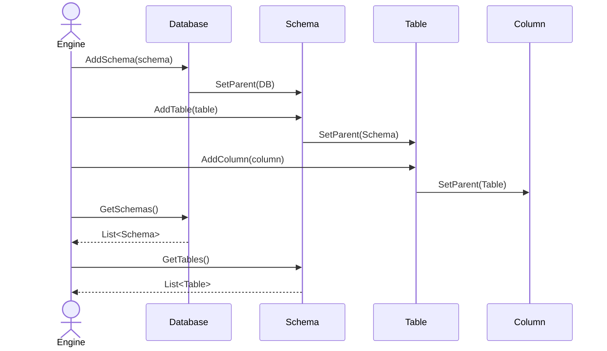
```mermaid
sequenceDiagram
    actor Engine
    participant DB as Database
    participant Schema as Schema
    participant Table as Table
    participant Column as Column

    Engine->>DB: AddSchema(schema)
    DB->>Schema: SetParent(DB)

    Engine->>Schema: AddTable(table)
    Schema->>Table: SetParent(Schema)

    Engine->>Table: AddColumn(column)
    Table->>Column: SetParent(Table)

    Engine->>DB: GetSchemas()
    DB-->>Engine: List<Schema>
    
    Engine->>Schema: GetTables()
    Schema-->>Engine: List<Table>
```

### 2. Metadata Initialization (Builder Pattern)

**Purpose:**
Construct a complex object step by step instead of using a long constructor.

**Example:**
Build a `Computer` with optional CPU, RAM, storage, and graphics card.

#### Class Diagram

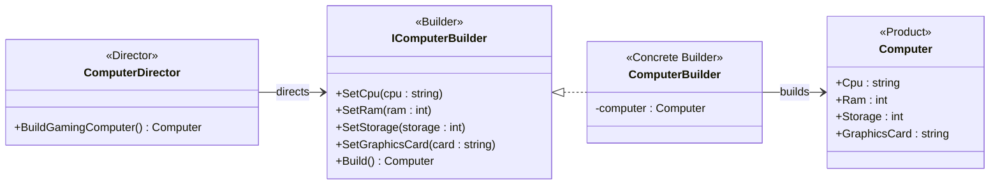
```mermaid
classDiagram
direction LR

class IComputerBuilder {
    <<Builder>>
    +SetCpu(cpu : string)
    +SetRam(ram : int)
    +SetStorage(storage : int)
    +SetGraphicsCard(card : string)
    +Build() Computer
}

class ComputerBuilder {
    <<Concrete Builder>>
    -computer : Computer
}

class Computer {
    <<Product>>
    +Cpu : string
    +Ram : int
    +Storage : int
    +GraphicsCard : string
}

class ComputerDirector {
    <<Director>>
    +BuildGamingComputer() Computer
}

IComputerBuilder <|.. ComputerBuilder
ComputerBuilder --> Computer : builds
ComputerDirector --> IComputerBuilder : directs
```

#### Sequence Diagram

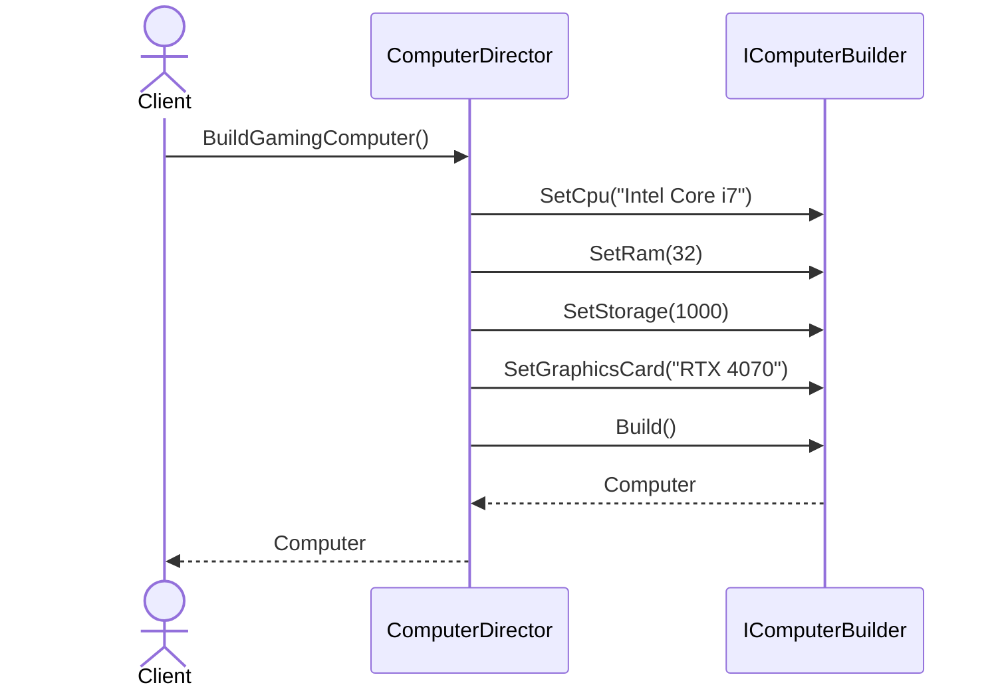
```mermaid
sequenceDiagram
    actor Client
    participant Director as ComputerDirector
    participant Builder as IComputerBuilder

    Client->>Director: BuildGamingComputer()
    Director->>Builder: SetCpu("Intel Core i7")
    Director->>Builder: SetRam(32)
    Director->>Builder: SetStorage(1000)
    Director->>Builder: SetGraphicsCard("RTX 4070")
    Director->>Builder: Build()
    Builder-->>Director: Computer
    Director-->>Client: Computer
```

#### Simplified Code

```csharp
public class Computer
{
    public string Cpu { get; set; } = string.Empty;
    public int Ram { get; set; }
    public int Storage { get; set; }
    public string GraphicsCard { get; set; } = string.Empty;
}

public interface IComputerBuilder
{
    // Configure the computer processor
    void SetCpu(string cpu);

    // Configure RAM capacity in GB
    void SetRam(int ram);

    // Configure storage capacity in GB
    void SetStorage(int storage);

    // Configure an optional graphics card
    void SetGraphicsCard(string graphicsCard);

    // Return the completed Computer object
    Computer Build();
}

public class ComputerBuilder : IComputerBuilder
{
    private Computer _computer = new();

    public void SetCpu(string cpu)
    {
        // Assign the selected CPU
    }

    public void SetRam(int ram)
    {
        // Assign RAM capacity
    }

    public void SetStorage(int storage)
    {
        // Assign storage capacity
    }

    public void SetGraphicsCard(string graphicsCard)
    {
        // Assign an optional graphics card
    }

    public Computer Build()
    {
        // Validate and return the completed computer
        return _computer;
    }
}

public class ComputerDirector
{
    private readonly IComputerBuilder _builder;

    public ComputerDirector(IComputerBuilder builder)
    {
        _builder = builder;
    }

    public Computer BuildGamingComputer()
    {
        // Define the standard steps for building a gaming computer
        _builder.SetCpu("Intel Core i7");
        _builder.SetRam(32);
        _builder.SetStorage(1000);
        _builder.SetGraphicsCard("RTX 4070");

        return _builder.Build();
    }
}
```

**Benefits**

* Avoids constructors with too many parameters.
* Supports optional object properties.
* Reuses the same construction process for different object configurations.
* Separates object construction from its representation.

**Application:** Initializes tables via `TableBuilder` from DDL syntax.

**Why apply?** Initializing a Table object requires many properties. `TableBuilder` helps gather parameters gradually (Columns, Primary Keys) and only creates the `TableMetadata` object in the final step, making the code coherent and readable.

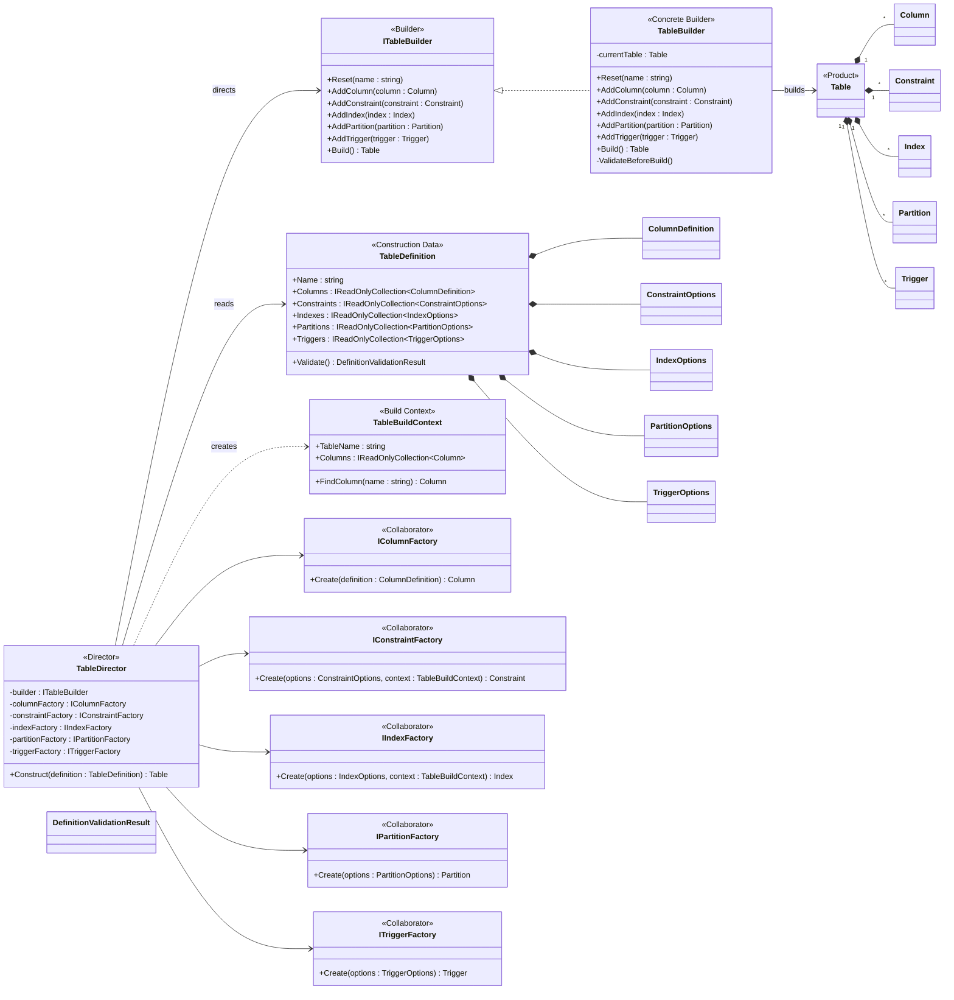
```mermaid
classDiagram
direction LR

class ITableBuilder {
    <<Builder>>
    +Reset(name : string)
    +AddColumn(column : Column)
    +AddConstraint(constraint : Constraint)
    +AddIndex(index : Index)
    +AddPartition(partition : Partition)
    +AddTrigger(trigger : Trigger)
    +Build() Table
}

class TableBuilder {
    <<Concrete Builder>>
    -currentTable : Table
    +Reset(name : string)
    +AddColumn(column : Column)
    +AddConstraint(constraint : Constraint)
    +AddIndex(index : Index)
    +AddPartition(partition : Partition)
    +AddTrigger(trigger : Trigger)
    +Build() Table
    -ValidateBeforeBuild()
}

class TableDirector {
    <<Director>>
    -builder : ITableBuilder
    -columnFactory : IColumnFactory
    -constraintFactory : IConstraintFactory
    -indexFactory : IIndexFactory
    -partitionFactory : IPartitionFactory
    -triggerFactory : ITriggerFactory
    +Construct(definition : TableDefinition) Table
}

class TableDefinition {
    <<Construction Data>>
    +Name : string
    +Columns : IReadOnlyCollection~ColumnDefinition~
    +Constraints : IReadOnlyCollection~ConstraintOptions~
    +Indexes : IReadOnlyCollection~IndexOptions~
    +Partitions : IReadOnlyCollection~PartitionOptions~
    +Triggers : IReadOnlyCollection~TriggerOptions~
    +Validate() DefinitionValidationResult
}

class TableBuildContext {
    <<Build Context>>
    +TableName : string
    +Columns : IReadOnlyCollection~Column~
    +FindColumn(name : string) Column
}

class Table {
    <<Product>>
}

class Column
class Constraint
class Index
class Partition
class Trigger

class IColumnFactory {
    <<Collaborator>>
    +Create(definition : ColumnDefinition) Column
}

class IConstraintFactory {
    <<Collaborator>>
    +Create(options : ConstraintOptions, context : TableBuildContext) Constraint
}

class IIndexFactory {
    <<Collaborator>>
    +Create(options : IndexOptions, context : TableBuildContext) Index
}

class IPartitionFactory {
    <<Collaborator>>
    +Create(options : PartitionOptions) Partition
}

class ITriggerFactory {
    <<Collaborator>>
    +Create(options : TriggerOptions) Trigger
}

class ColumnDefinition
class ConstraintOptions
class IndexOptions
class PartitionOptions
class TriggerOptions
class DefinitionValidationResult

ITableBuilder <|.. TableBuilder
TableBuilder --> Table : builds

TableDirector --> ITableBuilder : directs
TableDirector --> TableDefinition : reads
TableDirector ..> TableBuildContext : creates

TableDirector --> IColumnFactory
TableDirector --> IConstraintFactory
TableDirector --> IIndexFactory
TableDirector --> IPartitionFactory
TableDirector --> ITriggerFactory

TableDefinition *-- ColumnDefinition
TableDefinition *-- ConstraintOptions
TableDefinition *-- IndexOptions
TableDefinition *-- PartitionOptions
TableDefinition *-- TriggerOptions

Table "1" *-- "*" Column
Table "1" *-- "*" Constraint
Table "1" *-- "*" Index
Table "1" *-- "*" Partition
Table "1" *-- "*" Trigger
```

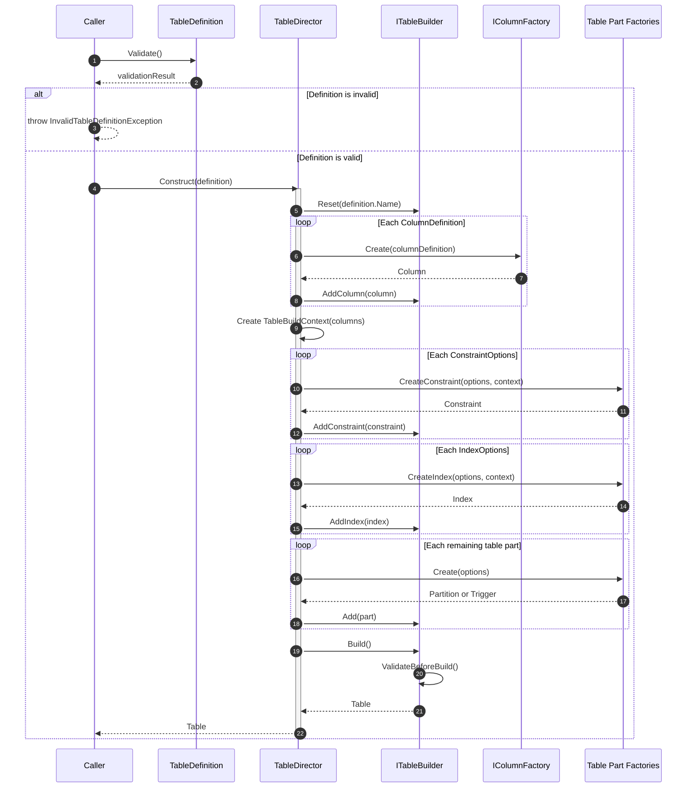
```mermaid
sequenceDiagram
    autonumber

    participant Caller
    participant Definition as TableDefinition
    participant Director as TableDirector
    participant Builder as ITableBuilder
    participant ColFactory as IColumnFactory
    participant Factory as Table Part Factories

    Caller->>Definition: Validate()
    Definition-->>Caller: validationResult

    alt Definition is invalid
        Caller-->>Caller: throw InvalidTableDefinitionException
    else Definition is valid
        Caller->>Director: Construct(definition)
        activate Director

        Director->>Builder: Reset(definition.Name)

        loop Each ColumnDefinition
            Director->>ColFactory: Create(columnDefinition)
            ColFactory-->>Director: Column
            Director->>Builder: AddColumn(column)
        end

        Director->>Director: Create TableBuildContext(columns)

        loop Each ConstraintOptions
            Director->>Factory: CreateConstraint(options, context)
            Factory-->>Director: Constraint
            Director->>Builder: AddConstraint(constraint)
        end

        loop Each IndexOptions
            Director->>Factory: CreateIndex(options, context)
            Factory-->>Director: Index
            Director->>Builder: AddIndex(index)
        end

        loop Each remaining table part
            Director->>Factory: Create(options)
            Factory-->>Director: Partition or Trigger
            Director->>Builder: Add(part)
        end

        Director->>Builder: Build()
        Builder->>Builder: ValidateBeforeBuild()
        Builder-->>Director: Table

        Director-->>Caller: Table
        deactivate Director
    end
```

### 3. Constraint Validation (Strategy Pattern)

**Purpose:**
Encapsulate interchangeable algorithms behind a common interface.

**Example:**
A payment system supports multiple payment methods such as Credit Card, PayPal, and Bank Transfer.

#### Class Diagram

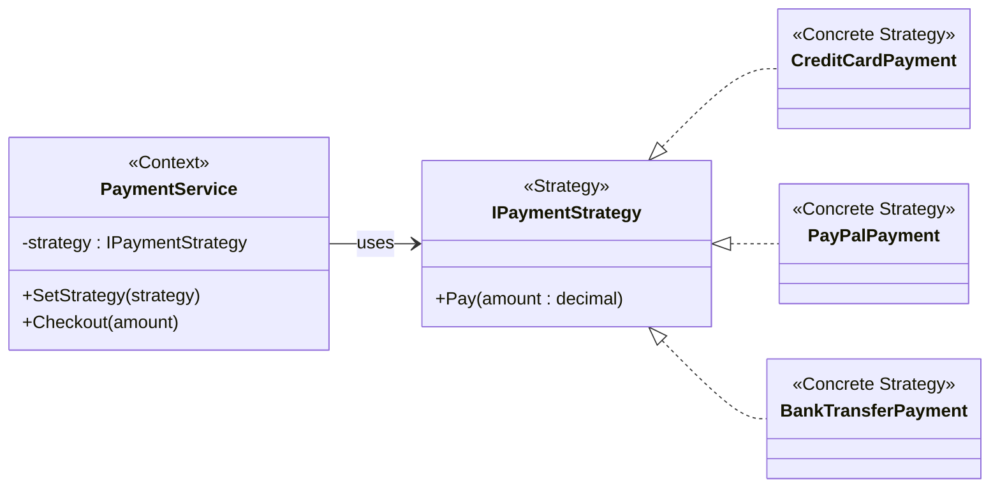
```mermaid
classDiagram
direction LR

class IPaymentStrategy {
    <<Strategy>>
    +Pay(amount : decimal)
}

class CreditCardPayment {
    <<Concrete Strategy>>
}

class PayPalPayment {
    <<Concrete Strategy>>
}

class BankTransferPayment {
    <<Concrete Strategy>>
}

class PaymentService {
    <<Context>>
    -strategy : IPaymentStrategy
    +SetStrategy(strategy)
    +Checkout(amount)
}

IPaymentStrategy <|.. CreditCardPayment
IPaymentStrategy <|.. PayPalPayment
IPaymentStrategy <|.. BankTransferPayment

PaymentService --> IPaymentStrategy : uses
```

#### Sequence Diagram

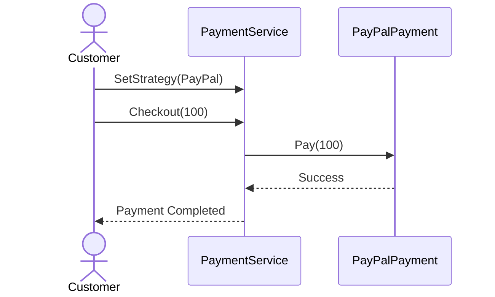
```mermaid
sequenceDiagram
    actor Customer
    participant Service as PaymentService
    participant Strategy as PayPalPayment

    Customer->>Service: SetStrategy(PayPal)
    Customer->>Service: Checkout(100)
    Service->>Strategy: Pay(100)
    Strategy-->>Service: Success
    Service-->>Customer: Payment Completed
```

#### Simplified Code

```csharp
public interface IPaymentStrategy
{
    // Execute the payment using a specific payment method
    void Pay(decimal amount);
}

public class CreditCardPayment : IPaymentStrategy
{
    public void Pay(decimal amount)
    {
        // Process payment using a credit card
    }
}

public class PayPalPayment : IPaymentStrategy
{
    public void Pay(decimal amount)
    {
        // Process payment using PayPal
    }
}

public class BankTransferPayment : IPaymentStrategy
{
    public void Pay(decimal amount)
    {
        // Process payment using a bank transfer
    }
}

public class PaymentService
{
    private IPaymentStrategy _strategy;

    // Change the payment algorithm at runtime
    public void SetStrategy(IPaymentStrategy strategy)
    {
        _strategy = strategy;
    }

    // Delegate payment processing to the selected strategy
    public void Checkout(decimal amount)
    {
        _strategy.Pay(amount);
    }
}
```

**Benefits**

* Easily switch algorithms at runtime.
* Follows the Open/Closed Principle.
* Eliminates large `if-else` or `switch` statements.
* Each algorithm can evolve independently.

**Application:** Evaluates Row validity based on various types of Constraints.

**Why apply?** By applying the Strategy Pattern via the `IConstraint` interface, `RecordManager` doesn't need to care about internal detailed logic (Primary Key checks for duplicates, Check evaluates expressions, Foreign Key checks reference table). It just calls `Validate(row)` and handles the polymorphic result.

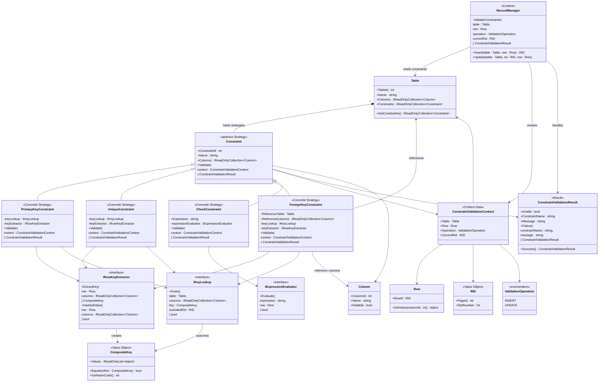
```mermaid
classDiagram
direction TB

%% =====================================================
%% Context
%% =====================================================

class RecordManager {
    <<Context>>
    +Insert(table : Table, row : Row) RID
    +Update(table : Table, rid : RID, row : Row)
    -ValidateConstraints(
        table : Table,
        row : Row,
        operation : ValidationOperation,
        currentRid : RID
    ) ConstraintValidationResult
}

class Table {
    +TableId : int
    +Name : string
    +Columns : IReadOnlyCollection~Column~
    +Constraints : IReadOnlyCollection~Constraint~
    +GetConstraints() IReadOnlyCollection~Constraint~
}

%% =====================================================
%% Strategy
%% =====================================================

class Constraint {
    <<abstract Strategy>>
    +ConstraintId : int
    +Name : string
    +Columns : IReadOnlyCollection~Column~
    +Validate(
        context : ConstraintValidationContext
    ) ConstraintValidationResult
}

class PrimaryKeyConstraint {
    <<Concrete Strategy>>
    -keyLookup : IKeyLookup
    -keyExtractor : IRowKeyExtractor
    +Validate(
        context : ConstraintValidationContext
    ) ConstraintValidationResult
}

class UniqueConstraint {
    <<Concrete Strategy>>
    -keyLookup : IKeyLookup
    -keyExtractor : IRowKeyExtractor
    +Validate(
        context : ConstraintValidationContext
    ) ConstraintValidationResult
}

class ForeignKeyConstraint {
    <<Concrete Strategy>>
    +ReferenceTable : Table
    +ReferenceColumns : IReadOnlyCollection~Column~
    -keyLookup : IKeyLookup
    -keyExtractor : IRowKeyExtractor
    +Validate(
        context : ConstraintValidationContext
    ) ConstraintValidationResult
}

class CheckConstraint {
    <<Concrete Strategy>>
    +Expression : string
    -expressionEvaluator : IExpressionEvaluator
    +Validate(
        context : ConstraintValidationContext
    ) ConstraintValidationResult
}

%% =====================================================
%% Validation Context and Result
%% =====================================================

class ConstraintValidationContext {
    <<Context Data>>
    +Table : Table
    +Row : Row
    +Operation : ValidationOperation
    +CurrentRid : RID
}

class ConstraintValidationResult {
    <<Result>>
    +IsValid : bool
    +ConstraintName : string
    +Message : string
    +Success() ConstraintValidationResult
    +Failure(
        constraintName : string,
        message : string
    ) ConstraintValidationResult
}

class ValidationOperation {
    <<enumeration>>
    INSERT
    UPDATE
}

%% =====================================================
%% Collaborators
%% =====================================================

class IRowKeyExtractor {
    <<interface>>
    +ExtractKey(
        row : Row,
        columns : IReadOnlyCollection~Column~
    ) CompositeKey

    +HasNullValue(
        row : Row,
        columns : IReadOnlyCollection~Column~
    ) bool
}

class IKeyLookup {
    <<interface>>
    +Exists(
        table : Table,
        columns : IReadOnlyCollection~Column~,
        key : CompositeKey,
        excludedRid : RID
    ) bool
}

class IExpressionEvaluator {
    <<interface>>
    +Evaluate(
        expression : string,
        row : Row
    ) bool
}

class CompositeKey {
    <<Value Object>>
    +Values : IReadOnlyList~object~
    +Equals(other : CompositeKey) bool
    +GetHashCode() int
}

%% =====================================================
%% Supporting Domain Types
%% =====================================================

class Row {
    +RowId : RID
    +GetValue(columnId : int) object
}

class Column {
    +ColumnId : int
    +Name : string
    +Nullable : bool
}

class RID {
    <<Value Object>>
    +PageId : int
    +SlotNumber : int
}

%% =====================================================
%% Relationships
%% =====================================================

RecordManager --> Table : reads constraints
RecordManager --> ConstraintValidationContext : creates
RecordManager --> ConstraintValidationResult : handles

Table "1" *-- "*" Constraint : holds strategies

Constraint <|-- PrimaryKeyConstraint
Constraint <|-- UniqueConstraint
Constraint <|-- ForeignKeyConstraint
Constraint <|-- CheckConstraint

Constraint --> ConstraintValidationContext
Constraint --> ConstraintValidationResult
Constraint --> Column

ConstraintValidationContext --> Table
ConstraintValidationContext --> Row
ConstraintValidationContext --> RID
ConstraintValidationContext --> ValidationOperation

PrimaryKeyConstraint --> IRowKeyExtractor
PrimaryKeyConstraint --> IKeyLookup

UniqueConstraint --> IRowKeyExtractor
UniqueConstraint --> IKeyLookup

ForeignKeyConstraint --> IRowKeyExtractor
ForeignKeyConstraint --> IKeyLookup
ForeignKeyConstraint --> Table : references
ForeignKeyConstraint --> Column : reference columns

CheckConstraint --> IExpressionEvaluator

IRowKeyExtractor --> CompositeKey : creates
IKeyLookup --> CompositeKey : searches
```

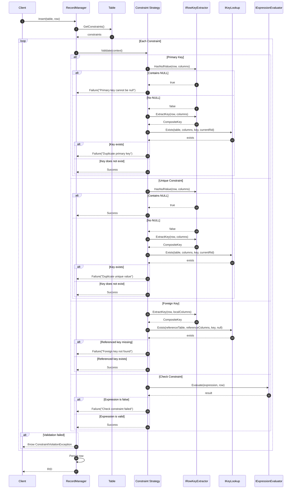
```mermaid
sequenceDiagram
    autonumber

    participant Client
    participant RecordMgr as RecordManager
    participant Table
    participant Constraint as Constraint Strategy
    participant Extractor as IRowKeyExtractor
    participant Lookup as IKeyLookup
    participant Evaluator as IExpressionEvaluator

    Client->>RecordMgr: Insert(table, row)

    RecordMgr->>Table: GetConstraints()
    Table-->>RecordMgr: constraints

    loop Each Constraint
        RecordMgr->>Constraint: Validate(context)

        alt Primary Key
            Constraint->>Extractor: HasNullValue(row, columns)

            alt Contains NULL
                Extractor-->>Constraint: true
                Constraint-->>RecordMgr: Failure("Primary key cannot be null")
            else No NULL
                Extractor-->>Constraint: false
                Constraint->>Extractor: ExtractKey(row, columns)
                Extractor-->>Constraint: CompositeKey

                Constraint->>Lookup: Exists(table, columns, key, currentRid)
                Lookup-->>Constraint: exists

                alt Key exists
                    Constraint-->>RecordMgr: Failure("Duplicate primary key")
                else Key does not exist
                    Constraint-->>RecordMgr: Success
                end
            end

        else Unique Constraint
            Constraint->>Extractor: HasNullValue(row, columns)

            alt Contains NULL
                Extractor-->>Constraint: true
                Constraint-->>RecordMgr: Success
            else No NULL
                Extractor-->>Constraint: false
                Constraint->>Extractor: ExtractKey(row, columns)
                Extractor-->>Constraint: CompositeKey
                Constraint->>Lookup: Exists(table, columns, key, currentRid)
                Lookup-->>Constraint: exists

                alt Key exists
                    Constraint-->>RecordMgr: Failure("Duplicate unique value")
                else Key does not exist
                    Constraint-->>RecordMgr: Success
                end
            end

        else Foreign Key
            Constraint->>Extractor: ExtractKey(row, localColumns)
            Extractor-->>Constraint: CompositeKey
            Constraint->>Lookup: Exists(referenceTable, referenceColumns, key, null)
            Lookup-->>Constraint: exists

            alt Referenced key missing
                Constraint-->>RecordMgr: Failure("Foreign key not found")
            else Referenced key exists
                Constraint-->>RecordMgr: Success
            end

        else Check Constraint
            Constraint->>Evaluator: Evaluate(expression, row)
            Evaluator-->>Constraint: result

            alt Expression is false
                Constraint-->>RecordMgr: Failure("Check constraint failed")
            else Expression is valid
                Constraint-->>RecordMgr: Success
            end
        end

        alt Validation failed
            RecordMgr-->>Client: throw ConstraintViolationException
        end
    end

    RecordMgr->>RecordMgr: Persist row
    RecordMgr-->>Client: RID
```

### 4. Dynamic Allocation (Factory Method Pattern)

**Purpose:**
Define a common method for creating objects while allowing subclasses to decide which concrete object is created.

**Example:**
A notification system creates different notification types such as Email, SMS, and Push Notification.

#### Class Diagram

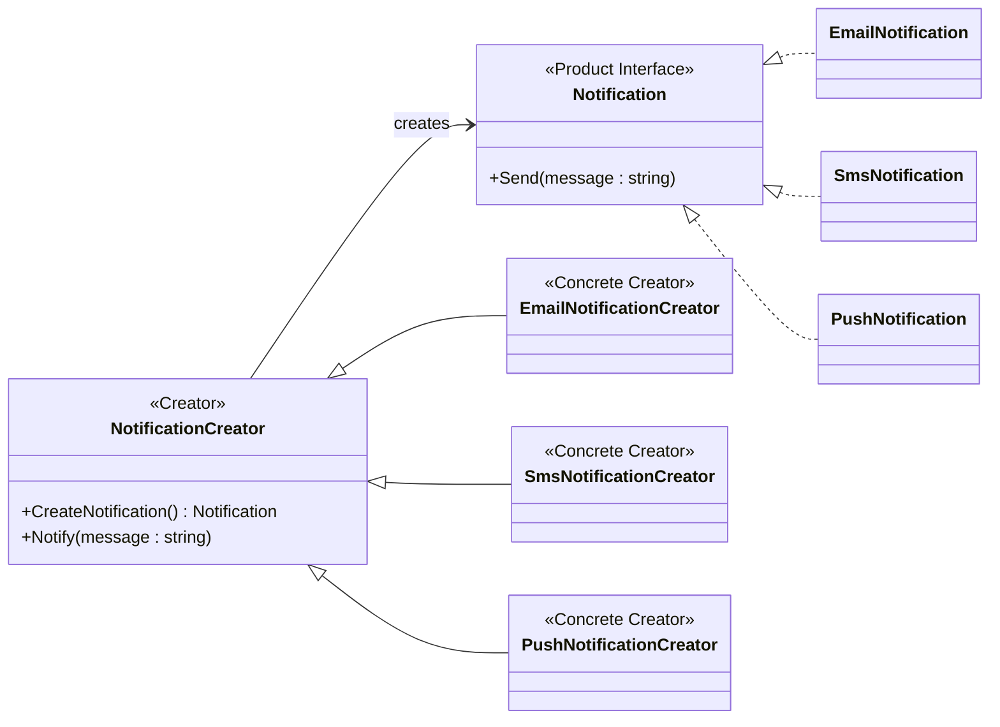
```mermaid
classDiagram
direction LR

class Notification {
    <<Product Interface>>
    +Send(message : string)
}

class EmailNotification
class SmsNotification
class PushNotification

class NotificationCreator {
    <<Creator>>
    +CreateNotification() Notification
    +Notify(message : string)
}

class EmailNotificationCreator {
    <<Concrete Creator>>
}

class SmsNotificationCreator {
    <<Concrete Creator>>
}

class PushNotificationCreator {
    <<Concrete Creator>>
}

Notification <|.. EmailNotification
Notification <|.. SmsNotification
Notification <|.. PushNotification

NotificationCreator <|-- EmailNotificationCreator
NotificationCreator <|-- SmsNotificationCreator
NotificationCreator <|-- PushNotificationCreator

NotificationCreator --> Notification : creates
```

#### Sequence Diagram

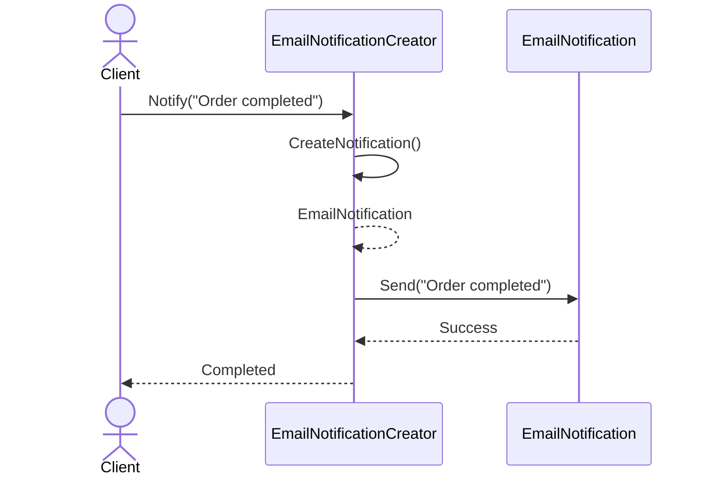
```mermaid
sequenceDiagram
    actor Client
    participant Creator as EmailNotificationCreator
    participant Product as EmailNotification

    Client->>Creator: Notify("Order completed")
    Creator->>Creator: CreateNotification()
    Creator-->>Creator: EmailNotification
    Creator->>Product: Send("Order completed")
    Product-->>Creator: Success
    Creator-->>Client: Completed
```

#### Simplified Code

```csharp
public interface INotification
{
    // Send a notification message
    void Send(string message);
}

public class EmailNotification : INotification
{
    public void Send(string message)
    {
        // Send the message by email
    }
}

public class SmsNotification : INotification
{
    public void Send(string message)
    {
        // Send the message by SMS
    }
}

public class PushNotification : INotification
{
    public void Send(string message)
    {
        // Send the message as a push notification
    }
}

public abstract class NotificationCreator
{
    // Factory Method: subclasses decide which notification is created
    protected abstract INotification CreateNotification();

    public void Notify(string message)
    {
        // Create the product without depending on a concrete class
        INotification notification = CreateNotification();

        // Use the created product
        notification.Send(message);
    }
}

public class EmailNotificationCreator : NotificationCreator
{
    protected override INotification CreateNotification()
    {
        // Create an email notification
        return new EmailNotification();
    }
}

public class SmsNotificationCreator : NotificationCreator
{
    protected override INotification CreateNotification()
    {
        // Create an SMS notification
        return new SmsNotification();
    }
}

public class PushNotificationCreator : NotificationCreator
{
    protected override INotification CreateNotification()
    {
        // Create a push notification
        return new PushNotification();
    }
}
```

**Benefits**

* Removes direct dependency on concrete product classes.
* Makes adding new product types easier.
* Follows the Open/Closed Principle.
* Keeps object creation logic separate from business logic.

**Application:** Allocates objects like Index and Constraint automatically during DDL execution.

**Why apply?** Delegates the creation of a specific Index (BTree or Hash) to `IndexFactory`. The client doesn't need to know the internal initialization logic, just passes in the desired Index type and receives a common `IIndex` interface back.


```mermaid
classDiagram
direction TB

%% =====================================================
%% Factory Clients
%% =====================================================

class TableDirector {
    <<Client>>
    -constraintFactory : IConstraintFactory
    -indexFactory : IIndexFactory
    +Construct(definition : TableDefinition) Table
}

%% =====================================================
%% Constraint Factory
%% =====================================================

class IConstraintFactory {
    <<Factory>>
    +Create(options : ConstraintOptions) Constraint
}

class ConstraintFactory {
    <<Concrete Factory>>
    +Create(options : ConstraintOptions) Constraint
}

class ConstraintOptions {
    <<DTO>>
    +Type : ConstraintType
    +Name : string
    +Columns : IReadOnlyCollection~Column~
    +ReferenceTable : Table
    +ReferenceColumns : IReadOnlyCollection~Column~
    +Expression : string
}

class ConstraintType {
    <<enumeration>>
    PRIMARY_KEY
    UNIQUE
    FOREIGN_KEY
    CHECK
}

class Constraint {
    <<abstract Product>>
    +Name : string
    +Columns : IReadOnlyCollection~Column~
}

class PrimaryKeyConstraint {
    <<Concrete Product>>
}

class UniqueConstraint {
    <<Concrete Product>>
}

class ForeignKeyConstraint {
    <<Concrete Product>>
    +ReferenceTable : Table
    +ReferenceColumns : IReadOnlyCollection~Column~
}

class CheckConstraint {
    <<Concrete Product>>
    +Expression : string
}

%% =====================================================
%% Index Factory
%% =====================================================

class IIndexFactory {
    <<Factory>>
    +Create(options : IndexOptions) Index
}

class IndexFactory {
    <<Concrete Factory>>
    +Create(options : IndexOptions) Index
}

class IndexOptions {
    <<DTO>>
    +Type : IndexType
    +Name : string
    +Columns : IReadOnlyCollection~Column~
    +Unique : bool
}

class IndexType {
    <<enumeration>>
    BTREE
    HASH
    BITMAP
}

class Index {
    <<abstract Product>>
    +IndexId : int
    +Name : string
    +Columns : IReadOnlyCollection~Column~
    +Unique : bool
}

class BTreeIndex {
    <<Concrete Product>>
}

class HashIndex {
    <<Concrete Product>>
}

class BitmapIndex {
    <<Concrete Product>>
}

%% =====================================================
%% Supporting Domain Classes
%% =====================================================

class TableDefinition {
    +Constraints : IReadOnlyCollection~ConstraintOptions~
    +Indexes : IReadOnlyCollection~IndexOptions~
}

class Table
class Column

%% =====================================================
%% Relationships
%% =====================================================

TableDirector --> IConstraintFactory : creates constraints
TableDirector --> IIndexFactory : creates indexes
TableDirector --> TableDefinition : reads

IConstraintFactory <|.. ConstraintFactory
IIndexFactory <|.. IndexFactory

IConstraintFactory --> ConstraintOptions
IConstraintFactory --> Constraint : creates

IIndexFactory --> IndexOptions
IIndexFactory --> Index : creates

ConstraintOptions --> ConstraintType
ConstraintOptions --> Column
ConstraintOptions --> Table : referenced table

IndexOptions --> IndexType
IndexOptions --> Column

Constraint <|-- PrimaryKeyConstraint
Constraint <|-- UniqueConstraint
Constraint <|-- ForeignKeyConstraint
Constraint <|-- CheckConstraint

Index <|-- BTreeIndex
Index <|-- HashIndex
Index <|-- BitmapIndex
```

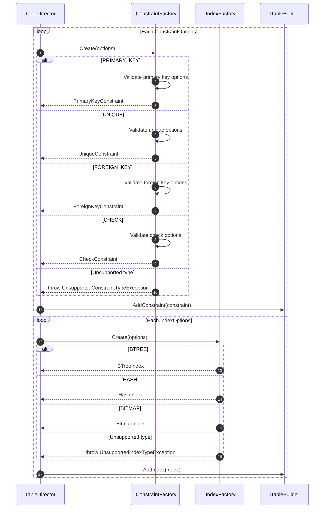
```mermaid
sequenceDiagram
    autonumber

    participant Director as TableDirector
    participant CFactory as IConstraintFactory
    participant IFactory as IIndexFactory
    participant Builder as ITableBuilder

    loop Each ConstraintOptions
        Director->>CFactory: Create(options)
        alt PRIMARY_KEY
            CFactory->>CFactory: Validate primary key options
            CFactory-->>Director: PrimaryKeyConstraint
        else UNIQUE
            CFactory->>CFactory: Validate unique options
            CFactory-->>Director: UniqueConstraint
        else FOREIGN_KEY
            CFactory->>CFactory: Validate foreign key options
            CFactory-->>Director: ForeignKeyConstraint
        else CHECK
            CFactory->>CFactory: Validate check options
            CFactory-->>Director: CheckConstraint
        else Unsupported type
            CFactory-->>Director: throw UnsupportedConstraintTypeException
        end
        Director->>Builder: AddConstraint(constraint)
    end
    loop Each IndexOptions
        Director->>IFactory: Create(options)
        alt BTREE
            IFactory-->>Director: BTreeIndex
        else HASH
            IFactory-->>Director: HashIndex
        else BITMAP
            IFactory-->>Director: BitmapIndex
        else Unsupported type
            IFactory-->>Director: throw UnsupportedIndexTypeException
        end
        Director->>Builder: AddIndex(index)
    end
```

### 5. Hierarchy Traversal (Iterator Pattern)

**Purpose:**
Traverse elements in a collection without exposing its internal structure.

**Example:**
A playlist allows the client to browse songs one by one without directly accessing the underlying list.

#### Class Diagram

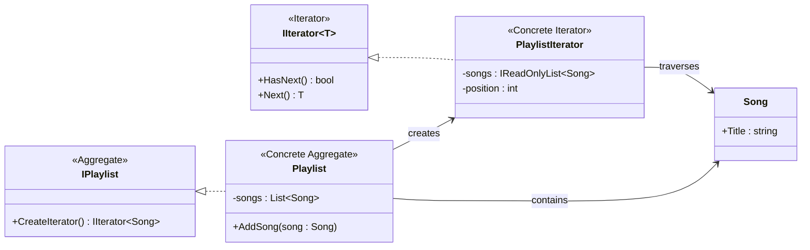
```mermaid
classDiagram
direction LR

class IIterator~T~ {
    <<Iterator>>
    +HasNext() bool
    +Next() T
}

class PlaylistIterator {
    <<Concrete Iterator>>
    -songs : IReadOnlyList~Song~
    -position : int
}

class IPlaylist {
    <<Aggregate>>
    +CreateIterator() IIterator~Song~
}

class Playlist {
    <<Concrete Aggregate>>
    -songs : List~Song~
    +AddSong(song : Song)
}

class Song {
    +Title : string
}

IIterator~T~ <|.. PlaylistIterator
IPlaylist <|.. Playlist

Playlist --> Song : contains
Playlist --> PlaylistIterator : creates
PlaylistIterator --> Song : traverses
```

#### Sequence Diagram

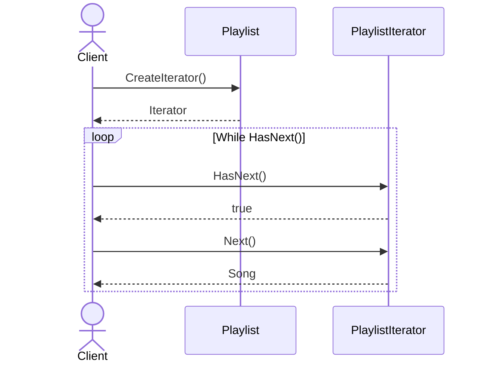
```mermaid
sequenceDiagram
    actor Client
    participant Playlist
    participant Iterator as PlaylistIterator

    Client->>Playlist: CreateIterator()
    Playlist-->>Client: Iterator

    loop While HasNext()
        Client->>Iterator: HasNext()
        Iterator-->>Client: true
        Client->>Iterator: Next()
        Iterator-->>Client: Song
    end
```

#### Simplified Code

```csharp
public class Song
{
    public string Title { get; init; } = string.Empty;
}

public interface IIterator<T>
{
    // Check whether another item is available
    bool HasNext();

    // Return the next item in the collection
    T Next();
}

public interface IPlaylist
{
    // Create an iterator for traversing songs
    IIterator<Song> CreateIterator();
}

public class Playlist : IPlaylist
{
    private readonly List<Song> _songs = [];

    public void AddSong(Song song)
    {
        // Add a song to the playlist
    }

    public IIterator<Song> CreateIterator()
    {
        // Create an iterator without exposing the internal list
        return new PlaylistIterator(_songs);
    }
}

public class PlaylistIterator : IIterator<Song>
{
    private readonly IReadOnlyList<Song> _songs;
    private int _position;

    public PlaylistIterator(IReadOnlyList<Song> songs)
    {
        _songs = songs;
    }

    public bool HasNext()
    {
        // Check whether the current position is valid
        return false;
    }

    public Song Next()
    {
        // Return the current song and move to the next position
        return default!;
    }
}
```

**Benefits**

* Hides the internal collection structure.
* Provides a consistent traversal mechanism.
* Supports multiple traversal strategies.
* Separates traversal logic from collection logic.

**Application:** Traverses the database metadata hierarchy (Database, Schema, Table) sequentially without exposing the underlying representations.

**Why apply?** The Iterator Pattern provides a unified interface `ICatalogIterator` for clients (like `SchemaService`) to iterate through catalog components (Schemas in a Database, Tables in a Schema, Columns in a Table) regardless of whether they are stored in an `IReadOnlyList` or `IReadOnlyCollection`.

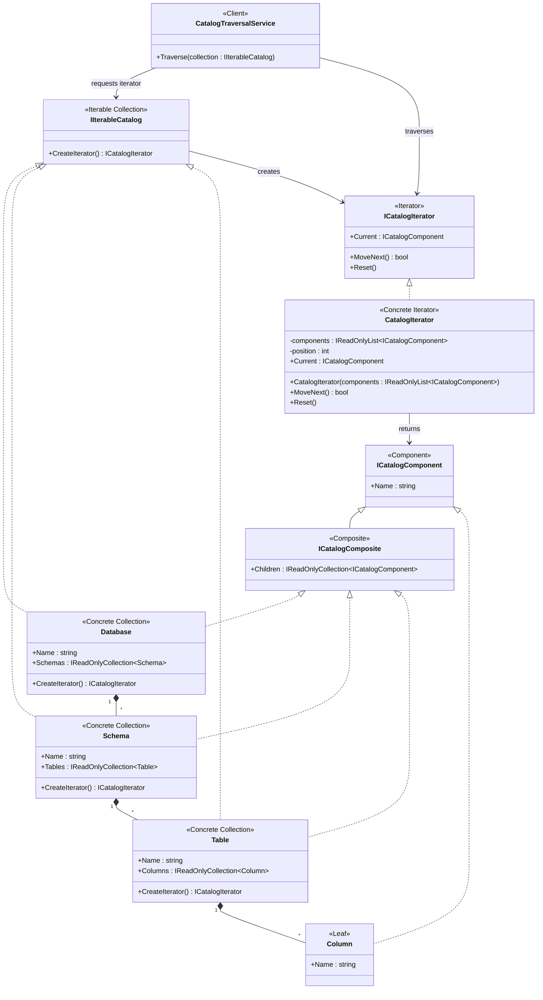
```mermaid
classDiagram
direction TB

class ICatalogComponent {
    <<Component>>
    +Name : string
}

class ICatalogComposite {
    <<Composite>>
    +Children : IReadOnlyCollection~ICatalogComponent~
}

class IIterableCatalog {
    <<Iterable Collection>>
    +CreateIterator() ICatalogIterator
}

class ICatalogIterator {
    <<Iterator>>
    +Current : ICatalogComponent
    +MoveNext() bool
    +Reset()
}

class CatalogIterator {
    <<Concrete Iterator>>
    -components : IReadOnlyList~ICatalogComponent~
    -position : int
    +CatalogIterator(components : IReadOnlyList~ICatalogComponent~)
    +Current : ICatalogComponent
    +MoveNext() bool
    +Reset()
}

class Database {
    <<Concrete Collection>>
    +Name : string
    +Schemas : IReadOnlyCollection~Schema~
    +CreateIterator() ICatalogIterator
}

class Schema {
    <<Concrete Collection>>
    +Name : string
    +Tables : IReadOnlyCollection~Table~
    +CreateIterator() ICatalogIterator
}

class Table {
    <<Concrete Collection>>
    +Name : string
    +Columns : IReadOnlyCollection~Column~
    +CreateIterator() ICatalogIterator
}

class Column {
    <<Leaf>>
    +Name : string
}

class CatalogTraversalService {
    <<Client>>
    +Traverse(collection : IIterableCatalog)
}

ICatalogComponent <|-- ICatalogComposite

ICatalogComposite <|.. Database
ICatalogComposite <|.. Schema
ICatalogComposite <|.. Table
ICatalogComponent <|.. Column

IIterableCatalog <|.. Database
IIterableCatalog <|.. Schema
IIterableCatalog <|.. Table

ICatalogIterator <|.. CatalogIterator

Database "1" *-- "*" Schema
Schema "1" *-- "*" Table
Table "1" *-- "*" Column

IIterableCatalog --> ICatalogIterator : creates
CatalogIterator --> ICatalogComponent : returns
CatalogTraversalService --> IIterableCatalog : requests iterator
CatalogTraversalService --> ICatalogIterator : traverses
```

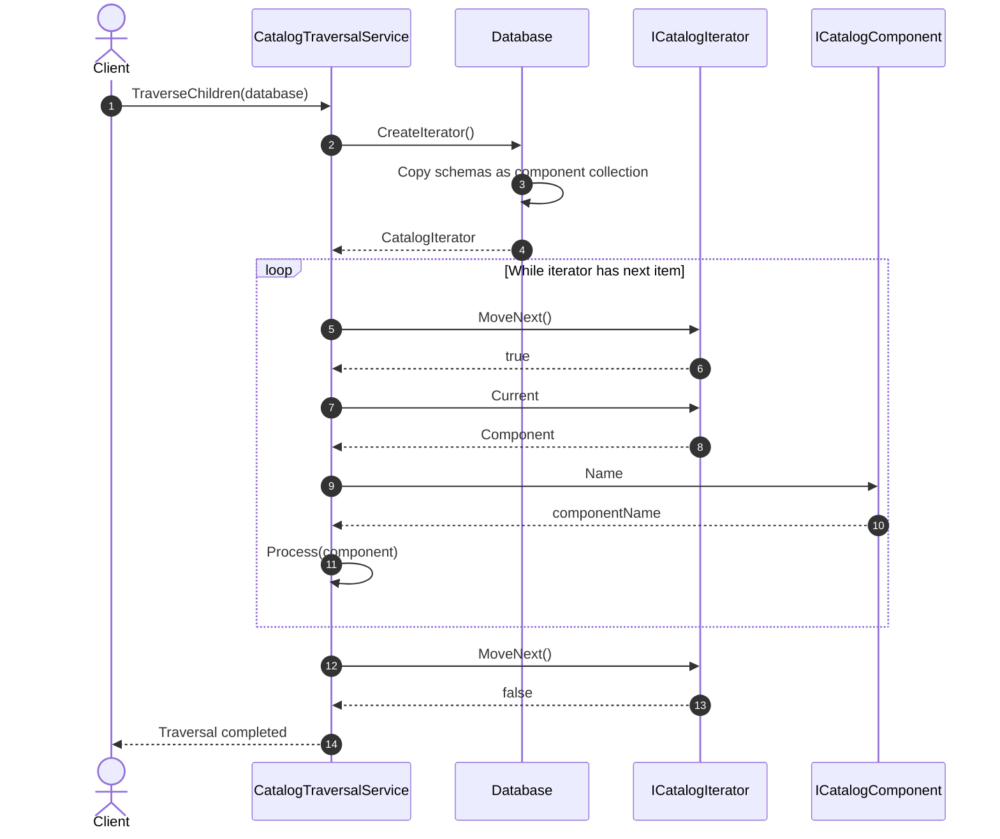
```mermaid
sequenceDiagram
    autonumber

    actor Client
    participant Service as CatalogTraversalService
    participant Database
    participant Iterator as ICatalogIterator
    participant Component as ICatalogComponent

    Client->>Service: TraverseChildren(database)

    Service->>Database: CreateIterator()
    Database->>Database: Copy schemas as component collection
    Database-->>Service: CatalogIterator

    loop While iterator has next item
        Service->>Iterator: MoveNext()
        Iterator-->>Service: true

        Service->>Iterator: Current
        Iterator-->>Service: Component

        Service->>Component: Name
        Component-->>Service: componentName

        Service->>Service: Process(component)
    end

    Service->>Iterator: MoveNext()
    Iterator-->>Service: false

    Service-->>Client: Traversal completed
```

### 6. DDL Execution (Command Pattern)

**Purpose:**
Encapsulate a request as an object, allowing it to be executed, queued, or logged independently.

**Example:**
A remote control can execute different commands such as turning a light on or off without knowing how the light works.

#### Class Diagram

```mermaid
classDiagram
direction LR

class ICommand {
    <<Command>>
    +Execute()
}

class TurnOnLightCommand {
    <<Concrete Command>>
}

class TurnOffLightCommand {
    <<Concrete Command>>
}

class Light {
    <<Receiver>>
    +TurnOn()
    +TurnOff()
}

class RemoteControl {
    <<Invoker>>
    +SetCommand(command)
    +PressButton()
}

ICommand <|.. TurnOnLightCommand
ICommand <|.. TurnOffLightCommand

TurnOnLightCommand --> Light
TurnOffLightCommand --> Light

RemoteControl --> ICommand : executes
```

#### Sequence Diagram

```mermaid
sequenceDiagram
    actor User
    participant Remote as RemoteControl
    participant Command as TurnOnLightCommand
    participant Light

    User->>Remote: PressButton()
    Remote->>Command: Execute()
    Command->>Light: TurnOn()
    Light-->>Command: Done
    Command-->>Remote: Success
```

#### Simplified Code

```csharp
public interface ICommand
{
    // Execute the request
    void Execute();
}

public class Light
{
    public void TurnOn()
    {
        // Turn the light on
    }

    public void TurnOff()
    {
        // Turn the light off
    }
}

public class TurnOnLightCommand : ICommand
{
    private readonly Light _light;

    public TurnOnLightCommand(Light light)
    {
        _light = light;
    }

    public void Execute()
    {
        // Delegate the request to the receiver
        _light.TurnOn();
    }
}

public class TurnOffLightCommand : ICommand
{
    private readonly Light _light;

    public TurnOffLightCommand(Light light)
    {
        _light = light;
    }

    public void Execute()
    {
        // Delegate the request to the receiver
        _light.TurnOff();
    }
}

public class RemoteControl
{
    private ICommand _command;

    // Configure the command to execute
    public void SetCommand(ICommand command)
    {
        _command = command;
    }

    // Execute the configured command
    public void PressButton()
    {
        _command.Execute();
    }
}
```

**Benefits**

* Decouples the sender from the receiver.
* Supports undo, redo, logging, and command queues.
* Makes adding new commands easy.
* Follows the Open/Closed Principle.

**Application:** Encapsulates Data Definition Language (DDL) requests (like `CreateTable`, `CreateSchema`) as standalone objects that contain all information about the request.

**Why apply?** The Command Pattern allows the `QueryProcessor` to parameterize the `DdlCommandExecutor` with different requests, decouple the invoker from the receivers (`SchemaService`, `DatabaseService`), and supports future capabilities like queuing, logging, or undoing operations.

```mermaid
classDiagram
direction LR

class IDdlCommand {
    <<Command>>
    +Execute(context : DdlExecutionContext) DdlResult
}

class CreateSchemaCommand {
    <<Concrete Command>>
    -receiver : IDatabaseService
    -database : Database
    -schemaName : string
    +Execute(context : DdlExecutionContext) DdlResult
}

class CreateTableCommand {
    <<Concrete Command>>
    -receiver : ISchemaService
    -schema : Schema
    -definition : TableDefinition
    +Execute(context : DdlExecutionContext) DdlResult
}

class AlterTableCommand {
    <<Concrete Command>>
    -receiver : ISchemaService
    -schema : Schema
    -tableName : string
    -operation : TableAlterOperation
    +Execute(context : DdlExecutionContext) DdlResult
}

class DropTableCommand {
    <<Concrete Command>>
    -receiver : ISchemaService
    -schema : Schema
    -tableName : string
    +Execute(context : DdlExecutionContext) DdlResult
}

class IDdlCommandExecutor {
    <<Invoker>>
    +Execute(
        command : IDdlCommand,
        context : DdlExecutionContext
    ) DdlResult
}

class DdlCommandExecutor {
    <<Concrete Invoker>>
}

class IDdlCommandFactory {
    <<Factory>>
    +Create(request : DdlRequest) IDdlCommand
}

class IDatabaseService {
    <<Receiver>>
    +CreateSchema(
        database : Database,
        name : string,
        context : DdlExecutionContext
    ) Schema
}

class ISchemaService {
    <<Receiver>>
    +CreateTable(
        schema : Schema,
        definition : TableDefinition,
        context : DdlExecutionContext
    ) Table

    +AlterTable(
        schema : Schema,
        tableName : string,
        operation : TableAlterOperation,
        context : DdlExecutionContext
    ) Table

    +DropTable(
        schema : Schema,
        tableName : string,
        context : DdlExecutionContext
    )
}

class DdlRequest
class DdlExecutionContext
class DdlResult
class Database
class Schema
class TableDefinition
class TableAlterOperation

IDdlCommand <|.. CreateSchemaCommand
IDdlCommand <|.. CreateTableCommand
IDdlCommand <|.. AlterTableCommand
IDdlCommand <|.. DropTableCommand

IDdlCommandExecutor <|.. DdlCommandExecutor
DdlCommandExecutor --> IDdlCommand : invokes

IDdlCommandFactory --> DdlRequest : reads
IDdlCommandFactory --> IDdlCommand : creates

CreateSchemaCommand --> IDatabaseService : receiver
CreateSchemaCommand --> Database : target

CreateTableCommand --> ISchemaService : receiver
CreateTableCommand --> Schema : target
CreateTableCommand --> TableDefinition : request data

AlterTableCommand --> ISchemaService : receiver
AlterTableCommand --> TableAlterOperation : request data

DropTableCommand --> ISchemaService : receiver
```

```mermaid
sequenceDiagram
    autonumber

    actor Client
    participant Executor as IDdlCommandExecutor
    participant Command as CreateSchemaCommand
    participant Service as IDatabaseService
    participant Tx as IMetadataTransactionPort
    participant Database
    participant Catalog as ICatalogManager

    Client->>Executor: Execute(command, context)
    Executor->>Command: Execute(context)

    Command->>Service: CreateSchema(database, schemaName, context)
    activate Service

    Service->>Tx: Begin(context)
    Service->>Database: GetSchema(schemaName)

    alt Schema already exists
        Database-->>Service: Existing Schema
        Service->>Tx: Rollback(context)
        Service-->>Command: throw DuplicateSchemaException

    else Schema does not exist
        Database-->>Service: Not found

        Service->>Service: new Schema(schemaName)
        Service->>Database: AddSchema(schema)
        Database-->>Service: Success

        Service->>Catalog: Register(schema)

        alt Registration failed
            Catalog-->>Service: throw CatalogException
            Service->>Database: RemoveSchema(schemaName)
            Service->>Tx: Rollback(context)
            Service-->>Command: propagate exception

        else Registration succeeded
            Catalog-->>Service: Success
            Service->>Tx: Commit(context)
            Service-->>Command: Schema
        end
    end

    deactivate Service

    Command-->>Executor: DdlResult
    Executor-->>Client: DdlResult
```

### 7. DDL Coordination (Facade Pattern)

**Purpose:**
Provide a simple interface to a complex subsystem.

**Example:**
A home theater can be started with a single method instead of operating each device individually.

#### Class Diagram

```mermaid
classDiagram
direction LR

class TV {
    +TurnOn()
}

class SoundSystem {
    +TurnOn()
}

class DVDPlayer {
    +TurnOn()
    +Play(movie)
}

class HomeTheaterFacade {
    <<Facade>>
    +WatchMovie(movie : string)
}

HomeTheaterFacade --> TV
HomeTheaterFacade --> SoundSystem
HomeTheaterFacade --> DVDPlayer
```

#### Sequence Diagram

```mermaid
sequenceDiagram
    actor User
    participant Facade as HomeTheaterFacade
    participant TV
    participant Sound as SoundSystem
    participant DVD as DVDPlayer

    User->>Facade: WatchMovie("Avatar")
    Facade->>TV: TurnOn()
    Facade->>Sound: TurnOn()
    Facade->>DVD: TurnOn()
    Facade->>DVD: Play("Avatar")
    Facade-->>User: Ready
```

#### Simplified Code

```csharp
public class TV
{
    public void TurnOn()
    {
        // Turn on the TV
    }
}

public class SoundSystem
{
    public void TurnOn()
    {
        // Turn on the sound system
    }
}

public class DVDPlayer
{
    public void TurnOn()
    {
        // Turn on the DVD player
    }

    public void Play(string movie)
    {
        // Play the selected movie
    }
}

public class HomeTheaterFacade
{
    private readonly TV _tv = new();
    private readonly SoundSystem _sound = new();
    private readonly DVDPlayer _dvd = new();

    // Provide one simple operation to coordinate the subsystem
    public void WatchMovie(string movie)
    {
        _tv.TurnOn();
        _sound.TurnOn();
        _dvd.TurnOn();
        _dvd.Play(movie);
    }
}
```

**Benefits**

* Hides subsystem complexity.
* Provides a simple, unified interface.
* Reduces coupling between clients and subsystem classes.
* Makes the subsystem easier to use and maintain.

**Application:** `SchemaService` and `DatabaseService` coordinate complex Create, Drop, and Alter operations for database objects.

**Why apply?** The Facade Pattern provides a unified, high-level interface for DDL operations, shielding the clients (like DDL Commands) from the complexities of the underlying subsystems. Instead of manually coordinating `CatalogManager`, `TableDirector`, `StorageEngine`, and various factories, the clients simply call methods like `CreateTable()` or `DropSchema()` on these services.

```mermaid
classDiagram
direction LR

class IDatabaseService {
    <<Facade Interface>>

    +CreateSchema(
        database : Database,
        definition : SchemaDefinition
    ) Schema

    +DropSchema(
        database : Database,
        name : string,
        cascade : bool
    ) DdlResult

    +RenameSchema(
        database : Database,
        oldName : string,
        newName : string
    ) Schema
}

class ISchemaService {
    <<Facade Interface>>

    +CreateTable(
        schema : Schema,
        definition : TableDefinition
    ) Table

    +DropTable(
        schema : Schema,
        name : string,
        cascade : bool
    ) DdlResult

    +AlterTable(
        schema : Schema,
        tableName : string,
        operation : TableAlterOperation
    ) Table

    +CreateView(
        schema : Schema,
        definition : ViewDefinition
    ) View

    +CreateProcedure(
        schema : Schema,
        definition : ProcedureDefinition
    ) StoredProcedure

    +CreateSequence(
        schema : Schema,
        definition : SequenceDefinition
    ) Sequence
}

class DatabaseService {
    <<Facade>>

    -catalog : ICatalogManager
    -transactionPort : IMetadataTransactionPort
}

class SchemaService {
    <<Facade>>

    -catalog : ICatalogManager
    -dependencyService : ICatalogDependencyService
    -tableDirector : TableDirector
    -storagePort : IStorageObjectPort
    -transactionPort : IMetadataTransactionPort
}

class ICatalogManager {
    <<Subsystem>>

    +ObjectExists(parent, name) bool
    +Register(component)
    +Update(component)
    +Remove(component)
}

class ICatalogDependencyService {
    <<Subsystem>>

    +GetDependencies(component) IReadOnlyCollection~ICatalogComponent~
    +RemoveDependencies(component)
}

class TableDirector {
    <<Subsystem>>

    +Construct(definition : TableDefinition) Table
}

class IStorageObjectPort {
    <<External Subsystem Port>>

    +AllocateTable(table : Table)
    +AlterTable(table : Table, operation : TableAlterOperation)
    +DeallocateTable(table : Table)
}

class IMetadataTransactionPort {
    <<External Subsystem Port>>

    +Begin()
    +Commit()
    +Rollback()
}

class Database
class Schema
class Table
class View
class StoredProcedure
class Sequence
class SchemaDefinition
class TableDefinition
class TableAlterOperation
class ViewDefinition
class ProcedureDefinition
class SequenceDefinition
class DdlResult
class ICatalogComponent

IDatabaseService <|.. DatabaseService
ISchemaService <|.. SchemaService

DatabaseService --> ICatalogManager
DatabaseService --> IMetadataTransactionPort
DatabaseService --> Database

SchemaService --> ICatalogManager
SchemaService --> ICatalogDependencyService
SchemaService --> TableDirector
SchemaService --> IStorageObjectPort
SchemaService --> IMetadataTransactionPort

SchemaService --> Schema
SchemaService --> Table
SchemaService --> View
SchemaService --> StoredProcedure
SchemaService --> Sequence
```

```mermaid
sequenceDiagram
    autonumber

    actor Client
    participant Facade as ISchemaService
    participant Catalog as ICatalogManager
    participant Director as TableDirector
    participant Storage as IStorageObjectPort
    participant Schema
    participant Tx as IMetadataTransactionPort

    Client->>Facade: CreateTable(schema, definition, context)

    Facade->>Catalog: ObjectExists(schema, definition.Name)
    Catalog-->>Facade: exists

    alt Table already exists
        Facade-->>Client: throw DuplicateObjectException
    else Table does not exist
        Facade->>Tx: Begin(context)

        Facade->>Director: Construct(definition)
        Director-->>Facade: Table

        Facade->>Storage: AllocateTable(table)

        alt Storage allocation failed
            Storage-->>Facade: error
            Facade->>Tx: Rollback(context)
            Facade-->>Client: DdlResult.Failed
        else Storage allocated
            Storage-->>Facade: success

            Facade->>Schema: AddTable(table)
            Schema-->>Facade: success

            Facade->>Catalog: Register(table)

            alt Catalog registration failed
                Catalog-->>Facade: error
                Facade->>Storage: DeallocateTable(table)
                Facade->>Schema: RemoveTable(table.Name)
                Facade->>Tx: Rollback(context)
                Facade-->>Client: DdlResult.Failed
            else Catalog registered
                Catalog-->>Facade: success
                Facade->>Tx: Commit(context)
                Facade-->>Client: Table
            end
        end
    end
```

### 8. Metadata Events (Observer Pattern)

**Purpose:**
Define a one-to-many dependency so that when an object's state changes, all registered observers are notified automatically.

**Example:**
A weather station notifies multiple displays whenever the temperature changes.

#### Class Diagram

```mermaid
classDiagram
direction LR

class IObserver {
    <<Observer>>
    +Update(temperature : double)
}

class CurrentDisplay {
    <<Concrete Observer>>
}

class StatisticsDisplay {
    <<Concrete Observer>>
}

class WeatherStation {
    <<Subject>>
    +Attach(observer)
    +Detach(observer)
    +Notify()
    +SetTemperature(value : double)
}

IObserver <|.. CurrentDisplay
IObserver <|.. StatisticsDisplay

WeatherStation --> IObserver : notifies
```

#### Sequence Diagram

```mermaid
sequenceDiagram
    actor Sensor
    participant Station as WeatherStation
    participant Display1 as CurrentDisplay
    participant Display2 as StatisticsDisplay

    Sensor->>Station: SetTemperature(28)
    Station->>Display1: Update(28)
    Display1-->>Station: Updated

    Station->>Display2: Update(28)
    Display2-->>Station: Updated
```

#### Simplified Code

```csharp
public interface IObserver
{
    // Receive notification when the subject changes
    void Update(double temperature);
}

public class CurrentDisplay : IObserver
{
    public void Update(double temperature)
    {
        // Display the current temperature
    }
}

public class StatisticsDisplay : IObserver
{
    public void Update(double temperature)
    {
        // Update statistical information
    }
}

public class WeatherStation
{
    private readonly List<IObserver> _observers = [];

    // Register an observer
    public void Attach(IObserver observer)
    {
        _observers.Add(observer);
    }

    // Unregister an observer
    public void Detach(IObserver observer)
    {
        _observers.Remove(observer);
    }

    // Notify all registered observers
    public void Notify()
    {
        // Invoke Update() on each observer
    }

    // Update the temperature and notify observers
    public void SetTemperature(double value)
    {
        // Store the new temperature

        // Notify all observers about the change
        Notify();
    }
}
```

**Benefits**

* Decouples the subject from its observers.
* Supports one-to-many event notification.
* Makes adding new observers easy.
* Follows the Open/Closed Principle.

**Application:** `IMetadataEventPublisher` notifies various handlers (`CacheInvalidationHandler`, `StatisticsUpdateHandler`, `AuditLoggingHandler`) whenever metadata (like Tables or Schemas) is created, altered, or dropped.

**Why apply?** The Observer Pattern decouples the core metadata operations from secondary tasks like caching, statistics gathering, and auditing. Instead of hardcoding these reactions inside `CatalogManager` or DDL Commands, the system simply publishes a `MetadataEvent`. Handlers independently subscribe to these events and react accordingly, making the system highly extensible (e.g., adding a new handler doesn't require modifying existing catalog code).

```mermaid
classDiagram
direction LR

%% =====================================================
%% Subject / Publisher
%% =====================================================

class IMetadataEventPublisher {
    <<Subject>>
    +Subscribe(observer : IMetadataObserver)
    +Unsubscribe(observer : IMetadataObserver)
    +Publish(event : MetadataEvent)
}

class MetadataEventPublisher {
    <<Concrete Subject>>
    -observers : List~IMetadataObserver~
    +Subscribe(observer : IMetadataObserver)
    +Unsubscribe(observer : IMetadataObserver)
    +Publish(event : MetadataEvent)
}

%% =====================================================
%% Observer Contract
%% =====================================================

class IMetadataObserver {
    <<Observer>>
    +OnMetadataChanged(event : MetadataEvent)
}

%% =====================================================
%% Concrete Observers
%% =====================================================

class CatalogCacheObserver {
    <<Concrete Observer>>
    -cache : ICatalogCache
    +OnMetadataChanged(event : MetadataEvent)
}

class MetadataStatisticsObserver {
    <<Concrete Observer>>
    -statisticsStore : IMetadataStatisticsStore
    +OnMetadataChanged(event : MetadataEvent)
}

class MetadataAuditObserver {
    <<Concrete Observer>>
    -auditRepository : IMetadataAuditRepository
    +OnMetadataChanged(event : MetadataEvent)
}

%% =====================================================
%% Metadata Events
%% =====================================================

class MetadataEvent {
    <<Event>>
    +EventId : Guid
    +EventType : MetadataEventType
    +ObjectId : int
    +ObjectType : CatalogObjectType
    +ObjectName : string
    +ParentId : int
    +Timestamp : DateTime
    +Actor : string
    +PreviousSnapshot : MetadataSnapshot
    +CurrentSnapshot : MetadataSnapshot
}

class MetadataSnapshot {
    <<Event Data>>
    +Properties : IReadOnlyDictionary~string, object~
}

class MetadataEventType {
    <<enumeration>>
    CREATED
    UPDATED
    RENAMED
    REMOVED
}

class CatalogObjectType {
    <<enumeration>>
    DATABASE
    SCHEMA
    TABLE
    COLUMN
    CONSTRAINT
    INDEX
    PARTITION
    TRIGGER
    VIEW
    STORED_PROCEDURE
    SEQUENCE
}

%% =====================================================
%% Cache Subsystem
%% =====================================================

class ICatalogCache {
    <<Cache Port>>
    +Get(key : CatalogCacheKey) ICatalogComponent
    +Set(key : CatalogCacheKey, component : ICatalogComponent)
    +Remove(key : CatalogCacheKey)
    +InvalidateChildren(parentId : int)
}

class CatalogCacheKey {
    <<Value Object>>
    +ObjectType : CatalogObjectType
    +ObjectId : int
    +ParentId : int
    +Name : string
}

%% =====================================================
%% Statistics Subsystem
%% =====================================================

class IMetadataStatisticsStore {
    <<Statistics Port>>
    +IncrementObjectCount(type : CatalogObjectType)
    +DecrementObjectCount(type : CatalogObjectType)
    +RecordModification(type : CatalogObjectType, timestamp : DateTime)
    +RecordRename(type : CatalogObjectType)
}

%% =====================================================
%% Audit Subsystem
%% =====================================================

class IMetadataAuditRepository {
    <<Audit Port>>
    +Add(entry : MetadataAuditEntry)
}

class MetadataAuditEntry {
    <<Audit Record>>
    +AuditId : Guid
    +EventType : MetadataEventType
    +ObjectType : CatalogObjectType
    +ObjectId : int
    +ObjectName : string
    +Actor : string
    +Timestamp : DateTime
    +PreviousValues : MetadataSnapshot
    +CurrentValues : MetadataSnapshot
}

%% =====================================================
%% Relationships
%% =====================================================

IMetadataEventPublisher <|.. MetadataEventPublisher
IMetadataObserver <|.. CatalogCacheObserver
IMetadataObserver <|.. MetadataStatisticsObserver
IMetadataObserver <|.. MetadataAuditObserver

MetadataEventPublisher o-- "*" IMetadataObserver : observers
MetadataEventPublisher --> MetadataEvent : publishes
IMetadataObserver --> MetadataEvent : receives

MetadataEvent --> MetadataEventType
MetadataEvent --> CatalogObjectType
MetadataEvent --> MetadataSnapshot

CatalogCacheObserver --> ICatalogCache : updates or invalidates
CatalogCacheObserver --> CatalogCacheKey : creates

MetadataStatisticsObserver --> IMetadataStatisticsStore : updates statistics

MetadataAuditObserver --> IMetadataAuditRepository : writes audit
MetadataAuditObserver --> MetadataAuditEntry : creates

MetadataAuditEntry --> MetadataEventType
MetadataAuditEntry --> CatalogObjectType
MetadataAuditEntry --> MetadataSnapshot

ICatalogCache --> ICatalogComponent : caches
CatalogCacheKey --> CatalogObjectType
```

```mermaid
sequenceDiagram
    autonumber

    actor Client
    participant Service as SchemaService
    participant Tx as IMetadataTransactionPort
    participant Director as TableDirector
    participant Storage as IStorageObjectPort
    participant Schema
    participant Catalog as CatalogManager
    participant Repo as ITableCatalogRepository
    participant Collector as IMetadataEventCollector
    participant Dispatcher as MetadataEventCommitDispatcher
    participant Publisher as IMetadataEventPublisher
    participant Cache as CatalogCacheObserver
    participant Stats as MetadataStatisticsObserver
    participant Audit as MetadataAuditObserver

    Client->>Service: CreateTable(schema, definition)

    Service->>Tx: Begin()

    Service->>Director: Construct(definition)
    Director-->>Service: Table

    Service->>Storage: AllocateTable(table)
    Storage-->>Service: Success

    Service->>Schema: AddTable(table)
    Schema-->>Service: Success

    Service->>Catalog: Register(table, context)
    Catalog->>Repo: Add(table)
    Repo-->>Catalog: Success

    Catalog->>Collector: Add(MetadataCreatedEvent)
    Collector-->>Catalog: Event queued

    Catalog-->>Service: Registration completed

    alt Transaction commit succeeds
        Service->>Tx: Commit()
        Tx->>Dispatcher: DispatchCommittedEvents()

        Dispatcher->>Collector: GetPendingEvents()
        Collector-->>Dispatcher: Events

        loop Each committed metadata event
            Dispatcher->>Publisher: Publish(event)

            par Notify cache
                Publisher->>Cache: OnMetadataChanged(event)
                Cache->>Cache: Update or invalidate cache
            and Notify statistics
                Publisher->>Stats: OnMetadataChanged(event)
                Stats->>Stats: Increment table count
            and Notify audit
                Publisher->>Audit: OnMetadataChanged(event)
                Audit->>Audit: Save audit record
            end
        end

        Dispatcher->>Collector: Clear()
        Service-->>Client: Table

    else Transaction fails
        Service->>Tx: Rollback()
        Tx->>Dispatcher: DiscardRolledBackEvents()
        Dispatcher->>Collector: Clear()
        Service-->>Client: DDL failure
    end
```

### 9. Standardized DDL Execution Lifecycle (Template Pattern)

**Purpose:**
Define the skeleton of an algorithm in a base class while allowing subclasses to customize specific steps without changing the overall process.

**Example:**
A document generator follows the same process for creating reports, but PDF and HTML reports implement formatting differently.

#### Class Diagram

```mermaid
classDiagram
direction LR

class ReportGenerator {
    <<Abstract Class>>
    +GenerateReport()
    #LoadData()
    #FormatData()*
    #ExportReport()*
}

class PdfReportGenerator {
    <<Concrete Class>>
    #FormatData()
    #ExportReport()
}

class HtmlReportGenerator {
    <<Concrete Class>>
    #FormatData()
    #ExportReport()
}

ReportGenerator <|-- PdfReportGenerator
ReportGenerator <|-- HtmlReportGenerator
```

#### Sequence Diagram

```mermaid
sequenceDiagram
    actor Client
    participant Generator as PdfReportGenerator

    Client->>Generator: GenerateReport()
    Generator->>Generator: LoadData()
    Generator->>Generator: FormatData()
    Generator->>Generator: ExportReport()
    Generator-->>Client: Report completed
```

#### Simplified Code

```csharp
public abstract class ReportGenerator
{
    // Template Method: define the fixed algorithm sequence
    public void GenerateReport()
    {
        LoadData();
        FormatData();
        ExportReport();
    }

    // Common step shared by all report types
    protected void LoadData()
    {
        // Load report data from the data source
    }

    // Allow subclasses to define how data is formatted
    protected abstract void FormatData();

    // Allow subclasses to define how the report is exported
    protected abstract void ExportReport();
}

public class PdfReportGenerator : ReportGenerator
{
    protected override void FormatData()
    {
        // Format data for a PDF document
    }

    protected override void ExportReport()
    {
        // Export the report as a PDF file
    }
}

public class HtmlReportGenerator : ReportGenerator
{
    protected override void FormatData()
    {
        // Format data as HTML content
    }

    protected override void ExportReport()
    {
        // Export the report as an HTML file
    }
}
```

**Benefits**

* Reuses common algorithm steps in the base class.
* Keeps the overall workflow consistent.
* Allows subclasses to customize specific steps.
* Reduces duplicated code between similar processes.
* Applies the Hollywood Principle: the base class controls when subclass methods are called.

**Application:** `DDLCommandTemplate` and concrete classes like `CreateTableCommand`, `AlterTableCommand`, and `DropTableCommand`.

**Why apply?** The Template Method Pattern provides a fixed execution workflow for DDL operations. The base template class defines the overarching skeleton—such as validating permissions, starting a transaction, applying the specific metadata change, persisting the catalog, and publishing events. Concrete command subclasses implement only the specific metadata logic (e.g., how to create or alter a table), ensuring that the complex, overarching lifecycle is consistently enforced without duplicating code across every DDL command.

```mermaid
classDiagram
direction TB

class DDLCommandTemplate {
    <<abstract Template>>
    +Execute() DDLResult
    #Validate() void
    #CheckPermission() void
    #CheckPreconditions() void
    #ApplyChange() void
    #PersistMetadata() void
    #PublishEvent() void
}

class CreateTableCommand {
    #Validate() void
    #CheckPreconditions() void
    #ApplyChange() void
}

class AlterTableCommand {
    #Validate() void
    #CheckPreconditions() void
    #ApplyChange() void
}

class DropTableCommand {
    #Validate() void
    #CheckPreconditions() void
    #ApplyChange() void
}

class DDLResult {
    <<enumeration>>
    Success
    Failure
}

DDLCommandTemplate <|-- CreateTableCommand
DDLCommandTemplate <|-- AlterTableCommand
DDLCommandTemplate <|-- DropTableCommand
DDLCommandTemplate ..> DDLResult
```

```mermaid
sequenceDiagram
    autonumber

    actor Client
    participant Command as CreateTableCommand
    participant Director as TableDirector
    participant Schema as Schema
    participant Catalog as CatalogManager
    participant Publisher as MetadataEventPublisher

    Client->>Command: Execute()

    Note over Command: Template Method starts

    Command->>Command: Validate()

    alt Invalid TableDefinition
        Command-->>Client: DDLResult.FAILURE
    else Valid definition
        Command->>Command: CheckPreconditions()
        Command->>Catalog: ContainsTable(schemaName, tableName)
        Catalog-->>Command: exists

        alt Table already exists
            Command-->>Client: DDLResult.FAILURE
        else Table does not exist
            Command->>Command: ApplyChange()

            Command->>Director: Construct(definition)
            Director-->>Command: table

            Command->>Schema: AddTable(table)
            Schema-->>Command: added

            Command->>Command: PersistMetadata()
            Command->>Catalog: SaveTable(table)
            Catalog-->>Command: saved

            Command->>Command: PublishEvent()
            Command->>Publisher: Publish(TableCreatedEvent)
            Publisher-->>Command: published

            Command-->>Client: DDLResult.SUCCESS
        end
    end
```

### 10. Metadata Utility (Visitor Pattern)

```mermaid
classDiagram
direction LR

class IMetadataElement {
    <<Element>>
    +Accept(visitor : IMetadataVisitor) void
}

class IMetadataVisitor {
    <<Visitor>>
    +VisitDatabase(database : Database) void
    +VisitSchema(schema : Schema) void
    +VisitTable(table : Table) void
    +VisitColumn(column : Column) void
    +VisitConstraint(constraint : Constraint) void
    +VisitIndex(index : Index) void
}

class Database {
    <<Concrete Element>>
    +Accept(visitor : IMetadataVisitor) void
}

class Schema {
    <<Concrete Element>>
    +Accept(visitor : IMetadataVisitor) void
}

class Table {
    <<Concrete Element>>
    +Accept(visitor : IMetadataVisitor) void
}

class Column {
    <<Concrete Element>>
    +Accept(visitor : IMetadataVisitor) void
}

class Constraint {
    <<Concrete Element>>
    +Accept(visitor : IMetadataVisitor) void
}

class Index {
    <<Concrete Element>>
    +Accept(visitor : IMetadataVisitor) void
}

class DDLExportVisitor {
    <<Concrete Visitor>>
    -ddl : StringBuilder
    +VisitDatabase(database : Database) void
    +VisitSchema(schema : Schema) void
    +VisitTable(table : Table) void
    +VisitColumn(column : Column) void
    +VisitConstraint(constraint : Constraint) void
    +VisitIndex(index : Index) void
    +GetResult() string
}

class DependencyScanVisitor {
    <<Concrete Visitor>>
    -dependencies : List~MetadataDependency~
    +VisitDatabase(database : Database) void
    +VisitSchema(schema : Schema) void
    +VisitTable(table : Table) void
    +VisitColumn(column : Column) void
    +VisitConstraint(constraint : Constraint) void
    +VisitIndex(index : Index) void
    +GetDependencies() IReadOnlyCollection~MetadataDependency~
}

class MetadataDependency {
    +SourceName : string
    +TargetName : string
    +DependencyType : string
}

IMetadataElement <|.. Database
IMetadataElement <|.. Schema
IMetadataElement <|.. Table
IMetadataElement <|.. Column
IMetadataElement <|.. Constraint
IMetadataElement <|.. Index

IMetadataVisitor <|.. DDLExportVisitor
IMetadataVisitor <|.. DependencyScanVisitor

Database ..> IMetadataVisitor : accepts
Schema ..> IMetadataVisitor : accepts
Table ..> IMetadataVisitor : accepts
Column ..> IMetadataVisitor : accepts
Constraint ..> IMetadataVisitor : accepts
Index ..> IMetadataVisitor : accepts

DependencyScanVisitor --> MetadataDependency : creates
```

```mermaid
sequenceDiagram
    autonumber

    actor Client
    participant Table as Table
    participant Visitor as DDLExportVisitor
    participant Column as Column
    participant Constraint as Constraint
    participant Index as Index

    Client->>Visitor: new DDLExportVisitor()
    Client->>Table: Accept(visitor)

    Table->>Visitor: VisitTable(this)
    Visitor->>Visitor: Append CREATE TABLE

    loop Each Column
        Table->>Column: Accept(visitor)
        Column->>Visitor: VisitColumn(this)
        Visitor->>Visitor: Append column definition
    end

    loop Each Constraint
        Table->>Constraint: Accept(visitor)
        Constraint->>Visitor: VisitConstraint(this)
        Visitor->>Visitor: Append constraint definition
    end

    loop Each Index
        Table->>Index: Accept(visitor)
        Index->>Visitor: VisitIndex(this)
        Visitor->>Visitor: Append index definition
    end

    Client->>Visitor: GetResult()
    Visitor-->>Client: CREATE TABLE DDL
```

### 10. System Initialization (Facade Pattern)

**Application:** `DbEngineFacade` groups complex startup steps for Disk, Storage, and Catalog.

**Why apply?** The Facade Pattern provides a unified, high-level interface to the complex subsystems of the database engine (Disk, Storage, Catalog, Transaction, Recovery). This simplifies the interaction for the `DatabaseServer`, which only needs to call `Start()`, `Stop()`, or `Recover()` without managing the intricate initialization order and dependencies of each internal manager.

```mermaid
classDiagram
direction LR

class DbEngineFacade {
    -diskManager : IDiskManager
    -storageEngine : IStorageEngine
    -catalogManager : ICatalogManager
    -transactionManager : ITransactionManager
    -recoveryManager : IRecoveryManager
    +Start(safeMode : bool)
    +Stop(force : bool)
    +Restart()
    +Recover()
}

class DatabaseServer {
    -engineFacade : DbEngineFacade
    +ServerId : int
    +Version : string
    +Status : ServerStatus
    +Start(safeMode : bool)
    +Stop(force : bool)
    +Restart()
    +Recover()
    +HandleSignal(signal : string)
    +GetStatus() ServerStatus
}

class DatabaseManager {
    -catalog : ICatalogManager
    -connectionPool : IConnectionPool
    +CreateDatabase(name : string)
    +DropDatabase(name : string, cascade : bool)
    +OpenDatabase(name : string)
    +CloseDatabase(name : string)
    +AttachDatabase(name : string, filePath : string)
    +DetachDatabase(name : string)
}

class IDiskManager
class IStorageEngine
class ICatalogManager
class ITransactionManager
class IRecoveryManager
class IConnectionPool

DatabaseServer --> DbEngineFacade : controls
DatabaseServer --> DatabaseManager : manages databases

DbEngineFacade --> IDiskManager : initializes
DbEngineFacade --> IStorageEngine : initializes
DbEngineFacade --> ICatalogManager : initializes
DbEngineFacade --> ITransactionManager : initializes
DbEngineFacade --> IRecoveryManager : coordinates recovery

DatabaseManager --> ICatalogManager : updates metadata
DatabaseManager --> IConnectionPool : manages connections
```

```mermaid
sequenceDiagram
    autonumber

    actor Admin
    participant Server as DatabaseServer
    participant Facade as DbEngineFacade
    participant Config as ConfigurationManager
    participant Disk as IDiskManager
    participant Storage as IStorageEngine
    participant Catalog as ICatalogManager
    participant Recovery as IRecoveryManager
    participant Tx as ITransactionManager
    participant Monitor as MonitoringManager

    Admin->>Server: Start(safeMode)
    Server->>Server: Status = Starting
    Server->>Facade: Start(safeMode)

    Facade->>Config: LoadConfiguration(filePath)
    Config-->>Facade: configuration

    Facade->>Disk: Initialize(configuration)
    Disk-->>Facade: diskReady

    Facade->>Storage: Initialize(Disk)
    Storage-->>Facade: storageReady

    Facade->>Catalog: LoadCatalog()
    Catalog-->>Facade: catalogReady

    alt Unclean previous shutdown
        Facade->>Recovery: Recover()
        Recovery->>Storage: RedoCommittedOperations()
        Recovery->>Storage: UndoIncompleteTransactions()
        Storage-->>Recovery: recoveryCompleted
        Recovery-->>Facade: recoveryCompleted
    end

    alt Normal mode
        Facade->>Tx: Initialize()
        Tx-->>Facade: transactionManagerReady
    else Safe mode
        Note over Facade,Tx: Transaction processing is limited
    end

    Facade->>Monitor: CollectMetrics()
    Monitor-->>Facade: initialMetrics

    Facade-->>Server: startupCompleted
    Server->>Server: Status = Running
    Server-->>Admin: ServerStatus.Running
```

### 11. Server State Management (State Pattern)

**Purpose:**  
Encapsulate behaviors for Stopped, Running, Recovering, and Failed states of the Database Server to allow it to change its behavior when its internal state changes.

**Application:**  
`DatabaseServer`, `IServerState`

#### Class Diagram

```mermaid
classDiagram
direction TB

class DatabaseServer{
    <<Context>>
    -currentState : IServerState
    +SetState(state: IServerState)
    +Start()
    +Stop()
    +Restart()
    +Recover()
}

class IServerState{
    <<State>>
    +Start(server: DatabaseServer)
    +Stop(server: DatabaseServer)
    +Restart(server: DatabaseServer)
    +Recover(server: DatabaseServer)
}

class StoppedState{
    <<ConcreteState>>
    +Start(server: DatabaseServer)
    +Stop(server: DatabaseServer)
}

class RunningState{
    <<ConcreteState>>
    +Start(server: DatabaseServer)
    +Stop(server: DatabaseServer)
}

class RecoveringState{
    <<ConcreteState>>
    +Recover(server: DatabaseServer)
}

class FailedState{
    <<ConcreteState>>
    +Recover(server: DatabaseServer)
    +Stop(server: DatabaseServer)
}

DatabaseServer o-- IServerState : current state
IServerState <|.. StoppedState
IServerState <|.. RunningState
IServerState <|.. RecoveringState
IServerState <|.. FailedState
```

#### Sequence Diagram

```mermaid
sequenceDiagram
    actor Admin
    participant Server as DatabaseServer
    participant Stopped as StoppedState
    participant Running as RunningState

    Note over Server: Initially in StoppedState
    Admin->>Server: Start()
    Server->>Stopped: Start(this)
    Stopped->>Server: Initialize Engine
    Stopped->>Server: SetState(new RunningState())
    Server-->>Admin: Success

    Note over Server: Now in RunningState
    Admin->>Server: Start()
    Server->>Running: Start(this)
    Running-->>Server: throw InvalidOperationException("Already running")
    Server-->>Admin: Error
```

#### Simplified Code

```csharp
public class DatabaseServer
{
    private IServerState _currentState;

    public DatabaseServer()
    {
        _currentState = new StoppedState();
    }

    public void SetState(IServerState state)
    {
        _currentState = state;
    }

    public void Start() => _currentState.Start(this);
    public void Stop() => _currentState.Stop(this);
    public void Recover() => _currentState.Recover(this);
}

public interface IServerState
{
    void Start(DatabaseServer server);
    void Stop(DatabaseServer server);
    void Recover(DatabaseServer server);
}

public class StoppedState : IServerState
{
    public void Start(DatabaseServer server)
    {
        // Start engine...
        server.SetState(new RunningState());
    }

    public void Stop(DatabaseServer server)
    {
        // Already stopped, do nothing or log
    }

    public void Recover(DatabaseServer server)
    {
        server.SetState(new RecoveringState());
        // Do recovery...
    }
}

public class RunningState : IServerState
{
    public void Start(DatabaseServer server)
    {
        throw new InvalidOperationException("Server is already running.");
    }

    public void Stop(DatabaseServer server)
    {
        // Stop engine...
        server.SetState(new StoppedState());
    }

    public void Recover(DatabaseServer server)
    {
        throw new InvalidOperationException("Cannot recover while running.");
    }
}
```

**Benefits**

- Localizes state-specific behavior in individual classes (`StoppedState`, `RunningState`, etc.).
- Avoids large monolithic `switch` or `if-else` statements in `DatabaseServer`.
- Makes state transitions explicit and easier to maintain.

**Application:** State pattern is applied to `DatabaseServer` to handle its lifecycle states.

**Why apply?** The `DatabaseServer` has complex behaviors that vary depending on its current state (e.g., starting an already running server should fail, stopping a stopped server is a no-op). The State Pattern encapsulates these state-specific rules into separate classes, making the `DatabaseServer` cleaner and making it simple to add new states in the future.

```mermaid
classDiagram
direction TB

class DatabaseServer {
    <<Context>>

    +ServerId : int
    +Version : string
    +Status : ServerStatus

    -currentState : IServerState
    -databaseManager : DatabaseManager
    -configurationManager : ConfigurationManager
    -securityManager : SecurityManager
    -monitoringManager : MonitoringManager

    +SetState(state : IServerState)
    +Start(safeMode : bool)
    +Stop(force : bool)
    +Restart()
    +Recover()
    +HandleSignal(signal : string)
    +GetStatus() ServerStatus

    ~InitializeComponents(safeMode : bool)
    ~ShutdownComponents(force : bool)
    ~RestartComponents()
    ~RecoverComponents()
}

class IServerState {
    <<State>>

    +Status : ServerStatus
    +Start(server : DatabaseServer, safeMode : bool)
    +Stop(server : DatabaseServer, force : bool)
    +Restart(server : DatabaseServer)
    +Recover(server : DatabaseServer)
}

class StoppedState {
    <<ConcreteState>>

    +Status : ServerStatus
    +Start(server : DatabaseServer, safeMode : bool)
    +Stop(server : DatabaseServer, force : bool)
    +Restart(server : DatabaseServer)
    +Recover(server : DatabaseServer)
}

class RunningState {
    <<ConcreteState>>

    +Status : ServerStatus
    +Start(server : DatabaseServer, safeMode : bool)
    +Stop(server : DatabaseServer, force : bool)
    +Restart(server : DatabaseServer)
    +Recover(server : DatabaseServer)
}

class RecoveringState {
    <<ConcreteState>>

    +Status : ServerStatus
    +Start(server : DatabaseServer, safeMode : bool)
    +Stop(server : DatabaseServer, force : bool)
    +Restart(server : DatabaseServer)
    +Recover(server : DatabaseServer)
}

class FailedState {
    <<ConcreteState>>

    +Status : ServerStatus
    +Start(server : DatabaseServer, safeMode : bool)
    +Stop(server : DatabaseServer, force : bool)
    +Restart(server : DatabaseServer)
    +Recover(server : DatabaseServer)
}

class DatabaseManager
class ConfigurationManager
class SecurityManager
class MonitoringManager

DatabaseServer o-- IServerState : current state

IServerState <|.. StoppedState
IServerState <|.. RunningState
IServerState <|.. RecoveringState
IServerState <|.. FailedState

DatabaseServer --> DatabaseManager
DatabaseServer --> ConfigurationManager
DatabaseServer --> SecurityManager
DatabaseServer --> MonitoringManager
```

```mermaid
sequenceDiagram
    autonumber

    actor Admin
    participant Server as DatabaseServer
    participant Stopped as StoppedState
    participant Config as ConfigurationManager
    participant Security as SecurityManager
    participant DBManager as DatabaseManager
    participant Monitoring as MonitoringManager
    participant Running as RunningState

    Note over Server: currentState = StoppedState

    Admin->>Server: Start(safeMode)
    Server->>Stopped: Start(this, safeMode)

    Stopped->>Server: InitializeComponents(safeMode)

    Server->>Config: LoadConfiguration(configPath)
    Config-->>Server: Configuration loaded

    Server->>Security: Initialize security services
    Security-->>Server: Ready

    Server->>DBManager: Initialize database management
    DBManager-->>Server: Ready

    Server->>Monitoring: Start metric collection
    Monitoring-->>Server: Ready

    Stopped->>Server: SetState(new RunningState())
    Server-->>Admin: Success

    Note over Server: currentState = RunningState

    Admin->>Server: Start(safeMode)
    Server->>Running: Start(this, safeMode)
    Running-->>Server: throw InvalidServerStateException
    Server-->>Admin: Error: Server is already running
```