# Features and Design Pattern Follow
This document outlines the Design Patterns implemented within various core components of the BBV-DBMS.

## Visual Summary

| Module | Feature | Main Classes | Pattern | Status | Priority |
| :--- | :--- | :--- | :--- | :---: | :---: |
| Database Object | Metadata Hierarchy | `Database`, `Schema`, `Table`, child objects | **Composite** | ✅ | 🔥 |
| Database Object | Table Definition, Complex Table Construction | `TableDefinition`, `TableBuilder`, `TableDirector` | **Builder** | ✅ | 🔥 |
| Database Object | Constraint Object Creation | `ConstraintFactory` | **Factory** | ✅ | 🔥 |
| Database Object | Constraint Validation | Constraint validators | **Strategy** | ✅ | 🔥 |
| Database Object | Index Object Creation | `IndexFactory` | **Factory** | ✅ | 🔥 |
| Database Object | Encapsulate DDL Requests | DDL commands and executor | **Command** | ✅ | 🔥 |
| Database Object | Coordinate Create/Drop/Alter | `SchemaService`, `DatabaseService` | **Facade** | ✅ | 🔥 |
| Catalog | Persist and Query Metadata | `CatalogManager`, catalog repositories | **Repository** | Not Started | 🔥 |
| Database Object | Metadata Traversal | `CatalogIterator`, `IIterableCatalog` | **Iterator** | ✅ | ⭐ |
| Metadata Events | Cache, Statistics, Audit Reactions | Event publisher and handlers | **Observer** | Not Started | ⭐ |
| Partition | Select Target Partition | Partition strategies | **Strategy** | Not Started | ⭐ |
| Trigger | Execute Trigger Actions | `TriggerExecutor`, trigger actions | **Command/Pipeline** | Not Started | ⭐ |
| Metadata Utility | Export DDL, Dependency Scan | Visitors or traversal services | **Visitor** | Not Started | △ |
| Record | CRUD and Scan | `RecordManager` | None | Incomplete |  |

---

```mermaid
classDiagram
direction LR

%% =====================================================
%% Composite Hierarchy & DB Objects
%% =====================================================

class ICatalogComponent {
    <<Component>>
    +Name : string
}

class ICatalogComposite {
    <<Composite>>
    +Children : IReadOnlyCollection~ICatalogComponent~
}

ICatalogComponent <|-- ICatalogComposite

class ICatalogIterator {
    <<Iterator>>
    +GetNext() ICatalogComponent
    +HasMore() bool
}

class CatalogIterator {
    <<Concrete Iterator>>
    -collection : ICatalogComposite
    -iterationState
    +CatalogIterator(collection : ICatalogComposite)
    +GetNext() ICatalogComponent
    +HasMore() bool
}

class IIterableCatalog {
    <<Iterable Collection>>
    +CreateIterator() ICatalogIterator
}

class Database {
    +DatabaseId : int
    +Name : string
    +Owner : string
    +Schemas : IReadOnlyList~Schema~
    +Database(id : int, name : string, owner : string)
    +GetSchema(name : string) Schema
    +GetSchemas() IReadOnlyList~Schema~
    +AddSchema(schema : Schema)
    +RemoveSchema(name : string)
    +Backup(path : string, fileManager : IFileManager)
    +Restore(path : string, fileManager : IFileManager)
    +CreateIterator() ICatalogIterator
}

class Schema {
    +SchemaId : int
    +Name : string
    +Parent : Database
    +Tables : IReadOnlyCollection~Table~
    +Views : IReadOnlyCollection~View~
    +Procedures : IReadOnlyCollection~StoredProcedure~
    +Sequences : IReadOnlyCollection~Sequence~
    +Schema(name : string)
    +AddTable(table : Table)
    +RemoveTable(name : string)
    +GetTable(name : string) Table
    +GetTables() IReadOnlyCollection~Table~
    +AddView(view : View)
    +RemoveView(name : string)
    +AddProcedure(proc : StoredProcedure)
    +RemoveProcedure(name : string)
    +AddSequence(seq : Sequence)
    +RemoveSequence(name : string)
    +CreateIterator() ICatalogIterator
}

class Table {
    +TableId : int
    +Name : string
    +Parent : Schema
    +Columns : IReadOnlyCollection~Column~
    +Constraints : IReadOnlyCollection~Constraint~
    +Indexes : IReadOnlyCollection~Index~
    +Partitions : IReadOnlyCollection~Partition~
    +Triggers : IReadOnlyCollection~Trigger~
    +Table(name : string)
    +AddColumn(col : Column)
    +RemoveColumn(name : string)
    +GetColumn(name : string) Column
    +GetColumns() IReadOnlyCollection~Column~
    +AddConstraint(constraint : Constraint)
    +RemoveConstraint(name : string)
    +AddIndex(index : Index)
    +RemoveIndex(name : string)
    +AddPartition(partition : Partition)
    +RemovePartition(name : string)
    +AddTrigger(trigger : Trigger)
    +RemoveTrigger(name : string)
    +CreateIterator() ICatalogIterator
}

class Column {
    +ColumnId : int
    +Name : string
    +Parent : Table
    +DataType : DataType
    +Nullable : bool
    +DefaultValue : object
    +SetDataType(type : DataType)
    +SetNullable(nullable : bool)
    +SetDefaultValue(value : object)
    +Rename(newName : string)
    +ValidateValue(value : object) bool
}

class DataType {
    <<enumeration>>
    INT
    BIGINT
    VARCHAR
    BOOLEAN
    FLOAT
    DATETIME
}

class Constraint {
    <<abstract>>
    +Name : string
    +Validate(row : Row) bool
}

class IRowKeyExtractor {
    <<interface>>
    +ExtractKey(row : Row, columns : List~Column~) object
    +HasNullValue(row : Row, columns : List~Column~) bool
}

class PrimaryKey {
    +Columns : List~Column~
    -Index _index
    -IRowKeyExtractor _extractor
}

class ForeignKey {
    +ReferenceTable : Table
    +ReferenceColumns : List~Column~
}

class UniqueConstraint {
    +Columns : List~Column~
    -Index _index
    -IRowKeyExtractor _extractor
}

class CheckConstraint {
    +Expression : string
}

class View {
    +ViewId : int
    +Name : string
    +QueryDefinition : string
    +View(name : string)
    +Compile() ExecutionPlan
    +Execute() ResultCursor
}

class StoredProcedure {
    +Name : string
    +Parameters : IReadOnlyCollection~Column~
    +Body : string
    +StoredProcedure(name : string)
    +Compile()
    +Execute(args : object[]) ResultCursor
}

class Sequence {
    +Name : string
    +CurrentValue : long
    +Increment : long
    +Sequence(name : string)
    +NextValue() long
    +Reset()
}

class Partition {
    +PartitionKey : string
    +PartitionType : string
    +InsertRecord(row : Row)
    +DropPartition(name : string)
    +GetPartition(key : object) Partition
}

class Trigger {
    +Name : string
    +Event : TriggerEvent
    +Timing : TriggerTiming
    +Body : string
    +Execute(context : TriggerContext)
}

class Row {
    +RowId : RID
    +Data : RecordData
    +Version : long
    +GetValue(colId : int) object
    +SetValue(colId : int, value : object)
    +UpdateValue(colId : int, value : object)
}

class RecordData {
    <<value object>>
    +Bytes : Byte[]
    +Length : int
    +Serialize() Byte[]
    +Deserialize(bytes : Byte[])
    +GetLength() int
}

class RID {
    <<value object>>
    +PageId : int
    +SlotNumber : int
    +Equals(other : RID) bool
}

class Index {
    <<abstract>>
    +Name : string
    +Insert(key, rid)
    +Delete(key)
    +Search(key)
}

class BTreeIndex
class HashIndex
class BitmapIndex

Database "1" *-- "*" Schema
Schema "1" *-- "*" Table
Table "1" *-- "*" Column
Table "1" *-- "*" Constraint
Table "1" *-- "*" Index
Table "1" *-- "*" Partition
Table "1" *-- "*" Trigger
Schema "1" *-- "*" View
Schema "1" *-- "*" StoredProcedure
Schema "1" *-- "*" Sequence
Table "1" *-- "*" Row

Row *-- RID
Row *-- RecordData
Column --> DataType
Constraint <|-- PrimaryKey
Constraint <|-- ForeignKey
Constraint <|-- UniqueConstraint
Constraint <|-- CheckConstraint
ForeignKey --> Table
PrimaryKey --> IRowKeyExtractor
UniqueConstraint --> IRowKeyExtractor
PrimaryKey --> Index
UniqueConstraint --> Index
Index <|-- BTreeIndex
Index <|-- HashIndex
Index <|-- BitmapIndex

  class TableDefinition {
      <<Command Data>>
      +Name : string
      +Columns : IReadOnlyCollection~Column~
      +Constraints : IReadOnlyCollection~ConstraintOptions~
      +Indexes : IReadOnlyCollection~IndexOptions~
      +Partitions : IReadOnlyCollection~Partition~
      +Triggers : IReadOnlyCollection~Trigger~
  }

  class ConstraintOptions {
      <<DTO>>
      +Columns : List~Column~
      +ReferenceTable : Table
      +ReferenceColumns : List~Column~
      +Expression : string
  }

  class IndexOptions {
      <<DTO>>
      +Name : string
      +Columns : List~Column~
      +Unique : bool
  }

  class DdlResult {
      <<Result>>
      +Success : bool
      +Message : string
      +AffectedObject : ICatalogComponent
  }

  TableDefinition --> Column
  TableDefinition --> ConstraintOptions
  TableDefinition --> IndexOptions
  TableDefinition --> Partition
  TableDefinition --> Trigger

  %% =====================================================
  %% Services, Builders, Factories & Commands
  %% =====================================================

  class ITableBuilder {
      <<Builder>>
      +Reset(name : string)
      +AddColumn(column : Column)
      +AddConstraint(constraint : Constraint)
      +AddIndex(index : Index)
      +AddPartition(partition : Partition)
      +AddTrigger(trigger : Trigger)
      +Build() Table
  }

  class TableBuilder {
      <<Concrete Builder>>
  }

  class TableDirector {
      <<Director>>
      +Construct(definition : TableDefinition) Table
  }

  class IConstraintFactory {
      <<Factory>>
      +Create(options : ConstraintOptions) Constraint
  }

  class ConstraintFactory {
      <<Concrete Factory>>
  }

  class ConstraintType {
      <<enumeration>>
      PRIMARY_KEY
      FOREIGN_KEY
      UNIQUE
      CHECK
  }

  class IIndexFactory {
      <<Factory>>
      +Create(options : IndexOptions) Index
  }

  class IndexFactory {
      <<Concrete Factory>>
  }

  class IndexType {
      <<enumeration>>
      BTREE
      HASH
      BITMAP
  }

  class IDdlCommand {
      <<Command>>
      +Execute() DdlResult
  }

  class CreateTableCommand {
      <<Concrete Command>>
  }

  class CreateSchemaCommand {
      <<Concrete Command>>
  }

  class DdlCommandExecutor {
      <<Invoker>>
      +Execute(command : IDdlCommand) DdlResult
  }


  class IDatabaseService {
      <<Facade Interface>>
      +CreateSchema(database : Database, name : string) Schema
      +DropSchema(database : Database, name : string, cascade : bool)
      +RenameSchema(database : Database, oldName : string, newName : string)
  }

  class DatabaseService {
      <<Facade>>
      -catalog : ICatalogManager
      +CreateSchema(database : Database, name : string) Schema
      +DropSchema(database : Database, name : string, cascade : bool)
      +RenameSchema(database : Database, oldName : string, newName : string)
  }

  class ISchemaService {
      <<Facade Interface>>
      +CreateTable(schema : Schema, definition : TableDefinition) Table
      +DropTable(schema : Schema, name : string, cascade : bool)
      +RenameTable(schema : Schema, oldName : string, newName : string)
      +AddColumn(table : Table, column : Column)
      +DropColumn(table : Table, name : string)
      +AddConstraint(table : Table, constraint : Constraint)
      +DropConstraint(table : Table, name : string)
      +CreateView(schema : Schema, name : string, query : string) View
      +DropView(schema : Schema, name : string)
      +CreateProcedure(schema : Schema, name : string, body : string) StoredProcedure
      +DropProcedure(schema : Schema, name : string)
      +CreateSequence(schema : Schema, name : string) Sequence
      +DropSequence(schema : Schema, name : string)
  }

  class SchemaService {
      <<Facade>>
  }

  class ICatalogManager {
      <<interface>>
      +RegisterDatabase(database : Database)
      +RegisterSchema(schema : Schema)
      +RegisterTable(table : Table)
      +UpdateDatabase(database : Database)
      +UpdateSchema(schema : Schema)
      +UpdateTable(table : Table)
      +RemoveDatabase(databaseId : int)
      +RemoveSchema(schemaId : int)
      +RemoveTable(tableId : int)
      +GetDatabase(name : string) Database
      +GetSchema(databaseId : int, name : string) Schema
      +GetTable(schemaId : int, name : string) Table
      +ObjectExists(parentId : int, name : string) bool
  }

  class CatalogManager {
      <<Manager>>
      -databaseRepository : IDatabaseCatalogRepository
      -schemaRepository : ISchemaCatalogRepository
      -tableRepository : ITableCatalogRepository
      +RegisterDatabase(database : Database)
      +RegisterSchema(schema : Schema)
      +RegisterTable(table : Table)
      +UpdateDatabase(database : Database)
      +UpdateSchema(schema : Schema)
      +UpdateTable(table : Table)
      +RemoveDatabase(databaseId : int)
      +RemoveSchema(schemaId : int)
      +RemoveTable(tableId : int)
      +GetDatabase(name : string) Database
      +GetSchema(databaseId : int, name : string) Schema
      +GetTable(schemaId : int, name : string) Table
      +ObjectExists(parentId : int, name : string) bool
  }

  class IDatabaseCatalogRepository {
      <<Repository>>
      +Add(database : Database)
      +Update(database : Database)
      +Remove(databaseId : int)
      +FindById(databaseId : int) Database
      +FindByName(name : string) Database
      +GetAll() IReadOnlyCollection~Database~
      +Exists(name : string) bool
  }

  class ISchemaCatalogRepository {
      <<Repository>>
      +Add(schema : Schema)
      +Update(schema : Schema)
      +Remove(schemaId : int)
      +FindById(schemaId : int) Schema
      +FindByName(databaseId : int, name : string) Schema
      +GetByDatabase(databaseId : int) IReadOnlyCollection~Schema~
      +Exists(databaseId : int, name : string) bool
  }

  class ITableCatalogRepository {
      <<Repository>>
      +Add(table : Table)
      +Update(table : Table)
      +Remove(tableId : int)
      +FindById(tableId : int) Table
      +FindByName(schemaId : int, name : string) Table
      +GetBySchema(schemaId : int) IReadOnlyCollection~Table~
      +Exists(schemaId : int, name : string) bool
  }

  class DatabaseCatalogRepository {
      <<Concrete Repository>>
      +Add(database : Database)
      +Update(database : Database)
      +Remove(databaseId : int)
      +FindById(databaseId : int) Database
      +FindByName(name : string) Database
      +GetAll() IReadOnlyCollection~Database~
      +Exists(name : string) bool
  }

  class SchemaCatalogRepository {
      <<Concrete Repository>>
      +Add(schema : Schema)
      +Update(schema : Schema)
      +Remove(schemaId : int)
      +FindById(schemaId : int) Schema
      +FindByName(databaseId : int, name : string) Schema
      +GetByDatabase(databaseId : int) IReadOnlyCollection~Schema~
      +Exists(databaseId : int, name : string) bool
  }

  class TableCatalogRepository {
      <<Concrete Repository>>
      +Add(table : Table)
      +Update(table : Table)
      +Remove(tableId : int)
      +FindById(tableId : int) Table
      +FindByName(schemaId : int, name : string) Table
      +GetBySchema(schemaId : int) IReadOnlyCollection~Table~
      +Exists(schemaId : int, name : string) bool
  }

  class StorageEngine {
      <<Manager>>
  }
  
  class RecordManager {
      <<Manager>>
  }
  
  class IndexManager {
      <<Manager>>
  }

  ITableBuilder <|.. TableBuilder
  IConstraintFactory <|.. ConstraintFactory
  IIndexFactory <|.. IndexFactory
  IDdlCommand <|.. CreateTableCommand
  IDdlCommand <|.. CreateSchemaCommand
  IDatabaseService <|.. DatabaseService
  ISchemaService <|.. SchemaService
  
  TableDirector --> ITableBuilder
  TableDirector --> IConstraintFactory
  TableDirector --> IIndexFactory
  TableDirector --> TableDefinition
  IConstraintFactory --> ConstraintOptions
  IIndexFactory --> IndexOptions
  IConstraintFactory --> Constraint
  IIndexFactory --> Index
  DdlCommandExecutor --> IDdlCommand
  CreateTableCommand --> ISchemaService
  CreateSchemaCommand --> IDatabaseService
  CreateTableCommand --> Schema
  CreateTableCommand --> TableDefinition
  CreateSchemaCommand --> Database
  SchemaService --> TableDirector
  SchemaService --> Schema
  SchemaService --> CatalogManager
  SchemaService --> StorageEngine
  DatabaseService --> Database
  DatabaseService --> CatalogManager
  IDdlCommand --> DdlResult


%% =====================================================
%% Builder Pattern
%% =====================================================

class ITableBuilder {
    <<interface>>
    +Reset(name : string)
    +AddColumn(column : Column)
    +AddConstraint(constraint : Constraint)
    +AddIndex(index : Index)
    +AddPartition(partition : Partition)
    +AddTrigger(trigger : Trigger)
    +Build() Table
}

class TableBuilder {
    -currentTable : Table
    +Reset(name : string)
    +AddColumn(column : Column)
    +AddConstraint(constraint : Constraint)
    +AddIndex(index : Index)
    +AddPartition(partition : Partition)
    +AddTrigger(trigger : Trigger)
    +Build() Table
}


%% =====================================================
%% Factory Method Patterns
%% =====================================================

class IConstraintFactory {
    <<interface>>
    +Create(type : ConstraintType, options : ConstraintOptions) Constraint
}

class ConstraintFactory {
    +Create(type : ConstraintType, options : ConstraintOptions) Constraint
}

class ConstraintType{
    <<enumeration>>
    PRIMARY_KEY
    UNIQUE
    FOREIGN_KEY
    CHECK
}

class ConstraintOptions{
    +Columns : List~Column~
    +ReferenceTable : Table
    +ReferenceColumns : List~Column~
    +Expression : string
}

class IIndexFactory {
    <<interface>>
    +Create(type : IndexType, options : IndexOptions) Index
}

class IndexFactory {
    +Create(type : IndexType, options : IndexOptions) Index
}

class IndexType{
    <<enumeration>>
    BTREE
    HASH
    BITMAP
}

class IndexOptions{
    +Name : string
    +Columns : List~Column~
    +Unique : bool
}

ConstraintFactory --> ConstraintType
ConstraintFactory --> ConstraintOptions

IndexFactory --> IndexType
IndexFactory --> IndexOptions


%% =====================================================
%% Domain Services
%% =====================================================

class SchemaService {
    <<Facade>>
    -catalog : ICatalogManager
    -storage : StorageEngine
    -tableDirector : TableDirector
    -builder : ITableBuilder
    -constraintFactory : IConstraintFactory
    -indexFactory : IIndexFactory
    +CreateTable(schema : Schema, definition : TableDefinition) Table
    +DropTable(schema : Schema, name : string, cascade : bool)
    +RenameTable(schema : Schema, oldName : string, newName : string)
    +AddColumn(table : Table, column : Column)
    +DropColumn(table : Table, name : string)
    +AddConstraint(table : Table, constraint : Constraint)
    +DropConstraint(table : Table, name : string)
    +CreateView(schema : Schema, name : string, query : string) View
    +DropView(schema : Schema, name : string)
    +CreateProcedure(schema : Schema, name : string, body : string) StoredProcedure
    +DropProcedure(schema : Schema, name : string)
    +CreateSequence(schema : Schema, name : string) Sequence
    +DropSequence(schema : Schema, name : string)
}

class RecordManager {
    -storage : StorageEngine
    -catalog : ICatalogManager
    +Insert(table : Table, row : Row) RID
    +Update(table : Table, rid : RID, row : Row)
    +Delete(table : Table, rid : RID)
    +Read(table : Table, rid : RID) Row
    +Scan(table : Table) List~Row~
}

class IndexManager {
    -indexes : Dictionary~string, Index~
    +Register(index : Index)
    +Drop(name : string)
    +Find(name : string) Index
    +FindBestIndex(query : Query) Index
    +Rebuild(index : Index)
}

class Query {
}

SchemaService --> ITableBuilder : uses
SchemaService --> IConstraintFactory : uses
SchemaService --> IIndexFactory : uses
SchemaService --> Schema : manages DDL
SchemaService --> Table : creates/drops/alters
SchemaService --> View : creates/drops
SchemaService --> StoredProcedure : creates/drops
SchemaService --> Sequence : creates/drops

DatabaseService --> ICatalogManager : coordinates metadata
DatabaseService --> Database : manages schemas
DatabaseService --> Schema : creates/drops/alters
SchemaService --> ICatalogManager : coordinates metadata

ICatalogManager <|.. CatalogManager

IDatabaseCatalogRepository <|.. DatabaseCatalogRepository
ISchemaCatalogRepository <|.. SchemaCatalogRepository
ITableCatalogRepository <|.. TableCatalogRepository

CatalogManager --> IDatabaseCatalogRepository : database metadata
CatalogManager --> ISchemaCatalogRepository : schema metadata
CatalogManager --> ITableCatalogRepository : table metadata

DatabaseCatalogRepository --> Database : maps metadata
SchemaCatalogRepository --> Schema : maps metadata
TableCatalogRepository --> Table : maps aggregate metadata

ITableBuilder <|.. TableBuilder
IConstraintFactory <|.. ConstraintFactory
IIndexFactory <|.. IndexFactory

TableBuilder --> Table : builds
ConstraintFactory --> Constraint : creates
IndexFactory --> Index : creates

RecordManager --> Table : reads schema from
RecordManager --> Row : reads/writes
IndexManager --> Index : manages

ICatalogIterator <|.. CatalogIterator

ICatalogComposite <|.. Database
ICatalogComposite <|.. Schema
ICatalogComposite <|.. Table

ICatalogComponent <|.. Column
ICatalogComponent <|.. Constraint
ICatalogComponent <|.. Index
ICatalogComponent <|.. Partition
ICatalogComponent <|.. Trigger
ICatalogComponent <|.. View
ICatalogComponent <|.. StoredProcedure
ICatalogComponent <|.. Sequence

IIterableCatalog <|.. Database
IIterableCatalog <|.. Schema
IIterableCatalog <|.. Table

CatalogIterator o-- ICatalogComposite : collection
CatalogIterator --> ICatalogComponent : returns

IIterableCatalog --> ICatalogIterator : creates
SchemaService --> IIterableCatalog : requests iterator
SchemaService --> ICatalogIterator : traverses
```

## Sequence Diagrams (Database Manager & Metadata)

### 1. Hierarchy Management (Composite Pattern)

**Application:** Models the metadata tree: Database → Schema → Table → Column.

**Why apply?** Composite Pattern structures data into a tree form, providing uniform Add/Remove functions. The diagram below shows assigning objects together to form a parent-child structure, making it easy to access the entire branch (e.g., `GetSchemas()`, `GetTables()`).

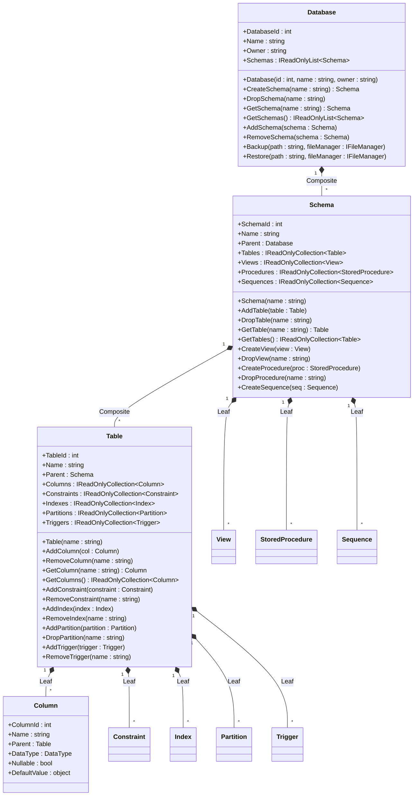
```mermaid
classDiagram
direction TB

class Database {
    +DatabaseId : int
    +Name : string
    +Owner : string
    +Schemas : IReadOnlyList~Schema~
    +Database(id : int, name : string, owner : string)
    +CreateSchema(name : string) Schema
    +DropSchema(name : string)
    +GetSchema(name : string) Schema
    +GetSchemas() IReadOnlyList~Schema~
    +AddSchema(schema : Schema)
    +RemoveSchema(schema : Schema)
    +Backup(path : string, fileManager : IFileManager)
    +Restore(path : string, fileManager : IFileManager)
}

class Schema {
    +SchemaId : int
    +Name : string
    +Parent : Database
    +Tables : IReadOnlyCollection~Table~
    +Views : IReadOnlyCollection~View~
    +Procedures : IReadOnlyCollection~StoredProcedure~
    +Sequences : IReadOnlyCollection~Sequence~
    +Schema(name : string)
    +AddTable(table : Table)
    +DropTable(name : string)
    +GetTable(name : string) Table
    +GetTables() IReadOnlyCollection~Table~
    +CreateView(view : View)
    +DropView(name : string)
    +CreateProcedure(proc : StoredProcedure)
    +DropProcedure(name : string)
    +CreateSequence(seq : Sequence)
}

class Table {
    +TableId : int
    +Name : string
    +Parent : Schema
    +Columns : IReadOnlyCollection~Column~
    +Constraints : IReadOnlyCollection~Constraint~
    +Indexes : IReadOnlyCollection~Index~
    +Partitions : IReadOnlyCollection~Partition~
    +Triggers : IReadOnlyCollection~Trigger~
    +Table(name : string)
    +AddColumn(col : Column)
    +RemoveColumn(name : string)
    +GetColumn(name : string) Column
    +GetColumns() IReadOnlyCollection~Column~
    +AddConstraint(constraint : Constraint)
    +RemoveConstraint(name : string)
    +AddIndex(index : Index)
    +RemoveIndex(name : string)
    +AddPartition(partition : Partition)
    +DropPartition(name : string)
    +AddTrigger(trigger : Trigger)
    +RemoveTrigger(name : string)
}

class Column {
    +ColumnId : int
    +Name : string
    +Parent : Table
    +DataType : DataType
    +Nullable : bool
    +DefaultValue : object
}
class Constraint
class Index
class Partition
class Trigger
class View
class StoredProcedure
class Sequence

Database "1" *-- "*" Schema : Composite
Schema "1" *-- "*" Table : Composite
Schema "1" *-- "*" View : Leaf
Schema "1" *-- "*" StoredProcedure : Leaf
Schema "1" *-- "*" Sequence : Leaf
Table "1" *-- "*" Column : Leaf
Table "1" *-- "*" Constraint : Leaf
Table "1" *-- "*" Index : Leaf
Table "1" *-- "*" Partition : Leaf
Table "1" *-- "*" Trigger : Leaf
```

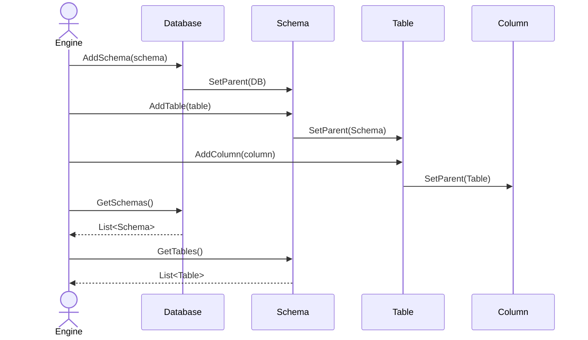
```mermaid
sequenceDiagram
    actor Engine
    participant DB as Database
    participant Schema as Schema
    participant Table as Table
    participant Column as Column

    Engine->>DB: AddSchema(schema)
    DB->>Schema: SetParent(DB)

    Engine->>Schema: AddTable(table)
    Schema->>Table: SetParent(Schema)

    Engine->>Table: AddColumn(column)
    Table->>Column: SetParent(Table)

    Engine->>DB: GetSchemas()
    DB-->>Engine: List<Schema>
    
    Engine->>Schema: GetTables()
    Schema-->>Engine: List<Table>
```

### 2. Metadata Initialization (Builder Pattern)

**Application:** Initializes tables via `TableBuilder` from DDL syntax.

**Why apply?** Initializing a Table object requires many properties. `TableBuilder` helps gather parameters gradually (Columns, Primary Keys) and only creates the `TableMetadata` object in the final step, making the code coherent and readable.

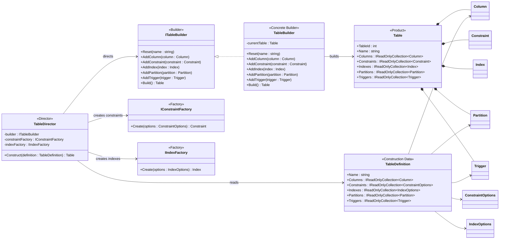
```mermaid
classDiagram
direction LR

%% =====================================================
%% Builder Pattern
%% =====================================================

class ITableBuilder {
    <<Builder>>
    +Reset(name : string)
    +AddColumn(column : Column)
    +AddConstraint(constraint : Constraint)
    +AddIndex(index : Index)
    +AddPartition(partition : Partition)
    +AddTrigger(trigger : Trigger)
    +Build() Table
}

class TableBuilder {
    <<Concrete Builder>>
    -currentTable : Table
    +Reset(name : string)
    +AddColumn(column : Column)
    +AddConstraint(constraint : Constraint)
    +AddIndex(index : Index)
    +AddPartition(partition : Partition)
    +AddTrigger(trigger : Trigger)
    +Build() Table
}

class TableDirector {
    <<Director>>
    -builder : ITableBuilder
    -constraintFactory : IConstraintFactory
    -indexFactory : IIndexFactory
    +Construct(definition : TableDefinition) Table
}

class TableDefinition {
    <<Construction Data>>
    +Name : string
    +Columns : IReadOnlyCollection~Column~
    +Constraints : IReadOnlyCollection~ConstraintOptions~
    +Indexes : IReadOnlyCollection~IndexOptions~
    +Partitions : IReadOnlyCollection~Partition~
    +Triggers : IReadOnlyCollection~Trigger~
}

class Table {
    <<Product>>
    +TableId : int
    +Name : string
    +Columns : IReadOnlyCollection~Column~
    +Constraints : IReadOnlyCollection~Constraint~
    +Indexes : IReadOnlyCollection~Index~
    +Partitions : IReadOnlyCollection~Partition~
    +Triggers : IReadOnlyCollection~Trigger~
}

class Column
class Constraint
class Index
class Partition
class Trigger

class IConstraintFactory {
    <<Factory>>
    +Create(options : ConstraintOptions) Constraint
}

class IIndexFactory {
    <<Factory>>
    +Create(options : IndexOptions) Index
}

class ConstraintOptions
class IndexOptions

ITableBuilder <|.. TableBuilder
TableDirector --> ITableBuilder : directs
TableDirector --> IConstraintFactory : creates constraints
TableDirector --> IIndexFactory : creates indexes
TableDirector --> TableDefinition : reads

TableBuilder --> Table : builds

Table *-- Column
Table *-- Constraint
Table *-- Index
Table *-- Partition
Table *-- Trigger

TableDefinition --> Column
TableDefinition --> ConstraintOptions
TableDefinition --> IndexOptions
TableDefinition --> Partition
TableDefinition --> Trigger
```

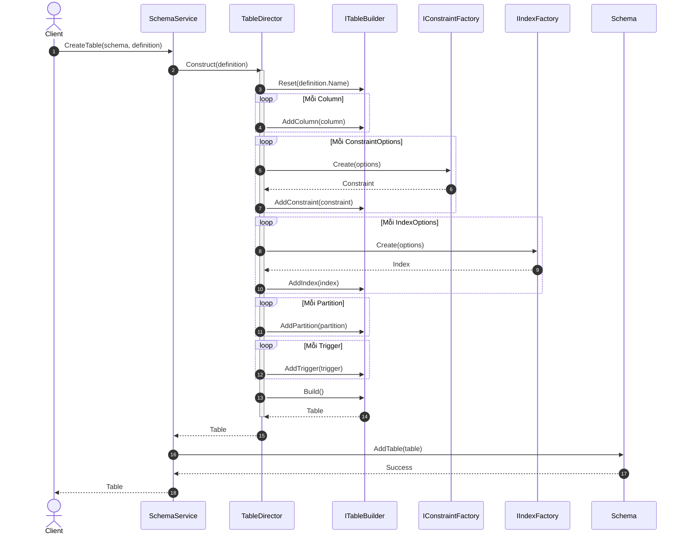
```mermaid
sequenceDiagram
    autonumber

    actor Client
    participant Service as SchemaService
    participant Director as TableDirector
    participant Builder as ITableBuilder
    participant CFactory as IConstraintFactory
    participant IFactory as IIndexFactory
    participant Schema

    Client->>Service: CreateTable(schema, definition)

    Service->>Director: Construct(definition)
    activate Director

    Director->>Builder: Reset(definition.Name)

    loop Mỗi Column
        Director->>Builder: AddColumn(column)
    end

    loop Mỗi ConstraintOptions
        Director->>CFactory: Create(options)
        CFactory-->>Director: Constraint
        Director->>Builder: AddConstraint(constraint)
    end

    loop Mỗi IndexOptions
        Director->>IFactory: Create(options)
        IFactory-->>Director: Index
        Director->>Builder: AddIndex(index)
    end

    loop Mỗi Partition
        Director->>Builder: AddPartition(partition)
    end

    loop Mỗi Trigger
        Director->>Builder: AddTrigger(trigger)
    end

    Director->>Builder: Build()
    Builder-->>Director: Table

    deactivate Director
    Director-->>Service: Table

    Service->>Schema: AddTable(table)
    Schema-->>Service: Success

    Service-->>Client: Table
```

### 3. Constraint Validation (Strategy Pattern)

**Application:** Evaluates Row validity based on various types of Constraints.

**Why apply?** By applying the Strategy Pattern via the `IConstraint` interface, `RecordManager` doesn't need to care about internal detailed logic (Primary Key checks for duplicates, Check evaluates expressions, Foreign Key checks reference table). It just calls `Validate(row)` and handles the polymorphic result.

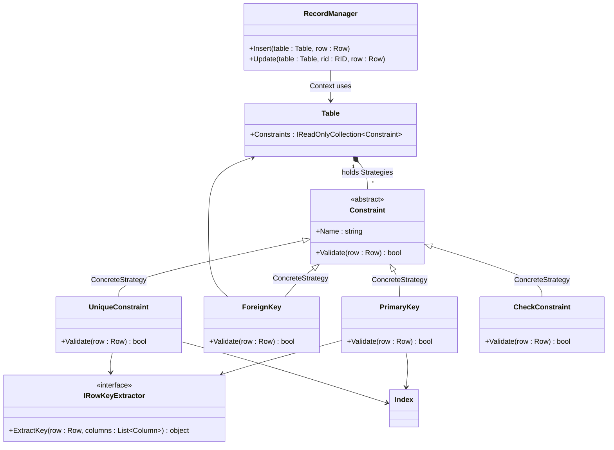
```mermaid
classDiagram
direction TB

class RecordManager {
    +Insert(table : Table, row : Row)
    +Update(table : Table, rid : RID, row : Row)
}

class Table {
    +Constraints : IReadOnlyCollection~Constraint~
}

class Constraint {
    <<abstract>>
    +Name : string
    +Validate(row : Row) bool
}

class PrimaryKey {
    +Validate(row : Row) bool
}

class ForeignKey {
    +Validate(row : Row) bool
}

class UniqueConstraint {
    +Validate(row : Row) bool
}

class CheckConstraint {
    +Validate(row : Row) bool
}
class IRowKeyExtractor {
    <<interface>>
    +ExtractKey(row : Row, columns : List~Column~) object
}

class Index

RecordManager --> Table : Context uses
Table "1" *-- "*" Constraint : holds Strategies
Constraint <|-- PrimaryKey : ConcreteStrategy
Constraint <|-- ForeignKey : ConcreteStrategy
Constraint <|-- UniqueConstraint : ConcreteStrategy
Constraint <|-- CheckConstraint : ConcreteStrategy
PrimaryKey --> IRowKeyExtractor
UniqueConstraint --> IRowKeyExtractor
PrimaryKey --> Index
UniqueConstraint --> Index
ForeignKey --> Table
```

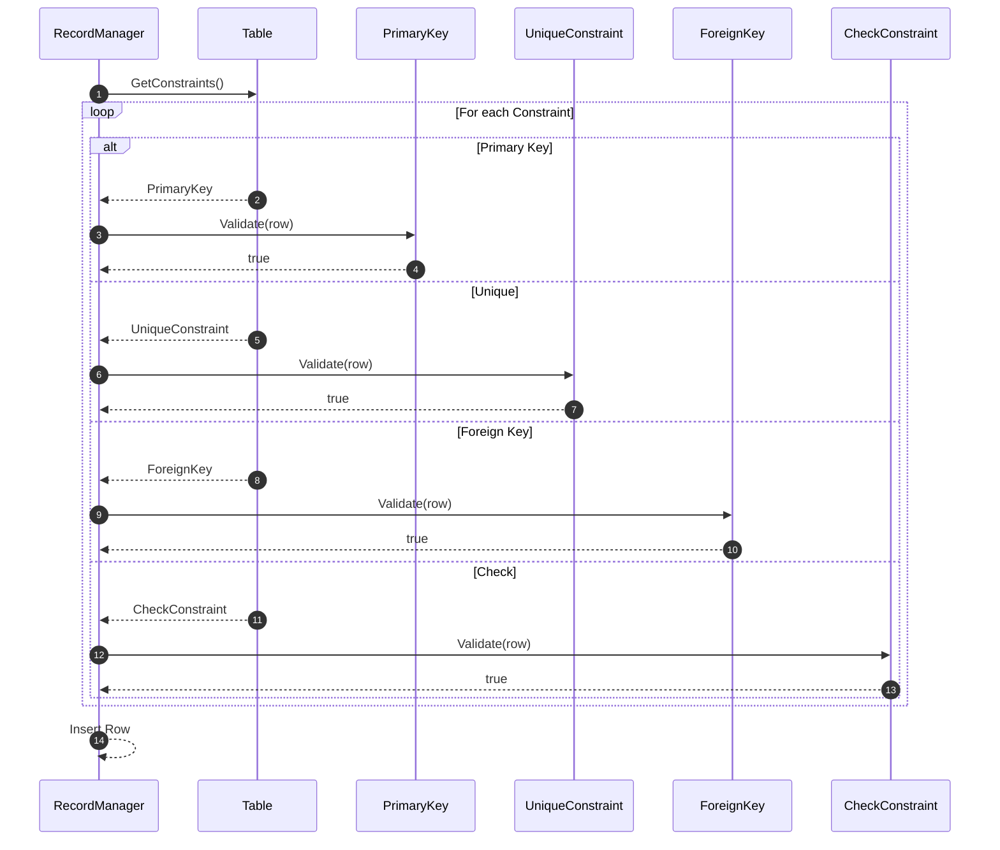
```mermaid
sequenceDiagram
    autonumber

    participant RecordMgr as RecordManager
    participant Table as Table
    participant PK as PrimaryKey
    participant Unique as UniqueConstraint
    participant FK as ForeignKey
    participant Check as CheckConstraint

    RecordMgr->>Table: GetConstraints()

    loop For each Constraint

        alt Primary Key
            Table-->>RecordMgr: PrimaryKey
            RecordMgr->>PK: Validate(row)
            PK-->>RecordMgr: true
        else Unique
            Table-->>RecordMgr: UniqueConstraint
            RecordMgr->>Unique: Validate(row)
            Unique-->>RecordMgr: true
        else Foreign Key
            Table-->>RecordMgr: ForeignKey
            RecordMgr->>FK: Validate(row)
            FK-->>RecordMgr: true
        else Check
            Table-->>RecordMgr: CheckConstraint
            RecordMgr->>Check: Validate(row)
            Check-->>RecordMgr: true
        end

    end

    RecordMgr-->>RecordMgr: Insert Row
```

### 4. Dynamic Allocation (Factory Method Pattern)

**Application:** Allocates objects like Index and Constraint automatically during DDL execution.

**Why apply?** Delegates the creation of a specific Index (BTree or Hash) to `IndexFactory`. The client doesn't need to know the internal initialization logic, just passes in the desired Index type and receives a common `IIndex` interface back.

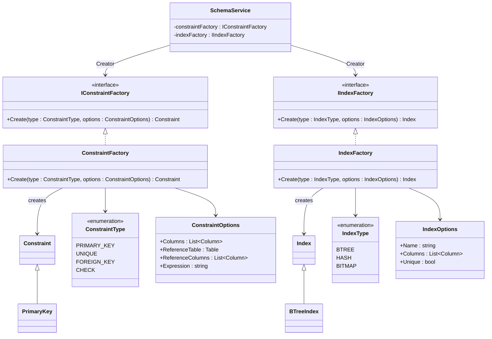
```mermaid
classDiagram
direction TB
class SchemaService {
    -constraintFactory : IConstraintFactory
    -indexFactory : IIndexFactory
}

class IConstraintFactory {
    <<interface>>
    +Create(type : ConstraintType, options : ConstraintOptions) Constraint
}

class ConstraintFactory {
    +Create(type : ConstraintType, options : ConstraintOptions) Constraint
}

class ConstraintType{
    <<enumeration>>
    PRIMARY_KEY
    UNIQUE
    FOREIGN_KEY
    CHECK
}

class ConstraintOptions{
    +Columns : List~Column~
    +ReferenceTable : Table
    +ReferenceColumns : List~Column~
    +Expression : string
}

class IIndexFactory {
    <<interface>>
    +Create(type : IndexType, options : IndexOptions) Index
}

class IndexFactory {
    +Create(type : IndexType, options : IndexOptions) Index
}

class IndexType{
    <<enumeration>>
    BTREE
    HASH
    BITMAP
}

class IndexOptions{
    +Name : string
    +Columns : List~Column~
    +Unique : bool
}

class Constraint
class PrimaryKey
class Index
class BTreeIndex

SchemaService --> IConstraintFactory : Creator
SchemaService --> IIndexFactory : Creator
IConstraintFactory <|.. ConstraintFactory
IIndexFactory <|.. IndexFactory
ConstraintFactory --> Constraint : creates
IndexFactory --> Index : creates
ConstraintFactory --> ConstraintType
ConstraintFactory --> ConstraintOptions
IndexFactory --> IndexType
IndexFactory --> IndexOptions
Constraint <|-- PrimaryKey
Index <|-- BTreeIndex
```

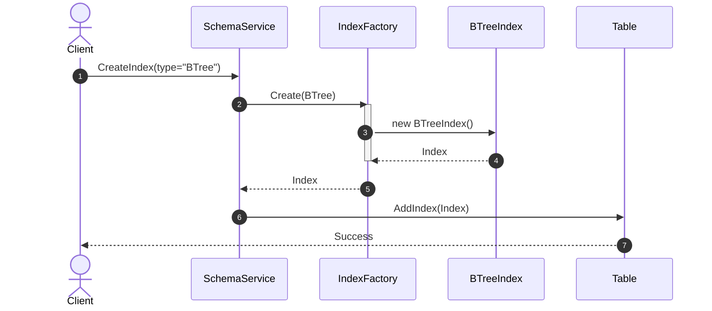
```mermaid
sequenceDiagram
    autonumber
    actor Client
    participant Service as SchemaService
    participant Factory as IndexFactory
    participant BTree as BTreeIndex
    participant Table as Table
    Client->>Service: CreateIndex(type="BTree")
    Service->>Factory: Create(BTree)
    activate Factory
    Factory->>BTree: new BTreeIndex()
    BTree-->>Factory: Index
    deactivate Factory
    Factory-->>Service: Index
    Service->>Table: AddIndex(Index)
    Table-->>Client: Success
```

### 5. Hierarchy Traversal (Iterator Pattern)

**Application:** Traverses the database metadata hierarchy (Database, Schema, Table) sequentially without exposing the underlying representations.

**Why apply?** The Iterator Pattern provides a unified interface `ICatalogIterator` for clients (like `SchemaService`) to iterate through catalog components (Schemas in a Database, Tables in a Schema, Columns in a Table) regardless of whether they are stored in an `IReadOnlyList` or `IReadOnlyCollection`.

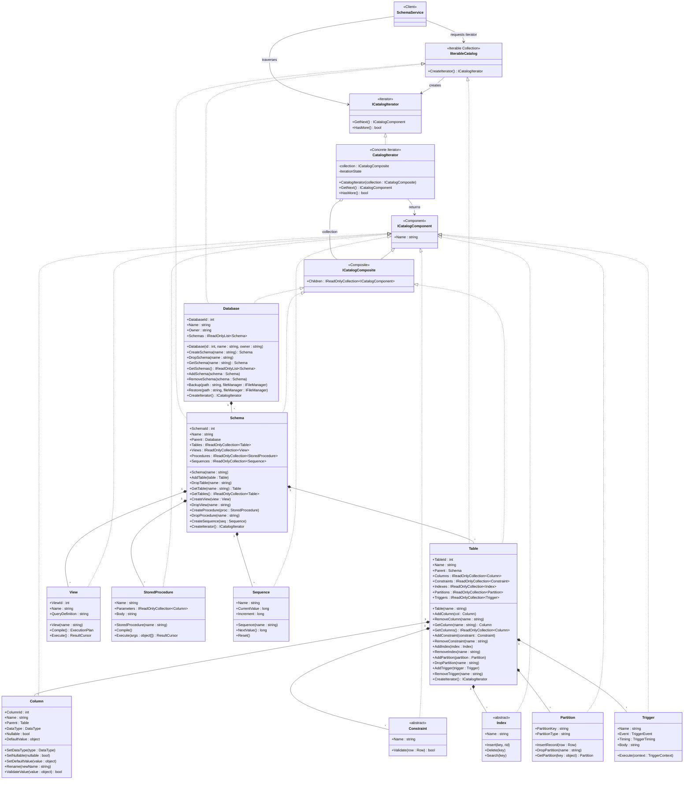
```mermaid
classDiagram
direction TB

class ICatalogComponent {
    <<Component>>
    +Name : string
}

class ICatalogComposite {
    <<Composite>>
    +Children : IReadOnlyCollection~ICatalogComponent~
}

ICatalogComponent <|-- ICatalogComposite

class ICatalogIterator {
    <<Iterator>>
    +GetNext() ICatalogComponent
    +HasMore() bool
}

class CatalogIterator {
    <<Concrete Iterator>>
    -collection : ICatalogComposite
    -iterationState
    +CatalogIterator(collection : ICatalogComposite)
    +GetNext() ICatalogComponent
    +HasMore() bool
}

class IIterableCatalog {
    <<Iterable Collection>>
    +CreateIterator() ICatalogIterator
}

class Database {
    +DatabaseId : int
    +Name : string
    +Owner : string
    +Schemas : IReadOnlyList~Schema~
    +Database(id : int, name : string, owner : string)
    +CreateSchema(name : string) Schema
    +DropSchema(name : string)
    +GetSchema(name : string) Schema
    +GetSchemas() IReadOnlyList~Schema~
    +AddSchema(schema : Schema)
    +RemoveSchema(schema : Schema)
    +Backup(path : string, fileManager : IFileManager)
    +Restore(path : string, fileManager : IFileManager)
    +CreateIterator() ICatalogIterator
}

class Schema {
    +SchemaId : int
    +Name : string
    +Parent : Database
    +Tables : IReadOnlyCollection~Table~
    +Views : IReadOnlyCollection~View~
    +Procedures : IReadOnlyCollection~StoredProcedure~
    +Sequences : IReadOnlyCollection~Sequence~
    +Schema(name : string)
    +AddTable(table : Table)
    +DropTable(name : string)
    +GetTable(name : string) Table
    +GetTables() IReadOnlyCollection~Table~
    +CreateView(view : View)
    +DropView(name : string)
    +CreateProcedure(proc : StoredProcedure)
    +DropProcedure(name : string)
    +CreateSequence(seq : Sequence)
    +CreateIterator() ICatalogIterator
}

class Table {
    +TableId : int
    +Name : string
    +Parent : Schema
    +Columns : IReadOnlyCollection~Column~
    +Constraints : IReadOnlyCollection~Constraint~
    +Indexes : IReadOnlyCollection~Index~
    +Partitions : IReadOnlyCollection~Partition~
    +Triggers : IReadOnlyCollection~Trigger~
    +Table(name : string)
    +AddColumn(col : Column)
    +RemoveColumn(name : string)
    +GetColumn(name : string) Column
    +GetColumns() IReadOnlyCollection~Column~
    +AddConstraint(constraint : Constraint)
    +RemoveConstraint(name : string)
    +AddIndex(index : Index)
    +RemoveIndex(name : string)
    +AddPartition(partition : Partition)
    +DropPartition(name : string)
    +AddTrigger(trigger : Trigger)
    +RemoveTrigger(name : string)
    +CreateIterator() ICatalogIterator
}

class Column {
    +ColumnId : int
    +Name : string
    +Parent : Table
    +DataType : DataType
    +Nullable : bool
    +DefaultValue : object
    +SetDataType(type : DataType)
    +SetNullable(nullable : bool)
    +SetDefaultValue(value : object)
    +Rename(newName : string)
    +ValidateValue(value : object) bool
}

class Constraint {
    <<abstract>>
    +Name : string
    +Validate(row : Row) bool
}

class Index {
    <<abstract>>
    +Name : string
    +Insert(key, rid)
    +Delete(key)
    +Search(key)
}

class Partition {
    +PartitionKey : string
    +PartitionType : string
    +InsertRecord(row : Row)
    +DropPartition(name : string)
    +GetPartition(key : object) Partition
}

class Trigger {
    +Name : string
    +Event : TriggerEvent
    +Timing : TriggerTiming
    +Body : string
    +Execute(context : TriggerContext)
}

class View {
    +ViewId : int
    +Name : string
    +QueryDefinition : string
    +View(name : string)
    +Compile() ExecutionPlan
    +Execute() ResultCursor
}

class StoredProcedure {
    +Name : string
    +Parameters : IReadOnlyCollection~Column~
    +Body : string
    +StoredProcedure(name : string)
    +Compile()
    +Execute(args : object[]) ResultCursor
}

class Sequence {
    +Name : string
    +CurrentValue : long
    +Increment : long
    +Sequence(name : string)
    +NextValue() long
    +Reset()
}

class SchemaService {
    <<Client>>
}

ICatalogIterator <|.. CatalogIterator

ICatalogComposite <|.. Database
ICatalogComposite <|.. Schema
ICatalogComposite <|.. Table

ICatalogComponent <|.. Column
ICatalogComponent <|.. Constraint
ICatalogComponent <|.. Index
ICatalogComponent <|.. Partition
ICatalogComponent <|.. Trigger
ICatalogComponent <|.. View
ICatalogComponent <|.. StoredProcedure
ICatalogComponent <|.. Sequence


Database "1" *-- "*" Schema
Schema "1" *-- "*" Table
Schema "1" *-- "*" View
Schema "1" *-- "*" StoredProcedure
Schema "1" *-- "*" Sequence
Table "1" *-- "*" Column
Table "1" *-- "*" Constraint
Table "1" *-- "*" Index
Table "1" *-- "*" Partition
Table "1" *-- "*" Trigger

IIterableCatalog <|.. Database
IIterableCatalog <|.. Schema
IIterableCatalog <|.. Table

CatalogIterator o-- ICatalogComposite : collection
CatalogIterator --> ICatalogComponent : returns

IIterableCatalog --> ICatalogIterator : creates
SchemaService --> IIterableCatalog : requests iterator
SchemaService --> ICatalogIterator : traverses
```

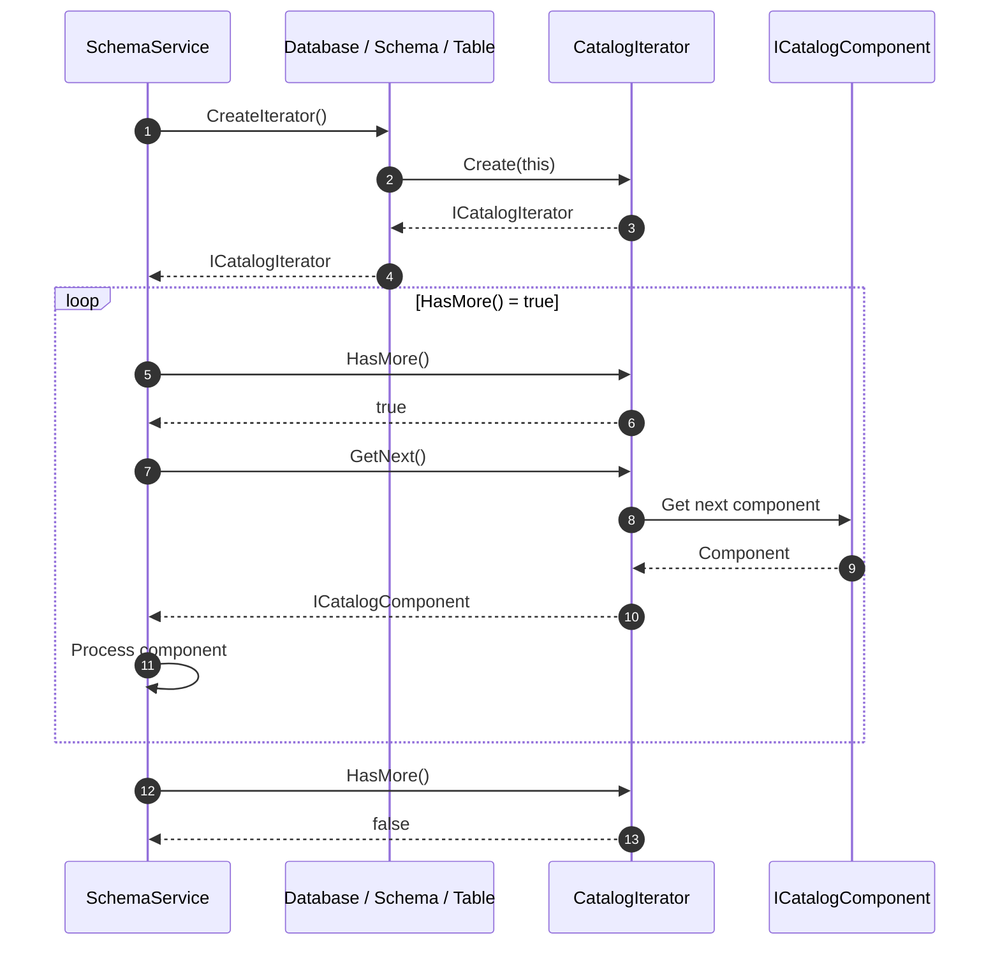
```mermaid
sequenceDiagram
    autonumber

    participant Client as SchemaService
    participant Composite as Database / Schema / Table
    participant Iterator as CatalogIterator
    participant Component as ICatalogComponent

    Client->>Composite: CreateIterator()
    Composite->>Iterator: Create(this)
    Iterator-->>Composite: ICatalogIterator
    Composite-->>Client: ICatalogIterator

    loop HasMore() = true
        Client->>Iterator: HasMore()
        Iterator-->>Client: true

        Client->>Iterator: GetNext()
        Iterator->>Component: Get next component
        Component-->>Iterator: Component
        Iterator-->>Client: ICatalogComponent

        Client->>Client: Process component
    end

    Client->>Iterator: HasMore()
    Iterator-->>Client: false
```

### 6. DDL Execution (Command Pattern)

**Application:** Encapsulates Data Definition Language (DDL) requests (like `CreateTable`, `CreateSchema`) as standalone objects that contain all information about the request.

**Why apply?** The Command Pattern allows the `QueryProcessor` to parameterize the `DdlCommandExecutor` with different requests, decouple the invoker from the receivers (`SchemaService`, `DatabaseService`), and supports future capabilities like queuing, logging, or undoing operations.

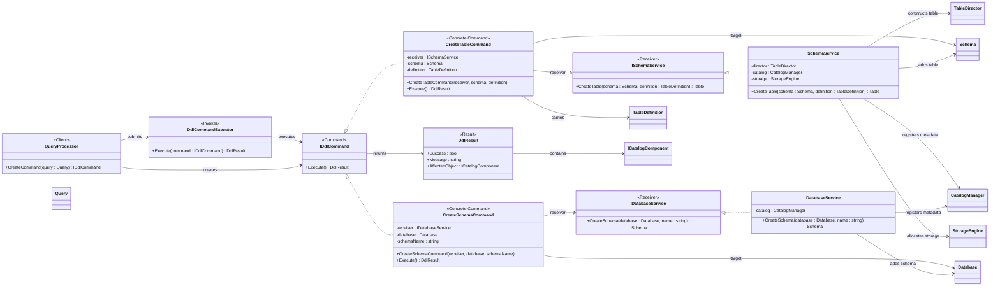
```mermaid
classDiagram
direction LR

%% =====================================================
%% Command Pattern
%% =====================================================

class IDdlCommand {
    <<Command>>
    +Execute() DdlResult
}

class CreateTableCommand {
    <<Concrete Command>>
    -receiver : ISchemaService
    -schema : Schema
    -definition : TableDefinition
    +CreateTableCommand(receiver, schema, definition)
    +Execute() DdlResult
}

class CreateSchemaCommand {
    <<Concrete Command>>
    -receiver : IDatabaseService
    -database : Database
    -schemaName : string
    +CreateSchemaCommand(receiver, database, schemaName)
    +Execute() DdlResult
}

class DdlCommandExecutor {
    <<Invoker>>
    +Execute(command : IDdlCommand) DdlResult
}

class QueryProcessor {
    <<Client>>
    +CreateCommand(query : Query) IDdlCommand
}

class DdlResult {
    <<Result>>
    +Success : bool
    +Message : string
    +AffectedObject : ICatalogComponent
}

%% =====================================================
%% Receivers
%% =====================================================

class IDatabaseService {
    <<Receiver>>
    +CreateSchema(database : Database, name : string) Schema
}

class DatabaseService {
    -catalog : CatalogManager
    +CreateSchema(database : Database, name : string) Schema
}

class ISchemaService {
    <<Receiver>>
    +CreateTable(schema : Schema, definition : TableDefinition) Table
}

class SchemaService {
    -director : TableDirector
    -catalog : CatalogManager
    -storage : StorageEngine
    +CreateTable(schema : Schema, definition : TableDefinition) Table
}

%% =====================================================
%% Related Domain Objects
%% =====================================================

class Database
class Schema
class TableDefinition
class TableDirector
class CatalogManager
class StorageEngine
class Query
class ICatalogComponent

IDdlCommand <|.. CreateTableCommand
IDdlCommand <|.. CreateSchemaCommand

IDatabaseService <|.. DatabaseService
ISchemaService <|.. SchemaService

DdlCommandExecutor --> IDdlCommand : executes

QueryProcessor --> IDdlCommand : creates
QueryProcessor --> DdlCommandExecutor : submits

CreateTableCommand --> ISchemaService : receiver
CreateTableCommand --> Schema : target
CreateTableCommand --> TableDefinition : carries

CreateSchemaCommand --> IDatabaseService : receiver
CreateSchemaCommand --> Database : target

SchemaService --> TableDirector : constructs table
SchemaService --> Schema : adds table
SchemaService --> CatalogManager : registers metadata
SchemaService --> StorageEngine : allocates storage

DatabaseService --> Database : adds schema
DatabaseService --> CatalogManager : registers metadata

IDdlCommand --> DdlResult : returns
DdlResult --> ICatalogComponent : contains
```

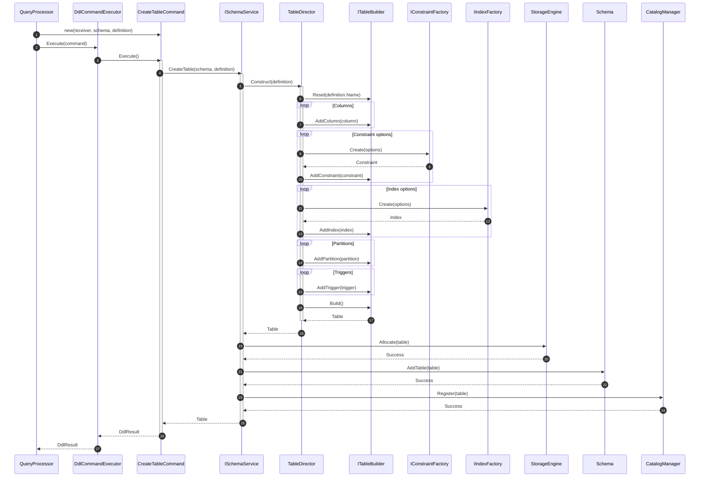
```mermaid
sequenceDiagram
    autonumber

    participant QP as QueryProcessor
    participant Executor as DdlCommandExecutor
    participant Command as CreateTableCommand
    participant Service as ISchemaService
    participant Director as TableDirector
    participant Builder as ITableBuilder
    participant CFactory as IConstraintFactory
    participant IFactory as IIndexFactory
    participant Storage as StorageEngine
    participant Schema
    participant Catalog as CatalogManager

    QP->>Command: new(receiver, schema, definition)
    QP->>Executor: Execute(command)

    Executor->>Command: Execute()
    activate Command

    Command->>Service: CreateTable(schema, definition)
    activate Service

    Service->>Director: Construct(definition)
    activate Director

    Director->>Builder: Reset(definition.Name)

    loop Columns
        Director->>Builder: AddColumn(column)
    end

    loop Constraint options
        Director->>CFactory: Create(options)
        CFactory-->>Director: Constraint
        Director->>Builder: AddConstraint(constraint)
    end

    loop Index options
        Director->>IFactory: Create(options)
        IFactory-->>Director: Index
        Director->>Builder: AddIndex(index)
    end

    loop Partitions
        Director->>Builder: AddPartition(partition)
    end

    loop Triggers
        Director->>Builder: AddTrigger(trigger)
    end

    Director->>Builder: Build()
    Builder-->>Director: Table

    deactivate Director
    Director-->>Service: Table

    Service->>Storage: Allocate(table)
    Storage-->>Service: Success

    Service->>Schema: AddTable(table)
    Schema-->>Service: Success

    Service->>Catalog: Register(table)
    Catalog-->>Service: Success

    Service-->>Command: Table
    deactivate Service

    Command-->>Executor: DdlResult
    deactivate Command

    Executor-->>QP: DdlResult
```

### 7. DDL Coordination (Facade Pattern)

**Application:** `SchemaService` and `DatabaseService` coordinate complex Create, Drop, and Alter operations for database objects.

**Why apply?** The Facade Pattern provides a unified, high-level interface for DDL operations, shielding the clients (like DDL Commands) from the complexities of the underlying subsystems. Instead of manually coordinating `CatalogManager`, `TableDirector`, `StorageEngine`, and various factories, the clients simply call methods like `CreateTable()` or `DropSchema()` on these services.

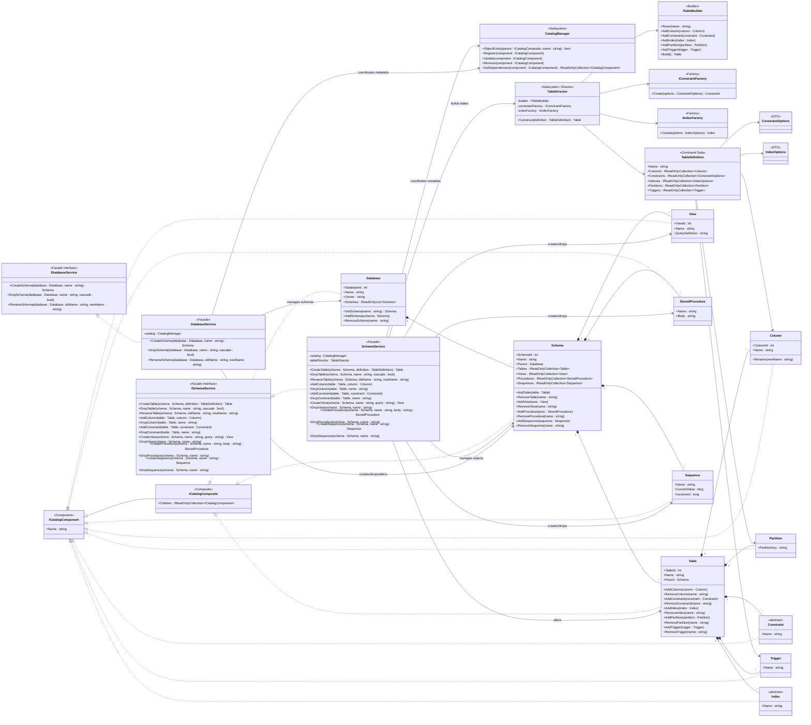
```mermaid
classDiagram
direction LR

%% =====================================================
%% Facade Interfaces
%% =====================================================

class IDatabaseService {
    <<Facade Interface>>
    +CreateSchema(database : Database, name : string) Schema
    +DropSchema(database : Database, name : string, cascade : bool)
    +RenameSchema(database : Database, oldName : string, newName : string)
}

class ISchemaService {
    <<Facade Interface>>
    +CreateTable(schema : Schema, definition : TableDefinition) Table
    +DropTable(schema : Schema, name : string, cascade : bool)
    +RenameTable(schema : Schema, oldName : string, newName : string)
    +AddColumn(table : Table, column : Column)
    +DropColumn(table : Table, name : string)
    +AddConstraint(table : Table, constraint : Constraint)
    +DropConstraint(table : Table, name : string)
    +CreateView(schema : Schema, name : string, query : string) View
    +DropView(schema : Schema, name : string)
    +CreateProcedure(schema : Schema, name : string, body : string) StoredProcedure
    +DropProcedure(schema : Schema, name : string)
    +CreateSequence(schema : Schema, name : string) Sequence
    +DropSequence(schema : Schema, name : string)
}

%% =====================================================
%% Concrete Facades
%% =====================================================

class DatabaseService {
    <<Facade>>
    -catalog : CatalogManager
    +CreateSchema(database : Database, name : string) Schema
    +DropSchema(database : Database, name : string, cascade : bool)
    +RenameSchema(database : Database, oldName : string, newName : string)
}

class SchemaService {
    <<Facade>>
    -catalog : CatalogManager
    -tableDirector : TableDirector
    +CreateTable(schema : Schema, definition : TableDefinition) Table
    +DropTable(schema : Schema, name : string, cascade : bool)
    +RenameTable(schema : Schema, oldName : string, newName : string)
    +AddColumn(table : Table, column : Column)
    +DropColumn(table : Table, name : string)
    +AddConstraint(table : Table, constraint : Constraint)
    +DropConstraint(table : Table, name : string)
    +CreateView(schema : Schema, name : string, query : string) View
    +DropView(schema : Schema, name : string)
    +CreateProcedure(schema : Schema, name : string, body : string) StoredProcedure
    +DropProcedure(schema : Schema, name : string)
    +CreateSequence(schema : Schema, name : string) Sequence
    +DropSequence(schema : Schema, name : string)
}

%% =====================================================
%% Subsystems Used By Facades
%% =====================================================

class CatalogManager {
    <<Subsystem>>
    +ObjectExists(parent : ICatalogComposite, name : string) bool
    +Register(component : ICatalogComponent)
    +Update(component : ICatalogComponent)
    +Remove(component : ICatalogComponent)
    +GetDependencies(component : ICatalogComponent) IReadOnlyCollection~ICatalogComponent~
}

class TableDirector {
    <<Subsystem / Director>>
    -builder : ITableBuilder
    -constraintFactory : IConstraintFactory
    -indexFactory : IIndexFactory
    +Construct(definition : TableDefinition) Table
}

class ITableBuilder {
    <<Builder>>
    +Reset(name : string)
    +AddColumn(column : Column)
    +AddConstraint(constraint : Constraint)
    +AddIndex(index : Index)
    +AddPartition(partition : Partition)
    +AddTrigger(trigger : Trigger)
    +Build() Table
}

class IConstraintFactory {
    <<Factory>>
    +Create(options : ConstraintOptions) Constraint
}

class IIndexFactory {
    <<Factory>>
    +Create(options : IndexOptions) Index
}

%% =====================================================
%% Database Objects
%% =====================================================

class ICatalogComponent {
    <<Component>>
    +Name : string
}

class ICatalogComposite {
    <<Composite>>
    +Children : IReadOnlyCollection~ICatalogComponent~
}

class Database {
    +DatabaseId : int
    +Name : string
    +Owner : string
    +Schemas : IReadOnlyList~Schema~
    +GetSchema(name : string) Schema
    +AddSchema(schema : Schema)
    +RemoveSchema(name : string)
}

class Schema {
    +SchemaId : int
    +Name : string
    +Parent : Database
    +Tables : IReadOnlyCollection~Table~
    +Views : IReadOnlyCollection~View~
    +Procedures : IReadOnlyCollection~StoredProcedure~
    +Sequences : IReadOnlyCollection~Sequence~
    +AddTable(table : Table)
    +RemoveTable(name : string)
    +AddView(view : View)
    +RemoveView(name : string)
    +AddProcedure(proc : StoredProcedure)
    +RemoveProcedure(name : string)
    +AddSequence(sequence : Sequence)
    +RemoveSequence(name : string)
}

class Table {
    +TableId : int
    +Name : string
    +Parent : Schema
    +AddColumn(column : Column)
    +RemoveColumn(name : string)
    +AddConstraint(constraint : Constraint)
    +RemoveConstraint(name : string)
    +AddIndex(index : Index)
    +RemoveIndex(name : string)
    +AddPartition(partition : Partition)
    +RemovePartition(name : string)
    +AddTrigger(trigger : Trigger)
    +RemoveTrigger(name : string)
}

class View {
    +ViewId : int
    +Name : string
    +QueryDefinition : string
}

class StoredProcedure {
    +Name : string
    +Body : string
}

class Sequence {
    +Name : string
    +CurrentValue : long
    +Increment : long
}

class Column {
    +ColumnId : int
    +Name : string
    +Rename(newName : string)
}

class Constraint {
    <<abstract>>
    +Name : string
}

class Index {
    <<abstract>>
    +Name : string
}

class Partition {
    +PartitionKey : string
}

class Trigger {
    +Name : string
}

%% =====================================================
%% Definition Objects
%% =====================================================

class TableDefinition {
    <<Command Data>>
    +Name : string
    +Columns : IReadOnlyCollection~Column~
    +Constraints : IReadOnlyCollection~ConstraintOptions~
    +Indexes : IReadOnlyCollection~IndexOptions~
    +Partitions : IReadOnlyCollection~Partition~
    +Triggers : IReadOnlyCollection~Trigger~
}

class ConstraintOptions {
    <<DTO>>
}

class IndexOptions {
    <<DTO>>
}

%% =====================================================
%% Relationships
%% =====================================================

IDatabaseService <|.. DatabaseService
ISchemaService <|.. SchemaService

DatabaseService --> CatalogManager : coordinates metadata
DatabaseService --> Database : manages schemas
DatabaseService --> Schema : creates/drops/alters

SchemaService --> CatalogManager : coordinates metadata
SchemaService --> TableDirector : builds tables
SchemaService --> Schema : manages objects
SchemaService --> Table : alters
SchemaService --> View : creates/drops
SchemaService --> StoredProcedure : creates/drops
SchemaService --> Sequence : creates/drops

TableDirector --> ITableBuilder
TableDirector --> IConstraintFactory
TableDirector --> IIndexFactory
TableDirector --> TableDefinition

ICatalogComponent <|-- ICatalogComposite
ICatalogComposite <|.. Database
ICatalogComposite <|.. Schema
ICatalogComposite <|.. Table

ICatalogComponent <|.. Column
ICatalogComponent <|.. Constraint
ICatalogComponent <|.. Index
ICatalogComponent <|.. Partition
ICatalogComponent <|.. Trigger
ICatalogComponent <|.. View
ICatalogComponent <|.. StoredProcedure
ICatalogComponent <|.. Sequence

Database "1" *-- "*" Schema
Schema "1" *-- "*" Table
Schema "1" *-- "*" View
Schema "1" *-- "*" StoredProcedure
Schema "1" *-- "*" Sequence

Table "1" *-- "*" Column
Table "1" *-- "*" Constraint
Table "1" *-- "*" Index
Table "1" *-- "*" Partition
Table "1" *-- "*" Trigger

TableDefinition --> Column
TableDefinition --> ConstraintOptions
TableDefinition --> IndexOptions
TableDefinition --> Partition
TableDefinition --> Trigger
```

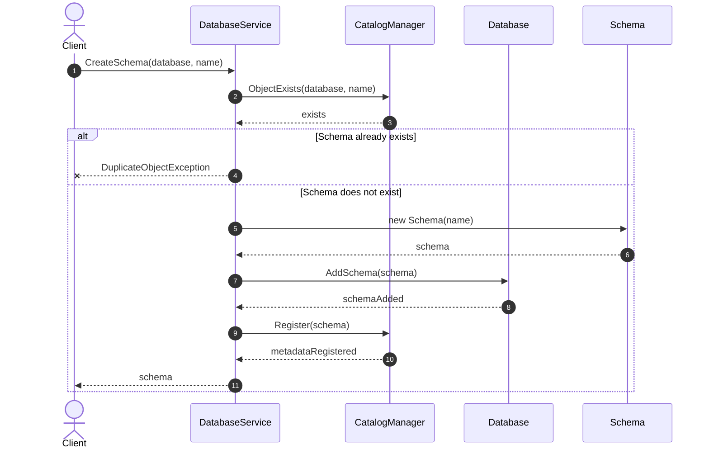
```mermaid
sequenceDiagram
    autonumber

    actor Client
    participant Facade as DatabaseService
    participant Catalog as CatalogManager
    participant Database
    participant Schema

    Client->>Facade: CreateSchema(database, name)

    Facade->>Catalog: ObjectExists(database, name)
    Catalog-->>Facade: exists

    alt Schema already exists
        Facade--xClient: DuplicateObjectException
    else Schema does not exist
        Facade->>Schema: new Schema(name)
        Schema-->>Facade: schema

        Facade->>Database: AddSchema(schema)
        Database-->>Facade: schemaAdded

        Facade->>Catalog: Register(schema)
        Catalog-->>Facade: metadataRegistered

        Facade-->>Client: schema
    end
```


### 8. Persist and Query Metadata (Repository Pattern)

**Application:** `CatalogManager` and catalog repositories manage the persistence and retrieval of database metadata.

**Why apply?** The Repository Pattern acts as an in-memory collection interface for accessing domain objects (metadata like schemas, tables, columns, indexes). It abstracts away the underlying storage details (such as reading or writing to system tables or files) and provides a clean, domain-centric interface. This shields the `CatalogManager` and Facade services from the complexities of data access, allowing them to focus purely on metadata coordination and DDL logic.


```mermaid
classDiagram
direction LR

%% =====================================================
%% Catalog Manager
%% =====================================================

class ICatalogManager {
    <<interface>>
    +RegisterDatabase(database : Database)
    +RegisterSchema(schema : Schema)
    +RegisterTable(table : Table)
    +UpdateDatabase(database : Database)
    +UpdateSchema(schema : Schema)
    +UpdateTable(table : Table)
    +RemoveDatabase(databaseId : int)
    +RemoveSchema(schemaId : int)
    +RemoveTable(tableId : int)
    +GetDatabase(name : string) Database
    +GetSchema(databaseId : int, name : string) Schema
    +GetTable(schemaId : int, name : string) Table
    +ObjectExists(parentId : int, name : string) bool
}

class CatalogManager {
    <<Manager>>
    -databaseRepository : IDatabaseCatalogRepository
    -schemaRepository : ISchemaCatalogRepository
    -tableRepository : ITableCatalogRepository
    +RegisterDatabase(database : Database)
    +RegisterSchema(schema : Schema)
    +RegisterTable(table : Table)
    +UpdateDatabase(database : Database)
    +UpdateSchema(schema : Schema)
    +UpdateTable(table : Table)
    +RemoveDatabase(databaseId : int)
    +RemoveSchema(schemaId : int)
    +RemoveTable(tableId : int)
    +GetDatabase(name : string) Database
    +GetSchema(databaseId : int, name : string) Schema
    +GetTable(schemaId : int, name : string) Table
    +ObjectExists(parentId : int, name : string) bool
}

%% =====================================================
%% Repository Interfaces
%% =====================================================

class IDatabaseCatalogRepository {
    <<Repository>>
    +Add(database : Database)
    +Update(database : Database)
    +Remove(databaseId : int)
    +FindById(databaseId : int) Database
    +FindByName(name : string) Database
    +GetAll() IReadOnlyCollection~Database~
    +Exists(name : string) bool
}

class ISchemaCatalogRepository {
    <<Repository>>
    +Add(schema : Schema)
    +Update(schema : Schema)
    +Remove(schemaId : int)
    +FindById(schemaId : int) Schema
    +FindByName(databaseId : int, name : string) Schema
    +GetByDatabase(databaseId : int) IReadOnlyCollection~Schema~
    +Exists(databaseId : int, name : string) bool
}

class ITableCatalogRepository {
    <<Repository>>
    +Add(table : Table)
    +Update(table : Table)
    +Remove(tableId : int)
    +FindById(tableId : int) Table
    +FindByName(schemaId : int, name : string) Table
    +GetBySchema(schemaId : int) IReadOnlyCollection~Table~
    +Exists(schemaId : int, name : string) bool
}

%% =====================================================
%% Concrete Repositories
%% =====================================================

class DatabaseCatalogRepository {
    <<Concrete Repository>>
    +Add(database : Database)
    +Update(database : Database)
    +Remove(databaseId : int)
    +FindById(databaseId : int) Database
    +FindByName(name : string) Database
    +GetAll() IReadOnlyCollection~Database~
    +Exists(name : string) bool
}

class SchemaCatalogRepository {
    <<Concrete Repository>>
    +Add(schema : Schema)
    +Update(schema : Schema)
    +Remove(schemaId : int)
    +FindById(schemaId : int) Schema
    +FindByName(databaseId : int, name : string) Schema
    +GetByDatabase(databaseId : int) IReadOnlyCollection~Schema~
    +Exists(databaseId : int, name : string) bool
}

class TableCatalogRepository {
    <<Concrete Repository>>
    +Add(table : Table)
    +Update(table : Table)
    +Remove(tableId : int)
    +FindById(tableId : int) Table
    +FindByName(schemaId : int, name : string) Table
    +GetBySchema(schemaId : int) IReadOnlyCollection~Table~
    +Exists(schemaId : int, name : string) bool
}

%% =====================================================
%% Existing Facades
%% =====================================================

class DatabaseService {
    <<Facade>>
    -catalog : ICatalogManager
    +CreateSchema(database : Database, name : string) Schema
    +DropSchema(database : Database, name : string, cascade : bool)
    +RenameSchema(database : Database, oldName : string, newName : string)
}

class SchemaService {
    <<Facade>>
    -catalog : ICatalogManager
    +CreateTable(schema : Schema, definition : TableDefinition) Table
    +DropTable(schema : Schema, name : string, cascade : bool)
    +RenameTable(schema : Schema, oldName : string, newName : string)
}

%% =====================================================
%% Existing Database Objects
%% =====================================================

class Database {
    +DatabaseId : int
    +Name : string
    +Owner : string
    +Schemas : IReadOnlyList~Schema~
}

class Schema {
    +SchemaId : int
    +Name : string
    +Parent : Database
    +Tables : IReadOnlyCollection~Table~
}

class Table {
    +TableId : int
    +Name : string
    +Parent : Schema
    +Columns : IReadOnlyCollection~Column~
    +Constraints : IReadOnlyCollection~Constraint~
    +Indexes : IReadOnlyCollection~Index~
    +Partitions : IReadOnlyCollection~Partition~
    +Triggers : IReadOnlyCollection~Trigger~
}

class Column
class Constraint
class Index
class Partition
class Trigger
class TableDefinition

%% =====================================================
%% Relationships
%% =====================================================

ICatalogManager <|.. CatalogManager

IDatabaseCatalogRepository <|.. DatabaseCatalogRepository
ISchemaCatalogRepository <|.. SchemaCatalogRepository
ITableCatalogRepository <|.. TableCatalogRepository

CatalogManager --> IDatabaseCatalogRepository : database metadata
CatalogManager --> ISchemaCatalogRepository : schema metadata
CatalogManager --> ITableCatalogRepository : table metadata

DatabaseCatalogRepository --> Database : maps metadata
SchemaCatalogRepository --> Schema : maps metadata
TableCatalogRepository --> Table : maps aggregate metadata

DatabaseService --> ICatalogManager : persist/query schemas
SchemaService --> ICatalogManager : persist/query tables

Database "1" *-- "*" Schema
Schema "1" *-- "*" Table

Table "1" *-- "*" Column
Table "1" *-- "*" Constraint
Table "1" *-- "*" Index
Table "1" *-- "*" Partition
Table "1" *-- "*" Trigger
```

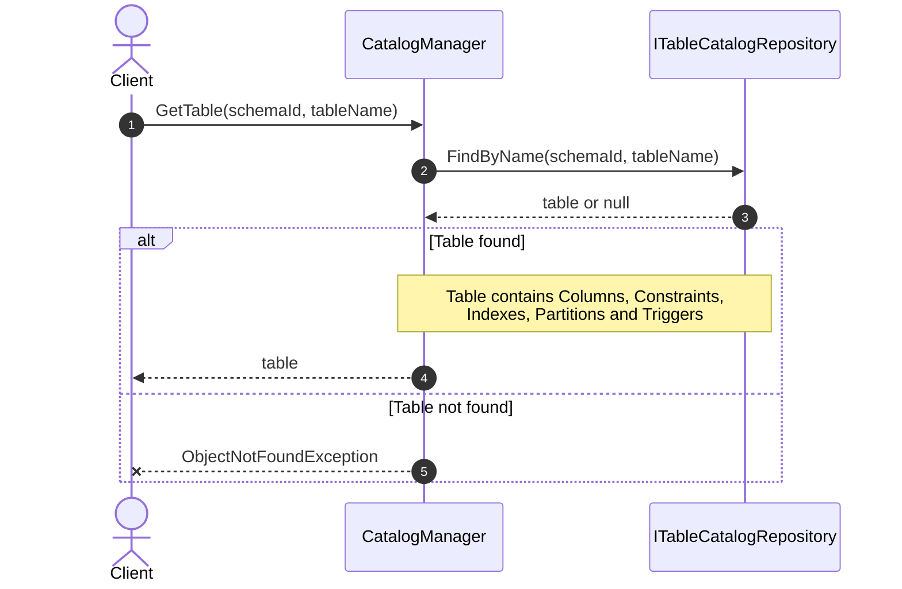
```mermaid
sequenceDiagram
    autonumber

    actor Client
    participant Catalog as CatalogManager
    participant Repo as ITableCatalogRepository

    Client->>Catalog: GetTable(schemaId, tableName)
    Catalog->>Repo: FindByName(schemaId, tableName)
    Repo-->>Catalog: table or null

    alt Table found
        Note over Repo,Catalog: Table contains Columns, Constraints,<br/>Indexes, Partitions and Triggers
        Catalog-->>Client: table
    else Table not found
        Catalog--xClient: ObjectNotFoundException
    end
```

### 9. System Initialization (Facade Pattern)

**Application:** `DbEngineFacade` groups complex startup steps for Disk, Storage, and Catalog.

**Why apply?** The Facade Pattern provides a unified, high-level interface to the complex subsystems of the database engine (Disk, Storage, Catalog, Transaction, Recovery). This simplifies the interaction for the `DatabaseServer`, which only needs to call `Start()`, `Stop()`, or `Recover()` without managing the intricate initialization order and dependencies of each internal manager.

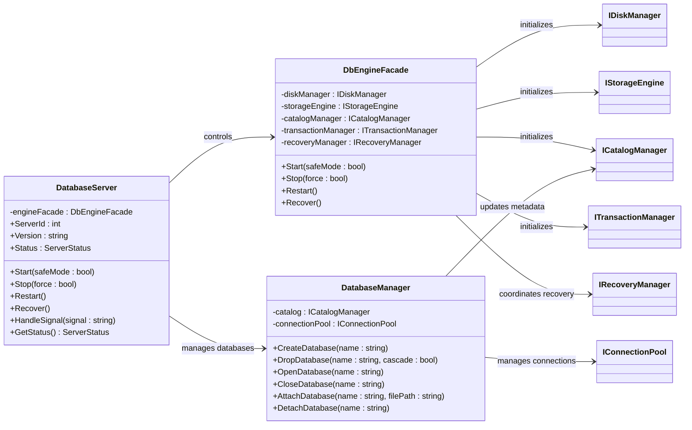
```mermaid
classDiagram
direction LR

class DbEngineFacade {
    -diskManager : IDiskManager
    -storageEngine : IStorageEngine
    -catalogManager : ICatalogManager
    -transactionManager : ITransactionManager
    -recoveryManager : IRecoveryManager
    +Start(safeMode : bool)
    +Stop(force : bool)
    +Restart()
    +Recover()
}

class DatabaseServer {
    -engineFacade : DbEngineFacade
    +ServerId : int
    +Version : string
    +Status : ServerStatus
    +Start(safeMode : bool)
    +Stop(force : bool)
    +Restart()
    +Recover()
    +HandleSignal(signal : string)
    +GetStatus() ServerStatus
}

class DatabaseManager {
    -catalog : ICatalogManager
    -connectionPool : IConnectionPool
    +CreateDatabase(name : string)
    +DropDatabase(name : string, cascade : bool)
    +OpenDatabase(name : string)
    +CloseDatabase(name : string)
    +AttachDatabase(name : string, filePath : string)
    +DetachDatabase(name : string)
}

class IDiskManager
class IStorageEngine
class ICatalogManager
class ITransactionManager
class IRecoveryManager
class IConnectionPool

DatabaseServer --> DbEngineFacade : controls
DatabaseServer --> DatabaseManager : manages databases

DbEngineFacade --> IDiskManager : initializes
DbEngineFacade --> IStorageEngine : initializes
DbEngineFacade --> ICatalogManager : initializes
DbEngineFacade --> ITransactionManager : initializes
DbEngineFacade --> IRecoveryManager : coordinates recovery

DatabaseManager --> ICatalogManager : updates metadata
DatabaseManager --> IConnectionPool : manages connections
```

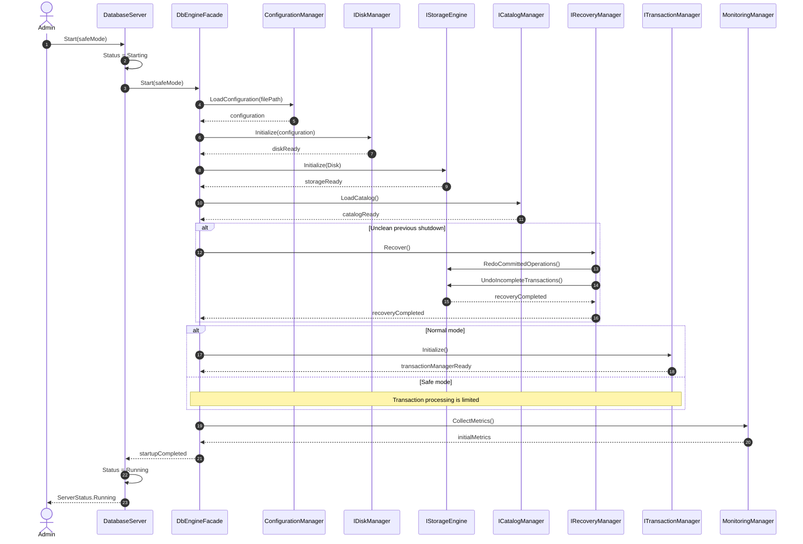
```mermaid
sequenceDiagram
    autonumber

    actor Admin
    participant Server as DatabaseServer
    participant Facade as DbEngineFacade
    participant Config as ConfigurationManager
    participant Disk as IDiskManager
    participant Storage as IStorageEngine
    participant Catalog as ICatalogManager
    participant Recovery as IRecoveryManager
    participant Tx as ITransactionManager
    participant Monitor as MonitoringManager

    Admin->>Server: Start(safeMode)
    Server->>Server: Status = Starting
    Server->>Facade: Start(safeMode)

    Facade->>Config: LoadConfiguration(filePath)
    Config-->>Facade: configuration

    Facade->>Disk: Initialize(configuration)
    Disk-->>Facade: diskReady

    Facade->>Storage: Initialize(Disk)
    Storage-->>Facade: storageReady

    Facade->>Catalog: LoadCatalog()
    Catalog-->>Facade: catalogReady

    alt Unclean previous shutdown
        Facade->>Recovery: Recover()
        Recovery->>Storage: RedoCommittedOperations()
        Recovery->>Storage: UndoIncompleteTransactions()
        Storage-->>Recovery: recoveryCompleted
        Recovery-->>Facade: recoveryCompleted
    end

    alt Normal mode
        Facade->>Tx: Initialize()
        Tx-->>Facade: transactionManagerReady
    else Safe mode
        Note over Facade,Tx: Transaction processing is limited
    end

    Facade->>Monitor: CollectMetrics()
    Monitor-->>Facade: initialMetrics

    Facade-->>Server: startupCompleted
    Server->>Server: Status = Running
    Server-->>Admin: ServerStatus.Running
```