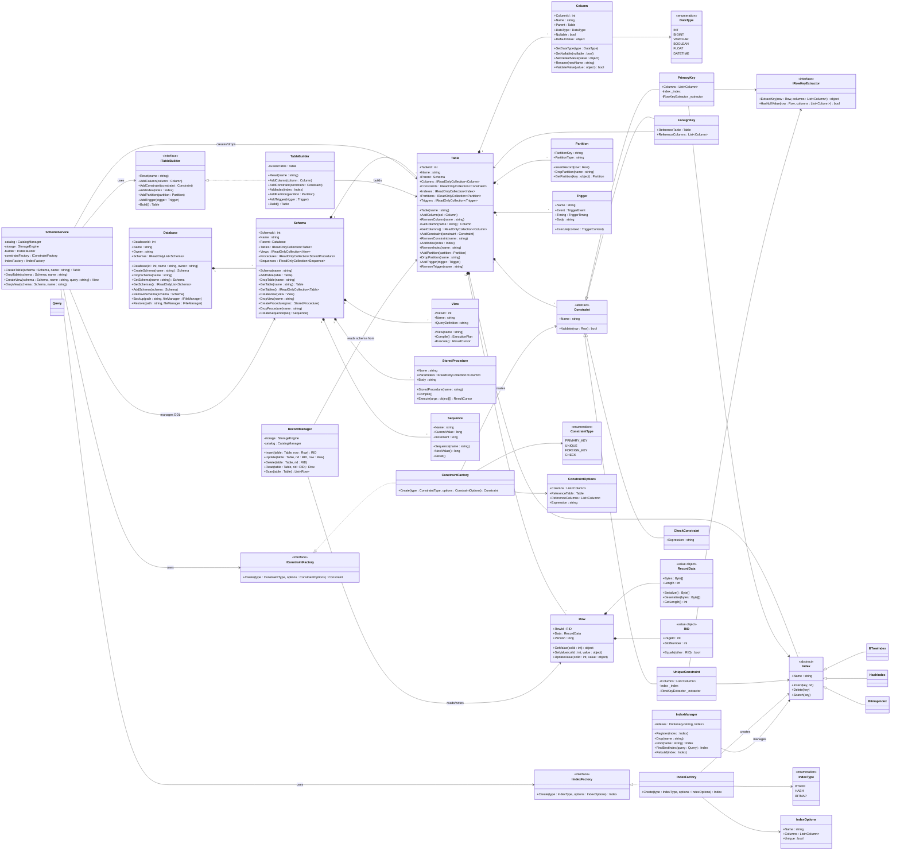
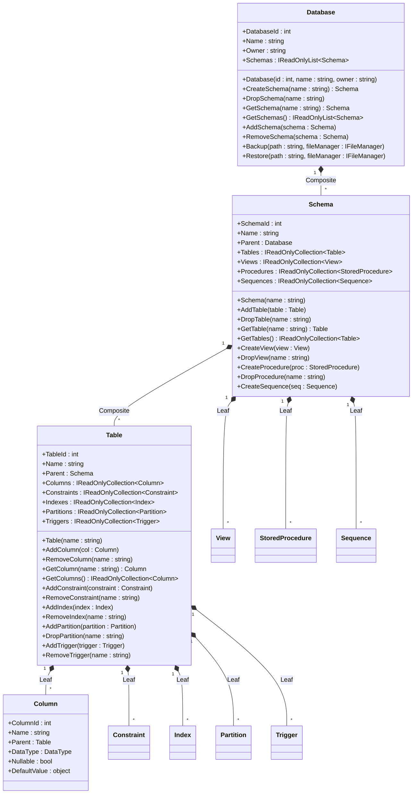
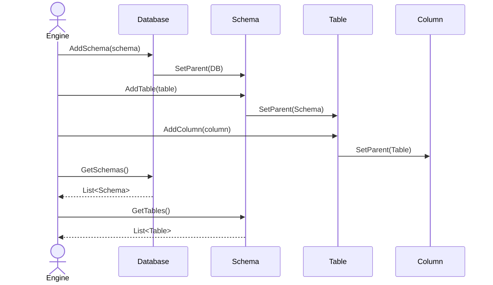
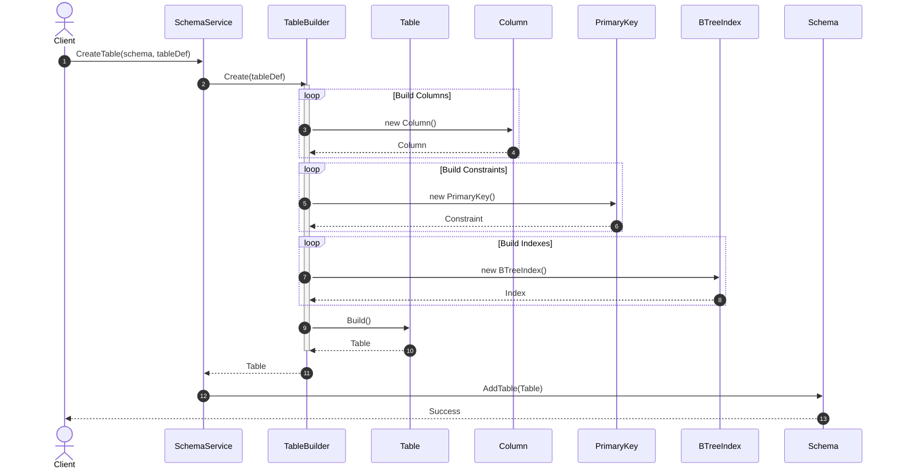
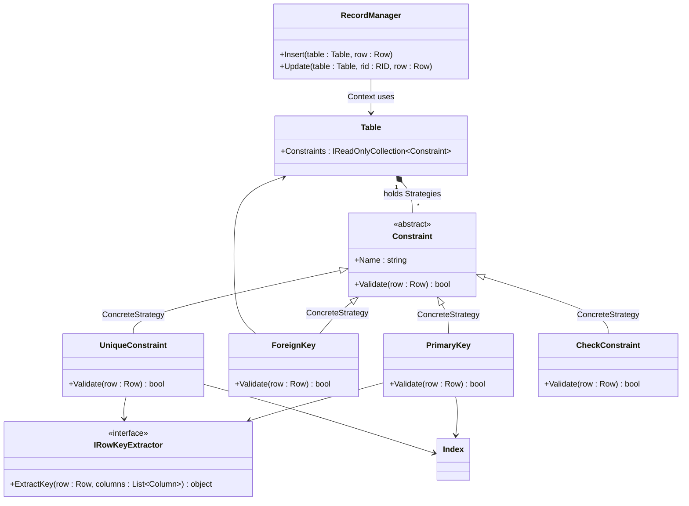
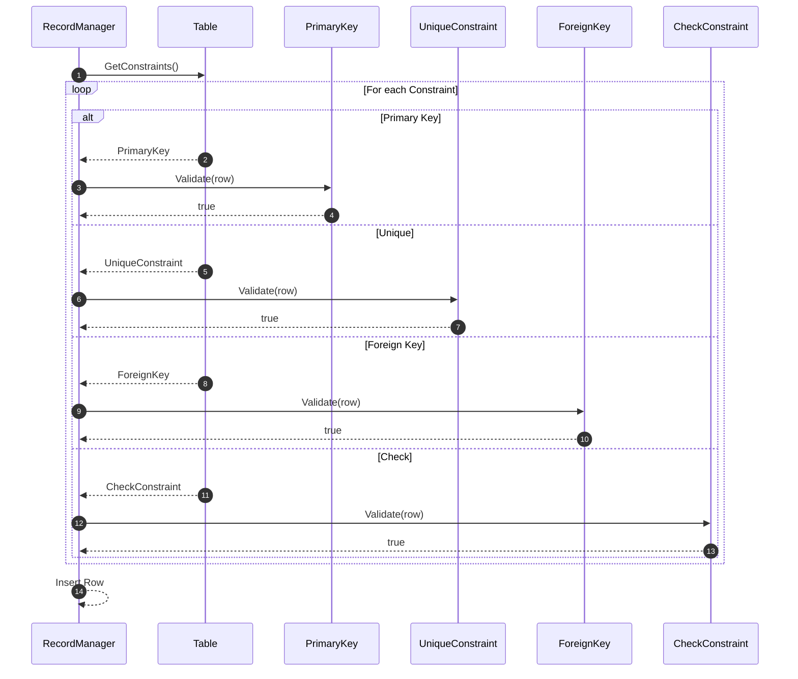
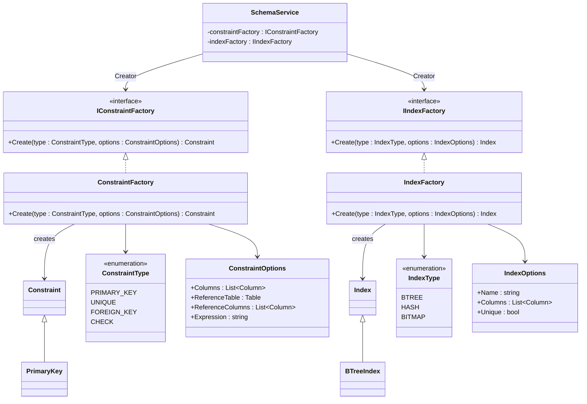
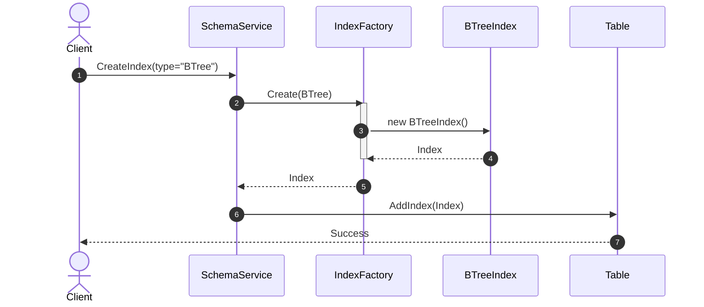

# Design Patterns in DBMS

This document outlines the Design Patterns implemented within various core components of the BBV-DBMS.

## Visual Summary

| Module | Feature | Pattern | Application |
| :--- | :--- | :--- | :--- |
| **Database & Metadata** | Hierarchy Management | **Composite** | Manages hierarchical architecture: `DatabaseComposite` → `SchemaComposite` → `TableComposite` → `ColumnLeaf`. |
| **Database & Metadata** | Metadata Initialization | **Builder** | Uses `TableDefBuilder` to set each table property instead of a long constructor. |
| **Database & Metadata** | Constraint Validation | **Strategy** | `PrimaryKeyConstraint`, `UniqueConstraint`, `ForeignKeyConstraint` implement the same interface. |
| **Database & Metadata** | Dynamic Allocation | **Factory Method** | Dynamically initializes Indexes and Constraints via `ObjectFactoryProvider` during DDL execution. |
| **Database & Metadata** | Hierarchy Traversal | **Iterator** | Traverse Schema, Table, Column. |
| **Database & Metadata** | System Utilities | **Visitor** | Backup, Export DDL, Metadata Scan, Statistics. |
| **Database & Metadata** | Data Change Reactions | **Observer** | Trigger, Index, Statistics react when data changes. |
| **Database & Metadata** | Trigger Execution | **Command** | Trigger executes actions. |
| **Database & Metadata** | DDL Coordination | **Facade / Application Service**| `SchemaService` coordinates DDL. |
| **Database Manager** | System Initialization | **Facade** | `DbEngineFacade` groups complex startup steps for Disk, Storage, and Catalog. |
| **Database Manager** | DDL Operations | **Command** | Encapsulates Database create/drop commands into `CreateDatabaseAction` for easy undo/redo or logging. |

---

## Sequence Diagrams (Database Manager & Metadata)

### 1. Hierarchy Management (Composite Pattern)

**Application:** Models the metadata tree: Database → Schema → Table → Column.

**Why apply?** Composite Pattern structures data into a tree form, providing uniform Add/Remove functions. The diagram below shows assigning objects together to form a parent-child structure, making it easy to access the entire branch (e.g., `GetSchemas()`, `GetTables()`).

### 2. Metadata Initialization (Builder Pattern)

**Application:** Initializes tables via `TableBuilder` from DDL syntax.

**Why apply?** Initializing a Table object requires many properties. `TableBuilder` helps gather parameters gradually (Columns, Primary Keys) and only creates the `TableMetadata` object in the final step, making the code coherent and readable.

### 3. Constraint Validation (Strategy Pattern)

**Application:** Evaluates Row validity based on various types of Constraints.

**Why apply?** By applying the Strategy Pattern via the `IConstraint` interface, `RecordManager` doesn't need to care about internal detailed logic (Primary Key checks for duplicates, Check evaluates expressions, Foreign Key checks reference table). It just calls `Validate(row)` and handles the polymorphic result.

### 4. Dynamic Allocation (Factory Method Pattern)

**Application:** Allocates objects like Index and Constraint automatically during DDL execution.

**Why apply?** Delegates the creation of a specific Index (BTree or Hash) to `IndexFactory`. The client doesn't need to know the internal initialization logic, just passes in the desired Index type and receives a common `IIndex` interface back.

