# Design Patterns in DBMS

This document outlines the Design Patterns implemented within various core components of the BBV-DBMS.

## Visual Summary

| Module | Feature | Pattern | Application |
| :--- | :--- | :--- | :--- |
| **Database & Metadata** | Hierarchy Management | **Composite** | Quản lý kiến trúc phân cấp: `DatabaseComposite` → `SchemaComposite` → `TableComposite` → `ColumnLeaf`. |
| **Database & Metadata** | Metadata Initialization | **Builder** | Sử dụng `TableDefBuilder` để thiết lập từng thuộc tính của bảng thay vì dùng constructor dài. |
| **Database & Metadata** | Constraint Validation | **Strategy** | `PrimaryKeyConstraint`, `UniqueConstraint`, `ForeignKeyConstraint` triển khai cùng interface. |
| **Database & Metadata** | Dynamic Allocation | **Factory Method** | Khởi tạo động các Index, Constraint thông qua `ObjectFactoryProvider` trong lúc chạy DDL. |
| **Database & Metadata** | Metadata Persistence | **Repository** | Cung cấp interface `ICatalogRepository` để lấy cấu trúc bảng mà không dính dáng đến Storage vật lý. |
| **Database & Metadata** | Fast Duplication | **Prototype** | Hỗ trợ nhân bản bảng (lệnh `CREATE TABLE LIKE`) thông qua hàm `DeepCopy()`. |
| **Database & Metadata** | Cache Invalidation | **Observer** | Dùng `CatalogEventBroker` báo cho `PlanCacheManager` biết khi có thay đổi cấu trúc để xóa cache. |
| **Database Manager** | System Initialization | **Facade** | `DbEngineFacade` gom nhóm các bước khởi động phức tạp của Disk, Storage, và Catalog. |
| **Database Manager** | DDL Operations | **Command** | Đóng gói các lệnh tạo/xóa Database thành `CreateDatabaseAction` để dễ dàng undo/redo hoặc log. |
---

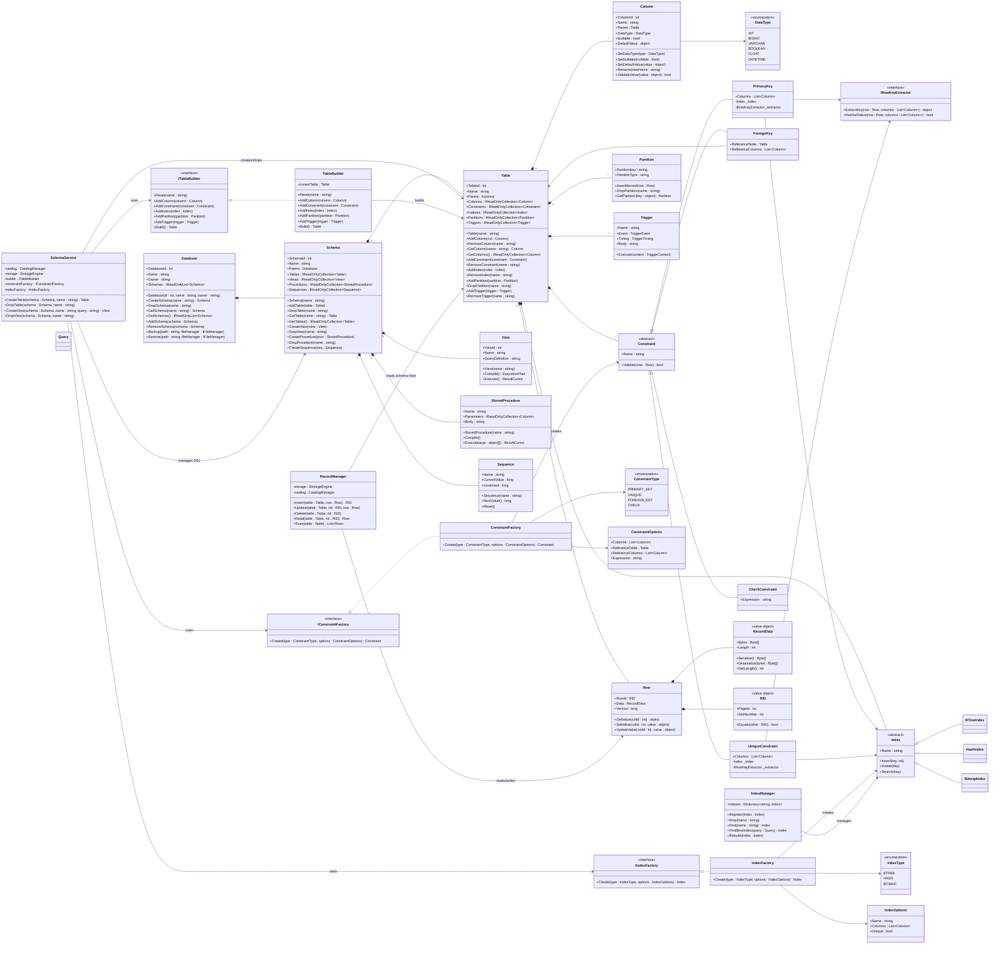

## Sequence Diagrams (Database Manager & Metadata)

### 1. Hierarchy Management (Composite Pattern)

**Application:** Mô hình hóa cây siêu dữ liệu: Database → Schema → Table → Column.

**Tại sao áp dụng?** Composite Pattern cấu trúc hoá dữ liệu thành dạng cây, cung cấp các hàm Add/Remove đồng nhất. Biểu đồ dưới đây thể hiện việc gán ghép các object lại với nhau để hình thành cấu trúc cha-con, giúp dễ dàng truy xuất toàn bộ nhánh (ví dụ: `GetSchemas()`, `GetTables()`).

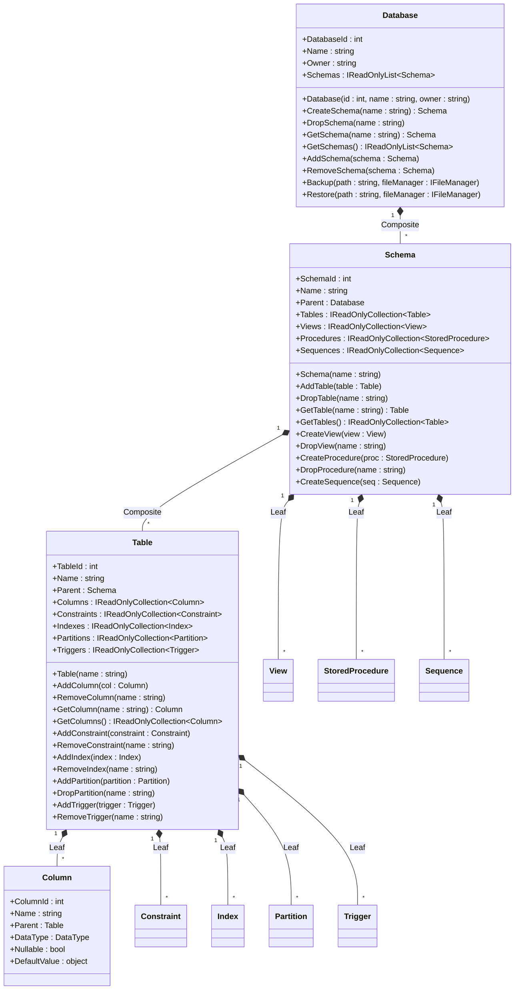

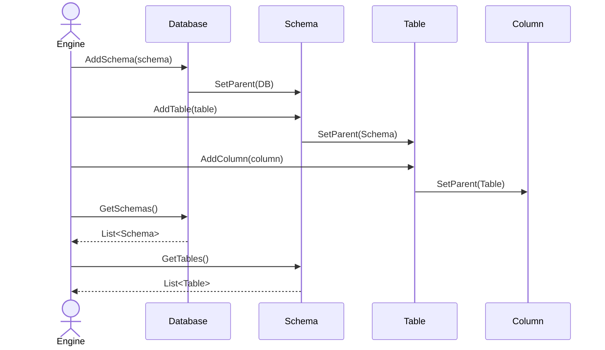

### 2. Metadata Initialization (Builder Pattern)

**Application:** Khởi tạo bảng qua `TableBuilder` từ cú pháp DDL.

**Tại sao áp dụng?** Khởi tạo một đối tượng Table cần rất nhiều thuộc tính. `TableBuilder` giúp thu thập dần dần các thông số (Cột, Khóa chính) và chỉ tạo ra object `TableMetadata` ở bước cuối cùng, giúp code mạch lạc và dễ đọc hơn.

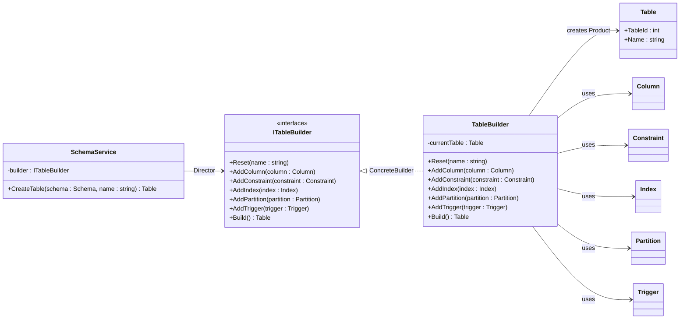

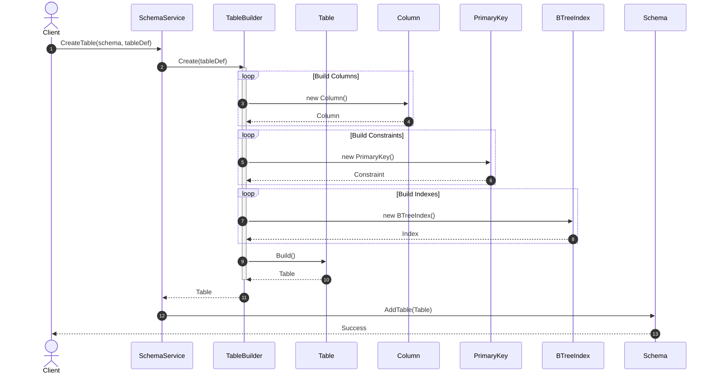

### 3. Constraint Validation (Strategy Pattern)

**Application:** Đánh giá tính hợp lệ của Row dựa trên nhiều loại Constraint khác nhau.

**Tại sao áp dụng?** Bằng cách áp dụng Strategy Pattern thông qua interface `IConstraint`, RecordManager không cần quan tâm chi tiết logic bên trong (Primary Key kiểm tra trùng lặp, Check kiểm tra biểu thức, Foreign Key kiểm tra bảng tham chiếu). Nó chỉ cần gọi `Validate(row)` và xử lý kết quả trả về đa hình.

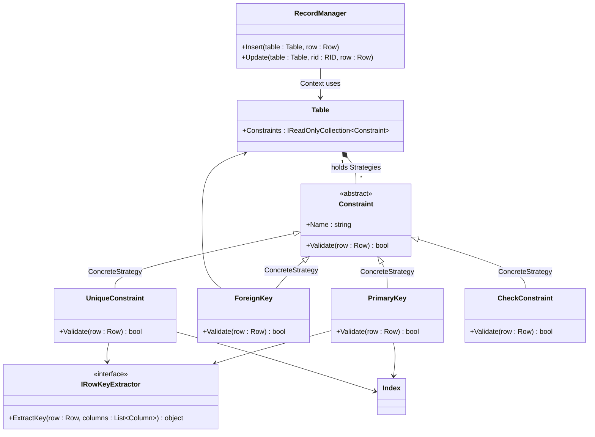

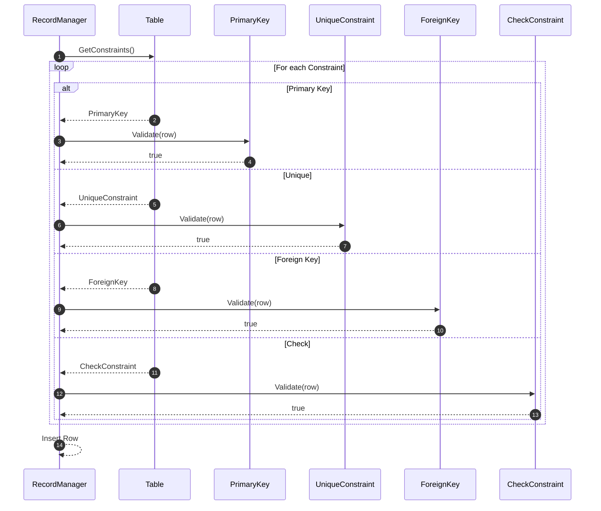

### 4. Dynamic Allocation (Factory Method Pattern)

**Application:** Phân bổ các object như Index, Constraint tự động lúc thi hành DDL.

**Tại sao áp dụng?** Giao phó việc tạo Index cụ thể (BTree hay Hash) cho `IndexFactory`. Client không cần biết logic khởi tạo bên trong, chỉ cần truyền vào loại Index mong muốn và nhận lại một interface `IIndex` chung.

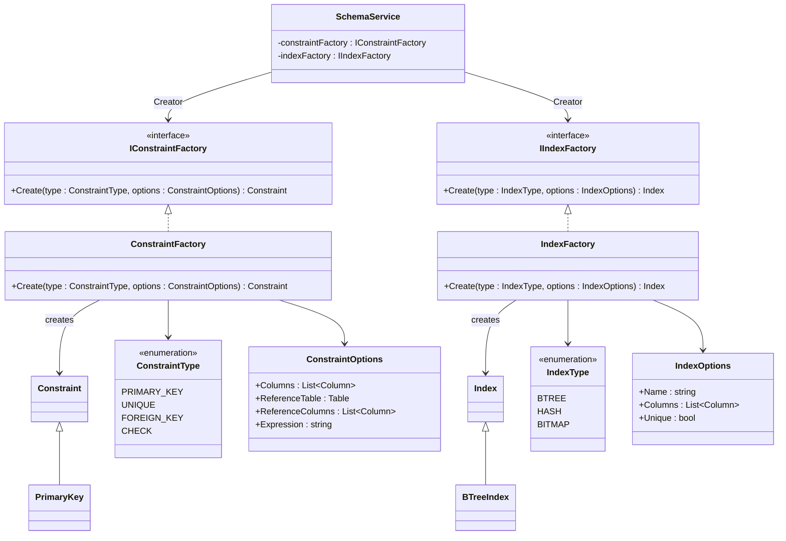

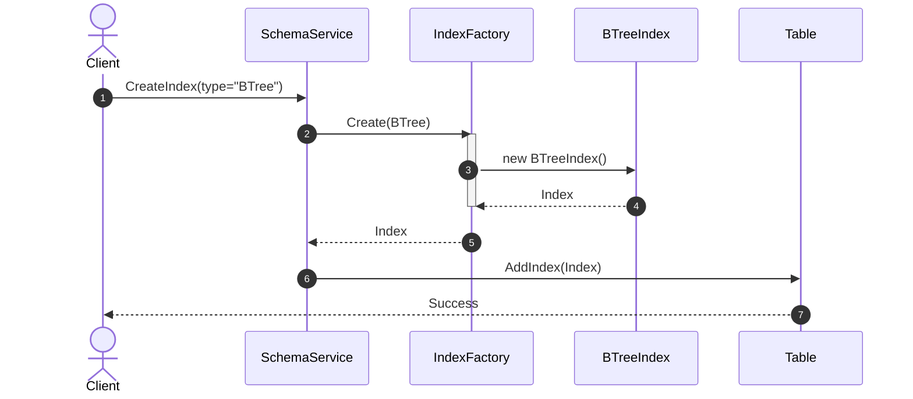

### 5. Metadata Persistence (Repository Pattern)

**Application:** Tập trung logic lưu và truy xuất cấu trúc dữ liệu.

**Tại sao áp dụng?** Cô lập các lớp Domain khỏi thư viện đọc/ghi file. Các tầng xử lý truy vấn chỉ cần yêu cầu `ICatalogRepository` trả về thông tin bảng (`TableMetadata`), mà không cần quan tâm nó được load từ hệ thống phân trang bộ nhớ bên dưới như thế nào.

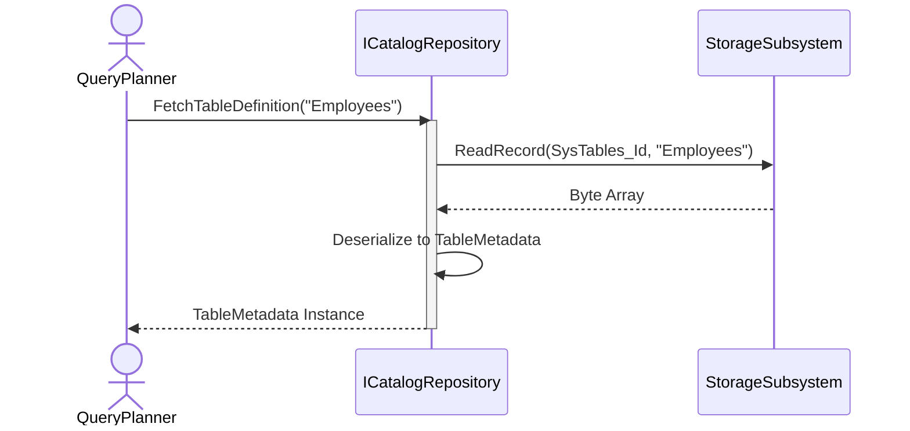

### 6. Fast Duplication (Prototype Pattern)

**Application:** Sao chép nguyên mẫu Schema hoặc Bảng.

**Tại sao áp dụng?** Trong các tác vụ như `CREATE TABLE AS SELECT...`, việc clone lại toàn bộ cấu hình của một TableMetadata hiện có qua hàm `DeepCopy()` sẽ nhanh và ít rủi ro hơn nhiều so với việc trích xuất và gán lại từng tham số thông qua Builder.

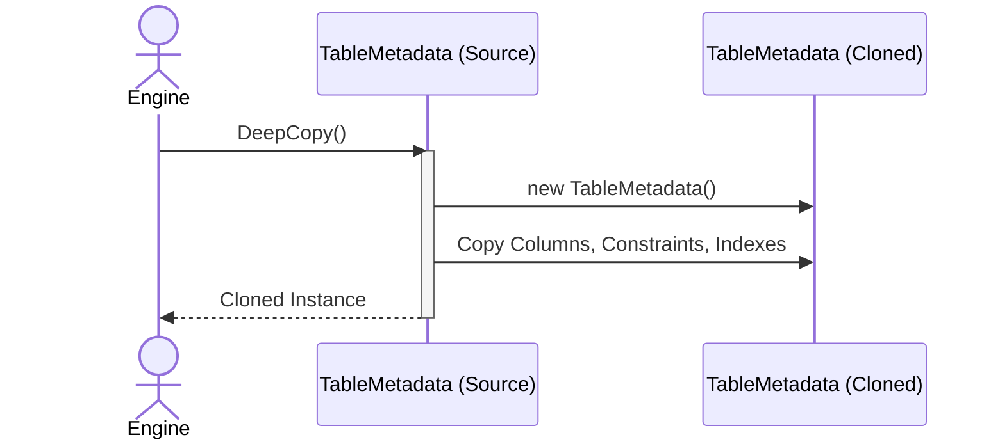

### 7. Cache Invalidation (Observer Pattern)

**Application:** Thông báo thay đổi hệ thống cấu trúc bảng.

**Tại sao áp dụng?** Thay vì service thay đổi bảng phải gọi một đống hàm clear cache, Observer Pattern cho phép các Broker phát đi event `SchemaChangedEvent`. Bất kì module nào đăng ký (như Plan Cache hay Module thống kê dữ liệu) sẽ tự bắt sự kiện và xử lý bộ đệm của nó.

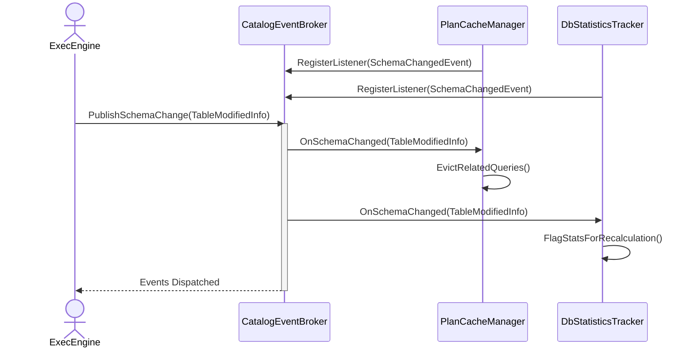

### 8. System Initialization (Facade Pattern)

**Application:** `DbEngineFacade` đóng vai trò là cửa ngõ duy nhất để khởi động hệ thống.

**Tại sao áp dụng?** Việc bật hoặc tắt một instance cơ sở dữ liệu đòi hỏi phải gọi tuần tự rất nhiều module bên dưới. Facade cung cấp một điểm truy cập duy nhất, giúp code ở client (như CLI hoặc giao diện) trở nên cực kỳ đơn giản và không bị phụ thuộc vào các module cấp thấp.

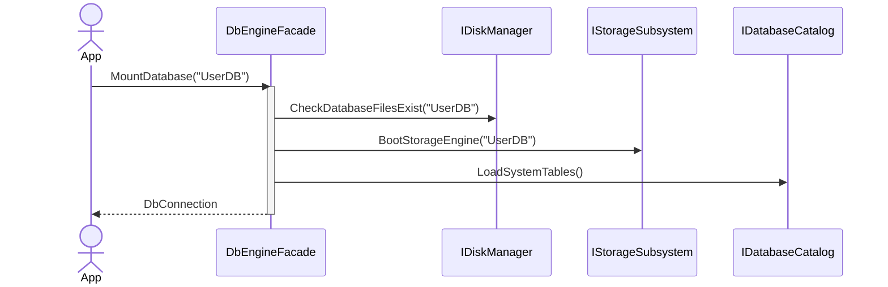

### 9. DDL Operations (Command Pattern)

**Application:** Đóng gói các lệnh thực thi cấu trúc thành các Action object.

**Tại sao áp dụng?** Thay vì viết thẳng logic tạo database trong controller, hệ thống đóng gói chúng thành `CreateDatabaseAction`. Việc này chia tách trách nhiệm rõ ràng giữa nơi nhận lệnh (Processor) và nơi thi hành, hỗ trợ tốt cho việc ghi log (WAL) hoặc khôi phục khi có lỗi.

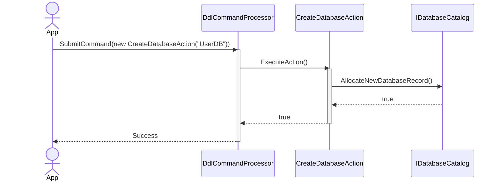