# Features and Design Pattern Follow
This document outlines the Design Patterns implemented within various core components of the BBV-DBMS.

## Visual Summary Database Object

| Priority | Module | Main Feature | Main Classes | Application | Design Pattern | Progress |
| :---: | :--- | :--- | :--- | :--- | :--- | :---: |
| 🔥 Critical | Database Object | Metadata Hierarchy | `Database`, `Schema`, `Table`, child objects | Treats Database, Schema, Table, and Column objects uniformly as nodes in a hierarchy. | **Composite** | Completed |
| 🔥 Critical | Database Object | Table Definition, Complex Table Construction | `TableDefinition`, `TableBuilder`, `TableDirector` | Separates the construction of complex Table objects from their representation. | **Builder** | Completed |
| 🔥 Critical | Database Object | Constraint Object Creation | `ConstraintFactory` | Encapsulates the instantiation logic for various types of constraints. | **Factory Method** | Completed |
| 🔥 Critical | Database Object | Constraint Validation | Constraint validators | Defines a family of validation algorithms for different constraints and makes them interchangeable. | **Strategy** | Completed |
| 🔥 Critical | Database Object | Index Object Creation | `IndexFactory` | Encapsulates the instantiation logic for different types of indexes. | **Factory Method** | Completed |
| 🔥 Critical | Database Object | Encapsulate DDL Requests | DDL commands and executor | Encapsulates DDL requests as objects, allowing for logging, queuing, and execution. | **Command** | Completed |
| 🔥 Critical | Database Object | Coordinate Create/Drop/Alter | `SchemaService`, `DatabaseService` | Provides a simplified, unified interface to the complex subsystems involved in metadata modifications. | **Facade** | Completed |
| 🔴 High | Database Object | Metadata Traversal | `CatalogIterator`, `IIterableCatalog` | Provides a way to sequentially access metadata objects without exposing their underlying representation. | **Iterator** | Completed |
| 🔴 High | Metadata Events | Cache, Statistics, Audit Reactions | Event publisher and handlers | Defines a one-to-many dependency so that when metadata changes, all dependent components are notified. | **Observer** | Completed |
| 🔴 High | Database Object | DDL Script Generation | `DdlScriptGenerator`, `CreateTableScriptGenerator`, `AlterTableScriptGenerator`, `DropTableScriptGenerator` | Defines a fixed script-generation workflow—header, body, and footer—that each DDL statement type customizes to emit valid SQL DDL output. | **Template Method** | Completed |
| 🟡 Medium | Metadata Utility | Export DDL, Dependency Scan | Visitors or traversal services | Separates metadata analysis and export algorithms from the object structure on which they operate. | **Visitor** | Completed |
| 🟡 Medium | Trigger | Execute Trigger Actions | `TriggerExecutor`, trigger actions | Encapsulates trigger actions as objects for execution. | **Command** | Not Started |


---

```mermaid
classDiagram
direction LR

%% =====================================================
%% 1. EXTERNAL PORTS
%% =====================================================

class IDdlRequestSource {
    <<Client Port>>
    +Submit(command : IDdlCommand) DdlResult
}

class IStorageObjectPort {
    <<External Port>>
    +AllocateTable(table : Table)
    +DropTable(tableId : int)
    +AllocateIndex(index : Index)
    +DropIndex(indexId : int)
}

class IMetadataTransactionPort {
    <<External Port>>
    +Begin()
    +Commit()
    +Rollback()
}

%% =====================================================
%% 2. COMPOSITE — CATALOG OBJECT HIERARCHY
%% =====================================================

class ICatalogComponent {
    <<Component / Visitable Element>>
    +Name : string
    +Accept(visitor : IMetadataVisitor)
}

class ICatalogComposite {
    <<Composite>>
    +Children : IReadOnlyCollection~ICatalogComponent~
}

ICatalogComponent <|-- ICatalogComposite

class Database {
    <<Composite>>
    +DatabaseId : int
    +Name : string
    +Owner : string
    +Schemas : IReadOnlyCollection~Schema~
    +AddSchema(schema : Schema)
    +RemoveSchema(name : string)
    +GetSchema(name : string) Schema
    +CreateSchemaIterator() ICatalogIterator~Schema~
}

class Schema {
    <<Composite>>
    +SchemaId : int
    +Name : string
    +Parent : Database
    +Tables : IReadOnlyCollection~Table~
    +Views : IReadOnlyCollection~View~
    +Procedures : IReadOnlyCollection~StoredProcedure~
    +Sequences : IReadOnlyCollection~Sequence~
    +AddTable(table : Table)
    +RemoveTable(name : string)
    +GetTable(name : string) Table
    +CreateTableIterator() ICatalogIterator~Table~
}

class Table {
    <<Composite / Product>>
    +TableId : int
    +Name : string
    +Parent : Schema
    +Columns : IReadOnlyCollection~Column~
    +Constraints : IReadOnlyCollection~Constraint~
    +Indexes : IReadOnlyCollection~Index~
    +Partitions : IReadOnlyCollection~Partition~
    +Triggers : IReadOnlyCollection~Trigger~
    +AddColumn(column : Column)
    +RemoveColumn(name : string)
    +AddConstraint(constraint : Constraint)
    +AddIndex(index : Index)
    +AddPartition(partition : Partition)
    +AddTrigger(trigger : Trigger)
    +CreateColumnIterator() ICatalogIterator~Column~
}

class Column {
    <<Leaf>>
    +ColumnId : int
    +Name : string
    +DataType : DataType
    +Nullable : bool
    +DefaultValue : object
    +Rename(newName : string)
}

class View {
    <<Leaf>>
    +ViewId : int
    +Name : string
    +QueryDefinition : string
}

class StoredProcedure {
    <<Leaf>>
    +ProcedureId : int
    +Name : string
    +Body : string
}

class Sequence {
    <<Leaf>>
    +SequenceId : int
    +Name : string
    +CurrentValue : long
    +Increment : long
    +NextValue() long
}

class Partition {
    <<Leaf>>
    +PartitionId : int
    +Name : string
    +PartitionKey : string
    +PartitionType : PartitionType
}

class Trigger {
    <<Leaf>>
    +TriggerId : int
    +Name : string
    +Event : TriggerEvent
    +Timing : TriggerTiming
    +Body : string
}

ICatalogComposite <|.. Database
ICatalogComposite <|.. Schema
ICatalogComposite <|.. Table

ICatalogComponent <|.. Column
ICatalogComponent <|.. Constraint
ICatalogComponent <|.. Index
ICatalogComponent <|.. Partition
ICatalogComponent <|.. Trigger
ICatalogComponent <|.. View
ICatalogComponent <|.. StoredProcedure
ICatalogComponent <|.. Sequence

Database "1" *-- "*" Schema : contains
Schema "1" *-- "*" Table : contains
Schema "1" *-- "*" View : contains
Schema "1" *-- "*" StoredProcedure : contains
Schema "1" *-- "*" Sequence : contains
Table "1" *-- "*" Column : contains
Table "1" *-- "*" Constraint : contains
Table "1" *-- "*" Index : contains
Table "1" *-- "*" Partition : contains
Table "1" *-- "*" Trigger : contains

Column --> DataType
Partition --> PartitionType
Trigger --> TriggerEvent
Trigger --> TriggerTiming

%% =====================================================
%% 3. STRATEGY — CONSTRAINT VALIDATION
%% =====================================================

class Constraint {
    <<Abstract Strategy / Leaf>>
    +ConstraintId : int
    +Name : string
    +Validate(context : ConstraintValidationContext) ConstraintValidationResult
}

class PrimaryKeyConstraint {
    <<Concrete Strategy>>
    +Columns : IReadOnlyCollection~Column~
}

class UniqueConstraint {
    <<Concrete Strategy>>
    +Columns : IReadOnlyCollection~Column~
}

class ForeignKeyConstraint {
    <<Concrete Strategy>>
    +Columns : IReadOnlyCollection~Column~
    +ReferenceTable : Table
    +ReferenceColumns : IReadOnlyCollection~Column~
}

class CheckConstraint {
    <<Concrete Strategy>>
    +Expression : string
}

class ConstraintValidationContext {
    <<Context Data>>
    +Table : Table
    +Values : IReadOnlyDictionary~int, object~
    +Operation : ValidationOperation
}

class ConstraintValidationResult {
    <<Result>>
    +IsValid : bool
    +Message : string
}

class IRowKeyExtractor {
    <<Collaborator>>
    +ExtractKey(values : IReadOnlyDictionary~int, object~, columns : IReadOnlyCollection~Column~) object
    +HasNullValue(values : IReadOnlyDictionary~int, object~, columns : IReadOnlyCollection~Column~) bool
}

Constraint <|-- PrimaryKeyConstraint
Constraint <|-- UniqueConstraint
Constraint <|-- ForeignKeyConstraint
Constraint <|-- CheckConstraint
Constraint --> ConstraintValidationContext : validates
Constraint --> ConstraintValidationResult : returns
ConstraintValidationContext --> Table
ConstraintValidationContext --> ValidationOperation
PrimaryKeyConstraint --> IRowKeyExtractor
UniqueConstraint --> IRowKeyExtractor
ForeignKeyConstraint --> Table : references
PrimaryKeyConstraint --> Index : checks uniqueness
UniqueConstraint --> Index : checks uniqueness

%% =====================================================
%% 4. INDEX DOMAIN OBJECTS
%% Chỉ mô tả metadata; thao tác vật lý thuộc Storage Engine.
%% =====================================================

class Index {
    <<abstract Leaf>>
    +IndexId : int
    +Name : string
    +Columns : IReadOnlyCollection~Column~
    +Unique : bool
}

class BTreeIndex
class HashIndex
class BitmapIndex

Index <|-- BTreeIndex
Index <|-- HashIndex
Index <|-- BitmapIndex
Index --> Column : indexes

%% =====================================================
%% 5. CONSTRUCTION DATA
%% =====================================================

class TableDefinition {
    <<Construction Data>>
    +Name : string
    +Columns : IReadOnlyCollection~ColumnDefinition~
    +Constraints : IReadOnlyCollection~ConstraintOptions~
    +Indexes : IReadOnlyCollection~IndexOptions~
    +Partitions : IReadOnlyCollection~PartitionOptions~
    +Triggers : IReadOnlyCollection~TriggerOptions~
    +Validate() DefinitionValidationResult
}

class ColumnDefinition {
    <<DTO>>
    +Name : string
    +DataType : DataType
    +Nullable : bool
    +DefaultValue : object
}

class ConstraintOptions {
    <<DTO>>
    +Type : ConstraintType
    +Name : string
    +Columns : IReadOnlyCollection~string~
    +ReferenceTable : string
    +ReferenceColumns : IReadOnlyCollection~string~
    +Expression : string
}

class IndexOptions {
    <<DTO>>
    +Type : IndexType
    +Name : string
    +Columns : IReadOnlyCollection~string~
    +Unique : bool
}

class PartitionOptions {
    <<DTO>>
    +Name : string
    +PartitionKey : string
    +Type : PartitionType
}

class TriggerOptions {
    <<DTO>>
    +Name : string
    +Event : TriggerEvent
    +Timing : TriggerTiming
    +Body : string
}

class DefinitionValidationResult {
    <<Result>>
    +IsValid : bool
    +Errors : IReadOnlyCollection~string~
}

TableDefinition "1" *-- "*" ColumnDefinition
TableDefinition "1" *-- "*" ConstraintOptions
TableDefinition "1" *-- "*" IndexOptions
TableDefinition "1" *-- "*" PartitionOptions
TableDefinition "1" *-- "*" TriggerOptions
TableDefinition --> DefinitionValidationResult : returns
ColumnDefinition --> DataType
ConstraintOptions --> ConstraintType
IndexOptions --> IndexType
PartitionOptions --> PartitionType
TriggerOptions --> TriggerEvent
TriggerOptions --> TriggerTiming

%% =====================================================
%% 6. BUILDER — TABLE CONSTRUCTION
%% =====================================================

class ITableBuilder {
    <<Builder>>
    +Reset()
    +SetName(name : string)
    +AddColumn(column : Column)
    +AddConstraint(constraint : Constraint)
    +AddIndex(index : Index)
    +AddPartition(partition : Partition)
    +AddTrigger(trigger : Trigger)
    +Build() Table
}

class TableBuilder {
    <<Concrete Builder>>
    -currentTable : Table
    -initialized : bool
    +Reset()
    +SetName(name : string)
    +AddColumn(column : Column)
    +AddConstraint(constraint : Constraint)
    +AddIndex(index : Index)
    +AddPartition(partition : Partition)
    +AddTrigger(trigger : Trigger)
    +Build() Table
    -EnsureInitialized()
    -ValidateBeforeBuild()
}

class TableDirector {
    <<Director>>
    -builder : ITableBuilder
    -constraintFactory : IConstraintFactory
    -indexFactory : IIndexFactory
    +Construct(definition : TableDefinition) Table
    -CreateColumn(definition : ColumnDefinition) Column
    -CreatePartition(options : PartitionOptions) Partition
    -CreateTrigger(options : TriggerOptions) Trigger
    -CreateBuildContext(tableName : string, columns : IReadOnlyCollection~Column~) TableBuildContext
}

class TableBuildContext {
    <<Build Context>>
    +TableName : string
    +Columns : IReadOnlyCollection~Column~
    +FindColumn(name : string) Column
}

ITableBuilder <|.. TableBuilder
TableDirector --> ITableBuilder : directs
TableDirector --> IConstraintFactory : creates constraints
TableDirector --> IIndexFactory : creates indexes
TableDirector --> TableDefinition : reads
TableDirector --> ColumnDefinition : creates columns
TableDirector --> PartitionOptions : creates partitions
TableDirector --> TriggerOptions : creates triggers
TableDirector --> TableBuildContext : creates
TableBuilder --> Table : builds
TableBuilder --> Column : adds
TableBuilder --> Constraint : adds
TableBuilder --> Index : adds
TableBuilder --> Partition : adds
TableBuilder --> Trigger : adds
TableBuildContext --> Column : resolves

%% =====================================================
%% 7. FACTORY METHOD — DYNAMIC OBJECT CREATION
%% =====================================================

class IConstraintFactory {
    <<Factory>>
    +Create(options : ConstraintOptions, context : TableBuildContext) Constraint
}

class ConstraintFactory {
    <<Concrete Factory>>
    +Create(options : ConstraintOptions, context : TableBuildContext) Constraint
}

class IIndexFactory {
    <<Factory>>
    +Create(options : IndexOptions, context : TableBuildContext) Index
}

class IndexFactory {
    <<Concrete Factory>>
    +Create(options : IndexOptions, context : TableBuildContext) Index
}

IConstraintFactory <|.. ConstraintFactory
IIndexFactory <|.. IndexFactory
IConstraintFactory --> ConstraintOptions : reads
IConstraintFactory --> TableBuildContext : resolves columns
IConstraintFactory --> Constraint : creates
IIndexFactory --> IndexOptions : reads
IIndexFactory --> TableBuildContext : resolves columns
IIndexFactory --> Index : creates

%% =====================================================
%% 8. FACADE — APPLICATION ENTRY POINT
%% Facade chỉ điều phối domain và subsystem.
%% Transaction workflow thuộc DdlCommandTemplate.
%% =====================================================

class IDatabaseService {
    <<Facade Interface>>
    +CreateSchema(database : Database, name : string) Schema
    +DropSchema(database : Database, name : string, cascade : bool)
    +RenameSchema(database : Database, oldName : string, newName : string)
}

class DatabaseService {
    <<Facade>>
    -catalog : ICatalogManager
}

class ISchemaService {
    <<Facade Interface>>
    +CreateTable(schema : Schema, definition : TableDefinition) Table
    +DropTable(schema : Schema, name : string, cascade : bool)
    +AlterTable(table : Table, operation : TableAlterOperation)
    +CreateView(schema : Schema, definition : ViewDefinition) View
    +CreateProcedure(schema : Schema, definition : ProcedureDefinition) StoredProcedure
    +CreateSequence(schema : Schema, definition : SequenceDefinition) Sequence
}

class SchemaService {
    <<Facade>>
    -catalog : ICatalogManager
    -tableDirector : TableDirector
    -storage : IStorageObjectPort
}

IDatabaseService <|.. DatabaseService
ISchemaService <|.. SchemaService

DatabaseService --> ICatalogManager : coordinates metadata
DatabaseService --> Database : manages

SchemaService --> ICatalogManager : coordinates metadata
SchemaService --> TableDirector : builds tables
SchemaService --> IStorageObjectPort : coordinates storage
SchemaService --> Schema : manages

%% =====================================================
%% 9. COMMAND — DDL EXECUTION
%% Command đóng gói yêu cầu DDL thành các object độc lập.
%% =====================================================


class IDdlCommand {
    <<Command>>
    +Execute() DdlResult
}

class DdlCommandTemplate {
    <<Abstract Command>>

    #catalog : ICatalogManager
    #transaction : IMetadataTransactionPort
    #eventCollector : IMetadataEventCollector
    #eventDispatcher : MetadataEventCommitDispatcher
    #context : MetadataChangeContext
    #affectedObject : ICatalogComponent

    +Execute() DdlResult
    #PersistMetadata(component : ICatalogComponent)
    #RecordEvent(event : MetadataEvent)
    #CreateSuccessResult(component : ICatalogComponent) DdlResult
    #CreateFailureResult(message : string) DdlResult
}

class CreateSchemaCommand {
    <<Concrete Command>>
    -receiver : IDatabaseService
    -database : Database
    -schemaName : string
    +Execute() DdlResult
}

class CreateTableCommand {
    <<Concrete Command>>
    -receiver : ISchemaService
    -schema : Schema
    -definition : TableDefinition
    +Execute() DdlResult
}

class AlterTableCommand {
    <<Concrete Command>>
    -receiver : ISchemaService
    -table : Table
    -operation : TableAlterOperation
    +Execute() DdlResult
}

class DropTableCommand {
    <<Concrete Command>>
    -receiver : ISchemaService
    -schema : Schema
    -tableName : string
    -cascade : bool
    +Execute() DdlResult
}

class IDdlCommandExecutor {
    <<Invoker Interface>>
    +Execute(command : IDdlCommand) DdlResult
}

class DdlCommandExecutor {
    <<Invoker>>
    +Execute(command : IDdlCommand) DdlResult
}

class DdlResult {
    <<Result>>
    +Success : bool
    +Message : string
    +AffectedObject : ICatalogComponent
}

IDdlCommand <|.. DdlCommandTemplate

DdlCommandTemplate <|-- CreateSchemaCommand
DdlCommandTemplate <|-- CreateTableCommand
DdlCommandTemplate <|-- AlterTableCommand
DdlCommandTemplate <|-- DropTableCommand

IDdlCommandExecutor <|.. DdlCommandExecutor
IDdlCommandExecutor --> IDdlCommand : invokes
IDdlRequestSource --> IDdlCommandExecutor : submits

DdlCommandTemplate --> ICatalogManager : persists metadata
DdlCommandTemplate --> IMetadataTransactionPort : controls transaction
DdlCommandTemplate --> IMetadataEventCollector : records events
DdlCommandTemplate --> MetadataEventCommitDispatcher : dispatches after commit
DdlCommandTemplate --> MetadataChangeContext : uses
DdlCommandTemplate --> MetadataEvent : creates
DdlCommandTemplate --> ICatalogComponent : processes
DdlCommandTemplate --> DdlResult : returns

CreateSchemaCommand --> IDatabaseService : receiver
CreateSchemaCommand --> Database : target

CreateTableCommand --> ISchemaService : receiver
CreateTableCommand --> Schema : target
CreateTableCommand --> TableDefinition : carries

AlterTableCommand --> ISchemaService : receiver
AlterTableCommand --> Table : target
AlterTableCommand --> TableAlterOperation : carries

DropTableCommand --> ISchemaService : receiver
DropTableCommand --> Schema : target

DdlResult --> ICatalogComponent : affected object

%% =====================================================
%% 10. CATALOG COORDINATION
%% Không biểu diễn Repository Pattern hoặc persistence implementation.
%% =====================================================

class ICatalogManager {
    <<Subsystem Interface>>
    +Register(component : ICatalogComponent, context : MetadataChangeContext)
    +Update(component : ICatalogComponent, context : MetadataChangeContext)
    +Remove(component : ICatalogComponent, context : MetadataChangeContext)
    +GetDatabase(name : string) Database
    +GetSchema(databaseId : int, name : string) Schema
    +GetTable(schemaId : int, name : string) Table
    +ObjectExists(parent : ICatalogComposite, name : string) bool
}

class CatalogManager {
    <<Subsystem>>
    +Register(component : ICatalogComponent, context : MetadataChangeContext)
    +Update(component : ICatalogComponent, context : MetadataChangeContext)
    +Remove(component : ICatalogComponent, context : MetadataChangeContext)
    +GetDatabase(name : string) Database
    +GetSchema(databaseId : int, name : string) Schema
    +GetTable(schemaId : int, name : string) Table
    +ObjectExists(parent : ICatalogComposite, name : string) bool
}

ICatalogManager <|.. CatalogManager
ICatalogManager --> ICatalogComponent : manages
ICatalogManager --> ICatalogComposite : searches

%% =====================================================
%% 11. OBSERVER — METADATA EVENTS
%% =====================================================

class MetadataChangeContext {
    <<Event Context>>
    +Actor : string
    +SessionId : string
    +TransactionId : string
    +Timestamp : DateTime
}

class MetadataEvent {
    <<Event>>
    +EventId : Guid
    +EventType : MetadataEventType
    +ObjectName : string
    +Context : MetadataChangeContext
    +PreviousSnapshot : MetadataSnapshot
    +CurrentSnapshot : MetadataSnapshot
}

class MetadataSnapshot {
    <<Event Data>>
    +Properties : IReadOnlyDictionary~string, object~
}

class IMetadataEventCollector {
    <<Transactional Event Collector>>
    +Add(event : MetadataEvent)
    +GetPendingEvents() IReadOnlyCollection~MetadataEvent~
    +Clear()
}

class MetadataEventCollector {
    <<Concrete Event Collector>>
    -pendingEvents : List~MetadataEvent~
    +Add(event : MetadataEvent)
    +GetPendingEvents() IReadOnlyCollection~MetadataEvent~
    +Clear()
}

class IMetadataEventPublisher {
    <<Subject>>
    +Subscribe(observer : IMetadataObserver)
    +Unsubscribe(observer : IMetadataObserver)
    +Publish(event : MetadataEvent)
}

class MetadataEventPublisher {
    <<Concrete Subject>>
    -observers : List~IMetadataObserver~
    +Subscribe(observer : IMetadataObserver)
    +Unsubscribe(observer : IMetadataObserver)
    +Publish(event : MetadataEvent)
}

class IMetadataObserver {
    <<Observer>>
    +OnMetadataChanged(event : MetadataEvent)
}

class MetadataEventCommitDispatcher {
    <<Commit Dispatcher>>
    -collector : IMetadataEventCollector
    -publisher : IMetadataEventPublisher
    +DispatchCommittedEvents()
    +DiscardRolledBackEvents()
}

class CatalogCacheObserver {
    <<Concrete Observer>>
    -cache : ICatalogCache
    +OnMetadataChanged(event : MetadataEvent)
}

class MetadataStatisticsObserver {
    <<Concrete Observer>>
    -statisticsStore : IMetadataStatisticsStore
    +OnMetadataChanged(event : MetadataEvent)
}

class MetadataAuditObserver {
    <<Concrete Observer>>
    -auditStore : IMetadataAuditStore
    +OnMetadataChanged(event : MetadataEvent)
}

class ICatalogCache {
    <<Cache Port>>
    +Get(name : string) ICatalogComponent
    +Set(component : ICatalogComponent)
    +Remove(name : string)
    +InvalidateChildren(parentName : string)
}

class IMetadataStatisticsStore {
    <<Statistics Port>>
    +IncrementObjectCount()
    +DecrementObjectCount()
    +RecordModification(timestamp : DateTime)
}

class IMetadataAuditStore {
    <<Audit Port>>
    +Append(event : MetadataEvent)
}

IMetadataEventCollector <|.. MetadataEventCollector
IMetadataEventPublisher <|.. MetadataEventPublisher
IMetadataObserver <|.. CatalogCacheObserver
IMetadataObserver <|.. MetadataStatisticsObserver
IMetadataObserver <|.. MetadataAuditObserver
MetadataEventCollector o-- "*" MetadataEvent : pending
MetadataEventCommitDispatcher --> IMetadataEventCollector : reads or clears
MetadataEventCommitDispatcher --> IMetadataEventPublisher : publishes after commit
MetadataEventPublisher o-- "*" IMetadataObserver : notifies
MetadataEventPublisher --> MetadataEvent : publishes
IMetadataObserver --> MetadataEvent : receives
CatalogCacheObserver --> ICatalogCache
MetadataStatisticsObserver --> IMetadataStatisticsStore
MetadataAuditObserver --> IMetadataAuditStore
MetadataEvent --> MetadataEventType
MetadataEvent --> MetadataChangeContext
MetadataEvent --> MetadataSnapshot
ICatalogCache --> ICatalogComponent : caches
IMetadataAuditStore --> MetadataEvent : stores

%% =====================================================
%% 12. ITERATOR — METADATA TRAVERSAL
%% =====================================================

class ICatalogIterator~T~ {
    <<Iterator>>
    +MoveNext() bool
    +Current : T
}

class CatalogIterator~T~ {
    <<Concrete Iterator>>
    -items : IReadOnlyList~T~
    -position : int
    +MoveNext() bool
    +Current : T
}

class CatalogTraversalService {
    <<Iterator Client>>
    +TraverseDatabase(database : Database)
    +TraverseSchema(schema : Schema)
    +TraverseTable(table : Table)
}

ICatalogIterator~T~ <|.. CatalogIterator~T~
Database --> ICatalogIterator~Schema~ : creates
Schema --> ICatalogIterator~Table~ : creates
Table --> ICatalogIterator~Column~ : creates
CatalogTraversalService --> Database
CatalogTraversalService --> Schema
CatalogTraversalService --> Table

%% =====================================================
%% 13. VISITOR — METADATA UTILITY
%% Adds metadata operations without modifying catalog objects.
%% =====================================================

class IMetadataVisitor {
    <<Visitor>>
    +VisitDatabase(database : Database)
    +VisitSchema(schema : Schema)
    +VisitTable(table : Table)
    +VisitColumn(column : Column)
    +VisitConstraint(constraint : Constraint)
    +VisitIndex(index : Index)
    +VisitPartition(partition : Partition)
    +VisitTrigger(trigger : Trigger)
    +VisitView(view : View)
    +VisitStoredProcedure(procedure : StoredProcedure)
    +VisitSequence(sequence : Sequence)
}

class DdlExportVisitor {
    <<Concrete Visitor>>
    -ddl : StringBuilder
    +VisitDatabase(database : Database)
    +VisitSchema(schema : Schema)
    +VisitTable(table : Table)
    +VisitColumn(column : Column)
    +VisitConstraint(constraint : Constraint)
    +VisitIndex(index : Index)
    +VisitPartition(partition : Partition)
    +VisitTrigger(trigger : Trigger)
    +VisitView(view : View)
    +VisitStoredProcedure(procedure : StoredProcedure)
    +VisitSequence(sequence : Sequence)
    +GetResult() string
}

class DependencyScanVisitor {
    <<Concrete Visitor>>
    -dependencies : List~MetadataDependency~
    +VisitDatabase(database : Database)
    +VisitSchema(schema : Schema)
    +VisitTable(table : Table)
    +VisitColumn(column : Column)
    +VisitConstraint(constraint : Constraint)
    +VisitIndex(index : Index)
    +VisitPartition(partition : Partition)
    +VisitTrigger(trigger : Trigger)
    +VisitView(view : View)
    +VisitStoredProcedure(procedure : StoredProcedure)
    +VisitSequence(sequence : Sequence)
    +GetDependencies() IReadOnlyCollection~MetadataDependency~
}

class MetadataDependency {
    <<Visitor Result>>
    +SourceName : string
    +TargetName : string
    +DependencyType : MetadataDependencyType
}

IMetadataVisitor <|.. DdlExportVisitor
IMetadataVisitor <|.. DependencyScanVisitor

ICatalogComponent ..> IMetadataVisitor : accepts
DdlExportVisitor --> ICatalogComponent : visits
DependencyScanVisitor --> ICatalogComponent : scans
DependencyScanVisitor --> MetadataDependency : creates
MetadataDependency --> MetadataDependencyType

%% =====================================================
%% 14. TEMPLATE METHOD — DDL SCRIPT GENERATION
%% Defines a fixed Generate() skeleton; subclasses customize
%% BuildHeader() and BuildBody() per DDL object type.
%% =====================================================

class DdlScriptGenerator {
    <<Abstract Template>>
    +Generate() string
    #BuildHeader() string*
    #BuildBody() string*
    #BuildFooter() string
}

class CreateTableScriptGenerator {
    <<Concrete Template>>
    -table : Table
    #BuildHeader() string
    #BuildBody() string
}

class AlterTableScriptGenerator {
    <<Concrete Template>>
    -table : Table
    -operation : TableAlterOperation
    #BuildHeader() string
    #BuildBody() string
}

class DropTableScriptGenerator {
    <<Concrete Template>>
    -tableName : string
    -cascade : bool
    #BuildHeader() string
    #BuildBody() string
}

class CreateSchemaScriptGenerator {
    <<Concrete Template>>
    -schema : Schema
    #BuildHeader() string
    #BuildBody() string
}

DdlScriptGenerator <|-- CreateTableScriptGenerator
DdlScriptGenerator <|-- AlterTableScriptGenerator
DdlScriptGenerator <|-- DropTableScriptGenerator
DdlScriptGenerator <|-- CreateSchemaScriptGenerator

CreateTableScriptGenerator --> Table : reads
AlterTableScriptGenerator --> Table : reads
AlterTableScriptGenerator --> TableAlterOperation : reads
DropTableScriptGenerator --> Schema : references

%% =====================================================
%% 15. SUPPORTING TYPES
%% =====================================================

class TableAlterOperation {
    <<Command Data>>
    +Type : TableAlterType
    +Payload : object
}

class ViewDefinition {
    <<DTO>>
    +Name : string
    +QueryDefinition : string
}

class ProcedureDefinition {
    <<DTO>>
    +Name : string
    +Body : string
}

class SequenceDefinition {
    <<DTO>>
    +Name : string
    +StartValue : long
    +Increment : long
}

class DataType {
    <<enumeration>>
    INT
    BIGINT
    VARCHAR
    BOOLEAN
    FLOAT
    DECIMAL
    DATETIME
}

class ConstraintType {
    <<enumeration>>
    PRIMARY_KEY
    UNIQUE
    FOREIGN_KEY
    CHECK
}

class IndexType {
    <<enumeration>>
    BTREE
    HASH
    BITMAP
}

class PartitionType {
    <<enumeration>>
    RANGE
    LIST
    HASH
}

class TriggerEvent {
    <<enumeration>>
    INSERT
    UPDATE
    DELETE
}

class TriggerTiming {
    <<enumeration>>
    BEFORE
    AFTER
    INSTEAD_OF
}

class ValidationOperation {
    <<enumeration>>
    INSERT
    UPDATE
}

class TableAlterType {
    <<enumeration>>
    ADD_COLUMN
    DROP_COLUMN
    ADD_CONSTRAINT
    DROP_CONSTRAINT
    ADD_INDEX
    DROP_INDEX
    RENAME
}

class MetadataEventType {
    <<enumeration>>
    CREATED
    UPDATED
    RENAMED
    REMOVED
}

class MetadataDependencyType {
    <<enumeration>>
    CONTAINS
    REFERENCES
    DEPENDS_ON
    INDEXES
    TRIGGERS
}

TableAlterOperation --> TableAlterType
SchemaService --> TableAlterOperation
SchemaService --> ViewDefinition
SchemaService --> ProcedureDefinition
SchemaService --> SequenceDefinition
```

## Visual Summary Database Server & Database Lifecycle

| Priority | Module | Main Feature | Main Classes | Application | Design Pattern | Progress |
| :---: | :--- | :--- | :--- | :--- | :--- | :---: |
| 🔥 Critical | Server Management | Server Lifecycle | `DatabaseServer` | Provides a unified interface for starting, stopping, restarting, and recovering the database server. | **Facade** | Completed |
| 🔥 Critical | Server Management | Server State Management | `DatabaseServer`, `IServerState` | Encapsulates behaviors for Stopped, Running, Recovering, and Failed states. | **State** | Completed |
| 🔴 High | Database Management | Database Creation | `IDatabaseFactory`, `DatabaseFactory` | Centralizes the construction and initialization of database objects. | **Factory Method** | Completed |
| 🔴 High | Database Management | Global Database Management | `DatabaseManager` | Ensures that only one database manager coordinates database lifecycle operations, catalog metadata, and database connections within the server process. | **Singleton** | Completed |
| 🔴 High | Database Management | Database Operations | `IDatabaseCommand`, `CreateDatabaseCommand`, `DropDatabaseCommand`, `RenameDatabaseCommand` | Encapsulates database creation, deletion, and renaming requests as command objects, enabling centralized execution, auditing, logging, retrying, scheduling, and operation history. | **Command** | Completed |
| 🟡 Medium | Database Management | Database State | `Database`, `IDatabaseState` | Controls database behavior in Online, Offline, ReadOnly, and Restoring states. | **State** | Not Started |
| 🟡 Medium | Configuration | Configuration Loading | `ConfigurationManager`, `IConfigurationLoader` | Supports loading configuration from JSON, XML, environment variables, or command-line sources. | **Strategy** | Not Started |
| 🟡 Medium | Monitoring | Metrics Collection | `MonitoringManager`, `IMetricCollector` | Separates CPU, memory, query, transaction, and connection metric collection. | **Strategy** | Not Started |
| 🟡 Medium | Monitoring | Runtime Event Monitoring | `MonitoringManager`, event publishers | Receives query, transaction, connection, and error events from server components. | **Observer** | Not Started |
| 🟡 Medium | Configuration | Dynamic Configuration | `ConfigurationManager`, configuration observers | Notifies dependent components when configuration values change. | **Observer** | Not Started |
| 🟢 Low | Monitoring | Metrics Export | `PrometheusMetricsAdapter`, `OpenTelemetryAdapter` | Converts internal server metrics into external monitoring formats. | **Adapter** | Not Started |

## Visual Summary Query Processor
| Priority | Module | Main Feature | Main Classes | Application | Design Pattern | Progress |
| :---: | :--- | :--- | :--- | :--- | :--- | :---: |
| 🔥 Critical | Query Processing | SQL Parsing | `SQLParser`, `Lexer`, `ASTNode` | Parses SQL grammar and represents SQL statements as an abstract syntax tree. | **Interpreter** | Completed |
| 🔥 Critical | Query Optimization | Optimization Algorithm | `QueryOptimizer`, `IOptimizationStrategy` | Allows rule-based, cost-based, and heuristic optimization algorithms to be selected independently. | **Strategy** | Not Started |
| 🔴 High | Query Optimization | Optimization Rules | `IOptimizationRule`, `OptimizationRulePipeline`, concrete rules | Applies predicate pushdown, projection pruning, constant folding, and other transformations sequentially until the logical plan reaches a stable form. | **Chain of Responsibility** | Completed |
| 🔴 High | Query Processing | Query Plan Structure | `PlanOperator`, logical and physical operators | Represents AST and query plans as tree structures where leaf and composite operators are treated uniformly. | **Composite** | Not Started |
| 🔴 High | Query Execution | Streaming Execution | `IPhysicalOperator`, `ResultCursor` | Produces rows incrementally through `Open`, `Next`, and `Close` operations. | **Iterator** | Not Started |
| 🔴 High | Query Processing | Unified Query API | `QueryProcessor` | Provides one interface for parsing, binding, optimizing, and executing SQL queries. | **Facade** | Not Started |
| 🔴 High | Query Processing | Plan Traversal | `IPlanVisitor`, AST and plan operators | Traverses AST and plan trees for binding, validation, cost calculation, and explain-plan generation. | **Visitor** | Not Started |
| 🟡 Medium | Query Planning | Physical Operator Creation | `PhysicalOperatorFactory` | Creates scan, join, filter, sort, and aggregate physical operators based on optimizer decisions. | **Factory Method** | Not Started |
| 🟡 Medium | Query Processing | Standard Query Workflow | `QueryProcessingTemplate` | Defines the fixed parsing, binding, optimization, execution, and cleanup workflow. | **Template Method** | Not Started |
| 🟡 Medium | Statistics | Statistics Invalidation | `StatisticsManager`, data-change publishers | Invalidates or refreshes table statistics when underlying data or indexes change. | **Observer** | Not Started |

## Visual Summary Storage Engine

| Priority | Module | Main Feature | Main Classes | Application | Design Pattern | Progress |
| :---: | :--- | :--- | :--- | :--- | :--- | :---: |
| 🔥 Critical | Buffer Management | Cached Page Access | `IPageStore`, `BufferPoolProxy`, `DiskPageStore`, `BufferFrame` | Provides the same page-access interface as disk storage, serves memory-resident pages on cache hits, and delegates cache misses or flushes to the underlying disk page store. | **Proxy** | Completed |
| 🔥 Critical | Storage Engine | Unified Storage Access | `StorageEngine`, `BufferPool`, `FileManager`, `WALManager` | Provides a unified interface for page allocation, reading, writing, caching, logging, and recovery. | **Facade** | Not Started |
| 🔥 Critical | Buffer Management | Page Replacement | `BufferPool`, `IReplacementPolicy`, `LRUReplacementPolicy`, `ClockReplacementPolicy` | Allows the buffer pool to select and replace page eviction algorithms independently. | **Strategy** | Not Started |
| 🔴 High | Recovery | Recoverable Storage Operations | `LogRecord`, concrete log records, `WALManager`, `RecoveryManager` | Encapsulates storage changes as records that support redo and undo during recovery. | **Command** | Not Started |
| 🔴 High | Page Management | Page Creation | `PageFactory`, `DataPage`, `IndexPage`, `MetadataPage` | Creates page implementations based on their storage purpose and page type. | **Factory Method** | Not Start |
| 🔴 High | Page Management | Standard Page Modification Workflow | `Page`, concrete page types | Defines a common process for validating records, checking capacity, modifying slots, updating metadata, and marking pages dirty. | **Template Method** | Not Start |
| 🟡 Medium | Record Management | Page Record Traversal | `IRecordIterator`, `PageRecordIterator`, `SlottedPage` | Traverses valid records without exposing slot-array and record-offset details. | **Iterator** | Not Start |
| 🟡 Medium | File Management | Cross-Cutting I/O Features | `IFileManager`, file manager decorators | Adds logging, metrics, checksum, encryption, or tracing without modifying the base file manager. | **Decorator** | Not Start |


## Sequence Diagrams (Database Manager & Metadata)

### 1. Hierarchy Management (Composite Pattern)

**Purpose:**  
Represent metadata as a tree so parent and child objects are managed uniformly.

**Application:**  
`Database → Schema → Table → Column`

**Recognition Signs:**
- Tree-structured hierarchy (Whole-Part hierarchy) containing nested nodes.
- Requires uniform treatment between individual leaf objects (Leaf) and composite containers (Composite) via a shared interface.
- Composite class holds a collection of child components implementing the same interface and recursively delegates operations down to child objects.

#### Class Diagram

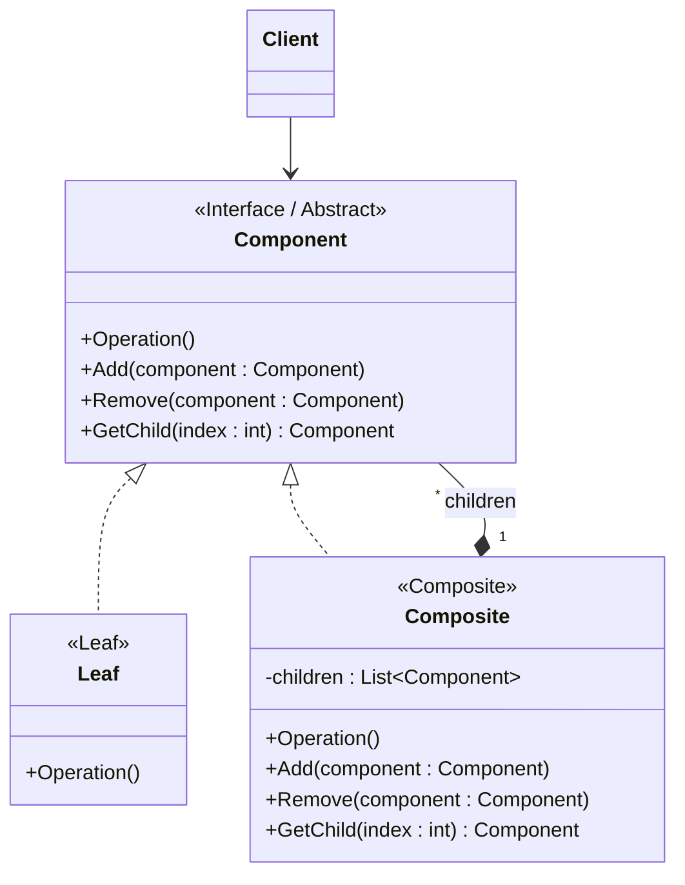
```mermaid
classDiagram
direction TB

class Client {
}

class Component {
    <<Interface / Abstract>>
    +Operation()
    +Add(component : Component)
    +Remove(component : Component)
    +GetChild(index : int) Component
}

class Leaf {
    <<Leaf>>
    +Operation()
}

class Composite {
    <<Composite>>
    -children : List~Component~
    +Operation()
    +Add(component : Component)
    +Remove(component : Component)
    +GetChild(index : int) Component
}

Client --> Component
Component <|.. Leaf
Component <|.. Composite
Composite "1" *-- "*" Component : children
```

#### Sequence Diagram

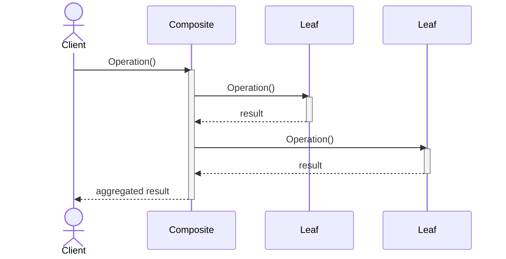
```mermaid
sequenceDiagram
    actor Client
    participant Composite as Composite
    participant Leaf1 as Leaf
    participant Leaf2 as Leaf

    Client->>Composite: Operation()
    activate Composite
    
    Composite->>Leaf1: Operation()
    activate Leaf1
    Leaf1-->>Composite: result
    deactivate Leaf1

    Composite->>Leaf2: Operation()
    activate Leaf2
    Leaf2-->>Composite: result
    deactivate Leaf2

    Composite-->>Client: aggregated result
    deactivate Composite
```

#### Simplified Code

```csharp
public interface ICatalogComponent
{
    string Name { get; }
    void Display(int indent = 0);
}

public class Database : ICatalogComponent
{
    private readonly List<ICatalogComponent> _schemas = new();
    public string Name { get; init; } = string.Empty;

    public void Add(ICatalogComponent component) => _schemas.Add(component);
    public void Remove(ICatalogComponent component) => _schemas.Remove(component);

    public void Display(int indent = 0)
    {
        Console.WriteLine($"{new string(' ', indent)}+ Database: {Name}");
        foreach (var schema in _schemas)
        {
            schema.Display(indent + 2);
        }
    }
}

public class Schema : ICatalogComponent
{
    private readonly List<ICatalogComponent> _tables = new();
    public string Name { get; init; } = string.Empty;

    public void Add(ICatalogComponent component) => _tables.Add(component);
    public void Remove(ICatalogComponent component) => _tables.Remove(component);

    public void Display(int indent = 0)
    {
        Console.WriteLine($"{new string(' ', indent)}+ Schema: {Name}");
        foreach (var table in _tables)
        {
            table.Display(indent + 2);
        }
    }
}

public class Table : ICatalogComponent
{
    private readonly List<ICatalogComponent> _columns = new();
    public string Name { get; init; } = string.Empty;

    public void Add(ICatalogComponent component) => _columns.Add(component);
    public void Remove(ICatalogComponent component) => _columns.Remove(component);

    public void Display(int indent = 0)
    {
        Console.WriteLine($"{new string(' ', indent)}+ Table: {Name}");
        foreach (var column in _columns)
        {
            column.Display(indent + 2);
        }
    }
}

public class Column : ICatalogComponent
{
    public string Name { get; init; } = string.Empty;
    public string DataType { get; init; } = "INT";

    public void Display(int indent = 0)
    {
        Console.WriteLine($"{new string(' ', indent)}- Column: {Name} ({DataType})");
    }
}
```

#### Usage Code Example

```csharp
// 1. Create leaf objects (Leaf)
var colId = new Column { Name = "Id", DataType = "INT" };
var colName = new Column { Name = "Username", DataType = "VARCHAR" };

// 2. Create table (Composite) and add child columns
var userTable = new Table { Name = "Users" };
userTable.Add(colId);
userTable.Add(colName);

// 3. Create Schema (Composite) and add table to Schema
var publicSchema = new Schema { Name = "public" };
publicSchema.Add(userTable);

// 4. Create Database (Root Composite) and add Schema to Database
var db = new Database { Name = "bbv_db" };
db.Add(publicSchema);

// 5. Perform uniform operations via Component Interface (Catalog Root)
ICatalogComponent catalogRoot = db;

// Calling Display() on root node automatically traverses the entire metadata tree recursively:
// Database -> Schema -> Table -> Column
catalogRoot.Display();
```

**Benefits**

- Models metadata as a tree structure.
- Parent and child objects are managed consistently.
- Easy to traverse the metadata hierarchy.

**Application:** Models the metadata tree: Database → Schema → Table → Column.

**Why apply?** Composite Pattern structures data into a tree form, providing uniform Add/Remove functions. The diagram below shows assigning objects together to form a parent-child structure, making it easy to access the entire branch (e.g., `GetSchemas()`, `GetTables()`).

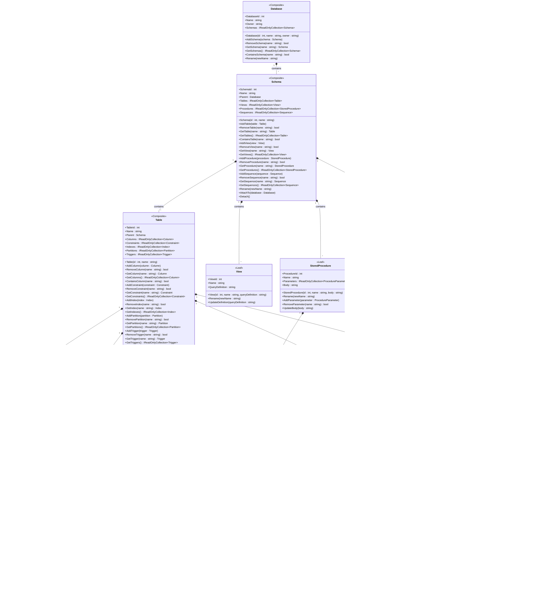
```mermaid
classDiagram
direction TB

%% =====================================================
%% Composite Root
%% =====================================================

class Database {
    <<Composite>>
    +DatabaseId : int
    +Name : string
    +Owner : string
    +Schemas : IReadOnlyCollection~Schema~

    +Database(id : int, name : string, owner : string)

    +AddSchema(schema : Schema)
    +RemoveSchema(name : string) bool
    +GetSchema(name : string) Schema
    +GetSchemas() IReadOnlyCollection~Schema~
    +ContainsSchema(name : string) bool
    +Rename(newName : string)
}

%% =====================================================
%% Schema Composite
%% =====================================================

class Schema {
    <<Composite>>
    +SchemaId : int
    +Name : string
    +Parent : Database

    +Tables : IReadOnlyCollection~Table~
    +Views : IReadOnlyCollection~View~
    +Procedures : IReadOnlyCollection~StoredProcedure~
    +Sequences : IReadOnlyCollection~Sequence~

    +Schema(id : int, name : string)

    +AddTable(table : Table)
    +RemoveTable(name : string) bool
    +GetTable(name : string) Table
    +GetTables() IReadOnlyCollection~Table~
    +ContainsTable(name : string) bool

    +AddView(view : View)
    +RemoveView(name : string) bool
    +GetView(name : string) View
    +GetViews() IReadOnlyCollection~View~

    +AddProcedure(procedure : StoredProcedure)
    +RemoveProcedure(name : string) bool
    +GetProcedure(name : string) StoredProcedure
    +GetProcedures() IReadOnlyCollection~StoredProcedure~

    +AddSequence(sequence : Sequence)
    +RemoveSequence(name : string) bool
    +GetSequence(name : string) Sequence
    +GetSequences() IReadOnlyCollection~Sequence~

    +Rename(newName : string)
    +AttachTo(database : Database)
    +Detach()
}

%% =====================================================
%% Table Composite
%% =====================================================

class Table {
    <<Composite>>
    +TableId : int
    +Name : string
    +Parent : Schema

    +Columns : IReadOnlyCollection~Column~
    +Constraints : IReadOnlyCollection~Constraint~
    +Indexes : IReadOnlyCollection~Index~
    +Partitions : IReadOnlyCollection~Partition~
    +Triggers : IReadOnlyCollection~Trigger~

    +Table(id : int, name : string)

    +AddColumn(column : Column)
    +RemoveColumn(name : string) bool
    +GetColumn(name : string) Column
    +GetColumns() IReadOnlyCollection~Column~
    +ContainsColumn(name : string) bool

    +AddConstraint(constraint : Constraint)
    +RemoveConstraint(name : string) bool
    +GetConstraint(name : string) Constraint
    +GetConstraints() IReadOnlyCollection~Constraint~

    +AddIndex(index : Index)
    +RemoveIndex(name : string) bool
    +GetIndex(name : string) Index
    +GetIndexes() IReadOnlyCollection~Index~

    +AddPartition(partition : Partition)
    +RemovePartition(name : string) bool
    +GetPartition(name : string) Partition
    +GetPartitions() IReadOnlyCollection~Partition~

    +AddTrigger(trigger : Trigger)
    +RemoveTrigger(name : string) bool
    +GetTrigger(name : string) Trigger
    +GetTriggers() IReadOnlyCollection~Trigger~

    +Rename(newName : string)
    +AttachTo(schema : Schema)
    +Detach()
}

%% =====================================================
%% Table Leaves
%% =====================================================

class Column {
    <<Leaf>>
    +ColumnId : int
    +Name : string
    +Parent : Table
    +DataType : DataType
    +Nullable : bool
    +DefaultValue : object
    +Length : int
    +Precision : int
    +Scale : int

    +Column(id : int, name : string, dataType : DataType)

    +Rename(newName : string)
    +SetDataType(dataType : DataType)
    +SetNullable(nullable : bool)
    +SetDefaultValue(value : object)
    +ValidateValue(value : object) bool
    +AttachTo(table : Table)
    +Detach()
}

class Constraint {
    <<abstract Leaf>>
    +ConstraintId : int
    +Name : string
    +Columns : IReadOnlyCollection~Column~

    +Validate(context : ConstraintValidationContext) ConstraintValidationResult
    +Rename(newName : string)
}

class Index {
    <<abstract Leaf>>
    +IndexId : int
    +Name : string
    +Columns : IReadOnlyCollection~Column~
    +Unique : bool

    +Rename(newName : string)
}

class Partition {
    <<Leaf>>
    +PartitionId : int
    +Name : string
    +PartitionKey : string
    +PartitionType : PartitionType

    +Rename(newName : string)
    +Contains(key : object) bool
}

class Trigger {
    <<Leaf>>
    +TriggerId : int
    +Name : string
    +Event : TriggerEvent
    +Timing : TriggerTiming
    +Body : string
    +Enabled : bool

    +Rename(newName : string)
    +Enable()
    +Disable()
}

%% =====================================================
%% Schema Leaves
%% =====================================================

class View {
    <<Leaf>>
    +ViewId : int
    +Name : string
    +QueryDefinition : string

    +View(id : int, name : string, queryDefinition : string)

    +Rename(newName : string)
    +UpdateDefinition(queryDefinition : string)
}

class StoredProcedure {
    <<Leaf>>
    +ProcedureId : int
    +Name : string
    +Parameters : IReadOnlyCollection~ProcedureParameter~
    +Body : string

    +StoredProcedure(id : int, name : string, body : string)

    +Rename(newName : string)
    +AddParameter(parameter : ProcedureParameter)
    +RemoveParameter(name : string) bool
    +UpdateBody(body : string)
}

class Sequence {
    <<Leaf>>
    +SequenceId : int
    +Name : string
    +CurrentValue : long
    +StartValue : long
    +Increment : long
    +MinimumValue : long
    +MaximumValue : long
    +Cycle : bool

    +Sequence(id : int, name : string, startValue : long, increment : long)

    +NextValue() long
    +Restart(value : long)
    +Rename(newName : string)
}

class ProcedureParameter {
    +Name : string
    +DataType : DataType
    +Direction : ParameterDirection
    +DefaultValue : object
}

%% =====================================================
%% Supporting Types
%% =====================================================

class DataType {
    <<enumeration>>
    INT
    BIGINT
    VARCHAR
    BOOLEAN
    FLOAT
    DECIMAL
    DATETIME
    BINARY
}

class PartitionType {
    <<enumeration>>
    RANGE
    LIST
    HASH
}

class TriggerEvent {
    <<enumeration>>
    INSERT
    UPDATE
    DELETE
}

class TriggerTiming {
    <<enumeration>>
    BEFORE
    AFTER
    INSTEAD_OF
}

class ParameterDirection {
    <<enumeration>>
    INPUT
    OUTPUT
    INPUT_OUTPUT
}

class RID {
    <<value object>>
    +PageId : int
    +SlotNumber : int
}

class ConstraintValidationContext {
    +Table : Table
    +Row : Row
    +Operation : ValidationOperation
}

class ConstraintValidationResult {
    +IsValid : bool
    +Message : string
}

class Row {
    +RowId : RID
    +Values : IReadOnlyDictionary~int, object~
    +GetValue(columnId : int) object
}

class ValidationOperation {
    <<enumeration>>
    INSERT
    UPDATE
}

%% =====================================================
%% Composite Relationships
%% =====================================================

Database "1" *-- "*" Schema : contains

Schema "1" *-- "*" Table : contains
Schema "1" *-- "*" View : contains
Schema "1" *-- "*" StoredProcedure : contains
Schema "1" *-- "*" Sequence : contains

Table "1" *-- "*" Column : contains
Table "1" *-- "*" Constraint : contains
Table "1" *-- "*" Index : contains
Table "1" *-- "*" Partition : contains
Table "1" *-- "*" Trigger : contains

StoredProcedure "1" *-- "*" ProcedureParameter : parameters

Column --> DataType
ProcedureParameter --> DataType
ProcedureParameter --> ParameterDirection
Partition --> PartitionType
Trigger --> TriggerEvent
Trigger --> TriggerTiming

Constraint --> ConstraintValidationContext
Constraint --> ConstraintValidationResult
ConstraintValidationContext --> Row
ConstraintValidationContext --> ValidationOperation
Row *-- RID
```

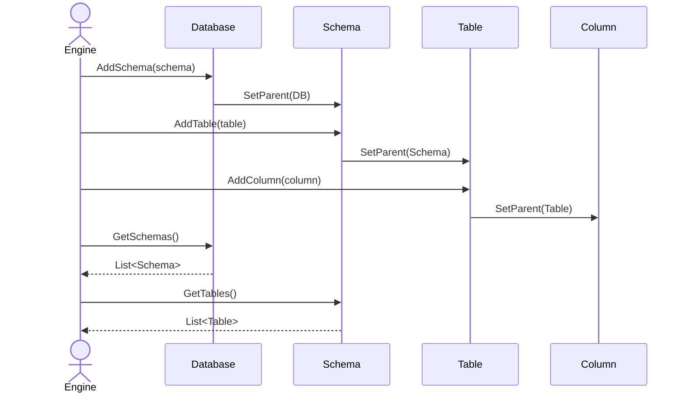
```mermaid
sequenceDiagram
    actor Engine
    participant DB as Database
    participant Schema as Schema
    participant Table as Table
    participant Column as Column

    Engine->>DB: AddSchema(schema)
    DB->>Schema: SetParent(DB)

    Engine->>Schema: AddTable(table)
    Schema->>Table: SetParent(Schema)

    Engine->>Table: AddColumn(column)
    Table->>Column: SetParent(Table)

    Engine->>DB: GetSchemas()
    DB-->>Engine: List<Schema>
    
    Engine->>Schema: GetTables()
    Schema-->>Engine: List<Table>
```

### 2. Metadata Initialization (Builder Pattern)

**Purpose:**
Construct a complex object step by step instead of using a long constructor.

**Application:**
`TableBuilder → Table`

**Recognition Signs:**
- Object construction requires multi-step configuration, optional parts, or complex initialization parameters.
- Avoids telescoping constructors (constructors with numerous parameter combinations).
- Allows creating different representations of a product using the same construction sequence.

#### Class Diagram

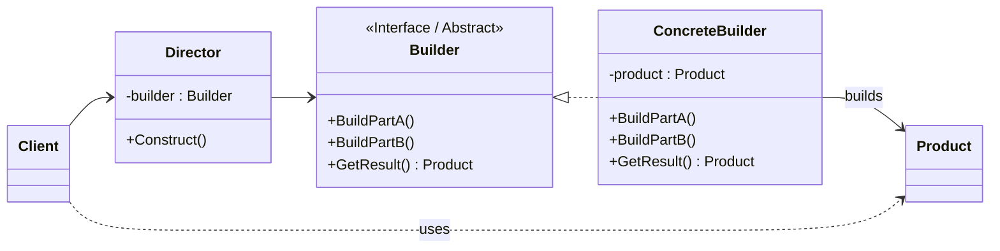
```mermaid
classDiagram
direction LR

class Client {
}

class Director {
    -builder : Builder
    +Construct()
}

class Builder {
    <<Interface / Abstract>>
    +BuildPartA()
    +BuildPartB()
    +GetResult() Product
}

class ConcreteBuilder {
    -product : Product
    +BuildPartA()
    +BuildPartB()
    +GetResult() Product
}

class Product {
}

Client --> Director
Director --> Builder
Builder <|.. ConcreteBuilder
ConcreteBuilder --> Product : builds
Client ..> Product : uses
```

#### Sequence Diagram

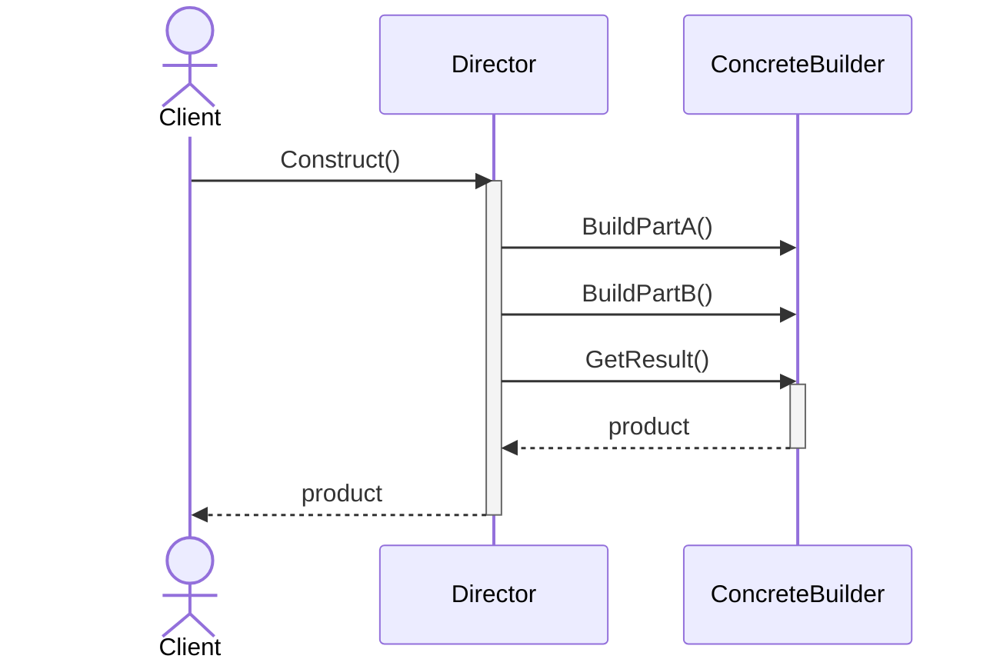
```mermaid
sequenceDiagram
    actor Client
    participant Director as Director
    participant Builder as ConcreteBuilder

    Client->>Director: Construct()
    activate Director
    Director->>Builder: BuildPartA()
    Director->>Builder: BuildPartB()
    Director->>Builder: GetResult()
    activate Builder
    Builder-->>Director: product
    deactivate Builder
    Director-->>Client: product
    deactivate Director
```

#### Simplified Code

```csharp
public class Table
{
    public string Name { get; set; } = string.Empty;
    public List<string> Columns { get; } = new();
    public List<string> PrimaryKeys { get; } = new();
}

public interface ITableBuilder
{
    ITableBuilder SetName(string name);
    ITableBuilder AddColumn(string columnName, string dataType);
    ITableBuilder AddPrimaryKey(string columnName);
    Table Build();
}

public class TableBuilder : ITableBuilder
{
    private Table _table = new();

    public ITableBuilder SetName(string name)
    {
        _table.Name = name;
        return this;
    }

    public ITableBuilder AddColumn(string columnName, string dataType)
    {
        _table.Columns.Add($"{columnName} {dataType}");
        return this;
    }

    public ITableBuilder AddPrimaryKey(string columnName)
    {
        _table.PrimaryKeys.Add(columnName);
        return this;
    }

    public Table Build()
    {
        Table result = _table;
        _table = new Table(); // Reset for subsequent builds
        return result;
    }
}

public class TableDirector
{
    public Table BuildUserTable(ITableBuilder builder)
    {
        return builder
            .SetName("Users")
            .AddColumn("Id", "INT")
            .AddColumn("Username", "VARCHAR(50)")
            .AddPrimaryKey("Id")
            .Build();
    }
}
```

#### Usage Code Example

```csharp
// Option 1: Direct usage via Fluent Builder interface
ITableBuilder builder = new TableBuilder();
Table productTable = builder
    .SetName("Products")
    .AddColumn("ProductId", "INT")
    .AddColumn("Price", "DECIMAL")
    .AddPrimaryKey("ProductId")
    .Build();

// Option 2: Using Director for predefined table construction workflow
var director = new TableDirector();
Table userTable = director.BuildUserTable(new TableBuilder());
```

**Benefits**

* Avoids constructors with too many parameters.
* Supports optional object properties.
* Reuses the same construction process for different object configurations.
* Separates object construction from its representation.

**Application:** Initializes tables via `TableBuilder` from DDL syntax.

**Why apply?** Initializing a Table object requires many properties. `TableBuilder` helps gather parameters gradually (Columns, Primary Keys) and only creates the `TableMetadata` object in the final step, making the code coherent and readable.

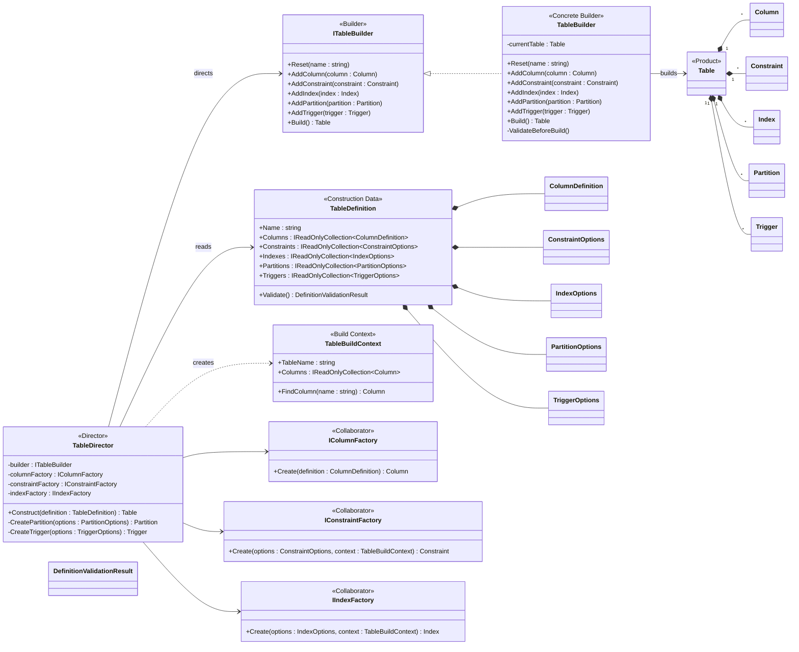
```mermaid
classDiagram
direction LR

class ITableBuilder {
    <<Builder>>
    +Reset(name : string)
    +AddColumn(column : Column)
    +AddConstraint(constraint : Constraint)
    +AddIndex(index : Index)
    +AddPartition(partition : Partition)
    +AddTrigger(trigger : Trigger)
    +Build() Table
}

class TableBuilder {
    <<Concrete Builder>>
    -currentTable : Table
    +Reset(name : string)
    +AddColumn(column : Column)
    +AddConstraint(constraint : Constraint)
    +AddIndex(index : Index)
    +AddPartition(partition : Partition)
    +AddTrigger(trigger : Trigger)
    +Build() Table
    -ValidateBeforeBuild()
}

class TableDirector {
    <<Director>>
    -builder : ITableBuilder
    -columnFactory : IColumnFactory
    -constraintFactory : IConstraintFactory
    -indexFactory : IIndexFactory
    +Construct(definition : TableDefinition) Table
    -CreatePartition(options : PartitionOptions) Partition
    -CreateTrigger(options : TriggerOptions) Trigger
}

class TableDefinition {
    <<Construction Data>>
    +Name : string
    +Columns : IReadOnlyCollection~ColumnDefinition~
    +Constraints : IReadOnlyCollection~ConstraintOptions~
    +Indexes : IReadOnlyCollection~IndexOptions~
    +Partitions : IReadOnlyCollection~PartitionOptions~
    +Triggers : IReadOnlyCollection~TriggerOptions~
    +Validate() DefinitionValidationResult
}

class TableBuildContext {
    <<Build Context>>
    +TableName : string
    +Columns : IReadOnlyCollection~Column~
    +FindColumn(name : string) Column
}

class Table {
    <<Product>>
}

class Column
class Constraint
class Index
class Partition
class Trigger

class IColumnFactory {
    <<Collaborator>>
    +Create(definition : ColumnDefinition) Column
}

class IConstraintFactory {
    <<Collaborator>>
    +Create(options : ConstraintOptions, context : TableBuildContext) Constraint
}

class IIndexFactory {
    <<Collaborator>>
    +Create(options : IndexOptions, context : TableBuildContext) Index
}


class ColumnDefinition
class ConstraintOptions
class IndexOptions
class PartitionOptions
class TriggerOptions
class DefinitionValidationResult

ITableBuilder <|.. TableBuilder
TableBuilder --> Table : builds

TableDirector --> ITableBuilder : directs
TableDirector --> TableDefinition : reads
TableDirector ..> TableBuildContext : creates

TableDirector --> IColumnFactory
TableDirector --> IConstraintFactory
TableDirector --> IIndexFactory

TableDefinition *-- ColumnDefinition
TableDefinition *-- ConstraintOptions
TableDefinition *-- IndexOptions
TableDefinition *-- PartitionOptions
TableDefinition *-- TriggerOptions

Table "1" *-- "*" Column
Table "1" *-- "*" Constraint
Table "1" *-- "*" Index
Table "1" *-- "*" Partition
Table "1" *-- "*" Trigger
```

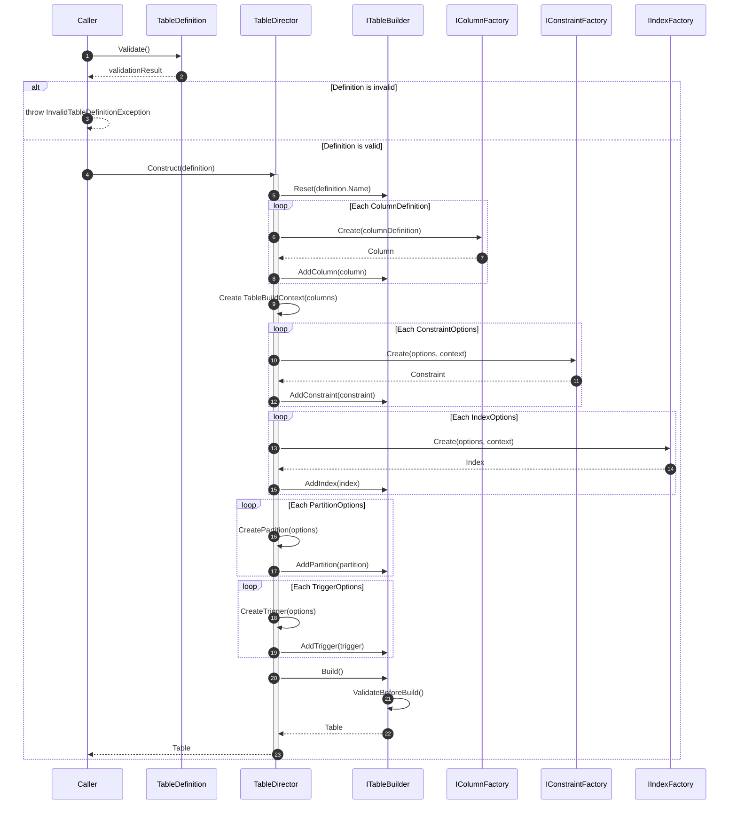
```mermaid
sequenceDiagram
    autonumber

    participant Caller
    participant Definition as TableDefinition
    participant Director as TableDirector
    participant Builder as ITableBuilder
    participant ColFactory as IColumnFactory
    participant CFactory as IConstraintFactory
    participant IFactory as IIndexFactory

    Caller->>Definition: Validate()
    Definition-->>Caller: validationResult

    alt Definition is invalid
        Caller-->>Caller: throw InvalidTableDefinitionException
    else Definition is valid
        Caller->>Director: Construct(definition)
        activate Director

        Director->>Builder: Reset(definition.Name)

        loop Each ColumnDefinition
            Director->>ColFactory: Create(columnDefinition)
            ColFactory-->>Director: Column
            Director->>Builder: AddColumn(column)
        end

        Director->>Director: Create TableBuildContext(columns)

        loop Each ConstraintOptions
            Director->>CFactory: Create(options, context)
            CFactory-->>Director: Constraint
            Director->>Builder: AddConstraint(constraint)
        end

        loop Each IndexOptions
            Director->>IFactory: Create(options, context)
            IFactory-->>Director: Index
            Director->>Builder: AddIndex(index)
        end

        loop Each PartitionOptions
            Director->>Director: CreatePartition(options)
            Director->>Builder: AddPartition(partition)
        end

        loop Each TriggerOptions
            Director->>Director: CreateTrigger(options)
            Director->>Builder: AddTrigger(trigger)
        end

        Director->>Builder: Build()
        Builder->>Builder: ValidateBeforeBuild()
        Builder-->>Director: Table

        Director-->>Caller: Table
        deactivate Director
    end
```

### 3. Constraint Validation (Strategy Pattern)

**Purpose:**
Encapsulate interchangeable algorithms behind a common interface.

**Application:**
`ConstraintValidationContext → IConstraintStrategy`

**Recognition Signs:**
- Multiple algorithms or rules exist for a specific task and need to be selected or interchanged at runtime.
- Replaces conditional logic (`if-else` or `switch` statements) that selects algorithm variations based on object types or flags.
- Isolates algorithm implementation details, internal data, and dependencies from the client code.

#### Class Diagram

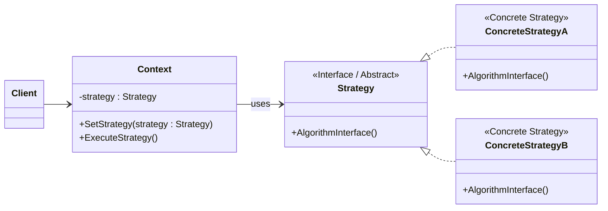
```mermaid
classDiagram
direction LR

class Client {
}

class Context {
    -strategy : Strategy
    +SetStrategy(strategy : Strategy)
    +ExecuteStrategy()
}

class Strategy {
    <<Interface / Abstract>>
    +AlgorithmInterface()
}

class ConcreteStrategyA {
    <<Concrete Strategy>>
    +AlgorithmInterface()
}

class ConcreteStrategyB {
    <<Concrete Strategy>>
    +AlgorithmInterface()
}

Client --> Context
Context --> Strategy : uses
Strategy <|.. ConcreteStrategyA
Strategy <|.. ConcreteStrategyB
```

#### Sequence Diagram

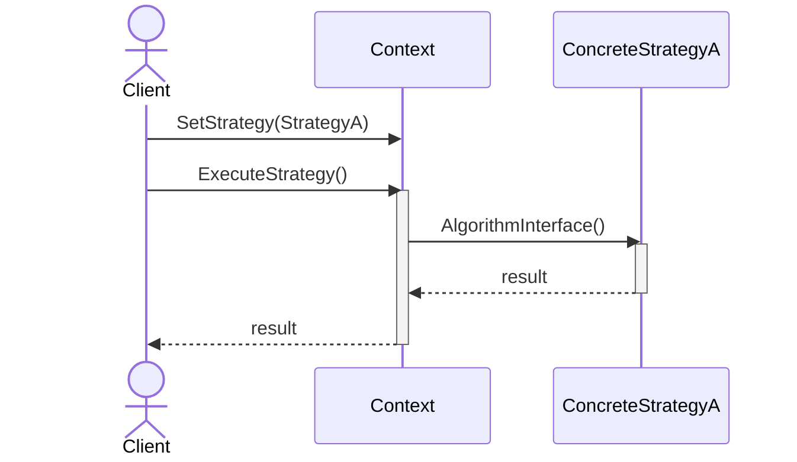
```mermaid
sequenceDiagram
    actor Client
    participant Context as Context
    participant Strategy as ConcreteStrategyA

    Client->>Context: SetStrategy(StrategyA)
    Client->>Context: ExecuteStrategy()
    activate Context
    Context->>Strategy: AlgorithmInterface()
    activate Strategy
    Strategy-->>Context: result
    deactivate Strategy
    Context-->>Client: result
    deactivate Context
```

#### Simplified Code

```csharp
public class ConstraintValidationContext
{
    public string TableName { get; set; } = string.Empty;
    public Dictionary<string, object?> ColumnValues { get; set; } = new();
}

public interface IConstraintStrategy
{
    bool Validate(ConstraintValidationContext context, out string errorMessage);
}

public class NotNullConstraint : IConstraintStrategy
{
    private readonly string _columnName;
    public NotNullConstraint(string columnName) => _columnName = columnName;

    public bool Validate(ConstraintValidationContext context, out string errorMessage)
    {
        if (context.ColumnValues.TryGetValue(_columnName, out var val) && val != null)
        {
            errorMessage = string.Empty;
            return true;
        }
        errorMessage = $"Column '{_columnName}' cannot be null.";
        return false;
    }
}

public class PrimaryKeyConstraint : IConstraintStrategy
{
    private readonly string _columnName;
    public PrimaryKeyConstraint(string columnName) => _columnName = columnName;

    public bool Validate(ConstraintValidationContext context, out string errorMessage)
    {
        if (context.ColumnValues.TryGetValue(_columnName, out var val) && val != null)
        {
            errorMessage = string.Empty;
            return true;
        }
        errorMessage = $"Primary key column '{_columnName}' must have a valid value.";
        return false;
    }
}

public class TableValidator
{
    private readonly List<IConstraintStrategy> _strategies = new();

    public void AddConstraint(IConstraintStrategy strategy) => _strategies.Add(strategy);

    public bool ValidateRow(ConstraintValidationContext context, out List<string> errors)
    {
        errors = new List<string>();
        foreach (var strategy in _strategies)
        {
            if (!strategy.Validate(context, out var err))
            {
                errors.Add(err);
            }
        }
        return errors.Count == 0;
    }
}
```

#### Usage Code Example

```csharp
// 1. Configure constraint strategies for a table
var validator = new TableValidator();
validator.AddConstraint(new NotNullConstraint("Username"));
validator.AddConstraint(new PrimaryKeyConstraint("Id"));

// 2. Prepare row validation context
var context = new ConstraintValidationContext
{
    TableName = "Users",
    ColumnValues = new Dictionary<string, object?>
    {
        { "Id", 1 },
        { "Username", "john_doe" }
    }
};

// 3. Execute validation dynamically using registered strategies
if (validator.ValidateRow(context, out var errors))
{
    Console.WriteLine("Row validation succeeded.");
}
else
{
    Console.WriteLine($"Validation failed: {string.Join(", ", errors)}");
}
```

**Benefits**

* Easily switch algorithms at runtime.
* Follows the Open/Closed Principle.
* Eliminates large `if-else` or `switch` statements.
* Each algorithm can evolve independently.

**Application:** Evaluates Row validity based on various types of Constraints.

**Why apply?** By applying the Strategy Pattern via the `IConstraint` interface, `RecordManager` doesn't need to care about internal detailed logic (Primary Key checks for duplicates, Check evaluates expressions, Foreign Key checks reference table). It just calls `Validate(row)` and handles the polymorphic result.

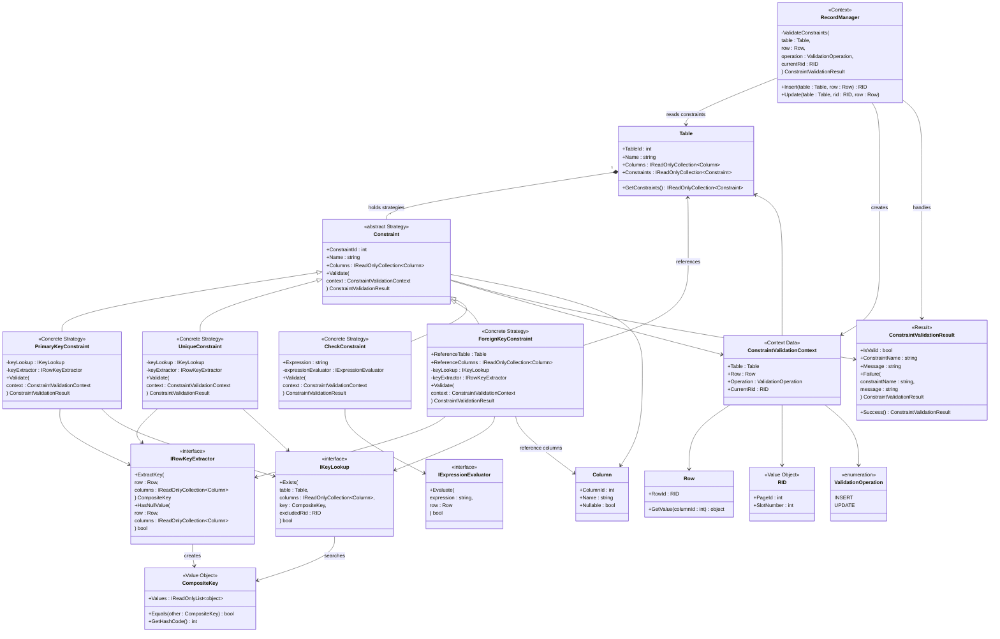
```mermaid
classDiagram
direction TB

%% =====================================================
%% Context
%% =====================================================

class RecordManager {
    <<Context>>
    +Insert(table : Table, row : Row) RID
    +Update(table : Table, rid : RID, row : Row)
    -ValidateConstraints(
        table : Table,
        row : Row,
        operation : ValidationOperation,
        currentRid : RID
    ) ConstraintValidationResult
}

class Table {
    +TableId : int
    +Name : string
    +Columns : IReadOnlyCollection~Column~
    +Constraints : IReadOnlyCollection~Constraint~
    +GetConstraints() IReadOnlyCollection~Constraint~
}

%% =====================================================
%% Strategy
%% =====================================================

class Constraint {
    <<abstract Strategy>>
    +ConstraintId : int
    +Name : string
    +Columns : IReadOnlyCollection~Column~
    +Validate(
        context : ConstraintValidationContext
    ) ConstraintValidationResult
}

class PrimaryKeyConstraint {
    <<Concrete Strategy>>
    -keyLookup : IKeyLookup
    -keyExtractor : IRowKeyExtractor
    +Validate(
        context : ConstraintValidationContext
    ) ConstraintValidationResult
}

class UniqueConstraint {
    <<Concrete Strategy>>
    -keyLookup : IKeyLookup
    -keyExtractor : IRowKeyExtractor
    +Validate(
        context : ConstraintValidationContext
    ) ConstraintValidationResult
}

class ForeignKeyConstraint {
    <<Concrete Strategy>>
    +ReferenceTable : Table
    +ReferenceColumns : IReadOnlyCollection~Column~
    -keyLookup : IKeyLookup
    -keyExtractor : IRowKeyExtractor
    +Validate(
        context : ConstraintValidationContext
    ) ConstraintValidationResult
}

class CheckConstraint {
    <<Concrete Strategy>>
    +Expression : string
    -expressionEvaluator : IExpressionEvaluator
    +Validate(
        context : ConstraintValidationContext
    ) ConstraintValidationResult
}

%% =====================================================
%% Validation Context and Result
%% =====================================================

class ConstraintValidationContext {
    <<Context Data>>
    +Table : Table
    +Row : Row
    +Operation : ValidationOperation
    +CurrentRid : RID
}

class ConstraintValidationResult {
    <<Result>>
    +IsValid : bool
    +ConstraintName : string
    +Message : string
    +Success() ConstraintValidationResult
    +Failure(
        constraintName : string,
        message : string
    ) ConstraintValidationResult
}

class ValidationOperation {
    <<enumeration>>
    INSERT
    UPDATE
}

%% =====================================================
%% Collaborators
%% =====================================================

class IRowKeyExtractor {
    <<interface>>
    +ExtractKey(
        row : Row,
        columns : IReadOnlyCollection~Column~
    ) CompositeKey

    +HasNullValue(
        row : Row,
        columns : IReadOnlyCollection~Column~
    ) bool
}

class IKeyLookup {
    <<interface>>
    +Exists(
        table : Table,
        columns : IReadOnlyCollection~Column~,
        key : CompositeKey,
        excludedRid : RID
    ) bool
}

class IExpressionEvaluator {
    <<interface>>
    +Evaluate(
        expression : string,
        row : Row
    ) bool
}

class CompositeKey {
    <<Value Object>>
    +Values : IReadOnlyList~object~
    +Equals(other : CompositeKey) bool
    +GetHashCode() int
}

%% =====================================================
%% Supporting Domain Types
%% =====================================================

class Row {
    +RowId : RID
    +GetValue(columnId : int) object
}

class Column {
    +ColumnId : int
    +Name : string
    +Nullable : bool
}

class RID {
    <<Value Object>>
    +PageId : int
    +SlotNumber : int
}

%% =====================================================
%% Relationships
%% =====================================================

RecordManager --> Table : reads constraints
RecordManager --> ConstraintValidationContext : creates
RecordManager --> ConstraintValidationResult : handles

Table "1" *-- "*" Constraint : holds strategies

Constraint <|-- PrimaryKeyConstraint
Constraint <|-- UniqueConstraint
Constraint <|-- ForeignKeyConstraint
Constraint <|-- CheckConstraint

Constraint --> ConstraintValidationContext
Constraint --> ConstraintValidationResult
Constraint --> Column

ConstraintValidationContext --> Table
ConstraintValidationContext --> Row
ConstraintValidationContext --> RID
ConstraintValidationContext --> ValidationOperation

PrimaryKeyConstraint --> IRowKeyExtractor
PrimaryKeyConstraint --> IKeyLookup

UniqueConstraint --> IRowKeyExtractor
UniqueConstraint --> IKeyLookup

ForeignKeyConstraint --> IRowKeyExtractor
ForeignKeyConstraint --> IKeyLookup
ForeignKeyConstraint --> Table : references
ForeignKeyConstraint --> Column : reference columns

CheckConstraint --> IExpressionEvaluator

IRowKeyExtractor --> CompositeKey : creates
IKeyLookup --> CompositeKey : searches
```

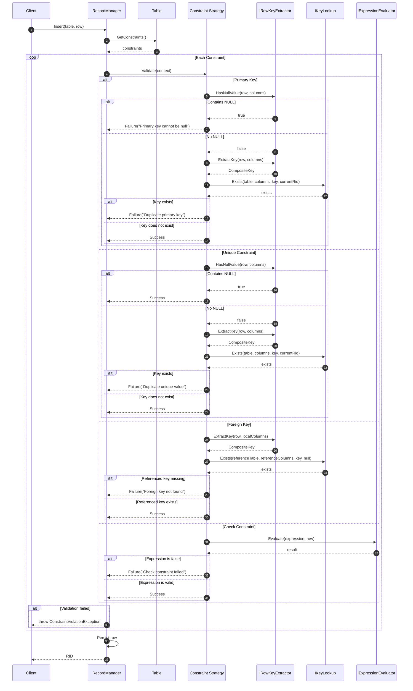
```mermaid
sequenceDiagram
    autonumber

    participant Client
    participant RecordMgr as RecordManager
    participant Table
    participant Constraint as Constraint Strategy
    participant Extractor as IRowKeyExtractor
    participant Lookup as IKeyLookup
    participant Evaluator as IExpressionEvaluator

    Client->>RecordMgr: Insert(table, row)

    RecordMgr->>Table: GetConstraints()
    Table-->>RecordMgr: constraints

    loop Each Constraint
        RecordMgr->>Constraint: Validate(context)

        alt Primary Key
            Constraint->>Extractor: HasNullValue(row, columns)

            alt Contains NULL
                Extractor-->>Constraint: true
                Constraint-->>RecordMgr: Failure("Primary key cannot be null")
            else No NULL
                Extractor-->>Constraint: false
                Constraint->>Extractor: ExtractKey(row, columns)
                Extractor-->>Constraint: CompositeKey

                Constraint->>Lookup: Exists(table, columns, key, currentRid)
                Lookup-->>Constraint: exists

                alt Key exists
                    Constraint-->>RecordMgr: Failure("Duplicate primary key")
                else Key does not exist
                    Constraint-->>RecordMgr: Success
                end
            end

        else Unique Constraint
            Constraint->>Extractor: HasNullValue(row, columns)

            alt Contains NULL
                Extractor-->>Constraint: true
                Constraint-->>RecordMgr: Success
            else No NULL
                Extractor-->>Constraint: false
                Constraint->>Extractor: ExtractKey(row, columns)
                Extractor-->>Constraint: CompositeKey
                Constraint->>Lookup: Exists(table, columns, key, currentRid)
                Lookup-->>Constraint: exists

                alt Key exists
                    Constraint-->>RecordMgr: Failure("Duplicate unique value")
                else Key does not exist
                    Constraint-->>RecordMgr: Success
                end
            end

        else Foreign Key
            Constraint->>Extractor: ExtractKey(row, localColumns)
            Extractor-->>Constraint: CompositeKey
            Constraint->>Lookup: Exists(referenceTable, referenceColumns, key, null)
            Lookup-->>Constraint: exists

            alt Referenced key missing
                Constraint-->>RecordMgr: Failure("Foreign key not found")
            else Referenced key exists
                Constraint-->>RecordMgr: Success
            end

        else Check Constraint
            Constraint->>Evaluator: Evaluate(expression, row)
            Evaluator-->>Constraint: result

            alt Expression is false
                Constraint-->>RecordMgr: Failure("Check constraint failed")
            else Expression is valid
                Constraint-->>RecordMgr: Success
            end
        end

        alt Validation failed
            RecordMgr-->>Client: throw ConstraintViolationException
        end
    end

    RecordMgr->>RecordMgr: Persist row
    RecordMgr-->>Client: RID
```

### 4. Dynamic Allocation (Factory Method Pattern)

**Purpose:**
Define a common method for creating objects while allowing subclasses to decide which concrete object is created.

**Application:**
`IndexFactory → Index (BTreeIndex, HashIndex)`

**Recognition Signs:**
- Creator class cannot anticipate the exact class of objects it needs to instantiate beforehand.
- Delegates object instantiation responsibilities to specialized factory subclasses or methods.
- Eliminates direct coupling between client code and concrete product classes.

#### Class Diagram

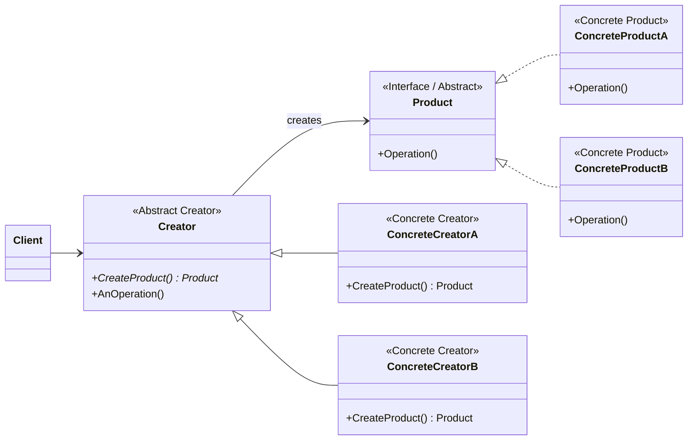
```mermaid
classDiagram
direction LR

class Client {
}

class Product {
    <<Interface / Abstract>>
    +Operation()
}

class ConcreteProductA {
    <<Concrete Product>>
    +Operation()
}

class ConcreteProductB {
    <<Concrete Product>>
    +Operation()
}

class Creator {
    <<Abstract Creator>>
    +CreateProduct() Product*
    +AnOperation()
}

class ConcreteCreatorA {
    <<Concrete Creator>>
    +CreateProduct() Product
}

class ConcreteCreatorB {
    <<Concrete Creator>>
    +CreateProduct() Product
}

Client --> Creator
Creator --> Product : creates
Product <|.. ConcreteProductA
Product <|.. ConcreteProductB
Creator <|-- ConcreteCreatorA
Creator <|-- ConcreteCreatorB
```

#### Sequence Diagram

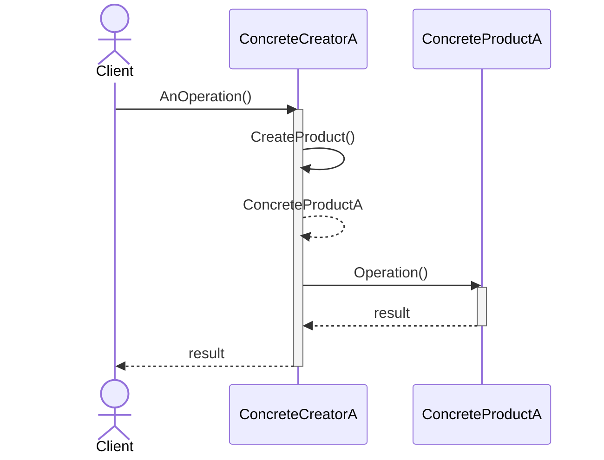
```mermaid
sequenceDiagram
    actor Client
    participant Creator as ConcreteCreatorA
    participant Product as ConcreteProductA

    Client->>Creator: AnOperation()
    activate Creator
    Creator->>Creator: CreateProduct()
    Creator-->>Creator: ConcreteProductA
    Creator->>Product: Operation()
    activate Product
    Product-->>Creator: result
    deactivate Product
    Creator-->>Client: result
    deactivate Creator
```

#### Simplified Code

```csharp
public interface IIndex
{
    string Name { get; }
    string Type { get; }
    void Build();
}

public class BTreeIndex : IIndex
{
    public string Name { get; }
    public string Type => "B-Tree";
    public BTreeIndex(string name) => Name = name;
    public void Build() => Console.WriteLine($"Building B-Tree index: {Name}");
}

public class HashIndex : IIndex
{
    public string Name { get; }
    public string Type => "Hash";
    public HashIndex(string name) => Name = name;
    public void Build() => Console.WriteLine($"Building Hash index: {Name}");
}

public abstract class IndexFactory
{
    // Factory Method: Subclasses decide which concrete Index product to instantiate
    public abstract IIndex CreateIndex(string indexName);

    public IIndex InitializeIndex(string indexName)
    {
        IIndex index = CreateIndex(indexName);
        index.Build();
        return index;
    }
}

public class BTreeIndexFactory : IndexFactory
{
    public override IIndex CreateIndex(string indexName) => new BTreeIndex(indexName);
}

public class HashIndexFactory : IndexFactory
{
    public override IIndex CreateIndex(string indexName) => new HashIndex(indexName);
}
```

#### Usage Code Example

```csharp
// 1. Instantiate specific Factory creators
IndexFactory btreeFactory = new BTreeIndexFactory();
IndexFactory hashFactory = new HashIndexFactory();

// 2. Client initializes indices dynamically without coupling to concrete index classes
IIndex idxUsers = btreeFactory.InitializeIndex("idx_users_id");
IIndex idxSession = hashFactory.InitializeIndex("idx_session_token");

Console.WriteLine($"Created {idxUsers.Name} ({idxUsers.Type})");
Console.WriteLine($"Created {idxSession.Name} ({idxSession.Type})");
```

**Benefits**

* Removes direct dependency on concrete product classes.
* Makes adding new product types easier.
* Follows the Open/Closed Principle.
* Keeps object creation logic separate from business logic.

**Application:** Allocates objects like Index and Constraint automatically during DDL execution.

**Why apply?** Delegates the creation of a specific Index (BTree or Hash) to `IndexFactory`. The client doesn't need to know the internal initialization logic, just passes in the desired Index type and receives a common `IIndex` interface back.


```mermaid
classDiagram
direction TB

%% =====================================================
%% Factory Clients
%% =====================================================

class TableDirector {
    <<Client>>
    -constraintFactory : IConstraintFactory
    -indexFactory : IIndexFactory
    +Construct(definition : TableDefinition) Table
}

%% =====================================================
%% Constraint Factory
%% =====================================================

class IConstraintFactory {
    <<Factory>>
    +Create(options : ConstraintOptions) Constraint
}

class ConstraintFactory {
    <<Concrete Factory>>
    +Create(options : ConstraintOptions) Constraint
}

class ConstraintOptions {
    <<DTO>>
    +Type : ConstraintType
    +Name : string
    +Columns : IReadOnlyCollection~Column~
    +ReferenceTable : Table
    +ReferenceColumns : IReadOnlyCollection~Column~
    +Expression : string
}

class ConstraintType {
    <<enumeration>>
    PRIMARY_KEY
    UNIQUE
    FOREIGN_KEY
    CHECK
}

class Constraint {
    <<abstract Product>>
    +Name : string
    +Columns : IReadOnlyCollection~Column~
}

class PrimaryKeyConstraint {
    <<Concrete Product>>
}

class UniqueConstraint {
    <<Concrete Product>>
}

class ForeignKeyConstraint {
    <<Concrete Product>>
    +ReferenceTable : Table
    +ReferenceColumns : IReadOnlyCollection~Column~
}

class CheckConstraint {
    <<Concrete Product>>
    +Expression : string
}

%% =====================================================
%% Index Factory
%% =====================================================

class IIndexFactory {
    <<Factory>>
    +Create(options : IndexOptions) Index
}

class IndexFactory {
    <<Concrete Factory>>
    +Create(options : IndexOptions) Index
}

class IndexOptions {
    <<DTO>>
    +Type : IndexType
    +Name : string
    +Columns : IReadOnlyCollection~Column~
    +Unique : bool
}

class IndexType {
    <<enumeration>>
    BTREE
    HASH
    BITMAP
}

class Index {
    <<abstract Product>>
    +IndexId : int
    +Name : string
    +Columns : IReadOnlyCollection~Column~
    +Unique : bool
}

class BTreeIndex {
    <<Concrete Product>>
}

class HashIndex {
    <<Concrete Product>>
}

class BitmapIndex {
    <<Concrete Product>>
}

%% =====================================================
%% Supporting Domain Classes
%% =====================================================

class TableDefinition {
    +Constraints : IReadOnlyCollection~ConstraintOptions~
    +Indexes : IReadOnlyCollection~IndexOptions~
}

class Table
class Column

%% =====================================================
%% Relationships
%% =====================================================

TableDirector --> IConstraintFactory : creates constraints
TableDirector --> IIndexFactory : creates indexes
TableDirector --> TableDefinition : reads

IConstraintFactory <|.. ConstraintFactory
IIndexFactory <|.. IndexFactory

IConstraintFactory --> ConstraintOptions
IConstraintFactory --> Constraint : creates

IIndexFactory --> IndexOptions
IIndexFactory --> Index : creates

ConstraintOptions --> ConstraintType
ConstraintOptions --> Column
ConstraintOptions --> Table : referenced table

IndexOptions --> IndexType
IndexOptions --> Column

Constraint <|-- PrimaryKeyConstraint
Constraint <|-- UniqueConstraint
Constraint <|-- ForeignKeyConstraint
Constraint <|-- CheckConstraint

Index <|-- BTreeIndex
Index <|-- HashIndex
Index <|-- BitmapIndex
```

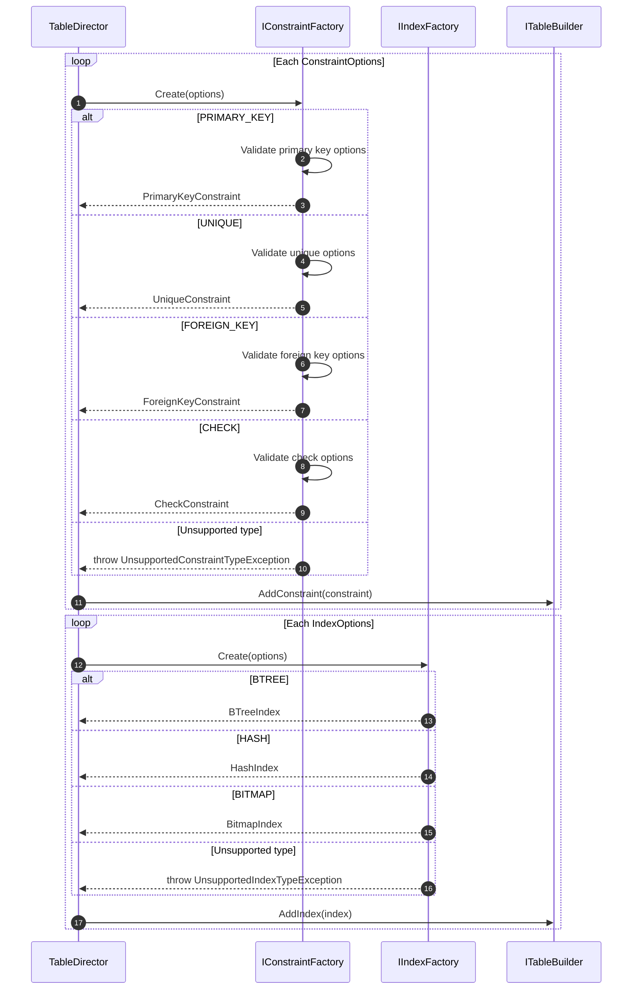
```mermaid
sequenceDiagram
    autonumber

    participant Director as TableDirector
    participant CFactory as IConstraintFactory
    participant IFactory as IIndexFactory
    participant Builder as ITableBuilder

    loop Each ConstraintOptions
        Director->>CFactory: Create(options)
        alt PRIMARY_KEY
            CFactory->>CFactory: Validate primary key options
            CFactory-->>Director: PrimaryKeyConstraint
        else UNIQUE
            CFactory->>CFactory: Validate unique options
            CFactory-->>Director: UniqueConstraint
        else FOREIGN_KEY
            CFactory->>CFactory: Validate foreign key options
            CFactory-->>Director: ForeignKeyConstraint
        else CHECK
            CFactory->>CFactory: Validate check options
            CFactory-->>Director: CheckConstraint
        else Unsupported type
            CFactory-->>Director: throw UnsupportedConstraintTypeException
        end
        Director->>Builder: AddConstraint(constraint)
    end
    loop Each IndexOptions
        Director->>IFactory: Create(options)
        alt BTREE
            IFactory-->>Director: BTreeIndex
        else HASH
            IFactory-->>Director: HashIndex
        else BITMAP
            IFactory-->>Director: BitmapIndex
        else Unsupported type
            IFactory-->>Director: throw UnsupportedIndexTypeException
        end
        Director->>Builder: AddIndex(index)
    end
```

### 5. Hierarchy Traversal (Iterator Pattern)

**Purpose:**
Traverse elements in a collection without exposing its internal structure.

**Application:**
`CatalogIterator<T> → ICatalogIterator<T>`

**Recognition Signs:**
- Need to access elements of a complex aggregate collection sequentially without exposing its underlying internal representation (list, tree, graph).
- Requires supporting multiple concurrent or different traversal variations over the same aggregate structure.
- Provides a uniform, standardized traversal interface across diverse collection implementations.

#### Class Diagram

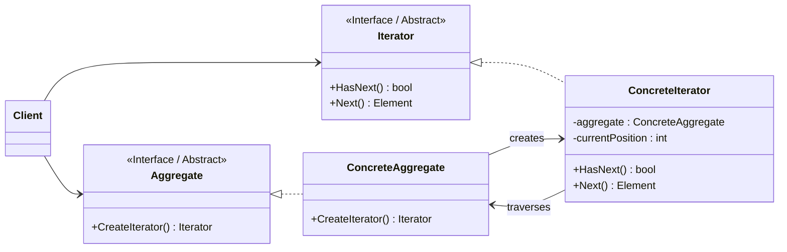
```mermaid
classDiagram
direction LR

class Client {
}

class Aggregate {
    <<Interface / Abstract>>
    +CreateIterator() Iterator
}

class ConcreteAggregate {
    +CreateIterator() Iterator
}

class Iterator {
    <<Interface / Abstract>>
    +HasNext() bool
    +Next() Element
}

class ConcreteIterator {
    -aggregate : ConcreteAggregate
    -currentPosition : int
    +HasNext() bool
    +Next() Element
}

Client --> Aggregate
Client --> Iterator
Aggregate <|.. ConcreteAggregate
Iterator <|.. ConcreteIterator
ConcreteAggregate --> ConcreteIterator : creates
ConcreteIterator --> ConcreteAggregate : traverses
```

#### Sequence Diagram

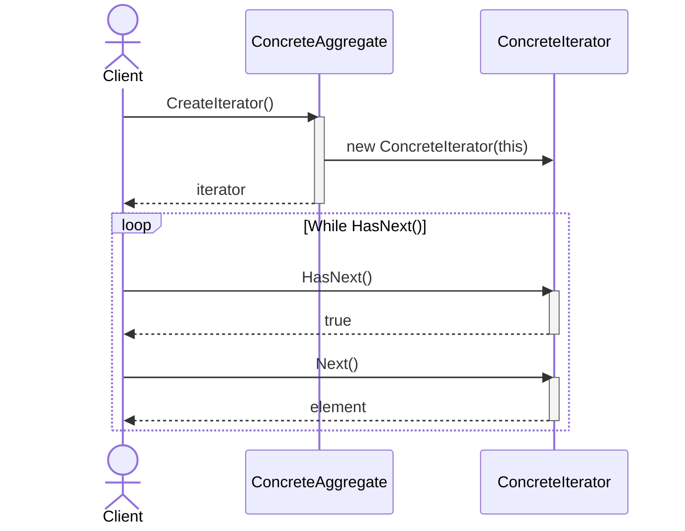
```mermaid
sequenceDiagram
    actor Client
    participant Aggregate as ConcreteAggregate
    participant Iterator as ConcreteIterator

    Client->>Aggregate: CreateIterator()
    activate Aggregate
    Aggregate->>Iterator: new ConcreteIterator(this)
    Aggregate-->>Client: iterator
    deactivate Aggregate

    loop While HasNext()
        Client->>Iterator: HasNext()
        activate Iterator
        Iterator-->>Client: true
        deactivate Iterator
        Client->>Iterator: Next()
        activate Iterator
        Iterator-->>Client: element
        deactivate Iterator
    end
```

#### Simplified Code

```csharp
public class Table
{
    public string Name { get; set; } = string.Empty;
}

public interface ICatalogIterator<T>
{
    bool HasNext();
    T Next();
}

public interface IIterableCatalog<T>
{
    ICatalogIterator<T> CreateIterator();
}

public class CatalogTableIterator : ICatalogIterator<Table>
{
    private readonly IReadOnlyList<Table> _tables;
    private int _position = 0;

    public CatalogTableIterator(IReadOnlyList<Table> tables)
    {
        _tables = tables;
    }

    public bool HasNext() => _position < _tables.Count;

    public Table Next()
    {
        if (!HasNext()) throw new InvalidOperationException("End of iterator reached.");
        return _tables[_position++];
    }
}

public class SchemaCatalog : IIterableCatalog<Table>
{
    private readonly List<Table> _tables = new();

    public void AddTable(Table table) => _tables.Add(table);

    public ICatalogIterator<Table> CreateIterator()
    {
        return new CatalogTableIterator(_tables);
    }
}
```

#### Usage Code Example

```csharp
// 1. Populate the aggregate collection (SchemaCatalog)
var schemaCatalog = new SchemaCatalog();
schemaCatalog.AddTable(new Table { Name = "Users" });
schemaCatalog.AddTable(new Table { Name = "Orders" });
schemaCatalog.AddTable(new Table { Name = "Products" });

// 2. Obtain the Iterator from the Aggregate interface
ICatalogIterator<Table> iterator = schemaCatalog.CreateIterator();

// 3. Traverse elements sequentially without exposing the underlying List
while (iterator.HasNext())
{
    Table table = iterator.Next();
    Console.WriteLine($"Found catalog table: {table.Name}");
}
```

**Benefits**

* Hides the internal collection structure.
* Provides a consistent traversal mechanism.
* Supports multiple traversal strategies.
* Separates traversal logic from collection logic.

**Application:** Traverses the database metadata hierarchy (Database, Schema, Table) sequentially without exposing the underlying representations.

**Why apply?** The Iterator Pattern provides a unified interface `ICatalogIterator` for clients (like `SchemaService`) to iterate through catalog components (Schemas in a Database, Tables in a Schema, Columns in a Table) regardless of whether they are stored in an `IReadOnlyList` or `IReadOnlyCollection`.

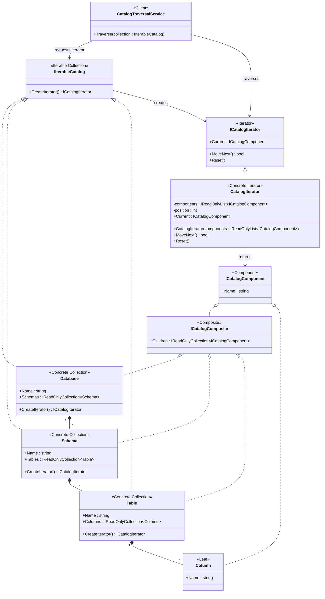
```mermaid
classDiagram
direction TB

class ICatalogComponent {
    <<Component>>
    +Name : string
}

class ICatalogComposite {
    <<Composite>>
    +Children : IReadOnlyCollection~ICatalogComponent~
}

class IIterableCatalog {
    <<Iterable Collection>>
    +CreateIterator() ICatalogIterator
}

class ICatalogIterator {
    <<Iterator>>
    +Current : ICatalogComponent
    +MoveNext() bool
    +Reset()
}

class CatalogIterator {
    <<Concrete Iterator>>
    -components : IReadOnlyList~ICatalogComponent~
    -position : int
    +CatalogIterator(components : IReadOnlyList~ICatalogComponent~)
    +Current : ICatalogComponent
    +MoveNext() bool
    +Reset()
}

class Database {
    <<Concrete Collection>>
    +Name : string
    +Schemas : IReadOnlyCollection~Schema~
    +CreateIterator() ICatalogIterator
}

class Schema {
    <<Concrete Collection>>
    +Name : string
    +Tables : IReadOnlyCollection~Table~
    +CreateIterator() ICatalogIterator
}

class Table {
    <<Concrete Collection>>
    +Name : string
    +Columns : IReadOnlyCollection~Column~
    +CreateIterator() ICatalogIterator
}

class Column {
    <<Leaf>>
    +Name : string
}

class CatalogTraversalService {
    <<Client>>
    +Traverse(collection : IIterableCatalog)
}

ICatalogComponent <|-- ICatalogComposite

ICatalogComposite <|.. Database
ICatalogComposite <|.. Schema
ICatalogComposite <|.. Table
ICatalogComponent <|.. Column

IIterableCatalog <|.. Database
IIterableCatalog <|.. Schema
IIterableCatalog <|.. Table

ICatalogIterator <|.. CatalogIterator

Database "1" *-- "*" Schema
Schema "1" *-- "*" Table
Table "1" *-- "*" Column

IIterableCatalog --> ICatalogIterator : creates
CatalogIterator --> ICatalogComponent : returns
CatalogTraversalService --> IIterableCatalog : requests iterator
CatalogTraversalService --> ICatalogIterator : traverses
```

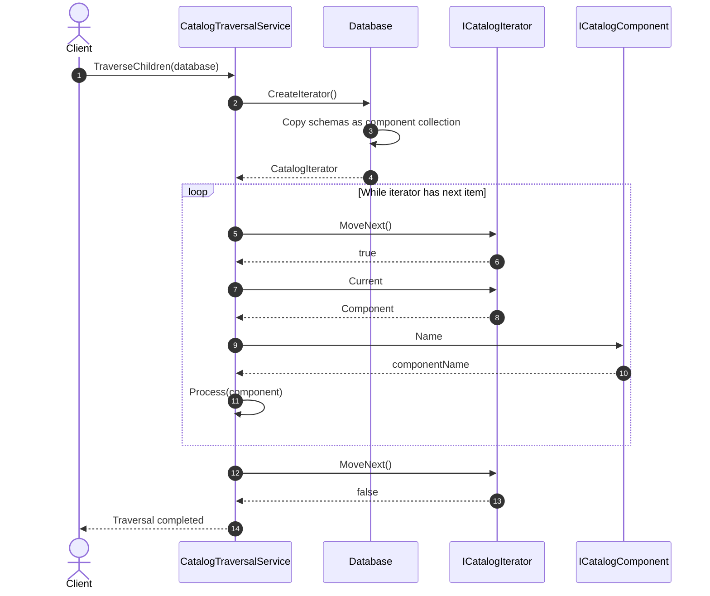
```mermaid
sequenceDiagram
    autonumber

    actor Client
    participant Service as CatalogTraversalService
    participant Database
    participant Iterator as ICatalogIterator
    participant Component as ICatalogComponent

    Client->>Service: TraverseChildren(database)

    Service->>Database: CreateIterator()
    Database->>Database: Copy schemas as component collection
    Database-->>Service: CatalogIterator

    loop While iterator has next item
        Service->>Iterator: MoveNext()
        Iterator-->>Service: true

        Service->>Iterator: Current
        Iterator-->>Service: Component

        Service->>Component: Name
        Component-->>Service: componentName

        Service->>Service: Process(component)
    end

    Service->>Iterator: MoveNext()
    Iterator-->>Service: false

    Service-->>Client: Traversal completed
```

### 6. DDL Execution (Command Pattern)

**Purpose:**
Encapsulate a request as an object, allowing it to be executed, queued, or logged independently.

**Application:**
`IDdlCommand → CreateTableCommand, CreateSchemaCommand`

**Recognition Signs:**
- Need to parameterize objects with operations/actions to execute.
- Requires queuing requests, logging operations, or executing tasks asynchronously or remotely.
- Requires support for undoable/redoable operations, transaction history, or command rollback.

#### Class Diagram

```mermaid
classDiagram
direction LR

class Client {
}

class Invoker {
    -command : Command
    +SetCommand(command : Command)
    +ExecuteCommand()
}

class Command {
    <<Interface / Abstract>>
    +Execute()
}

class ConcreteCommand {
    -receiver : Receiver
    +Execute()
}

class Receiver {
    +Action()
}

Client --> Receiver
Client ..> ConcreteCommand : creates
Invoker --> Command : executes
Command <|.. ConcreteCommand
ConcreteCommand --> Receiver : delegates
```

#### Sequence Diagram

```mermaid
sequenceDiagram
    actor Client
    participant Invoker as Invoker
    participant Command as ConcreteCommand
    participant Receiver as Receiver

    Client->>Command: new ConcreteCommand(Receiver)
    Client->>Invoker: SetCommand(Command)
    Client->>Invoker: ExecuteCommand()
    activate Invoker
    Invoker->>Command: Execute()
    activate Command
    Command->>Receiver: Action()
    activate Receiver
    Receiver-->>Command: result
    deactivate Receiver
    Command-->>Invoker: result
    deactivate Command
    Invoker-->>Client: completed
    deactivate Invoker
```

#### Simplified Code

```csharp
public interface IDdlCommand
{
    bool Execute();
}

public class SchemaService // Receiver
{
    public bool CreateTable(string schemaName, string tableName)
    {
        Console.WriteLine($"Executing DDL: Created table '{tableName}' in schema '{schemaName}'.");
        return true;
    }

    public bool CreateSchema(string schemaName)
    {
        Console.WriteLine($"Executing DDL: Created schema '{schemaName}'.");
        return true;
    }
}

public class CreateTableCommand : IDdlCommand // Concrete Command
{
    private readonly SchemaService _receiver;
    private readonly string _schemaName;
    private readonly string _tableName;

    public CreateTableCommand(SchemaService receiver, string schemaName, string tableName)
    {
        _receiver = receiver;
        _schemaName = schemaName;
        _tableName = tableName;
    }

    public bool Execute() => _receiver.CreateTable(_schemaName, _tableName);
}

public class CreateSchemaCommand : IDdlCommand // Concrete Command
{
    private readonly SchemaService _receiver;
    private readonly string _schemaName;

    public CreateSchemaCommand(SchemaService receiver, string schemaName)
    {
        _receiver = receiver;
        _schemaName = schemaName;
    }

    public bool Execute() => _receiver.CreateSchema(_schemaName);
}

public class DdlCommandExecutor // Invoker
{
    private readonly List<IDdlCommand> _history = new();

    public bool ExecuteCommand(IDdlCommand command)
    {
        bool success = command.Execute();
        if (success) _history.Add(command);
        return success;
    }
}
```

#### Usage Code Example

```csharp
// 1. Initialize receiver service and invoker executor
var schemaService = new SchemaService();
var executor = new DdlCommandExecutor();

// 2. Encapsulate DDL requests into command objects
IDdlCommand cmdSchema = new CreateSchemaCommand(schemaService, "public");
IDdlCommand cmdTable = new CreateTableCommand(schemaService, "public", "Users");

// 3. Invoker executes commands independently without knowing receiver internals
executor.ExecuteCommand(cmdSchema);
executor.ExecuteCommand(cmdTable);
```

**Benefits**

* Decouples the sender from the receiver.
* Supports undo, redo, logging, and command queues.
* Makes adding new commands easy.
* Follows the Open/Closed Principle.

**Application:** Encapsulates Data Definition Language (DDL) requests (like `CreateTable`, `CreateSchema`) as standalone objects that contain all information about the request.

**Why apply?** The Command Pattern allows the `QueryProcessor` to parameterize the `DdlCommandExecutor` with different requests, decouple the invoker from the receivers (`SchemaService`, `DatabaseService`), and supports future capabilities like queuing, logging, or undoing operations.

```mermaid
classDiagram
direction LR

class IDdlCommand {
    <<Command>>
    +Execute(context : DdlExecutionContext) DdlResult
}

class CreateSchemaCommand {
    <<Concrete Command>>
    -receiver : IDatabaseService
    -database : Database
    -schemaName : string
    +Execute(context : DdlExecutionContext) DdlResult
}

class CreateTableCommand {
    <<Concrete Command>>
    -receiver : ISchemaService
    -schema : Schema
    -definition : TableDefinition
    +Execute(context : DdlExecutionContext) DdlResult
}

class AlterTableCommand {
    <<Concrete Command>>
    -receiver : ISchemaService
    -schema : Schema
    -tableName : string
    -operation : TableAlterOperation
    +Execute(context : DdlExecutionContext) DdlResult
}

class DropTableCommand {
    <<Concrete Command>>
    -receiver : ISchemaService
    -schema : Schema
    -tableName : string
    +Execute(context : DdlExecutionContext) DdlResult
}

class IDdlCommandExecutor {
    <<Invoker>>
    +Execute(
        command : IDdlCommand,
        context : DdlExecutionContext
    ) DdlResult
}

class DdlCommandExecutor {
    <<Concrete Invoker>>
}

class IDdlCommandFactory {
    <<Factory>>
    +Create(request : DdlRequest) IDdlCommand
}

class IDatabaseService {
    <<Receiver>>
    +CreateSchema(
        database : Database,
        name : string,
        context : DdlExecutionContext
    ) Schema
}

class ISchemaService {
    <<Receiver>>
    +CreateTable(
        schema : Schema,
        definition : TableDefinition,
        context : DdlExecutionContext
    ) Table

    +AlterTable(
        schema : Schema,
        tableName : string,
        operation : TableAlterOperation,
        context : DdlExecutionContext
    ) Table

    +DropTable(
        schema : Schema,
        tableName : string,
        context : DdlExecutionContext
    )
}

class DdlRequest
class DdlExecutionContext
class DdlResult
class Database
class Schema
class TableDefinition
class TableAlterOperation

IDdlCommand <|.. CreateSchemaCommand
IDdlCommand <|.. CreateTableCommand
IDdlCommand <|.. AlterTableCommand
IDdlCommand <|.. DropTableCommand

IDdlCommandExecutor <|.. DdlCommandExecutor
DdlCommandExecutor --> IDdlCommand : invokes

IDdlCommandFactory --> DdlRequest : reads
IDdlCommandFactory --> IDdlCommand : creates

CreateSchemaCommand --> IDatabaseService : receiver
CreateSchemaCommand --> Database : target

CreateTableCommand --> ISchemaService : receiver
CreateTableCommand --> Schema : target
CreateTableCommand --> TableDefinition : request data

AlterTableCommand --> ISchemaService : receiver
AlterTableCommand --> TableAlterOperation : request data

DropTableCommand --> ISchemaService : receiver
```

```mermaid
sequenceDiagram
    autonumber

    actor Client
    participant Executor as IDdlCommandExecutor
    participant Command as CreateSchemaCommand
    participant Service as IDatabaseService
    participant Tx as IMetadataTransactionPort
    participant Database
    participant Catalog as ICatalogManager

    Client->>Executor: Execute(command, context)
    Executor->>Command: Execute(context)

    Command->>Service: CreateSchema(database, schemaName, context)
    activate Service

    Service->>Tx: Begin(context)
    Service->>Database: GetSchema(schemaName)

    alt Schema already exists
        Database-->>Service: Existing Schema
        Service->>Tx: Rollback(context)
        Service-->>Command: throw DuplicateSchemaException

    else Schema does not exist
        Database-->>Service: Not found

        Service->>Service: new Schema(schemaName)
        Service->>Database: AddSchema(schema)
        Database-->>Service: Success

        Service->>Catalog: Register(schema)

        alt Registration failed
            Catalog-->>Service: throw CatalogException
            Service->>Database: RemoveSchema(schemaName)
            Service->>Tx: Rollback(context)
            Service-->>Command: propagate exception

        else Registration succeeded
            Catalog-->>Service: Success
            Service->>Tx: Commit(context)
            Service-->>Command: Schema
        end
    end

    deactivate Service

    Command-->>Executor: DdlResult
    Executor-->>Client: DdlResult
```

### 7. DDL Coordination (Facade Pattern)

**Purpose:**
Provide a simple interface to a complex subsystem.

**Application:**
`SchemaService, DatabaseService → Subsystems (CatalogManager, TableDirector, StorageEngine)`

**Recognition Signs:**
- Complex subsystem consists of numerous interdependent classes and interfaces that clients find difficult to configure or invoke directly.
- Need to provide a simplified, higher-level interface for standard, common use cases without locking out advanced subsystem access.
- Want to decouple client code from the internal implementation details and component dependencies of a subsystem.

#### Class Diagram

```mermaid
classDiagram
direction LR

class Client {
}

class Facade {
    -subsystemA : SubsystemA
    -subsystemB : SubsystemB
    -subsystemC : SubsystemC
    +Operation()
}

class SubsystemA {
    +OperationA()
}

class SubsystemB {
    +OperationB()
}

class SubsystemC {
    +OperationC()
}

Client --> Facade
Facade --> SubsystemA
Facade --> SubsystemB
Facade --> SubsystemC
```

#### Sequence Diagram

```mermaid
sequenceDiagram
    actor Client
    participant Facade as Facade
    participant SubA as SubsystemA
    participant SubB as SubsystemB
    participant SubC as SubsystemC

    Client->>Facade: Operation()
    activate Facade
    Facade->>SubA: OperationA()
    activate SubA
    SubA-->>Facade: resultA
    deactivate SubA
    Facade->>SubB: OperationB()
    activate SubB
    SubB-->>Facade: resultB
    deactivate SubB
    Facade->>SubC: OperationC()
    activate SubC
    SubC-->>Facade: resultC
    deactivate SubC
    Facade-->>Client: completed
    deactivate Facade
```

#### Simplified Code

```csharp
public class CatalogManager
{
    public void RegisterTable(string tableName) => Console.WriteLine($"Catalog: Registered table '{tableName}'.");
}

public class TableDirector
{
    public void BuildTable(string tableName) => Console.WriteLine($"Director: Built table metadata for '{tableName}'.");
}

public class StorageEngine
{
    public void AllocateTableStorage(string tableName) => Console.WriteLine($"Storage: Allocated storage pages for '{tableName}'.");
}

public class SchemaService // Facade
{
    private readonly CatalogManager _catalog = new();
    private readonly TableDirector _director = new();
    private readonly StorageEngine _storage = new();

    // High-level unified operation coordinating the underlying subsystems
    public void CreateTable(string tableName)
    {
        _director.BuildTable(tableName);
        _storage.AllocateTableStorage(tableName);
        _catalog.RegisterTable(tableName);
        Console.WriteLine($"SchemaService: Successfully created table '{tableName}'.");
    }
}
```

#### Usage Code Example

```csharp
// 1. Client instantiates the Facade service
var schemaService = new SchemaService();

// 2. Client executes complex DDL workflow with a single simple call,
// avoiding direct interaction with CatalogManager, TableDirector, and StorageEngine
schemaService.CreateTable("Users");
```

**Benefits**

* Hides subsystem complexity.
* Provides a simple, unified interface.
* Reduces coupling between clients and subsystem classes.
* Makes the subsystem easier to use and maintain.

**Application:** `SchemaService` and `DatabaseService` coordinate complex Create, Drop, and Alter operations for database objects.

**Why apply?** The Facade Pattern provides a unified, high-level interface for DDL operations, shielding the clients (like DDL Commands) from the complexities of the underlying subsystems. Instead of manually coordinating `CatalogManager`, `TableDirector`, `StorageEngine`, and various factories, the clients simply call methods like `CreateTable()` or `DropSchema()` on these services.

```mermaid
classDiagram
direction LR

class IDatabaseService {
    <<Facade Interface>>

    +CreateSchema(
        database : Database,
        definition : SchemaDefinition
    ) Schema

    +DropSchema(
        database : Database,
        name : string,
        cascade : bool
    ) DdlResult

    +RenameSchema(
        database : Database,
        oldName : string,
        newName : string
    ) Schema
}

class ISchemaService {
    <<Facade Interface>>

    +CreateTable(
        schema : Schema,
        definition : TableDefinition
    ) Table

    +DropTable(
        schema : Schema,
        name : string,
        cascade : bool
    ) DdlResult

    +AlterTable(
        schema : Schema,
        tableName : string,
        operation : TableAlterOperation
    ) Table

    +CreateView(
        schema : Schema,
        definition : ViewDefinition
    ) View

    +CreateProcedure(
        schema : Schema,
        definition : ProcedureDefinition
    ) StoredProcedure

    +CreateSequence(
        schema : Schema,
        definition : SequenceDefinition
    ) Sequence
}

class DatabaseService {
    <<Facade>>

    -catalog : ICatalogManager
}

class SchemaService {
    <<Facade>>

    -catalog : ICatalogManager
    -dependencyService : ICatalogDependencyService
    -tableDirector : TableDirector
    -storagePort : IStorageObjectPort
}

class ICatalogManager {
    <<Subsystem>>

    +ObjectExists(parent, name) bool
    +Register(component)
    +Update(component)
    +Remove(component)
}

class ICatalogDependencyService {
    <<Subsystem>>

    +GetDependencies(component) IReadOnlyCollection~ICatalogComponent~
    +RemoveDependencies(component)
}

class TableDirector {
    <<Subsystem>>

    +Construct(definition : TableDefinition) Table
}

class IStorageObjectPort {
    <<External Subsystem Port>>

    +AllocateTable(table : Table)
    +AlterTable(table : Table, operation : TableAlterOperation)
    +DeallocateTable(table : Table)
}

class IMetadataTransactionPort {
    <<External Subsystem Port>>

    +Begin()
    +Commit()
    +Rollback()
}

class Database
class Schema
class Table
class View
class StoredProcedure
class Sequence
class SchemaDefinition
class TableDefinition
class TableAlterOperation
class ViewDefinition
class ProcedureDefinition
class SequenceDefinition
class DdlResult
class ICatalogComponent

IDatabaseService <|.. DatabaseService
ISchemaService <|.. SchemaService

DatabaseService --> ICatalogManager
DatabaseService --> Database

SchemaService --> ICatalogManager
SchemaService --> ICatalogDependencyService
SchemaService --> TableDirector
SchemaService --> IStorageObjectPort

SchemaService --> Schema
SchemaService --> Table
SchemaService --> View
SchemaService --> StoredProcedure
SchemaService --> Sequence
```

```mermaid
sequenceDiagram
    autonumber

    actor Client
    participant Facade as ISchemaService
    participant Catalog as ICatalogManager
    participant Director as TableDirector
    participant Storage as IStorageObjectPort
    participant Schema
    participant Tx as IMetadataTransactionPort

    Client->>Facade: CreateTable(schema, definition, context)

    Facade->>Catalog: ObjectExists(schema, definition.Name)
    Catalog-->>Facade: exists

    alt Table already exists
        Facade-->>Client: throw DuplicateObjectException
    else Table does not exist
        Facade->>Tx: Begin(context)

        Facade->>Director: Construct(definition)
        Director-->>Facade: Table

        Facade->>Storage: AllocateTable(table)

        alt Storage allocation failed
            Storage-->>Facade: error
            Facade->>Tx: Rollback(context)
            Facade-->>Client: DdlResult.Failed
        else Storage allocated
            Storage-->>Facade: success

            Facade->>Schema: AddTable(table)
            Schema-->>Facade: success

            Facade->>Catalog: Register(table)

            alt Catalog registration failed
                Catalog-->>Facade: error
                Facade->>Storage: DeallocateTable(table)
                Facade->>Schema: RemoveTable(table.Name)
                Facade->>Tx: Rollback(context)
                Facade-->>Client: DdlResult.Failed
            else Catalog registered
                Catalog-->>Facade: success
                Facade->>Tx: Commit(context)
                Facade-->>Client: Table
            end
        end
    end
```

### 8. Metadata Events (Observer Pattern)

**Purpose:**
Define a one-to-many dependency so that when an object's state changes, all registered observers are notified automatically.

**Application:**
`MetadataEventPublisher → CatalogCacheObserver, MetadataAuditObserver`

**Recognition Signs:**
- Changes to one object's state require updating other dependent objects, but the exact set of dependent objects is dynamic or unknown beforehand.
- An object should be able to notify other interested objects without making assumptions about their concrete classes (loose coupling).
- Establishes a one-to-many publish-subscribe dependency relationship between objects.

#### Class Diagram

```mermaid
classDiagram
direction LR

class Client {
}

class Subject {
    <<Interface / Abstract>>
    +Attach(observer : Observer)
    +Detach(observer : Observer)
    +Notify()
}

class ConcreteSubject {
    -observers : List~Observer~
    -state : State
    +GetState() State
    +SetState(state : State)
}

class Observer {
    <<Interface / Abstract>>
    +Update()
}

class ConcreteObserverA {
    <<Concrete Observer>>
    -subject : ConcreteSubject
    +Update()
}

class ConcreteObserverB {
    <<Concrete Observer>>
    -subject : ConcreteSubject
    +Update()
}

Client --> ConcreteSubject
Client --> ConcreteObserverA
Subject <|.. ConcreteSubject
Observer <|.. ConcreteObserverA
Observer <|.. ConcreteObserverB
Subject "1" o-- "*" Observer : observers
ConcreteObserverA --> ConcreteSubject : observes
```

#### Sequence Diagram

```mermaid
sequenceDiagram
    actor Client
    participant Subject as ConcreteSubject
    participant ObsA as ConcreteObserverA
    participant ObsB as ConcreteObserverB

    Client->>Subject: SetState(newState)
    activate Subject
    Subject->>Subject: Notify()
    Subject->>ObsA: Update()
    activate ObsA
    ObsA-->>Subject: done
    deactivate ObsA
    Subject->>ObsB: Update()
    activate ObsB
    ObsB-->>Subject: done
    deactivate ObsB
    Subject-->>Client: state updated
    deactivate Subject
```

#### Simplified Code

```csharp
public class MetadataEvent
{
    public string EventType { get; set; } = string.Empty;
    public string ObjectName { get; set; } = string.Empty;
}

public interface IMetadataObserver
{
    void OnMetadataChanged(MetadataEvent evt);
}

public class CatalogCacheObserver : IMetadataObserver
{
    public void OnMetadataChanged(MetadataEvent evt)
    {
        Console.WriteLine($"CacheObserver: Invalidating cache for '{evt.ObjectName}' due to {evt.EventType}.");
    }
}

public class MetadataAuditObserver : IMetadataObserver
{
    public void OnMetadataChanged(MetadataEvent evt)
    {
        Console.WriteLine($"AuditObserver: Logged event {evt.EventType} on object '{evt.ObjectName}'.");
    }
}

public class MetadataEventPublisher
{
    private readonly List<IMetadataObserver> _observers = new();

    public void Subscribe(IMetadataObserver observer) => _observers.Add(observer);
    public void Unsubscribe(IMetadataObserver observer) => _observers.Remove(observer);

    public void Publish(MetadataEvent evt)
    {
        foreach (var observer in _observers)
        {
            observer.OnMetadataChanged(evt);
        }
    }
}
```

#### Usage Code Example

```csharp
// 1. Initialize event publisher (Subject)
var publisher = new MetadataEventPublisher();

// 2. Subscribe concrete observers (Cache, Audit)
publisher.Subscribe(new CatalogCacheObserver());
publisher.Subscribe(new MetadataAuditObserver());

// 3. Publish a metadata event when DDL occurs
var evt = new MetadataEvent { EventType = "TABLE_CREATED", ObjectName = "Users" };
publisher.Publish(evt);
```

**Benefits**

* Decouples the subject from its observers.
* Supports one-to-many event notification.
* Makes adding new observers easy.
* Follows the Open/Closed Principle.

**Application:** `IMetadataEventPublisher` notifies various handlers (`CacheInvalidationHandler`, `StatisticsUpdateHandler`, `AuditLoggingHandler`) whenever metadata (like Tables or Schemas) is created, altered, or dropped.

**Why apply?** The Observer Pattern decouples the core metadata operations from secondary tasks like caching, statistics gathering, and auditing. Instead of hardcoding these reactions inside `CatalogManager` or DDL Commands, the system simply publishes a `MetadataEvent`. Handlers independently subscribe to these events and react accordingly, making the system highly extensible (e.g., adding a new handler doesn't require modifying existing catalog code).

```mermaid
classDiagram
direction LR

%% =====================================================
%% Subject / Publisher
%% =====================================================

class IMetadataEventPublisher {
    <<Subject>>
    +Subscribe(observer : IMetadataObserver)
    +Unsubscribe(observer : IMetadataObserver)
    +Publish(event : MetadataEvent)
}

class MetadataEventPublisher {
    <<Concrete Subject>>
    -observers : List~IMetadataObserver~
    +Subscribe(observer : IMetadataObserver)
    +Unsubscribe(observer : IMetadataObserver)
    +Publish(event : MetadataEvent)
}

%% =====================================================
%% Observer Contract
%% =====================================================

class IMetadataObserver {
    <<Observer>>
    +OnMetadataChanged(event : MetadataEvent)
}

%% =====================================================
%% Concrete Observers
%% =====================================================

class CatalogCacheObserver {
    <<Concrete Observer>>
    -cache : ICatalogCache
    +OnMetadataChanged(event : MetadataEvent)
}

class MetadataStatisticsObserver {
    <<Concrete Observer>>
    -statisticsStore : IMetadataStatisticsStore
    +OnMetadataChanged(event : MetadataEvent)
}

class MetadataAuditObserver {
    <<Concrete Observer>>
    -auditRepository : IMetadataAuditRepository
    +OnMetadataChanged(event : MetadataEvent)
}

%% =====================================================
%% Metadata Events
%% =====================================================

class MetadataEvent {
    <<Event>>
    +EventId : Guid
    +EventType : MetadataEventType
    +ObjectId : int
    +ObjectType : CatalogObjectType
    +ObjectName : string
    +ParentId : int
    +Timestamp : DateTime
    +Actor : string
    +PreviousSnapshot : MetadataSnapshot
    +CurrentSnapshot : MetadataSnapshot
}

class MetadataSnapshot {
    <<Event Data>>
    +Properties : IReadOnlyDictionary~string, object~
}

class MetadataEventType {
    <<enumeration>>
    CREATED
    UPDATED
    RENAMED
    REMOVED
}

class CatalogObjectType {
    <<enumeration>>
    DATABASE
    SCHEMA
    TABLE
    COLUMN
    CONSTRAINT
    INDEX
    PARTITION
    TRIGGER
    VIEW
    STORED_PROCEDURE
    SEQUENCE
}

%% =====================================================
%% Cache Subsystem
%% =====================================================

class ICatalogCache {
    <<Cache Port>>
    +Get(key : CatalogCacheKey) ICatalogComponent
    +Set(key : CatalogCacheKey, component : ICatalogComponent)
    +Remove(key : CatalogCacheKey)
    +InvalidateChildren(parentId : int)
}

class CatalogCacheKey {
    <<Value Object>>
    +ObjectType : CatalogObjectType
    +ObjectId : int
    +ParentId : int
    +Name : string
}

%% =====================================================
%% Statistics Subsystem
%% =====================================================

class IMetadataStatisticsStore {
    <<Statistics Port>>
    +IncrementObjectCount(type : CatalogObjectType)
    +DecrementObjectCount(type : CatalogObjectType)
    +RecordModification(type : CatalogObjectType, timestamp : DateTime)
    +RecordRename(type : CatalogObjectType)
}

%% =====================================================
%% Audit Subsystem
%% =====================================================

class IMetadataAuditRepository {
    <<Audit Port>>
    +Add(entry : MetadataAuditEntry)
}

class MetadataAuditEntry {
    <<Audit Record>>
    +AuditId : Guid
    +EventType : MetadataEventType
    +ObjectType : CatalogObjectType
    +ObjectId : int
    +ObjectName : string
    +Actor : string
    +Timestamp : DateTime
    +PreviousValues : MetadataSnapshot
    +CurrentValues : MetadataSnapshot
}

%% =====================================================
%% Relationships
%% =====================================================

IMetadataEventPublisher <|.. MetadataEventPublisher
IMetadataObserver <|.. CatalogCacheObserver
IMetadataObserver <|.. MetadataStatisticsObserver
IMetadataObserver <|.. MetadataAuditObserver

MetadataEventPublisher o-- "*" IMetadataObserver : observers
MetadataEventPublisher --> MetadataEvent : publishes
IMetadataObserver --> MetadataEvent : receives

MetadataEvent --> MetadataEventType
MetadataEvent --> CatalogObjectType
MetadataEvent --> MetadataSnapshot

CatalogCacheObserver --> ICatalogCache : updates or invalidates
CatalogCacheObserver --> CatalogCacheKey : creates

MetadataStatisticsObserver --> IMetadataStatisticsStore : updates statistics

MetadataAuditObserver --> IMetadataAuditRepository : writes audit
MetadataAuditObserver --> MetadataAuditEntry : creates

MetadataAuditEntry --> MetadataEventType
MetadataAuditEntry --> CatalogObjectType
MetadataAuditEntry --> MetadataSnapshot

ICatalogCache --> ICatalogComponent : caches
CatalogCacheKey --> CatalogObjectType
```

```mermaid
sequenceDiagram
    autonumber

    actor Client
    participant Service as SchemaService
    participant Tx as IMetadataTransactionPort
    participant Director as TableDirector
    participant Storage as IStorageObjectPort
    participant Schema
    participant Catalog as CatalogManager
    participant Repo as ITableCatalogRepository
    participant Collector as IMetadataEventCollector
    participant Dispatcher as MetadataEventCommitDispatcher
    participant Publisher as IMetadataEventPublisher
    participant Cache as CatalogCacheObserver
    participant Stats as MetadataStatisticsObserver
    participant Audit as MetadataAuditObserver

    Client->>Service: CreateTable(schema, definition)

    Service->>Tx: Begin()

    Service->>Director: Construct(definition)
    Director-->>Service: Table

    Service->>Storage: AllocateTable(table)
    Storage-->>Service: Success

    Service->>Schema: AddTable(table)
    Schema-->>Service: Success

    Service->>Catalog: Register(table, context)
    Catalog->>Repo: Add(table)
    Repo-->>Catalog: Success

    Catalog->>Collector: Add(MetadataCreatedEvent)
    Collector-->>Catalog: Event queued

    Catalog-->>Service: Registration completed

    alt Transaction commit succeeds
        Service->>Tx: Commit()
        Tx->>Dispatcher: DispatchCommittedEvents()

        Dispatcher->>Collector: GetPendingEvents()
        Collector-->>Dispatcher: Events

        loop Each committed metadata event
            Dispatcher->>Publisher: Publish(event)

            par Notify cache
                Publisher->>Cache: OnMetadataChanged(event)
                Cache->>Cache: Update or invalidate cache
            and Notify statistics
                Publisher->>Stats: OnMetadataChanged(event)
                Stats->>Stats: Increment table count
            and Notify audit
                Publisher->>Audit: OnMetadataChanged(event)
                Audit->>Audit: Save audit record
            end
        end

        Dispatcher->>Collector: Clear()
        Service-->>Client: Table

    else Transaction fails
        Service->>Tx: Rollback()
        Tx->>Dispatcher: DiscardRolledBackEvents()
        Dispatcher->>Collector: Clear()
        Service-->>Client: DDL failure
    end
```

### 9. DDL Script Generation (Template Pattern)

**Purpose:**
Define the skeleton of an algorithm in a base class while allowing subclasses to customize specific steps without changing the overall process.

**Application:**
`DdlScriptGenerator → CreateTableScriptGenerator, DropTableScriptGenerator`

**Recognition Signs:**
- Multiple classes share an identical invariant sequence or workflow of steps, but differ in specific step implementations.
- Avoids code duplication across similar algorithms by consolidating shared steps in a common abstract superclass.
- Enforces the "Hollywood Principle" ("Don't call us, we'll call you"), allowing the base class to control when subclass steps execute.

#### Class Diagram

```mermaid
classDiagram
direction LR

class Client {
}

class AbstractClass {
    <<Abstract Class>>
    +TemplateMethod()
    #PrimitiveOperation1()*
    #PrimitiveOperation2()*
    #Hook()
}

class ConcreteClassA {
    <<Concrete Class>>
    #PrimitiveOperation1()
    #PrimitiveOperation2()
}

class ConcreteClassB {
    <<Concrete Class>>
    #PrimitiveOperation1()
    #PrimitiveOperation2()
    #Hook()
}

Client --> AbstractClass
AbstractClass <|-- ConcreteClassA
AbstractClass <|-- ConcreteClassB
```

#### Sequence Diagram

```mermaid
sequenceDiagram
    actor Client
    participant Generator as ConcreteClassA
    participant Base as AbstractClass

    Client->>Generator: TemplateMethod()
    activate Generator
    Generator->>Base: PrimitiveOperation1()
    activate Base
    Base-->>Generator: done
    deactivate Base
    Generator->>Generator: PrimitiveOperation2()
    Generator->>Base: Hook()
    activate Base
    Base-->>Generator: done
    deactivate Base
    Generator-->>Client: result
    deactivate Generator
```

#### Simplified Code

```csharp
public abstract class DdlScriptGenerator
{
    // Template Method: defines the fixed DDL generation workflow
    public string GenerateDdl()
    {
        var sb = new StringBuilder();
        sb.AppendLine(BuildHeader());
        sb.AppendLine(BuildBody());
        sb.AppendLine(BuildFooter());
        return sb.ToString();
    }

    protected virtual string BuildHeader() => "-- Auto-generated DDL Script";
    protected abstract string BuildBody();
    protected virtual string BuildFooter() => ";";
}

public class CreateTableScriptGenerator : DdlScriptGenerator
{
    private readonly string _tableName;
    private readonly List<string> _columns;

    public CreateTableScriptGenerator(string tableName, List<string> columns)
    {
        _tableName = tableName;
        _columns = columns;
    }

    protected override string BuildBody()
    {
        return $"CREATE TABLE {_tableName} (\n  {string.Join(",\n  ", _columns)}\n)";
    }
}

public class DropTableScriptGenerator : DdlScriptGenerator
{
    private readonly string _tableName;

    public DropTableScriptGenerator(string tableName)
    {
        _tableName = tableName;
    }

    protected override string BuildBody()
    {
        return $"DROP TABLE {_tableName}";
    }
}
```

#### Usage Code Example

```csharp
// 1. Instantiate concrete DDL generators
DdlScriptGenerator createGen = new CreateTableScriptGenerator("Users", new List<string> { "Id INT", "Username VARCHAR(50)" });
DdlScriptGenerator dropGen = new DropTableScriptGenerator("Users");

// 2. Execute Template Method to produce complete SQL DDL scripts
string createSql = createGen.GenerateDdl();
string dropSql = dropGen.GenerateDdl();

Console.WriteLine(createSql);
Console.WriteLine(dropSql);
```

**Benefits**

* Reuses common algorithm steps in the base class.
* Keeps the overall workflow consistent.
* Allows subclasses to customize specific steps.
* Reduces duplicated code between similar processes.
* Applies the Hollywood Principle: the base class controls when subclass methods are called.

**Application:** `DDLCommandTemplate` and concrete classes like `CreateTableCommand`, `AlterTableCommand`, and `DropTableCommand`.

**Why apply?** The Template Method Pattern provides a fixed execution workflow for DDL operations. The base template class defines the overarching skeleton—such as validating permissions, starting a transaction, applying the specific metadata change, persisting the catalog, and publishing events. Concrete command subclasses implement only the specific metadata logic (e.g., how to create or alter a table), ensuring that the complex, overarching lifecycle is consistently enforced without duplicating code across every DDL command.

```mermaid
classDiagram
direction TB

class DdlScriptGenerator {
    <<abstract Template>>
    +Generate() string
    #BuildHeader() string*
    #BuildBody() string*
    #BuildFooter() string
}

class CreateTableScriptGenerator {
    <<Concrete Template>>
    -table : Table
    +CreateTableScriptGenerator(table : Table)
    #BuildHeader() string
    #BuildBody() string
}

class AlterTableScriptGenerator {
    <<Concrete Template>>
    -table : Table
    -operation : TableAlterOperation
    +AlterTableScriptGenerator(table : Table, operation : TableAlterOperation)
    #BuildHeader() string
    #BuildBody() string
}

class DropTableScriptGenerator {
    <<Concrete Template>>
    -tableName : string
    -cascade : bool
    +DropTableScriptGenerator(tableName : string, cascade : bool)
    #BuildHeader() string
    #BuildBody() string
}

class CreateSchemaScriptGenerator {
    <<Concrete Template>>
    -schema : Schema
    +CreateSchemaScriptGenerator(schema : Schema)
    #BuildHeader() string
    #BuildBody() string
}

class Table {
    +TableId : int
    +Name : string
    +Parent : Schema
    +Columns : IReadOnlyCollection~Column~
    +Constraints : IReadOnlyCollection~Constraint~
    +Indexes : IReadOnlyCollection~Index~
}

class TableAlterOperation {
    <<Command Data>>
    +Type : TableAlterType
    +Definition : object
}

DdlScriptGenerator <|-- CreateTableScriptGenerator
DdlScriptGenerator <|-- AlterTableScriptGenerator
DdlScriptGenerator <|-- DropTableScriptGenerator
DdlScriptGenerator <|-- CreateSchemaScriptGenerator

CreateTableScriptGenerator --> Table : reads
AlterTableScriptGenerator --> Table : reads
AlterTableScriptGenerator --> TableAlterOperation : reads
```

```mermaid
sequenceDiagram
    autonumber

    actor Client
    participant Generator as CreateTableScriptGenerator
    participant Table
    participant Column
    participant Constraint
    participant Index

    Client->>Generator: new CreateTableScriptGenerator(table)
    Client->>Generator: Generate()

    Note over Generator: Template Method starts

    Generator->>Generator: BuildHeader()
    Generator->>Table: Name, Parent.Name
    Table-->>Generator: schema and table name

    Generator->>Generator: BuildBody()

    loop Each Column
        Generator->>Column: Name, DataType, Nullable, DefaultValue
        Column-->>Generator: column definition fragment
    end

    loop Each Constraint
        Generator->>Constraint: Name, Type, Columns
        Constraint-->>Generator: constraint definition fragment
    end

    loop Each Index
        Generator->>Index: Name, Columns, Unique
        Index-->>Generator: index definition fragment
    end

    Generator->>Generator: BuildFooter()
    Note over Generator: Shared base returns

    Generator-->>Client: Complete CREATE TABLE DDL script
```

### 10. Metadata Utility (Visitor Pattern)

**Purpose:**
Separate an algorithm from the object structure on which it operates, allowing new operations to be added without modifying existing classes.

**Application:**
`DDLExportVisitor, DependencyScanVisitor → IMetadataElement (Database, Schema, Table, Column)`

**Recognition Signs:**
- Need to perform operations across a complex object structure (e.g., Composite tree), but don't want to clutter element classes with unrelated operations.
- The object structure classes rarely change, but new operations on the elements are frequently added over time.
- Implements Double Dispatch (`element.Accept(visitor)` calls `visitor.VisitElement(this)`).

#### Class Diagram

```mermaid
classDiagram
direction LR

class Client {
}

class Visitor {
    <<Interface / Abstract>>
    +VisitConcreteElementA(element : ConcreteElementA)
    +VisitConcreteElementB(element : ConcreteElementB)
}

class ConcreteVisitor1 {
    <<Concrete Visitor>>
    +VisitConcreteElementA(element : ConcreteElementA)
    +VisitConcreteElementB(element : ConcreteElementB)
}

class Element {
    <<Interface / Abstract>>
    +Accept(visitor : Visitor)
}

class ConcreteElementA {
    <<Concrete Element>>
    +Accept(visitor : Visitor)
}

class ConcreteElementB {
    <<Concrete Element>>
    +Accept(visitor : Visitor)
}

Client --> Visitor
Client --> Element
Visitor <|.. ConcreteVisitor1
Element <|.. ConcreteElementA
Element <|.. ConcreteElementB
ConcreteElementA ..> Visitor : accepts
ConcreteElementB ..> Visitor : accepts
```

#### Sequence Diagram

```mermaid
sequenceDiagram
    actor Client
    participant Element as ConcreteElementA
    participant Visitor as ConcreteVisitor1

    Client->>Element: Accept(visitor)
    activate Element
    Element->>Visitor: VisitConcreteElementA(this)
    activate Visitor
    Visitor-->>Element: result
    deactivate Visitor
    Element-->>Client: completed
    deactivate Element
```

#### Simplified Code

```csharp
public interface IMetadataVisitor
{
    void VisitTable(TableElement table);
    void VisitColumn(ColumnElement column);
}

public interface IMetadataElement
{
    void Accept(IMetadataVisitor visitor);
}

public class TableElement : IMetadataElement
{
    public string Name { get; set; } = string.Empty;
    public List<ColumnElement> Columns { get; } = new();

    public void Accept(IMetadataVisitor visitor)
    {
        visitor.VisitTable(this);
        foreach (var col in Columns)
        {
            col.Accept(visitor);
        }
    }
}

public class ColumnElement : IMetadataElement
{
    public string Name { get; set; } = string.Empty;
    public string DataType { get; set; } = "INT";

    public void Accept(IMetadataVisitor visitor)
    {
        visitor.VisitColumn(this);
    }
}

public class DDLExportVisitor : IMetadataVisitor
{
    public StringBuilder Ddl { get; } = new();

    public void VisitTable(TableElement table)
    {
        Ddl.AppendLine($"CREATE TABLE {table.Name} (");
    }

    public void VisitColumn(ColumnElement column)
    {
        Ddl.AppendLine($"  {column.Name} {column.DataType},");
    }
}
```

#### Usage Code Example

```csharp
// 1. Build element structure
var table = new TableElement { Name = "Users" };
table.Columns.Add(new ColumnElement { Name = "Id", DataType = "INT" });
table.Columns.Add(new ColumnElement { Name = "Email", DataType = "VARCHAR(100)" });

// 2. Instantiate visitor
var visitor = new DDLExportVisitor();

// 3. Traversal via Double Dispatch
table.Accept(visitor);

// 4. Retrieve output
Console.WriteLine(visitor.Ddl.ToString());
```

**Benefits**

* Follows Open/Closed Principle: easily add new operations without altering element classes.
* Follows Single Responsibility Principle: consolidates related operations in visitor classes.
* Accumulates state while traversing an object structure.

**Application:** Exporting DDL scripts (`DDLExportVisitor`) and scanning object dependencies (`DependencyScanVisitor`) without modifying catalog components.

**Why apply?** The Visitor Pattern enables adding new operations like exporting DDL syntax or scanning dependencies without modifying the core metadata classes (`Database`, `Schema`, `Table`, `Column`). `ICatalogComponent` instances simply accept an `IMetadataVisitor`, which encapsulates the specific utility operation.

```mermaid
classDiagram
direction LR

class IMetadataElement {
    <<Element>>
    +Accept(visitor : IMetadataVisitor) void
}

class IMetadataVisitor {
    <<Visitor>>
    +VisitDatabase(database : Database) void
    +VisitSchema(schema : Schema) void
    +VisitTable(table : Table) void
    +VisitColumn(column : Column) void
    +VisitConstraint(constraint : Constraint) void
    +VisitIndex(index : Index) void
}

class Database {
    <<Concrete Element>>
    +Accept(visitor : IMetadataVisitor) void
}

class Schema {
    <<Concrete Element>>
    +Accept(visitor : IMetadataVisitor) void
}

class Table {
    <<Concrete Element>>
    +Accept(visitor : IMetadataVisitor) void
}

class Column {
    <<Concrete Element>>
    +Accept(visitor : IMetadataVisitor) void
}

class Constraint {
    <<Concrete Element>>
    +Accept(visitor : IMetadataVisitor) void
}

class Index {
    <<Concrete Element>>
    +Accept(visitor : IMetadataVisitor) void
}

class DDLExportVisitor {
    <<Concrete Visitor>>
    -ddl : StringBuilder
    +VisitDatabase(database : Database) void
    +VisitSchema(schema : Schema) void
    +VisitTable(table : Table) void
    +VisitColumn(column : Column) void
    +VisitConstraint(constraint : Constraint) void
    +VisitIndex(index : Index) void
    +GetResult() string
}

class DependencyScanVisitor {
    <<Concrete Visitor>>
    -dependencies : List~MetadataDependency~
    +VisitDatabase(database : Database) void
    +VisitSchema(schema : Schema) void
    +VisitTable(table : Table) void
    +VisitColumn(column : Column) void
    +VisitConstraint(constraint : Constraint) void
    +VisitIndex(index : Index) void
    +GetDependencies() IReadOnlyCollection~MetadataDependency~
}

class MetadataDependency {
    +SourceName : string
    +TargetName : string
    +DependencyType : string
}

IMetadataElement <|.. Database
IMetadataElement <|.. Schema
IMetadataElement <|.. Table
IMetadataElement <|.. Column
IMetadataElement <|.. Constraint
IMetadataElement <|.. Index

IMetadataVisitor <|.. DDLExportVisitor
IMetadataVisitor <|.. DependencyScanVisitor

Database ..> IMetadataVisitor : accepts
Schema ..> IMetadataVisitor : accepts
Table ..> IMetadataVisitor : accepts
Column ..> IMetadataVisitor : accepts
Constraint ..> IMetadataVisitor : accepts
Index ..> IMetadataVisitor : accepts

DependencyScanVisitor --> MetadataDependency : creates
```

```mermaid
sequenceDiagram
    autonumber

    actor Client
    participant Table as Table
    participant Visitor as DDLExportVisitor
    participant Column as Column
    participant Constraint as Constraint
    participant Index as Index

    Client->>Visitor: new DDLExportVisitor()
    Client->>Table: Accept(visitor)

    Table->>Visitor: VisitTable(this)
    Visitor->>Visitor: Append CREATE TABLE

    loop Each Column
        Table->>Column: Accept(visitor)
        Column->>Visitor: VisitColumn(this)
        Visitor->>Visitor: Append column definition
    end

    loop Each Constraint
        Table->>Constraint: Accept(visitor)
        Constraint->>Visitor: VisitConstraint(this)
        Visitor->>Visitor: Append constraint definition
    end

    loop Each Index
        Table->>Index: Accept(visitor)
        Index->>Visitor: VisitIndex(this)
        Visitor->>Visitor: Append index definition
    end

    Client->>Visitor: GetResult()
    Visitor-->>Client: CREATE TABLE DDL
```

### 11. System Initialization (Facade Pattern)

**Purpose:**
Provide a simple, unified interface to coordinate the complex startup and lifecycle subsystems of the database engine.

**Application:**
`DbEngineFacade → Subsystems (IDiskManager, IStorageEngine, ICatalogManager, ITransactionManager, IRecoveryManager)`

**Recognition Signs:**
- Server initialization involves orchestrating multiple complex subsystems in a strict, specific order.
- Higher-level clients (`DatabaseServer`, administration scripts) require a simple lifecycle interface (`Start()`, `Stop()`, `Recover()`) without managing internal component dependencies.
- Decouples server management logic from low-level subsystem startup details.

#### Class Diagram

```mermaid
classDiagram
direction LR

class Client {
}

class Facade {
    -subsystemA : SubsystemA
    -subsystemB : SubsystemB
    -subsystemC : SubsystemC
    +Operation()
}

class SubsystemA {
    +OperationA()
}

class SubsystemB {
    +OperationB()
}

class SubsystemC {
    +OperationC()
}

Client --> Facade
Facade --> SubsystemA
Facade --> SubsystemB
Facade --> SubsystemC
```

#### Sequence Diagram

```mermaid
sequenceDiagram
    actor Client
    participant Facade as Facade
    participant SubA as SubsystemA
    participant SubB as SubsystemB
    participant SubC as SubsystemC

    Client->>Facade: Operation()
    activate Facade
    Facade->>SubA: OperationA()
    activate SubA
    SubA-->>Facade: resultA
    deactivate SubA
    Facade->>SubB: OperationB()
    activate SubB
    SubB-->>Facade: resultB
    deactivate SubB
    Facade->>SubC: OperationC()
    activate SubC
    SubC-->>Facade: resultC
    deactivate SubC
    Facade-->>Client: completed
    deactivate Facade
```

#### Simplified Code

```csharp
public class DiskManager
{
    public void Initialize() => Console.WriteLine("DiskManager initialized.");
}

public class StorageEngine
{
    public void Initialize() => Console.WriteLine("StorageEngine initialized.");
}

public class CatalogManager
{
    public void LoadCatalog() => Console.WriteLine("CatalogManager loaded.");
}

public class DbEngineFacade
{
    private readonly DiskManager _disk = new();
    private readonly StorageEngine _storage = new();
    private readonly CatalogManager _catalog = new();

    public void Start()
    {
        _disk.Initialize();
        _storage.Initialize();
        _catalog.LoadCatalog();
        Console.WriteLine("DbEngineFacade: Server subsystems started successfully.");
    }
}
```

#### Usage Code Example

```csharp
// 1. Client instantiates engine facade
var engineFacade = new DbEngineFacade();

// 2. Start all complex subsystems via unified facade method
engineFacade.Start();
```

**Benefits**

- Simplifies interaction for `DatabaseServer` during startup and recovery.
- Encapsulates subsystem initialization sequence and dependencies.
- Facilitates safe mode or recovery startup without leaking details to callers.

**Application:** `DbEngineFacade` groups complex startup steps for Disk, Storage, and Catalog.

**Why apply?** The Facade Pattern provides a unified, high-level interface to the complex subsystems of the database engine (Disk, Storage, Catalog, Transaction, Recovery). This simplifies the interaction for the `DatabaseServer`, which only needs to call `Start()`, `Stop()`, or `Recover()` without managing the intricate initialization order and dependencies of each internal manager.

```mermaid
classDiagram
direction LR

class DbEngineFacade {
    -diskManager : IDiskManager
    -storageEngine : IStorageEngine
    -catalogManager : ICatalogManager
    -transactionManager : ITransactionManager
    -recoveryManager : IRecoveryManager
    +Start(safeMode : bool)
    +Stop(force : bool)
    +Restart()
    +Recover()
}

class DatabaseServer {
    -engineFacade : DbEngineFacade
    +ServerId : int
    +Version : string
    +Status : ServerStatus
    +Start(safeMode : bool)
    +Stop(force : bool)
    +Restart()
    +Recover()
    +HandleSignal(signal : string)
    +GetStatus() ServerStatus
}

class DatabaseManager {
    -catalog : ICatalogManager
    -connectionPool : IConnectionPool
    +CreateDatabase(name : string)
    +DropDatabase(name : string, cascade : bool)
    +OpenDatabase(name : string)
    +CloseDatabase(name : string)
    +AttachDatabase(name : string, filePath : string)
    +DetachDatabase(name : string)
}

class IDiskManager
class IStorageEngine
class ICatalogManager
class ITransactionManager
class IRecoveryManager
class IConnectionPool

DatabaseServer --> DbEngineFacade : controls
DatabaseServer --> DatabaseManager : manages databases

DbEngineFacade --> IDiskManager : initializes
DbEngineFacade --> IStorageEngine : initializes
DbEngineFacade --> ICatalogManager : initializes
DbEngineFacade --> ITransactionManager : initializes
DbEngineFacade --> IRecoveryManager : coordinates recovery

DatabaseManager --> ICatalogManager : updates metadata
DatabaseManager --> IConnectionPool : manages connections
```

```mermaid
sequenceDiagram
    autonumber

    actor Admin
    participant Server as DatabaseServer
    participant Facade as DbEngineFacade
    participant Config as ConfigurationManager
    participant Disk as IDiskManager
    participant Storage as IStorageEngine
    participant Catalog as ICatalogManager
    participant Recovery as IRecoveryManager
    participant Tx as ITransactionManager
    participant Monitor as MonitoringManager

    Admin->>Server: Start(safeMode)
    Server->>Server: Status = Starting
    Server->>Facade: Start(safeMode)

    Facade->>Config: LoadConfiguration(filePath)
    Config-->>Facade: configuration

    Facade->>Disk: Initialize(configuration)
    Disk-->>Facade: diskReady

    Facade->>Storage: Initialize(Disk)
    Storage-->>Facade: storageReady

    Facade->>Catalog: LoadCatalog()
    Catalog-->>Facade: catalogReady

    alt Unclean previous shutdown
        Facade->>Recovery: Recover()
        Recovery->>Storage: RedoCommittedOperations()
        Recovery->>Storage: UndoIncompleteTransactions()
        Storage-->>Recovery: recoveryCompleted
        Recovery-->>Facade: recoveryCompleted
    end

    alt Normal mode
        Facade->>Tx: Initialize()
        Tx-->>Facade: transactionManagerReady
    else Safe mode
        Note over Facade,Tx: Transaction processing is limited
    end

    Facade->>Monitor: CollectMetrics()
    Monitor-->>Facade: initialMetrics

    Facade-->>Server: startupCompleted
    Server->>Server: Status = Running
    Server-->>Admin: ServerStatus.Running
```

### 12. Server State Management (State Pattern)

**Purpose:**  
Encapsulate behaviors for Stopped, Running, Recovering, and Failed states of the Database Server to allow it to change its behavior when its internal state changes.

**Application:**  
`DatabaseServer → IServerState (StoppedState, RunningState, RecoveringState, FailedState)`

**Recognition Signs:**
- An object's behavior depends heavily on its internal state, and its behavior must change dynamically at runtime as its state changes.
- Operations contain large, multi-branch conditional statements (`if-else` or `switch`) based on object state constants or flags.
- State-specific logic and state transitions need to be encapsulated into separate classes for maintainability and extensibility.

#### Class Diagram

```mermaid
classDiagram
direction LR

class Client {
}

class Context {
    -state : State
    +SetState(state : State)
    +Request()
}

class State {
    <<Interface / Abstract>>
    +Handle(context : Context)
}

class ConcreteStateA {
    <<Concrete State>>
    +Handle(context : Context)
}

class ConcreteStateB {
    <<Concrete State>>
    +Handle(context : Context)
}

Client --> Context
Context --> State : delegates
State <|.. ConcreteStateA
State <|.. ConcreteStateB
```

#### Sequence Diagram

```mermaid
sequenceDiagram
    actor Client
    participant Context as Context
    participant StateA as ConcreteStateA
    participant StateB as ConcreteStateB

    Client->>Context: Request()
    activate Context
    Context->>StateA: Handle(this)
    activate StateA
    StateA->>Context: SetState(StateB)
    StateA-->>Context: done
    deactivate StateA
    Context-->>Client: updated
    deactivate Context
```

#### Simplified Code

```csharp
public class DatabaseServer
{
    private IServerState _currentState;

    public DatabaseServer()
    {
        _currentState = new StoppedState();
    }

    public void SetState(IServerState state)
    {
        _currentState = state;
    }

    public void Start() => _currentState.Start(this);
    public void Stop() => _currentState.Stop(this);
    public void Recover() => _currentState.Recover(this);
}

public interface IServerState
{
    void Start(DatabaseServer server);
    void Stop(DatabaseServer server);
    void Recover(DatabaseServer server);
}

public class StoppedState : IServerState
{
    public void Start(DatabaseServer server)
    {
        // Start engine...
        server.SetState(new RunningState());
    }

    public void Stop(DatabaseServer server)
    {
        // Already stopped, do nothing or log
    }

    public void Recover(DatabaseServer server)
    {
        server.SetState(new RecoveringState());
        // Do recovery...
    }
}

public class RunningState : IServerState
{
    public void Start(DatabaseServer server)
    {
        throw new InvalidOperationException("Server is already running.");
    }

    public void Stop(DatabaseServer server)
    {
        // Stop engine...
        server.SetState(new StoppedState());
    }

    public void Recover(DatabaseServer server)
    {
        throw new InvalidOperationException("Cannot recover while running.");
    }
}
```

#### Usage Code Example

```csharp
// 1. Initialize DatabaseServer (starts in StoppedState)
var server = new DatabaseServer();

// 2. Start the server (transitions from StoppedState to RunningState)
server.Start();

// 3. Attempting invalid state operation throws an exception
try
{
    server.Start(); // Throws InvalidOperationException ("Server is already running.")
}
catch (InvalidOperationException ex)
{
    Console.WriteLine($"State Error: {ex.Message}");
}

// 4. Stop the server (transitions from RunningState back to StoppedState)
server.Stop();
```

**Benefits**

- Localizes state-specific behavior in individual classes (`StoppedState`, `RunningState`, etc.).
- Avoids large monolithic `switch` or `if-else` statements in `DatabaseServer`.
- Makes state transitions explicit and easier to maintain.

**Application:** State pattern is applied to `DatabaseServer` to handle its lifecycle states.

**Why apply?** The `DatabaseServer` has complex behaviors that vary depending on its current state (e.g., starting an already running server should fail, stopping a stopped server is a no-op). The State Pattern encapsulates these state-specific rules into separate classes, making the `DatabaseServer` cleaner and making it simple to add new states in the future.

```mermaid
classDiagram
direction TB

class DatabaseServer {
    <<Context>>

    +ServerId : int
    +Version : string
    +Status : ServerStatus

    -currentState : IServerState
    -databaseManager : DatabaseManager
    -configurationManager : ConfigurationManager
    -securityManager : SecurityManager
    -monitoringManager : MonitoringManager

    +SetState(state : IServerState)
    +Start(safeMode : bool)
    +Stop(force : bool)
    +Restart()
    +Recover()
    +HandleSignal(signal : string)
    +GetStatus() ServerStatus

    ~InitializeComponents(safeMode : bool)
    ~ShutdownComponents(force : bool)
    ~RestartComponents()
    ~RecoverComponents()
}

class IServerState {
    <<State>>

    +Status : ServerStatus
    +Start(server : DatabaseServer, safeMode : bool)
    +Stop(server : DatabaseServer, force : bool)
    +Restart(server : DatabaseServer)
    +Recover(server : DatabaseServer)
}

class StoppedState {
    <<ConcreteState>>

    +Status : ServerStatus
    +Start(server : DatabaseServer, safeMode : bool)
    +Stop(server : DatabaseServer, force : bool)
    +Restart(server : DatabaseServer)
    +Recover(server : DatabaseServer)
}

class RunningState {
    <<ConcreteState>>

    +Status : ServerStatus
    +Start(server : DatabaseServer, safeMode : bool)
    +Stop(server : DatabaseServer, force : bool)
    +Restart(server : DatabaseServer)
    +Recover(server : DatabaseServer)
}

class RecoveringState {
    <<ConcreteState>>

    +Status : ServerStatus
    +Start(server : DatabaseServer, safeMode : bool)
    +Stop(server : DatabaseServer, force : bool)
    +Restart(server : DatabaseServer)
    +Recover(server : DatabaseServer)
}

class FailedState {
    <<ConcreteState>>

    +Status : ServerStatus
    +Start(server : DatabaseServer, safeMode : bool)
    +Stop(server : DatabaseServer, force : bool)
    +Restart(server : DatabaseServer)
    +Recover(server : DatabaseServer)
}

class DatabaseManager
class ConfigurationManager
class SecurityManager
class MonitoringManager

DatabaseServer o-- IServerState : current state

IServerState <|.. StoppedState
IServerState <|.. RunningState
IServerState <|.. RecoveringState
IServerState <|.. FailedState

DatabaseServer --> DatabaseManager
DatabaseServer --> ConfigurationManager
DatabaseServer --> SecurityManager
DatabaseServer --> MonitoringManager
```

```mermaid
sequenceDiagram
    autonumber

    actor Admin
    participant Server as DatabaseServer
    participant Stopped as StoppedState
    participant Config as ConfigurationManager
    participant Security as SecurityManager
    participant DBManager as DatabaseManager
    participant Monitoring as MonitoringManager
    participant Running as RunningState

    Note over Server: currentState = StoppedState

    Admin->>Server: Start(safeMode)
    Server->>Stopped: Start(this, safeMode)

    Stopped->>Server: InitializeComponents(safeMode)

    Server->>Config: LoadConfiguration(configPath)
    Config-->>Server: Configuration loaded

    Server->>Security: Initialize security services
    Security-->>Server: Ready

    Server->>DBManager: Initialize database management
    DBManager-->>Server: Ready

    Server->>Monitoring: Start metric collection
    Monitoring-->>Server: Ready

    Stopped->>Server: SetState(new RunningState())
    Server-->>Admin: Success

    Note over Server: currentState = RunningState

    Admin->>Server: Start(safeMode)
    Server->>Running: Start(this, safeMode)
    Running-->>Server: throw InvalidServerStateException
    Server-->>Admin: Error: Server is already running
```

### 13. Global Database Management (Singleton Pattern)

**Purpose:**  
Ensures that only one database manager coordinates database lifecycle operations, catalog metadata, and database connections within the server process.

**Application:**  
`DatabaseManager (Thread-safe Singleton)`

**Recognition Signs:**
- Exactly one instance of a class must exist in the entire application process, accessible globally via a single entry point.
- Centralizes state management or access to shared global resources (such as catalog metadata, connection pools, configuration).
- Prevents multiple concurrent instances from racing, corrupting shared data, or bypassing duplicate-name checks.

#### Class Diagram

```mermaid
classDiagram
direction LR

class Singleton {
    <<Singleton>>
    -_instance : Singleton$
    -_lock : object$
    -Singleton()
    +GetInstance()$ Singleton
    +Operation()
}

class Client {
    +DoWork()
}

Client ..> Singleton : GetInstance()
```

#### Sequence Diagram

```mermaid
sequenceDiagram
    autonumber

    actor Client1 as Client 1
    actor Client2 as Client 2
    participant S as Singleton

    Note over S: _instance = null

    Client1->>S: GetInstance()
    S->>S: _instance == null? → true
    S->>S: lock acquired
    S->>S: new Singleton()
    S->>S: _instance = instance
    S->>S: lock released
    S-->>Client1: Singleton instance

    Client2->>S: GetInstance()
    S->>S: _instance == null? → false (fast path)
    S-->>Client2: same Singleton instance

    Note over Client1,Client2: Both share the identical instance
```

#### Simplified Code

```csharp
public sealed class DatabaseManager
{
    private static DatabaseManager? _instance;
    private static readonly object _lock = new();

    private readonly List<string> _databases = new();

    // Private constructor prevents external instantiation
    private DatabaseManager() { }

    // Double-checked locking — thread-safe lazy initialization
    public static DatabaseManager Instance
    {
        get
        {
            if (_instance is null)
            {
                lock (_lock)
                {
                    if (_instance is null)
                        _instance = new DatabaseManager();
                }
            }
            return _instance;
        }
    }

    public void CreateDatabase(string dbName)
    {
        lock (_lock)
        {
            if (!_databases.Contains(dbName))
            {
                _databases.Add(dbName);
                Console.WriteLine($"DatabaseManager: Created database '{dbName}'.");
            }
        }
    }
}
```

#### Usage Code Example

```csharp
// 1. Access the single global DatabaseManager instance
DatabaseManager manager1 = DatabaseManager.Instance;
DatabaseManager manager2 = DatabaseManager.Instance;

// 2. Perform operations via the singleton instance
manager1.CreateDatabase("production_db");

// 3. Confirm both references point to the exact same object in memory
bool isSameInstance = ReferenceEquals(manager1, manager2);
Console.WriteLine($"Shared identical instance: {isSameInstance}");
```

**Benefits**

- Prevents concurrent database access issues by serializing operations through a single point of control.
- Simplifies configuration management by providing a global access point for database settings.
- Enables thread-safe access to shared resources like the catalog and connection pool.

**Application:** `DatabaseManager` is implemented as a Singleton so the `DatabaseServer` and all subsystems (StorageEngine, QueryProcessor, TransactionManager) always resolve to the same coordinating instance.

**Why apply?** In a DBMS, every component that needs to open, close, create, or drop a database must go through exactly the same coordinator. If multiple `DatabaseManager` instances could exist, two concurrent `CreateDatabase("orders")` calls issued through different instances would bypass each other's duplicate-name check, and two simultaneous `DropDatabase` calls could race to delete the same catalog entry. Implementing `DatabaseManager` as a Singleton guarantees a single authoritative source of truth for database lifecycle state, eliminates split-brain catalog views, and lets the `IConnectionPool` it holds be shared safely across every session handler in the server process.

```mermaid
classDiagram
direction LR

class DatabaseManager {
    <<Singleton>>
    -_instance : DatabaseManager$
    -_lock : object$
    -_catalog : ICatalogManager
    -_connectionPool : IConnectionPool
    -_databaseFactory : IDatabaseFactory
    -DatabaseManager(catalog, connectionPool, factory)
    +Initialize(catalog, connectionPool, factory)$ DatabaseManager
    +Instance : DatabaseManager$
    +CreateDatabase(name : string) Database
    +DropDatabase(name : string, cascade : bool)
    +GetDatabase(name : string) Database
    +ListDatabases() IEnumerable~Database~
    +OpenDatabase(name : string)
    +CloseDatabase(name : string)
    +RenameDatabase(oldName : string, newName : string)
    +SetDatabaseState(name : string, state : DatabaseState)
    +AttachDatabase(name : string, filePath : string)
    +DetachDatabase(name : string)
}

class DatabaseServer {
    <<Context>>
    +ServerId : int
    +Version : string
    +Status : ServerStatus
    +Start(safeMode : bool)
    +Stop(force : bool)
    +Restart()
    +Recover()
    +HandleSignal(signal : string)
    +GetStatus() ServerStatus
}

class ConfigurationManager {
    -configData : Map~string, string~
    +LoadConfiguration(filePath : string)
    +UpdateConfiguration(key : string, value : string)
    +GetConfiguration(key : string) string
}

class MonitoringManager {
    -metrics : ServerMetrics
    +CollectMetrics()
    +GetMetrics() ServerMetrics
}

class ICatalogManager {
    <<Catalog Port>>
    +RegisterDatabase(database : Database)
    +RemoveDatabase(name : string)
    +GetDatabase(name : string) Database
    +ListDatabases() IEnumerable~Database~
    +CheckExists(name : string) bool
}

class IConnectionPool {
    <<Connection Port>>
    +AcquireConnection(dbName : string) IDbConnection
    +ReleaseConnection(connection : IDbConnection)
    +CloseAll(dbName : string)
}

class IDatabaseFactory {
    <<Creator>>
    +Create(name : string) Database
    +Attach(name : string, filePath : string) Database
}

class Database {
    +DatabaseId : int
    +Name : string
    +State : DatabaseState
    +Open()
    +Close()
    +Rename(newName : string)
    +ChangeState(state : DatabaseState)
}

DatabaseServer --> DatabaseManager : Initialize() / Instance
DatabaseServer --> ConfigurationManager
DatabaseServer --> MonitoringManager

DatabaseManager --> ICatalogManager : manages metadata
DatabaseManager --> IConnectionPool : manages sessions
DatabaseManager --> IDatabaseFactory : creates databases
DatabaseManager --> Database : lifecycle
```

```mermaid
sequenceDiagram
    autonumber

    actor Admin
    participant Server as DatabaseServer
    participant DBM as DatabaseManager
    participant Lock as _lock (Monitor)
    participant Factory as IDatabaseFactory
    participant Catalog as ICatalogManager

    Note over DBM: _instance = null (process start)

    Admin->>Server: Start(safeMode)
    Server->>DBM: Initialize(catalog, pool, factory)

    DBM->>Lock: Acquire lock
    Lock-->>DBM: acquired
    DBM->>DBM: _instance == null? → true
    DBM->>DBM: new DatabaseManager(catalog, pool, factory)
    DBM->>DBM: _instance = new instance
    DBM->>Lock: Release lock
    DBM-->>Server: DatabaseManager singleton

    Note over Server,DBM: Server is Running — singleton in use

    Admin->>DBM: CreateDatabase("shop_db")
    DBM->>Catalog: CheckExists("shop_db")
    Catalog-->>DBM: false

    DBM->>Factory: Create("shop_db")
    Factory-->>DBM: Database

    DBM->>Catalog: RegisterDatabase(database)
    Catalog-->>DBM: registered
    DBM-->>Admin: Database created

    Note over DBM: Later — QueryProcessor also requests the manager

    participant QP as QueryProcessor
    QP->>DBM: Instance
    DBM->>DBM: _instance == null? → false (fast path — no lock)
    DBM-->>QP: same DatabaseManager instance

    QP->>DBM: GetDatabase("shop_db")
    DBM->>Catalog: GetDatabase("shop_db")
    Catalog-->>DBM: Database
    DBM-->>QP: Database
```

### 14. Database Operations (Command Pattern)

**Purpose:**  
Encapsulate a request as an object, thereby allowing you to parameterize clients with different requests, queue or log requests, and support undoable operations.

**Application:**  
`IDatabaseCommand → CreateDatabaseCommand, DropDatabaseCommand`

**Recognition Signs:**
- Need to parameterize objects with actions to perform, queue or schedule requests, or execute requests at different times.
- Operations require support for Undo / Redo or transactional rollback by reversing executed actions.
- Decouples the object that invokes the operation (`Invoker`) from the object that knows how to perform it (`Receiver`).

#### Class Diagram

```mermaid
classDiagram
direction LR

class Client {
}

class Invoker {
    -command : Command
    +SetCommand(command : Command)
    +ExecuteCommand()
}

class Command {
    <<Interface / Abstract>>
    +Execute()
    +Undo()
}

class ConcreteCommand {
    -receiver : Receiver
    +Execute()
    +Undo()
}

class Receiver {
    +Action()
}

Client --> Invoker
Client --> Receiver
Client ..> ConcreteCommand : creates
Invoker --> Command
Command <|.. ConcreteCommand
ConcreteCommand --> Receiver : delegates
```

#### Sequence Diagram

```mermaid
sequenceDiagram
    actor Client
    participant Invoker as Invoker
    participant Cmd as ConcreteCommand
    participant Receiver as Receiver

    Client->>Cmd: new ConcreteCommand(receiver)
    Client->>Invoker: SetCommand(cmd)
    Client->>Invoker: ExecuteCommand()
    activate Invoker
    Invoker->>Cmd: Execute()
    activate Cmd
    Cmd->>Receiver: Action()
    activate Receiver
    Receiver-->>Cmd: result
    deactivate Receiver
    Cmd-->>Invoker: completed
    deactivate Cmd
    Invoker-->>Client: done
    deactivate Invoker
```

#### Simplified Code

```csharp
public interface IDatabaseCommand
{
    void Execute();
    void Undo();
}

public class DatabaseManagerReceiver
{
    public void Create(string name) => Console.WriteLine($"Receiver: Created DB '{name}'.");
    public void Drop(string name) => Console.WriteLine($"Receiver: Dropped DB '{name}'.");
}

public class CreateDatabaseCommand : IDatabaseCommand
{
    private readonly DatabaseManagerReceiver _receiver;
    private readonly string _dbName;

    public CreateDatabaseCommand(DatabaseManagerReceiver receiver, string dbName)
    {
        _receiver = receiver;
        _dbName = dbName;
    }

    public void Execute() => _receiver.Create(_dbName);
    public void Undo() => _receiver.Drop(_dbName);
}

public class DatabaseCommandExecutor // Invoker
{
    private readonly Stack<IDatabaseCommand> _history = new();

    public void ExecuteCommand(IDatabaseCommand command)
    {
        command.Execute();
        _history.Push(command);
    }

    public void Undo()
    {
        if (_history.TryPop(out var command))
        {
            command.Undo();
        }
    }
}
```

#### Usage Code Example

```csharp
// 1. Initialize receiver and invoker
var receiver = new DatabaseManagerReceiver();
var executor = new DatabaseCommandExecutor();

// 2. Create command instance
var createCmd = new CreateDatabaseCommand(receiver, "analytics_db");

// 3. Execute command via invoker
executor.ExecuteCommand(createCmd);

// 4. Perform undo operation to rollback the command
executor.Undo();
```

**Benefits**

- Decouples the object that issues a request from the object that knows how to handle it.
- Supports undoable operations by storing command objects in a history stack.
- Enables logging, auditing, retrying, and scheduling of requests without modifying callers.
- Supports building macro-commands (composites of multiple commands).
- Follows Open/Closed Principle — new operations are added as new command classes.

**Application:** `IDatabaseCommand`, `CreateDatabaseCommand`, `DropDatabaseCommand`, `RenameDatabaseCommand`, and `DatabaseCommandExecutor` encapsulate database lifecycle operations as first-class objects within `DatabaseServer`.

**Why apply?** In a DBMS, admin operations such as `CREATE DATABASE`, `DROP DATABASE`, and `RENAME DATABASE` share a common lifecycle: permission check → validation → execution → audit log. Without the Command Pattern, this cross-cutting logic gets duplicated inside `DatabaseManager` or scattered across the API layer. Wrapping each operation as an `IDatabaseCommand` lets `DatabaseCommandExecutor` enforce uniform pre/post-processing, record a command history for auditing, and retry failed commands — all without changing `DatabaseManager`. It also separates *what* to do (the command) from *when* and *how often* to do it (the invoker or a scheduler), enabling features like deferred execution and operation replay.

```mermaid
classDiagram
direction LR

class IDatabaseCommand {
    <<Command>>
    +Execute() DatabaseCommandResult
}

class CreateDatabaseCommand {
    <<ConcreteCommand>>
    -_manager : DatabaseManager
    -_databaseName : string
    +CreateDatabaseCommand(manager : DatabaseManager, databaseName : string)
    +Execute() DatabaseCommandResult
}

class DropDatabaseCommand {
    <<ConcreteCommand>>
    -_manager : DatabaseManager
    -_databaseName : string
    -_cascade : bool
    +DropDatabaseCommand(manager : DatabaseManager, databaseName : string, cascade : bool)
    +Execute() DatabaseCommandResult
}

class RenameDatabaseCommand {
    <<ConcreteCommand>>
    -_manager : DatabaseManager
    -_oldName : string
    -_newName : string
    +RenameDatabaseCommand(manager : DatabaseManager, oldName : string, newName : string)
    +Execute() DatabaseCommandResult
}

class DatabaseCommandExecutor {
    <<Invoker>>
    -_history : List~IDatabaseCommand~
    +Execute(command : IDatabaseCommand) DatabaseCommandResult
    +GetHistory() IReadOnlyList~IDatabaseCommand~
}

class DatabaseCommandResult {
    <<Value Object>>
    +IsSuccess : bool
    +Message : string
    +Database : Database
    +ExecutedAt : DateTime
}

class DatabaseManager {
    <<Receiver / Singleton>>
    -_instance : DatabaseManager$
    -_catalog : ICatalogManager
    -_connectionPool : IConnectionPool
    -_databaseFactory : IDatabaseFactory
    +Instance : DatabaseManager$
    +Initialize(catalog, connectionPool, factory)$ DatabaseManager
    +CreateDatabase(name : string) Database
    +DropDatabase(name : string, cascade : bool)
    +GetDatabase(name : string) Database
    +ListDatabases() IEnumerable~Database~
    +OpenDatabase(name : string)
    +CloseDatabase(name : string)
    +RenameDatabase(oldName : string, newName : string)
    +SetDatabaseState(name : string, state : DatabaseState)
    +AttachDatabase(name : string, filePath : string)
    +DetachDatabase(name : string)
}

class DatabaseServer {
    <<Context>>
    +ServerId : int
    +Version : string
    +Status : ServerStatus
    +Start(safeMode : bool)
    +Stop(force : bool)
    +Restart()
    +Recover()
    +HandleSignal(signal : string)
    +GetStatus() ServerStatus
}

class ICatalogManager {
    <<Catalog Port>>
    +RegisterDatabase(database : Database)
    +RemoveDatabase(name : string)
    +GetDatabase(name : string) Database
    +CheckExists(name : string) bool
}

class IConnectionPool {
    <<Connection Port>>
    +CloseAll(dbName : string)
}

class IDatabaseFactory {
    <<Creator>>
    +Create(name : string) Database
}

class ConfigurationManager {
    -configData : Map~string, string~
    +LoadConfiguration(filePath : string)
    +GetConfiguration(key : string) string
}

class MonitoringManager {
    -metrics : ServerMetrics
    +CollectMetrics()
    +GetMetrics() ServerMetrics
}

IDatabaseCommand <|.. CreateDatabaseCommand
IDatabaseCommand <|.. DropDatabaseCommand
IDatabaseCommand <|.. RenameDatabaseCommand

CreateDatabaseCommand --> DatabaseManager : receiver
DropDatabaseCommand --> DatabaseManager : receiver
RenameDatabaseCommand --> DatabaseManager : receiver

DatabaseCommandExecutor --> IDatabaseCommand : executes
DatabaseCommandExecutor --> DatabaseCommandResult : returns

DatabaseServer --> DatabaseCommandExecutor : invokes via
DatabaseServer --> DatabaseManager : Initialize() / Instance
DatabaseServer --> ConfigurationManager
DatabaseServer --> MonitoringManager

DatabaseManager --> ICatalogManager : queries & updates
DatabaseManager --> IConnectionPool : manages sessions
DatabaseManager --> IDatabaseFactory : delegates construction
```

#### CreateDatabaseCommand

```mermaid
sequenceDiagram
    autonumber

    actor Admin
    participant Server as DatabaseServer
    participant Executor as DatabaseCommandExecutor
    participant Cmd as CreateDatabaseCommand
    participant Manager as DatabaseManager
    participant Catalog as ICatalogManager
    participant Factory as IDatabaseFactory

    Admin->>Server: CreateDatabase("SalesDB")

    Server->>Cmd: new CreateDatabaseCommand(DatabaseManager.Instance, "SalesDB")
    Server->>Executor: Execute(command)

    Executor->>Cmd: Execute()

    Cmd->>Manager: CreateDatabase("SalesDB")
    Manager->>Catalog: CheckExists("SalesDB")
    Catalog-->>Manager: false

    Manager->>Factory: Create("SalesDB")
    Factory-->>Manager: Database

    Manager->>Catalog: RegisterDatabase(database)
    Catalog-->>Manager: registered

    Manager-->>Cmd: Database
    Cmd-->>Executor: DatabaseCommandResult(IsSuccess=true)

    Executor->>Executor: Add command to history
    Executor-->>Server: DatabaseCommandResult
    Server-->>Admin: Database created successfully
```

#### DropDatabaseCommand

```mermaid
sequenceDiagram
    autonumber

    actor Admin
    participant Server as DatabaseServer
    participant Executor as DatabaseCommandExecutor
    participant Cmd as DropDatabaseCommand
    participant Manager as DatabaseManager
    participant Catalog as ICatalogManager
    participant Pool as IConnectionPool

    Admin->>Server: DropDatabase("SalesDB", cascade: true)

    Server->>Cmd: new DropDatabaseCommand(DatabaseManager.Instance, "SalesDB", cascade: true)
    Server->>Executor: Execute(command)

    Executor->>Cmd: Execute()
    Cmd->>Manager: DropDatabase("SalesDB", cascade: true)

    Manager->>Catalog: CheckExists("SalesDB")
    Catalog-->>Manager: true

    Manager->>Pool: CloseAll("SalesDB")
    Pool-->>Manager: connections closed

    Manager->>Catalog: RemoveDatabase("SalesDB")
    Catalog-->>Manager: removed

    Manager-->>Cmd: completed
    Cmd-->>Executor: DatabaseCommandResult(IsSuccess=true)

    Executor->>Executor: Add command to history
    Executor-->>Server: DatabaseCommandResult
    Server-->>Admin: Database dropped successfully
```

### 15. Database Creation (Factory Method Pattern)

**Purpose:**  
Define an interface for creating a `Database` object, but let subclasses (or concrete factory implementations) decide which class to instantiate. The Factory Method centralizes the complex initialization logic—allocating storage, registering the catalog entry, creating the default schema, and setting up permissions—so that `DatabaseManager` never has to know the construction details.

**Application:**  
`IDatabaseFactory → StandardDatabaseFactory, InMemoryDatabaseFactory`

**Recognition Signs:**
- A class cannot anticipate the exact concrete class of objects it must create.
- Want to delegate object creation responsibility to specialized helper factory subclasses or implementations.
- Centralizes complex multi-step object initialization (allocating storage, initializing default metadata, granting default permissions).

#### Class Diagram

```mermaid
classDiagram
direction LR

class Client {
}

class Product {
    <<Interface / Abstract>>
}

class ConcreteProductA {
    <<Concrete Product>>
}

class ConcreteProductB {
    <<Concrete Product>>
}

class Creator {
    <<Interface / Abstract>>
    +CreateProduct()* : Product
}

class ConcreteCreatorA {
    <<Concrete Creator>>
    +CreateProduct() : Product
}

class ConcreteCreatorB {
    <<Concrete Creator>>
    +CreateProduct() : Product
}

Client --> Creator
Client --> Product
Product <|.. ConcreteProductA
Product <|.. ConcreteProductB
Creator <|.. ConcreteCreatorA
Creator <|.. ConcreteCreatorB
ConcreteCreatorA ..> ConcreteProductA : creates
ConcreteCreatorB ..> ConcreteProductB : creates
```

#### Sequence Diagram

```mermaid
sequenceDiagram
    actor Client
    participant Creator as ConcreteCreatorA
    participant Product as ConcreteProductA

    Client->>Creator: CreateProduct()
    activate Creator
    Creator->>Product: new ConcreteProductA()
    activate Product
    Product-->>Creator: product instance
    deactivate Product
    Creator-->>Client: product
    deactivate Creator
```

#### Simplified Code

```csharp
public interface IDatabase
{
    string Name { get; }
    void Initialize();
}

public class StandardDatabase : IDatabase
{
    public string Name { get; }
    public StandardDatabase(string name) => Name = name;
    public void Initialize() => Console.WriteLine($"StandardDatabase '{Name}' initialized on disk.");
}

public interface IDatabaseFactory
{
    IDatabase CreateDatabase(string name);
}

public class StandardDatabaseFactory : IDatabaseFactory
{
    public IDatabase CreateDatabase(string name)
    {
        var db = new StandardDatabase(name);
        db.Initialize();
        return db;
    }
}
```

#### Usage Code Example

```csharp
// 1. Client references factory interface
IDatabaseFactory factory = new StandardDatabaseFactory();

// 2. Factory Method encapsulates object instantiation and initialization
IDatabase db = factory.CreateDatabase("sales_db");

Console.WriteLine($"Created DB: {db.Name}");
```

**Benefits**

- Decouples object creation from the client that uses the object.
- Follows the Open/Closed Principle: adding a new product only requires a new concrete factory.
- Centralizes construction logic — complex initialization stays inside the factory, not scattered across callers.
- Supports dependency injection and testability by programming to interfaces.

**Application:** `IDatabaseFactory` and `DatabaseFactory` centralize the construction and initialization of `Database` objects inside `DatabaseManager`.

**Why apply?** Creating a new database in a DBMS is not a simple `new Database()` call. It involves: allocating on-disk storage, registering the catalog entry, creating the default `public` schema, assigning ownership, and initializing access control. Without a factory, this multi-step logic would leak into `DatabaseManager.CreateDatabase()`, `AttachDatabase()`, and any other entry point that needs a `Database`. The Factory Method pattern moves all that initialization into `IDatabaseFactory.Create()`, giving `DatabaseManager` a single, clean call while remaining open to new database kinds (e.g., in-memory, read-only, or template databases) without modifying existing code.

```mermaid
classDiagram
direction LR

class IDatabaseFactory {
    <<Creator>>
    +Create(options : DatabaseCreationOptions) Database
}

class DatabaseFactory {
    <<ConcreteCreator>>
    -_catalog : ICatalogManager
    -_storageEngine : IStorageEngine
    -_securityManager : ISecurityManager
    +DatabaseFactory(catalog, storage, security)
    +Create(options : DatabaseCreationOptions) Database
}

class DatabaseCreationOptions {
    <<Options / Parameter Object>>
    +Name : string
    +Owner : string
    +Encoding : string
    +CollationName : string
    +IsTemplate : bool
}

class Database {
    <<Product>>
    +DatabaseId : int
    +Name : string
    +Owner : string
    +State : DatabaseState
    +Encoding : string
    +CollationName : string
    +Schemas : IReadOnlyCollection~Schema~
    +AddSchema(schema : Schema)
    +GetSchema(name : string) Schema
}

class DatabaseState {
    <<enumeration>>
    Online
    Offline
    ReadOnly
    Restoring
    Recovering
}

class ICatalogManager {
    <<Catalog Port>>
    +RegisterDatabase(name : string)
    +GetDatabase(name : string) Database
    +CheckExists(name : string) bool
}

class IStorageEngine {
    <<Storage Port>>
    +AllocateDatabase(name : string)
    +DeallocateDatabase(name : string)
}

class ISecurityManager {
    <<Security Port>>
    +CheckPermission(resource, userId, action) bool
    +GrantOwnership(dbName, owner)
}

class DatabaseManager {
    <<Client>>
    -_factory : IDatabaseFactory
    -_catalog : ICatalogManager
    -_connectionPool : IConnectionPool
    +DatabaseManager(factory, catalog, connectionPool)
    +CreateDatabase(name : string)
    +DropDatabase(name : string, cascade : bool)
    +GetDatabase(name : string) Database
    +ListDatabases() IEnumerable~Database~
    +AttachDatabase(name : string, filePath : string)
    +DetachDatabase(name : string)
}

IDatabaseFactory <|.. DatabaseFactory

DatabaseFactory ..> Database : creates
DatabaseFactory ..> DatabaseCreationOptions : reads
DatabaseFactory --> ICatalogManager : registers
DatabaseFactory --> IStorageEngine : allocates storage
DatabaseFactory --> ISecurityManager : grants ownership

Database --> DatabaseState
Database *-- Schema : default public schema

DatabaseManager --> IDatabaseFactory : uses
DatabaseManager --> ICatalogManager : queries
```

```mermaid
sequenceDiagram
    autonumber

    actor Admin
    participant DBManager as DatabaseManager
    participant Factory as DatabaseFactory
    participant Security as ISecurityManager
    participant Storage as IStorageEngine
    participant Catalog as ICatalogManager
    participant DB as Database

    Admin->>DBManager: CreateDatabase("shop_db")

    DBManager->>Security: CheckPermission("system", adminId, "CREATE_DATABASE")
    Security-->>DBManager: Permitted

    DBManager->>Catalog: CheckExists("shop_db")
    Catalog-->>DBManager: false

    Note over DBManager: Build DatabaseCreationOptions
    DBManager->>Factory: Create(options)

    Factory->>Storage: AllocateDatabase("shop_db")
    Storage-->>Factory: storage allocated

    Factory->>DB: new Database(id, "shop_db", owner, Online)
    DB-->>Factory: database instance

    Factory->>DB: AddSchema(new Schema("public"))
    DB-->>Factory: default schema added

    Factory->>Catalog: RegisterDatabase("shop_db")
    Catalog-->>Factory: registered

    Factory->>Security: GrantOwnership("shop_db", owner)
    Security-->>Factory: ownership granted

    Factory-->>DBManager: Database

    DBManager-->>Admin: Database created successfully
```

---

## Query Processor

### 1. SQL Parsing (Interpreter Pattern)

**Purpose:**  
Define a grammar for a language and provide an interpreter that uses the grammar to parse sentences in that language. Each grammar rule is mapped to a class, and the interpreter recursively evaluates an Abstract Syntax Tree (AST) built from those rules.

**Application:**  
`ISqlExpression → LiteralExpression, ColumnExpression, EqualExpression (AST Nodes)`

**Recognition Signs:**
- Need to parse, evaluate, or interpret sentences in a simple domain-specific language (DSL) or query expression syntax.
- Grammar rules can be represented as an Abstract Syntax Tree (AST) composed of Terminal and Non-Terminal expression classes.
- Operations on expressions are performed by recursively interpreting AST nodes against an evaluation context.

#### Class Diagram

```mermaid
classDiagram
direction LR

class Client {
}

class Context {
}

class AbstractExpression {
    <<Interface / Abstract>>
    +Interpret(context : Context)
}

class TerminalExpression {
    <<Terminal>>
    +Interpret(context : Context)
}

class NonTerminalExpression {
    <<NonTerminal>>
    -expression1 : AbstractExpression
    -expression2 : AbstractExpression
    +Interpret(context : Context)
}

Client --> Context
Client --> AbstractExpression
AbstractExpression <|.. TerminalExpression
AbstractExpression <|.. NonTerminalExpression
NonTerminalExpression "1" o-- "*" AbstractExpression
```

#### Sequence Diagram

```mermaid
sequenceDiagram
    actor Client
    participant NonTerm as NonTerminalExpression
    participant Term1 as TerminalExpression (Left)
    participant Term2 as TerminalExpression (Right)
    participant Ctx as Context

    Client->>NonTerm: Interpret(context)
    activate NonTerm
    NonTerm->>Term1: Interpret(context)
    activate Term1
    Term1-->>NonTerm: val1
    deactivate Term1
    NonTerm->>Term2: Interpret(context)
    activate Term2
    Term2-->>NonTerm: val2
    deactivate Term2
    NonTerm-->>Client: result
    deactivate NonTerm
```

#### Simplified Code

```csharp
public class QueryEvaluationContext
{
    public Dictionary<string, object> RowData { get; } = new();
}

public interface ISqlExpression
{
    object Interpret(QueryEvaluationContext context);
}

public class LiteralExpression : ISqlExpression
{
    private readonly object _value;
    public LiteralExpression(object value) => _value = value;

    public object Interpret(QueryEvaluationContext context) => _value;
}

public class ColumnExpression : ISqlExpression
{
    private readonly string _columnName;
    public ColumnExpression(string columnName) => _columnName = columnName;

    public object Interpret(QueryEvaluationContext context)
    {
        return context.RowData.TryGetValue(_columnName, out var val) ? val : null!;
    }
}

public class EqualExpression : ISqlExpression
{
    private readonly ISqlExpression _left;
    private readonly ISqlExpression _right;

    public EqualExpression(ISqlExpression left, ISqlExpression right)
    {
        _left = left;
        _right = right;
    }

    public object Interpret(QueryEvaluationContext context)
    {
        var leftVal = _left.Interpret(context);
        var rightVal = _right.Interpret(context);
        return Equals(leftVal, rightVal);
    }
}
```

#### Usage Code Example

```csharp
// 1. Build AST for WHERE predicate: "age = 25"
ISqlExpression ast = new EqualExpression(
    new ColumnExpression("age"),
    new LiteralExpression(25)
);

// 2. Setup row evaluation context
var context = new QueryEvaluationContext();
context.RowData["age"] = 25;

// 3. Interpret expression node tree against row context
bool matches = (bool)ast.Interpret(context);
Console.WriteLine($"Row matches predicate: {matches}"); // true
```

**Benefits**

- Separates grammar rules from evaluation logic — each rule maps to exactly one class.
- Easy to extend: adding a new operator only requires adding a new `IExpression` class.
- The AST makes the structure of the parsed input explicit and inspectable.
- Recursive evaluation naturally mirrors the recursive structure of the grammar.

**Application:** `SQLParser` tokenizes SQL text via `Lexer`, builds an `AST` of `ASTNode` nodes, and hands the tree to `SemanticAnalyzer` for binding into a `LogicalPlan` that `QueryOptimizer` transforms into a `PhysicalPlan` for `QueryExecutor`.

**Why apply?** SQL is a formal language with a well-defined grammar. The Interpreter pattern maps each grammar production rule (SELECT, WHERE clause, expression, literal, identifier …) to a concrete `ASTNode` subclass. `SQLParser` acts as the *Client* that drives `Lexer` to tokenize the input string and then walks the token stream to construct the AST. The AST root can then be traversed — by `SemanticAnalyzer` to resolve names against the catalog, by `QueryOptimizer` to derive logical and physical plans, and by `QueryExecutor` to stream result rows — without any component needing to re-parse raw SQL text. This gives the engine a clean separation between *syntax* (what was written) and *semantics* (what it means).

```mermaid
classDiagram
direction LR

%% =====================================================
%% LEXER — Tokenization
%% =====================================================

class Lexer {
    <<Terminal Producer>>
    +Tokenize(sql : string) Token[]
}

class Token {
    <<Terminal Symbol>>
    +Kind : TokenKind
    +Value : string
    +Position : int
}

class TokenKind {
    <<enumeration>>
    Keyword
    Identifier
    Literal
    Operator
    Punctuation
    EOF
}

%% =====================================================
%% AST — Abstract Syntax Tree
%% =====================================================

class ASTNode {
    <<AbstractExpression>>
    +NodeType : ASTNodeType
    +Children : IReadOnlyList~ASTNode~
    +Accept(visitor : IASTVisitor)
}

class SelectNode {
    <<NonTerminalExpression>>
    +Columns : IReadOnlyList~ASTNode~
    +FromClause : ASTNode
    +WhereClause : ASTNode
    +Accept(visitor : IASTVisitor)
}

class IdentifierNode {
    <<TerminalExpression>>
    +Name : string
    +Accept(visitor : IASTVisitor)
}

class LiteralNode {
    <<TerminalExpression>>
    +Value : object
    +DataType : DataType
    +Accept(visitor : IASTVisitor)
}

class BinaryExpressionNode {
    <<NonTerminalExpression>>
    +Operator : string
    +Left : ASTNode
    +Right : ASTNode
    +Accept(visitor : IASTVisitor)
}

class AST {
    <<AST Root Wrapper>>
    +Root : ASTNode
}

%% =====================================================
%% SQL PARSER — Client / Grammar Interpreter Driver
%% =====================================================

class SQLParser {
    <<Client / Interpreter Driver>>
    +Parse(sql : string) AST
    -Tokenize(sql : string) Token[]
    -BuildAST(tokens : Token[]) ASTNode
    -ParseSelect(tokens : Token[]) SelectNode
    -ParseExpression(tokens : Token[]) ASTNode
}

note for SQLParser "Parse() throws SqlSyntaxException\non invalid input"

%% =====================================================
%% SEMANTIC ANALYZER — Name Binding
%% =====================================================

class SemanticAnalyzer {
    <<Interpreter / Visitor>>
    -catalog : ICatalogManager
    +Bind(ast : AST) LogicalPlan
    -ResolveIdentifier(node : IdentifierNode) Column
    -BindExpression(node : ASTNode) ASTNode
}

note for SemanticAnalyzer "Bind() throws\nObjectNotFoundException if table or column is invalid"

%% =====================================================
%% LOGICAL & PHYSICAL PLANS
%% =====================================================

class LogicalPlan {
    <<Interpreted Result>>
    +Operators : List~Operator~
    +Root : Operator
}

class PhysicalPlan {
    <<Execution Plan>>
    +Operators : List~Operator~
    +Root : IPhysicalOperator
}

class Operator {
    <<abstract>>
    +OperatorType : OperatorType
    +Children : IReadOnlyList~Operator~
}

%% =====================================================
%% QUERY OPTIMIZER
%% =====================================================

class QueryOptimizer {
    <<Optimizer>>
    -costModel : CostModel
    -catalog : ICatalogManager
    +Optimize(plan : LogicalPlan) PhysicalPlan
}

class StatisticsManager {
    <<Statistics Provider>>
    +Collect(table : Table)
    +GetStats(tableId : int) TableStats
}

class TableStats {
    <<Statistics Data>>
    +TableId : int
    +RowCount : long
    +PageCount : int
    +ColumnHistograms : IReadOnlyDictionary~int, Histogram~
}

class CostModel {
    <<Cost Estimator>>
    +EstimateCost(plan : LogicalPlan, stats : TableStats) double
}

%% =====================================================
%% QUERY EXECUTOR
%% =====================================================

class QueryExecutor {
    <<Executor>>
    +Execute(plan : PhysicalPlan, ctx : RuntimeContext) ResultCursor
}

class RuntimeContext {
    <<Execution Context>>
    +TransactionId : int
    +SessionId : string
    +IsolationLevel : IsolationLevel
}

class ResultCursor {
    <<Iterator Result>>
    +MoveNext() bool
    +Current : Row
    +Close()
}

%% =====================================================
%% RELATIONSHIPS
%% =====================================================

SQLParser --> Lexer : tokenizes via
SQLParser --> AST : builds

Lexer --> Token : produces
Token --> TokenKind

ASTNode <|-- SelectNode
ASTNode <|-- IdentifierNode
ASTNode <|-- LiteralNode
ASTNode <|-- BinaryExpressionNode

SelectNode --> ASTNode : children
BinaryExpressionNode --> ASTNode : left / right

AST --> ASTNode : root
AST --> LogicalPlan : converts to

SemanticAnalyzer --> ASTNode : binds
SemanticAnalyzer --> ICatalogManager : resolves names
SemanticAnalyzer --> LogicalPlan : produces

QueryOptimizer --> LogicalPlan : reads
QueryOptimizer --> PhysicalPlan : produces
QueryOptimizer --> StatisticsManager : fetches stats
QueryOptimizer --> CostModel : estimates cost

StatisticsManager --> TableStats : returns
CostModel --> TableStats : reads

LogicalPlan --> Operator : contains
PhysicalPlan --> Operator : contains

QueryExecutor --> PhysicalPlan : executes
QueryExecutor --> RuntimeContext : uses
QueryExecutor --> ResultCursor : returns
```

```mermaid
sequenceDiagram
    autonumber

    actor Client
    participant Parser as SQLParser
    participant Lexer as Lexer
    participant AST as AST
    participant Analyzer as SemanticAnalyzer
    participant Catalog as ICatalogManager
    participant Optimizer as QueryOptimizer
    participant Stats as StatisticsManager
    participant Executor as QueryExecutor
    participant Cursor as ResultCursor

    Client->>Parser: Parse("SELECT id, name FROM users WHERE age > 18")

    Parser->>Lexer: Tokenize(sql)
    Lexer-->>Parser: Token[] (SELECT, id, name, FROM, users, WHERE, age, >, 18)

    Note over Parser: BuildAST(tokens)
    Parser->>Parser: ParseSelect(tokens) → SelectNode
    Parser->>Parser: ParseExpression(WHERE tokens) → BinaryExpressionNode(age > 18)

    Parser-->>Client: AST { Root: SelectNode }

    Client->>Analyzer: Bind(ast.Root)

    Analyzer->>Catalog: GetTable("users")
    Catalog-->>Analyzer: Table (users)

    Analyzer->>Catalog: GetColumn("users", "id")
    Catalog-->>Analyzer: Column (id)

    Analyzer->>Catalog: GetColumn("users", "name")
    Catalog-->>Analyzer: Column (name)

    Analyzer->>Catalog: GetColumn("users", "age")
    Catalog-->>Analyzer: Column (age)

    Analyzer-->>Client: LogicalPlan { Project[id,name] → Filter[age>18] → Scan[users] }

    Client->>Optimizer: Optimize(logicalPlan)

    Optimizer->>Stats: GetStats(tableId: users)
    Stats-->>Optimizer: TableStats { RowCount: 50000, ... }

    Note over Optimizer: Apply predicate pushdown,\nselect best join order,\nestimate I/O cost

    Optimizer-->>Client: PhysicalPlan { IndexScan[age] → Filter → Project }

    Client->>Executor: Execute(physicalPlan, runtimeContext)

    Executor-->>Client: ResultCursor

    loop Fetch rows
        Client->>Cursor: MoveNext()
        Cursor-->>Client: true / false
        Client->>Cursor: Current
        Cursor-->>Client: Row { id, name }
    end

    Client->>Cursor: Close()
```

### 2. Optimization Rules (Chain of Responsibility Pattern)

**Purpose:**  
Avoid coupling the sender of a request to its receiver by giving more than one object a chance to handle the request. Chain the receiving objects and pass the request along the chain until an object handles it. Each handler decides either to process the request or to forward it to the next handler in the chain.

**Application:**  
`OptimizationRulePipeline → IOptimizationRule (ConstantFoldingRule, PredicatePushdownRule)`

**Recognition Signs:**
- Multiple objects can handle or transform a request, and the specific handler isn't known statically or should be determined dynamically.
- Want to issue a request to one of several objects without specifying the receiver explicitly (decoupling sender from receivers).
- The set of handlers and their execution order should be customizable at runtime.

#### Class Diagram

```mermaid
classDiagram
direction LR

class Client {
}

class Handler {
    <<Interface / Abstract>>
    #nextHandler : Handler
    +SetNext(handler : Handler) Handler
    +Handle(request : Request)
}

class ConcreteHandlerA {
    <<Concrete Handler>>
    +Handle(request : Request)
}

class ConcreteHandlerB {
    <<Concrete Handler>>
    +Handle(request : Request)
}

Client --> Handler
Handler <|.. ConcreteHandlerA
Handler <|.. ConcreteHandlerB
Handler "1" o-- "1" Handler : nextHandler
```

#### Sequence Diagram

```mermaid
sequenceDiagram
    actor Client
    participant H1 as ConcreteHandlerA
    participant H2 as ConcreteHandlerB

    Client->>H1: Handle(request)
    activate H1
    Note over H1: Cannot process request
    H1->>H2: Handle(request)
    activate H2
    Note over H2: Processes request
    H2-->>H1: result
    deactivate H2
    H1-->>Client: result
    deactivate H1
```

#### Simplified Code

```csharp
public class QueryPlan
{
    public string SqlPlan { get; set; } = string.Empty;
}

public interface IOptimizationRule
{
    IOptimizationRule SetNext(IOptimizationRule next);
    void Apply(QueryPlan plan);
}

public abstract class BaseOptimizationRule : IOptimizationRule
{
    private IOptimizationRule? _next;

    public IOptimizationRule SetNext(IOptimizationRule next)
    {
        _next = next;
        return next;
    }

    public virtual void Apply(QueryPlan plan)
    {
        _next?.Apply(plan);
    }
}

public class ConstantFoldingRule : BaseOptimizationRule
{
    public override void Apply(QueryPlan plan)
    {
        plan.SqlPlan = plan.SqlPlan.Replace("1 = 1", "TRUE");
        Console.WriteLine("ConstantFoldingRule applied.");
        base.Apply(plan);
    }
}

public class PredicatePushdownRule : BaseOptimizationRule
{
    public override void Apply(QueryPlan plan)
    {
        plan.SqlPlan = $"[Pushed Predicate] {plan.SqlPlan}";
        Console.WriteLine("PredicatePushdownRule applied.");
        base.Apply(plan);
    }
}
```

#### Usage Code Example

```csharp
// 1. Instantiate optimization rules
var folding = new ConstantFoldingRule();
var pushdown = new PredicatePushdownRule();

// 2. Build Chain of Responsibility: ConstantFolding -> PredicatePushdown
folding.SetNext(pushdown);

// 3. Create sample QueryPlan request
var plan = new QueryPlan { SqlPlan = "SELECT * FROM Users WHERE 1 = 1" };

// 4. Pass request down the chain
folding.Apply(plan);

Console.WriteLine($"Optimized Plan: {plan.SqlPlan}");
```

**Benefits**

- Decouples the sender from receiver — the client does not know which handler will ultimately process the request.
- Responsibilities can be assigned dynamically at runtime by assembling different handler chains.
- New handlers can be added or removed without modifying existing handlers (Open/Closed Principle).
- Each handler is focused on a single concern, keeping individual classes small and testable.
- The chain can terminate early when any handler fully handles the request, avoiding unnecessary processing.

**Application:** `OptimizationRulePipeline` assembles a chain of `IOptimizationRule` handlers — `ConstantFoldingRule` → `PredicatePushdownRule` → `ProjectionPruningRule` → `JoinReorderingRule`. Each rule either transforms the `LogicalPlan` or passes it to the next. The pipeline repeats the full chain until no rule reports a change (`OptimizeUntilStable`), guaranteeing a fixed point.

**Why apply?** A SQL query optimizer must apply many independent, composable transformations — constant folding, predicate pushdown, projection pruning, join reordering, subquery unnesting — in a well-defined sequence. Hardcoding all these transformations into a single `Optimize()` method creates a monolithic, brittle class. The Chain of Responsibility pattern allows each transformation to be encapsulated in its own handler class, enables new rules to be registered without touching existing logic, and makes the ordering and enablement of rules fully configurable at startup. The `OptimizationRulePipeline` acts as the chain coordinator, iterating passes until the plan is stable, which naturally models fixed-point optimization used by production DBMS engines such as PostgreSQL and SQL Server.

```mermaid
classDiagram
direction LR

%% =====================================================
%% LOGICAL PLAN — REQUEST
%% =====================================================

class LogicalPlan {
    <<Request>>
    +Root : LogicalOperator
    +Clone() LogicalPlan
}

class LogicalOperator {
    <<abstract>>
    +OperatorType : LogicalOperatorType
    +Children : IReadOnlyList~LogicalOperator~
    +ReplaceChild(oldChild : LogicalOperator, newChild : LogicalOperator)
}

class LogicalScan {
    +TableId : int
    +Alias : string
}

class LogicalFilter {
    +Predicate : Expression
    +Child : LogicalOperator
}

class LogicalProject {
    +Expressions : IReadOnlyList~Expression~
    +Child : LogicalOperator
}

class LogicalJoin {
    +JoinType : JoinType
    +Condition : Expression
    +Left : LogicalOperator
    +Right : LogicalOperator
}

LogicalOperator <|-- LogicalScan
LogicalOperator <|-- LogicalFilter
LogicalOperator <|-- LogicalProject
LogicalOperator <|-- LogicalJoin

LogicalPlan *-- LogicalOperator : root
LogicalOperator --> LogicalOperator : children

%% =====================================================
%% OPTIMIZATION CONTEXT
%% =====================================================

class OptimizationContext {
    <<Context>>
    +Catalog : ICatalogManager
    +Statistics : StatisticsManager
    +CostModel : CostModel
    +MaxPasses : int
}

class OptimizationResult {
    <<Result>>
    +Plan : LogicalPlan
    +Changed : bool
    +AppliedRules : IReadOnlyList~string~
}

%% =====================================================
%% CHAIN OF RESPONSIBILITY — HANDLER
%% =====================================================

class IOptimizationRule {
    <<Handler>>
    +SetNext(next : IOptimizationRule) IOptimizationRule
    +Handle(plan : LogicalPlan, ctx : OptimizationContext) OptimizationResult
}

class OptimizationRuleBase {
    <<AbstractHandler>>
    -next : IOptimizationRule
    +SetNext(next : IOptimizationRule) IOptimizationRule
    +Handle(plan : LogicalPlan, ctx : OptimizationContext) OptimizationResult
    #CanApply(plan : LogicalPlan, ctx : OptimizationContext) bool
    #Apply(plan : LogicalPlan, ctx : OptimizationContext) OptimizationResult
    #PassToNext(result : OptimizationResult, ctx : OptimizationContext) OptimizationResult
}

IOptimizationRule <|.. OptimizationRuleBase

%% =====================================================
%% CONCRETE HANDLERS
%% =====================================================

class ConstantFoldingRule {
    <<ConcreteHandler>>
    #CanApply(plan : LogicalPlan, ctx : OptimizationContext) bool
    #Apply(plan : LogicalPlan, ctx : OptimizationContext) OptimizationResult
}

class PredicatePushdownRule {
    <<ConcreteHandler>>
    #CanApply(plan : LogicalPlan, ctx : OptimizationContext) bool
    #Apply(plan : LogicalPlan, ctx : OptimizationContext) OptimizationResult
}

class ProjectionPruningRule {
    <<ConcreteHandler>>
    #CanApply(plan : LogicalPlan, ctx : OptimizationContext) bool
    #Apply(plan : LogicalPlan, ctx : OptimizationContext) OptimizationResult
}

class JoinReorderingRule {
    <<ConcreteHandler>>
    #CanApply(plan : LogicalPlan, ctx : OptimizationContext) bool
    #Apply(plan : LogicalPlan, ctx : OptimizationContext) OptimizationResult
}

OptimizationRuleBase <|-- ConstantFoldingRule
OptimizationRuleBase <|-- PredicatePushdownRule
OptimizationRuleBase <|-- ProjectionPruningRule
OptimizationRuleBase <|-- JoinReorderingRule

%% =====================================================
%% RULE PIPELINE
%% =====================================================

class OptimizationRulePipeline {
    <<Chain Coordinator>>
    -firstRule : IOptimizationRule
    -rules : List~IOptimizationRule~
    -maxPasses : int

    +AddRule(rule : IOptimizationRule) OptimizationRulePipeline
    +BuildChain()
    +OptimizeUntilStable(plan : LogicalPlan, ctx : OptimizationContext) LogicalPlan
}

OptimizationRulePipeline o-- IOptimizationRule : contains
IOptimizationRule --> IOptimizationRule : next handler

%% =====================================================
%% QUERY OPTIMIZER
%% =====================================================

class QueryOptimizer {
    <<Client>>
    -rulePipeline : OptimizationRulePipeline
    -physicalPlanGenerator : PhysicalPlanGenerator
    -statisticsManager : StatisticsManager
    -costModel : CostModel

    +Optimize(plan : LogicalPlan) PhysicalPlan
}

class PhysicalPlanGenerator {
    +Generate(plan : LogicalPlan, ctx : OptimizationContext) PhysicalPlan
}

class PhysicalPlan {
    +Root : IPhysicalOperator
}

QueryOptimizer --> OptimizationRulePipeline : optimizes logical plan
QueryOptimizer --> PhysicalPlanGenerator : generates physical plan
QueryOptimizer --> StatisticsManager : obtains statistics
QueryOptimizer --> CostModel : estimates alternatives

OptimizationRulePipeline --> LogicalPlan : transforms
OptimizationRulePipeline --> OptimizationContext : uses

JoinReorderingRule --> StatisticsManager : estimates cardinality
JoinReorderingRule --> CostModel : compares join orders

PhysicalPlanGenerator --> LogicalPlan : reads
PhysicalPlanGenerator --> PhysicalPlan : creates
```

```mermaid
sequenceDiagram
    autonumber

    participant QP as QueryProcessor
    participant Parser as SQLParser
    participant Analyzer as SemanticAnalyzer
    participant Optimizer as QueryOptimizer
    participant Pipeline as OptimizationRulePipeline
    participant Generator as PhysicalPlanGenerator

    QP->>Parser: Parse(sql)
    Parser-->>QP: AST

    QP->>Analyzer: Bind(AST)
    Analyzer-->>QP: LogicalPlan

    QP->>Optimizer: Optimize(LogicalPlan)
    Optimizer->>Pipeline: OptimizeUntilStable(LogicalPlan, context)
    Pipeline-->>Optimizer: Optimized LogicalPlan

    Optimizer->>Generator: Generate(Optimized LogicalPlan)
    Generator-->>Optimizer: PhysicalPlan

    Optimizer-->>QP: PhysicalPlan
```

---

## Storage Engine

### 1. Buffer Management (Proxy Pattern)

**Purpose:**  
Provide a surrogate or placeholder for another object to control access to it. The Proxy intercepts requests to the real object and can add behaviors such as lazy initialization, access control, caching, or logging before forwarding the call.

**Application:**  
`BufferPoolProxyPageStore (Proxy) → FileManagerPageStore (RealSubject) via IPageStore (Subject)`

**Recognition Signs:**
- Need a surrogate or placeholder for an expensive, remote, or resource-heavy object to control or optimize access to it.
- Want to add lazy loading, caching, logging, or access control transparently behind the same interface.
- Decouples client code from knowing whether data is fetched from local cache/RAM or expensive disk/network I/O.

#### Class Diagram

```mermaid
classDiagram
direction LR

class Client {
}

class Subject {
    <<Interface / Abstract>>
    +Request()
}

class RealSubject {
    <<Real Subject>>
    +Request()
}

class Proxy {
    <<Proxy>>
    -realSubject : RealSubject
    +Request()
}

Client --> Subject
Subject <|.. RealSubject
Subject <|.. Proxy
Proxy --> RealSubject : controls access to
```

#### Sequence Diagram

```mermaid
sequenceDiagram
    actor Client
    participant Proxy as Proxy
    participant Real as RealSubject

    Client->>Proxy: Request()
    activate Proxy
    alt Cache miss / Lazy load required
        Proxy->>Real: new RealSubject()
        Proxy->>Real: Request()
        activate Real
        Real-->>Proxy: result
        deactivate Real
    else Cache hit
        Note over Proxy: Return cached result
    end
    Proxy-->>Client: result
    deactivate Proxy
```

#### Simplified Code

```csharp
public interface IPageStore
{
    string FetchPage(int pageId);
}

public class FileManagerPageStore : IPageStore // RealSubject
{
    public string FetchPage(int pageId)
    {
        Console.WriteLine($"DiskIO: Reading Page {pageId} from physical disk.");
        return $"[PageData-{pageId}]";
    }
}

public class BufferPoolProxyPageStore : IPageStore // Proxy
{
    private readonly FileManagerPageStore _diskStore = new();
    private readonly Dictionary<int, string> _memoryCache = new();

    public string FetchPage(int pageId)
    {
        if (_memoryCache.TryGetValue(pageId, out var cachedData))
        {
            Console.WriteLine($"BufferPool: Cache Hit for Page {pageId}.");
            return cachedData;
        }

        Console.WriteLine($"BufferPool: Cache Miss for Page {pageId}. Loading from Disk...");
        var pageData = _diskStore.FetchPage(pageId);
        _memoryCache[pageId] = pageData;
        return pageData;
    }
}
```

#### Usage Code Example

```csharp
// 1. Client references page store interface backed by BufferPool proxy
IPageStore pageStore = new BufferPoolProxyPageStore();

// 2. First fetch -> Cache Miss (fetches from physical disk)
string page1 = pageStore.FetchPage(101);

// 3. Second fetch -> Cache Hit (served instantly from RAM cache)
string page1Cached = pageStore.FetchPage(101);
```

**Benefits**

- Eliminates redundant I/O by serving cached results on subsequent access.
- Decouples the caller from the real subject; the client only depends on the interface.
- Lazy initialization defers expensive operations until they are actually needed.
- Cache invalidation and miss-handling logic are encapsulated inside the proxy, invisible to callers.

**Application:** `BufferPool` acts as a transparent proxy for `FileManager`. When `StorageEngine` calls `FetchPage(pageId)`, `BufferPool` first looks for the page in its in-memory frame pool. If found (cache hit), the pinned `Page` is returned instantly. On a cache miss, `BufferPool` calls `FileManager.Read(pageId)` to load the page from disk, places it in a free or evicted frame, and then returns the page — all transparently behind the same interface that `StorageEngine` uses.

**Why apply?** Disk I/O is several orders of magnitude slower than memory access. Without a caching layer every `ReadPage` call would hit disk, making query execution prohibitively slow. The Proxy pattern lets `BufferPool` intercept every page-access request, serve hot pages from RAM, and only fall through to `FileManager` on a cache miss. The `StorageEngine` never needs to know whether a page came from memory or disk — it always calls the same `FetchPage` interface. Replacement policies (`LRU`, `Clock`) and dirty-page flushing are also hidden inside the proxy, keeping the rest of the engine clean.

```mermaid
classDiagram
direction LR

%% =====================================================
%% CLIENT / FACADE
%% =====================================================

class StorageEngine {
    <<Client / Facade>>
    -pageStore : IPageStore
    -walManager : WALManager

    +ReadPage(id : PageId) Byte[]
    +WritePage(id : PageId, data : Byte[])
    +AllocatePage(tableId : int) PageId
    +FlushPage(id : PageId)
}

%% =====================================================
%% PROXY SUBJECT
%% =====================================================

class IPageStore {
    <<Subject>>
    +FetchPage(id : PageId) Page
    +FlushPage(id : PageId)
    +AllocatePage(tableId : int) PageId
}

%% =====================================================
%% BUFFER POOL — CACHING PROXY
%% =====================================================

class BufferPoolProxy {
    <<Proxy>>
    -frames : Dictionary~PageId, BufferFrame~
    -realStore : IPageStore
    -replacementPolicy : IReplacementPolicy

    +FetchPage(id : PageId) Page
    +FlushPage(id : PageId)
    +AllocatePage(tableId : int) PageId

    +UnpinPage(id : PageId)
    +MarkDirty(id : PageId)
    -EvictFrame() BufferFrame
}

note for BufferPoolProxy "FetchPage:\n1. Cache hit → pin and return page\n2. Cache miss → delegate to realStore\n3. Cache loaded page in a frame"

%% =====================================================
%% REAL SUBJECT
%% =====================================================

class DiskPageStore {
    <<RealSubject>>
    -fileManager : IFileManager

    +FetchPage(id : PageId) Page
    +FlushPage(id : PageId)
    +AllocatePage(tableId : int) PageId
}

class IFileManager {
    <<interface>>
    +Read(pageId : PageId) Byte[]
    +Write(pageId : PageId, data : Byte[])
    +AllocatePage(tableId : int) PageId
}

class FileManager {
    -dataDir : string

    +Read(pageId : PageId) Byte[]
    +Write(pageId : PageId, data : Byte[])
    +AllocatePage(tableId : int) PageId
    +CreateFile(path : string) int
}

%% =====================================================
%% BUFFER FRAME AND PAGE
%% =====================================================

class BufferFrame {
    +FrameId : int
    +Page : Page
    +PinCount : int
    +IsDirty : bool
}

class Page {
    +PageId : PageId
    +Data : Byte[]

    +InsertRecord(record : Byte[])
    +DeleteRecord(rid : RID)
    +Compact()
}

note for Page "InsertRecord() throws\nPageFullException if full"

class PageId {
    <<Value Object>>
    +TableId : int
    +PageNumber : int
}

class RID {
    <<Value Object>>
    +PageId : PageId
    +SlotNumber : int
}

%% =====================================================
%% REPLACEMENT STRATEGY
%% =====================================================

class IReplacementPolicy {
    <<interface>>
    +SelectVictim() PageId
    +OnAccess(id : PageId)
    +SetEvictable(id : PageId, evictable : bool)
}

class LruPolicy {
    -accessOrder : LinkedList~PageId~

    +SelectVictim() PageId
    +OnAccess(id : PageId)
    +SetEvictable(id : PageId, evictable : bool)
}

class ClockPolicy {
    -hand : int
    -referenceBits : Dictionary~PageId, bool~

    +SelectVictim() PageId
    +OnAccess(id : PageId)
    +SetEvictable(id : PageId, evictable : bool)
}

%% =====================================================
%% WAL AND RECOVERY
%% =====================================================

class WALManager {
    +WriteLog(record : LogRecord) long
    +Flush(lsn : long)
    +ReadFrom(lsn : long) IEnumerable~LogRecord~
}

class RecoveryManager {
    -walManager : WALManager
    -pageStore : IPageStore

    +Recover(checkpoint : long)
    +Redo(record : LogRecord)
    +Undo(record : LogRecord)
}

class LogRecord {
    <<Value Object>>
    +LSN : long
    +TransactionId : int
    +Type : LogRecordType
    +PageId : PageId
    +BeforeImage : Byte[]
    +AfterImage : Byte[]
}

%% =====================================================
%% RELATIONSHIPS
%% =====================================================

IPageStore <|.. BufferPoolProxy
IPageStore <|.. DiskPageStore

IFileManager <|.. FileManager

StorageEngine --> IPageStore : uses
StorageEngine --> WALManager : logs writes

BufferPoolProxy --> IPageStore : delegates cache misses
BufferPoolProxy --> BufferFrame : manages
BufferPoolProxy --> IReplacementPolicy : eviction strategy

DiskPageStore --> IFileManager : performs disk I/O

BufferFrame *-- Page
Page --> PageId
Page --> RID

IReplacementPolicy <|.. LruPolicy
IReplacementPolicy <|.. ClockPolicy

RecoveryManager --> WALManager : reads log
RecoveryManager --> IPageStore : applies redo/undo
WALManager --> LogRecord : stores
```

```mermaid
sequenceDiagram
    autonumber

    actor Client as RecordManager
    participant SE as StorageEngine
    participant BP as BufferPoolProxy
    participant Policy as IReplacementPolicy
    participant Disk as DiskPageStore
    participant FM as FileManager
    participant WAL as WALManager
    participant Page as Page

    Client->>SE: ReadPage(pageId)
    SE->>BP: FetchPage(pageId)

    alt Cache hit
        BP->>Page: PinCount++
        BP->>Policy: OnAccess(pageId)
        BP-->>SE: Page
    else Cache miss
        BP->>BP: FindFreeFrame()

        alt No free frame
            BP->>Policy: SelectVictim()
            Policy-->>BP: victimPageId

            alt Victim is dirty
                BP->>WAL: Flush(victim.PageLSN)
                WAL-->>BP: WAL durable
                BP->>Disk: FlushPage(victimPageId)
                Disk->>FM: Write(victimPageId, data)
                FM-->>Disk: completed
                Disk-->>BP: completed
            end
        end

        BP->>Disk: FetchPage(pageId)
        Disk->>FM: Read(pageId)
        FM-->>Disk: Byte[]
        Disk-->>BP: Page

        BP->>Page: PinCount = 1
        BP->>Policy: SetEvictable(pageId, false)
        BP-->>SE: Page
    end

    SE-->>Client: Page.Data

    Client->>SE: WritePage(pageId, newData, txId)
    SE->>WAL: WriteLog(UpdateRecord)
    WAL-->>SE: LSN

    SE->>Page: ApplyUpdate(newData)
    SE->>Page: PageLSN = LSN
    SE->>BP: MarkDirty(pageId)

    Client->>SE: UnpinPage(pageId)
    SE->>BP: UnpinPage(pageId)
    BP->>Page: PinCount--

    alt PinCount == 0
        BP->>Policy: SetEvictable(pageId, true)
    end

    Client->>SE: FlushPage(pageId)
    SE->>BP: FlushPage(pageId)

    alt Page is dirty
        BP->>WAL: Flush(Page.PageLSN)
        WAL-->>BP: WAL durable
        BP->>Disk: FlushPage(pageId)
        Disk->>FM: Write(pageId, Page.Data)
        FM-->>Disk: completed
        Disk-->>BP: completed
        BP->>Page: IsDirty = false
    end
```