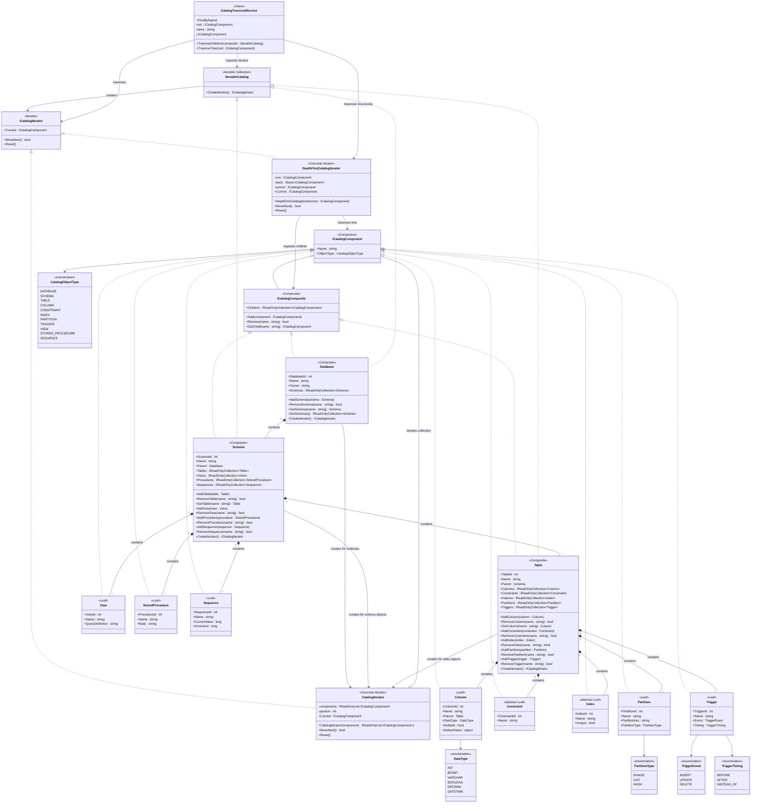
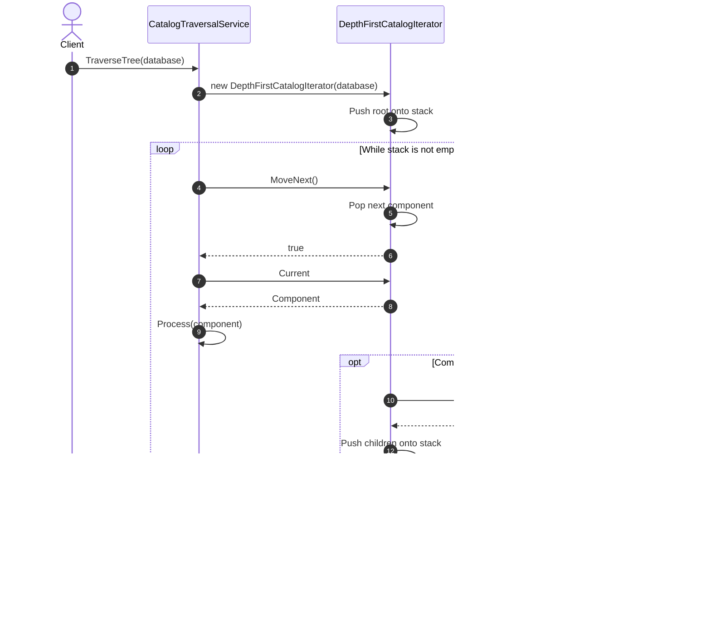

# Factory pattern

# Iterator

```mermaid
classDiagram
direction TB

%% =====================================================
%% Composite Contracts
%% =====================================================

class ICatalogComponent {
    <<Component>>
    +Name : string
    +ObjectType : CatalogObjectType
}

class ICatalogComposite {
    <<Composite>>
    +Children : IReadOnlyCollection~ICatalogComponent~
    +Add(component : ICatalogComponent)
    +Remove(name : string) bool
    +GetChild(name : string) ICatalogComponent
}

ICatalogComponent <|-- ICatalogComposite

%% =====================================================
%% Iterator Contracts
%% =====================================================

class ICatalogIterator {
    <<Iterator>>
    +Current : ICatalogComponent
    +MoveNext() bool
    +Reset()
}

class IIterableCatalog {
    <<Iterable Collection>>
    +CreateIterator() ICatalogIterator
}

class CatalogIterator {
    <<Concrete Iterator>>
    -components : IReadOnlyList~ICatalogComponent~
    -position : int
    +CatalogIterator(components : IReadOnlyList~ICatalogComponent~)
    +Current : ICatalogComponent
    +MoveNext() bool
    +Reset()
}

class DepthFirstCatalogIterator {
    <<Concrete Iterator>>
    -root : ICatalogComponent
    -stack : Stack~ICatalogComponent~
    -current : ICatalogComponent
    +DepthFirstCatalogIterator(root : ICatalogComponent)
    +Current : ICatalogComponent
    +MoveNext() bool
    +Reset()
}

%% =====================================================
%% Composite Objects
%% =====================================================

class Database {
    <<Composite>>
    +DatabaseId : int
    +Name : string
    +Owner : string
    +Schemas : IReadOnlyCollection~Schema~

    +AddSchema(schema : Schema)
    +RemoveSchema(name : string) bool
    +GetSchema(name : string) Schema
    +GetSchemas() IReadOnlyCollection~Schema~
    +CreateIterator() ICatalogIterator
}

class Schema {
    <<Composite>>
    +SchemaId : int
    +Name : string
    +Parent : Database
    +Tables : IReadOnlyCollection~Table~
    +Views : IReadOnlyCollection~View~
    +Procedures : IReadOnlyCollection~StoredProcedure~
    +Sequences : IReadOnlyCollection~Sequence~

    +AddTable(table : Table)
    +RemoveTable(name : string) bool
    +GetTable(name : string) Table

    +AddView(view : View)
    +RemoveView(name : string) bool

    +AddProcedure(procedure : StoredProcedure)
    +RemoveProcedure(name : string) bool

    +AddSequence(sequence : Sequence)
    +RemoveSequence(name : string) bool

    +CreateIterator() ICatalogIterator
}

class Table {
    <<Composite>>
    +TableId : int
    +Name : string
    +Parent : Schema
    +Columns : IReadOnlyCollection~Column~
    +Constraints : IReadOnlyCollection~Constraint~
    +Indexes : IReadOnlyCollection~Index~
    +Partitions : IReadOnlyCollection~Partition~
    +Triggers : IReadOnlyCollection~Trigger~

    +AddColumn(column : Column)
    +RemoveColumn(name : string) bool
    +GetColumn(name : string) Column

    +AddConstraint(constraint : Constraint)
    +RemoveConstraint(name : string) bool

    +AddIndex(index : Index)
    +RemoveIndex(name : string) bool

    +AddPartition(partition : Partition)
    +RemovePartition(name : string) bool

    +AddTrigger(trigger : Trigger)
    +RemoveTrigger(name : string) bool

    +CreateIterator() ICatalogIterator
}

%% =====================================================
%% Leaf Objects
%% =====================================================

class Column {
    <<Leaf>>
    +ColumnId : int
    +Name : string
    +Parent : Table
    +DataType : DataType
    +Nullable : bool
    +DefaultValue : object
}

class Constraint {
    <<abstract Leaf>>
    +ConstraintId : int
    +Name : string
}

class Index {
    <<abstract Leaf>>
    +IndexId : int
    +Name : string
    +Unique : bool
}

class Partition {
    <<Leaf>>
    +PartitionId : int
    +Name : string
    +PartitionKey : string
    +PartitionType : PartitionType
}

class Trigger {
    <<Leaf>>
    +TriggerId : int
    +Name : string
    +Event : TriggerEvent
    +Timing : TriggerTiming
}

class View {
    <<Leaf>>
    +ViewId : int
    +Name : string
    +QueryDefinition : string
}

class StoredProcedure {
    <<Leaf>>
    +ProcedureId : int
    +Name : string
    +Body : string
}

class Sequence {
    <<Leaf>>
    +SequenceId : int
    +Name : string
    +CurrentValue : long
    +Increment : long
}

%% =====================================================
%% Iterator Client
%% =====================================================

class CatalogTraversalService {
    <<Client>>
    +TraverseChildren(composite : IIterableCatalog)
    +TraverseTree(root : ICatalogComponent)
    +FindByName(
        root : ICatalogComponent,
        name : string
    ) ICatalogComponent
}

%% =====================================================
%% Supporting Types
%% =====================================================

class CatalogObjectType {
    <<enumeration>>
    DATABASE
    SCHEMA
    TABLE
    COLUMN
    CONSTRAINT
    INDEX
    PARTITION
    TRIGGER
    VIEW
    STORED_PROCEDURE
    SEQUENCE
}

class DataType {
    <<enumeration>>
    INT
    BIGINT
    VARCHAR
    BOOLEAN
    DECIMAL
    DATETIME
}

class PartitionType {
    <<enumeration>>
    RANGE
    LIST
    HASH
}

class TriggerEvent {
    <<enumeration>>
    INSERT
    UPDATE
    DELETE
}

class TriggerTiming {
    <<enumeration>>
    BEFORE
    AFTER
    INSTEAD_OF
}

%% =====================================================
%% Realization Relationships
%% =====================================================

ICatalogIterator <|.. CatalogIterator
ICatalogIterator <|.. DepthFirstCatalogIterator

ICatalogComposite <|.. Database
ICatalogComposite <|.. Schema
ICatalogComposite <|.. Table

IIterableCatalog <|.. Database
IIterableCatalog <|.. Schema
IIterableCatalog <|.. Table

ICatalogComponent <|.. Column
ICatalogComponent <|.. Constraint
ICatalogComponent <|.. Index
ICatalogComponent <|.. Partition
ICatalogComponent <|.. Trigger
ICatalogComponent <|.. View
ICatalogComponent <|.. StoredProcedure
ICatalogComponent <|.. Sequence

%% =====================================================
%% Composite Relationships
%% =====================================================

Database "1" *-- "*" Schema : contains

Schema "1" *-- "*" Table : contains
Schema "1" *-- "*" View : contains
Schema "1" *-- "*" StoredProcedure : contains
Schema "1" *-- "*" Sequence : contains

Table "1" *-- "*" Column : contains
Table "1" *-- "*" Constraint : contains
Table "1" *-- "*" Index : contains
Table "1" *-- "*" Partition : contains
Table "1" *-- "*" Trigger : contains

%% =====================================================
%% Iterator Relationships
%% =====================================================

CatalogIterator o-- ICatalogComponent : iterates collection
DepthFirstCatalogIterator --> ICatalogComponent : traverses tree
DepthFirstCatalogIterator --> ICatalogComposite : expands children

IIterableCatalog --> ICatalogIterator : creates

Database --> CatalogIterator : creates for schemas
Schema --> CatalogIterator : creates for schema objects
Table --> CatalogIterator : creates for table objects

CatalogTraversalService --> IIterableCatalog : requests iterator
CatalogTraversalService --> ICatalogIterator : traverses
CatalogTraversalService --> DepthFirstCatalogIterator : traverses recursively

ICatalogComponent --> CatalogObjectType
Column --> DataType
Partition --> PartitionType
Trigger --> TriggerEvent
Trigger --> TriggerTiming
```

```mermaid
sequenceDiagram
    autonumber

    actor Client
    participant Service as CatalogTraversalService
    participant Iterator as DepthFirstCatalogIterator
    participant Component as ICatalogComponent
    participant Composite as ICatalogComposite

    Client->>Service: TraverseTree(database)

    Service->>Iterator: new DepthFirstCatalogIterator(database)
    Iterator->>Iterator: Push root onto stack

    loop While stack is not empty
        Service->>Iterator: MoveNext()

        Iterator->>Iterator: Pop next component
        Iterator-->>Service: true

        Service->>Iterator: Current
        Iterator-->>Service: Component

        Service->>Service: Process(component)

        opt Component is ICatalogComposite
            Iterator->>Composite: Children
            Composite-->>Iterator: child components

            Iterator->>Iterator: Push children onto stack
        end
    end

    Service->>Iterator: MoveNext()
    Iterator-->>Service: false

    Service-->>Client: Traversal completed
```

# Command

```mermaid
classDiagram
direction LR

%% =====================================================
%% Command Contracts
%% =====================================================

class IDdlCommand {
    <<Command>>
    +Execute(context : DdlExecutionContext) DdlResult
}

class CreateTableCommand {
    <<Concrete Command>>
    -receiver : ISchemaService
    -schema : Schema
    -definition : TableDefinition

    +CreateTableCommand(
        receiver : ISchemaService,
        schema : Schema,
        definition : TableDefinition
    )

    +Execute(context : DdlExecutionContext) DdlResult
}

class CreateSchemaCommand {
    <<Concrete Command>>
    -receiver : IDatabaseService
    -database : Database
    -schemaName : string

    +CreateSchemaCommand(
        receiver : IDatabaseService,
        database : Database,
        schemaName : string
    )

    +Execute(context : DdlExecutionContext) DdlResult
}

class DropTableCommand {
    <<Concrete Command>>
    -receiver : ISchemaService
    -schema : Schema
    -tableName : string
    -cascade : bool

    +DropTableCommand(
        receiver : ISchemaService,
        schema : Schema,
        tableName : string,
        cascade : bool
    )

    +Execute(context : DdlExecutionContext) DdlResult
}

class AlterTableCommand {
    <<Concrete Command>>
    -receiver : ISchemaService
    -schema : Schema
    -tableName : string
    -operation : TableAlterOperation

    +AlterTableCommand(
        receiver : ISchemaService,
        schema : Schema,
        tableName : string,
        operation : TableAlterOperation
    )

    +Execute(context : DdlExecutionContext) DdlResult
}

%% =====================================================
%% Invoker
%% =====================================================

class IDdlCommandExecutor {
    <<Invoker>>
    +Execute(
        command : IDdlCommand,
        context : DdlExecutionContext
    ) DdlResult
}

class DdlCommandExecutor {
    <<Concrete Invoker>>
    +Execute(
        command : IDdlCommand,
        context : DdlExecutionContext
    ) DdlResult
}

%% =====================================================
%% Command Creation
%% =====================================================

class IDdlCommandFactory {
    <<Factory>>
    +Create(
        request : DdlRequest
    ) IDdlCommand
}

class DdlCommandFactory {
    <<Concrete Factory>>
    -databaseService : IDatabaseService
    -schemaService : ISchemaService
    -catalogResolver : ICatalogResolver

    +Create(
        request : DdlRequest
    ) IDdlCommand
}

class IDdlRequestSource {
    <<External Client Port>>
    +Parse(statement : string) DdlRequest
}

%% =====================================================
%% Execution Data
%% =====================================================

class DdlExecutionContext {
    <<Context>>
    +SessionId : string
    +UserName : string
    +TransactionId : string
    +DatabaseName : string
}

class DdlRequest {
    <<Request>>
    +Type : DdlCommandType
    +DatabaseName : string
    +SchemaName : string
    +ObjectName : string
    +Definition : object
}

class DdlCommandType {
    <<enumeration>>
    CREATE_SCHEMA
    CREATE_TABLE
    ALTER_TABLE
    DROP_TABLE
}

class DdlResult {
    <<Result>>
    +Success : bool
    +Message : string
    +AffectedObject : ICatalogComponent
    +ErrorCode : string

    +Succeeded(
        message : string,
        affectedObject : ICatalogComponent
    ) DdlResult

    +Failed(
        errorCode : string,
        message : string
    ) DdlResult
}

%% =====================================================
%% Database Receiver
%% =====================================================

class IDatabaseService {
    <<Receiver>>
    +CreateSchema(
        database : Database,
        name : string,
        context : DdlExecutionContext
    ) Schema
}

class DatabaseService {
    <<Concrete Receiver>>
    -catalog : ICatalogManager
    -transactionPort : IMetadataTransactionPort

    +CreateSchema(
        database : Database,
        name : string,
        context : DdlExecutionContext
    ) Schema
}

%% =====================================================
%% Schema Receiver
%% =====================================================

class ISchemaService {
    <<Receiver>>
    +CreateTable(
        schema : Schema,
        definition : TableDefinition,
        context : DdlExecutionContext
    ) Table

    +DropTable(
        schema : Schema,
        tableName : string,
        cascade : bool,
        context : DdlExecutionContext
    )

    +AlterTable(
        schema : Schema,
        tableName : string,
        operation : TableAlterOperation,
        context : DdlExecutionContext
    ) Table
}

class SchemaService {
    <<Concrete Receiver>>
    -director : TableDirector
    -catalog : ICatalogManager
    -storagePort : IStorageObjectPort
    -transactionPort : IMetadataTransactionPort

    +CreateTable(
        schema : Schema,
        definition : TableDefinition,
        context : DdlExecutionContext
    ) Table

    +DropTable(
        schema : Schema,
        tableName : string,
        cascade : bool,
        context : DdlExecutionContext
    )

    +AlterTable(
        schema : Schema,
        tableName : string,
        operation : TableAlterOperation,
        context : DdlExecutionContext
    ) Table
}

%% =====================================================
%% External Ports
%% =====================================================

class ICatalogManager {
    <<Port>>
    +Register(component : ICatalogComponent)
    +Update(component : ICatalogComponent)
    +Remove(component : ICatalogComponent)
}

class ICatalogResolver {
    <<Port>>
    +ResolveDatabase(name : string) Database
    +ResolveSchema(
        databaseName : string,
        schemaName : string
    ) Schema
}

class IStorageObjectPort {
    <<External Port>>
    +AllocateTable(table : Table)
    +AlterTable(
        table : Table,
        operation : TableAlterOperation
    )
    +DeallocateTable(table : Table)
}

class IMetadataTransactionPort {
    <<External Port>>
    +Begin(context : DdlExecutionContext)
    +Commit(context : DdlExecutionContext)
    +Rollback(context : DdlExecutionContext)
}

%% =====================================================
%% Related Domain Objects
%% =====================================================

class Database {
    +Name : string
    +AddSchema(schema : Schema)
}

class Schema {
    +Name : string
    +AddTable(table : Table)
    +RemoveTable(name : string) bool
    +GetTable(name : string) Table
}

class Table {
    +Name : string
}

class TableDefinition

class TableAlterOperation {
    +Type : TableAlterType
    +Definition : object
}

class TableAlterType {
    <<enumeration>>
    ADD_COLUMN
    DROP_COLUMN
    ALTER_COLUMN
    ADD_CONSTRAINT
    DROP_CONSTRAINT
    ADD_INDEX
    DROP_INDEX
}

class TableDirector {
    +Construct(definition : TableDefinition) Table
}

class ICatalogComponent {
    <<Component>>
    +Name : string
}

%% =====================================================
%% Command Relationships
%% =====================================================

IDdlCommand <|.. CreateSchemaCommand
IDdlCommand <|.. CreateTableCommand
IDdlCommand <|.. DropTableCommand
IDdlCommand <|.. AlterTableCommand

IDdlCommandExecutor <|.. DdlCommandExecutor

DdlCommandExecutor --> IDdlCommand : invokes
DdlCommandExecutor --> DdlExecutionContext : supplies

CreateSchemaCommand --> IDatabaseService : receiver
CreateSchemaCommand --> Database : target

CreateTableCommand --> ISchemaService : receiver
CreateTableCommand --> Schema : target
CreateTableCommand --> TableDefinition : carries

DropTableCommand --> ISchemaService : receiver
DropTableCommand --> Schema : target

AlterTableCommand --> ISchemaService : receiver
AlterTableCommand --> Schema : target
AlterTableCommand --> TableAlterOperation : carries

%% =====================================================
%% Command Factory Relationships
%% =====================================================

IDdlCommandFactory <|.. DdlCommandFactory

IDdlRequestSource --> DdlRequest : creates
DdlCommandFactory --> DdlRequest : reads
DdlCommandFactory --> IDdlCommand : creates
DdlCommandFactory --> IDatabaseService
DdlCommandFactory --> ISchemaService
DdlCommandFactory --> ICatalogResolver

DdlRequest --> DdlCommandType

%% =====================================================
%% Receiver Relationships
%% =====================================================

IDatabaseService <|.. DatabaseService
ISchemaService <|.. SchemaService

DatabaseService --> Database : modifies
DatabaseService --> ICatalogManager : persists metadata
DatabaseService --> IMetadataTransactionPort : transaction boundary

SchemaService --> TableDirector : constructs table
SchemaService --> Schema : modifies
SchemaService --> ICatalogManager : persists metadata
SchemaService --> IStorageObjectPort : manages physical object
SchemaService --> IMetadataTransactionPort : transaction boundary

TableDirector --> TableDefinition
TableDirector --> Table

%% =====================================================
%% Result Relationships
%% =====================================================

IDdlCommand --> DdlResult : returns
DdlResult --> ICatalogComponent : affected object
Database ..|> ICatalogComponent
Schema ..|> ICatalogComponent
Table ..|> ICatalogComponent
```

# Facade

```mermaid
classDiagram
direction LR

%% =====================================================
%% Facade Contracts
%% =====================================================

class IDatabaseService {
    <<Facade Interface>>

    +CreateSchema(
        database : Database,
        definition : SchemaDefinition,
        context : DdlExecutionContext
    ) Schema

    +DropSchema(
        database : Database,
        schemaName : string,
        cascade : bool,
        context : DdlExecutionContext
    ) DdlResult

    +RenameSchema(
        database : Database,
        currentName : string,
        newName : string,
        context : DdlExecutionContext
    ) Schema
}

class ISchemaService {
    <<Facade Interface>>

    +CreateTable(
        schema : Schema,
        definition : TableDefinition,
        context : DdlExecutionContext
    ) Table

    +DropTable(
        schema : Schema,
        tableName : string,
        cascade : bool,
        context : DdlExecutionContext
    ) DdlResult

    +AlterTable(
        schema : Schema,
        tableName : string,
        operation : TableAlterOperation,
        context : DdlExecutionContext
    ) Table

    +CreateView(
        schema : Schema,
        definition : ViewDefinition,
        context : DdlExecutionContext
    ) View

    +DropView(
        schema : Schema,
        viewName : string,
        cascade : bool,
        context : DdlExecutionContext
    ) DdlResult

    +CreateProcedure(
        schema : Schema,
        definition : ProcedureDefinition,
        context : DdlExecutionContext
    ) StoredProcedure

    +DropProcedure(
        schema : Schema,
        procedureName : string,
        context : DdlExecutionContext
    ) DdlResult

    +CreateSequence(
        schema : Schema,
        definition : SequenceDefinition,
        context : DdlExecutionContext
    ) Sequence

    +DropSequence(
        schema : Schema,
        sequenceName : string,
        context : DdlExecutionContext
    ) DdlResult
}

%% =====================================================
%% Concrete Facades
%% =====================================================

class DatabaseService {
    <<Facade>>

    -catalog : ICatalogManager
    -transactionPort : IMetadataTransactionPort

    +CreateSchema(
        database : Database,
        definition : SchemaDefinition,
        context : DdlExecutionContext
    ) Schema

    +DropSchema(
        database : Database,
        schemaName : string,
        cascade : bool,
        context : DdlExecutionContext
    ) DdlResult

    +RenameSchema(
        database : Database,
        currentName : string,
        newName : string,
        context : DdlExecutionContext
    ) Schema

    -EnsureSchemaDoesNotExist(
        database : Database,
        schemaName : string
    )

    -EnsureSchemaCanBeDropped(
        schema : Schema,
        cascade : bool
    )
}

class SchemaService {
    <<Facade>>

    -catalog : ICatalogManager
    -tableDirector : TableDirector
    -storagePort : IStorageObjectPort
    -transactionPort : IMetadataTransactionPort
    -dependencyService : ICatalogDependencyService

    +CreateTable(
        schema : Schema,
        definition : TableDefinition,
        context : DdlExecutionContext
    ) Table

    +DropTable(
        schema : Schema,
        tableName : string,
        cascade : bool,
        context : DdlExecutionContext
    ) DdlResult

    +AlterTable(
        schema : Schema,
        tableName : string,
        operation : TableAlterOperation,
        context : DdlExecutionContext
    ) Table

    +CreateView(
        schema : Schema,
        definition : ViewDefinition,
        context : DdlExecutionContext
    ) View

    +DropView(
        schema : Schema,
        viewName : string,
        cascade : bool,
        context : DdlExecutionContext
    ) DdlResult

    +CreateProcedure(
        schema : Schema,
        definition : ProcedureDefinition,
        context : DdlExecutionContext
    ) StoredProcedure

    +DropProcedure(
        schema : Schema,
        procedureName : string,
        context : DdlExecutionContext
    ) DdlResult

    +CreateSequence(
        schema : Schema,
        definition : SequenceDefinition,
        context : DdlExecutionContext
    ) Sequence

    +DropSequence(
        schema : Schema,
        sequenceName : string,
        context : DdlExecutionContext
    ) DdlResult

    -EnsureObjectDoesNotExist(
        schema : Schema,
        objectName : string
    )

    -EnsureObjectCanBeDropped(
        component : ICatalogComponent,
        cascade : bool
    )
}

%% =====================================================
%% Metadata Subsystem
%% =====================================================

class ICatalogManager {
    <<Subsystem Interface>>

    +ObjectExists(
        parent : ICatalogComposite,
        name : string
    ) bool

    +Register(component : ICatalogComponent)

    +Update(component : ICatalogComponent)

    +Remove(component : ICatalogComponent)

    +GetComponent(
        parent : ICatalogComposite,
        name : string
    ) ICatalogComponent
}

class ICatalogDependencyService {
    <<Subsystem Interface>>

    +GetDependencies(
        component : ICatalogComponent
    ) IReadOnlyCollection~ICatalogComponent~

    +HasDependencies(
        component : ICatalogComponent
    ) bool

    +RemoveDependencies(
        component : ICatalogComponent
    )
}

%% =====================================================
%% Construction Subsystem
%% =====================================================

class TableDirector {
    <<Subsystem / Director>>

    -builder : ITableBuilder
    -constraintFactory : IConstraintFactory
    -indexFactory : IIndexFactory

    +Construct(definition : TableDefinition) Table
}

class ITableBuilder {
    <<Builder>>

    +Reset()
    +SetName(name : string)
    +AddColumn(column : Column)
    +AddConstraint(constraint : Constraint)
    +AddIndex(index : Index)
    +AddPartition(partition : Partition)
    +AddTrigger(trigger : Trigger)
    +Build() Table
}

class IConstraintFactory {
    <<Factory>>

    +Create(options : ConstraintOptions) Constraint
}

class IIndexFactory {
    <<Factory>>

    +Create(options : IndexOptions) Index
}

%% =====================================================
%% External Ports
%% =====================================================

class IStorageObjectPort {
    <<External Port>>

    +AllocateTable(table : Table)

    +AlterTable(
        table : Table,
        operation : TableAlterOperation
    )

    +DeallocateTable(table : Table)
}

class IMetadataTransactionPort {
    <<External Port>>

    +Begin(context : DdlExecutionContext)
    +Commit(context : DdlExecutionContext)
    +Rollback(context : DdlExecutionContext)
}

%% =====================================================
%% Catalog Components
%% =====================================================

class ICatalogComponent {
    <<Component>>

    +Name : string
}

class ICatalogComposite {
    <<Composite>>

    +Children : IReadOnlyCollection~ICatalogComponent~
}

ICatalogComponent <|-- ICatalogComposite

%% =====================================================
%% Domain Objects
%% =====================================================

class Database {
    <<Composite>>

    +DatabaseId : int
    +Name : string
    +Owner : string
    +Schemas : IReadOnlyCollection~Schema~

    +GetSchema(name : string) Schema
    +AddSchema(schema : Schema)
    +RemoveSchema(name : string) bool
}

class Schema {
    <<Composite>>

    +SchemaId : int
    +Name : string
    +Parent : Database

    +AddTable(table : Table)
    +RemoveTable(name : string) bool
    +GetTable(name : string) Table

    +AddView(view : View)
    +RemoveView(name : string) bool

    +AddProcedure(procedure : StoredProcedure)
    +RemoveProcedure(name : string) bool

    +AddSequence(sequence : Sequence)
    +RemoveSequence(name : string) bool

    +Rename(newName : string)
}

class Table {
    <<Composite>>

    +TableId : int
    +Name : string
    +Parent : Schema

    +AddColumn(column : Column)
    +RemoveColumn(name : string) bool

    +AddConstraint(constraint : Constraint)
    +RemoveConstraint(name : string) bool

    +AddIndex(index : Index)
    +RemoveIndex(name : string) bool

    +AddPartition(partition : Partition)
    +RemovePartition(name : string) bool

    +AddTrigger(trigger : Trigger)
    +RemoveTrigger(name : string) bool

    +Rename(newName : string)
}

class Column {
    <<Leaf>>

    +ColumnId : int
    +Name : string
    +Rename(newName : string)
}

class Constraint {
    <<abstract Leaf>>

    +ConstraintId : int
    +Name : string
}

class Index {
    <<abstract Leaf>>

    +IndexId : int
    +Name : string
}

class Partition {
    <<Leaf>>

    +PartitionId : int
    +Name : string
    +PartitionKey : string
}

class Trigger {
    <<Leaf>>

    +TriggerId : int
    +Name : string
}

class View {
    <<Leaf>>

    +ViewId : int
    +Name : string
    +QueryDefinition : string
}

class StoredProcedure {
    <<Leaf>>

    +ProcedureId : int
    +Name : string
    +Body : string
}

class Sequence {
    <<Leaf>>

    +SequenceId : int
    +Name : string
    +CurrentValue : long
    +Increment : long
}

%% =====================================================
%% Definition Objects
%% =====================================================

class SchemaDefinition {
    <<Command Data>>

    +Name : string
    +Owner : string
}

class TableDefinition {
    <<Command Data>>

    +Name : string
    +Columns : IReadOnlyCollection~ColumnDefinition~
    +Constraints : IReadOnlyCollection~ConstraintOptions~
    +Indexes : IReadOnlyCollection~IndexOptions~
    +Partitions : IReadOnlyCollection~PartitionDefinition~
    +Triggers : IReadOnlyCollection~TriggerDefinition~
}

class ColumnDefinition {
    <<DTO>>

    +Name : string
    +DataType : DataType
    +Nullable : bool
    +DefaultValue : object
}

class ConstraintOptions {
    <<DTO>>

    +Type : ConstraintType
    +Name : string
    +Columns : IReadOnlyCollection~string~
}

class IndexOptions {
    <<DTO>>

    +Type : IndexType
    +Name : string
    +Columns : IReadOnlyCollection~string~
    +Unique : bool
}

class PartitionDefinition {
    <<DTO>>

    +Name : string
    +PartitionKey : string
    +Type : PartitionType
}

class TriggerDefinition {
    <<DTO>>

    +Name : string
    +Event : TriggerEvent
    +Timing : TriggerTiming
    +Body : string
}

class ViewDefinition {
    <<Command Data>>

    +Name : string
    +QueryDefinition : string
}

class ProcedureDefinition {
    <<Command Data>>

    +Name : string
    +Parameters : IReadOnlyCollection~ProcedureParameterDefinition~
    +Body : string
}

class ProcedureParameterDefinition {
    <<DTO>>

    +Name : string
    +DataType : DataType
    +Direction : ParameterDirection
}

class SequenceDefinition {
    <<Command Data>>

    +Name : string
    +StartValue : long
    +Increment : long
    +MinimumValue : long
    +MaximumValue : long
    +Cycle : bool
}

class TableAlterOperation {
    <<Command Data>>

    +Type : TableAlterType
    +Definition : object
}

class DdlExecutionContext {
    <<Execution Context>>

    +SessionId : string
    +UserName : string
    +TransactionId : string
}

class DdlResult {
    <<Result>>

    +Success : bool
    +Message : string
    +AffectedObject : ICatalogComponent
}

%% =====================================================
%% Supporting Enumerations
%% =====================================================

class TableAlterType {
    <<enumeration>>

    RENAME_TABLE
    ADD_COLUMN
    DROP_COLUMN
    ALTER_COLUMN
    ADD_CONSTRAINT
    DROP_CONSTRAINT
    ADD_INDEX
    DROP_INDEX
    ADD_PARTITION
    DROP_PARTITION
    ADD_TRIGGER
    DROP_TRIGGER
}

class ConstraintType {
    <<enumeration>>

    PRIMARY_KEY
    UNIQUE
    FOREIGN_KEY
    CHECK
}

class IndexType {
    <<enumeration>>

    BTREE
    HASH
    BITMAP
}

class PartitionType {
    <<enumeration>>

    RANGE
    LIST
    HASH
}

class TriggerEvent {
    <<enumeration>>

    INSERT
    UPDATE
    DELETE
}

class TriggerTiming {
    <<enumeration>>

    BEFORE
    AFTER
    INSTEAD_OF
}

class ParameterDirection {
    <<enumeration>>

    INPUT
    OUTPUT
    INPUT_OUTPUT
}

class DataType {
    <<enumeration>>

    INT
    BIGINT
    VARCHAR
    BOOLEAN
    DECIMAL
    DATETIME
}

%% =====================================================
%% Facade Relationships
%% =====================================================

IDatabaseService <|.. DatabaseService
ISchemaService <|.. SchemaService

DatabaseService --> ICatalogManager : manages metadata
DatabaseService --> IMetadataTransactionPort : controls transaction
DatabaseService --> Database : manages schemas

SchemaService --> ICatalogManager : manages metadata
SchemaService --> ICatalogDependencyService : checks dependencies
SchemaService --> TableDirector : builds tables
SchemaService --> IStorageObjectPort : coordinates storage
SchemaService --> IMetadataTransactionPort : controls transaction

SchemaService --> Schema : manages objects
SchemaService --> Table : alters table
SchemaService --> View : creates
SchemaService --> StoredProcedure : creates
SchemaService --> Sequence : creates

%% =====================================================
%% Construction Relationships
%% =====================================================

TableDirector --> ITableBuilder : directs
TableDirector --> IConstraintFactory : creates constraints
TableDirector --> IIndexFactory : creates indexes
TableDirector --> TableDefinition : reads
TableDirector --> Table : produces

%% =====================================================
%% Composite Relationships
%% =====================================================

ICatalogComposite <|.. Database
ICatalogComposite <|.. Schema
ICatalogComposite <|.. Table

ICatalogComponent <|.. Column
ICatalogComponent <|.. Constraint
ICatalogComponent <|.. Index
ICatalogComponent <|.. Partition
ICatalogComponent <|.. Trigger
ICatalogComponent <|.. View
ICatalogComponent <|.. StoredProcedure
ICatalogComponent <|.. Sequence

Database "1" *-- "*" Schema : contains

Schema "1" *-- "*" Table : contains
Schema "1" *-- "*" View : contains
Schema "1" *-- "*" StoredProcedure : contains
Schema "1" *-- "*" Sequence : contains

Table "1" *-- "*" Column : contains
Table "1" *-- "*" Constraint : contains
Table "1" *-- "*" Index : contains
Table "1" *-- "*" Partition : contains
Table "1" *-- "*" Trigger : contains

%% =====================================================
%% Definition Relationships
%% =====================================================

TableDefinition --> ColumnDefinition
TableDefinition --> ConstraintOptions
TableDefinition --> IndexOptions
TableDefinition --> PartitionDefinition
TableDefinition --> TriggerDefinition

ProcedureDefinition --> ProcedureParameterDefinition

ColumnDefinition --> DataType
ConstraintOptions --> ConstraintType
IndexOptions --> IndexType
PartitionDefinition --> PartitionType
TriggerDefinition --> TriggerEvent
TriggerDefinition --> TriggerTiming
ProcedureParameterDefinition --> DataType
ProcedureParameterDefinition --> ParameterDirection

TableAlterOperation --> TableAlterType
DdlResult --> ICatalogComponent
```