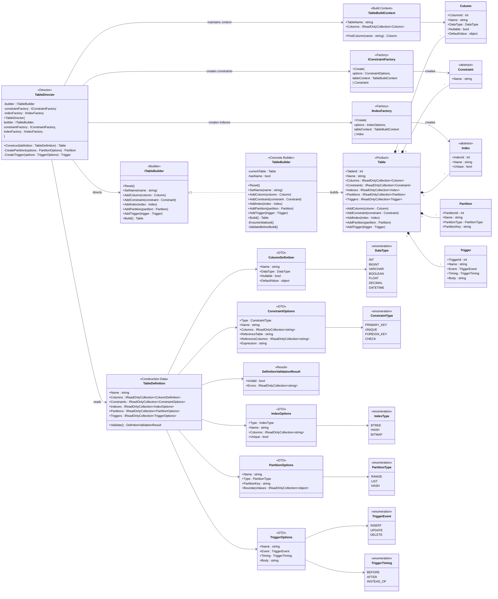
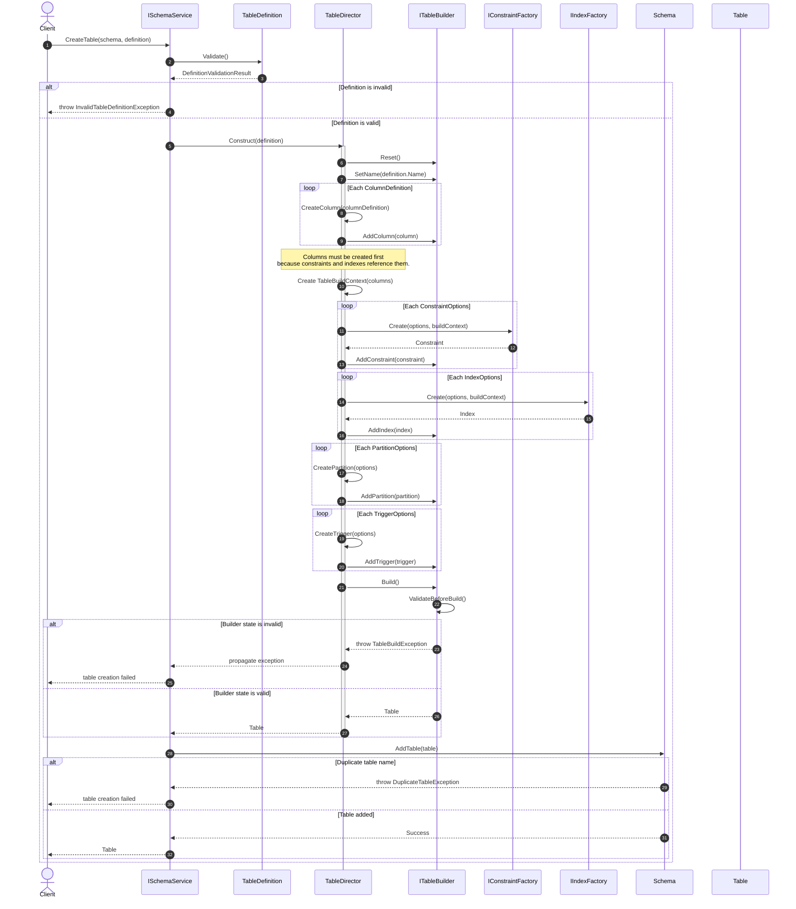
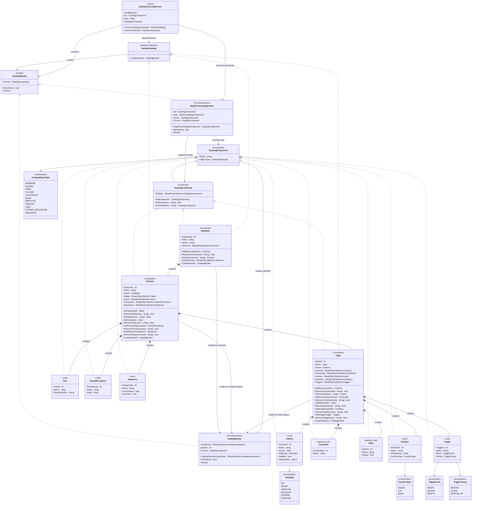
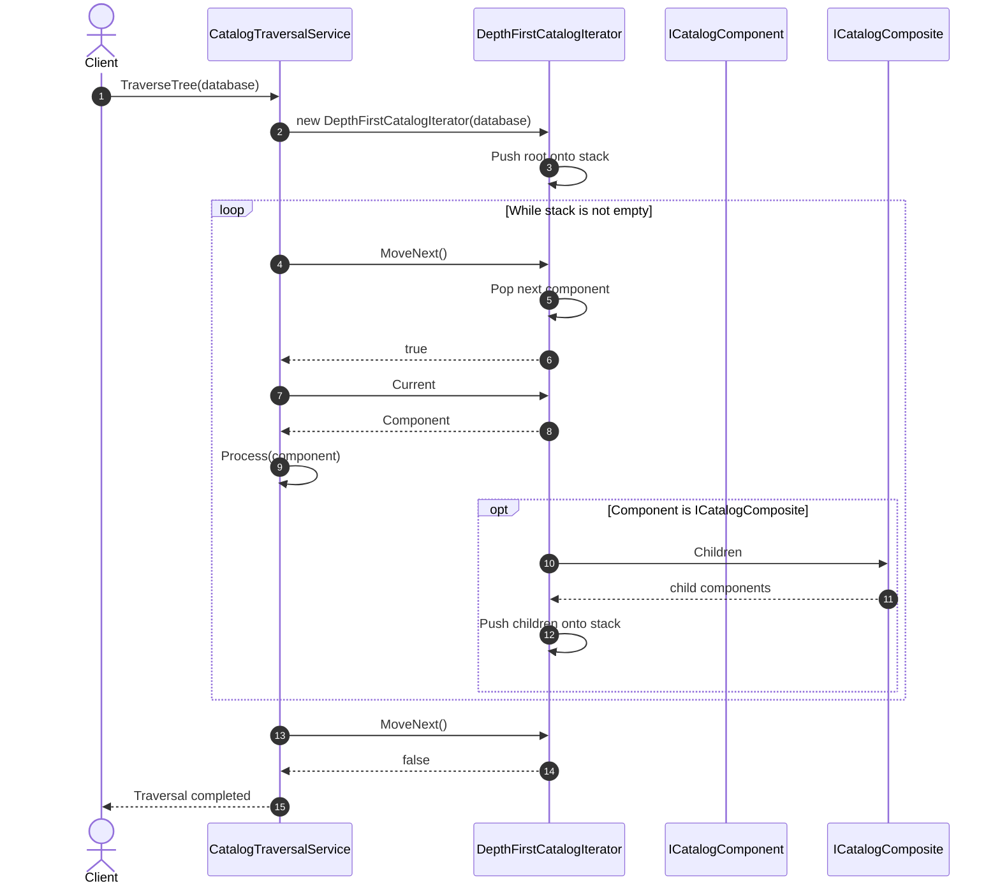
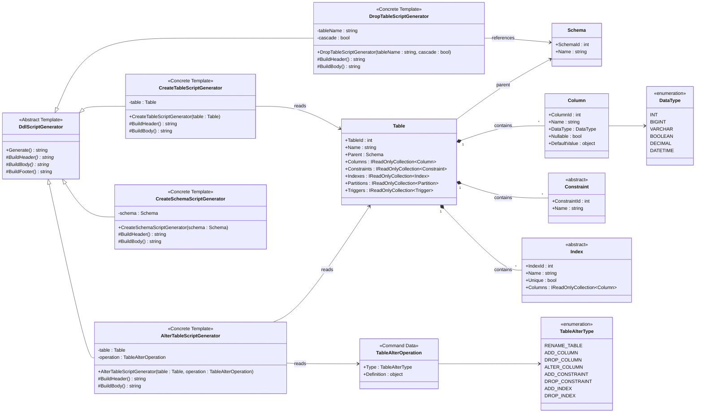
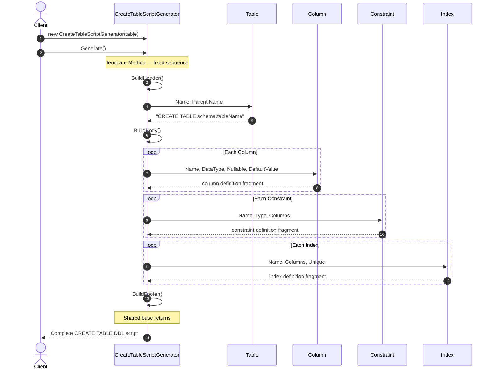
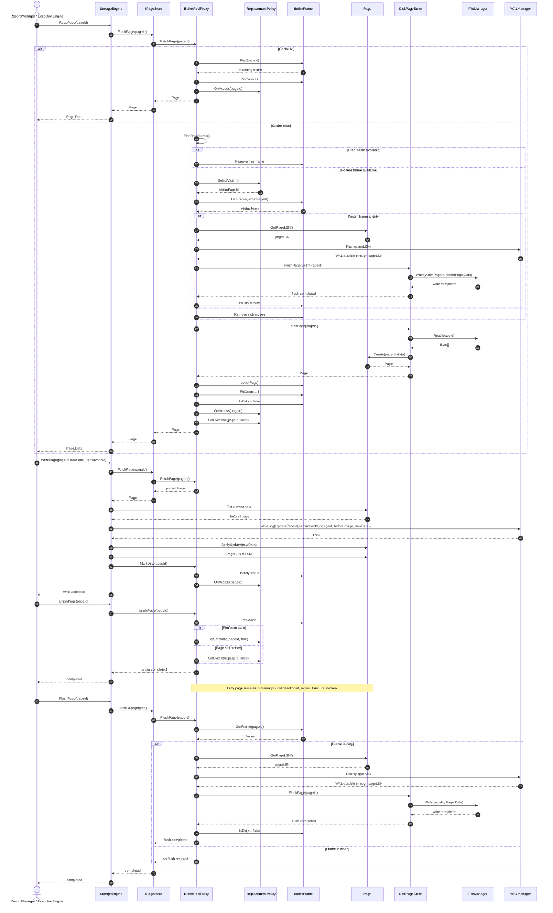

# Builder pattern

```mermaid
classDiagram
direction LR

%% =====================================================
%% Builder Pattern — Table Construction
%% =====================================================

class ITableBuilder {
    <<Builder>>
    +Reset()
    +SetName(name : string)
    +AddColumn(column : Column)
    +AddConstraint(constraint : Constraint)
    +AddIndex(index : Index)
    +AddPartition(partition : Partition)
    +AddTrigger(trigger : Trigger)
    +Build() Table
}

class TableBuilder {
    <<Concrete Builder>>
    -currentTable : Table
    -hasName : bool

    +Reset()
    +SetName(name : string)
    +AddColumn(column : Column)
    +AddConstraint(constraint : Constraint)
    +AddIndex(index : Index)
    +AddPartition(partition : Partition)
    +AddTrigger(trigger : Trigger)
    +Build() Table

    -EnsureInitialized()
    -ValidateBeforeBuild()
}

class TableDirector {
    <<Director>>
    -builder : ITableBuilder
    -constraintFactory : IConstraintFactory
    -indexFactory : IIndexFactory

    +TableDirector(
        builder : ITableBuilder,
        constraintFactory : IConstraintFactory,
        indexFactory : IIndexFactory
    )

    +Construct(definition : TableDefinition) Table
    -CreatePartition(options : PartitionOptions) Partition
    -CreateTrigger(options : TriggerOptions) Trigger
}

%% =====================================================
%% Construction Data
%% =====================================================

class TableDefinition {
    <<Construction Data>>
    +Name : string
    +Columns : IReadOnlyCollection~ColumnDefinition~
    +Constraints : IReadOnlyCollection~ConstraintOptions~
    +Indexes : IReadOnlyCollection~IndexOptions~
    +Partitions : IReadOnlyCollection~PartitionOptions~
    +Triggers : IReadOnlyCollection~TriggerOptions~

    +Validate() DefinitionValidationResult
}

class ColumnDefinition {
    <<DTO>>
    +Name : string
    +DataType : DataType
    +Nullable : bool
    +DefaultValue : object
}

class ConstraintOptions {
    <<DTO>>
    +Type : ConstraintType
    +Name : string
    +Columns : IReadOnlyCollection~string~
    +ReferenceTable : string
    +ReferenceColumns : IReadOnlyCollection~string~
    +Expression : string
}

class IndexOptions {
    <<DTO>>
    +Type : IndexType
    +Name : string
    +Columns : IReadOnlyCollection~string~
    +Unique : bool
}

class PartitionOptions {
    <<DTO>>
    +Name : string
    +Type : PartitionType
    +PartitionKey : string
    +BoundaryValues : IReadOnlyCollection~object~
}

class TriggerOptions {
    <<DTO>>
    +Name : string
    +Event : TriggerEvent
    +Timing : TriggerTiming
    +Body : string
}

class DefinitionValidationResult {
    <<Result>>
    +IsValid : bool
    +Errors : IReadOnlyCollection~string~
}

%% =====================================================
%% Product
%% =====================================================

class Table {
    <<Product>>
    +TableId : int
    +Name : string
    +Columns : IReadOnlyCollection~Column~
    +Constraints : IReadOnlyCollection~Constraint~
    +Indexes : IReadOnlyCollection~Index~
    +Partitions : IReadOnlyCollection~Partition~
    +Triggers : IReadOnlyCollection~Trigger~

    +AddColumn(column : Column)
    +AddConstraint(constraint : Constraint)
    +AddIndex(index : Index)
    +AddPartition(partition : Partition)
    +AddTrigger(trigger : Trigger)
}

class Column {
    +ColumnId : int
    +Name : string
    +DataType : DataType
    +Nullable : bool
    +DefaultValue : object
}

class Constraint {
    <<abstract>>
    +Name : string
}

class Index {
    <<abstract>>
    +IndexId : int
    +Name : string
    +Unique : bool
}

class Partition {
    +PartitionId : int
    +Name : string
    +PartitionType : PartitionType
    +PartitionKey : string
}

class Trigger {
    +TriggerId : int
    +Name : string
    +Event : TriggerEvent
    +Timing : TriggerTiming
    +Body : string
}

%% =====================================================
%% Factories Used by Director
%% =====================================================

class IConstraintFactory {
    <<Factory>>
    +Create(
        options : ConstraintOptions,
        tableContext : TableBuildContext
    ) Constraint
}

class IIndexFactory {
    <<Factory>>
    +Create(
        options : IndexOptions,
        tableContext : TableBuildContext
    ) Index
}


class TableBuildContext {
    <<Build Context>>
    +TableName : string
    +Columns : IReadOnlyCollection~Column~
    +FindColumn(name : string) Column
}

%% =====================================================
%% Supporting Types
%% =====================================================

class DataType {
    <<enumeration>>
    INT
    BIGINT
    VARCHAR
    BOOLEAN
    FLOAT
    DECIMAL
    DATETIME
}

class ConstraintType {
    <<enumeration>>
    PRIMARY_KEY
    UNIQUE
    FOREIGN_KEY
    CHECK
}

class IndexType {
    <<enumeration>>
    BTREE
    HASH
    BITMAP
}

class PartitionType {
    <<enumeration>>
    RANGE
    LIST
    HASH
}

class TriggerEvent {
    <<enumeration>>
    INSERT
    UPDATE
    DELETE
}

class TriggerTiming {
    <<enumeration>>
    BEFORE
    AFTER
    INSTEAD_OF
}

%% =====================================================
%% Relationships
%% =====================================================

ITableBuilder <|.. TableBuilder

TableDirector --> ITableBuilder : directs
TableDirector --> IConstraintFactory : creates constraints
TableDirector --> IIndexFactory : creates indexes
TableDirector --> TableDefinition : reads
TableDirector --> TableBuildContext : maintains context

TableBuilder --> Table : builds

TableDefinition --> ColumnDefinition
TableDefinition --> ConstraintOptions
TableDefinition --> IndexOptions
TableDefinition --> PartitionOptions
TableDefinition --> TriggerOptions
TableDefinition --> DefinitionValidationResult

ColumnDefinition --> DataType
ConstraintOptions --> ConstraintType
IndexOptions --> IndexType
PartitionOptions --> PartitionType
TriggerOptions --> TriggerEvent
TriggerOptions --> TriggerTiming

IConstraintFactory --> Constraint : creates
IIndexFactory --> Index : creates

TableBuildContext --> Column

Table "1" *-- "*" Column
Table "1" *-- "*" Constraint
Table "1" *-- "*" Index
Table "1" *-- "*" Partition
Table "1" *-- "*" Trigger
```

```mermaid
sequenceDiagram
    autonumber

    actor Client
    participant Service as ISchemaService
    participant Definition as TableDefinition
    participant Director as TableDirector
    participant Builder as ITableBuilder
    participant CFactory as IConstraintFactory
    participant IFactory as IIndexFactory
    participant Schema
    participant Table

    Client->>Service: CreateTable(schema, definition)

    Service->>Definition: Validate()
    Definition-->>Service: DefinitionValidationResult

    alt Definition is invalid
        Service-->>Client: throw InvalidTableDefinitionException
    else Definition is valid
        Service->>Director: Construct(definition)
        activate Director

        Director->>Builder: Reset()
        Director->>Builder: SetName(definition.Name)

        loop Each ColumnDefinition
            Director->>Director: CreateColumn(columnDefinition)
            Director->>Builder: AddColumn(column)
        end

        Note over Director: Columns must be created first<br/>because constraints and indexes reference them.

        Director->>Director: Create TableBuildContext(columns)

        loop Each ConstraintOptions
            Director->>CFactory: Create(options, buildContext)
            CFactory-->>Director: Constraint
            Director->>Builder: AddConstraint(constraint)
        end

        loop Each IndexOptions
            Director->>IFactory: Create(options, buildContext)
            IFactory-->>Director: Index
            Director->>Builder: AddIndex(index)
        end

        loop Each PartitionOptions
            Director->>Director: CreatePartition(options)
            Director->>Builder: AddPartition(partition)
        end

        loop Each TriggerOptions
            Director->>Director: CreateTrigger(options)
            Director->>Builder: AddTrigger(trigger)
        end

        Director->>Builder: Build()
        Builder->>Builder: ValidateBeforeBuild()

        alt Builder state is invalid
            Builder-->>Director: throw TableBuildException
            Director-->>Service: propagate exception
            Service-->>Client: table creation failed
        else Builder state is valid
            Builder-->>Director: Table
            Director-->>Service: Table
        end

        deactivate Director

        Service->>Schema: AddTable(table)

        alt Duplicate table name
            Schema-->>Service: throw DuplicateTableException
            Service-->>Client: table creation failed
        else Table added
            Schema-->>Service: Success
            Service-->>Client: Table
        end
    end
```

# Factory pattern

# Iterator

```mermaid
classDiagram
direction TB

%% =====================================================
%% Composite Contracts
%% =====================================================

class ICatalogComponent {
    <<Component>>
    +Name : string
    +ObjectType : CatalogObjectType
}

class ICatalogComposite {
    <<Composite>>
    +Children : IReadOnlyCollection~ICatalogComponent~
    +Add(component : ICatalogComponent)
    +Remove(name : string) bool
    +GetChild(name : string) ICatalogComponent
}

ICatalogComponent <|-- ICatalogComposite

%% =====================================================
%% Iterator Contracts
%% =====================================================

class ICatalogIterator {
    <<Iterator>>
    +Current : ICatalogComponent
    +MoveNext() bool
    +Reset()
}

class IIterableCatalog {
    <<Iterable Collection>>
    +CreateIterator() ICatalogIterator
}

class CatalogIterator {
    <<Concrete Iterator>>
    -components : IReadOnlyList~ICatalogComponent~
    -position : int
    +CatalogIterator(components : IReadOnlyList~ICatalogComponent~)
    +Current : ICatalogComponent
    +MoveNext() bool
    +Reset()
}

class DepthFirstCatalogIterator {
    <<Concrete Iterator>>
    -root : ICatalogComponent
    -stack : Stack~ICatalogComponent~
    -current : ICatalogComponent
    +DepthFirstCatalogIterator(root : ICatalogComponent)
    +Current : ICatalogComponent
    +MoveNext() bool
    +Reset()
}

%% =====================================================
%% Composite Objects
%% =====================================================

class Database {
    <<Composite>>
    +DatabaseId : int
    +Name : string
    +Owner : string
    +Schemas : IReadOnlyCollection~Schema~

    +AddSchema(schema : Schema)
    +RemoveSchema(name : string) bool
    +GetSchema(name : string) Schema
    +GetSchemas() IReadOnlyCollection~Schema~
    +CreateIterator() ICatalogIterator
}

class Schema {
    <<Composite>>
    +SchemaId : int
    +Name : string
    +Parent : Database
    +Tables : IReadOnlyCollection~Table~
    +Views : IReadOnlyCollection~View~
    +Procedures : IReadOnlyCollection~StoredProcedure~
    +Sequences : IReadOnlyCollection~Sequence~

    +AddTable(table : Table)
    +RemoveTable(name : string) bool
    +GetTable(name : string) Table

    +AddView(view : View)
    +RemoveView(name : string) bool

    +AddProcedure(procedure : StoredProcedure)
    +RemoveProcedure(name : string) bool

    +AddSequence(sequence : Sequence)
    +RemoveSequence(name : string) bool

    +CreateIterator() ICatalogIterator
}

class Table {
    <<Composite>>
    +TableId : int
    +Name : string
    +Parent : Schema
    +Columns : IReadOnlyCollection~Column~
    +Constraints : IReadOnlyCollection~Constraint~
    +Indexes : IReadOnlyCollection~Index~
    +Partitions : IReadOnlyCollection~Partition~
    +Triggers : IReadOnlyCollection~Trigger~

    +AddColumn(column : Column)
    +RemoveColumn(name : string) bool
    +GetColumn(name : string) Column

    +AddConstraint(constraint : Constraint)
    +RemoveConstraint(name : string) bool

    +AddIndex(index : Index)
    +RemoveIndex(name : string) bool

    +AddPartition(partition : Partition)
    +RemovePartition(name : string) bool

    +AddTrigger(trigger : Trigger)
    +RemoveTrigger(name : string) bool

    +CreateIterator() ICatalogIterator
}

%% =====================================================
%% Leaf Objects
%% =====================================================

class Column {
    <<Leaf>>
    +ColumnId : int
    +Name : string
    +Parent : Table
    +DataType : DataType
    +Nullable : bool
    +DefaultValue : object
}

class Constraint {
    <<abstract Leaf>>
    +ConstraintId : int
    +Name : string
}

class Index {
    <<abstract Leaf>>
    +IndexId : int
    +Name : string
    +Unique : bool
}

class Partition {
    <<Leaf>>
    +PartitionId : int
    +Name : string
    +PartitionKey : string
    +PartitionType : PartitionType
}

class Trigger {
    <<Leaf>>
    +TriggerId : int
    +Name : string
    +Event : TriggerEvent
    +Timing : TriggerTiming
}

class View {
    <<Leaf>>
    +ViewId : int
    +Name : string
    +QueryDefinition : string
}

class StoredProcedure {
    <<Leaf>>
    +ProcedureId : int
    +Name : string
    +Body : string
}

class Sequence {
    <<Leaf>>
    +SequenceId : int
    +Name : string
    +CurrentValue : long
    +Increment : long
}

%% =====================================================
%% Iterator Client
%% =====================================================

class CatalogTraversalService {
    <<Client>>
    +TraverseChildren(composite : IIterableCatalog)
    +TraverseTree(root : ICatalogComponent)
    +FindByName(
        root : ICatalogComponent,
        name : string
    ) ICatalogComponent
}

%% =====================================================
%% Supporting Types
%% =====================================================

class CatalogObjectType {
    <<enumeration>>
    DATABASE
    SCHEMA
    TABLE
    COLUMN
    CONSTRAINT
    INDEX
    PARTITION
    TRIGGER
    VIEW
    STORED_PROCEDURE
    SEQUENCE
}

class DataType {
    <<enumeration>>
    INT
    BIGINT
    VARCHAR
    BOOLEAN
    DECIMAL
    DATETIME
}

class PartitionType {
    <<enumeration>>
    RANGE
    LIST
    HASH
}

class TriggerEvent {
    <<enumeration>>
    INSERT
    UPDATE
    DELETE
}

class TriggerTiming {
    <<enumeration>>
    BEFORE
    AFTER
    INSTEAD_OF
}

%% =====================================================
%% Realization Relationships
%% =====================================================

ICatalogIterator <|.. CatalogIterator
ICatalogIterator <|.. DepthFirstCatalogIterator

ICatalogComposite <|.. Database
ICatalogComposite <|.. Schema
ICatalogComposite <|.. Table

IIterableCatalog <|.. Database
IIterableCatalog <|.. Schema
IIterableCatalog <|.. Table

ICatalogComponent <|.. Column
ICatalogComponent <|.. Constraint
ICatalogComponent <|.. Index
ICatalogComponent <|.. Partition
ICatalogComponent <|.. Trigger
ICatalogComponent <|.. View
ICatalogComponent <|.. StoredProcedure
ICatalogComponent <|.. Sequence

%% =====================================================
%% Composite Relationships
%% =====================================================

Database "1" *-- "*" Schema : contains

Schema "1" *-- "*" Table : contains
Schema "1" *-- "*" View : contains
Schema "1" *-- "*" StoredProcedure : contains
Schema "1" *-- "*" Sequence : contains

Table "1" *-- "*" Column : contains
Table "1" *-- "*" Constraint : contains
Table "1" *-- "*" Index : contains
Table "1" *-- "*" Partition : contains
Table "1" *-- "*" Trigger : contains

%% =====================================================
%% Iterator Relationships
%% =====================================================

CatalogIterator o-- ICatalogComponent : iterates collection
DepthFirstCatalogIterator --> ICatalogComponent : traverses tree
DepthFirstCatalogIterator --> ICatalogComposite : expands children

IIterableCatalog --> ICatalogIterator : creates

Database --> CatalogIterator : creates for schemas
Schema --> CatalogIterator : creates for schema objects
Table --> CatalogIterator : creates for table objects

CatalogTraversalService --> IIterableCatalog : requests iterator
CatalogTraversalService --> ICatalogIterator : traverses
CatalogTraversalService --> DepthFirstCatalogIterator : traverses recursively

ICatalogComponent --> CatalogObjectType
Column --> DataType
Partition --> PartitionType
Trigger --> TriggerEvent
Trigger --> TriggerTiming
```

```mermaid
sequenceDiagram
    autonumber

    actor Client
    participant Service as CatalogTraversalService
    participant Iterator as DepthFirstCatalogIterator
    participant Component as ICatalogComponent
    participant Composite as ICatalogComposite

    Client->>Service: TraverseTree(database)

    Service->>Iterator: new DepthFirstCatalogIterator(database)
    Iterator->>Iterator: Push root onto stack

    loop While stack is not empty
        Service->>Iterator: MoveNext()

        Iterator->>Iterator: Pop next component
        Iterator-->>Service: true

        Service->>Iterator: Current
        Iterator-->>Service: Component

        Service->>Service: Process(component)

        opt Component is ICatalogComposite
            Iterator->>Composite: Children
            Composite-->>Iterator: child components

            Iterator->>Iterator: Push children onto stack
        end
    end

    Service->>Iterator: MoveNext()
    Iterator-->>Service: false

    Service-->>Client: Traversal completed
```

# Command

```mermaid
classDiagram
direction LR

%% =====================================================
%% Command Contracts
%% =====================================================

class IDdlCommand {
    <<Command>>
    +Execute() DdlResult
}

class CreateTableCommand {
    <<Concrete Command>>
    -receiver : ISchemaService
    -schema : Schema
    -definition : TableDefinition

    +CreateTableCommand(
        receiver : ISchemaService,
        schema : Schema,
        definition : TableDefinition
    )

    +Execute() DdlResult
}

class CreateSchemaCommand {
    <<Concrete Command>>
    -receiver : IDatabaseService
    -database : Database
    -schemaName : string

    +CreateSchemaCommand(
        receiver : IDatabaseService,
        database : Database,
        schemaName : string
    )

    +Execute() DdlResult
}

class DropTableCommand {
    <<Concrete Command>>
    -receiver : ISchemaService
    -schema : Schema
    -tableName : string
    -cascade : bool

    +DropTableCommand(
        receiver : ISchemaService,
        schema : Schema,
        tableName : string,
        cascade : bool
    )

    +Execute() DdlResult
}

class AlterTableCommand {
    <<Concrete Command>>
    -receiver : ISchemaService
    -schema : Schema
    -tableName : string
    -operation : TableAlterOperation

    +AlterTableCommand(
        receiver : ISchemaService,
        schema : Schema,
        tableName : string,
        operation : TableAlterOperation
    )

    +Execute() DdlResult
}

%% =====================================================
%% Invoker
%% =====================================================

class IDdlCommandExecutor {
    <<Invoker>>
    +Execute(command : IDdlCommand) DdlResult
}

class DdlCommandExecutor {
    <<Concrete Invoker>>
    +Execute(command : IDdlCommand) DdlResult
}

%% =====================================================
%% Command Creation
%% =====================================================

class IDdlCommandFactory {
    <<Factory>>
    +Create(
        request : DdlRequest
    ) IDdlCommand
}

class DdlCommandFactory {
    <<Concrete Factory>>
    -databaseService : IDatabaseService
    -schemaService : ISchemaService
    -catalogResolver : ICatalogResolver

    +Create(
        request : DdlRequest
    ) IDdlCommand
}

class IDdlRequestSource {
    <<External Client Port>>
    +Parse(statement : string) DdlRequest
}

%% =====================================================
%% Execution Data
%% =====================================================

class DdlExecutionContext {
    <<Context>>
    +SessionId : string
    +UserName : string
    +TransactionId : string
    +DatabaseName : string
}

class DdlRequest {
    <<Request>>
    +Type : DdlCommandType
    +DatabaseName : string
    +SchemaName : string
    +ObjectName : string
    +Definition : object
}

class DdlCommandType {
    <<enumeration>>
    CREATE_SCHEMA
    CREATE_TABLE
    ALTER_TABLE
    DROP_TABLE
}

class DdlResult {
    <<Result>>
    +Success : bool
    +Message : string
    +AffectedObject : ICatalogComponent
    +ErrorCode : string

    +Succeeded(
        message : string,
        affectedObject : ICatalogComponent
    ) DdlResult

    +Failed(
        errorCode : string,
        message : string
    ) DdlResult
}

%% =====================================================
%% Database Receiver
%% =====================================================

class IDatabaseService {
    <<Receiver>>
    +CreateSchema(
        database : Database,
        name : string,
        context : DdlExecutionContext
    ) Schema
}

class DatabaseService {
    <<Concrete Receiver>>
    -catalog : ICatalogManager

    +CreateSchema(
        database : Database,
        name : string,
        context : DdlExecutionContext
    ) Schema
}

%% =====================================================
%% Schema Receiver
%% =====================================================

class ISchemaService {
    <<Receiver>>
    +CreateTable(
        schema : Schema,
        definition : TableDefinition,
        context : DdlExecutionContext
    ) Table

    +DropTable(
        schema : Schema,
        tableName : string,
        cascade : bool,
        context : DdlExecutionContext
    )

    +AlterTable(
        schema : Schema,
        tableName : string,
        operation : TableAlterOperation,
        context : DdlExecutionContext
    ) Table
}

class SchemaService {
    <<Concrete Receiver>>
    -director : TableDirector
    -catalog : ICatalogManager
    -storagePort : IStorageObjectPort

    +CreateTable(
        schema : Schema,
        definition : TableDefinition,
        context : DdlExecutionContext
    ) Table

    +DropTable(
        schema : Schema,
        tableName : string,
        cascade : bool,
        context : DdlExecutionContext
    )

    +AlterTable(
        schema : Schema,
        tableName : string,
        operation : TableAlterOperation,
        context : DdlExecutionContext
    ) Table
}

%% =====================================================
%% External Ports
%% =====================================================

class ICatalogManager {
    <<Port>>
    +Register(component : ICatalogComponent)
    +Update(component : ICatalogComponent)
    +Remove(component : ICatalogComponent)
}

class ICatalogResolver {
    <<Port>>
    +ResolveDatabase(name : string) Database
    +ResolveSchema(
        databaseName : string,
        schemaName : string
    ) Schema
}

class IStorageObjectPort {
    <<External Port>>
    +AllocateTable(table : Table)
    +AlterTable(
        table : Table,
        operation : TableAlterOperation
    )
    +DeallocateTable(table : Table)
}

class IMetadataTransactionPort {
    <<External Port>>
    +Begin(context : DdlExecutionContext)
    +Commit(context : DdlExecutionContext)
    +Rollback(context : DdlExecutionContext)
}

%% =====================================================
%% Related Domain Objects
%% =====================================================

class Database {
    +Name : string
    +AddSchema(schema : Schema)
}

class Schema {
    +Name : string
    +AddTable(table : Table)
    +RemoveTable(name : string) bool
    +GetTable(name : string) Table
}

class Table {
    +Name : string
}

class TableDefinition

class TableAlterOperation {
    +Type : TableAlterType
    +Definition : object
}

class TableAlterType {
    <<enumeration>>
    ADD_COLUMN
    DROP_COLUMN
    ALTER_COLUMN
    ADD_CONSTRAINT
    DROP_CONSTRAINT
    ADD_INDEX
    DROP_INDEX
}

class TableDirector {
    +Construct(definition : TableDefinition) Table
}

class ICatalogComponent {
    <<Component>>
    +Name : string
}

%% =====================================================
%% Command Relationships
%% =====================================================

IDdlCommand <|.. CreateSchemaCommand
IDdlCommand <|.. CreateTableCommand
IDdlCommand <|.. DropTableCommand
IDdlCommand <|.. AlterTableCommand

IDdlCommandExecutor <|.. DdlCommandExecutor

DdlCommandExecutor --> IDdlCommand : invokes

CreateSchemaCommand --> IDatabaseService : receiver
CreateSchemaCommand --> Database : target

CreateTableCommand --> ISchemaService : receiver
CreateTableCommand --> Schema : target
CreateTableCommand --> TableDefinition : carries

DropTableCommand --> ISchemaService : receiver
DropTableCommand --> Schema : target

AlterTableCommand --> ISchemaService : receiver
AlterTableCommand --> Schema : target
AlterTableCommand --> TableAlterOperation : carries

%% =====================================================
%% Command Factory Relationships
%% =====================================================

IDdlCommandFactory <|.. DdlCommandFactory

IDdlRequestSource --> DdlRequest : creates
DdlCommandFactory --> DdlRequest : reads
DdlCommandFactory --> IDdlCommand : creates
DdlCommandFactory --> IDatabaseService
DdlCommandFactory --> ISchemaService
DdlCommandFactory --> ICatalogResolver

DdlRequest --> DdlCommandType

%% =====================================================
%% Receiver Relationships
%% =====================================================

IDatabaseService <|.. DatabaseService
ISchemaService <|.. SchemaService

DatabaseService --> Database : modifies
DatabaseService --> ICatalogManager : persists metadata

SchemaService --> TableDirector : constructs table
SchemaService --> Schema : modifies
SchemaService --> ICatalogManager : persists metadata
SchemaService --> IStorageObjectPort : manages physical object

TableDirector --> TableDefinition
TableDirector --> Table

%% =====================================================
%% Result Relationships
%% =====================================================

IDdlCommand --> DdlResult : returns
DdlResult --> ICatalogComponent : affected object
Database ..|> ICatalogComponent
Schema ..|> ICatalogComponent
Table ..|> ICatalogComponent
```

# Facade

```mermaid
classDiagram
direction LR

%% =====================================================
%% Facade Contracts
%% =====================================================

class IDatabaseService {
    <<Facade Interface>>

    +CreateSchema(
        database : Database,
        definition : SchemaDefinition,
        context : DdlExecutionContext
    ) Schema

    +DropSchema(
        database : Database,
        schemaName : string,
        cascade : bool,
        context : DdlExecutionContext
    ) DdlResult

    +RenameSchema(
        database : Database,
        currentName : string,
        newName : string,
        context : DdlExecutionContext
    ) Schema
}

class ISchemaService {
    <<Facade Interface>>

    +CreateTable(
        schema : Schema,
        definition : TableDefinition,
        context : DdlExecutionContext
    ) Table

    +DropTable(
        schema : Schema,
        tableName : string,
        cascade : bool,
        context : DdlExecutionContext
    ) DdlResult

    +AlterTable(
        schema : Schema,
        tableName : string,
        operation : TableAlterOperation,
        context : DdlExecutionContext
    ) Table

    +CreateView(
        schema : Schema,
        definition : ViewDefinition,
        context : DdlExecutionContext
    ) View

    +DropView(
        schema : Schema,
        viewName : string,
        cascade : bool,
        context : DdlExecutionContext
    ) DdlResult

    +CreateProcedure(
        schema : Schema,
        definition : ProcedureDefinition,
        context : DdlExecutionContext
    ) StoredProcedure

    +DropProcedure(
        schema : Schema,
        procedureName : string,
        context : DdlExecutionContext
    ) DdlResult

    +CreateSequence(
        schema : Schema,
        definition : SequenceDefinition,
        context : DdlExecutionContext
    ) Sequence

    +DropSequence(
        schema : Schema,
        sequenceName : string,
        context : DdlExecutionContext
    ) DdlResult
}

%% =====================================================
%% Concrete Facades
%% =====================================================

class DatabaseService {
    <<Facade>>

    -catalog : ICatalogManager

    +CreateSchema(
        database : Database,
        definition : SchemaDefinition,
        context : DdlExecutionContext
    ) Schema

    +DropSchema(
        database : Database,
        schemaName : string,
        cascade : bool,
        context : DdlExecutionContext
    ) DdlResult

    +RenameSchema(
        database : Database,
        currentName : string,
        newName : string,
        context : DdlExecutionContext
    ) Schema

    -EnsureSchemaDoesNotExist(
        database : Database,
        schemaName : string
    )

    -EnsureSchemaCanBeDropped(
        schema : Schema,
        cascade : bool
    )
}

class SchemaService {
    <<Facade>>

    -catalog : ICatalogManager
    -tableDirector : TableDirector
    -storagePort : IStorageObjectPort
    -dependencyService : ICatalogDependencyService

    +CreateTable(
        schema : Schema,
        definition : TableDefinition,
        context : DdlExecutionContext
    ) Table

    +DropTable(
        schema : Schema,
        tableName : string,
        cascade : bool,
        context : DdlExecutionContext
    ) DdlResult

    +AlterTable(
        schema : Schema,
        tableName : string,
        operation : TableAlterOperation,
        context : DdlExecutionContext
    ) Table

    +CreateView(
        schema : Schema,
        definition : ViewDefinition,
        context : DdlExecutionContext
    ) View

    +DropView(
        schema : Schema,
        viewName : string,
        cascade : bool,
        context : DdlExecutionContext
    ) DdlResult

    +CreateProcedure(
        schema : Schema,
        definition : ProcedureDefinition,
        context : DdlExecutionContext
    ) StoredProcedure

    +DropProcedure(
        schema : Schema,
        procedureName : string,
        context : DdlExecutionContext
    ) DdlResult

    +CreateSequence(
        schema : Schema,
        definition : SequenceDefinition,
        context : DdlExecutionContext
    ) Sequence

    +DropSequence(
        schema : Schema,
        sequenceName : string,
        context : DdlExecutionContext
    ) DdlResult

    -EnsureObjectDoesNotExist(
        schema : Schema,
        objectName : string
    )

    -EnsureObjectCanBeDropped(
        component : ICatalogComponent,
        cascade : bool
    )
}

%% =====================================================
%% Metadata Subsystem
%% =====================================================

class ICatalogManager {
    <<Subsystem Interface>>

    +ObjectExists(
        parent : ICatalogComposite,
        name : string
    ) bool

    +Register(component : ICatalogComponent)

    +Update(component : ICatalogComponent)

    +Remove(component : ICatalogComponent)

    +GetComponent(
        parent : ICatalogComposite,
        name : string
    ) ICatalogComponent
}

class ICatalogDependencyService {
    <<Subsystem Interface>>

    +GetDependencies(
        component : ICatalogComponent
    ) IReadOnlyCollection~ICatalogComponent~

    +HasDependencies(
        component : ICatalogComponent
    ) bool

    +RemoveDependencies(
        component : ICatalogComponent
    )
}

%% =====================================================
%% Construction Subsystem
%% =====================================================

class TableDirector {
    <<Subsystem / Director>>

    -builder : ITableBuilder
    -constraintFactory : IConstraintFactory
    -indexFactory : IIndexFactory

    +Construct(definition : TableDefinition) Table
}

class ITableBuilder {
    <<Builder>>

    +Reset()
    +SetName(name : string)
    +AddColumn(column : Column)
    +AddConstraint(constraint : Constraint)
    +AddIndex(index : Index)
    +AddPartition(partition : Partition)
    +AddTrigger(trigger : Trigger)
    +Build() Table
}

class IConstraintFactory {
    <<Factory>>

    +Create(options : ConstraintOptions) Constraint
}

class IIndexFactory {
    <<Factory>>

    +Create(options : IndexOptions) Index
}

%% =====================================================
%% External Ports
%% =====================================================

class IStorageObjectPort {
    <<External Port>>

    +AllocateTable(table : Table)

    +AlterTable(
        table : Table,
        operation : TableAlterOperation
    )

    +DeallocateTable(table : Table)
}

class IMetadataTransactionPort {
    <<External Port>>

    +Begin(context : DdlExecutionContext)
    +Commit(context : DdlExecutionContext)
    +Rollback(context : DdlExecutionContext)
}

%% =====================================================
%% Catalog Components
%% =====================================================

class ICatalogComponent {
    <<Component>>

    +Name : string
}

class ICatalogComposite {
    <<Composite>>

    +Children : IReadOnlyCollection~ICatalogComponent~
}

ICatalogComponent <|-- ICatalogComposite

%% =====================================================
%% Domain Objects
%% =====================================================

class Database {
    <<Composite>>

    +DatabaseId : int
    +Name : string
    +Owner : string
    +Schemas : IReadOnlyCollection~Schema~

    +GetSchema(name : string) Schema
    +AddSchema(schema : Schema)
    +RemoveSchema(name : string) bool
}

class Schema {
    <<Composite>>

    +SchemaId : int
    +Name : string
    +Parent : Database

    +AddTable(table : Table)
    +RemoveTable(name : string) bool
    +GetTable(name : string) Table

    +AddView(view : View)
    +RemoveView(name : string) bool

    +AddProcedure(procedure : StoredProcedure)
    +RemoveProcedure(name : string) bool

    +AddSequence(sequence : Sequence)
    +RemoveSequence(name : string) bool

    +Rename(newName : string)
}

class Table {
    <<Composite>>

    +TableId : int
    +Name : string
    +Parent : Schema

    +AddColumn(column : Column)
    +RemoveColumn(name : string) bool

    +AddConstraint(constraint : Constraint)
    +RemoveConstraint(name : string) bool

    +AddIndex(index : Index)
    +RemoveIndex(name : string) bool

    +AddPartition(partition : Partition)
    +RemovePartition(name : string) bool

    +AddTrigger(trigger : Trigger)
    +RemoveTrigger(name : string) bool

    +Rename(newName : string)
}

class Column {
    <<Leaf>>

    +ColumnId : int
    +Name : string
    +Rename(newName : string)
}

class Constraint {
    <<abstract Leaf>>

    +ConstraintId : int
    +Name : string
}

class Index {
    <<abstract Leaf>>

    +IndexId : int
    +Name : string
}

class Partition {
    <<Leaf>>

    +PartitionId : int
    +Name : string
    +PartitionKey : string
}

class Trigger {
    <<Leaf>>

    +TriggerId : int
    +Name : string
}

class View {
    <<Leaf>>

    +ViewId : int
    +Name : string
    +QueryDefinition : string
}

class StoredProcedure {
    <<Leaf>>

    +ProcedureId : int
    +Name : string
    +Body : string
}

class Sequence {
    <<Leaf>>

    +SequenceId : int
    +Name : string
    +CurrentValue : long
    +Increment : long
}

%% =====================================================
%% Definition Objects
%% =====================================================

class SchemaDefinition {
    <<Command Data>>

    +Name : string
    +Owner : string
}

class TableDefinition {
    <<Command Data>>

    +Name : string
    +Columns : IReadOnlyCollection~ColumnDefinition~
    +Constraints : IReadOnlyCollection~ConstraintOptions~
    +Indexes : IReadOnlyCollection~IndexOptions~
    +Partitions : IReadOnlyCollection~PartitionOptions~
    +Triggers : IReadOnlyCollection~TriggerOptions~
}

class ColumnDefinition {
    <<DTO>>

    +Name : string
    +DataType : DataType
    +Nullable : bool
    +DefaultValue : object
}

class ConstraintOptions {
    <<DTO>>

    +Type : ConstraintType
    +Name : string
    +Columns : IReadOnlyCollection~string~
}

class IndexOptions {
    <<DTO>>

    +Type : IndexType
    +Name : string
    +Columns : IReadOnlyCollection~string~
    +Unique : bool
}

class PartitionOptions {
    <<DTO>>

    +Name : string
    +PartitionKey : string
    +Type : PartitionType
}

class TriggerOptions {
    <<DTO>>

    +Name : string
    +Event : TriggerEvent
    +Timing : TriggerTiming
    +Body : string
}

class ViewDefinition {
    <<Command Data>>

    +Name : string
    +QueryDefinition : string
}

class ProcedureDefinition {
    <<Command Data>>

    +Name : string
    +Parameters : IReadOnlyCollection~ProcedureParameterDefinition~
    +Body : string
}

class ProcedureParameterDefinition {
    <<DTO>>

    +Name : string
    +DataType : DataType
    +Direction : ParameterDirection
}

class SequenceDefinition {
    <<Command Data>>

    +Name : string
    +StartValue : long
    +Increment : long
    +MinimumValue : long
    +MaximumValue : long
    +Cycle : bool
}

class TableAlterOperation {
    <<Command Data>>

    +Type : TableAlterType
    +Definition : object
}

class DdlExecutionContext {
    <<Execution Context>>

    +SessionId : string
    +UserName : string
    +TransactionId : string
}

class DdlResult {
    <<Result>>

    +Success : bool
    +Message : string
    +AffectedObject : ICatalogComponent
}

%% =====================================================
%% Supporting Enumerations
%% =====================================================

class TableAlterType {
    <<enumeration>>

    RENAME_TABLE
    ADD_COLUMN
    DROP_COLUMN
    ALTER_COLUMN
    ADD_CONSTRAINT
    DROP_CONSTRAINT
    ADD_INDEX
    DROP_INDEX
    ADD_PARTITION
    DROP_PARTITION
    ADD_TRIGGER
    DROP_TRIGGER
}

class ConstraintType {
    <<enumeration>>

    PRIMARY_KEY
    UNIQUE
    FOREIGN_KEY
    CHECK
}

class IndexType {
    <<enumeration>>

    BTREE
    HASH
    BITMAP
}

class PartitionType {
    <<enumeration>>

    RANGE
    LIST
    HASH
}

class TriggerEvent {
    <<enumeration>>

    INSERT
    UPDATE
    DELETE
}

class TriggerTiming {
    <<enumeration>>

    BEFORE
    AFTER
    INSTEAD_OF
}

class ParameterDirection {
    <<enumeration>>

    INPUT
    OUTPUT
    INPUT_OUTPUT
}

class DataType {
    <<enumeration>>

    INT
    BIGINT
    VARCHAR
    BOOLEAN
    DECIMAL
    DATETIME
}

%% =====================================================
%% Facade Relationships
%% =====================================================

IDatabaseService <|.. DatabaseService
ISchemaService <|.. SchemaService

DatabaseService --> ICatalogManager : manages metadata
DatabaseService --> Database : manages schemas

SchemaService --> ICatalogManager : manages metadata
SchemaService --> ICatalogDependencyService : checks dependencies
SchemaService --> TableDirector : builds tables
SchemaService --> IStorageObjectPort : coordinates storage

SchemaService --> Schema : manages objects
SchemaService --> Table : alters table
SchemaService --> View : creates
SchemaService --> StoredProcedure : creates
SchemaService --> Sequence : creates

%% =====================================================
%% Construction Relationships
%% =====================================================

TableDirector --> ITableBuilder : directs
TableDirector --> IConstraintFactory : creates constraints
TableDirector --> IIndexFactory : creates indexes
TableDirector --> TableDefinition : reads
TableDirector --> Table : produces

%% =====================================================
%% Composite Relationships
%% =====================================================

ICatalogComposite <|.. Database
ICatalogComposite <|.. Schema
ICatalogComposite <|.. Table

ICatalogComponent <|.. Column
ICatalogComponent <|.. Constraint
ICatalogComponent <|.. Index
ICatalogComponent <|.. Partition
ICatalogComponent <|.. Trigger
ICatalogComponent <|.. View
ICatalogComponent <|.. StoredProcedure
ICatalogComponent <|.. Sequence

Database "1" *-- "*" Schema : contains

Schema "1" *-- "*" Table : contains
Schema "1" *-- "*" View : contains
Schema "1" *-- "*" StoredProcedure : contains
Schema "1" *-- "*" Sequence : contains

Table "1" *-- "*" Column : contains
Table "1" *-- "*" Constraint : contains
Table "1" *-- "*" Index : contains
Table "1" *-- "*" Partition : contains
Table "1" *-- "*" Trigger : contains

%% =====================================================
%% Definition Relationships
%% =====================================================

TableDefinition --> ColumnDefinition
TableDefinition --> ConstraintOptions
TableDefinition --> IndexOptions
TableDefinition --> PartitionOptions
TableDefinition --> TriggerOptions

ProcedureDefinition --> ProcedureParameterDefinition

ColumnDefinition --> DataType
ConstraintOptions --> ConstraintType
IndexOptions --> IndexType
PartitionOptions --> PartitionType
TriggerOptions --> TriggerEvent
TriggerOptions --> TriggerTiming
ProcedureParameterDefinition --> DataType
ProcedureParameterDefinition --> ParameterDirection

TableAlterOperation --> TableAlterType
DdlResult --> ICatalogComponent
```

# Template Method pattern

```mermaid
classDiagram
direction LR

%% =====================================================
%% Template Method Pattern — DDL Script Generation
%% =====================================================

class DdlScriptGenerator {
    <<Abstract Template>>
    +Generate() string
    #BuildHeader() string*
    #BuildBody() string*
    #BuildFooter() string
}

class CreateTableScriptGenerator {
    <<Concrete Template>>
    -table : Table
    +CreateTableScriptGenerator(table : Table)
    #BuildHeader() string
    #BuildBody() string
}

class AlterTableScriptGenerator {
    <<Concrete Template>>
    -table : Table
    -operation : TableAlterOperation
    +AlterTableScriptGenerator(table : Table, operation : TableAlterOperation)
    #BuildHeader() string
    #BuildBody() string
}

class DropTableScriptGenerator {
    <<Concrete Template>>
    -tableName : string
    -cascade : bool
    +DropTableScriptGenerator(tableName : string, cascade : bool)
    #BuildHeader() string
    #BuildBody() string
}

class CreateSchemaScriptGenerator {
    <<Concrete Template>>
    -schema : Schema
    +CreateSchemaScriptGenerator(schema : Schema)
    #BuildHeader() string
    #BuildBody() string
}

%% =====================================================
%% Domain Objects Read by Generators
%% =====================================================

class Table {
    +TableId : int
    +Name : string
    +Parent : Schema
    +Columns : IReadOnlyCollection~Column~
    +Constraints : IReadOnlyCollection~Constraint~
    +Indexes : IReadOnlyCollection~Index~
    +Partitions : IReadOnlyCollection~Partition~
    +Triggers : IReadOnlyCollection~Trigger~
}

class Schema {
    +SchemaId : int
    +Name : string
}

class Column {
    +ColumnId : int
    +Name : string
    +DataType : DataType
    +Nullable : bool
    +DefaultValue : object
}

class Constraint {
    <<abstract>>
    +ConstraintId : int
    +Name : string
}

class Index {
    <<abstract>>
    +IndexId : int
    +Name : string
    +Unique : bool
    +Columns : IReadOnlyCollection~Column~
}

class TableAlterOperation {
    <<Command Data>>
    +Type : TableAlterType
    +Definition : object
}

%% =====================================================
%% Supporting Enumerations
%% =====================================================

class DataType {
    <<enumeration>>
    INT
    BIGINT
    VARCHAR
    BOOLEAN
    DECIMAL
    DATETIME
}

class TableAlterType {
    <<enumeration>>
    RENAME_TABLE
    ADD_COLUMN
    DROP_COLUMN
    ALTER_COLUMN
    ADD_CONSTRAINT
    DROP_CONSTRAINT
    ADD_INDEX
    DROP_INDEX
}

%% =====================================================
%% Relationships
%% =====================================================

DdlScriptGenerator <|-- CreateTableScriptGenerator
DdlScriptGenerator <|-- AlterTableScriptGenerator
DdlScriptGenerator <|-- DropTableScriptGenerator
DdlScriptGenerator <|-- CreateSchemaScriptGenerator

CreateTableScriptGenerator --> Table : reads
AlterTableScriptGenerator --> Table : reads
AlterTableScriptGenerator --> TableAlterOperation : reads
DropTableScriptGenerator --> Schema : references

Table --> Schema : parent
Table "1" *-- "*" Column : contains
Table "1" *-- "*" Constraint : contains
Table "1" *-- "*" Index : contains

Column --> DataType
TableAlterOperation --> TableAlterType
```

```mermaid
sequenceDiagram
    autonumber

    actor Client
    participant Generator as CreateTableScriptGenerator
    participant Table
    participant Column
    participant Constraint
    participant Index

    Client->>Generator: new CreateTableScriptGenerator(table)
    Client->>Generator: Generate()

    Note over Generator: Template Method — fixed sequence

    Generator->>Generator: BuildHeader()
    Generator->>Table: Name, Parent.Name
    Table-->>Generator: "CREATE TABLE schema.tableName"

    Generator->>Generator: BuildBody()

    loop Each Column
        Generator->>Column: Name, DataType, Nullable, DefaultValue
        Column-->>Generator: column definition fragment
    end

    loop Each Constraint
        Generator->>Constraint: Name, Type, Columns
        Constraint-->>Generator: constraint definition fragment
    end

    loop Each Index
        Generator->>Index: Name, Columns, Unique
        Index-->>Generator: index definition fragment
    end

    Generator->>Generator: BuildFooter()
    Note over Generator: Shared base returns

    Generator-->>Client: Complete CREATE TABLE DDL script
```

# Buffer Management (Proxy Pattern)

## Sequence diagram detail

```mermaid
sequenceDiagram
    autonumber

    actor Client as RecordManager / ExecutionEngine

    participant SE as StorageEngine
    participant Store as IPageStore
    participant BP as BufferPoolProxy
    participant Policy as IReplacementPolicy
    participant Frame as BufferFrame
    participant Page as Page
    participant Disk as DiskPageStore
    participant FM as FileManager
    participant WAL as WALManager

    %% =====================================================
    %% READ PAGE
    %% =====================================================

    Client->>SE: ReadPage(pageId)
    SE->>Store: FetchPage(pageId)
    Store->>BP: FetchPage(pageId)

    alt Cache hit
        BP->>Frame: Find(pageId)
        Frame-->>BP: matching frame

        BP->>Frame: PinCount++
        BP->>Policy: OnAccess(pageId)
        BP-->>Store: Page
        Store-->>SE: Page
        SE-->>Client: Page.Data

    else Cache miss
        BP->>BP: FindFreeFrame()

        alt Free frame available
            BP->>Frame: Reserve free frame

        else No free frame available
            BP->>Policy: SelectVictim()
            Policy-->>BP: victimPageId

            BP->>Frame: GetFrame(victimPageId)
            Frame-->>BP: victim frame

            alt Victim frame is dirty
                BP->>Page: GetPageLSN()
                Page-->>BP: pageLSN

                BP->>WAL: Flush(pageLSN)
                WAL-->>BP: WAL durable through pageLSN

                BP->>Disk: FlushPage(victimPageId)
                Disk->>FM: Write(victimPageId, victimPage.Data)
                FM-->>Disk: write completed
                Disk-->>BP: flush completed

                BP->>Frame: IsDirty = false
            end

            BP->>Frame: Remove victim page
        end

        BP->>Disk: FetchPage(pageId)
        Disk->>FM: Read(pageId)
        FM-->>Disk: Byte[]
        Disk->>Page: Create(pageId, data)
        Page-->>Disk: Page
        Disk-->>BP: Page

        BP->>Frame: Load(Page)
        BP->>Frame: PinCount = 1
        BP->>Frame: IsDirty = false
        BP->>Policy: OnAccess(pageId)
        BP->>Policy: SetEvictable(pageId, false)

        BP-->>Store: Page
        Store-->>SE: Page
        SE-->>Client: Page.Data
    end

    %% =====================================================
    %% MODIFY PAGE
    %% =====================================================

    Client->>SE: WritePage(pageId, newData, transactionId)

    SE->>Store: FetchPage(pageId)
    Store->>BP: FetchPage(pageId)
    BP-->>Store: pinned Page
    Store-->>SE: Page

    SE->>Page: Get current data
    Page-->>SE: beforeImage

    SE->>WAL: WriteLog(UpdateRecord(transactionId,\npageId, beforeImage, newData))
    WAL-->>SE: LSN

    SE->>Page: ApplyUpdate(newData)
    SE->>Page: PageLSN = LSN

    SE->>BP: MarkDirty(pageId)
    BP->>Frame: IsDirty = true
    BP->>Policy: OnAccess(pageId)

    SE-->>Client: write accepted

    %% =====================================================
    %% UNPIN PAGE
    %% =====================================================

    Client->>SE: UnpinPage(pageId)
    SE->>BP: UnpinPage(pageId)

    BP->>Frame: PinCount--

    alt PinCount == 0
        BP->>Policy: SetEvictable(pageId, true)
    else Page still pinned
        BP->>Policy: SetEvictable(pageId, false)
    end

    BP-->>SE: unpin completed
    SE-->>Client: completed

    Note over BP,Page: Dirty page remains in memory\nuntil checkpoint, explicit flush, or eviction

    %% =====================================================
    %% EXPLICIT FLUSH / CHECKPOINT
    %% =====================================================

    Client->>SE: FlushPage(pageId)
    SE->>Store: FlushPage(pageId)
    Store->>BP: FlushPage(pageId)

    BP->>Frame: GetFrame(pageId)
    Frame-->>BP: frame

    alt Frame is dirty
        BP->>Page: GetPageLSN()
        Page-->>BP: pageLSN

        BP->>WAL: Flush(pageLSN)
        WAL-->>BP: WAL durable through pageLSN

        BP->>Disk: FlushPage(pageId)
        Disk->>FM: Write(pageId, Page.Data)
        FM-->>Disk: write completed
        Disk-->>BP: flush completed

        BP->>Frame: IsDirty = false
        BP-->>Store: flush completed
    else Frame is clean
        BP-->>Store: no flush required
    end

    Store-->>SE: completed
    SE-->>Client: completed
```