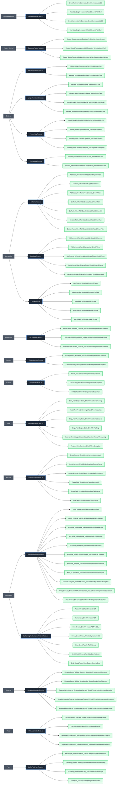

# Design Pattern Unit Tests Summary

Document tổng hợp hệ thống Unit Test cho các Design Pattern trong BBV-DBMS dưới dạng Flowchart.

```mermaid
flowchart LR
    %% Patterns
    TM["Template Method"]
    FM["Factory Method"]
    S["Strategy"]
    C["Composite"]
    Cmd["Command"]
    I["Iterator"]
    B["Builder"]
    State["State"]
    Facade["Facade"]
    Int["Interpreter"]
    Obs["Observer"]
    Vis["Visitor"]

    %% Template Method
    TM --> TM_TMT["TemplateMethodTests.cs"]
    TM_TMT --> TM_TMT_1["CreateTableScriptGenerator_ShouldGenerateValidDdl"]
    TM_TMT --> TM_TMT_2["DropTableScriptGenerator_ShouldGenerateValidDdl"]
    TM_TMT --> TM_TMT_3["CreateSchemaScriptGenerator_ShouldGenerateValidDdl"]
    TM_TMT --> TM_TMT_4["AlterTableScriptGenerator_ShouldGenerateValidDdl"]

    %% Factory Method
    FM --> FM_DFT["DatabaseFactoryTests.cs"]
    FM_DFT --> FM_DFT_1["Create_ShouldInstantiateDatabaseAndRegisterDependencies"]
    FM_DFT --> FM_DFT_2["Create_ShouldThrowArgumentNullException_WhenOptionsIsNull"]
    FM_DFT --> FM_DFT_3["Create_ShouldThrowInvalidNameException_WhenDatabaseNameIsEmpty"]

    %% Strategy
    S --> S_CCT["CheckConstraintTests.cs"]
    S_CCT --> S_CCT_1["Validate_WhenExpressionIsTrue_ShouldReturnTrue"]
    S_CCT --> S_CCT_2["Validate_WhenExpressionIsFalse_ShouldReturnFalse"]

    S --> S_UCT["UniqueConstraintTests.cs"]
    S_UCT --> S_UCT_1["Validate_WhenKeyIsUnique_ShouldReturnTrue"]
    S_UCT --> S_UCT_2["Validate_WhenDuplicateKeyExists_ShouldReturnFalse"]
    S_UCT --> S_UCT_3["Validate_WhenUpdatingSameRow_ShouldIgnoreExistingRow"]
    S_UCT --> S_UCT_4["Validate_WhenCompositeKeyAlreadyExists_ShouldReturnFalse"]

    S --> S_PKT["PrimaryKeyTests.cs"]
    S_PKT --> S_PKT_1["Validate_WhenKeyIsUniqueAndNotNull_ShouldReturnTrue"]
    S_PKT --> S_PKT_2["Validate_WhenKeyContainsNull_ShouldReturnFalse"]
    S_PKT --> S_PKT_3["Validate_WhenDuplicateKeyExists_ShouldReturnFalse"]
    S_PKT --> S_PKT_4["Validate_WhenUpdatingSameRow_ShouldIgnoreExistingRow"]

    S --> S_FKT["ForeignKeyTests.cs"]
    S_FKT --> S_FKT_1["Validate_WhenReferencedValueExists_ShouldReturnTrue"]
    S_FKT --> S_FKT_2["Validate_WhenReferencedValueDoesNotExist_ShouldReturnFalse"]

    %% Composite
    C --> C_ST["SchemaTests.cs"]
    C_ST --> C_ST_1["AddTable_WhenTableIsValid_ShouldRegisterTable"]
    C_ST --> C_ST_2["AddTable_WhenTableIsNull_ShouldThrow"]
    C_ST --> C_ST_3["AddTable_WhenNameAlreadyExists_ShouldThrow"]
    C_ST --> C_ST_4["GetTable_WhenTableExists_ShouldReturnTable"]
    C_ST --> C_ST_5["GetTable_WhenTableDoesNotExist_ShouldReturnNull"]
    C_ST --> C_ST_6["ContainsTable_WhenTableExists_ShouldReturnTrue"]
    C_ST --> C_ST_7["ContainsTable_WhenTableDoesNotExist_ShouldReturnFalse"]

    C --> C_DT["DatabaseTests.cs"]
    C_DT --> C_DT_1["AddSchema_WhenSchemaIsValid_ShouldAddSchema"]
    C_DT --> C_DT_2["AddSchema_WhenSchemaIsNull_ShouldThrow"]
    C_DT --> C_DT_3["AddSchema_WhenSchemaNameAlreadyExists_ShouldThrow"]
    C_DT --> C_DT_4["GetSchema_WhenSchemaExists_ShouldReturnSchema"]
    C_DT --> C_DT_5["GetSchema_WhenSchemaDoesNotExist_ShouldReturnNull"]

    C --> C_TT["TableTests.cs"]
    C_TT --> C_TT_1["AddColumn_ShouldAddColumnToTable"]
    C_TT --> C_TT_2["AddConstraint_ShouldAddConstraintToTable"]
    C_TT --> C_TT_3["AddIndex_ShouldAddIndexToTable"]
    C_TT --> C_TT_4["AddPartition_ShouldAddPartitionToTable"]
    C_TT --> C_TT_5["AddTrigger_ShouldAddTriggerToTable"]

    %% Command
    Cmd --> Cmd_DCT["DdlCommandTests.cs"]
    Cmd_DCT --> Cmd_DCT_1["CreateTableCommand_Execute_ShouldThrowNotImplementedException"]
    Cmd_DCT --> Cmd_DCT_2["DropTableCommand_Execute_ShouldThrowNotImplementedException"]
    Cmd_DCT --> Cmd_DCT_3["DdlCommandExecutor_Execute_ShouldThrowNotImplementedException"]

    %% Iterator
    I --> I_CIT["CatalogIteratorTests.cs"]
    I_CIT --> I_CIT_1["CatalogIterator_HasMore_ShouldThrowNotImplementedException"]
    I_CIT --> I_CIT_2["CatalogIterator_GetNext_ShouldThrowNotImplementedException"]

    %% Builder
    B --> B_TBT["TableBuilderTests.cs"]
    B_TBT --> B_TBT_1["Reset_ShouldThrowNotImplementedException"]
    B_TBT --> B_TBT_2["AddColumn_ShouldThrowNotImplementedException"]
    B_TBT --> B_TBT_3["Build_ShouldThrowNotImplementedException"]

    %% State
    State --> State_DST["DatabaseServerTests.cs"]
    State_DST --> State_DST_1["Start_FromStoppedState_ShouldTransitionToRunning"]
    State_DST --> State_DST_2["Start_WhenAlreadyRunning_ShouldThrowException"]
    State_DST --> State_DST_3["Stop_FromRunningState_ShouldTransitionToStopped"]
    State_DST --> State_DST_4["Stop_FromStoppedState_ShouldDoNothing"]
    State_DST --> State_DST_5["Recover_FromStoppedState_ShouldTransitionThroughRecovering"]
    State_DST --> State_DST_6["Recover_WhenRunning_ShouldThrowException"]

    %% Facade
    Facade --> Facade_SST["SchemaServiceTests.cs"]
    Facade_SST --> Facade_SST_1["CreateSchema_ShouldCreateSchemaSuccessfully"]
    Facade_SST --> Facade_SST_2["CreateSchema_ShouldRejectDuplicateSchemaName"]
    Facade_SST --> Facade_SST_3["CreateSchema_ShouldCheckPermissionBeforeCreation"]
    Facade_SST --> Facade_SST_4["CreateTable_ShouldCreateTableSuccessfully"]
    Facade_SST --> Facade_SST_5["CreateTable_ShouldRejectDuplicateTableName"]
    Facade_SST --> Facade_SST_6["DropTable_ShouldRemoveExistingTable"]

    %% Interpreter
    Int --> Int_IPT["InterpreterPatternTests.cs"]
    Int_IPT --> Int_IPT_1["Token_ShouldStoreKindAndValueCorrectly"]
    Int_IPT --> Int_IPT_2["Lexer_Tokenize_ShouldThrowNotImplementedException"]
    Int_IPT --> Int_IPT_3["ASTNode_SelectNode_ShouldInitializeCorrectNodeType"]
    Int_IPT --> Int_IPT_4["ASTNode_IdentifierNode_ShouldInitializeCorrectName"]
    Int_IPT --> Int_IPT_5["ASTNode_LiteralNode_ShouldInitializeCorrectValue"]
    Int_IPT --> Int_IPT_6["ASTNode_BinaryExpressionNode_ShouldInitializeOperands"]
    Int_IPT --> Int_IPT_7["ASTNode_Interpret_ShouldThrowNotImplementedException"]
    Int_IPT --> Int_IPT_8["AST_ToLogicalPlan_ShouldThrowNotImplementedException"]
    Int_IPT --> Int_IPT_9["SemanticAnalyzer_BindWithNullAST_ShouldThrowArgumentNullException"]
    Int_IPT --> Int_IPT_10["QueryExecutor_ExecuteWithRuntimeContext_ShouldThrowNotImplementedException"]
    Int_IPT --> Int_IPT_11["ResultCursor_MoveNext_ShouldThrowNotImplementedException"]

    Int --> Int_SPT["SqlParsingAndSemanticAnalysisTests.cs"]
    Int_SPT --> Int_SPT_1["ParseSelect_ShouldGenerateAST"]
    Int_SPT --> Int_SPT_2["ParseInsert_ShouldGenerateAST"]
    Int_SPT --> Int_SPT_3["ParseCreate_ShouldGenerateASTForDDL"]
    Int_SPT --> Int_SPT_4["Parse_ShouldThrow_WhenSqlSyntaxIsInvalid"]
    Int_SPT --> Int_SPT_5["Bind_ShouldResolveTableNames"]
    Int_SPT --> Int_SPT_6["Bind_ShouldThrow_WhenTableDoesNotExist"]
    Int_SPT --> Int_SPT_7["Bind_ShouldThrow_WhenColumnDoesNotExist"]

    %% Observer
    Obs --> Obs_MOT["MetadataObserverTests.cs"]
    Obs_MOT --> Obs_MOT_1["MetadataEventPublisher_Publish_ShouldNotifySubscribedObservers"]
    Obs_MOT --> Obs_MOT_2["MetadataEventPublisher_Unsubscribe_ShouldStopNotifyingObserver"]
    Obs_MOT --> Obs_MOT_3["CatalogCacheObserver_OnMetadataChanged_ShouldThrowNotImplementedException"]
    Obs_MOT --> Obs_MOT_4["MetadataStatisticsObserver_OnMetadataChanged_ShouldThrowNotImplementedException"]
    Obs_MOT --> Obs_MOT_5["MetadataAuditObserver_OnMetadataChanged_ShouldThrowNotImplementedException"]

    %% Visitor
    Vis --> Vis_MVT["MetadataVisitorTests.cs"]
    Vis_MVT --> Vis_MVT_1["DdlExportVisitor_VisitTable_ShouldThrowNotImplementedException"]
    Vis_MVT --> Vis_MVT_2["DdlExportVisitor_GetResult_ShouldReturnString"]
    Vis_MVT --> Vis_MVT_3["DependencyScanVisitor_VisitSchema_ShouldThrowNotImplementedException"]
    Vis_MVT --> Vis_MVT_4["DependencyScanVisitor_GetDependencies_ShouldReturnReadOnlyCollection"]

    %% Proxy
    P["Proxy"] --> P_BPT["BufferPoolProxyTests.cs"]
    P_BPT --> P_BPT_1["FetchPage_WhenCacheMiss_ShouldDelegateToFileManagerRead"]
    P_BPT --> P_BPT_2["FetchPage_WhenCacheHit_ShouldReturnMemoryResidentPage"]
    P_BPT --> P_BPT_3["FlushPage_WhenPageIsDirty_ShouldWriteToFileManager"]
    P_BPT --> P_BPT_4["EvictPage_ShouldFlushDirtyPageBeforeEviction"]

    classDef patternNode fill:#4b5563,stroke:#9ca3af,color:#ffffff,stroke-width:2px,stroke-dasharray: 5 5
    classDef classNode fill:#1f2937,stroke:#60a5fa,color:#ffffff,stroke-width:2px
    classDef completedTest fill:#dcfce7,stroke:#22c55e,color:#111827,stroke-width:2px

    class TM,FM,S,C,Cmd,I,B,State,Facade,Int,Obs,Vis,P patternNode
    class TM_TMT,FM_DFT,S_CCT,S_UCT,S_PKT,S_FKT,C_ST,C_DT,C_TT,Cmd_DCT,I_CIT,B_TBT,State_DST,Facade_SST,Int_IPT,Int_SPT,Obs_MOT,Vis_MVT,P_BPT classNode
    class TM_TMT_1,TM_TMT_2,TM_TMT_3,TM_TMT_4 completedTest
    class FM_DFT_1,FM_DFT_2,FM_DFT_3 completedTest
    class S_CCT_1,S_CCT_2,S_UCT_1,S_UCT_2,S_UCT_3,S_UCT_4,S_PKT_1,S_PKT_2,S_PKT_3,S_PKT_4,S_FKT_1,S_FKT_2 completedTest
    class C_ST_1,C_ST_2,C_ST_3,C_ST_4,C_ST_5,C_ST_6,C_ST_7,C_DT_1,C_DT_2,C_DT_3,C_DT_4,C_DT_5,C_TT_1,C_TT_2,C_TT_3,C_TT_4,C_TT_5 completedTest
    class Cmd_DCT_1,Cmd_DCT_2,Cmd_DCT_3 completedTest
    class I_CIT_1,I_CIT_2 completedTest
    class B_TBT_1,B_TBT_2,B_TBT_3 completedTest
    class State_DST_1,State_DST_2,State_DST_3,State_DST_4,State_DST_5,State_DST_6 completedTest
    class Facade_SST_1,Facade_SST_2,Facade_SST_3,Facade_SST_4,Facade_SST_5,Facade_SST_6 completedTest
    class Int_IPT_1,Int_IPT_2,Int_IPT_3,Int_IPT_4,Int_IPT_5,Int_IPT_6,Int_IPT_7,Int_IPT_8,Int_IPT_9,Int_IPT_10,Int_IPT_11 completedTest
    class Int_SPT_1,Int_SPT_2,Int_SPT_3,Int_SPT_4,Int_SPT_5,Int_SPT_6,Int_SPT_7 completedTest
    class Obs_MOT_1,Obs_MOT_2,Obs_MOT_3,Obs_MOT_4,Obs_MOT_5 completedTest
    class Vis_MVT_1,Vis_MVT_2,Vis_MVT_3,Vis_MVT_4 completedTest
    class P_BPT_1,P_BPT_2,P_BPT_3,P_BPT_4 completedTest
```
