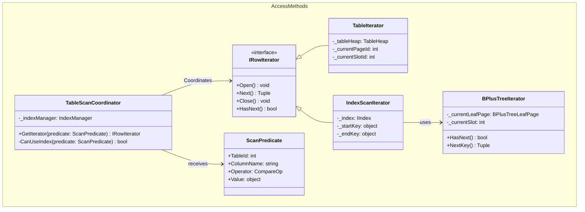

## Group 8 — Access Methods
*Role in Sequence (Read Path): The highest layer. The TableScanCoordinator selects the appropriate type of Iterator (sequential scan vs. index scan) and returns the Tuples back to the Query Execution engine.*

