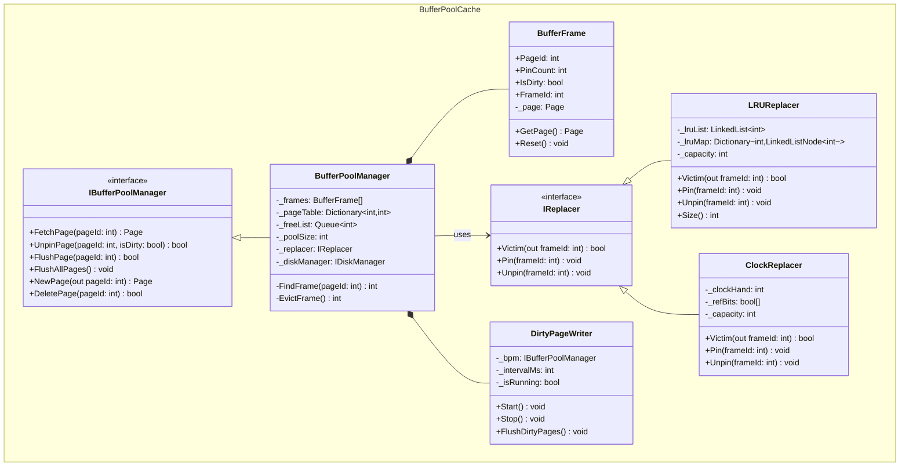

## Group 2 — RAM Buffer Pool (Buffer Pool + Cache)
*The buffer pool acts as the main memory buffer that sits between the storage engine (DiskManager) and the higher-level access methods (TableIterator). It fetches pages from disk into memory and manages page replacement using algorithms like LRU or Clock.*

