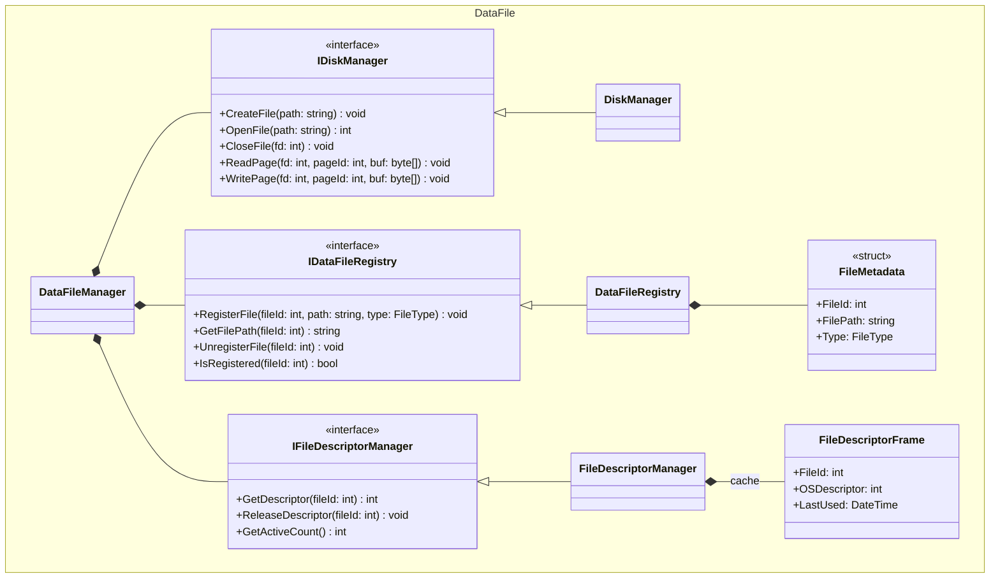

## Group 1 — Disk Access Layer (Data File Manager)
*Role in Sequence: The lowest layer, communicating directly with the operating system.*

```mermaid
classDiagram
    namespace DataFile {
        class DataFileManager
        class IDiskManager {
            <<interface>>
            +CreateFile(path: string) void
            +OpenFile(path: string) int
            +CloseFile(fd: int) void
            +ReadPage(fd: int, pageId: int, buf: byte[]) void
            +WritePage(fd: int, pageId: int, buf: byte[]) void
        }
        class DiskManager
        class IDataFileRegistry {
            <<interface>>
            +RegisterFile(fileId: int, path: string, type: FileType) void
            +GetFilePath(fileId: int) string
            +UnregisterFile(fileId: int) void
            +IsRegistered(fileId: int) bool
        }
        class DataFileRegistry
        class FileMetadata {
            <<struct>>
            +FileId: int
            +FilePath: string
            +Type: FileType
        }
        class IFileDescriptorManager {
            <<interface>>
            +GetDescriptor(fileId: int) int
            +ReleaseDescriptor(fileId: int) void
            +GetActiveCount() int
        }
        class FileDescriptorManager
        class FileDescriptorFrame {
            +FileId: int
            +OSDescriptor: int
            +LastUsed: DateTime
        }
    }
    DataFileManager *-- IDiskManager
    DataFileManager *-- IDataFileRegistry
    DataFileManager *-- IFileDescriptorManager
    IDiskManager <|-- DiskManager
    IDataFileRegistry <|-- DataFileRegistry
    DataFileRegistry *-- FileMetadata
    IFileDescriptorManager <|-- FileDescriptorManager
    FileDescriptorManager *-- FileDescriptorFrame : cache
```
