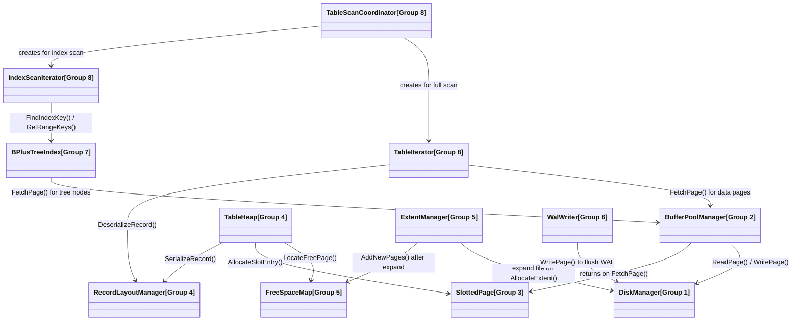

# Storage Engine - Dependency Map Between 8 Groups

Instead of a giant flat diagram, this architectural map is **segmented into distinct groups (clusters)** based on the practical roles of each class across the 2 sequence diagram workflows:

- **Workflow 1 (Read path):** `TableIterator → BufferPoolManager → IReplacer → DiskManager`
- **Workflow 2 (Write path):** `RecordLayoutManager → FreeSpaceMap/ExtentManager → SlottedPage → WalWriter`

---

## Dependency Map Between 8 Groups
*Each node below is the specific class responsible for crossing the group boundary. The group it belongs to is shown in brackets.*

