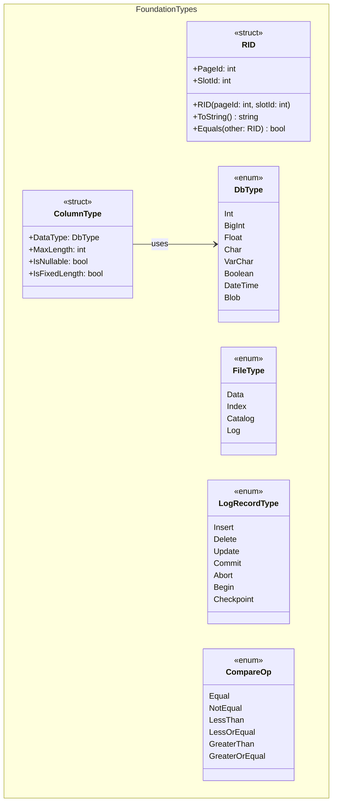

These structures (structs) and enumerations (enums) are referenced by almost every class across the entire system. This group MUST be defined BEFORE writing any other classes — otherwise, the compiler will trigger errors immediately.

> **Note:** `RID` is used by `Tuple`, `IIndex`, `BPlusTreeLeafPage`, `TableHeap`. `FileType` is used by `FileMetadata`. `LogRecordType` is used by `LogRecord`. `ColumnType` is used by `Schema`. `CompareOp` is used by `ScanPredicate`.
