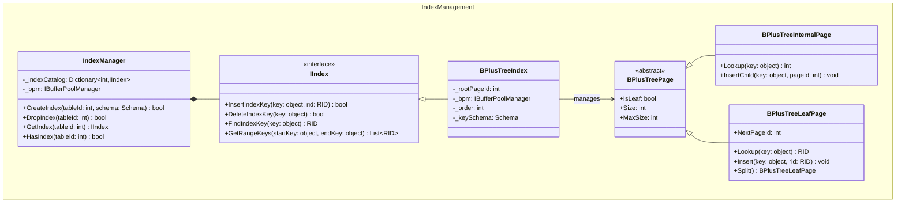

## Group 7 — Index Management
*Role: Stores the B+Tree data structure on special Pages. When the IndexScanIterator (Group 8) needs to search by key, it will traverse the nodes of this group.*

```mermaid
classDiagram
    namespace IndexManagement {
        class IndexManager {
            -_indexCatalog: Dictionary~int,IIndex~
            -_bpm: IBufferPoolManager
            +CreateIndex(tableId: int, schema: Schema) bool
            +DropIndex(tableId: int) bool
            +GetIndex(tableId: int) IIndex
            +HasIndex(tableId: int) bool
        }
        class IIndex {
            <<interface>>
            +InsertIndexKey(key: object, rid: RID) bool
            +DeleteIndexKey(key: object) bool
            +FindIndexKey(key: object) RID
            +GetRangeKeys(startKey: object, endKey: object) List~RID~
        }
        class BPlusTreeIndex {
            -_rootPageId: int
            -_bpm: IBufferPoolManager
            -_order: int
            -_keySchema: Schema
        }
        class BPlusTreePage {
            <<abstract>>
            +IsLeaf: bool
            +Size: int
            +MaxSize: int
        }
        class BPlusTreeInternalPage {
            +Lookup(key: object) int
            +InsertChild(key: object, pageId: int) void
        }
        class BPlusTreeLeafPage {
            +NextPageId: int
            +Lookup(key: object) RID
            +Insert(key: object, rid: RID) void
            +Split() BPlusTreeLeafPage
        }
    }
    IndexManager *-- IIndex
    IIndex <|-- BPlusTreeIndex
    BPlusTreeIndex --> BPlusTreePage : manages
    BPlusTreePage <|-- BPlusTreeInternalPage
    BPlusTreePage <|-- BPlusTreeLeafPage
```
