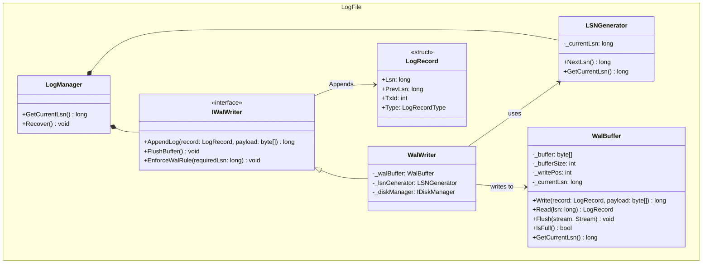

## Group 6 — Write-Ahead Log (Log File / WAL)
*Role in Sequence (Write Path): This step occurs immediately before the actual data is written. The WalWriter must call AppendLog() before AllocateSlotEntry() is invoked, adhering to the ACID principle.*

