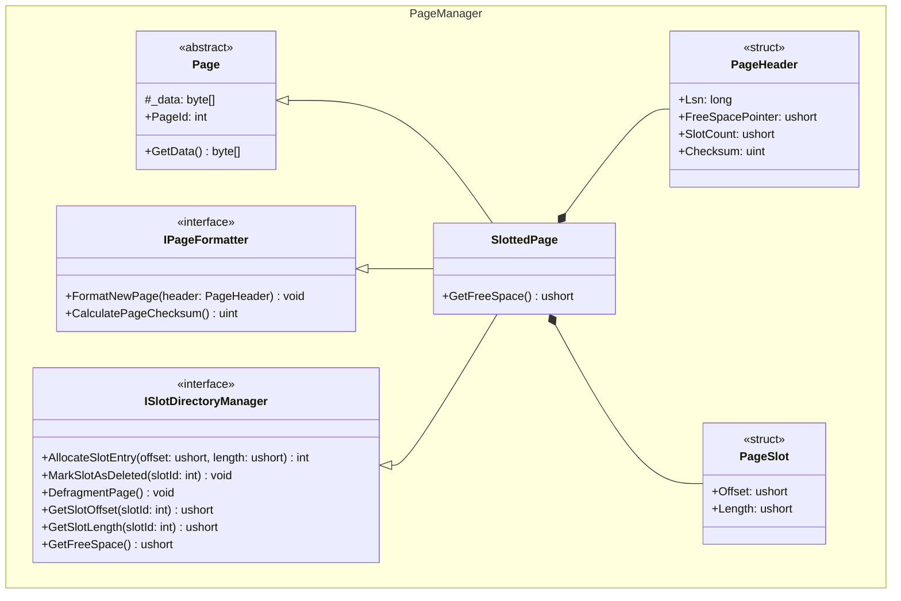

## Group 3 — Page Structure (Page Manager)
*Role in Sequence: This is the type of data that is transmitted. BufferPoolManager returns a SlottedPage for the above to write the Record to.*

```mermaid
classDiagram
    namespace PageManager {
        class Page {
            <<abstract>>
            #_data: byte[]
            +PageId: int
            +GetData() byte[]
        }
        class IPageFormatter {
            <<interface>>
            +FormatNewPage(header: PageHeader) void
            +CalculatePageChecksum() uint
        }
        class ISlotDirectoryManager {
            <<interface>>
            +AllocateSlotEntry(offset: ushort, length: ushort) int
            +MarkSlotAsDeleted(slotId: int) void
            +DefragmentPage() void
            +GetSlotOffset(slotId: int) ushort
            +GetSlotLength(slotId: int) ushort
            +GetFreeSpace() ushort
        }
        class SlottedPage {
            +GetFreeSpace() ushort
        }
        class PageHeader {
            <<struct>>
            +Lsn: long
            +FreeSpacePointer: ushort
            +SlotCount: ushort
            +Checksum: uint
        }
        class PageSlot {
            <<struct>>
            +Offset: ushort
            +Length: ushort
        }
    }
    Page <|-- SlottedPage
    IPageFormatter <|-- SlottedPage
    ISlotDirectoryManager <|-- SlottedPage
    SlottedPage *-- PageHeader
    SlottedPage *-- PageSlot
```