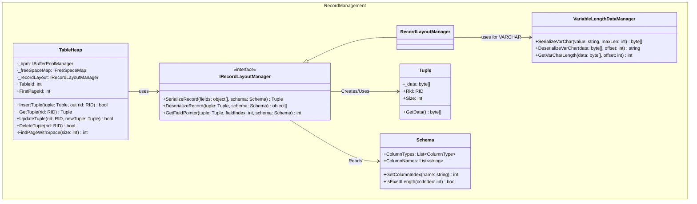

## Group 4 — Record Management
*Role in Sequence (Write Path): This is the initial step. The Transaction Manager calls SerializeRecord() to convert C# data into a binary Tuple before inserting it into a Page.*

