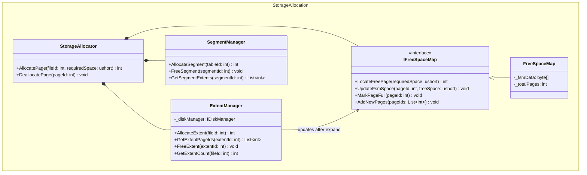

## Group 5 — Storage Allocation
*Role in Sequence (Write Path): Step 2. After obtaining a Tuple, the system must query the FreeSpaceMap to find a Page with sufficient space. If none is found, the ExtentManager allocates additional space.*

