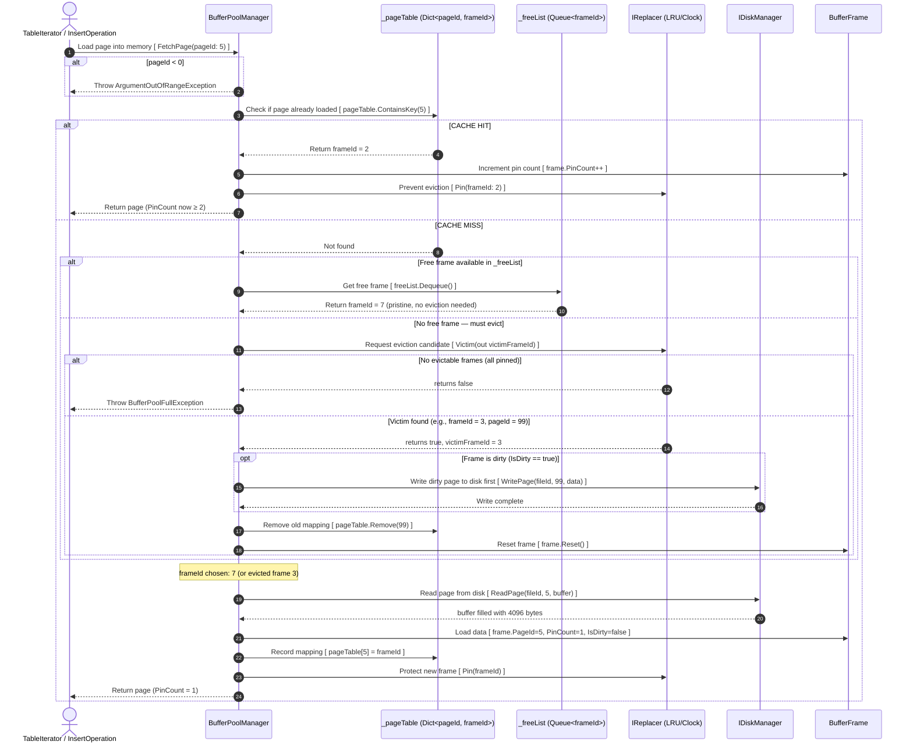
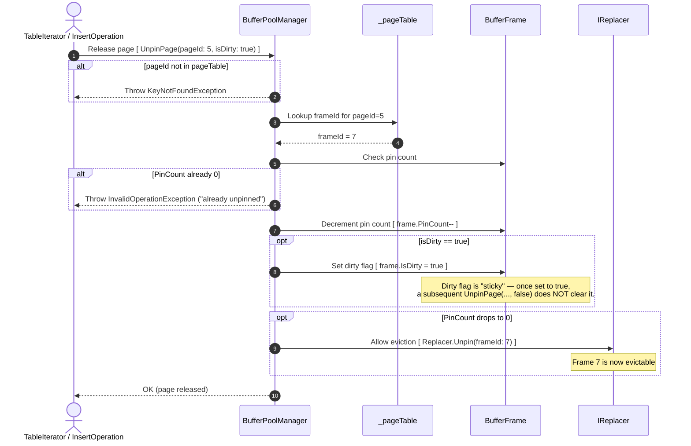
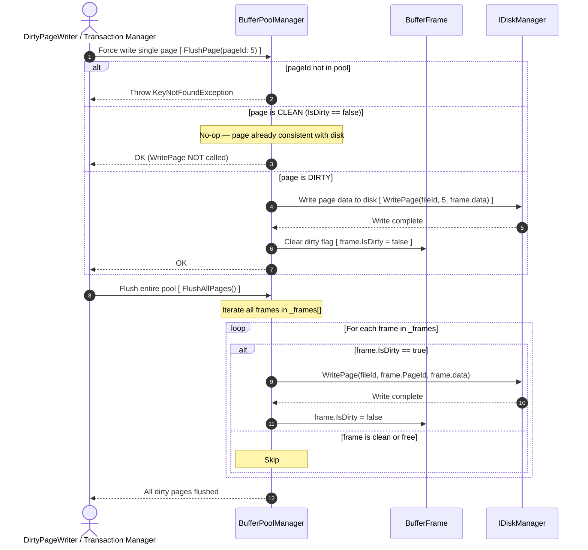
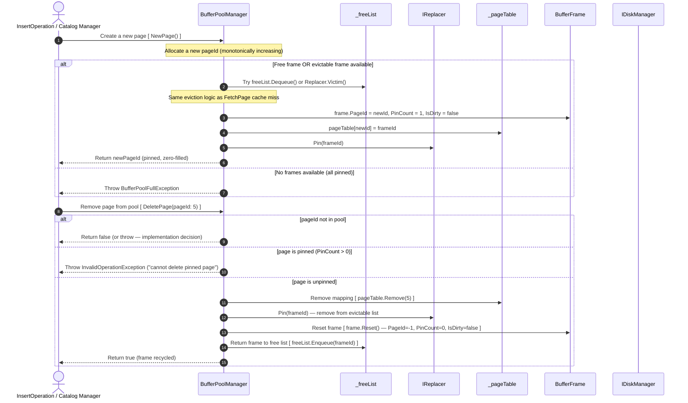
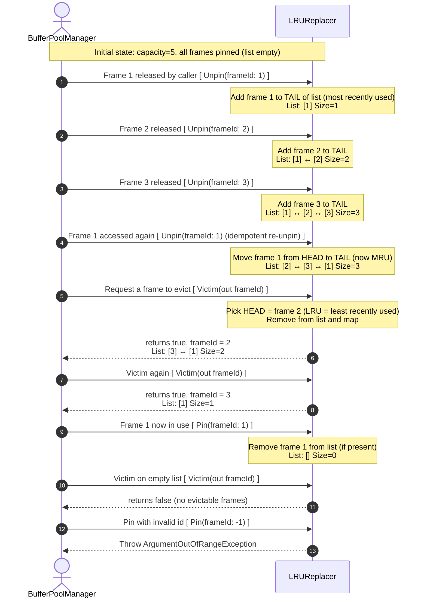
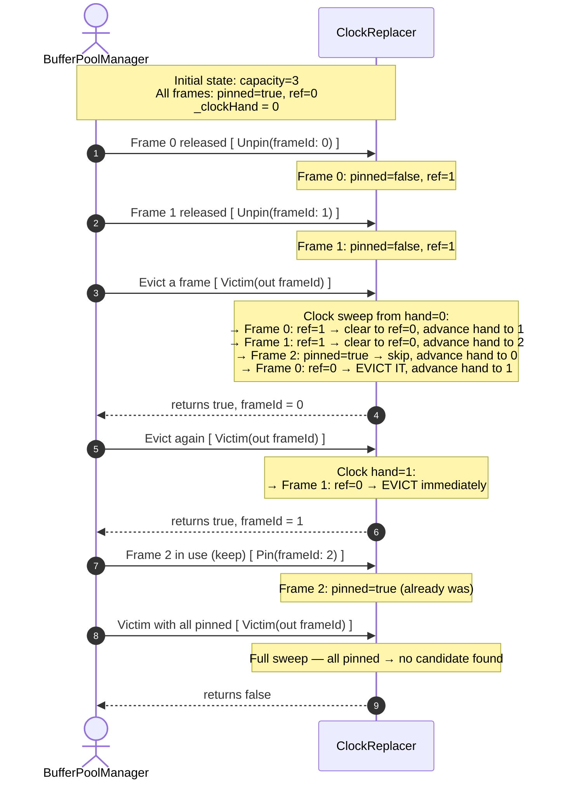

# BufferPoolManager — Internal Operations

Context: The `BufferPoolManager` (BPM) is the central memory manager of the storage engine. The [page-fetching.md](overview/page-fetching.md) overview shows the high-level flow; this diagram zooms into the **complete BPM operation set**: `FetchPage`, `UnpinPage`, `FlushPage`, `FlushAllPages`, `NewPage`, and `DeletePage`. Understanding the internal `BufferFrame` state machine is essential for writing `BufferPoolManagerTests`.

---

## Part A — BufferFrame State Machine

Each slot in the buffer pool is a `BufferFrame`:

```
BufferFrame states:
                    ┌──────────────┐
     ──────────────►│    FREE      │◄─────────────────────────────────────
     (initial /     │ PageId = -1  │                                      │
      after delete) │ PinCount = 0 │                                      │
                    │ IsDirty=false│                                      │
                    └──────┬───────┘                                      │
                           │ FetchPage(pageId) / NewPage()                │
                           │ ReadPage from disk → load data               │
                           ▼                                              │
                    ┌──────────────┐   UnpinPage(dirty=true)  ┌──────────────────┐
                    │   PINNED     │─────────────────────────►│ PINNED + DIRTY   │
                    │ PinCount ≥ 1 │◄─────────────────────────│ PinCount ≥ 1    │
                    │ IsDirty=false│  UnpinPage(dirty=false)   └──────────────────┘
                    └──────┬───────┘                                  │
          UnpinPage        │ (PinCount drops to 0)                    │ (PinCount drops to 0)
          → Replacer.Unpin ▼                                          ▼
                    ┌──────────────┐                     ┌──────────────────┐
                    │  EVICTABLE   │                     │ EVICTABLE+DIRTY  │
                    │ PinCount = 0 │    FlushPage()      │ PinCount = 0     │
                    │ IsDirty=false│◄────────────────────│ IsDirty = true   │
                    └──────┬───────┘                     └──────────────────┘
                           │ Replacer.Victim() picks this frame
                           │ (no WritePage needed — clean)
                           └──────────────────────────────────────────────┘
                                          → back to FREE
```

---

## Part B — FetchPage (Cache Hit & Cache Miss)



---

## Part C — UnpinPage



---

## Part D — FlushPage & FlushAllPages



---

## Part E — NewPage & DeletePage



---

# Mapping to Test Cases

## 9A. FetchPage

| Test | Diagram step |
|:-----|:------------|
| `FetchPage_CacheHit_ReturnsSamePageObject` | Part B: Cache Hit path |
| `FetchPage_CacheHit_PinCountIncrements` | Part B step 5 (`PinCount++`) |
| `FetchPage_CacheHit_ReadPageCalledOnlyOnce` | Part B: Cache Hit — disk not called again |
| `FetchPage_CacheMiss_FreeFrame_CallsReadPage` | Part B: Cache Miss → ReadPage |
| `FetchPage_CacheMiss_Eviction_DirtyFrame_WritesFirst` | Part B: eviction → WritePage before ReadPage |
| `FetchPage_CacheMiss_Eviction_OldPageRemovedFromTable` | Part B: `pageTable.Remove(victimPageId)` |
| `FetchPage_NoFrameAvailable_ThrowsBufferPoolFullException` | Part B: Replacer returns false |
| `FetchPage_NegativePageId_ThrowsArgumentOutOfRangeException` | Part B step 3 guard |

## 9B. UnpinPage

| Test | Diagram step |
|:-----|:------------|
| `UnpinPage_IsDirtyTrue_MarksFrameDirty` | Part C: `isDirty=true` sets dirty flag |
| `UnpinPage_CleanUnpinAfterDirtyUnpin_StillDirty` | Part C: "sticky" dirty note |
| `UnpinPage_PinCountZero_FrameAddedToReplacer` | Part C: `Replacer.Unpin()` when PinCount=0 |
| `UnpinPage_PageNotInPool_ThrowsKeyNotFoundException` | Part C step 4 |
| `UnpinPage_PinCountAlreadyZero_ThrowsInvalidOperationException` | Part C step 9 |

## 9C/D. Flush

| Test | Diagram step |
|:-----|:------------|
| `FlushPage_DirtyPage_CallsWritePage` | Part D: dirty path |
| `FlushPage_CleanPage_DoesNotCallWritePage` | Part D: clean path (no-op) |
| `FlushAllPages_MixedDirty_WritesOnlyDirty` | Part D loop: conditional write |
| `FlushAllPages_ClearsAllDirtyFlags` | Part D: `IsDirty = false` after flush |

## 9E/F. NewPage & DeletePage

| Test | Diagram step |
|:-----|:------------|
| `NewPage_ReturnsNonNegativePageId` | Part E: new monotonic ID |
| `NewPage_NewPageIsPinned` | Part E: `PinCount = 1` |
| `DeletePage_PinnedPage_ThrowsInvalidOperationException` | Part E Delete: pinned check |
| `DeletePage_UnpinnedPage_FrameReturnedToFreeList` | Part E Delete: frame recycled |
| `DeletePage_AfterDelete_FetchLoadsFromDiskAgain` | Part E Delete → Part B Cache Miss |
# Replacer Algorithms: LRUReplacer & ClockReplacer

Context: The `IReplacer` interface is the **eviction policy engine** inside the `BufferPoolManager`. When the buffer pool has no free frames and a new page must be loaded, the replacer decides which existing frame to evict. This diagram details the internal state transitions of both `LRUReplacer` and `ClockReplacer`. This is the exact flow exercised by `LRUReplacerTests` and `ClockReplacerTests`.

---

## Part A — LRUReplacer (Least Recently Used)

### Internal Structure
```
_lruList (LinkedList<int>): [3] ↔ [1] ↔ [2]    ← head = LRU (oldest), tail = MRU (newest)
_lruMap  (Dictionary<int, Node>): { 3→Node, 1→Node, 2→Node }
```
Frames in this list are **evictable** (unpinned). Pinned frames are NOT in the list.



---

## Part B — ClockReplacer (Clock / Second Chance)

### Internal Structure
```
_frames array (size = capacity):
  Index:    [0]     [1]     [2]     [3]
  State:    {pinned=false, ref=1}  {pinned=false, ref=0}  {pinned=true}  {pinned=false, ref=1}
_clockHand: integer index that advances around the ring
```



---

# Key Differences: LRU vs Clock

| Property | LRUReplacer | ClockReplacer |
|:---------|:-----------|:-------------|
| **Eviction order** | Strictly LRU (oldest unpinned) | Approximate LRU (second-chance) |
| **Data structure** | `LinkedList` + `Dictionary` | Circular `bool[]` array |
| **Memory overhead** | O(n) per frame (pointer nodes) | O(1) per frame (single bit) |
| **Unpin semantics** | Moves to tail of LRU list | Sets `ref_bit = 1` |
| **Victim scan** | O(1) — always head of list | O(n) worst case (full sweep) |
| **Re-access grace** | Re-unpin moves frame to MRU tail | Sets `ref_bit = 1` (gets one more chance) |

---

# Mapping to Test Cases

## LRUReplacer

| Test | Diagram step |
|:-----|:------------|
| `Victim_NoUnpinnedFrames_ReturnsFalse` | Step 17 (empty list) |
| `Victim_OneUnpinnedFrame_ReturnsTrueAndId` | Steps 3–8 (single frame) |
| `Victim_MultipleUnpinned_ReturnsLRU` | Steps 3–10 (multi-frame, picks head) |
| `Victim_AfterReAccess_SkipsRecentlyUsed` | Steps 11–14 (re-unpin moves to tail) |
| `Victim_SequentialCalls_CorrectOrder` | Steps 11–14 × 3 |
| `Pin_UnpinnedFrame_RemovesFromEvictableList` | Steps 15–16 |
| `Unpin_AlreadyUnpinned_IsIdempotent` | Step 11 — re-unpin idempotent (moves to tail) |
| `Pin_InvalidFrameId_ThrowsArgumentOutOfRangeException` | Step 19 |
| `Size_AfterUnpin_Increases` | Steps 3–8 → `Size == 1` |
| `InterleavePattern_LRUMaintained` | Steps 11–14 interleave |

## ClockReplacer

| Test | Diagram step |
|:-----|:------------|
| `Victim_NoFrames_ReturnsFalse` | Step 19 (all pinned) |
| `Victim_OneFrameRefBitOne_ClearsAndReturnsItself` | Steps 7–14 (full sweep, clears, then evicts) |
| `Victim_F0RefBit1_F1RefBit0_ReturnsF1` | Steps 7–13 (F0 cleared, F1 evicted next cycle) |
| `Victim_AllRefBitOne_FullSweepThenEvicts` | Steps 7–14 (clears all, then evicts frame 0) |
| `ClockHand_WrapAround_CorrectCycle` | Steps 7–19 (wrap-around) |
| `Pin_Frame_ExcludesFromEviction` | Step 16 — pinned frame skipped in sweep |
| `Unpin_InvalidFrameId_ThrowsArgumentOutOfRangeException` | (guard on frameId bounds) |
