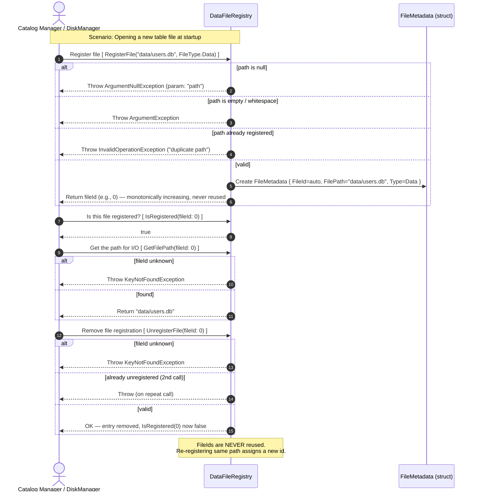
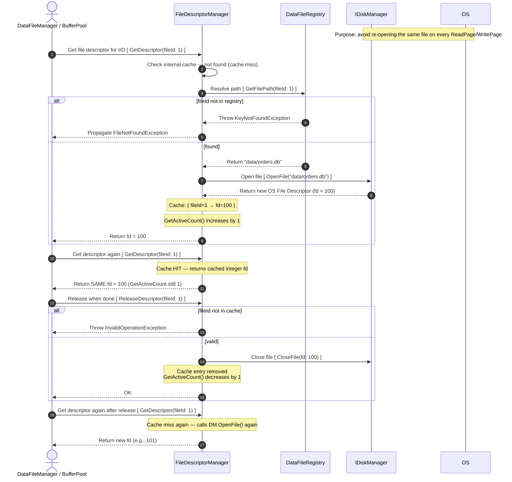
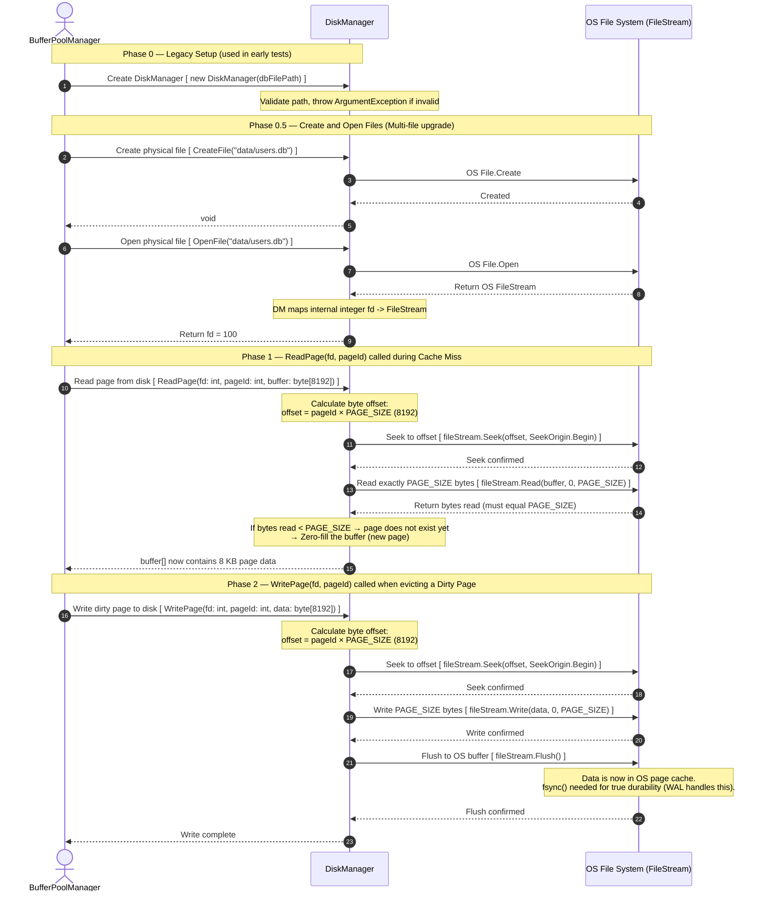

# DataFileRegistry & FileDescriptorManager

Context: Before any page can be read or written, the DBMS must know **which physical file** corresponds to a given logical `fileId`, and it must hold an open OS file descriptor to perform I/O. This diagram covers the two coordination components that manage this mapping and caching. These components sit **between the high-level DiskManager and the OS file system**. This is the exact flow exercised by `DataFileRegistryTests` and `FileDescriptorManagerTests`.

---

## Part A — DataFileRegistry (File Lifecycle)



---

## Part B — FileDescriptorManager (OS Handle Caching)



---

# Breakdown: Key Design Decisions

## DataFileRegistry

- **Monotonically increasing IDs:** `fileId` values start at 0 and count up. They are **never recycled** — this prevents "ABA problems" where a new file accidentally reuses an old ID that other components might still reference.
- **Path uniqueness:** Registering the same path twice throws `InvalidOperationException`. The same file cannot be logically registered under two different IDs.

## FileDescriptorManager

- **Descriptor caching:** Opening OS file handles is expensive. The `FileDescriptorManager` keeps a `Dictionary<int, FileDescriptorFrame>` — same `fileId` → same descriptor object (verified by `GetDescriptor_SameFileId_ReturnsCachedDescriptor`).
- **`GetActiveCount()`:** Tracks how many distinct files currently have open handles. Calling `GetDescriptor(1)` twice still counts as 1 (cached). Used for resource monitoring and shutdown cleanup.
- **No automatic release on last unpin:** Unlike `BufferFrame.PinCount`, descriptors are explicitly managed by the caller — there is no reference counting; the caller must call `ReleaseDescriptor()` explicitly.

---

## Mapping to Test Cases

### DataFileRegistry

| Test | What diagram step it covers |
|:-----|:---------------------------|
| `RegisterFile_ValidPath_ReturnsNonNegativeId` | Part A step 6 (happy path) |
| `RegisterFile_IdsAreMonotonicallyIncreasing` | Part A — note: IDs never reused |
| `RegisterFile_NullPath_ThrowsArgumentNullException` | Part A step 3 (null guard) |
| `RegisterFile_SamePathTwice_ThrowsInvalidOperationException` | Part A step 5 (duplicate guard) |
| `IsRegistered_AfterRegister_ReturnsTrue` | Part A step 8 |
| `IsRegistered_AfterUnregister_ReturnsFalse` | Part A step 14 |
| `GetFilePath_UnknownId_ThrowsKeyNotFoundException` | Part A step 11 (alt: fileId unknown) |
| `UnregisterFile_TwiceSameId_ThrowsOnSecondCall` | Part A step 15 (alt: repeat call) |
| `RegisterAfterUnregister_NewIdAssigned` | Part A note: new id assigned |

### FileDescriptorManager

| Test | What diagram step it covers |
|:-----|:---------------------------|
| `GetDescriptor_ValidFileId_ReturnsNonNull` | Part B steps 3–10 (cache miss path) |
| `GetDescriptor_SameFileId_ReturnsCachedDescriptor` | Part B steps 12–13 (cache hit) |
| `GetDescriptor_InvalidFileId_ThrowsFileNotFoundException` | Part B step 5 (KeyNotFoundException path) |
| `GetActiveCount_Initially_IsZero` | Part B — initial state |
| `GetActiveCount_GetSameFileTwice_IsOne` | Part B step 13 — cached, count stays 1 |
| `ReleaseDescriptor_AfterGet_ActiveCountDecreases` | Part B steps 16–20 |
| `ReleaseDescriptor_AlreadyReleased_ThrowsInvalidOperationException` | Part B step 17 (already released) |
| `GetDescriptor_AfterRelease_ReturnsNewDescriptor` | Part B steps 22–24 |
# DiskManager I/O Operations (ReadPage & WritePage)

Context: This diagram zooms into the **OS File API layer** — the `DiskManager` class that wraps raw file system calls. In [page-fetching.md](overview/page-fetching.md) it appears only as a note ("OS File API Wrapper performs the physical I/O operation"). Here we show exactly what happens inside `ReadPage()` and `WritePage()`, and what the `DiskManager` constructor validates. This is the exact flow exercised by `DiskManagerTests`.



# Sequence Breakdown: DiskManager I/O

This diagram expands on the **`ReadPage()` and `WritePage()`** calls that appear in [page-fetching.md](overview/page-fetching.md) (Steps 4 and 2 respectively). `DiskManager` is intentionally thin — it is a pure OS file wrapper with no caching logic.

---

## Phase 0 & 0.5 — Initialization

During the learning and foundation-building phase (Foundation), `DiskManager` is tested with a constructor that manages a single file:

`new DiskManager(path)`

As the system evolves to support multiple files (Core Engine), the constructor is simplified to initialize only an empty dictionary, while all file operations are performed through the following APIs:

- `CreateFile(path)`: Creates a new empty file.
- `OpenFile(path)`: Opens the file for I/O, allocates and returns a file descriptor (`fd`).
- `CloseFile(fd)`: Flushes pending data and closes the file connection.

---

## Phase 1 — ReadPage

**Byte offset calculation:**

$$\text{offset} = \text{pageId} \times \text{PAGE\_SIZE} = \text{pageId} \times 8192$$

For `pageId = 5`: offset = `5 × 8192 = 40960` bytes from file start.

**New page handling:** If the file does not yet contain `pageId` (i.e., `bytesRead < PAGE_SIZE`), the buffer is zero-filled. This represents an **uninitialized page** — the caller (BufferPoolManager) is responsible for recognizing and formatting it.

---

## Phase 2 — WritePage

WritePage is the counterpart of ReadPage — it serializes an in-memory page frame back to disk at the same byte offset. Key points:

- `Flush()` ensures data exits the .NET stream buffer into the **OS page cache**.
- This is **not** the same as `fsync()` — OS can still lose data on power failure.
- True crash safety requires the **WAL** to call `fsync()` on the log file first (WAL-before-data principle from [insert-record.md](overview/insert-record.md)).

---

## Architectural Role

```
BufferPoolManager
       │
       │ ReadPage(fd, pageId) / WritePage(fd, pageId, data)
       ▼
  DiskManager          ← This diagram covers this layer
       │
       │ FileStream.Seek + Read/Write
       ▼
  OS File System (*.db file on disk)
```

`DiskManager` is **dependency-injected** into `BufferPoolManager` via the `IDiskManager` interface — meaning tests for BPM can mock it without touching real disk.

---

## Mapping to Test Cases

| Test File | Test Name | What this diagram explains |
|:----------|:----------|:--------------------------|
| `DiskManagerTests` | `Constructor_WithValidDbFilePath_ShouldCreateInstance` | Phase 0: valid path → opens file handle |
| `DiskManagerTests` | `Constructor_WithNullOrEmptyFilePath_ShouldThrowArgumentException` | Phase 0: null/empty/whitespace path rejected |
