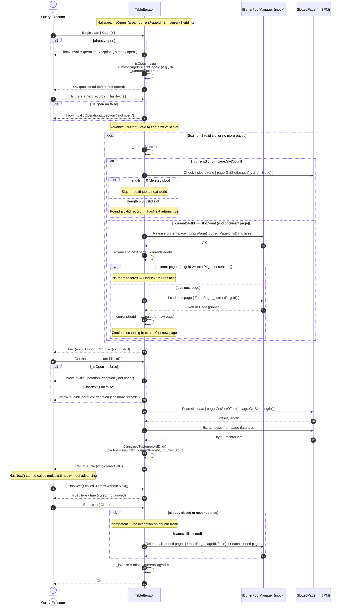
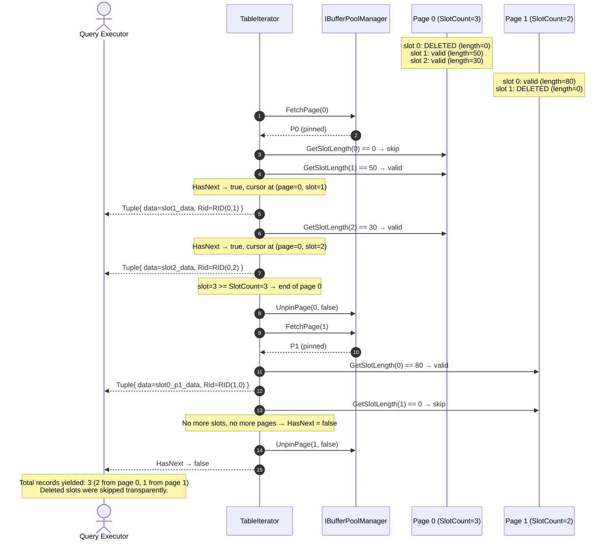
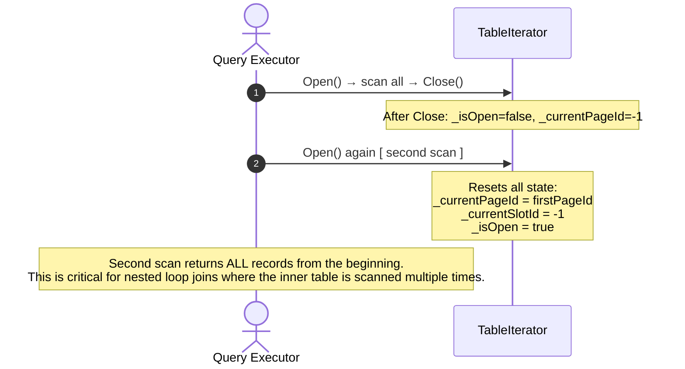
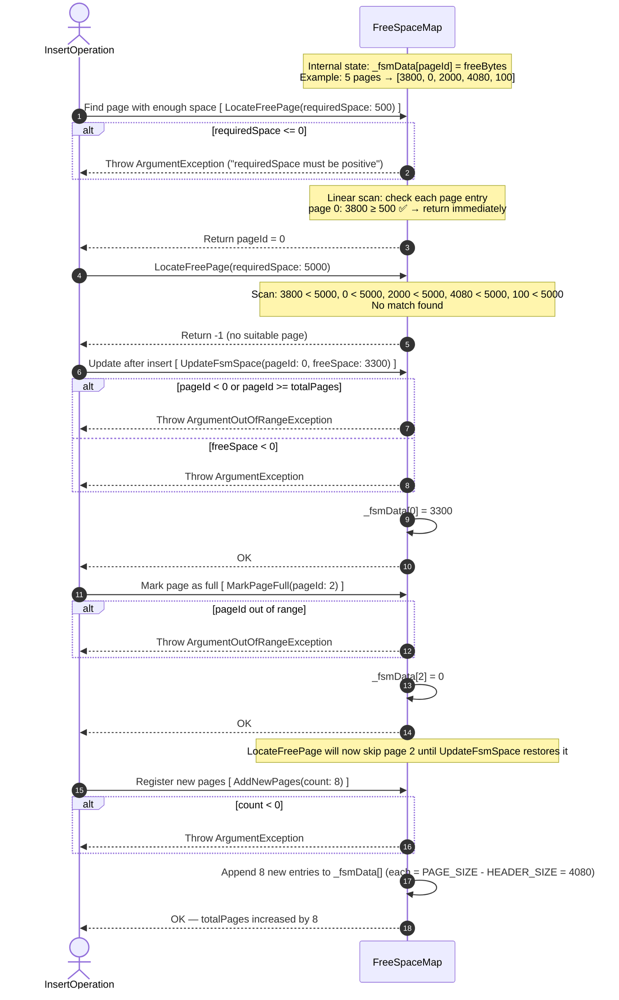
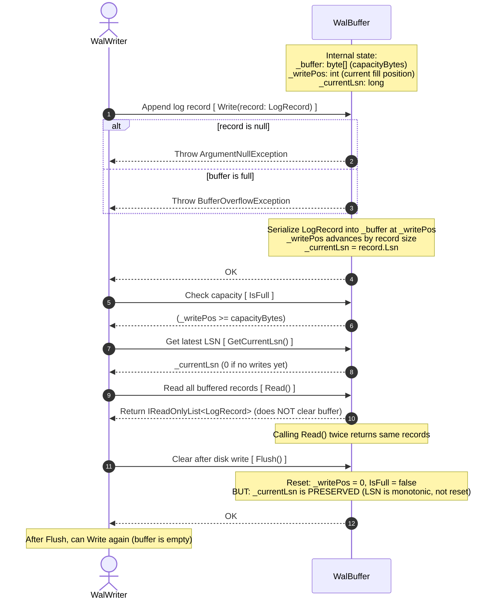
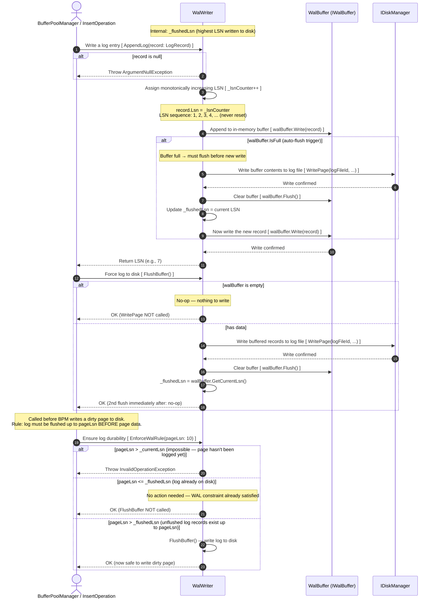

# TableIterator — Sequential Scan (Access Method)

Context: `TableIterator` implements `IRowIterator` and performs a **full table scan** by iterating through all pages of a `TableHeap` in order. The [page-fetching.md](overview/page-fetching.md) overview shows the BPM from the perspective of a single page fetch; this diagram shows the **complete scan lifecycle**: `Open()`, `HasNext()`, `Next()` across multiple pages with deleted slot skipping, and `Close()` with resource cleanup. This is the exact flow exercised by `TableIteratorTests`.

---

## Part A — Complete Scan Lifecycle

---

## Part B — Multi-Page Scan with Deleted Slot Skipping

---

## Part C — Reopen After Close

---

# Design Invariants

> [!IMPORTANT]
> **All fetched pages MUST be unpinned.** If `Close()` is called while pages are pinned, the iterator must unpin them all. Failure to do so causes `BufferPoolFullException` in long-running scans.

> [!NOTE]
> **`HasNext()` is idempotent.** Calling it multiple times without `Next()` must not advance the cursor. This is required for the standard `while(iter.HasNext()) { tuple = iter.Next(); ... }` pattern.

> [!NOTE]
> **RID assignment in Next().** The `Tuple.Rid` is set to `new RID(currentPageId, currentSlotId)` at read time — this matches the physical location and is used by index scans to correlate with the B+ tree leaf page lookup.

---

# Mapping to Test Cases

| Test | Diagram step |
|:-----|:------------|
| `Open_AlreadyOpen_ThrowsInvalidOperationException` | Part A step 4 |
| `HasNext_EmptyTable_ReturnsFalse` | Part A: all pages empty → false |
| `HasNext_TableWithRecords_ReturnsTrue` | Part A steps 10–16 |
| `HasNext_CalledMultipleTimes_SameResult` | Part A: idempotent note |
| `HasNext_BeforeOpen_ThrowsInvalidOperationException` | Part A step 8 |
| `Next_SingleRecord_ReturnsCorrectTuple` | Part A steps 17–24 |
| `Next_SkipsDeletedSlots` | Part B: slot 0 deleted → skip |
| `Next_SpansMultiplePages_AllRecordsReturned` | Part B: full multi-page scan |
| `Next_ReturnedTuple_HasCorrectRID` | Part A step 22: `Rid = RID(page, slot)` |
| `Next_WhenHasNextFalse_ThrowsInvalidOperationException` | Part A step 19 |
| `Close_ReleasesAllFetchedFrames` | Part A step 28 + Part B UnpinPage calls |
| `Close_BeforeOpen_NoException` | Part A: idempotent close |
| `Close_AfterClose_IsIdempotent` | Part A: idempotent close |
| `Reopen_AfterClose_RestartsFromBeginning` | Part C |
# FreeSpaceMap & WalBuffer & WalWriter

Context: Three advanced components that support the insert workflow. The [insert-record.md](overview/insert-record.md) overview calls `FSM.LocateFreePage()` and `WAL.AppendLog()` as single steps. This diagram zooms into the **internal mechanics** of each: how `FreeSpaceMap` tracks per-page free bytes, how `WalBuffer` accumulates log records in memory, and how `WalWriter` orchestrates LSN assignment and the WAL-before-data rule. This covers `FreeSpaceMapTests`, `WalBufferTests`, and `WalWriterTests`.

---

## Part A — FreeSpaceMap

---

## Part B — WalBuffer

---

## Part C — WalWriter (LSN Generation & WAL Rule Enforcement)

---

# Key Concepts

## FreeSpaceMap Accuracy

> [!NOTE]
> `FreeSpaceMap` stores an **approximation** of free space — it is updated after each insert via `UpdateFsmSpace()`, but does not perfectly account for fragmentation before `DefragmentPage()` is called. The actual free space is always confirmed by `SlottedPage.GetFreeSpace()` before allocation.

## WAL LSN Invariants

1. **Monotonically increasing:** Each `AppendLog()` call gets a higher LSN than all previous calls. LSN is **never reset**, even after `Flush()`.
2. **WAL-before-data:** `EnforceWalRule(pageLsn)` ensures `_flushedLsn >= pageLsn` before any dirty page is written to disk.
3. **Auto-flush:** When `WalBuffer.IsFull`, the `WalWriter` automatically flushes before accepting the next record — ensuring LSN continuity.

---

# Mapping to Test Cases

## FreeSpaceMap

| Test | Step |
|:-----|:-----|
| `LocateFreePage_SingleFreePageSufficient_ReturnsPageId` | Part A steps 3–9 |
| `LocateFreePage_AllPagesFull_ReturnsNegativeOne` | Part A steps 10–13 |
| `LocateFreePage_NeededZero_ThrowsArgumentException` | Part A step 4 |
| `UpdateFsmSpace_UpdatesCorrectPage` | Part A steps 14–20 |
| `UpdateFsmSpace_NegativeFreeBytes_Throws` | Part A step 17 |
| `MarkPageFull_PageNotReturnedByLocate` | Part A steps 21–25 |
| `AddNewPages_IncreasesCapacity` | Part A steps 26–30 |

## WalBuffer

| Test | Step |
|:-----|:-----|
| `Write_MultipleRecords_OrderPreserved` | Part B steps 3–11 |
| `Write_WhenFull_ThrowsBufferOverflowException` | Part B step 6 |
| `GetCurrentLsn_Initially_ReturnsZero` | Part B step 13 (0 if no writes) |
| `Read_DoesNotClearBuffer` | Part B steps 14–16 |
| `Flush_ClearsAllRecords` | Part B steps 17–20 |
| `GetCurrentLsn_AfterFlush_LsnPreserved` | Part B step 20 note |

## WalWriter

| Test | Step |
|:-----|:-----|
| `AppendLog_LsnIsMonotonicallyIncreasing` | Part C step 7 |
| `AppendLog_WritesToBuffer` | Part C step 9 |
| `AppendLog_BufferFull_AutoFlushesAndContinues` | Part C steps 11–18 |
| `AppendLog_LsnContinuesAfterAutoFlush` | Part C step 7 + note |
| `FlushBuffer_EmptyBuffer_NoDiskWrite` | Part C step 22 |
| `FlushBuffer_ClearsBuffer_SecondFlushNoWrite` | Part C steps 24–28 |
| `EnforceWalRule_PageLsnBelowCurrentFlushedLsn_NoFlush` | Part C step 33 |
| `EnforceWalRule_PageLsnEqualUnflushedLsn_FlushesBuffer` | Part C step 36 |
| `EnforceWalRule_PageLsnAboveCurrentLsn_ThrowsException` | Part C step 32 |
