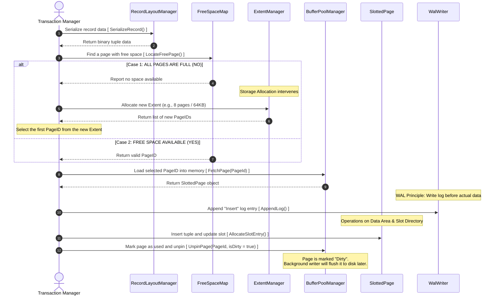

# Insert Record

Context: The user executes an INSERT INTO command.... This diagram details the branch that checks if the page is free; if not, it must request additional disk space (new Extension).

# Sequence Diagram Breakdown: Tuple Insertion Workflow

This sequence diagram illustrates the step-by-step process of **inserting a new record (tuple)** into a Database Management System (DBMS). It highlights the interactions between the `Transaction Manager`, `Storage Engine`, `Buffer Pool Manager`, and the `Write-Ahead Logging (WAL)` system.

---

## 1. Data Preparation Phase (Steps 1–2)

* **Action:** The Transaction Manager (`Exec`) requests the `RecordLayoutManager` (`Layout`) to serialize the record data via `SerializeRecord()`.
* **Purpose:** This converts the logical object representation of the record into a raw **binary tuple data** format, making it ready to be stored directly onto physical database pages.

---

## 2. Storage Allocation & Free Space Lookup (Steps 3–9)

To insert the record, the DBMS must locate a page with sufficient free space. It queries the `FreeSpaceMap` (`FSM`), which tracks space availability across all pages.

This triggers a conditional block (`alt`):
* **Case 1: All Pages Are Full**
  * The `FSM` reports that no space is available.
  * The `Exec` invokes the `ExtentManager` (`Extent`) to allocate a new block of storage (e.g., an Extent consisting of 8 pages / 64KB).
  * The `Extent` manager returns a list of newly allocated `PageIDs`, and the `Exec` picks the first `PageID` to proceed.
* **Case 2: Free Space Available**
  * The `FSM` successfully finds an existing page with enough free space and returns its `PageID`.

---

## 3. Page Loading & Write-Ahead Logging (Steps 10–12)

* **Memory Loading:** The `Exec` requests the `BufferPoolManager` (`BPM`) to load the selected page into RAM using `FetchPage(PageId)`. The `BPM` returns a `SlottedPage` object (a standard page format in DBMSs used to manage variable-length records).
* **The WAL Principle:** Crucially, before any modification happens on the page in memory, the `Exec` must append an "Insert" log entry to the `WalWriter` (`WAL`) via `AppendLog()`. This guarantees **Durability (the D in ACID)**; if the system crashes right after, the transaction can be recovered.

---

## 4. Data Insertion into the Page (Step 13)

* **Action:** The `Exec` inserts the binary tuple into the `SlottedPage` (`Page`) by calling `AllocateSlotEntry()`.
* **Internal Mechanics:** The page updates its internal structures—the binary data is written to the **Data Area**, and a new pointer entry is created in the **Slot Directory** at the top of the page to point to the data's location.

---

## 5. Page Release & Dirty Marking (Step 14)

* **Action:** Once the insertion is complete, the `Exec` releases the page by calling `UnpinPage(PageId, isDirty = true)`. This tells the `BufferPoolManager` that the current transaction is done utilizing this page (decrementing its `pin_count`).
* **The "Dirty" Flag:** Setting `isDirty = true` is vital. It marks the page in RAM as modified and out-of-sync with the disk. As indicated by the note, a **Background Writer** (or buffer pool flusher) will asynchronously flush this dirty page to physical disk storage later, minimizing real-time I/O latency for the transaction.

---

## Summary of Core Components

| Component | Responsibility |
| :--- | :--- |
| **Transaction Manager (`Exec`)** | The orchestrator coordinating the entire insertion workflow. |
| **RecordLayoutManager (`Layout`)** | Handles serialization/deserialization of logical records to binary data. |
| **FreeSpaceMap (`FSM`) & ExtentManager** | Manage disk space allocation and free space tracking. |
| **BufferPoolManager (`BPM`)** | Bridges memory (RAM) and disk; handles paging, pinning, and unpinning. |
| **SlottedPage (`Page`)** | The physical on-disk page structural model. |
| **WalWriter (`WAL`)** | Ensures logging happens *before* data writes to maintain system recovery protocols. |