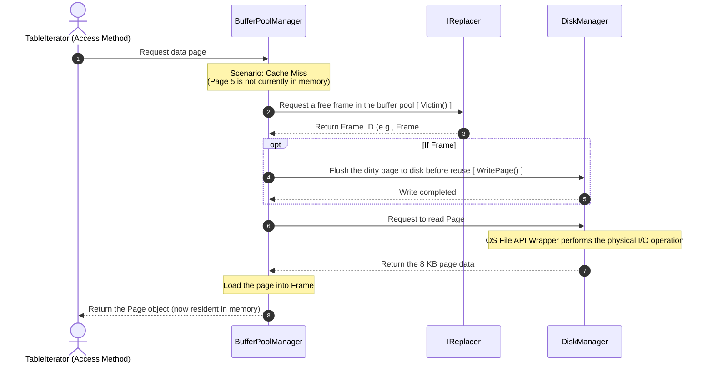

# Read data (Page Fetching - Cache Miss)

Context: The DBMS needs to read a record located on Page 5. The key feature here is the coordination of the Buffer Pool and Data File Manager branches when the data is not yet available in RAM.

# Buffer Pool Manager: Cache Miss Workflow

When a `TableIterator` (Access Method) requests page number 5 from the `BufferPoolManager` via the `FetchPage(5)` function, and a **Cache Miss** occurs, the system executes the following steps:

## 1. Detailed Execution Steps

1. **Cache Miss Detection**
   * The `Buffer Pool Manager` checks its internal page table and detects that page 5 is not currently present in the buffer pool.
2. **Find an Empty/Available Frame**
   * The system calls `IReplacer.Victim()` to select and retrieve a frame that can be reused based on the replacement policy (e.g., LRU, Clock, etc.).
3. **Handle Dirty Page (Optional/Conditional)**
   * If the selected frame contains a "dirty" page (data that has been modified in RAM but not yet written to disk), the system must write that dirty page back to the disk before reusing the frame.
4. **Read Data from Disk**
   * It calls `DiskManager.ReadPage(5)` to read 8KB of data from the database file on the hard drive (**Physical I/O**).
5. **Load Data into Buffer**
   * The newly read data from the disk is loaded into the frame chosen in Step 2.
6. **Pin the Page**
   * The system increments the `pin_count` of this page to prevent it from being evicted or replaced by other concurrent operations while it is actively in use.
7. **Return Result**
   * The `BufferPoolManager` returns the `Page` object to the Access Method to continue query processing.

---

## 2. Technical Significance

> [!IMPORTANT]
> Optimizing the buffer management mechanism plays a critical role in the overall performance of a Database Management System (DBMS).

* **I/O Bottleneck:** Cache Misses are the primary root cause of I/O bottlenecks in a DBMS because physical disk I/O operations are orders of magnitude slower than RAM access.
* **Victim Selection & Dirty Page Write:** The efficiency of the victim selection algorithm combined with the handling of dirty pages directly impacts query latency. If a dirty page is picked as a victim, the system suffers an additional write overhead before it can even perform the read operation.
* **Pin/Unpin Mechanism:** This is a core concurrency and synchronization technique used to protect pages currently in use, ensuring they are not safely evicted or overwritten by other threads.