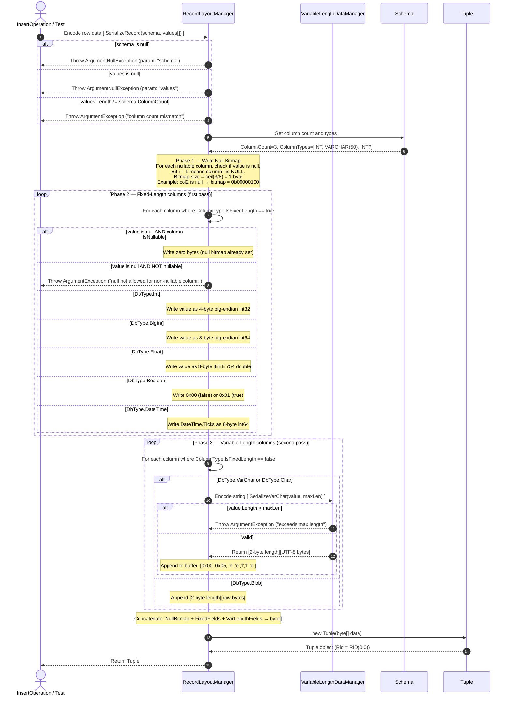
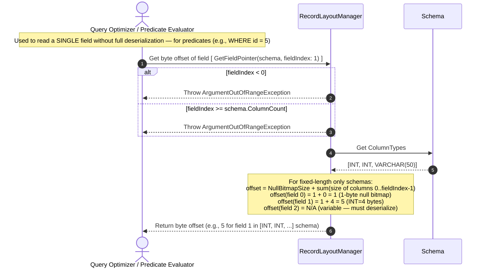
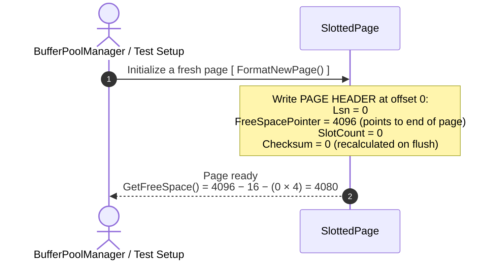
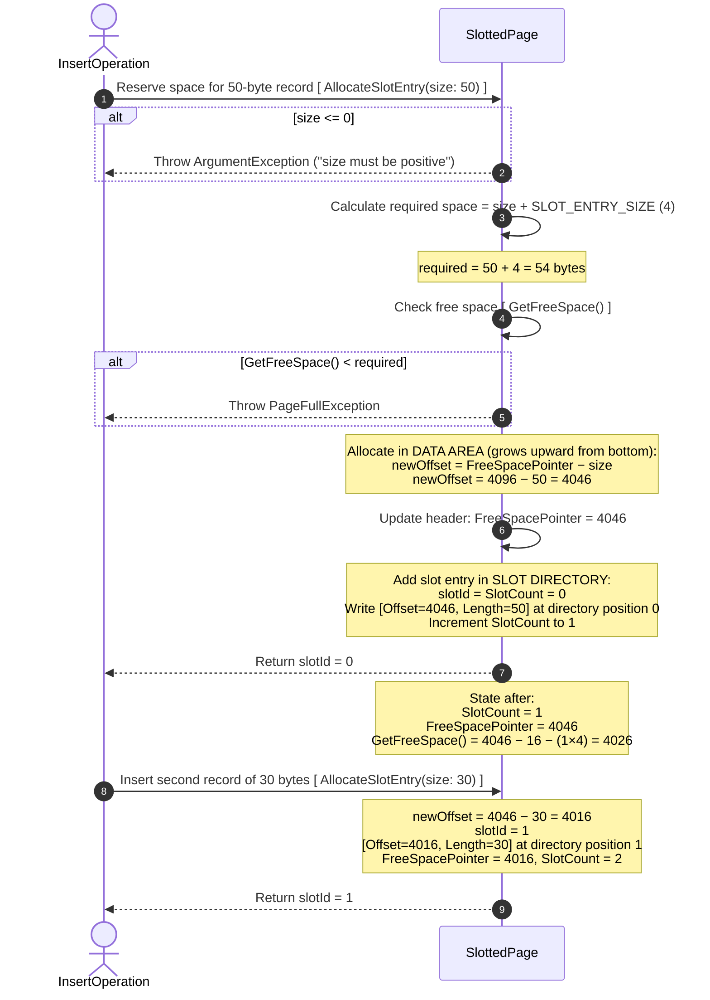
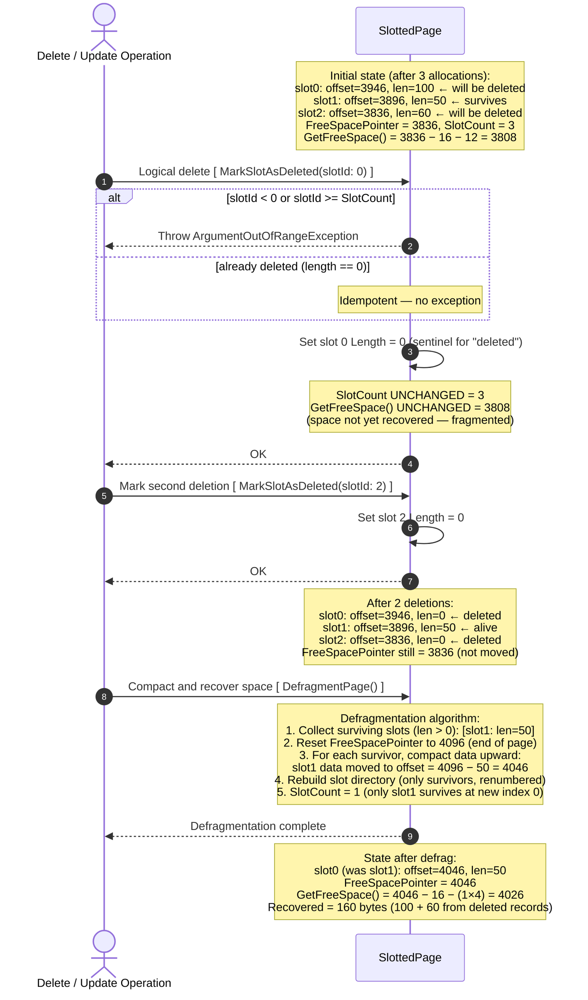
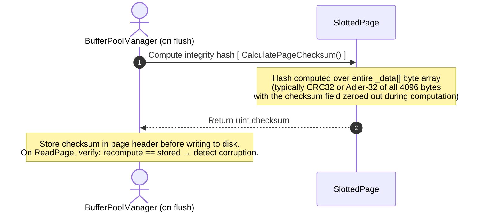
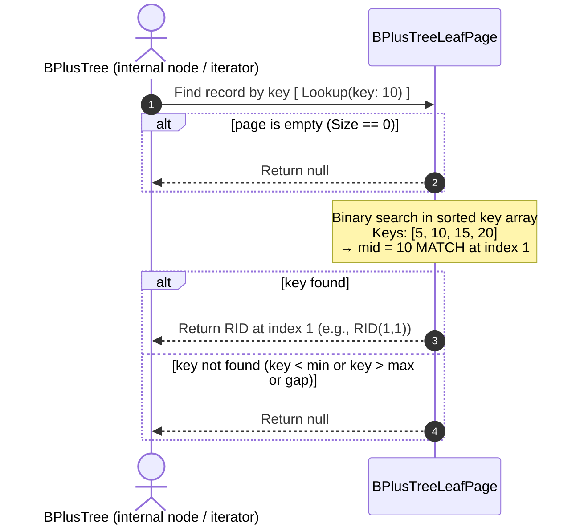
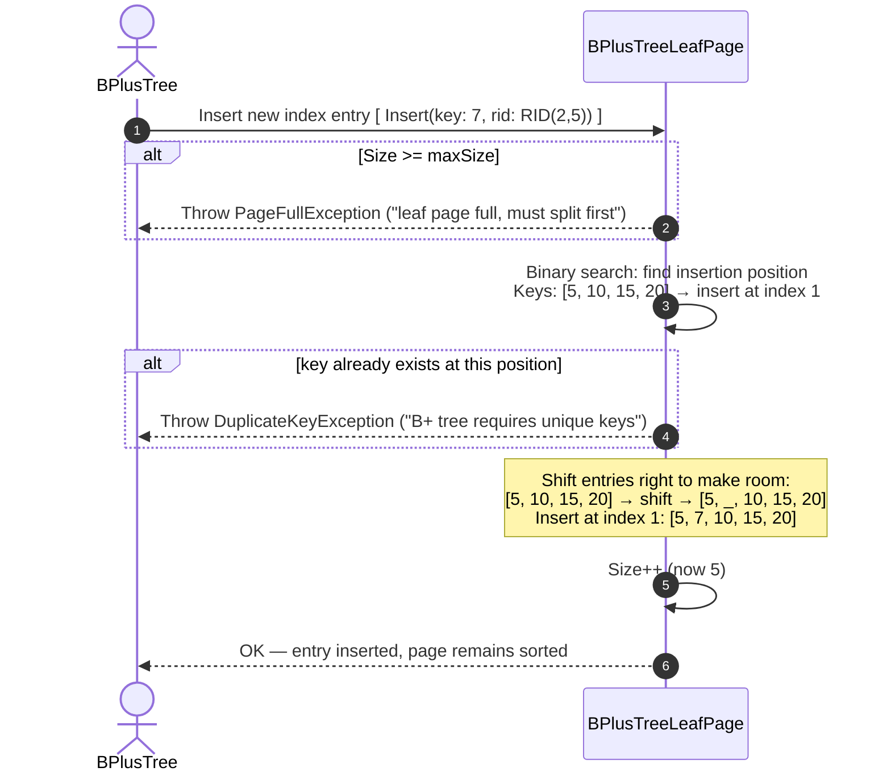
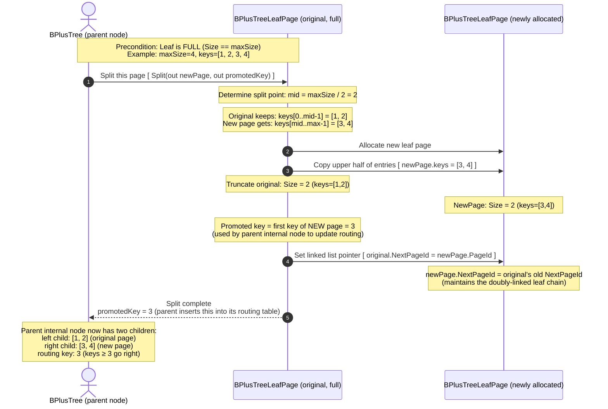
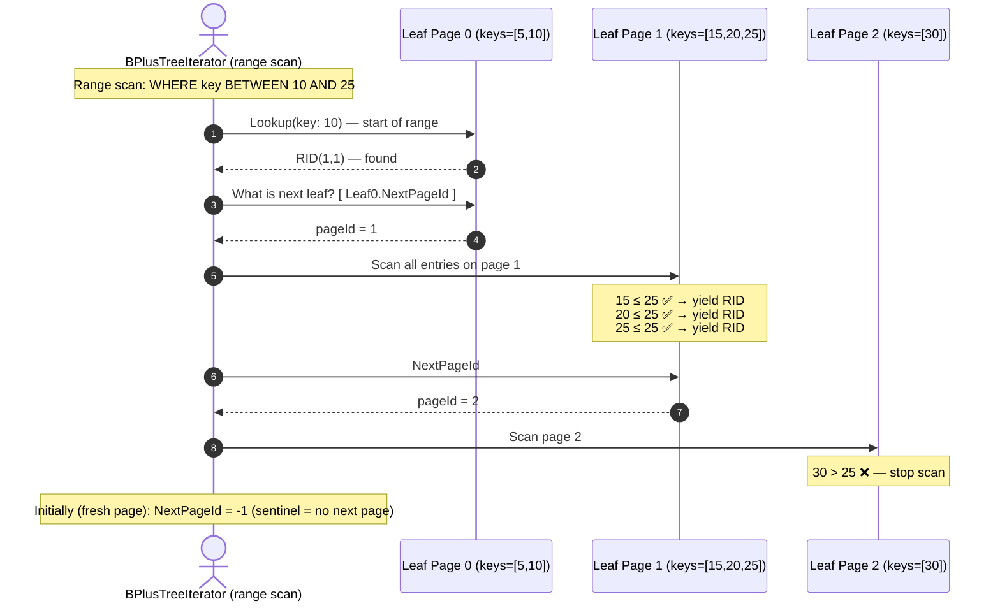

# RecordLayoutManager — Serialize & Deserialize

Context: `RecordLayoutManager` is the translation layer between **logical C# objects** and **binary page data**. This diagram provides **complete field-level encoding details** for all `DbType` values, the null bitmap, and the round-trip deserialization path. This is the exact flow exercised by `RecordLayoutManagerTests`.

---

## Binary Record Format on Page

```
Null Bitmap (ceil(N/8) bytes, one bit per nullable column)
│
├─── Fixed-Length Fields (in column order):
│     INT        →  4 bytes  (big-endian)
│     BIGINT     →  8 bytes  (big-endian)
│     FLOAT      →  8 bytes  (IEEE 754 double)
│     BOOLEAN    →  1 byte   (0x00 or 0x01)
│     DATETIME   →  8 bytes  (ticks, int64 big-endian)
│
└─── Variable-Length Fields (after all fixed fields):
      VARCHAR(N) →  [2-byte length prefix] + [UTF-8 bytes]
      CHAR(N)    →  [N bytes, null-padded]
      BLOB       →  [2-byte length prefix] + [raw bytes]
```

---

## Part A — SerializeRecord



---

## Part B — DeserializeRecord

```mermaid
sequenceDiagram
    autonumber
    actor Caller as Query Executor / Test
    participant RLM as RecordLayoutManager
    participant VLD as VariableLengthDataManager
    participant Schema as Schema
    participant Tuple as Tuple

    Caller->>RLM: Decode binary data [ DeserializeRecord(tuple, schema) ]

    RLM->>Tuple: Get raw bytes [ tuple.GetData() ]
    Note over Tuple: Returns defensive copy of internal byte[]
    Tuple-->>RLM: byte[] data

    Note over RLM: Phase 1 — Read Null Bitmap (same byte count as serialized)

    loop Phase 2 — Fixed-Length columns
        RLM->>RLM: Read bytes at current offset, advance offset

        alt null bit is set for this column
            Note over RLM: Set values[i] = null
        else DbType.Int
            Note over RLM: Read 4 bytes big-endian → int32 value
        else DbType.VarChar, DbType.Blob
            Note over RLM: Skip (handled in phase 3)
        end
    end

    loop Phase 3 — Variable-Length columns
        alt null bit set
            Note over RLM: values[i] = null; skip 2 bytes (zero length prefix)
        else DbType.VarChar
            RLM->>VLD: Decode string [ DeserializeVarChar(data, offset) ]
            VLD-->>RLM: Return string value, advance offset by (2 + string.Length)
        end
    end

    alt malformed bytes (truncated, invalid length prefix, etc.)
        RLM-->>Caller: Throw FormatException
    end

    RLM-->>Caller: Return object[] values (matched to Schema columns)
```

---

## Part C — GetFieldPointer



---

# Null Bitmap Detail

For a schema with `N` columns where some are nullable:

```
Bitmap byte count = ceil(N / 8)

Example: Schema [id INT, name VARCHAR(50) nullable, age INT nullable]
  → 3 columns → 1 byte bitmap

  Bit layout: 0b[col7][col6][col5][col4][col3][col2][col1][col0]
  
  Row [42, null, 25]:
    col0(id)=NOT null → bit 0 = 0
    col1(name)=NULL  → bit 1 = 1
    col2(age)=NOT null → bit 2 = 0
    Bitmap = 0b00000010 = 0x02
```

---

# Mapping to Test Cases

## SerializeRecord

| Test | Step |
|:-----|:-----|
| `SerializeRecord_SingleInt_CorrectBytes` | Part A: INT → 4 big-endian bytes |
| `SerializeRecord_TwoInts_CorrectLayout` | Part A: two ints concatenated |
| `SerializeRecord_VarChar_WritesLengthPrefix` | Part A: `[0x00, 0x05] + UTF-8` |
| `SerializeRecord_EmptyVarChar_WritesZeroLength` | Part A: `[0x00, 0x00]` |
| `SerializeRecord_VarCharExceedsMaxLength_ThrowsArgumentException` | Part A: VLD throws |
| `SerializeRecord_NullableField_NullValue_WritesNullBit` | Part A: null bitmap set |
| `SerializeRecord_NonNullableField_NullValue_Throws` | Part A step 9 |
| `SerializeRecord_WrongColumnCount_Throws` | Part A step 6 |
| `SerializeRecord_NullValuesArray_ThrowsArgumentNullException` | Part A step 4 |

## DeserializeRecord

| Test | Step |
|:-----|:-----|
| `DeserializeRecord_Int_ReturnsCorrectValue` | Part B: big-endian int32 |
| `DeserializeRecord_VarChar_ReturnsCorrectString` | Part B: VLD decode |
| `DeserializeRecord_NullField_ReturnsNull` | Part B: null bitmap read |
| `DeserializeRecord_CorruptedBytes_ThrowsFormatException` | Part B: malformed bytes |
| `SerializeDeserialize_RoundTrip_AllTypes` | Part A then Part B |

## GetFieldPointer

| Test | Step |
|:-----|:-----|
| `GetFieldPointer_FirstField_ReturnsZero` | Part C: offset 0 (after bitmap) |
| `GetFieldPointer_SecondIntField_ReturnsFour` | Part C: 1 (bitmap) + 4 (INT) = 5... actually offset relative to data start |
| `GetFieldPointer_InvalidNegativeIndex_Throws` | Part C step 4 |
| `GetFieldPointer_IndexOutOfRange_Throws` | Part C step 5 |
# SlottedPage — Internal Layout & Operations

Context: `SlottedPage` is the on-disk page structure used to store variable-length records. The [insert-record.md](overview/insert-record.md) overview mentions `AllocateSlotEntry()` in a single step; this diagram zooms into **all SlottedPage operations**: `FormatNewPage`, `AllocateSlotEntry`, `MarkSlotAsDeleted`, `DefragmentPage`, and checksum. This is the exact flow exercised by `SlottedPageTests`.

---

## Physical Page Layout

```
┌─────────────────────────────────────────────────────────┐  ← offset 0
│  PAGE HEADER (16 bytes)                                  │
│   Lsn (8B) | FreeSpacePointer (2B) | SlotCount (2B)    │
│   Checksum (4B)                                          │
├─────────────────────────────────────────────────────────┤  ← offset 16
│  SLOT DIRECTORY  ← grows DOWNWARD (toward high offset)  │
│   [Slot 0: Offset=4046, Length=50]  (4 bytes each)      │
│   [Slot 1: Offset=3996, Length=50]                      │
│   [Slot 2: Offset=0, Length=0]  ← DELETED (length=0)   │
│   ...                                                    │
│                                                          │
│   ~~~~~ F R E E   S P A C E   G A P ~~~~~               │
│                                                          │
│  DATA AREA  ← grows UPWARD (toward low offset)          │
│   [Record for slot 1 at offset 3996]                    │
│   [Record for slot 0 at offset 4046]                    │
└─────────────────────────────────────────────────────────┘  ← offset 4096
```

**Free Space = FreeSpacePointer − (HEADER_SIZE + SlotCount × SLOT_ENTRY_SIZE)**

---

## Part A — FormatNewPage



---

## Part B — AllocateSlotEntry



---

## Part C — MarkSlotAsDeleted & DefragmentPage



---

## Part D — Checksum



---

# Free Space Formula Summary

| Metric | Formula | Example (initial) |
|:-------|:--------|:-----------------|
| `GetFreeSpace()` | `FreeSpacePointer − HEADER_SIZE − (SlotCount × 4)` | `4096 − 16 − 0 = 4080` |
| After `AllocateSlotEntry(100)` | `FreeSpacePointer` decreases by 100; SlotCount increases by 1 | `4096 − 100 − 16 − 4 = 3976` |
| After `MarkSlotAsDeleted(0)` | No change (logical only) | `3976` (unchanged) |
| After `DefragmentPage()` | Reclaims deleted record bytes | `3976 + 100 = 4076` |

---

# Mapping to Test Cases

## 10A. FormatNewPage

| Test | Step |
|:-----|:-----|
| `FormatNewPage_FreeSpaceEqualsPageSizeMinusHeader` | Part A: `GetFreeSpace() == 4080` |
| `FormatNewPage_SlotCountIsZero` | Part A: `SlotCount = 0` |
| `FormatNewPage_FreeSpacePointerAtEndOfPage` | Part A: `FreeSpacePointer = 4096` |
| `FormatNewPage_ReformatExistingPage_ResetsState` | Part A: re-format resets all |

## 10B. AllocateSlotEntry

| Test | Step |
|:-----|:-----|
| `AllocateSlotEntry_FirstRecord_ReturnsSlotIdZero` | Part B step 11 |
| `AllocateSlotEntry_FreeSpaceDecreasesByRecordPlusSlotEntry` | Part B: `4080 − 100 − 4 = 3976` |
| `AllocateSlotEntry_FirstRecordOffset_IsPageEndMinusSize` | Part B: `offset = 4096 − 50 = 4046` |
| `AllocateSlotEntry_InsufficientSpace_ThrowsPageFullException` | Part B step 5 |
| `AllocateSlotEntry_ExactlyFits_Succeeds` | Part B: boundary — exactly fits |

## 10C. MarkSlotAsDeleted

| Test | Step |
|:-----|:-----|
| `MarkSlotAsDeleted_ValidSlot_LengthBecomesZero` | Part C step 7 |
| `MarkSlotAsDeleted_FreeSpaceNotRecoveredBeforeDefrag` | Part C: space unchanged after delete |
| `MarkSlotAsDeleted_AlreadyDeleted_IsIdempotent` | Part C: idempotent |
| `MarkSlotAsDeleted_InvalidSlotId_ThrowsArgumentOutOfRangeException` | Part C step 4 |

## 10D. DefragmentPage

| Test | Step |
|:-----|:-----|
| `DefragmentPage_OneDeletedSlot_FreeSpaceIncreases` | Part C defrag steps |
| `DefragmentPage_RemainingSlotOffsets_Updated` | Part C: new offsets after compact |
| `DefragmentPage_DataIntegrity_SurvivingRecordUnchanged` | Part C: data moved correctly |
| `DefragmentPage_AllSlotsDeleted_FreeSpaceEqualsMax` | Part C: all deleted → max free |
# BPlusTreeLeafPage — Index Node Operations

Context: `BPlusTreeLeafPage` represents a **leaf node** in a B+ Tree index. Unlike `SlottedPage` which stores arbitrary binary records, a leaf page stores sorted `(key → RID)` pairs and supports **splitting** when full. This diagram details `Lookup`, `Insert`, and `Split` operations. This is the exact flow exercised by `BPlusTreeLeafPageTests`.

---

## Physical Layout of a Leaf Page

```
┌─────────────────────────────────────────────────────────────┐
│  Leaf Page Header                                           │
│   PageId | NextPageId (linked list) | KeyCount              │
├─────────────────────────────────────────────────────────────┤
│  Sorted Key-Value Array (maxSize slots)                     │
│   [Key=5,  RID=(1,0)]                                       │
│   [Key=10, RID=(1,1)]                                       │
│   [Key=15, RID=(2,3)]                                       │
│   [Key=20, RID=(3,0)]                                       │
│   ... (up to maxSize entries)                               │
└─────────────────────────────────────────────────────────────┘
         │ NextPageId
         ▼
   [Next Leaf Page]   ← leaf pages form a doubly-linked list for range scans
```

---

## Part A — Lookup (Binary Search)



---

## Part B — Insert (Maintain Sorted Order)



---

## Part C — Split (Page Overflow Resolution)



---

## Part D — NextPageId (Leaf Linked List)



---

# Split Decision Summary

| Condition | Action |
|:---------|:-------|
| `Size < maxSize` | `Insert()` directly (no split) |
| `Size == maxSize` | Call `Split()` FIRST, then insert into appropriate half |
| After `Split()` | Parent must insert `promotedKey` and pointer to `newPage` |

---

# Mapping to Test Cases

## Lookup

| Test | Step |
|:-----|:-----|
| `Lookup_EmptyPage_ReturnsNull` | Part A: empty page → null |
| `Lookup_ExistingKey_ReturnsCorrectRID` | Part A: binary search match |
| `Lookup_NonExistingKey_ReturnsNull` | Part A: gap → null |
| `Lookup_KeySmallerThanAllKeys_ReturnsNull` | Part A: key < min |
| `Lookup_KeyLargerThanAllKeys_ReturnsNull` | Part A: key > max |

## Insert

| Test | Step |
|:-----|:-----|
| `Insert_FirstKey_SizeIsOne` | Part B: first entry |
| `Insert_KeysStoredSorted` | Part B: sorted insertion |
| `Insert_DuplicateKey_ThrowsDuplicateKeyException` | Part B step 7 |
| `Insert_WhenAtMaxSize_ThrowsPageFullException` | Part B step 4 |
| `Insert_NegativeKey_IsAllowed` | Part B: no restriction on key values |

## Split

| Test | Step |
|:-----|:-----|
| `Split_OriginalHalfSize` | Part C: original.Size = maxSize/2 |
| `Split_NewPageHasLargerKeys` | Part C: upper half to new page |
| `Split_PromotedKeyIsFirstKeyOfNewPage` | Part C: promotedKey = new.keys[0] |
| `Split_NextPageIdLinked` | Part C: original.NextPageId = newPage.PageId |
| `NextPageId_Initially_IsInvalidSentinel` | Part D: -1 on fresh page |
| `Lookup_AfterSplit_OriginalPageCorrect` | Part C + Part A: lookup on original |
| `Lookup_AfterSplit_NewPageCorrect` | Part C + Part A: lookup on new page |
