
```mermaid
classDiagram
direction LR

%% =====================================================
%% Server
%% =====================================================

class DatabaseServer {
    +ServerId : int
    +Version : string
    +Status : ServerStatus
    +Start()
    +Stop()
    +Restart()
}

class DatabaseManager {
    -catalog : CatalogManager
    +CreateDatabase(name : string)
    +DropDatabase(name : string)
    +GetDatabase(name : string) Database
    +ListDatabases() List~Database~
}

%% =====================================================
%% Database Objects (Pure Domain Models)
%% =====================================================

class Database {
    +DatabaseId : int
    +Name : string
    +Owner : string
    +Schemas : List~Schema~
}

class Schema {
    +SchemaId : int
    +Name : string
    +Tables : List~Table~
    +Views : List~View~
    +Procedures : List~StoredProcedure~
    +Sequences : List~Sequence~
}

%% =====================================================
%% Domain Services (Business Logic on Domain Objects)
%% =====================================================

class SchemaService {
    -catalog : CatalogManager
    -storage : StorageEngine
    +CreateTable(schema : Schema, def : TableDef) Table
    +DropTable(schema : Schema, name : string)
    +CreateView(schema : Schema, name : string, query : string) View
    +DropView(schema : Schema, name : string)
}
note for SchemaService "DDL service — orchestrates CatalogManager\n+ StorageEngine to create/drop objects"

class RecordManager {
    -storage : StorageEngine
    -catalog : CatalogManager
    +Insert(table : Table, row : Row) RID
    +Update(table : Table, rid : RID, row : Row)
    +Delete(table : Table, rid : RID)
    +Read(table : Table, rid : RID) Row
    +Scan(table : Table) List~Row~
}
note for RecordManager "DML service — translates Row operations\ninto StorageEngine page reads/writes"

class Table {
    +TableId : int
    +Name : string
    +Columns : List~Column~
    +Constraints : List~Constraint~
    +Indexes : List~Index~
    +Partitions : List~Partition~
    +Triggers : List~Trigger~
}

class Column {
    +ColumnId : int
    +Name : string
    +DataType : DataType
    +Nullable : bool
    +DefaultValue : object
}

class Row {
    +RowId : RID
    +Data : RecordData
    +Version : long
}

class RecordData {
    <<value object>>
    +Bytes : Byte[]
    +Length : int
}

class RID {
    <<value object>>
    +PageId : int
    +SlotNumber : int
    +Equals(other : RID) bool
}

class DataType {
    <<enumeration>>
    INT
    BIGINT
    VARCHAR
    BOOLEAN
    FLOAT
    DATETIME
}

%% =====================================================
%% Constraints
%% =====================================================

class Constraint {
    <<abstract>>
    +Name : string
    +Validate(row : Row) bool
}

class PrimaryKey {
    +Columns : List~Column~
}

class ForeignKey {
    +ReferenceTable : Table
    +ReferenceColumns : List~Column~
}

class UniqueConstraint

class CheckConstraint {
    +Expression : string
}

%% =====================================================
%% Indexes
%% =====================================================

class Index {
    <<abstract>>
    +IndexId : int
    +Name : string
    +Columns : List~Column~
    +Search(key : object) RID
    +InsertKey(key : object, rid : RID)
    +DeleteKey(key : object)
}

class BTreeIndex
class HashIndex
class BitmapIndex

%% =====================================================
%% Other Database Objects (Pure Domain Models)
%% =====================================================

class Partition {
    +PartitionKey : string
    +PartitionType : PartitionType
}

class View {
    +ViewId : int
    +Name : string
    +QueryDefinition : string
}

class StoredProcedure {
    +Name : string
    +Parameters : List~Column~
    +Body : string
}

class Trigger {
    +Name : string
    +Event : TriggerEvent
    +Timing : TriggerTiming
    +Body : string
}

class Sequence {
    +Name : string
    +CurrentValue : long
    +Increment : long
    +NextValue() long
}

%% =====================================================
%% Transaction
%% =====================================================

class Transaction {
    +TransactionId : int
    +Status : TxStatus
    +Begin()
    +Commit()
    +Rollback()
}

class TransactionManager {
    -txTable : TransactionTable
    -lockMgr : LockManager
    -walMgr : WALManager
    -mvccMgr : MVCCManager
    +Begin() Transaction
    +Commit(txId : int)
    +Abort(txId : int)
}

class LockManager {
    -lockTable : Map~string, LockQueue~
    -detector : DeadlockDetector
    +AcquireLock(txId : int, resId : string, mode : LockMode)
    +ReleaseLock(txId : int, resId : string)
    +ReleaseAll(txId : int)
}
note for LockManager "AcquireLock() throws LockTimeoutException\nor DeadlockException on conflict"

class MVCCManager {
    +CreateVersion(rid : RID, txId : int, data : RecordData)
    +ReadVersion(rid : RID, snapshotId : long) Row
    +GarbageCollect(olderThan : long)
}

%% =====================================================
%% Storage Engine
%% =====================================================

class StorageEngine {
    +ReadPage(id : PageId) Byte[]
    +WritePage(id : PageId, data : Byte[])
    +AllocatePage(tableId : int) PageId
}

class BufferPool {
    -frames : Page[]
    -policy : ReplacementPolicy
    +FetchPage(id : PageId) Page
    +UnpinPage(id : PageId)
    +FlushPage(id : PageId)
    +MarkDirty(id : PageId)
}

class Page {
    +PageId : int
    +Data : Byte[]
    +IsDirty : bool
    +PinCount : int
}

class FileManager {
    -dataDir : string
    +Read(pageId : PageId) Byte[]
    +Write(pageId : PageId, data : Byte[])
    +AllocateFile(path : string) int
}

class WALManager {
    -buffer : LogBuffer
    +Append(record : LogRecord) long
    +Flush(upToLSN : long)
    +Truncate(beforeLSN : long)
}

class RecoveryManager {
    -walMgr : WALManager
    +Recover(checkpointLSN : long)
}

%% =====================================================
%% Catalog
%% =====================================================

class CatalogManager {
    -sysTables : Map~string, object~
    +RegisterTable(table : Table)
    +GetTable(name : string) Table
    +GetIndex(name : string) Index
    +DeleteMeta(id : int)
}
note for CatalogManager "GetTable() / GetIndex() throws\nNotFoundException if not found"

%% =====================================================
%% Query Processor
%% =====================================================

class SQLParser {
    +Parse(sql : string) ASTNode
    -Tokenize(sql : string) Token[]
    -BuildAST(tokens : Token[]) ASTNode
}
note for SQLParser "Parse() throws SqlSyntaxException\non invalid input"

class Lexer {
    +Tokenize(sql : string) Token[]
}

class AST {
    +Root : ASTNode
    +ToLogicalPlan() LogicalPlan
}

class LogicalPlan {
    +Operators : List~Operator~
}

class PhysicalPlan {
    +Operators : List~Operator~
}

class QueryOptimizer {
    -costModel : CostModel
    -catalog : CatalogManager
    +Optimize(ast : ASTNode) PhysicalPlan
}

class QueryExecutor {
    +Execute(plan : PhysicalPlan, tx : Transaction) ResultCursor
}

class StatisticsManager {
    +Collect(table : Table)
    +GetStats(tableId : int) TableStats
}

%% =====================================================
%% Security
%% =====================================================

class SecurityManager {
    -userDb : Map~string, HashedCredential~
    +Authenticate(username : string, password : string) Session
    +CheckPermission(user : string, obj : int, action : string) bool
    +GrantRole(user : string, role : string)
    +RevokeRole(user : string, role : string)
}
note for SecurityManager "Authenticate() throws\nPermissionDeniedException if invalid"

class User {
    +UserId : int
    +Username : string
    +PasswordHash : string
}

class Role {
    +RoleId : int
    +Name : string
}

class Permission {
    +Action : string
    +ObjectId : int
}

%% =====================================================
%% Relationships
%% =====================================================

DatabaseServer --> DatabaseManager
DatabaseServer --> TransactionManager
DatabaseServer --> StorageEngine
DatabaseServer --> CatalogManager
DatabaseServer --> SecurityManager

DatabaseManager --> Database

SchemaService --> CatalogManager
SchemaService --> StorageEngine
SchemaService --> Schema
SchemaService --> Table

RecordManager --> StorageEngine
RecordManager --> CatalogManager
RecordManager --> Table
RecordManager --> Row

Database "1" *-- "many" Schema

Schema "1" *-- "many" Table
Schema "1" *-- "many" View
Schema "1" *-- "many" StoredProcedure
Schema "1" *-- "many" Sequence

Table "1" *-- "many" Column
Table "1" *-- "many" Constraint
Table "1" *-- "many" Index
Table "1" *-- "many" Partition
Table "1" *-- "many" Trigger
Table "1" *-- "many" Row

Row *-- RID
Row *-- RecordData
Column --> DataType

Constraint <|-- PrimaryKey
Constraint <|-- ForeignKey
Constraint <|-- UniqueConstraint
Constraint <|-- CheckConstraint

ForeignKey --> Table

Index <|-- BTreeIndex
Index <|-- HashIndex
Index <|-- BitmapIndex

TransactionManager --> Transaction
TransactionManager --> LockManager
TransactionManager --> MVCCManager
TransactionManager --> WALManager

StorageEngine --> BufferPool
StorageEngine --> FileManager

BufferPool --> Page

RecoveryManager --> WALManager

CatalogManager --> Database
CatalogManager --> Schema
CatalogManager --> Table
CatalogManager --> Index

SQLParser --> Lexer
SQLParser --> AST

AST --> LogicalPlan

QueryOptimizer --> LogicalPlan
QueryOptimizer --> PhysicalPlan
QueryOptimizer --> StatisticsManager

StatisticsManager --> Table

QueryExecutor --> PhysicalPlan
QueryExecutor --> Transaction

SecurityManager --> User
SecurityManager --> Role

Role --> Permission
```

---

## Split Class Diagrams

To avoid clutter in a single large diagram, the architecture can be broken down into 7 logical components.

### 1. Server & Database Management

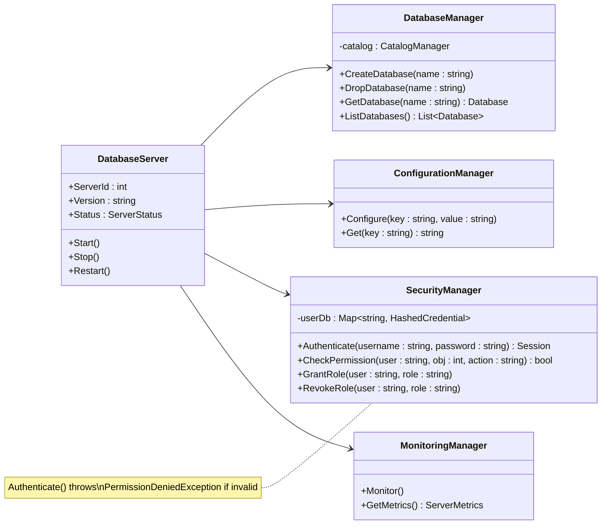
```mermaid
classDiagram
direction LR

class DatabaseServer {
    +ServerId : int
    +Version : string
    +Status : ServerStatus
    +Start()
    +Stop()
    +Restart()
}
class DatabaseManager {
    -catalog : CatalogManager
    +CreateDatabase(name : string)
    +DropDatabase(name : string)
    +GetDatabase(name : string) Database
    +ListDatabases() List~Database~
}
class ConfigurationManager {
    +Configure(key : string, value : string)
    +Get(key : string) string
}
class SecurityManager {
    -userDb : Map~string, HashedCredential~
    +Authenticate(username : string, password : string) Session
    +CheckPermission(user : string, obj : int, action : string) bool
    +GrantRole(user : string, role : string)
    +RevokeRole(user : string, role : string)
}
note for SecurityManager "Authenticate() throws\nPermissionDeniedException if invalid"
class MonitoringManager {
    +Monitor()
    +GetMetrics() ServerMetrics
}

DatabaseServer --> DatabaseManager
DatabaseServer --> ConfigurationManager
DatabaseServer --> SecurityManager
DatabaseServer --> MonitoringManager
```

### 2. Database Objects

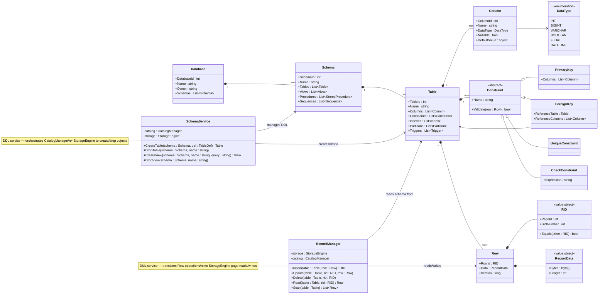
```mermaid
classDiagram
direction LR

class Database {
    +DatabaseId : int
    +Name : string
    +Owner : string
    +Schemas : List~Schema~
}

class Schema {
    +SchemaId : int
    +Name : string
    +Tables : List~Table~
    +Views : List~View~
    +Procedures : List~StoredProcedure~
    +Sequences : List~Sequence~
}

class Table {
    +TableId : int
    +Name : string
    +Columns : List~Column~
    +Constraints : List~Constraint~
    +Indexes : List~Index~
    +Partitions : List~Partition~
    +Triggers : List~Trigger~
}

class Column {
    +ColumnId : int
    +Name : string
    +DataType : DataType
    +Nullable : bool
    +DefaultValue : object
}

class Row {
    +RowId : RID
    +Data : RecordData
    +Version : long
}

class RecordData {
    <<value object>>
    +Bytes : Byte[]
    +Length : int
}

class RID {
    <<value object>>
    +PageId : int
    +SlotNumber : int
    +Equals(other : RID) bool
}

class DataType {
    <<enumeration>>
    INT
    BIGINT
    VARCHAR
    BOOLEAN
    FLOAT
    DATETIME
}

class Constraint {
    <<abstract>>
    +Name : string
    +Validate(row : Row) bool
}

class PrimaryKey {
    +Columns : List~Column~
}

class ForeignKey {
    +ReferenceTable : Table
    +ReferenceColumns : List~Column~
}

class UniqueConstraint
class CheckConstraint {
    +Expression : string
}

Database "1" *-- "many" Schema
Schema "1" *-- "many" Table
Table "1" *-- "many" Column
Table "1" *-- "many" Constraint
Table "1" *-- "many" Row
Row *-- RID
Row *-- RecordData
Column --> DataType
Constraint <|-- PrimaryKey
Constraint <|-- ForeignKey
Constraint <|-- UniqueConstraint
Constraint <|-- CheckConstraint
ForeignKey --> Table

%% ── Domain Services ─────────────────────────────────

class SchemaService {
    -catalog : CatalogManager
    -storage : StorageEngine
    +CreateTable(schema : Schema, def : TableDef) Table
    +DropTable(schema : Schema, name : string)
    +CreateView(schema : Schema, name : string, query : string) View
    +DropView(schema : Schema, name : string)
}
note for SchemaService "DDL service — orchestrates CatalogManager\n+ StorageEngine to create/drop objects"

class RecordManager {
    -storage : StorageEngine
    -catalog : CatalogManager
    +Insert(table : Table, row : Row) RID
    +Update(table : Table, rid : RID, row : Row)
    +Delete(table : Table, rid : RID)
    +Read(table : Table, rid : RID) Row
    +Scan(table : Table) List~Row~
}
note for RecordManager "DML service — translates Row operations\ninto StorageEngine page reads/writes"

SchemaService --> Schema : manages DDL
SchemaService --> Table : creates/drops
RecordManager --> Table : reads schema from
RecordManager --> Row : reads/writes
```

### 3. Storage Engine

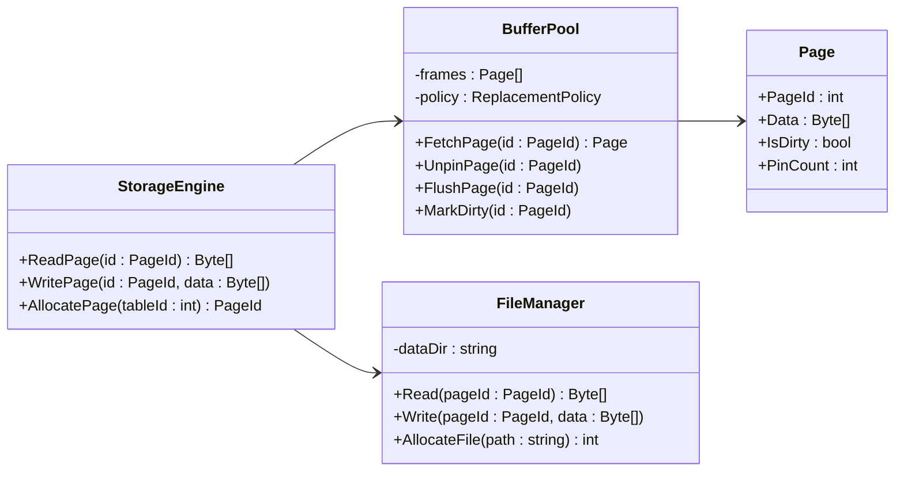
```mermaid
classDiagram
direction LR

class StorageEngine {
    +ReadPage(id : PageId) Byte[]
    +WritePage(id : PageId, data : Byte[])
    +AllocatePage(tableId : int) PageId
}
class BufferPool {
    -frames : Page[]
    -policy : ReplacementPolicy
    +FetchPage(id : PageId) Page
    +UnpinPage(id : PageId)
    +FlushPage(id : PageId)
    +MarkDirty(id : PageId)
}
class Page {
    +PageId : int
    +Data : Byte[]
    +IsDirty : bool
    +PinCount : int
}
class FileManager {
    -dataDir : string
    +Read(pageId : PageId) Byte[]
    +Write(pageId : PageId, data : Byte[])
    +AllocateFile(path : string) int
}

StorageEngine --> BufferPool
StorageEngine --> FileManager
BufferPool --> Page
```

### 4. Transaction & Concurrency

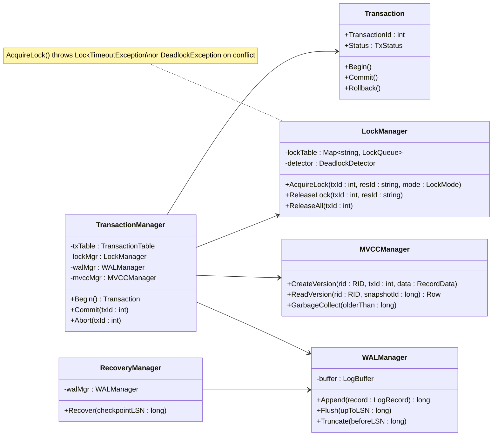
```mermaid
classDiagram
direction LR

class TransactionManager {
    -txTable : TransactionTable
    -lockMgr : LockManager
    -walMgr : WALManager
    -mvccMgr : MVCCManager
    +Begin() Transaction
    +Commit(txId : int)
    +Abort(txId : int)
}
class Transaction {
    +TransactionId : int
    +Status : TxStatus
    +Begin()
    +Commit()
    +Rollback()
}
class LockManager {
    -lockTable : Map~string, LockQueue~
    -detector : DeadlockDetector
    +AcquireLock(txId : int, resId : string, mode : LockMode)
    +ReleaseLock(txId : int, resId : string)
    +ReleaseAll(txId : int)
}
note for LockManager "AcquireLock() throws LockTimeoutException\nor DeadlockException on conflict"
class MVCCManager {
    +CreateVersion(rid : RID, txId : int, data : RecordData)
    +ReadVersion(rid : RID, snapshotId : long) Row
    +GarbageCollect(olderThan : long)
}
class WALManager {
    -buffer : LogBuffer
    +Append(record : LogRecord) long
    +Flush(upToLSN : long)
    +Truncate(beforeLSN : long)
}
class RecoveryManager {
    -walMgr : WALManager
    +Recover(checkpointLSN : long)
}

TransactionManager --> Transaction
TransactionManager --> LockManager
TransactionManager --> MVCCManager
TransactionManager --> WALManager
RecoveryManager --> WALManager
```

### 5. Query Processor

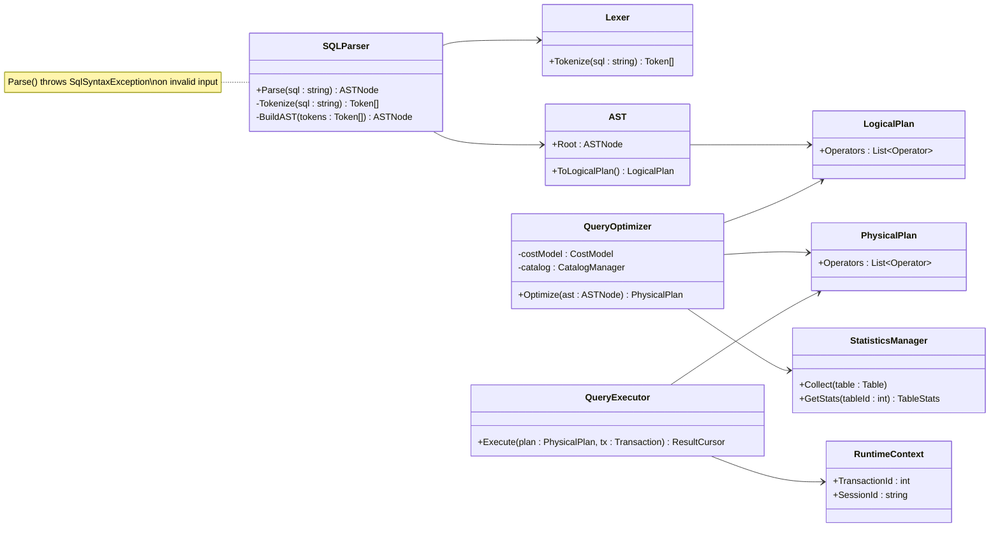
```mermaid
classDiagram
direction LR

class SQLParser {
    +Parse(sql : string) ASTNode
    -Tokenize(sql : string) Token[]
    -BuildAST(tokens : Token[]) ASTNode
}
note for SQLParser "Parse() throws SqlSyntaxException\non invalid input"
class Lexer {
    +Tokenize(sql : string) Token[]
}
class AST {
    +Root : ASTNode
    +ToLogicalPlan() LogicalPlan
}
class QueryOptimizer {
    -costModel : CostModel
    -catalog : CatalogManager
    +Optimize(ast : ASTNode) PhysicalPlan
}
class LogicalPlan {
    +Operators : List~Operator~
}
class PhysicalPlan {
    +Operators : List~Operator~
}
class StatisticsManager {
    +Collect(table : Table)
    +GetStats(tableId : int) TableStats
}
class QueryExecutor {
    +Execute(plan : PhysicalPlan, tx : Transaction) ResultCursor
}
class RuntimeContext {
    +TransactionId : int
    +SessionId : string
}

SQLParser --> Lexer
SQLParser --> AST
AST --> LogicalPlan
QueryOptimizer --> LogicalPlan
QueryOptimizer --> PhysicalPlan
QueryOptimizer --> StatisticsManager
QueryExecutor --> PhysicalPlan
QueryExecutor --> RuntimeContext
```

### 6. Catalog & Metadata

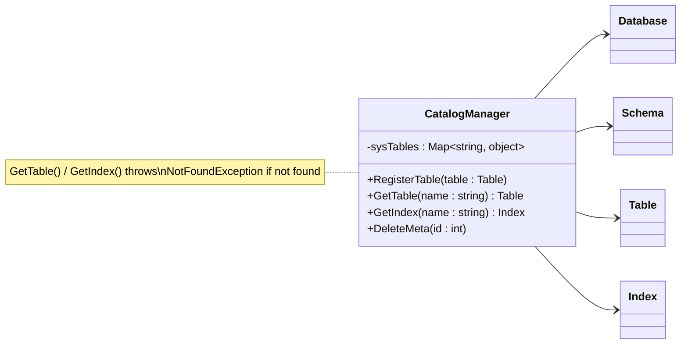
```mermaid
classDiagram
direction LR

class CatalogManager {
    -sysTables : Map~string, object~
    +RegisterTable(table : Table)
    +GetTable(name : string) Table
    +GetIndex(name : string) Index
    +DeleteMeta(id : int)
}
note for CatalogManager "GetTable() / GetIndex() throws\nNotFoundException if not found"
class Database
class Schema
class Table
class Index

CatalogManager --> Database
CatalogManager --> Schema
CatalogManager --> Table
CatalogManager --> Index
```

### 7. Security

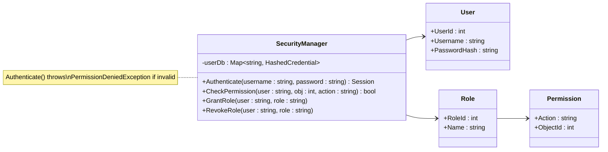
```mermaid
classDiagram
direction LR

class SecurityManager {
    -userDb : Map~string, HashedCredential~
    +Authenticate(username : string, password : string) Session
    +CheckPermission(user : string, obj : int, action : string) bool
    +GrantRole(user : string, role : string)
    +RevokeRole(user : string, role : string)
}
note for SecurityManager "Authenticate() throws\nPermissionDeniedException if invalid"
class User {
    +UserId : int
    +Username : string
    +PasswordHash : string
}
class Role {
    +RoleId : int
    +Name : string
}
class Permission {
    +Action : string
    +ObjectId : int
}

SecurityManager --> User
SecurityManager --> Role
Role --> Permission
```

# This overview of DBMS Mindmap

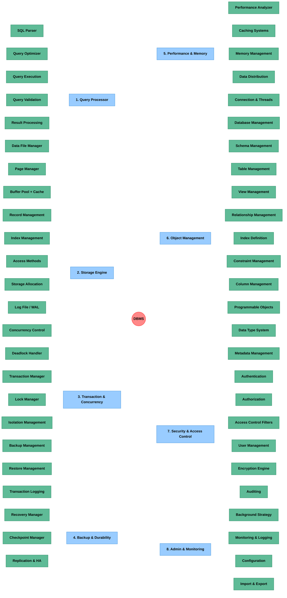
```mermaid
graph LR
    %% Styles cho nền tối (GitHub Dark Mode)
    classDef default fill:#2d2d2d,stroke:#888,stroke-width:1px,color:#fff;
    classDef root fill:#ff8888,stroke:#ff5555,stroke-width:2px,font-weight:bold,color:#000;
    classDef layer1 fill:#99ccff,stroke:#5ba3e3,stroke-width:1.5px,font-weight:bold,color:#000;
    classDef layer2 fill:#5fbb97,stroke:#3a9672,stroke-width:1.5px,font-weight:bold,color:#000;

    %% Tăng độ tương phản cho đường nối liên kết giữa các node
    linkStyle default stroke:#ffffff,stroke-width:1.5px;

    db((DBMS)):::root

    %% ===== BÊN TRÁI (module 1-4) =====

    %% 1. Query Processor
    qp[1. Query Processor]:::layer1 --- db
    qp_sp[SQL Parser]:::layer2 --- qp
    qp_qo[Query Optimizer]:::layer2 --- qp
    qp_qe[Query Execution]:::layer2 --- qp
    qp_qv[Query Validation]:::layer2 --- qp
    qp_rp[Result Processing]:::layer2 --- qp

    %% 2. Storage Engine
    se[2. Storage Engine]:::layer1 --- db
    se_df[Data File Manager]:::layer2 --- se
    se_pm[Page Manager]:::layer2 --- se
    se_bp[Buffer Pool + Cache]:::layer2 --- se
    se_rm[Record Management]:::layer2 --- se
    se_im[Index Management]:::layer2 --- se
    se_am[Access Methods]:::layer2 --- se
    se_sa[Storage Allocation]:::layer2 --- se
    se_lf[Log File / WAL]:::layer2 --- se

    %% 3. Transaction & Concurrency
    tx[3. Transaction & Concurrency]:::layer1 --- db
    tx_cc[Concurrency Control]:::layer2 --- tx
    tx_dl[Deadlock Handler]:::layer2 --- tx
    tx_tm[Transaction Manager]:::layer2 --- tx
    tx_lm[Lock Manager]:::layer2 --- tx
    tx_im[Isolation Management]:::layer2 --- tx

    %% 4. Backup & Durability
    bd[4. Backup & Durability]:::layer1 --- db
    bd_bm[Backup Management]:::layer2 --- bd
    bd_rm[Restore Management]:::layer2 --- bd
    bd_tl[Transaction Logging]:::layer2 --- bd
    bd_re[Recovery Manager]:::layer2 --- bd
    bd_cp[Checkpoint Manager]:::layer2 --- bd
    bd_rp[Replication & HA]:::layer2 --- bd

    %% ===== BÊN PHẢI (module 5-8) =====

    %% 5. Performance & Memory
    db --- pf[5. Performance & Memory]:::layer1
    pf --- pf_qa[Performance Analyzer]:::layer2
    pf --- pf_ch[Caching Systems]:::layer2
    pf --- pf_mm[Memory Management]:::layer2
    pf --- pf_dd[Data Distribution]:::layer2
    pf --- pf_ct[Connection & Threads]:::layer2

    %% 6. Database Object Management
    db --- om[6. Object Management]:::layer1
    om --- om_dm[Database Management]:::layer2
    om --- om_sm[Schema Management]:::layer2
    om --- om_tm[Table Management]:::layer2
    om --- om_vm[View Management]:::layer2
    om --- om_rm[Relationship Management]:::layer2
    om --- om_idx[Index Definition]:::layer2
    om --- om_cm[Constraint Management]:::layer2
    om --- om_com[Column Management]:::layer2
    om --- om_po[Programmable Objects]:::layer2
    om --- om_dt[Data Type System]:::layer2
    om --- om_mm[Metadata Management]:::layer2

    %% 7. Security & Access Control
    db --- sa[7. Security & Access Control]:::layer1
    sa --- sa_au[Authentication]:::layer2
    sa --- sa_az[Authorization]:::layer2
    sa --- sa_ac[Access Control Filters]:::layer2
    sa --- sa_um[User Management]:::layer2
    sa --- sa_ec[Encryption Engine]:::layer2
    sa --- sa_ad[Auditing]:::layer2

    %% 8. Administration & Monitoring
    db --- am[8. Admin & Monitoring]:::layer1
    am --- am_bs[Background Strategy]:::layer2
    am --- am_ml[Monitoring & Logging]:::layer2
    am --- am_cm[Configuration]:::layer2
    am --- am_ie[Import & Export]:::layer2
```

## Query Processor

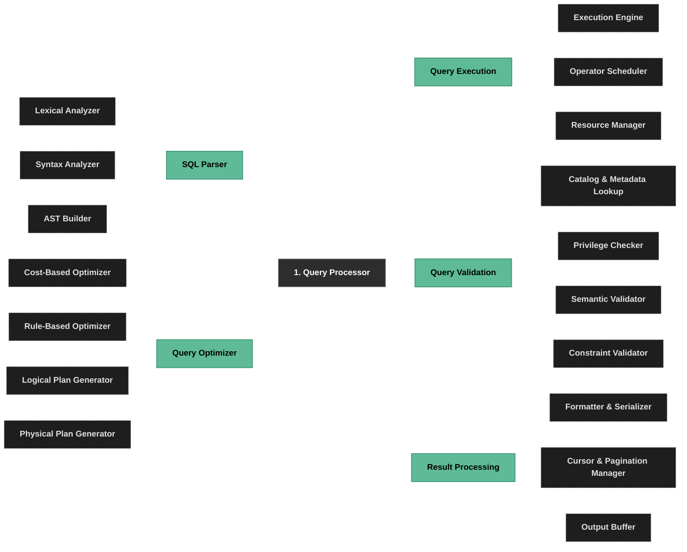
```mermaid
graph LR
    %% Styles cho nền tối (GitHub Dark Mode)
    classDef default fill:#2d2d2d,stroke:#888,stroke-width:1px,color:#fff;
    classDef root fill:#ff8888,stroke:#ff5555,stroke-width:2px,font-weight:bold,color:#000;
    classDef layer2 fill:#5fbb97,stroke:#3a9672,stroke-width:1.5px,font-weight:bold,color:#000;
    classDef layer3 fill:#1e1e1e,stroke:#aaaaaa,stroke-width:1px,stroke-dasharray: 3 3,color:#e0e0e0;

    %% Tăng độ tương phản cho đường nối liên kết giữa các node
    linkStyle default stroke:#ffffff,stroke-width:1.5px;

    %% Root
    qp[1. Query Processor]:::layer1

    %% NỬA BÊN TRÁI
    qp_sp[SQL Parser]:::layer2 --- qp
    qp_sp1[Lexical Analyzer]:::layer3 --- qp_sp
    qp_sp2[Syntax Analyzer]:::layer3 --- qp_sp
    qp_sp3[AST Builder]:::layer3 --- qp_sp

    qp_qo[Query Optimizer]:::layer2 --- qp
    qp_qo1[Cost-Based Optimizer]:::layer3 --- qp_qo
    qp_qo2[Rule-Based Optimizer]:::layer3 --- qp_qo
    qp_qo3[Logical Plan Generator]:::layer3 --- qp_qo
    qp_qo4[Physical Plan Generator]:::layer3 --- qp_qo

    %% NỬA BÊN PHẢI
    qp --- qp_qe[Query Execution]:::layer2
    qp_qe --- qp_qe1[Execution Engine]:::layer3
    qp_qe --- qp_qe2[Operator Scheduler]:::layer3
    qp_qe --- qp_qe3[Resource Manager]:::layer3

    qp --- qp_qv[Query Validation]:::layer2
    qp_qv --- qp_qv1[Catalog & Metadata Lookup]:::layer3
    qp_qv --- qp_qv2[Privilege Checker]:::layer3
    qp_qv --- qp_qv3[Semantic Validator]:::layer3
    qp_qv --- qp_qv4[Constraint Validator]:::layer3

    qp --- qp_rp[Result Processing]:::layer2
    qp_rp --- qp_rp1[Formatter & Serializer]:::layer3
    qp_rp --- qp_rp2[Cursor & Pagination Manager]:::layer3
    qp_rp --- qp_rp3[Output Buffer]:::layer3
```

## Storage Engine

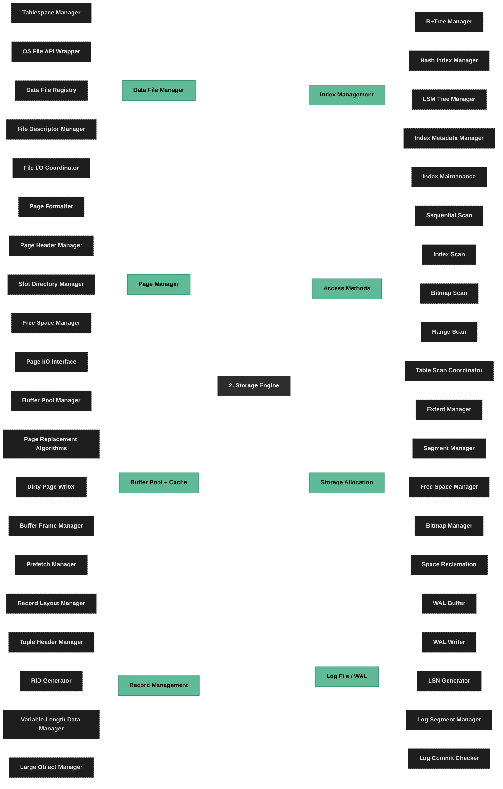
```mermaid
graph LR
    %% Styles cho nền tối (GitHub Dark Mode)
    classDef default fill:#2d2d2d,stroke:#888,stroke-width:1px,color:#fff;
    classDef root fill:#ff8888,stroke:#ff5555,stroke-width:2px,font-weight:bold,color:#000;
    classDef layer2 fill:#5fbb97,stroke:#3a9672,stroke-width:1.5px,font-weight:bold,color:#000;
    classDef layer3 fill:#1e1e1e,stroke:#aaaaaa,stroke-width:1px,stroke-dasharray: 3 3,color:#e0e0e0;

    %% Tăng độ tương phản cho đường nối liên kết giữa các node
    linkStyle default stroke:#ffffff,stroke-width:1.5px;

    %% Root
    se[2. Storage Engine]:::layer1

    %% NỬA BÊN TRÁI
    se_df[Data File Manager]:::layer2 --- se
    se_df1[Tablespace Manager]:::layer3 --- se_df
    se_df2[OS File API Wrapper]:::layer3 --- se_df
    se_df3[Data File Registry]:::layer3 --- se_df
    se_df4[File Descriptor Manager]:::layer3 --- se_df
    se_df5[File I/O Coordinator]:::layer3 --- se_df

    se_pm[Page Manager]:::layer2 --- se
    se_pm1[Page Formatter]:::layer3 --- se_pm
    se_pm2[Page Header Manager]:::layer3 --- se_pm
    se_pm3[Slot Directory Manager]:::layer3 --- se_pm
    se_pm4[Free Space Manager]:::layer3 --- se_pm
    se_pm5[Page I/O Interface]:::layer3 --- se_pm

    se_bp[Buffer Pool + Cache]:::layer2 --- se
    se_bp1[Buffer Pool Manager]:::layer3 --- se_bp
    se_bp2[Page Replacement Algorithms]:::layer3 --- se_bp
    se_bp3[Dirty Page Writer]:::layer3 --- se_bp
    se_bp4[Buffer Frame Manager]:::layer3 --- se_bp
    se_bp5[Prefetch Manager]:::layer3 --- se_bp

    se_rm[Record Management]:::layer2 --- se
    se_rm1[Record Layout Manager]:::layer3 --- se_rm
    se_rm2[Tuple Header Manager]:::layer3 --- se_rm
    se_rm3[RID Generator]:::layer3 --- se_rm
    se_rm4[Variable-Length Data Manager]:::layer3 --- se_rm
    se_rm5[Large Object Manager]:::layer3 --- se_rm

    %% NỬA BÊN PHẢI
    se --- se_im[Index Management]:::layer2
    se_im --- se_im1[B+Tree Manager]:::layer3
    se_im --- se_im2[Hash Index Manager]:::layer3
    se_im --- se_im3[LSM Tree Manager]:::layer3
    se_im --- se_im4[Index Metadata Manager]:::layer3
    se_im --- se_im5[Index Maintenance]:::layer3

    se --- se_am[Access Methods]:::layer2
    se_am --- se_am1[Sequential Scan]:::layer3
    se_am --- se_am2[Index Scan]:::layer3
    se_am --- se_am3[Bitmap Scan]:::layer3
    se_am --- se_am4[Range Scan]:::layer3
    se_am --- se_am5[Table Scan Coordinator]:::layer3

    se --- se_sa[Storage Allocation]:::layer2
    se_sa --- se_sa1[Extent Manager]:::layer3
    se_sa --- se_sa2[Segment Manager]:::layer3
    se_sa --- se_sa3[Free Space Manager]:::layer3
    se_sa --- se_sa4[Bitmap Manager]:::layer3
    se_sa --- se_sa5[Space Reclamation]:::layer3

    se --- se_lf[Log File / WAL]:::layer2
    se_lf --- se_lf1[WAL Buffer]:::layer3
    se_lf --- se_lf2[WAL Writer]:::layer3
    se_lf --- se_lf3[LSN Generator]:::layer3
    se_lf --- se_lf4[Log Segment Manager]:::layer3
    se_lf --- se_lf5[Log Commit Checker]:::layer3
```

## Transaction & Concurrency

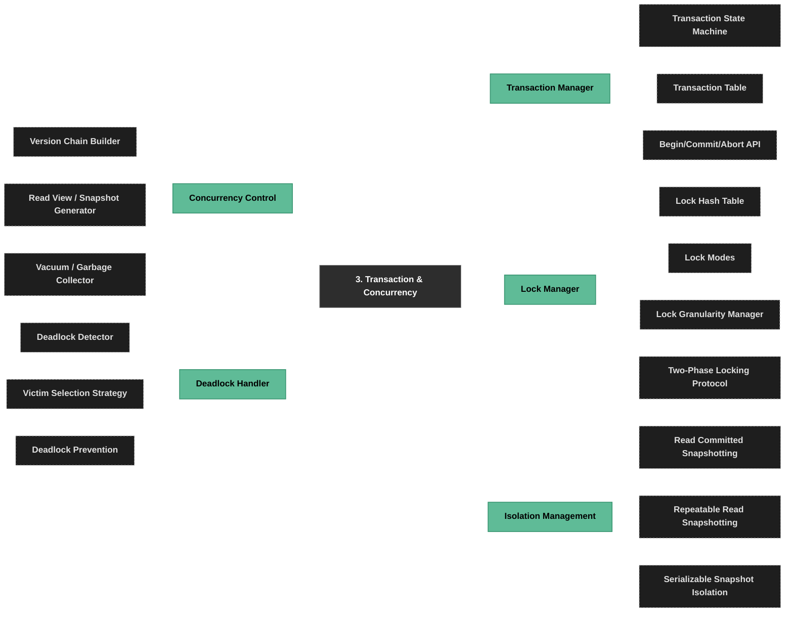
```mermaid
graph LR
    %% Styles cho nền tối (GitHub Dark Mode)
    classDef default fill:#2d2d2d,stroke:#888,stroke-width:1px,color:#fff;
    classDef root fill:#ff8888,stroke:#ff5555,stroke-width:2px,font-weight:bold,color:#000;
    classDef layer2 fill:#5fbb97,stroke:#3a9672,stroke-width:1.5px,font-weight:bold,color:#000;
    classDef layer3 fill:#1e1e1e,stroke:#aaaaaa,stroke-width:1px,stroke-dasharray: 3 3,color:#e0e0e0;

    %% Tăng độ tương phản cho đường nối liên kết giữa các node
    linkStyle default stroke:#ffffff,stroke-width:1.5px;

    %% Root
    tx[3. Transaction & Concurrency]:::layer1

    %% NỬA BÊN TRÁI
    tx_cc[Concurrency Control]:::layer2 --- tx
    tx_cc1[Version Chain Builder]:::layer3 --- tx_cc
    tx_cc2[Read View / Snapshot Generator]:::layer3 --- tx_cc
    tx_cc3[Vacuum / Garbage Collector]:::layer3 --- tx_cc

    tx_dl[Deadlock Handler]:::layer2 --- tx
    tx_dl1[Deadlock Detector]:::layer3 --- tx_dl
    tx_dl2[Victim Selection Strategy]:::layer3 --- tx_dl
    tx_dl3[Deadlock Prevention]:::layer3 --- tx_dl

    %% NỬA BÊN PHẢI
    tx --- tx_tm[Transaction Manager]:::layer2
    tx_tm --- tx_tm1[Transaction State Machine]:::layer3
    tx_tm --- tx_tm2[Transaction Table]:::layer3
    tx_tm --- tx_tm3[Begin/Commit/Abort API]:::layer3

    tx --- tx_lm[Lock Manager]:::layer2
    tx_lm --- tx_lm1[Lock Hash Table]:::layer3
    tx_lm --- tx_lm2[Lock Modes]:::layer3
    tx_lm --- tx_lm3[Lock Granularity Manager]:::layer3
    tx_lm --- tx_lm4[Two-Phase Locking Protocol]:::layer3

    tx --- tx_im[Isolation Management]:::layer2
    tx_im --- tx_im1[Read Committed Snapshotting]:::layer3
    tx_im --- tx_im2[Repeatable Read Snapshotting]:::layer3
    tx_im --- tx_im3[Serializable Snapshot Isolation]:::layer3
```

## Backup & Durability

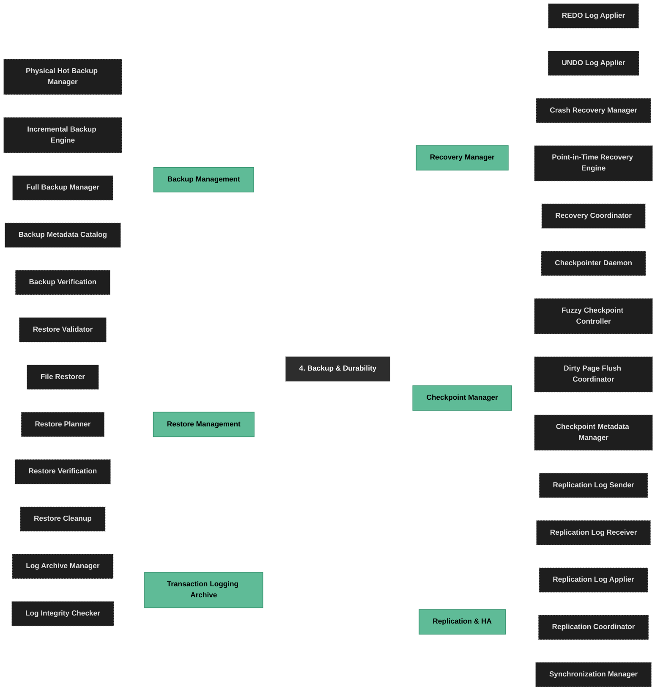
```mermaid
graph LR
    %% Styles cho nền tối (GitHub Dark Mode)
    classDef default fill:#2d2d2d,stroke:#888,stroke-width:1px,color:#fff;
    classDef root fill:#ff8888,stroke:#ff5555,stroke-width:2px,font-weight:bold,color:#000;
    classDef layer2 fill:#5fbb97,stroke:#3a9672,stroke-width:1.5px,font-weight:bold,color:#000;
    classDef layer3 fill:#1e1e1e,stroke:#aaaaaa,stroke-width:1px,stroke-dasharray: 3 3,color:#e0e0e0;

    %% Tăng độ tương phản cho đường nối liên kết giữa các node
    linkStyle default stroke:#ffffff,stroke-width:1.5px;

    %% Root
    bd[4. Backup & Durability]:::layer1

    %% NỬA BÊN TRÁI
    bd_bm[Backup Management]:::layer2 --- bd
    bd_bm1[Physical Hot Backup Manager]:::layer3 --- bd_bm
    bd_bm2[Incremental Backup Engine]:::layer3 --- bd_bm
    bd_bm3[Full Backup Manager]:::layer3 --- bd_bm
    bd_bm4[Backup Metadata Catalog]:::layer3 --- bd_bm
    bd_bm5[Backup Verification]:::layer3 --- bd_bm

    bd_rm[Restore Management]:::layer2 --- bd
    bd_rm1[Restore Validator]:::layer3 --- bd_rm
    bd_rm2[File Restorer]:::layer3 --- bd_rm
    bd_rm3[Restore Planner]:::layer3 --- bd_rm
    bd_rm4[Restore Verification]:::layer3 --- bd_rm
    bd_rm5[Restore Cleanup]:::layer3 --- bd_rm

    bd_tl[Transaction Logging Archive]:::layer2 --- bd
    bd_tl1[Log Archive Manager]:::layer3 --- bd_tl
    bd_tl2[Log Integrity Checker]:::layer3 --- bd_tl

    %% NỬA BÊN PHẢI
    bd --- bd_re[Recovery Manager]:::layer2
    bd_re --- bd_re1[REDO Log Applier]:::layer3
    bd_re --- bd_re2[UNDO Log Applier]:::layer3
    bd_re --- bd_re3[Crash Recovery Manager]:::layer3
    bd_re --- bd_re4[Point-in-Time Recovery Engine]:::layer3
    bd_re --- bd_re5[Recovery Coordinator]:::layer3

    bd --- bd_cp[Checkpoint Manager]:::layer2
    bd_cp --- bd_cp1[Checkpointer Daemon]:::layer3
    bd_cp --- bd_cp2[Fuzzy Checkpoint Controller]:::layer3
    bd_cp --- bd_cp3[Dirty Page Flush Coordinator]:::layer3
    bd_cp --- bd_cp4[Checkpoint Metadata Manager]:::layer3

    bd --- bd_rp[Replication & HA]:::layer2
    bd_rp --- bd_rp1[Replication Log Sender]:::layer3
    bd_rp --- bd_rp2[Replication Log Receiver]:::layer3
    bd_rp --- bd_rp3[Replication Log Applier]:::layer3
    bd_rp --- bd_rp4[Replication Coordinator]:::layer3
    bd_rp --- bd_rp5[Synchronization Manager]:::layer3
```

## Performance & Memory

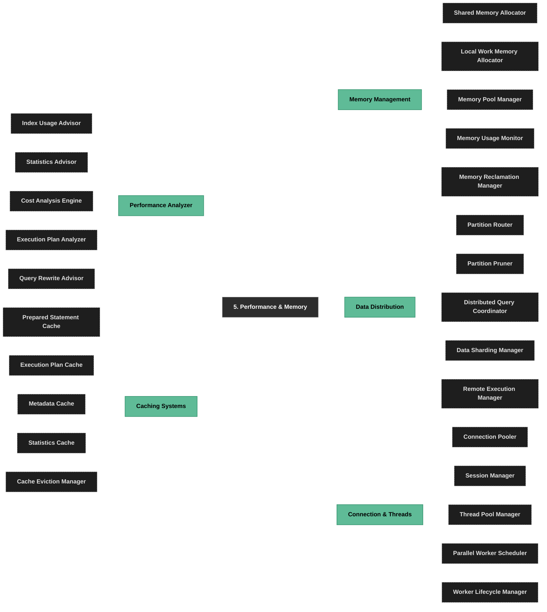
```mermaid
graph LR
    %% Styles cho nền tối (GitHub Dark Mode)
    classDef default fill:#2d2d2d,stroke:#888,stroke-width:1px,color:#fff;
    classDef root fill:#ff8888,stroke:#ff5555,stroke-width:2px,font-weight:bold,color:#000;
    classDef layer2 fill:#5fbb97,stroke:#3a9672,stroke-width:1.5px,font-weight:bold,color:#000;
    classDef layer3 fill:#1e1e1e,stroke:#aaaaaa,stroke-width:1px,stroke-dasharray: 3 3,color:#e0e0e0;

    %% Tăng độ tương phản cho đường nối liên kết giữa các node
    linkStyle default stroke:#ffffff,stroke-width:1.5px;

    %% Root
    pf[5. Performance & Memory]:::layer1

    %% NỬA BÊN TRÁI
    pf_qa[Performance Analyzer]:::layer2 --- pf
    pf_qa1[Index Usage Advisor]:::layer3 --- pf_qa
    pf_qa2[Statistics Advisor]:::layer3 --- pf_qa
    pf_qa3[Cost Analysis Engine]:::layer3 --- pf_qa
    pf_qa4[Execution Plan Analyzer]:::layer3 --- pf_qa
    pf_qa5[Query Rewrite Advisor]:::layer3 --- pf_qa

    pf_ch[Caching Systems]:::layer2 --- pf
    pf_ch1[Prepared Statement Cache]:::layer3 --- pf_ch
    pf_ch2[Execution Plan Cache]:::layer3 --- pf_ch
    pf_ch3[Metadata Cache]:::layer3 --- pf_ch
    pf_ch4[Statistics Cache]:::layer3 --- pf_ch
    pf_ch5[Cache Eviction Manager]:::layer3 --- pf_ch

    %% NỬA BÊN PHẢI
    pf --- pf_mm[Memory Management]:::layer2
    pf_mm --- pf_mm1[Shared Memory Allocator]:::layer3
    pf_mm --- pf_mm2[Local Work Memory Allocator]:::layer3
    pf_mm --- pf_mm3[Memory Pool Manager]:::layer3
    pf_mm --- pf_mm4[Memory Usage Monitor]:::layer3
    pf_mm --- pf_mm5[Memory Reclamation Manager]:::layer3

    pf --- pf_dd[Data Distribution]:::layer2
    pf_dd --- pf_dd1[Partition Router]:::layer3
    pf_dd --- pf_dd2[Partition Pruner]:::layer3
    pf_dd --- pf_dd3[Distributed Query Coordinator]:::layer3
    pf_dd --- pf_dd4[Data Sharding Manager]:::layer3
    pf_dd --- pf_dd5[Remote Execution Manager]:::layer3

    pf --- pf_ct[Connection & Threads]:::layer2
    pf_ct --- pf_ct1[Connection Pooler]:::layer3
    pf_ct --- pf_ct2[Session Manager]:::layer3
    pf_ct --- pf_ct3[Thread Pool Manager]:::layer3
    pf_ct --- pf_ct4[Parallel Worker Scheduler]:::layer3
    pf_ct --- pf_ct5[Worker Lifecycle Manager]:::layer3
```

## Database Object Management

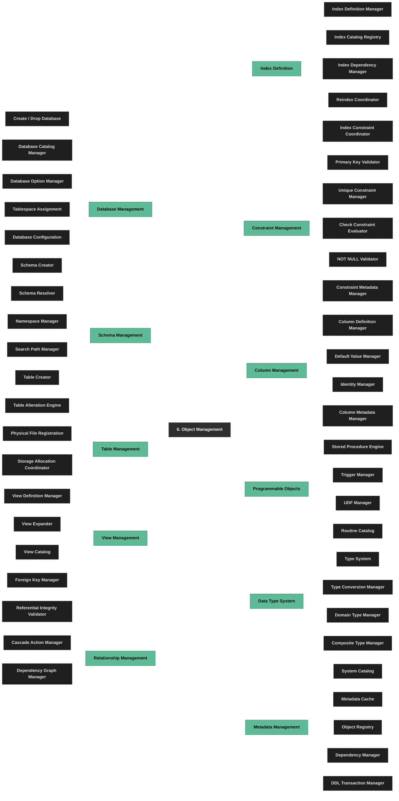
```mermaid
graph LR
    %% Styles cho nền tối (GitHub Dark Mode)
    classDef default fill:#2d2d2d,stroke:#888,stroke-width:1px,color:#fff;
    classDef root fill:#ff8888,stroke:#ff5555,stroke-width:2px,font-weight:bold,color:#000;
    classDef layer2 fill:#5fbb97,stroke:#3a9672,stroke-width:1.5px,font-weight:bold,color:#000;
    classDef layer3 fill:#1e1e1e,stroke:#aaaaaa,stroke-width:1px,stroke-dasharray: 3 3,color:#e0e0e0;

    %% Tăng độ tương phản cho đường nối liên kết giữa các node
    linkStyle default stroke:#ffffff,stroke-width:1.5px;

    %% Root
    om[6. Object Management]:::layer1

    %% NỬA BÊN TRÁI
    om_dm[Database Management]:::layer2 --- om
    om_dm1[Create / Drop Database]:::layer3 --- om_dm
    om_dm2[Database Catalog Manager]:::layer3 --- om_dm
    om_dm3[Database Option Manager]:::layer3 --- om_dm
    om_dm4[Tablespace Assignment]:::layer3 --- om_dm
    om_dm5[Database Configuration]:::layer3 --- om_dm

    om_sm[Schema Management]:::layer2 --- om
    om_sm1[Schema Creator]:::layer3 --- om_sm
    om_sm2[Schema Resolver]:::layer3 --- om_sm
    om_sm3[Namespace Manager]:::layer3 --- om_sm
    om_sm4[Search Path Manager]:::layer3 --- om_sm

    om_tm[Table Management]:::layer2 --- om
    om_tm1[Table Creator]:::layer3 --- om_tm
    om_tm2[Table Alteration Engine]:::layer3 --- om_tm
    om_tm3[Physical File Registration]:::layer3 --- om_tm
    om_tm4[Storage Allocation Coordinator]:::layer3 --- om_tm

    om_vm[View Management]:::layer2 --- om
    om_vm1[View Definition Manager]:::layer3 --- om_vm
    om_vm2[View Expander]:::layer3 --- om_vm
    om_vm3[View Catalog]:::layer3 --- om_vm

    om_rm[Relationship Management]:::layer2 --- om
    om_rm1[Foreign Key Manager]:::layer3 --- om_rm
    om_rm2[Referential Integrity Validator]:::layer3 --- om_rm
    om_rm3[Cascade Action Manager]:::layer3 --- om_rm
    om_rm4[Dependency Graph Manager]:::layer3 --- om_rm

    %% NỬA BÊN PHẢI
    om --- om_im[Index Definition]:::layer2
    om_im --- om_im1[Index Definition Manager]:::layer3
    om_im --- om_im2[Index Catalog Registry]:::layer3
    om_im --- om_im3[Index Dependency Manager]:::layer3
    om_im --- om_im4[Reindex Coordinator]:::layer3
    om_im --- om_im5[Index Constraint Coordinator]:::layer3

    om --- om_cm[Constraint Management]:::layer2
    om_cm --- om_cm1[Primary Key Validator]:::layer3
    om_cm --- om_cm2[Unique Constraint Manager]:::layer3
    om_cm --- om_cm3[Check Constraint Evaluator]:::layer3
    om_cm --- om_cm4[NOT NULL Validator]:::layer3
    om_cm --- om_cm5[Constraint Metadata Manager]:::layer3

    om --- om_com[Column Management]:::layer2
    om_com --- om_com1[Column Definition Manager]:::layer3
    om_com --- om_com2[Default Value Manager]:::layer3
    om_com --- om_com3[Identity Manager]:::layer3
    om_com --- om_com4[Column Metadata Manager]:::layer3

    om --- om_po[Programmable Objects]:::layer2
    om_po --- om_po1[Stored Procedure Engine]:::layer3
    om_po --- om_po2[Trigger Manager]:::layer3
    om_po --- om_po3[UDF Manager]:::layer3
    om_po --- om_po4[Routine Catalog]:::layer3

    om --- om_dt[Data Type System]:::layer2
    om_dt --- om_dt1[Type System]:::layer3
    om_dt --- om_dt2[Type Conversion Manager]:::layer3
    om_dt --- om_dt3[Domain Type Manager]:::layer3
    om_dt --- om_dt4[Composite Type Manager]:::layer3

    om --- om_mm[Metadata Management]:::layer2
    om_mm --- om_mm1[System Catalog]:::layer3
    om_mm --- om_mm2[Metadata Cache]:::layer3
    om_mm --- om_mm3[Object Registry]:::layer3
    om_mm --- om_mm4[Dependency Manager]:::layer3
    om_mm --- om_mm5[DDL Transaction Manager]:::layer3
```

## Security & Access Control

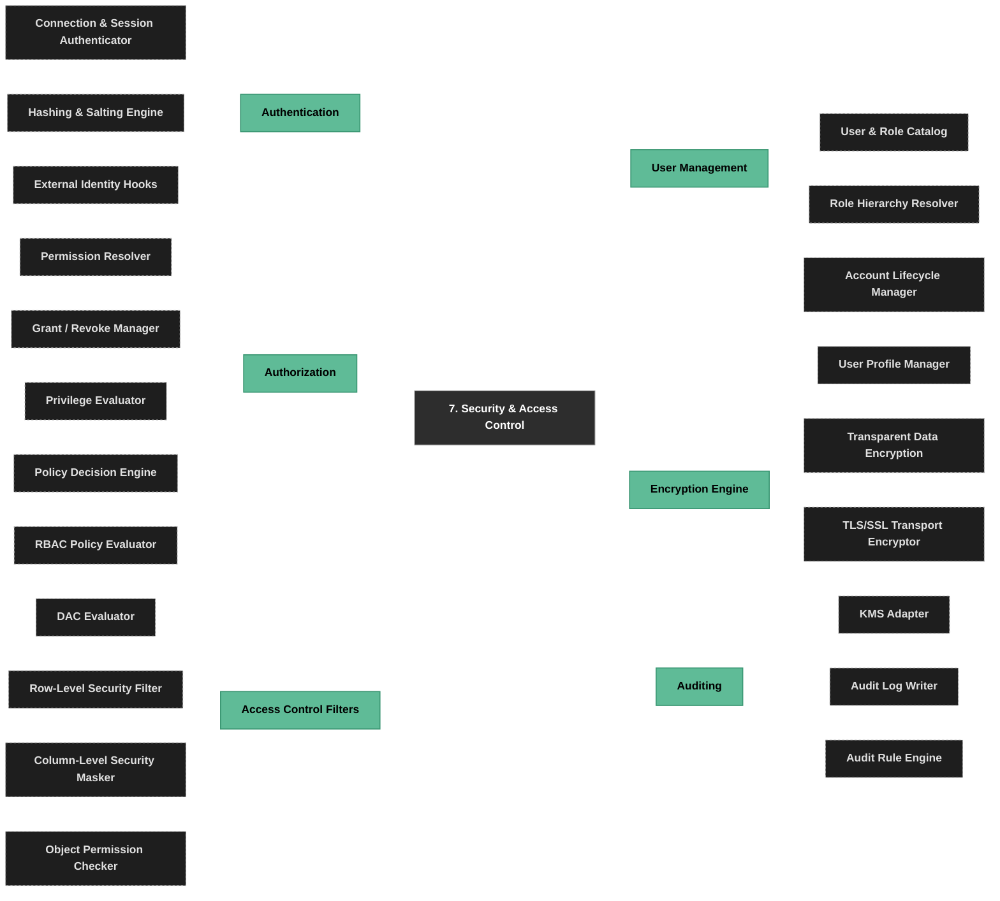
```mermaid
graph LR
    %% Styles cho nền tối (GitHub Dark Mode)
    classDef default fill:#2d2d2d,stroke:#888,stroke-width:1px,color:#fff;
    classDef root fill:#ff8888,stroke:#ff5555,stroke-width:2px,font-weight:bold,color:#000;
    classDef layer2 fill:#5fbb97,stroke:#3a9672,stroke-width:1.5px,font-weight:bold,color:#000;
    classDef layer3 fill:#1e1e1e,stroke:#aaaaaa,stroke-width:1px,stroke-dasharray: 3 3,color:#e0e0e0;

    %% Tăng độ tương phản cho đường nối liên kết giữa các node
    linkStyle default stroke:#ffffff,stroke-width:1.5px;

    %% Root
    sa[7. Security & Access Control]:::layer1

    %% NỬA BÊN TRÁI
    sa_au[Authentication]:::layer2 --- sa
    sa_au1[Connection & Session Authenticator]:::layer3 --- sa_au
    sa_au2[Hashing & Salting Engine]:::layer3 --- sa_au
    sa_au3[External Identity Hooks]:::layer3 --- sa_au

    sa_az[Authorization]:::layer2 --- sa
    sa_az1[Permission Resolver]:::layer3 --- sa_az
    sa_az2[Grant / Revoke Manager]:::layer3 --- sa_az
    sa_az3[Privilege Evaluator]:::layer3 --- sa_az
    sa_az4[Policy Decision Engine]:::layer3 --- sa_az

    sa_ac[Access Control Filters]:::layer2 --- sa
    sa_ac1[RBAC Policy Evaluator]:::layer3 --- sa_ac
    sa_ac2[DAC Evaluator]:::layer3 --- sa_ac
    sa_ac3[Row-Level Security Filter]:::layer3 --- sa_ac
    sa_ac4[Column-Level Security Masker]:::layer3 --- sa_ac
    sa_ac5[Object Permission Checker]:::layer3 --- sa_ac

    %% NỬA BÊN PHẢI
    sa --- sa_um[User Management]:::layer2
    sa_um --- sa_um1[User & Role Catalog]:::layer3
    sa_um --- sa_um2[Role Hierarchy Resolver]:::layer3
    sa_um --- sa_um3[Account Lifecycle Manager]:::layer3
    sa_um --- sa_um4[User Profile Manager]:::layer3

    sa --- sa_ec[Encryption Engine]:::layer2
    sa_ec --- sa_ec1[Transparent Data Encryption]:::layer3
    sa_ec --- sa_ec2[TLS/SSL Transport Encryptor]:::layer3
    sa_ec --- sa_ec3[KMS Adapter]:::layer3

    sa --- sa_ad[Auditing]:::layer2
    sa_ad --- sa_ad1[Audit Log Writer]:::layer3
    sa_ad --- sa_ad2[Audit Rule Engine]:::layer3
```

## Administration & Monitoring

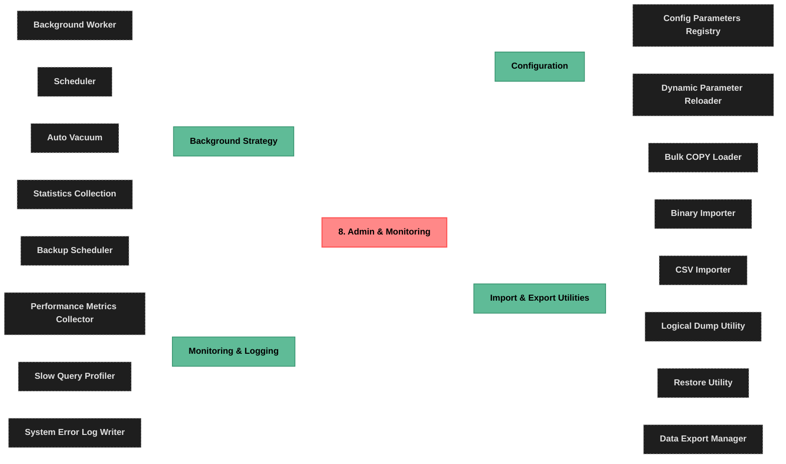
```mermaid
graph LR
    %% Styles cho nền tối (GitHub Dark Mode)
    classDef default fill:#2d2d2d,stroke:#888,stroke-width:1px,color:#fff;
    classDef root fill:#ff8888,stroke:#ff5555,stroke-width:2px,font-weight:bold,color:#000;
    classDef layer2 fill:#5fbb97,stroke:#3a9672,stroke-width:1.5px,font-weight:bold,color:#000;
    classDef layer3 fill:#1e1e1e,stroke:#aaaaaa,stroke-width:1px,stroke-dasharray: 3 3,color:#e0e0e0;

    %% Tăng độ tương phản cho đường nối liên kết giữa các node
    linkStyle default stroke:#ffffff,stroke-width:1.5px;

    %% Nút gốc (Center)
    am[8. Admin & Monitoring]:::root

    %% NỬA BÊN TRÁI
    am_bs[Background Strategy]:::layer2 --- am
    am_bs1[Background Worker]:::layer3 --- am_bs
    am_bs2[Scheduler]:::layer3 --- am_bs
    am_bs3[Auto Vacuum]:::layer3 --- am_bs
    am_bs4[Statistics Collection]:::layer3 --- am_bs
    am_bs5[Backup Scheduler]:::layer3 --- am_bs

    am_ml[Monitoring & Logging]:::layer2 --- am
    am_ml1[Performance Metrics Collector]:::layer3 --- am_ml
    am_ml2[Slow Query Profiler]:::layer3 --- am_ml
    am_ml3[System Error Log Writer]:::layer3 --- am_ml

    %% NỬA BÊN PHẢI
    am --- am_cm[Configuration]:::layer2
    am_cm --- am_cm1[Config Parameters Registry]:::layer3
    am_cm --- am_cm2[Dynamic Parameter Reloader]:::layer3

    am --- am_ie[Import & Export Utilities]:::layer2
    am_ie --- am_ie1[Bulk COPY Loader]:::layer3
    am_ie --- am_ie2[Binary Importer]:::layer3
    am_ie --- am_ie3[CSV Importer]:::layer3
    am_ie --- am_ie4[Logical Dump Utility]:::layer3
    am_ie --- am_ie5[Restore Utility]:::layer3
    am_ie --- am_ie6[Data Export Manager]:::layer3
```

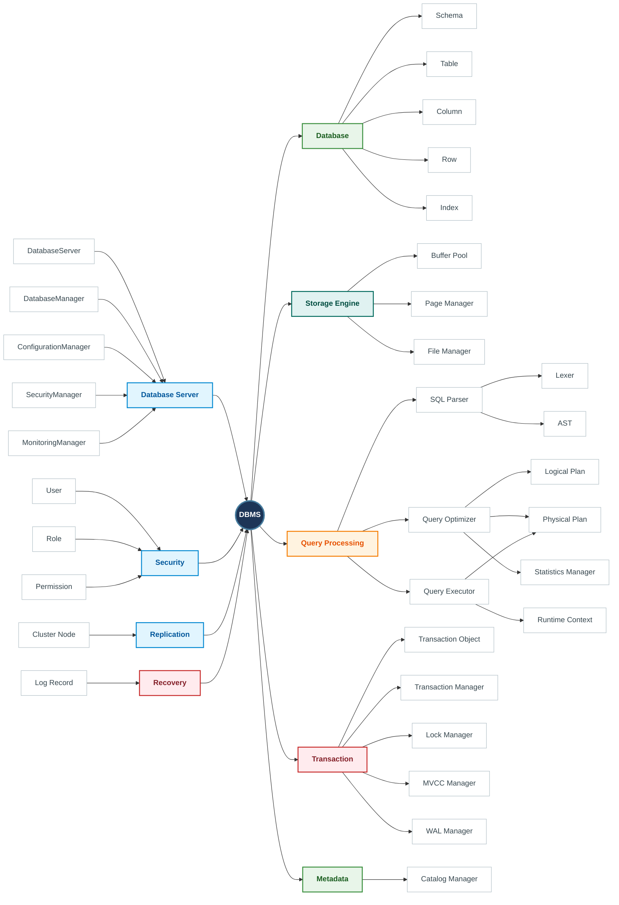
```mermaid
flowchart LR
    %% =====================================================
    %% NODE DECLARATIONS & STYLING (Declared exactly once)
    %% =====================================================
    DBMS((DBMS)):::rootStyle
    
    %% Left-side Branches
    Server["Database Server"]:::branchAdmin
    Security["Security"]:::branchAdmin
    Replication["Replication"]:::branchAdmin
    Recovery["Recovery"]:::branchTx
    
    DatabaseServer["DatabaseServer"]:::leafStyle
    DatabaseManager["DatabaseManager"]:::leafStyle
    ConfigurationManager["ConfigurationManager"]:::leafStyle
    SecurityManager["SecurityManager"]:::leafStyle
    MonitoringManager["MonitoringManager"]:::leafStyle
    
    User["User"]:::leafStyle
    Role["Role"]:::leafStyle
    Permission["Permission"]:::leafStyle
    ClusterNode["Cluster Node"]:::leafStyle
    LogRecord["Log Record"]:::leafStyle

    %% Right-side Branches
    Database["Database"]:::branchCatalog
    Storage["Storage Engine"]:::branchStorage
    Query["Query Processing"]:::branchQuery
    Transaction["Transaction"]:::branchTx
    Metadata["Metadata"]:::branchCatalog
    
    Schema["Schema"]:::leafStyle
    Table["Table"]:::leafStyle
    Column["Column"]:::leafStyle
    Row["Row"]:::leafStyle
    Index["Index"]:::leafStyle
    
    BufferPool["Buffer Pool"]:::leafStyle
    PageManager["Page Manager"]:::leafStyle
    FileManager["File Manager"]:::leafStyle
    
    SQLParser["SQL Parser"]:::leafStyle
    Lexer["Lexer"]:::leafStyle
    AST["AST"]:::leafStyle
    
    QueryOptimizer["Query Optimizer"]:::leafStyle
    LogicalPlan["Logical Plan"]:::leafStyle
    PhysicalPlan["Physical Plan"]:::leafStyle
    StatisticsManager["Statistics Manager"]:::leafStyle
    
    QueryExecutor["Query Executor"]:::leafStyle
    RuntimeContext["Runtime Context"]:::leafStyle
    
    TransactionObject["Transaction Object"]:::leafStyle
    TransactionManager["Transaction Manager"]:::leafStyle
    LockManager["Lock Manager"]:::leafStyle
    MVCCManager["MVCC Manager"]:::leafStyle
    WALManager["WAL Manager"]:::leafStyle
    
    CatalogManager["Catalog Manager"]:::leafStyle

    %% =====================================================
    %% CONNECTIONS (Simple Node IDs only)
    %% =====================================================
    
    %% Left Side Connections (pointing left-to-right into DBMS)
    Server --> DBMS
    Security --> DBMS
    Replication --> DBMS
    Recovery --> DBMS

    DatabaseServer --> Server
    DatabaseManager --> Server
    ConfigurationManager --> Server
    SecurityManager --> Server
    MonitoringManager --> Server

    User --> Security
    Role --> Security
    Permission --> Security

    ClusterNode --> Replication
    LogRecord --> Recovery

    %% Right Side Connections (pointing right)
    DBMS --> Database
    DBMS --> Storage
    DBMS --> Query
    DBMS --> Transaction
    DBMS --> Metadata

    Database --> Schema
    Database --> Table
    Database --> Column
    Database --> Row
    Database --> Index

    Storage --> BufferPool
    Storage --> PageManager
    Storage --> FileManager

    Query --> SQLParser
    SQLParser --> Lexer
    SQLParser --> AST

    Query --> QueryOptimizer
    QueryOptimizer --> LogicalPlan
    QueryOptimizer --> PhysicalPlan
    QueryOptimizer --> StatisticsManager

    Query --> QueryExecutor
    QueryExecutor --> RuntimeContext
    QueryExecutor --> PhysicalPlan

    Transaction --> TransactionObject
    Transaction --> TransactionManager
    Transaction --> LockManager
    Transaction --> MVCCManager
    Transaction --> WALManager

    Metadata --> CatalogManager

    %% =====================================================
    %% STYLING DEFINITIONS (HSL Colors)
    %% =====================================================
    classDef rootStyle fill:#1d3557,stroke:#457b9d,stroke-width:3px,color:#fff,font-weight:bold,font-size:16px;
    classDef branchAdmin fill:#e1f5fe,stroke:#0288d1,stroke-width:2px,color:#01579b,font-weight:bold;
    classDef branchQuery fill:#fff3e0,stroke:#f57c00,stroke-width:2px,color:#e65100,font-weight:bold;
    classDef branchCatalog fill:#e8f5e9,stroke:#388e3c,stroke-width:2px,color:#1b5e20,font-weight:bold;
    classDef branchStorage fill:#e0f2f1,stroke:#00695c,stroke-width:2px,color:#004d40,font-weight:bold;
    classDef branchTx fill:#ffebee,stroke:#c62828,stroke-width:2px,color:#842029,font-weight:bold;
    classDef leafStyle fill:#ffffff,stroke:#b0bec5,stroke-width:1px,color:#37474f;
```