# Progress Summary

| Class/Section | Total | Completed | Missing | Progress |
| ------------- | ----- | --------- | ------- | -------- |
| DatabaseServer | 3 | 3 | 0 | 100% |
| DatabaseManager | 7 | 7 | 0 | 100% |
| Database Operations | 6 | 6 | 0 | 100% |
| Schema & Table Operations | 10 | 10 | 0 | 100% |
| Primary Key Constraints | 3 | 3 | 0 | 100% |
| Unique Constraints | 3 | 3 | 0 | 100% |
| Foreign Key Constraints | 5 | 5 | 0 | 100% |
| Check Constraints | 4 | 4 | 0 | 100% |
| Index & IndexManager | 8 | 0 | 8 | 0% |
| Schema & Table Services | 9 | 3 | 6 | 33% |
| RecordManager | 7 | 0 | 7 | 0% |
| BufferPool Operations | 9 | 0 | 9 | 0% |
| Page & FileManager | 7 | 0 | 7 | 0% |
| Logging & Recovery | 8 | 0 | 8 | 0% |
| Transaction Lifecycle & TransactionManager | 10 | 0 | 10 | 0% |
| LockManager & MVCC | 9 | 0 | 9 | 0% |
| SQL Parsing & Semantic Analysis | 7 | 0 | 7 | 0% |
| Query Optimization | 6 | 0 | 6 | 0% |
| Query Execution | 11 | 0 | 11 | 0% |
| Catalog Registration (Database, Schema, Table) | 7 | 0 | 7 | 0% |
| Metadata Lookup & Dependency Management | 4 | 1 | 3 | 25% |
| Authentication | 3 | 0 | 3 | 0% |
| Permission & Authorization | 8 | 0 | 8 | 0% |
| **TOTAL** | **154** | **45** | **109** | **29%** |

## 1. Database Server & Database Lifecycle

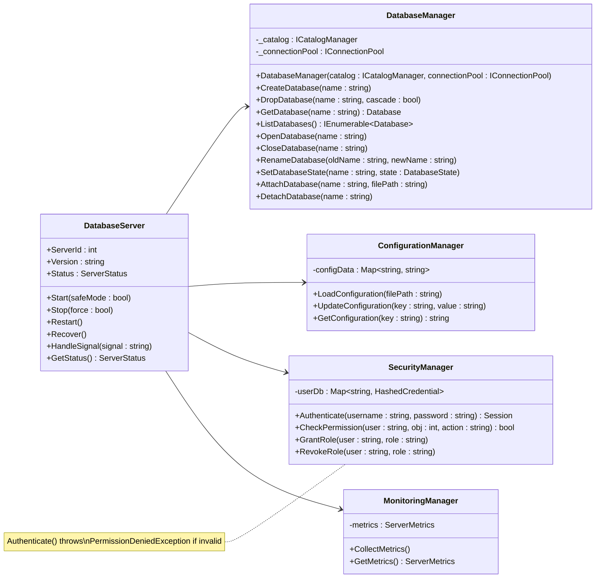
```mermaid
classDiagram
direction LR
class DatabaseServer {
    +ServerId : int
    +Version : string
    +Status : ServerStatus
    +Start(safeMode : bool)
    +Stop(force : bool)
    +Restart()
    +Recover()
    +HandleSignal(signal : string)
    +GetStatus() ServerStatus
}
class DatabaseManager {
    -_catalog : ICatalogManager
    -_connectionPool : IConnectionPool
    +DatabaseManager(catalog : ICatalogManager, connectionPool : IConnectionPool)
    +CreateDatabase(name : string)
    +DropDatabase(name : string, cascade : bool)
    +GetDatabase(name : string) Database
    +ListDatabases() IEnumerable~Database~
    +OpenDatabase(name : string)
    +CloseDatabase(name : string)
    +RenameDatabase(oldName : string, newName : string)
    +SetDatabaseState(name : string, state : DatabaseState)
    +AttachDatabase(name : string, filePath : string)
    +DetachDatabase(name : string)
}
class ConfigurationManager {
    -configData : Map~string, string~
    +LoadConfiguration(filePath : string)
    +UpdateConfiguration(key : string, value : string)
    +GetConfiguration(key : string) string
}
class SecurityManager {
    -userDb : Map~string, HashedCredential~
    +Authenticate(username : string, password : string) Session
    +CheckPermission(user : string, obj : int, action : string) bool
    +GrantRole(user : string, role : string)
    +RevokeRole(user : string, role : string)
}
note for SecurityManager "Authenticate() throws\nPermissionDeniedException if invalid"
class MonitoringManager {
    -metrics : ServerMetrics
    +CollectMetrics()
    +GetMetrics() ServerMetrics
}
DatabaseServer --> DatabaseManager
DatabaseServer --> ConfigurationManager
DatabaseServer --> SecurityManager
DatabaseServer --> MonitoringManager
```

### DatabaseServer
Covers: `Start_ShouldInitializeAllServices`, `Stop_ShouldFlushDirtyPagesBeforeShutdown`, `RecoverAfterCrash_ShouldReplayWAL`
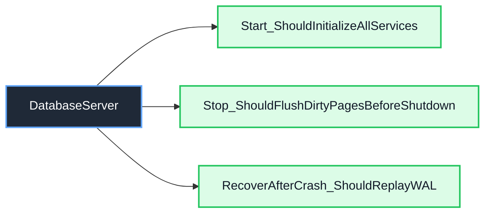
```mermaid
flowchart LR
    ClassNode["DatabaseServer"]

    ClassNode --> DatabaseServer_1["Start_ShouldInitializeAllServices"]
    ClassNode --> DatabaseServer_2["Stop_ShouldFlushDirtyPagesBeforeShutdown"]
    ClassNode --> DatabaseServer_3["RecoverAfterCrash_ShouldReplayWAL"]

    classDef classNode fill:#1f2937,stroke:#60a5fa,color:#ffffff,stroke-width:2px
    classDef completedTest fill:#dcfce7,stroke:#22c55e,color:#111827,stroke-width:2px
    classDef missingTest fill:#fee2e2,stroke:#ef4444,color:#111827,stroke-width:2px,stroke-dasharray:5 5

    class ClassNode classNode
    class DatabaseServer_1,DatabaseServer_2,DatabaseServer_3 completedTest
```

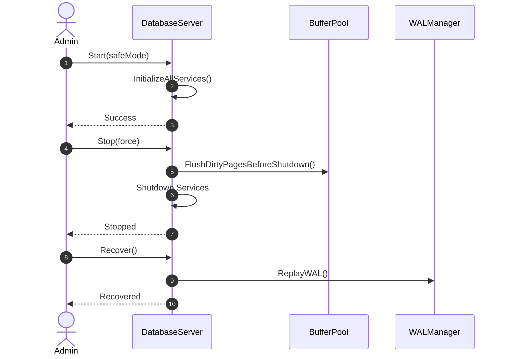
```mermaid
sequenceDiagram
    autonumber
    actor Admin
    participant Server as DatabaseServer
    participant Buffer as BufferPool
    participant WAL as WALManager
    
    Admin->>Server: Start(safeMode)
    Server->>Server: InitializeAllServices()
    Server-->>Admin: Success
    
    Admin->>Server: Stop(force)
    Server->>Buffer: FlushDirtyPagesBeforeShutdown()
    Server->>Server: Shutdown Services
    Server-->>Admin: Stopped
    
    Admin->>Server: Recover()
    Server->>WAL: ReplayWAL()
    Server-->>Admin: Recovered
```

### DatabaseManager
Covers: `CreateDatabase_ShouldCreateDatabaseSuccessfully`, `CreateDatabase_ShouldRejectDuplicateDatabaseName`, `CreateDatabase_ShouldReject_WhenPermissionDenied`, `DropDatabase_ShouldRemoveDatabaseSuccessfully`, `DropDatabase_ShouldReject_WhenDatabaseContainsSchemas`, `OpenDatabase_ShouldLoadStorageAndCatalog`, `CloseDatabase_ShouldFlushDirtyBuffers`
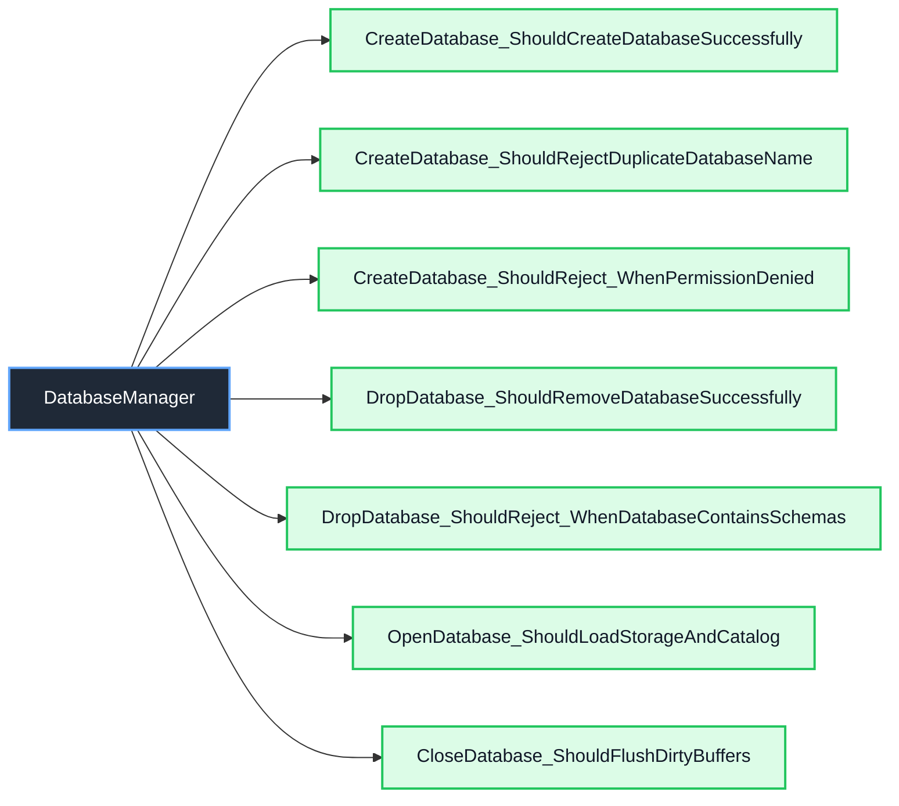
```mermaid
flowchart LR
    ClassNode["DatabaseManager"]

    ClassNode --> DatabaseManager_1["CreateDatabase_ShouldCreateDatabaseSuccessfully"]
    ClassNode --> DatabaseManager_2["CreateDatabase_ShouldRejectDuplicateDatabaseName"]
    ClassNode --> DatabaseManager_3["CreateDatabase_ShouldReject_WhenPermissionDenied"]
    ClassNode --> DatabaseManager_4["DropDatabase_ShouldRemoveDatabaseSuccessfully"]
    ClassNode --> DatabaseManager_5["DropDatabase_ShouldReject_WhenDatabaseContainsSchemas"]
    ClassNode --> DatabaseManager_6["OpenDatabase_ShouldLoadStorageAndCatalog"]
    ClassNode --> DatabaseManager_7["CloseDatabase_ShouldFlushDirtyBuffers"]

    classDef classNode fill:#1f2937,stroke:#60a5fa,color:#ffffff,stroke-width:2px
    classDef completedTest fill:#dcfce7,stroke:#22c55e,color:#111827,stroke-width:2px
    classDef missingTest fill:#fee2e2,stroke:#ef4444,color:#111827,stroke-width:2px,stroke-dasharray:5 5

    class ClassNode classNode
    class DatabaseManager_1,DatabaseManager_2,DatabaseManager_3,DatabaseManager_4,DatabaseManager_5,DatabaseManager_6,DatabaseManager_7 completedTest
```

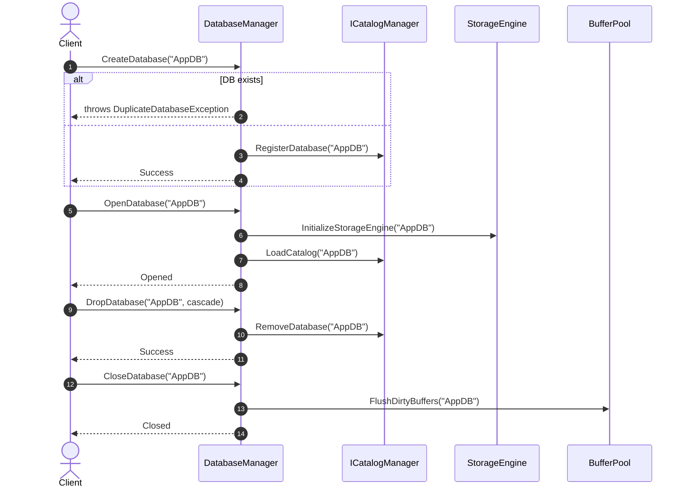
```mermaid
sequenceDiagram
    autonumber
    actor Client
    participant DBManager as DatabaseManager
    participant Catalog as ICatalogManager
    participant Storage as StorageEngine
    participant Buffer as BufferPool
    
    Client->>DBManager: CreateDatabase("AppDB")
    alt DB exists
        DBManager-->>Client: throws DuplicateDatabaseException
    else
        DBManager->>Catalog: RegisterDatabase("AppDB")
        DBManager-->>Client: Success
    end
    
    Client->>DBManager: OpenDatabase("AppDB")
    DBManager->>Storage: InitializeStorageEngine("AppDB")
    DBManager->>Catalog: LoadCatalog("AppDB")
    DBManager-->>Client: Opened
    
    Client->>DBManager: DropDatabase("AppDB", cascade)
    DBManager->>Catalog: RemoveDatabase("AppDB")
    DBManager-->>Client: Success
    
    Client->>DBManager: CloseDatabase("AppDB")
    DBManager->>Buffer: FlushDirtyBuffers("AppDB")
    DBManager-->>Client: Closed
```

---

## 2. Database Objects

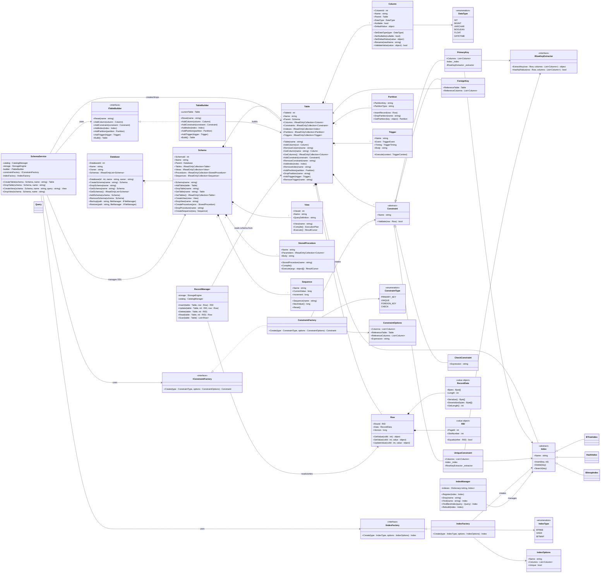
```mermaid
classDiagram
direction LR

%% =====================================================
%% Composite Hierarchy & DB Objects
%% =====================================================

class Database {
    +DatabaseId : int
    +Name : string
    +Owner : string
    +Schemas : IReadOnlyList~Schema~
    +Database(id : int, name : string, owner : string)
    +CreateSchema(name : string) Schema
    +DropSchema(name : string)
    +GetSchema(name : string) Schema
    +GetSchemas() IReadOnlyList~Schema~
    +AddSchema(schema : Schema)
    +RemoveSchema(schema : Schema)
    +Backup(path : string, fileManager : IFileManager)
    +Restore(path : string, fileManager : IFileManager)
}

class Schema {
    +SchemaId : int
    +Name : string
    +Parent : Database
    +Tables : IReadOnlyCollection~Table~
    +Views : IReadOnlyCollection~View~
    +Procedures : IReadOnlyCollection~StoredProcedure~
    +Sequences : IReadOnlyCollection~Sequence~
    +Schema(name : string)
    +AddTable(table : Table)
    +DropTable(name : string)
    +GetTable(name : string) Table
    +GetTables() IReadOnlyCollection~Table~
    +CreateView(view : View)
    +DropView(name : string)
    +CreateProcedure(proc : StoredProcedure)
    +DropProcedure(name : string)
    +CreateSequence(seq : Sequence)
}

class Table {
    +TableId : int
    +Name : string
    +Parent : Schema
    +Columns : IReadOnlyCollection~Column~
    +Constraints : IReadOnlyCollection~Constraint~
    +Indexes : IReadOnlyCollection~Index~
    +Partitions : IReadOnlyCollection~Partition~
    +Triggers : IReadOnlyCollection~Trigger~
    +Table(name : string)
    +AddColumn(col : Column)
    +RemoveColumn(name : string)
    +GetColumn(name : string) Column
    +GetColumns() IReadOnlyCollection~Column~
    +AddConstraint(constraint : Constraint)
    +RemoveConstraint(name : string)
    +AddIndex(index : Index)
    +RemoveIndex(name : string)
    +AddPartition(partition : Partition)
    +DropPartition(name : string)
    +AddTrigger(trigger : Trigger)
    +RemoveTrigger(name : string)
}

class Column {
    +ColumnId : int
    +Name : string
    +Parent : Table
    +DataType : DataType
    +Nullable : bool
    +DefaultValue : object
    +SetDataType(type : DataType)
    +SetNullable(nullable : bool)
    +SetDefaultValue(value : object)
    +Rename(newName : string)
    +ValidateValue(value : object) bool
}

class DataType {
    <<enumeration>>
    INT
    BIGINT
    VARCHAR
    BOOLEAN
    FLOAT
    DATETIME
}

class Constraint {
    <<abstract>>
    +Name : string
    +Validate(row : Row) bool
}

class IRowKeyExtractor {
    <<interface>>
    +ExtractKey(row : Row, columns : List~Column~) object
    +HasNullValue(row : Row, columns : List~Column~) bool
}

class PrimaryKey {
    +Columns : List~Column~
    -Index _index
    -IRowKeyExtractor _extractor
}

class ForeignKey {
    +ReferenceTable : Table
    +ReferenceColumns : List~Column~
}

class UniqueConstraint {
    +Columns : List~Column~
    -Index _index
    -IRowKeyExtractor _extractor
}

class CheckConstraint {
    +Expression : string
}

class View {
    +ViewId : int
    +Name : string
    +QueryDefinition : string
    +View(name : string)
    +Compile() ExecutionPlan
    +Execute() ResultCursor
}

class StoredProcedure {
    +Name : string
    +Parameters : IReadOnlyCollection~Column~
    +Body : string
    +StoredProcedure(name : string)
    +Compile()
    +Execute(args : object[]) ResultCursor
}

class Sequence {
    +Name : string
    +CurrentValue : long
    +Increment : long
    +Sequence(name : string)
    +NextValue() long
    +Reset()
}

class Partition {
    +PartitionKey : string
    +PartitionType : string
    +InsertRecord(row : Row)
    +DropPartition(name : string)
    +GetPartition(key : object) Partition
}

class Trigger {
    +Name : string
    +Event : TriggerEvent
    +Timing : TriggerTiming
    +Body : string
    +Execute(context : TriggerContext)
}

class Row {
    +RowId : RID
    +Data : RecordData
    +Version : long
    +GetValue(colId : int) object
    +SetValue(colId : int, value : object)
    +UpdateValue(colId : int, value : object)
}

class RecordData {
    <<value object>>
    +Bytes : Byte[]
    +Length : int
    +Serialize() Byte[]
    +Deserialize(bytes : Byte[])
    +GetLength() int
}

class RID {
    <<value object>>
    +PageId : int
    +SlotNumber : int
    +Equals(other : RID) bool
}

class Index {
    <<abstract>>
    +Name : string
    +Insert(key, rid)
    +Delete(key)
    +Search(key)
}

class BTreeIndex
class HashIndex
class BitmapIndex

Database "1" *-- "*" Schema
Schema "1" *-- "*" Table
Table "1" *-- "*" Column
Table "1" *-- "*" Constraint
Table "1" *-- "*" Index
Table "1" *-- "*" Partition
Table "1" *-- "*" Trigger
Schema "1" *-- "*" View
Schema "1" *-- "*" StoredProcedure
Schema "1" *-- "*" Sequence
Table "1" *-- "*" Row

Row *-- RID
Row *-- RecordData
Column --> DataType
Constraint <|-- PrimaryKey
Constraint <|-- ForeignKey
Constraint <|-- UniqueConstraint
Constraint <|-- CheckConstraint
ForeignKey --> Table
PrimaryKey --> IRowKeyExtractor
UniqueConstraint --> IRowKeyExtractor
PrimaryKey --> Index
UniqueConstraint --> Index
Index <|-- BTreeIndex
Index <|-- HashIndex
Index <|-- BitmapIndex


%% =====================================================
%% Builder Pattern
%% =====================================================

class ITableBuilder {
    <<interface>>
    +Reset(name : string)
    +AddColumn(column : Column)
    +AddConstraint(constraint : Constraint)
    +AddIndex(index : Index)
    +AddPartition(partition : Partition)
    +AddTrigger(trigger : Trigger)
    +Build() Table
}

class TableBuilder {
    -currentTable : Table
    +Reset(name : string)
    +AddColumn(column : Column)
    +AddConstraint(constraint : Constraint)
    +AddIndex(index : Index)
    +AddPartition(partition : Partition)
    +AddTrigger(trigger : Trigger)
    +Build() Table
}


%% =====================================================
%% Factory Method Patterns
%% =====================================================

class IConstraintFactory {
    <<interface>>
    +Create(type : ConstraintType, options : ConstraintOptions) Constraint
}

class ConstraintFactory {
    +Create(type : ConstraintType, options : ConstraintOptions) Constraint
}

class ConstraintType{
    <<enumeration>>
    PRIMARY_KEY
    UNIQUE
    FOREIGN_KEY
    CHECK
}

class ConstraintOptions{
    +Columns : List~Column~
    +ReferenceTable : Table
    +ReferenceColumns : List~Column~
    +Expression : string
}

class IIndexFactory {
    <<interface>>
    +Create(type : IndexType, options : IndexOptions) Index
}

class IndexFactory {
    +Create(type : IndexType, options : IndexOptions) Index
}

class IndexType{
    <<enumeration>>
    BTREE
    HASH
    BITMAP
}

class IndexOptions{
    +Name : string
    +Columns : List~Column~
    +Unique : bool
}

ConstraintFactory --> ConstraintType
ConstraintFactory --> ConstraintOptions

IndexFactory --> IndexType
IndexFactory --> IndexOptions


%% =====================================================
%% Domain Services
%% =====================================================

class SchemaService {
    -catalog : CatalogManager
    -storage : StorageEngine
    -builder : ITableBuilder
    -constraintFactory : IConstraintFactory
    -indexFactory : IIndexFactory
    +CreateTable(schema : Schema, name : string) Table
    +DropTable(schema : Schema, name : string)
    +CreateView(schema : Schema, name : string, query : string) View
    +DropView(schema : Schema, name : string)
}

class RecordManager {
    -storage : StorageEngine
    -catalog : CatalogManager
    +Insert(table : Table, row : Row) RID
    +Update(table : Table, rid : RID, row : Row)
    +Delete(table : Table, rid : RID)
    +Read(table : Table, rid : RID) Row
    +Scan(table : Table) List~Row~
}

class IndexManager {
    -indexes : Dictionary~string, Index~
    +Register(index : Index)
    +Drop(name : string)
    +Find(name : string) Index
    +FindBestIndex(query : Query) Index
    +Rebuild(index : Index)
}

class Query {
}

SchemaService --> ITableBuilder : uses
SchemaService --> IConstraintFactory : uses
SchemaService --> IIndexFactory : uses
SchemaService --> Schema : manages DDL
SchemaService --> Table : creates/drops

ITableBuilder <|.. TableBuilder
IConstraintFactory <|.. ConstraintFactory
IIndexFactory <|.. IndexFactory

TableBuilder --> Table : builds
ConstraintFactory --> Constraint : creates
IndexFactory --> Index : creates

RecordManager --> Table : reads schema from
RecordManager --> Row : reads/writes
IndexManager --> Index : manages
```

### Database Operations
Covers: `CreateSchema_ShouldAddSchemaToDatabase`, `CreateSchema_ShouldRejectDuplicateSchemaName`, `CreateSchema_ShouldReject_WhenPermissionDenied`, `CreateSchema_ShouldRollback_WhenCatalogRegistrationFails`, `DropSchema_ShouldRemoveExistingSchema`, `GetSchema_ShouldReturnExistingSchema`
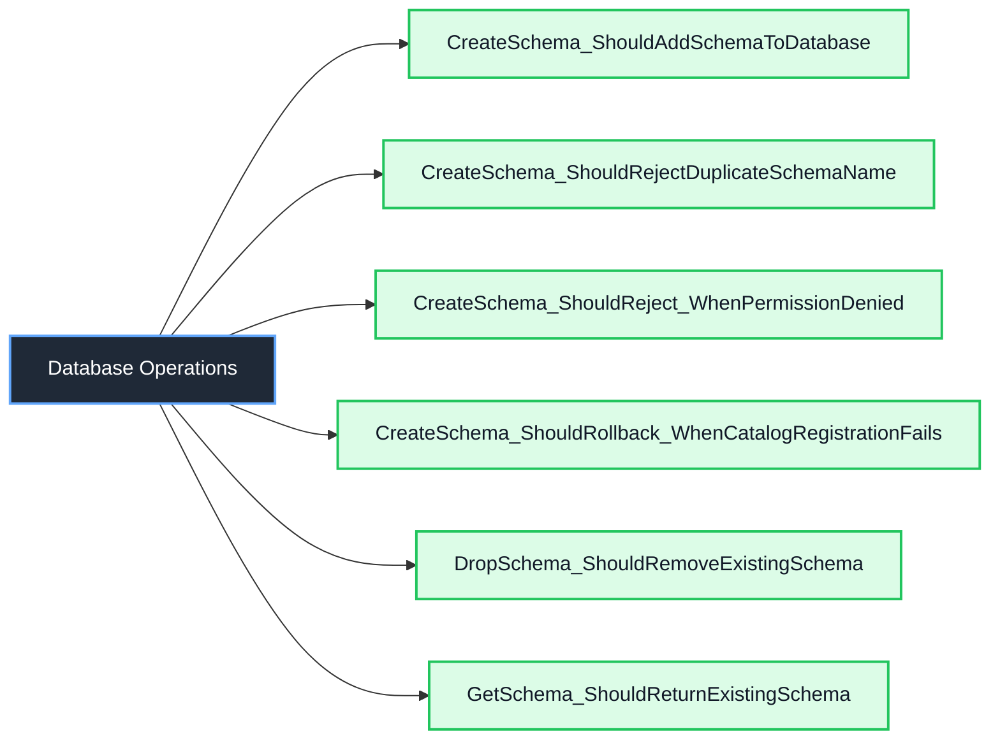
```mermaid
flowchart LR
    ClassNode["Database Operations"]

    ClassNode --> Database_Operations_1["CreateSchema_ShouldAddSchemaToDatabase"]
    ClassNode --> Database_Operations_2["CreateSchema_ShouldRejectDuplicateSchemaName"]
    ClassNode --> Database_Operations_3["CreateSchema_ShouldReject_WhenPermissionDenied"]
    ClassNode --> Database_Operations_4["CreateSchema_ShouldRollback_WhenCatalogRegistrationFails"]
    ClassNode --> Database_Operations_5["DropSchema_ShouldRemoveExistingSchema"]
    ClassNode --> Database_Operations_6["GetSchema_ShouldReturnExistingSchema"]

    classDef classNode fill:#1f2937,stroke:#60a5fa,color:#ffffff,stroke-width:2px
    classDef completedTest fill:#dcfce7,stroke:#22c55e,color:#111827,stroke-width:2px
    classDef missingTest fill:#fee2e2,stroke:#ef4444,color:#111827,stroke-width:2px,stroke-dasharray:5 5

    class ClassNode classNode
    class Database_Operations_1,Database_Operations_2,Database_Operations_3,Database_Operations_4,Database_Operations_5,Database_Operations_6 completedTest
```

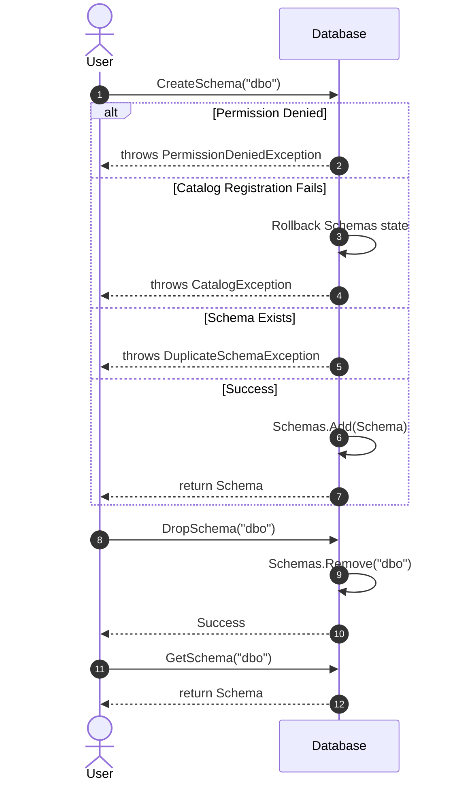
```mermaid
sequenceDiagram
    autonumber
    actor User
    participant DB as Database
    
    %% Create Schema
    User->>DB: CreateSchema("dbo")
    alt Permission Denied
        DB-->>User: throws PermissionDeniedException
    else Catalog Registration Fails
        DB->>DB: Rollback Schemas state
        DB-->>User: throws CatalogException
    else Schema Exists
        DB-->>User: throws DuplicateSchemaException
    else Success
        DB->>DB: Schemas.Add(Schema)
        DB-->>User: return Schema
    end
    
    %% Drop Schema
    User->>DB: DropSchema("dbo")
    DB->>DB: Schemas.Remove("dbo")
    DB-->>User: Success

    %% Get Schema
    User->>DB: GetSchema("dbo")
    DB-->>User: return Schema
```

### Schema & Table Operations
Covers: `AddTable_ShouldAddTableSuccessfully`, `AddTable_ShouldRejectDuplicateTableName`, `DropTable_ShouldRemoveExistingTable`, `DropTable_ShouldReject_WhenReferencedByForeignKey`, `GetTable_ShouldReturnTable_WhenExists`, `AddColumn_ShouldAddColumnSuccessfully`, `AddColumn_ShouldRejectDuplicateColumnName`, `DropColumn_ShouldReject_WhenReferencedByConstraint`, `AddConstraint_ShouldRegisterConstraint`, `AddIndex_ShouldRegisterIndex`
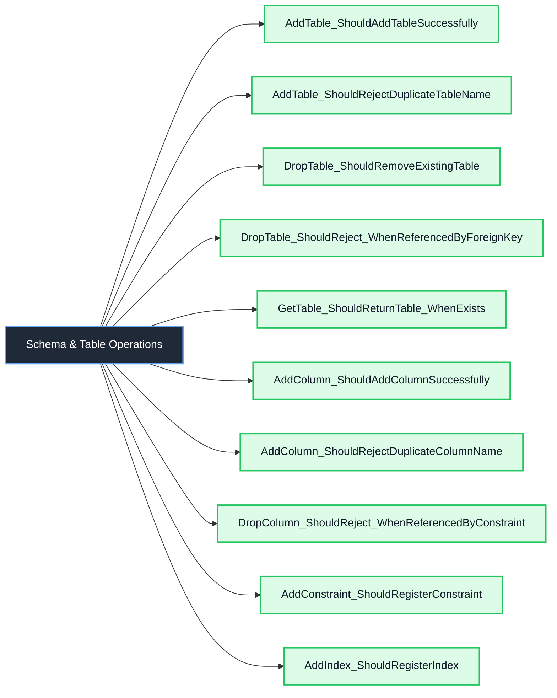
```mermaid
flowchart LR
    ClassNode["Schema & Table Operations"]

    ClassNode --> Schema___Table_Operations_1["AddTable_ShouldAddTableSuccessfully"]
    ClassNode --> Schema___Table_Operations_2["AddTable_ShouldRejectDuplicateTableName"]
    ClassNode --> Schema___Table_Operations_3["DropTable_ShouldRemoveExistingTable"]
    ClassNode --> Schema___Table_Operations_4["DropTable_ShouldReject_WhenReferencedByForeignKey"]
    ClassNode --> Schema___Table_Operations_5["GetTable_ShouldReturnTable_WhenExists"]
    ClassNode --> Schema___Table_Operations_6["AddColumn_ShouldAddColumnSuccessfully"]
    ClassNode --> Schema___Table_Operations_7["AddColumn_ShouldRejectDuplicateColumnName"]
    ClassNode --> Schema___Table_Operations_8["DropColumn_ShouldReject_WhenReferencedByConstraint"]
    ClassNode --> Schema___Table_Operations_9["AddConstraint_ShouldRegisterConstraint"]
    ClassNode --> Schema___Table_Operations_10["AddIndex_ShouldRegisterIndex"]

    classDef classNode fill:#1f2937,stroke:#60a5fa,color:#ffffff,stroke-width:2px
    classDef completedTest fill:#dcfce7,stroke:#22c55e,color:#111827,stroke-width:2px
    classDef missingTest fill:#fee2e2,stroke:#ef4444,color:#111827,stroke-width:2px,stroke-dasharray:5 5

    class ClassNode classNode
    class Schema___Table_Operations_1,Schema___Table_Operations_2,Schema___Table_Operations_3,Schema___Table_Operations_4,Schema___Table_Operations_5,Schema___Table_Operations_6,Schema___Table_Operations_7,Schema___Table_Operations_8,Schema___Table_Operations_9,Schema___Table_Operations_10 completedTest
```

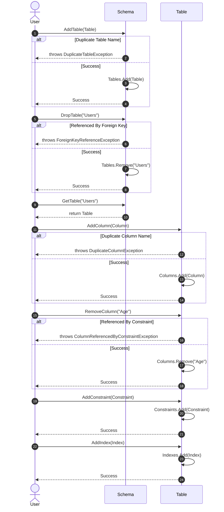
```mermaid
sequenceDiagram
    autonumber
    actor User
    participant Sch as Schema
    participant Tbl as Table
    
    %% Schema Operations (Table Management)
    User->>Sch: AddTable(Table)
    alt Duplicate Table Name
        Sch-->>User: throws DuplicateTableException
    else Success
        Sch->>Sch: Tables.Add(Table)
        Sch-->>User: Success
    end
    
    User->>Sch: DropTable("Users")
    alt Referenced By Foreign Key
        Sch-->>User: throws ForeignKeyReferenceException
    else Success
        Sch->>Sch: Tables.Remove("Users")
        Sch-->>User: Success
    end
    
    User->>Sch: GetTable("Users")
    Sch-->>User: return Table
    
    %% Table Operations (Column & Constraint Management)
    User->>Tbl: AddColumn(Column)
    alt Duplicate Column Name
        Tbl-->>User: throws DuplicateColumnException
    else Success
        Tbl->>Tbl: Columns.Add(Column)
        Tbl-->>User: Success
    end
    
    User->>Tbl: RemoveColumn("Age")
    alt Referenced By Constraint
        Tbl-->>User: throws ColumnReferencedByConstraintException
    else Success
        Tbl->>Tbl: Columns.Remove("Age")
        Tbl-->>User: Success
    end
    
    User->>Tbl: AddConstraint(Constraint)
    Tbl->>Tbl: Constraints.Add(Constraint)
    Tbl-->>User: Success
    
    User->>Tbl: AddIndex(Index)
    Tbl->>Tbl: Indexes.Add(Index)
    Tbl-->>User: Success
```

## Constraint & Index

### Primary Key Constraints
Covers: `PrimaryKey_ShouldRejectNullValues`, `PrimaryKey_ShouldRejectDuplicateValues`, `PrimaryKey_ShouldAcceptUniqueValues`
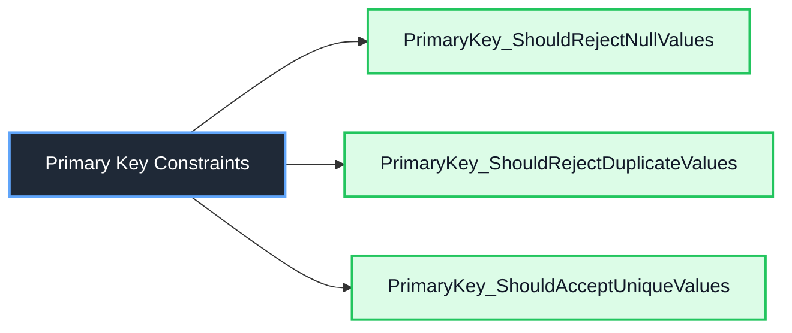
```mermaid
flowchart LR
    ClassNode["Primary Key Constraints"]

    ClassNode --> Primary_Key_Constraints_1["PrimaryKey_ShouldRejectNullValues"]
    ClassNode --> Primary_Key_Constraints_2["PrimaryKey_ShouldRejectDuplicateValues"]
    ClassNode --> Primary_Key_Constraints_3["PrimaryKey_ShouldAcceptUniqueValues"]

    classDef classNode fill:#1f2937,stroke:#60a5fa,color:#ffffff,stroke-width:2px
    classDef completedTest fill:#dcfce7,stroke:#22c55e,color:#111827,stroke-width:2px
    classDef missingTest fill:#fee2e2,stroke:#ef4444,color:#111827,stroke-width:2px,stroke-dasharray:5 5

    class ClassNode classNode
    class Primary_Key_Constraints_1,Primary_Key_Constraints_2,Primary_Key_Constraints_3 completedTest
```

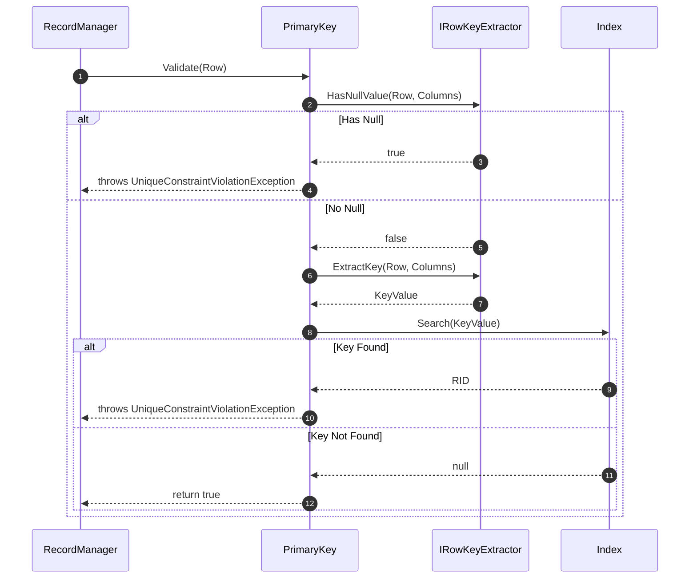
```mermaid
sequenceDiagram
    autonumber
    participant RecordMgr as RecordManager
    participant Constr as PrimaryKey
    participant Extractor as IRowKeyExtractor
    participant Idx as Index
    
    RecordMgr->>Constr: Validate(Row)
    Constr->>Extractor: HasNullValue(Row, Columns)
    alt Has Null
        Extractor-->>Constr: true
        Constr-->>RecordMgr: throws UniqueConstraintViolationException
    else No Null
        Extractor-->>Constr: false
        Constr->>Extractor: ExtractKey(Row, Columns)
        Extractor-->>Constr: KeyValue
        Constr->>Idx: Search(KeyValue)
        alt Key Found
            Idx-->>Constr: RID
            Constr-->>RecordMgr: throws UniqueConstraintViolationException
        else Key Not Found
            Idx-->>Constr: null
            Constr-->>RecordMgr: return true
        end
    end
```

### Unique Constraints
Covers: `UniqueConstraint_ShouldAllowNullValues`, `UniqueConstraint_ShouldRejectDuplicateValues`, `UniqueConstraint_ShouldAcceptUniqueValues`
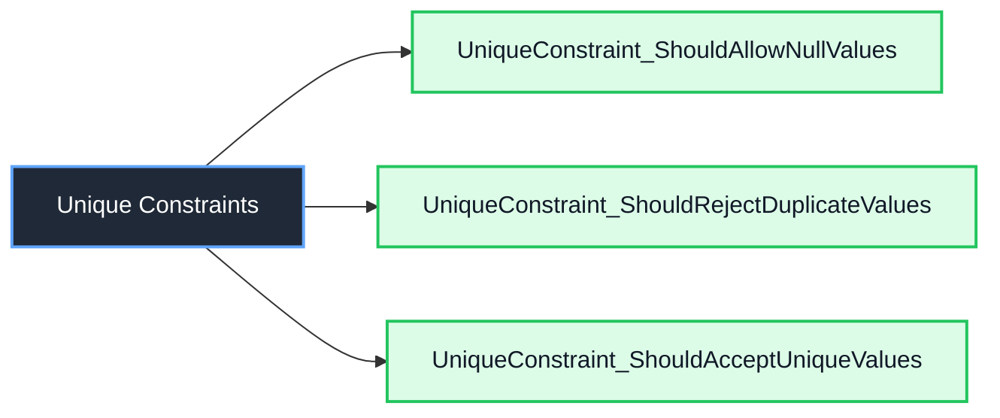
```mermaid
flowchart LR
    ClassNode["Unique Constraints"]

    ClassNode --> Unique_Constraints_1["UniqueConstraint_ShouldAllowNullValues"]
    ClassNode --> Unique_Constraints_2["UniqueConstraint_ShouldRejectDuplicateValues"]
    ClassNode --> Unique_Constraints_3["UniqueConstraint_ShouldAcceptUniqueValues"]

    classDef classNode fill:#1f2937,stroke:#60a5fa,color:#ffffff,stroke-width:2px
    classDef completedTest fill:#dcfce7,stroke:#22c55e,color:#111827,stroke-width:2px
    classDef missingTest fill:#fee2e2,stroke:#ef4444,color:#111827,stroke-width:2px,stroke-dasharray:5 5

    class ClassNode classNode
    class Unique_Constraints_1,Unique_Constraints_2,Unique_Constraints_3 completedTest
```

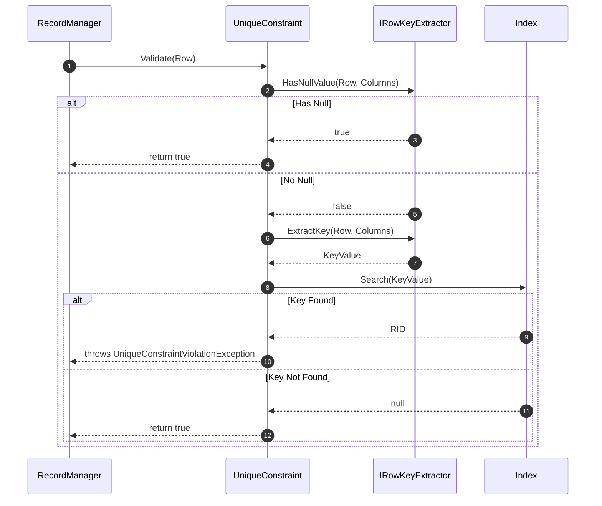
```mermaid
sequenceDiagram
    autonumber
    participant RecordMgr as RecordManager
    participant Constr as UniqueConstraint
    participant Extractor as IRowKeyExtractor
    participant Idx as Index
    
    RecordMgr->>Constr: Validate(Row)
    Constr->>Extractor: HasNullValue(Row, Columns)
    alt Has Null
        Extractor-->>Constr: true
        Constr-->>RecordMgr: return true
    else No Null
        Extractor-->>Constr: false
        Constr->>Extractor: ExtractKey(Row, Columns)
        Extractor-->>Constr: KeyValue
        Constr->>Idx: Search(KeyValue)
        alt Key Found
            Idx-->>Constr: RID
            Constr-->>RecordMgr: throws UniqueConstraintViolationException
        else Key Not Found
            Idx-->>Constr: null
            Constr-->>RecordMgr: return true
        end
    end
```

### Foreign Key Constraints
Covers: `ForeignKey_ShouldAcceptExistingReference`, `ForeignKey_ShouldRejectMissingReference`, `ForeignKey_ShouldTriggerCascadeDelete`, `ForeignKey_ShouldTriggerCascadeUpdate`, `ForeignKey_ShouldTriggerSetNullOnDelete`
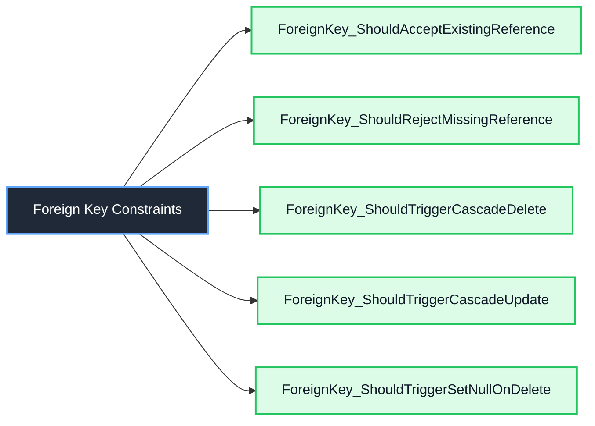
```mermaid
flowchart LR
    ClassNode["Foreign Key Constraints"]

    ClassNode --> Foreign_Key_Constraints_1["ForeignKey_ShouldAcceptExistingReference"]
    ClassNode --> Foreign_Key_Constraints_2["ForeignKey_ShouldRejectMissingReference"]
    ClassNode --> Foreign_Key_Constraints_3["ForeignKey_ShouldTriggerCascadeDelete"]
    ClassNode --> Foreign_Key_Constraints_4["ForeignKey_ShouldTriggerCascadeUpdate"]
    ClassNode --> Foreign_Key_Constraints_5["ForeignKey_ShouldTriggerSetNullOnDelete"]

    classDef classNode fill:#1f2937,stroke:#60a5fa,color:#ffffff,stroke-width:2px
    classDef completedTest fill:#dcfce7,stroke:#22c55e,color:#111827,stroke-width:2px
    classDef missingTest fill:#fee2e2,stroke:#ef4444,color:#111827,stroke-width:2px,stroke-dasharray:5 5

    class ClassNode classNode
    class Foreign_Key_Constraints_1,Foreign_Key_Constraints_2,Foreign_Key_Constraints_3,Foreign_Key_Constraints_4,Foreign_Key_Constraints_5 completedTest
```

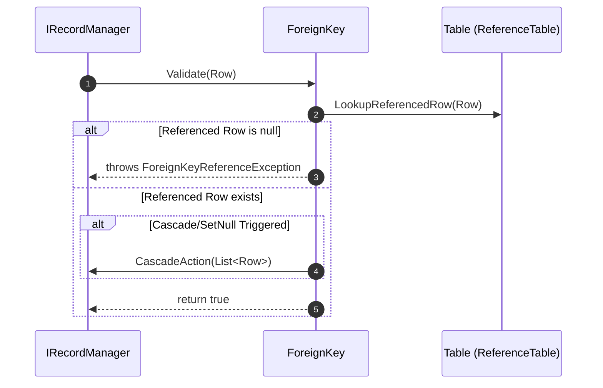
```mermaid
sequenceDiagram
    autonumber
    participant RecordMgr as IRecordManager
    participant Constr as ForeignKey
    participant RefTbl as Table (ReferenceTable)
    
    RecordMgr->>Constr: Validate(Row)
    Constr->>RefTbl: LookupReferencedRow(Row)
    alt Referenced Row is null
        Constr-->>RecordMgr: throws ForeignKeyReferenceException
    else Referenced Row exists
        alt Cascade/SetNull Triggered
            Constr->>RecordMgr: CascadeAction(List<Row>)
        end
        Constr-->>RecordMgr: return true
    end
```

### Check Constraints
Covers: `CheckConstraint_ShouldRejectInvalidExpression`, `CheckConstraint_ShouldEvaluateExpressionTrue`, `CheckConstraint_ShouldRejectWhenExpressionFalse`, `CheckConstraint_ShouldHandleNullValues`
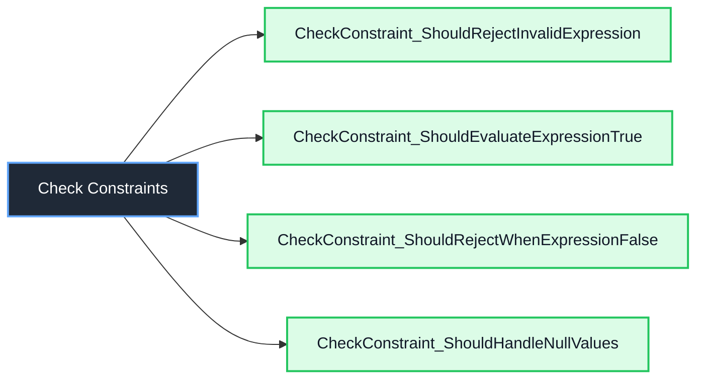
```mermaid
flowchart LR
    ClassNode["Check Constraints"]

    ClassNode --> Check_Constraints_1["CheckConstraint_ShouldRejectInvalidExpression"]
    ClassNode --> Check_Constraints_2["CheckConstraint_ShouldEvaluateExpressionTrue"]
    ClassNode --> Check_Constraints_3["CheckConstraint_ShouldRejectWhenExpressionFalse"]
    ClassNode --> Check_Constraints_4["CheckConstraint_ShouldHandleNullValues"]

    classDef classNode fill:#1f2937,stroke:#60a5fa,color:#ffffff,stroke-width:2px
    classDef completedTest fill:#dcfce7,stroke:#22c55e,color:#111827,stroke-width:2px
    classDef missingTest fill:#fee2e2,stroke:#ef4444,color:#111827,stroke-width:2px,stroke-dasharray:5 5

    class ClassNode classNode
    class Check_Constraints_1,Check_Constraints_2,Check_Constraints_3,Check_Constraints_4 completedTest
```

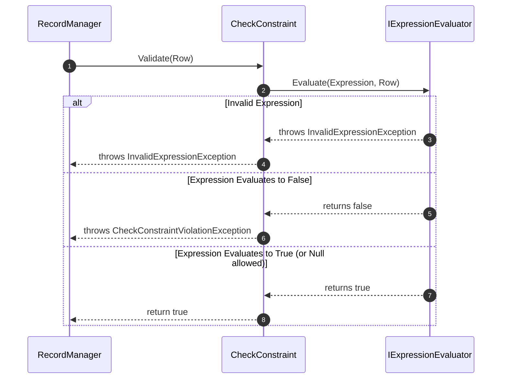
```mermaid
sequenceDiagram
    autonumber
    participant RecordMgr as RecordManager
    participant Constr as CheckConstraint
    participant Eval as IExpressionEvaluator
    
    RecordMgr->>Constr: Validate(Row)
    Constr->>Eval: Evaluate(Expression, Row)
    alt Invalid Expression
        Eval-->>Constr: throws InvalidExpressionException
        Constr-->>RecordMgr: throws InvalidExpressionException
    else Expression Evaluates to False
        Eval-->>Constr: returns false
        Constr-->>RecordMgr: throws CheckConstraintViolationException
    else Expression Evaluates to True (or Null allowed)
        Eval-->>Constr: returns true
        Constr-->>RecordMgr: return true
    end
```

### Index & IndexManager
Covers: `Insert_ShouldKeepTreeBalanced`, `Search_ShouldFindExistingKey`, `Delete_ShouldRebalanceTreeAfterDeletion`, `CreateIndex_ShouldRegisterIndex`, `CreateIndex_ShouldRejectDuplicateIndexName`, `FindBestIndex_ShouldReturnOptimalIndexForQuery`, `Insert_ShouldSplitNode_WhenNodeIsFull`, `Delete_ShouldMergeNode_WhenNodeIsUnderflow`
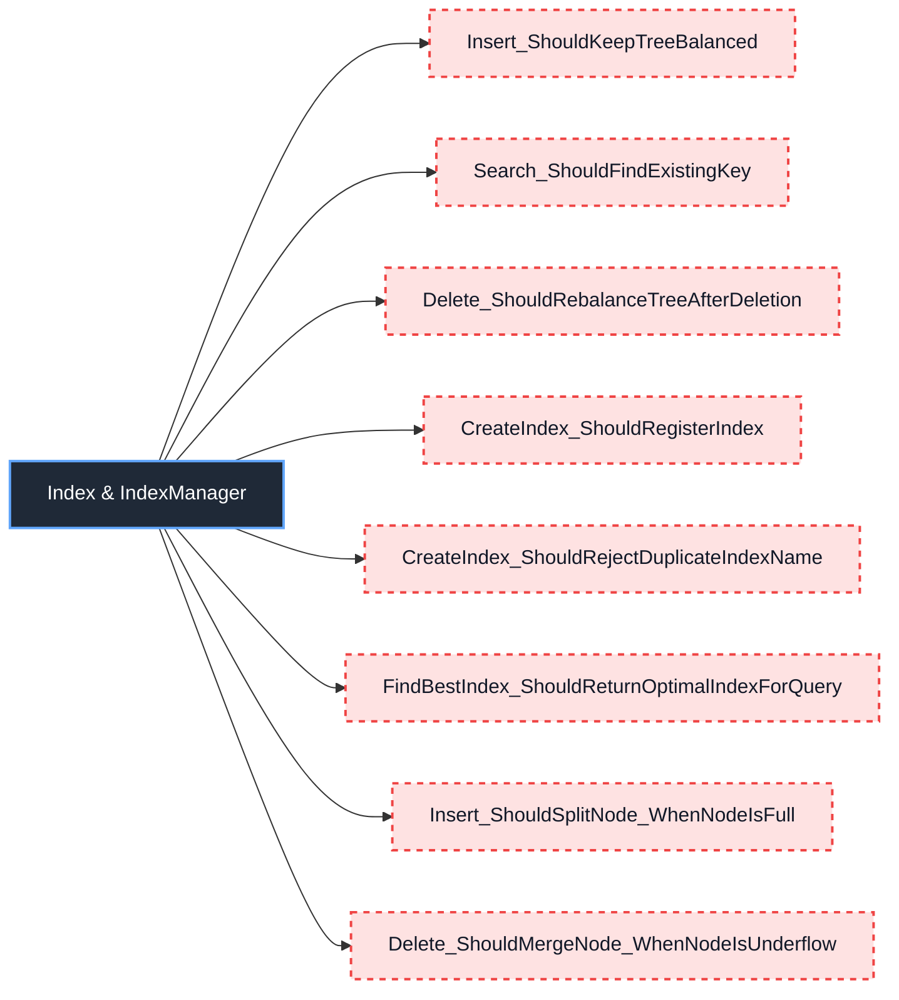
```mermaid
flowchart LR
    ClassNode["Index & IndexManager"]

    ClassNode --> Index___IndexManager_1["Insert_ShouldKeepTreeBalanced"]
    ClassNode --> Index___IndexManager_2["Search_ShouldFindExistingKey"]
    ClassNode --> Index___IndexManager_3["Delete_ShouldRebalanceTreeAfterDeletion"]
    ClassNode --> Index___IndexManager_4["CreateIndex_ShouldRegisterIndex"]
    ClassNode --> Index___IndexManager_5["CreateIndex_ShouldRejectDuplicateIndexName"]
    ClassNode --> Index___IndexManager_6["FindBestIndex_ShouldReturnOptimalIndexForQuery"]
    ClassNode --> Index___IndexManager_7["Insert_ShouldSplitNode_WhenNodeIsFull"]
    ClassNode --> Index___IndexManager_8["Delete_ShouldMergeNode_WhenNodeIsUnderflow"]

    classDef classNode fill:#1f2937,stroke:#60a5fa,color:#ffffff,stroke-width:2px
    classDef completedTest fill:#dcfce7,stroke:#22c55e,color:#111827,stroke-width:2px
    classDef missingTest fill:#fee2e2,stroke:#ef4444,color:#111827,stroke-width:2px,stroke-dasharray:5 5

    class ClassNode classNode
    class Index___IndexManager_1,Index___IndexManager_2,Index___IndexManager_3,Index___IndexManager_4,Index___IndexManager_5,Index___IndexManager_6,Index___IndexManager_7,Index___IndexManager_8 missingTest
```

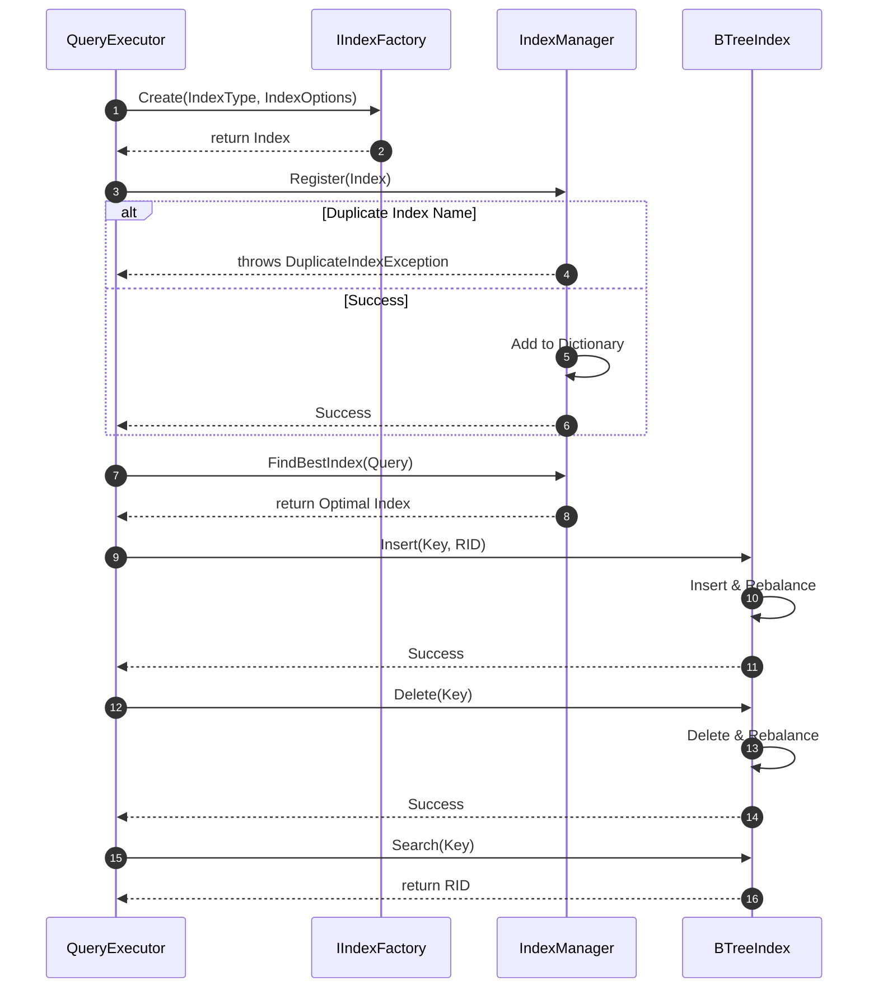
```mermaid
sequenceDiagram
    autonumber
    participant Engine as QueryExecutor
    participant IdxFct as IIndexFactory
    participant IdxMgr as IndexManager
    participant BTree as BTreeIndex
    
    %% Register Index
    Engine->>IdxFct: Create(IndexType, IndexOptions)
    IdxFct-->>Engine: return Index
    Engine->>IdxMgr: Register(Index)
    alt Duplicate Index Name
        IdxMgr-->>Engine: throws DuplicateIndexException
    else Success
        IdxMgr->>IdxMgr: Add to Dictionary
        IdxMgr-->>Engine: Success
    end
    
    %% Find Best Index
    Engine->>IdxMgr: FindBestIndex(Query)
    IdxMgr-->>Engine: return Optimal Index
    
    %% Insert/Delete/Search Key
    Engine->>BTree: Insert(Key, RID)
    BTree->>BTree: Insert & Rebalance
    BTree-->>Engine: Success
    
    Engine->>BTree: Delete(Key)
    BTree->>BTree: Delete & Rebalance
    BTree-->>Engine: Success
    
    Engine->>BTree: Search(Key)
    BTree-->>Engine: return RID
```

## Domain Services

### Schema & Table Services
Covers: `CreateSchema_ShouldCreateSchemaSuccessfully`, `CreateSchema_ShouldRejectDuplicateSchemaName`, `CreateSchema_ShouldCheckPermissionBeforeCreation`, `CreateSchema_ShouldRollback_WhenStorageFails`, `CreateSchema_ShouldRollback_WhenCatalogFails`, `DropSchema_ShouldRemoveExistingSchema`, `CreateTable_ShouldCreateTableSuccessfully`, `CreateTable_ShouldRejectDuplicateTableName`, `DropTable_ShouldRemoveExistingTable`
```mermaid
flowchart LR
    ClassNode["Schema & Table Services"]

    ClassNode --> Schema___Table_Services_1["CreateSchema_ShouldCreateSchemaSuccessfully"]
    ClassNode --> Schema___Table_Services_2["CreateSchema_ShouldRejectDuplicateSchemaName"]
    ClassNode --> Schema___Table_Services_3["CreateSchema_ShouldCheckPermissionBeforeCreation"]
    ClassNode --> Schema___Table_Services_4["CreateSchema_ShouldRollback_WhenStorageFails"]
    ClassNode --> Schema___Table_Services_5["CreateSchema_ShouldRollback_WhenCatalogFails"]
    ClassNode --> Schema___Table_Services_6["DropSchema_ShouldRemoveExistingSchema"]
    ClassNode --> Schema___Table_Services_7["CreateTable_ShouldCreateTableSuccessfully"]
    ClassNode --> Schema___Table_Services_8["CreateTable_ShouldRejectDuplicateTableName"]
    ClassNode --> Schema___Table_Services_9["DropTable_ShouldRemoveExistingTable"]

    classDef classNode fill:#1f2937,stroke:#60a5fa,color:#ffffff,stroke-width:2px
    classDef completedTest fill:#dcfce7,stroke:#22c55e,color:#111827,stroke-width:2px
    classDef missingTest fill:#fee2e2,stroke:#ef4444,color:#111827,stroke-width:2px,stroke-dasharray:5 5

    class ClassNode classNode
    class Schema___Table_Services_2,Schema___Table_Services_6,Schema___Table_Services_9 completedTest
    class Schema___Table_Services_1,Schema___Table_Services_3,Schema___Table_Services_4,Schema___Table_Services_5,Schema___Table_Services_7,Schema___Table_Services_8 missingTest
```

```mermaid
sequenceDiagram
    autonumber
    actor Client
    participant Svc as SchemaService / TableService
    participant CatMgr as CatalogManager
    participant Storage as StorageEngine
    participant Builder as ITableBuilder
    
    %% Create Schema
    Client->>Svc: CreateSchema(Name)
    Svc->>Svc: CheckPermission()
    alt Permission Denied
        Svc-->>Client: throws PermissionDeniedException
    else Duplicate Schema
        Svc-->>Client: throws DuplicateSchemaException
    else
        Svc->>CatMgr: RegisterSchema()
        Svc->>Storage: AllocateStorage()
        alt Storage/Catalog Fails
            Svc->>Svc: Rollback()
            Svc-->>Client: throws Exception
        else Success
            Svc-->>Client: return Schema
        end
    end
    
    %% Drop Schema
    Client->>Svc: DropSchema(Name)
    Svc->>CatMgr: RemoveSchema()
    Svc-->>Client: Success

    %% Create Table
    Client->>Svc: CreateTable(Schema, TableDef)
    Svc->>Builder: Reset(TableDef.Name)
    loop For each Column
        Svc->>Builder: AddColumn(col)
    end
    loop For each Constraint
        Svc->>Builder: AddConstraint(constraint)
    end
    Svc->>Builder: Build()
    Builder-->>Svc: return Table
    
    alt Duplicate Table Name
        Svc-->>Client: throws DuplicateTableException
    else
        Svc->>CatMgr: RegisterTable()
        Svc->>Storage: AllocateStorage()
        Svc-->>Client: return Table
    end
    
    %% Drop Table
    Client->>Svc: DropTable(Schema, TableName)
    Svc->>CatMgr: RemoveTable()
    Svc-->>Client: Success
```

### RecordManager
Covers: `InsertRecord_ShouldValidateConstraintsBeforeInsert`, `InsertRecord_ShouldUpdateIndexes`, `InsertRecord_ShouldRollback_WhenConstraintValidationFails`, `UpdateRecord_ShouldValidateConstraints`, `UpdateRecord_ShouldRollback_WhenIndexUpdateFails`, `DeleteRecord_ShouldValidateForeignKeyConstraints`, `DeleteRecord_ShouldRollback_WhenForeignKeyValidationFails`
```mermaid
flowchart LR
    ClassNode["RecordManager"]

    ClassNode --> RecordManager_1["InsertRecord_ShouldValidateConstraintsBeforeInsert"]
    ClassNode --> RecordManager_2["InsertRecord_ShouldUpdateIndexes"]
    ClassNode --> RecordManager_3["InsertRecord_ShouldRollback_WhenConstraintValidationFails"]
    ClassNode --> RecordManager_4["UpdateRecord_ShouldValidateConstraints"]
    ClassNode --> RecordManager_5["UpdateRecord_ShouldRollback_WhenIndexUpdateFails"]
    ClassNode --> RecordManager_6["DeleteRecord_ShouldValidateForeignKeyConstraints"]
    ClassNode --> RecordManager_7["DeleteRecord_ShouldRollback_WhenForeignKeyValidationFails"]

    classDef classNode fill:#1f2937,stroke:#60a5fa,color:#ffffff,stroke-width:2px
    classDef completedTest fill:#dcfce7,stroke:#22c55e,color:#111827,stroke-width:2px
    classDef missingTest fill:#fee2e2,stroke:#ef4444,color:#111827,stroke-width:2px,stroke-dasharray:5 5

    class ClassNode classNode
    class RecordManager_1,RecordManager_2,RecordManager_3,RecordManager_4,RecordManager_5,RecordManager_6,RecordManager_7 missingTest
```

```mermaid
sequenceDiagram
    autonumber
    participant Client
    participant RecMgr as RecordManager
    participant Tbl as Table
    participant Constr as Constraint
    participant Idx as Index
    
    %% Insert/Update Record
    Client->>RecMgr: Insert/Update Record(Table, Row)
    RecMgr->>Constr: Validate(Row)
    alt Constraint Validation Fails
        RecMgr->>RecMgr: Rollback()
        RecMgr-->>Client: throws ConstraintViolationException
    else
        RecMgr->>Tbl: Insert/Update Row Data
        RecMgr->>Idx: UpdateIndexes(Row)
        alt Index Update Fails
            RecMgr->>RecMgr: Rollback()
            RecMgr-->>Client: throws IndexUpdateException
        else
            RecMgr-->>Client: Success
        end
    end
    
    %% Delete Record
    Client->>RecMgr: DeleteRecord(Table, RID)
    RecMgr->>Constr: ValidateForeignKeyConstraints(RID)
    alt Foreign Key Validation Fails
        RecMgr->>RecMgr: Rollback()
        RecMgr-->>Client: throws ForeignKeyReferenceException
    else
        RecMgr->>Tbl: Delete Row Data
        RecMgr->>Idx: UpdateIndexes()
        RecMgr-->>Client: Success
    end
```

---

## 3. Storage Engine

```mermaid
classDiagram
direction LR
class StorageEngine {
    +ReadPage(id : PageId) Byte[]
    +WritePage(id : PageId, data : Byte[])
    +AllocatePage(tableId : int) PageId
}
class BufferPool {
    -frames : Page[]
    -policy : ReplacementPolicy
    +FetchPage(id : PageId) Page
    +UnpinPage(id : PageId)
    +FlushPage(id : PageId)
    +MarkDirty(id : PageId)
    +EvictPage() Page
}
class Page {
    +PageId : int
    +Data : Byte[]
    +IsDirty : bool
    +PinCount : int
    +InsertRecord(record : Byte[])
    +DeleteRecord(rid : RID)
    +Compact()
}
note for Page "InsertRecord() throws\nPageFullException if full"
class FileManager {
    -dataDir : string
    +Read(pageId : PageId) Byte[]
    +Write(pageId : PageId, data : Byte[])
    +AllocateFile(path : string) int
}
class WALManager {
    +WriteLog(record : LogRecord) long
    +Recover()
}
class RecoveryManager {
    +Recover(checkpoint : long)
}
StorageEngine --> BufferPool
StorageEngine --> FileManager
BufferPool --> Page
RecoveryManager --> WALManager
```

### BufferPool Operations
Covers: `FetchPage_ShouldLoadPageIntoBuffer`, `FetchPage_ShouldReturnCachedPage_WhenAlreadyLoaded`, `FlushPage_ShouldWriteDirtyPageToDisk`, `FlushDirtyPage_ShouldWriteWALBeforeDisk`, `EvictPage_ShouldUseReplacementPolicy`, `EvictPage_ShouldNotEvictPinnedPage`, `FetchPage_ShouldPinPageWhileInUse`, `UnpinPage_ShouldDecreasePinCount`, `FlushAll_ShouldSyncAllDirtyPagesToDisk`
```mermaid
flowchart LR
    ClassNode["BufferPool Operations"]

    ClassNode --> BufferPool_Operations_1["FetchPage_ShouldLoadPageIntoBuffer"]
    ClassNode --> BufferPool_Operations_2["FetchPage_ShouldReturnCachedPage_WhenAlreadyLoaded"]
    ClassNode --> BufferPool_Operations_3["FlushPage_ShouldWriteDirtyPageToDisk"]
    ClassNode --> BufferPool_Operations_4["FlushDirtyPage_ShouldWriteWALBeforeDisk"]
    ClassNode --> BufferPool_Operations_5["EvictPage_ShouldUseReplacementPolicy"]
    ClassNode --> BufferPool_Operations_6["EvictPage_ShouldNotEvictPinnedPage"]
    ClassNode --> BufferPool_Operations_7["FetchPage_ShouldPinPageWhileInUse"]
    ClassNode --> BufferPool_Operations_8["UnpinPage_ShouldDecreasePinCount"]
    ClassNode --> BufferPool_Operations_9["FlushAll_ShouldSyncAllDirtyPagesToDisk"]

    classDef classNode fill:#1f2937,stroke:#60a5fa,color:#ffffff,stroke-width:2px
    classDef completedTest fill:#dcfce7,stroke:#22c55e,color:#111827,stroke-width:2px
    classDef missingTest fill:#fee2e2,stroke:#ef4444,color:#111827,stroke-width:2px,stroke-dasharray:5 5

    class ClassNode classNode
    class BufferPool_Operations_1,BufferPool_Operations_2,BufferPool_Operations_3,BufferPool_Operations_4,BufferPool_Operations_5,BufferPool_Operations_6,BufferPool_Operations_7,BufferPool_Operations_8,BufferPool_Operations_9 missingTest
```

```mermaid
sequenceDiagram
    autonumber
    participant System
    participant Buffer as BufferPool
    participant WAL as WALManager
    participant Disk as FileManager
    
    %% Fetch Page
    System->>Buffer: FetchPage(PageId)
    alt Page in Cache
        Buffer-->>System: return Cached Page
    else Page not in Cache
        alt Buffer is Full
            Buffer->>Buffer: EvictPage()
            alt Page is Pinned
                Buffer->>Buffer: Skip (Should Not Evict Pinned Page)
            else Use Replacement Policy
                Buffer->>Buffer: Select Victim Page
            end
        end
        Buffer->>Disk: Read(PageId)
        Disk-->>Buffer: Page Data
        Buffer-->>System: return Page
    end
    
    %% Flush Page
    System->>Buffer: FlushPage(PageId)
    alt Page is Dirty
        Buffer->>WAL: WriteWALBeforeDisk()
        Buffer->>Disk: Write(PageId, data)
        Buffer->>Buffer: IsDirty = false
    end
    Buffer-->>System: Success
```

### Page & FileManager
Covers: `InsertRecord_ShouldReject_WhenPageIsFull`, `DeleteRecord_ShouldRemoveRecord`, `Compact_ShouldReclaimFreeSpace`, `ReadPage_ShouldReturnRequestedPage`, `WritePage_ShouldPersistPageData`, `AllocatePage_ShouldExtendFile_WhenNoFreePagesExist`, `DeleteRecord_ShouldUpdateFreeSpaceCorrectly`
```mermaid
flowchart LR
    ClassNode["Page & FileManager"]

    ClassNode --> Page___FileManager_1["InsertRecord_ShouldReject_WhenPageIsFull"]
    ClassNode --> Page___FileManager_2["DeleteRecord_ShouldRemoveRecord"]
    ClassNode --> Page___FileManager_3["Compact_ShouldReclaimFreeSpace"]
    ClassNode --> Page___FileManager_4["ReadPage_ShouldReturnRequestedPage"]
    ClassNode --> Page___FileManager_5["WritePage_ShouldPersistPageData"]
    ClassNode --> Page___FileManager_6["AllocatePage_ShouldExtendFile_WhenNoFreePagesExist"]
    ClassNode --> Page___FileManager_7["DeleteRecord_ShouldUpdateFreeSpaceCorrectly"]

    classDef classNode fill:#1f2937,stroke:#60a5fa,color:#ffffff,stroke-width:2px
    classDef completedTest fill:#dcfce7,stroke:#22c55e,color:#111827,stroke-width:2px
    classDef missingTest fill:#fee2e2,stroke:#ef4444,color:#111827,stroke-width:2px,stroke-dasharray:5 5

    class ClassNode classNode
    class Page___FileManager_1,Page___FileManager_2,Page___FileManager_3,Page___FileManager_4,Page___FileManager_5,Page___FileManager_6,Page___FileManager_7 missingTest
```

```mermaid
sequenceDiagram
    autonumber
    participant Storage as StorageEngine
    participant Pg as Page
    participant Disk as FileManager
    
    %% Insert Record
    Storage->>Pg: InsertRecord(record)
    alt FreeSpace < record.Length
        Pg-->>Storage: throws PageFullException
    else
        Pg->>Pg: Add record to Data
        Pg-->>Storage: Success (RID)
    end
    
    %% Delete Record
    Storage->>Pg: DeleteRecord(RID)
    Pg->>Pg: Remove record
    Pg-->>Storage: Success
    
    %% Compact
    Storage->>Pg: Compact()
    Pg->>Pg: Reclaim Free Space (shift bytes)
    Pg-->>Storage: Success
    
    %% Read/Write Page
    Storage->>Disk: ReadPage(PageId)
    Disk-->>Storage: return Page Data
    
    Storage->>Disk: WritePage(PageId, data)
    Disk-->>Storage: Success
```

### Logging & Recovery
Covers: `WriteLog_ShouldAssignIncreasingLSN`, `Recover_ShouldReplayCommittedTransactions`, `Recover_ShouldUndoUncommittedTransactions`, `Recover_ShouldRestoreConsistentDatabase`, `Recover_ShouldHandleCorruptWALRecord`, `Truncate_ShouldRemoveLogsBeforeCheckpoint`, `Checkpoint_ShouldRecordActiveTransactions`, `Checkpoint_ShouldFlushDirtyPages`
```mermaid
flowchart LR
    ClassNode["Logging & Recovery"]

    ClassNode --> Logging___Recovery_1["WriteLog_ShouldAssignIncreasingLSN"]
    ClassNode --> Logging___Recovery_2["Recover_ShouldReplayCommittedTransactions"]
    ClassNode --> Logging___Recovery_3["Recover_ShouldUndoUncommittedTransactions"]
    ClassNode --> Logging___Recovery_4["Recover_ShouldRestoreConsistentDatabase"]
    ClassNode --> Logging___Recovery_5["Recover_ShouldHandleCorruptWALRecord"]
    ClassNode --> Logging___Recovery_6["Truncate_ShouldRemoveLogsBeforeCheckpoint"]
    ClassNode --> Logging___Recovery_7["Checkpoint_ShouldRecordActiveTransactions"]
    ClassNode --> Logging___Recovery_8["Checkpoint_ShouldFlushDirtyPages"]

    classDef classNode fill:#1f2937,stroke:#60a5fa,color:#ffffff,stroke-width:2px
    classDef completedTest fill:#dcfce7,stroke:#22c55e,color:#111827,stroke-width:2px
    classDef missingTest fill:#fee2e2,stroke:#ef4444,color:#111827,stroke-width:2px,stroke-dasharray:5 5

    class ClassNode classNode
    class Logging___Recovery_1,Logging___Recovery_2,Logging___Recovery_3,Logging___Recovery_4,Logging___Recovery_5,Logging___Recovery_6,Logging___Recovery_7,Logging___Recovery_8 missingTest
```

```mermaid
sequenceDiagram
    autonumber
    participant System
    participant RecMgr as RecoveryManager
    participant WAL as WALManager
    participant Storage as StorageEngine
    
    %% Write Log
    System->>WAL: WriteLog(LogRecord)
    WAL->>WAL: Assign LSN (Increment)
    WAL-->>System: return LSN
    
    %% Recovery
    System->>RecMgr: Recover()
    RecMgr->>WAL: Read Logs
    loop For each Log Record
        alt Committed Tx
            RecMgr->>Storage: ReplayWAL (Redo)
        else Uncommitted Tx
            RecMgr->>Storage: UndoUncommitted (Undo)
        end
    end
    RecMgr-->>System: Consistent Database Restored
```

---

## 4. Transaction

```mermaid
classDiagram
direction LR
class TransactionManager {
    -txTable : TransactionTable
    -lockMgr : LockManager
    -walMgr : WALManager
    -mvccMgr : MVCCManager
    +Begin() Transaction
    +Commit(txId : int)
    +Abort(txId : int)
    +Rollback(txId : int)
}
class Transaction {
    +TransactionId : int
    +Status : TxStatus
    +Begin()
    +Commit()
    +Rollback()
    +RollbackToSavepoint(name : string)
}
note for Transaction "Commit() throws\nWALWriteException if WAL fails"
class LockManager {
    -lockTable : Map~string, LockQueue~
    -detector : DeadlockDetector
    +AcquireLock(txId : int, resId : string, mode : LockMode)
    +ReleaseLock(txId : int, resId : string)
    +ReleaseAll(txId : int)
}
note for LockManager "AcquireLock() throws LockTimeoutException\nor DeadlockException on conflict"
class MVCCManager {
    +CreateVersion(rid : RID, txId : int, data : RecordData)
    +ReadVersion(rid : RID, snapshotId : long) Row
    +GarbageCollect(olderThan : long)
}
class WALManager {
    -buffer : LogBuffer
    +Append(record : LogRecord) long
    +Flush(upToLSN : long)
    +Truncate(beforeLSN : long)
}
TransactionManager --> Transaction
TransactionManager --> LockManager
TransactionManager --> MVCCManager
TransactionManager --> WALManager
```

### Transaction Lifecycle & TransactionManager
Covers: `Begin_ShouldCreateActiveTransaction`, `Commit_ShouldPersistChanges`, `Commit_ShouldWriteWALBeforePersistingData`, `Commit_ShouldFail_WhenWALWriteFails`, `Rollback_ShouldUndoAllChanges`, `Rollback_ShouldRestoreOriginalPageState`, `RollbackToSavepoint_ShouldRestorePreviousState`, `CommitTransaction_ShouldReleaseAllLocks`, `RollbackTransaction_ShouldReleaseAllLocks`, `DetectDeadlock_ShouldAbortTransactionWithLowestPriority`
```mermaid
flowchart LR
    ClassNode["Transaction Lifecycle & TransactionManager"]

    ClassNode --> Transaction_Lifecycle___TransactionManager_1["Begin_ShouldCreateActiveTransaction"]
    ClassNode --> Transaction_Lifecycle___TransactionManager_2["Commit_ShouldPersistChanges"]
    ClassNode --> Transaction_Lifecycle___TransactionManager_3["Commit_ShouldWriteWALBeforePersistingData"]
    ClassNode --> Transaction_Lifecycle___TransactionManager_4["Commit_ShouldFail_WhenWALWriteFails"]
    ClassNode --> Transaction_Lifecycle___TransactionManager_5["Rollback_ShouldUndoAllChanges"]
    ClassNode --> Transaction_Lifecycle___TransactionManager_6["Rollback_ShouldRestoreOriginalPageState"]
    ClassNode --> Transaction_Lifecycle___TransactionManager_7["RollbackToSavepoint_ShouldRestorePreviousState"]
    ClassNode --> Transaction_Lifecycle___TransactionManager_8["CommitTransaction_ShouldReleaseAllLocks"]
    ClassNode --> Transaction_Lifecycle___TransactionManager_9["RollbackTransaction_ShouldReleaseAllLocks"]
    ClassNode --> Transaction_Lifecycle___TransactionManager_10["DetectDeadlock_ShouldAbortTransactionWithLowestPriority"]

    classDef classNode fill:#1f2937,stroke:#60a5fa,color:#ffffff,stroke-width:2px
    classDef completedTest fill:#dcfce7,stroke:#22c55e,color:#111827,stroke-width:2px
    classDef missingTest fill:#fee2e2,stroke:#ef4444,color:#111827,stroke-width:2px,stroke-dasharray:5 5

    class ClassNode classNode
    class Transaction_Lifecycle___TransactionManager_1,Transaction_Lifecycle___TransactionManager_2,Transaction_Lifecycle___TransactionManager_3,Transaction_Lifecycle___TransactionManager_4,Transaction_Lifecycle___TransactionManager_5,Transaction_Lifecycle___TransactionManager_6,Transaction_Lifecycle___TransactionManager_7,Transaction_Lifecycle___TransactionManager_8,Transaction_Lifecycle___TransactionManager_9,Transaction_Lifecycle___TransactionManager_10 missingTest
```

```mermaid
sequenceDiagram
    autonumber
    participant Client
    participant TxMgr as TransactionManager
    participant Tx as Transaction
    participant LockMgr as LockManager
    participant WAL as WALManager
    
    %% Begin
    Client->>TxMgr: Begin()
    TxMgr->>Tx: CreateActiveTransaction()
    TxMgr-->>Client: return Transaction
    
    %% Commit
    Client->>TxMgr: Commit(txId)
    TxMgr->>WAL: Flush(upToLSN)
    alt WAL Write Fails
        WAL-->>TxMgr: throws WALWriteException
        TxMgr->>Tx: Rollback()
        TxMgr-->>Client: throws CommitFailedException
    else WAL Success
        TxMgr->>Tx: Status = Committed
        TxMgr->>LockMgr: ReleaseAll(txId)
        TxMgr-->>Client: Success
    end
    
    %% Rollback
    Client->>TxMgr: Rollback(txId)
    TxMgr->>Tx: UndoAllChanges() / RestoreOriginalPageState()
    TxMgr->>Tx: Status = Aborted
    TxMgr->>LockMgr: ReleaseAll(txId)
    TxMgr-->>Client: Rolled Back
    
    %% RollbackToSavepoint
    Client->>TxMgr: RollbackToSavepoint(txId, "Savepoint1")
    TxMgr->>Tx: RestorePreviousState()
    TxMgr-->>Client: Rolled Back To Savepoint
```

### LockManager & MVCC
Covers: `AcquireSharedLock_ShouldGrantLock_WhenNoConflict`, `AcquireExclusiveLock_ShouldWait_WhenSharedLockExists`, `DetectDeadlock_ShouldIdentifyCircularWait`, `Read_ShouldIgnoreUncommittedVersion`, `AcquireLock_ShouldTimeout_WhenWaitExceedsLimit`, `CreateVersion_ShouldMaintainVersionChain`, `GarbageCollect_ShouldRemoveVersionsOlderThanOldestActiveSnapshot`, `ReadVersion_ShouldReturnLatestCommittedVersion`, `ReadVersion_ShouldReturnOldVersion_ForRepeatableRead`
```mermaid
flowchart LR
    ClassNode["LockManager & MVCC"]

    ClassNode --> LockManager___MVCC_1["AcquireSharedLock_ShouldGrantLock_WhenNoConflict"]
    ClassNode --> LockManager___MVCC_2["AcquireExclusiveLock_ShouldWait_WhenSharedLockExists"]
    ClassNode --> LockManager___MVCC_3["DetectDeadlock_ShouldIdentifyCircularWait"]
    ClassNode --> LockManager___MVCC_4["Read_ShouldIgnoreUncommittedVersion"]
    ClassNode --> LockManager___MVCC_5["AcquireLock_ShouldTimeout_WhenWaitExceedsLimit"]
    ClassNode --> LockManager___MVCC_6["CreateVersion_ShouldMaintainVersionChain"]
    ClassNode --> LockManager___MVCC_7["GarbageCollect_ShouldRemoveVersionsOlderThanOldestActiveSnapshot"]
    ClassNode --> LockManager___MVCC_8["ReadVersion_ShouldReturnLatestCommittedVersion"]
    ClassNode --> LockManager___MVCC_9["ReadVersion_ShouldReturnOldVersion_ForRepeatableRead"]

    classDef classNode fill:#1f2937,stroke:#60a5fa,color:#ffffff,stroke-width:2px
    classDef completedTest fill:#dcfce7,stroke:#22c55e,color:#111827,stroke-width:2px
    classDef missingTest fill:#fee2e2,stroke:#ef4444,color:#111827,stroke-width:2px,stroke-dasharray:5 5

    class ClassNode classNode
    class LockManager___MVCC_1,LockManager___MVCC_2,LockManager___MVCC_3,LockManager___MVCC_4,LockManager___MVCC_5,LockManager___MVCC_6,LockManager___MVCC_7,LockManager___MVCC_8,LockManager___MVCC_9 missingTest
```

```mermaid
sequenceDiagram
    autonumber
    participant TxMgr as TransactionManager
    participant LockMgr as LockManager
    participant Detector as DeadlockDetector
    participant MVCC as MVCCManager
    
    %% Locking
    TxMgr->>LockMgr: AcquireLock(txId, resId, Exclusive)
    alt Shared Lock Exists
        LockMgr->>LockMgr: Wait (Block)
        Detector->>Detector: Check Circular Wait
        alt Circular Wait Detected
            Detector-->>TxMgr: throws DeadlockException
        end
    else No Conflict
        LockMgr-->>TxMgr: Lock Granted
    end
    
    %% MVCC Read
    TxMgr->>MVCC: ReadVersion(rid, snapshotId)
    MVCC->>MVCC: Filter uncommitted versions
    MVCC-->>TxMgr: return Committed Row
```

---

## 5. Query Processor

```mermaid
classDiagram
direction LR
class SQLParser {
    +Parse(sql : string) ASTNode
    -Tokenize(sql : string) Token[]
    -BuildAST(tokens : Token[]) ASTNode
}
note for SQLParser "Parse() throws SqlSyntaxException\non invalid input"
class Lexer {
    +Tokenize(sql : string) Token[]
}
class SemanticAnalyzer {
    -catalog : CatalogManager
    +Bind(ast : ASTNode) LogicalPlan
}
note for SemanticAnalyzer "Bind() throws\nObjectNotFoundException if invalid"
class AST {
    +Root : ASTNode
    +ToLogicalPlan() LogicalPlan
}
class QueryOptimizer {
    -costModel : CostModel
    -catalog : CatalogManager
    +Optimize(plan : LogicalPlan) PhysicalPlan
}
class LogicalPlan {
    +Operators : List~Operator~
}
class PhysicalPlan {
    +Operators : List~Operator~
}
class StatisticsManager {
    +Collect(table : Table)
    +GetStats(tableId : int) TableStats
}
class QueryExecutor {
    +Execute(plan : PhysicalPlan, tx : Transaction) ResultCursor
}
class RuntimeContext {
    +TransactionId : int
    +SessionId : string
}
SQLParser --> Lexer
SQLParser --> AST
AST --> LogicalPlan
SemanticAnalyzer --> LogicalPlan
QueryOptimizer --> LogicalPlan
QueryOptimizer --> PhysicalPlan
QueryOptimizer --> StatisticsManager
QueryExecutor --> PhysicalPlan
QueryExecutor --> RuntimeContext
```

### SQL Parsing & Semantic Analysis
Covers: `ParseSelect_ShouldGenerateAST`, `ParseInsert_ShouldGenerateAST`, `ParseCreate_ShouldGenerateASTForDDL`, `Parse_ShouldThrow_WhenSqlSyntaxIsInvalid`, `Bind_ShouldResolveTableNames`, `Bind_ShouldThrow_WhenTableDoesNotExist`, `Bind_ShouldThrow_WhenColumnDoesNotExist`
```mermaid
flowchart LR
    ClassNode["SQL Parsing & Semantic Analysis"]

    ClassNode --> SQL_Parsing___Semantic_Analysis_1["ParseSelect_ShouldGenerateAST"]
    ClassNode --> SQL_Parsing___Semantic_Analysis_2["ParseInsert_ShouldGenerateAST"]
    ClassNode --> SQL_Parsing___Semantic_Analysis_3["ParseCreate_ShouldGenerateASTForDDL"]
    ClassNode --> SQL_Parsing___Semantic_Analysis_4["Parse_ShouldThrow_WhenSqlSyntaxIsInvalid"]
    ClassNode --> SQL_Parsing___Semantic_Analysis_5["Bind_ShouldResolveTableNames"]
    ClassNode --> SQL_Parsing___Semantic_Analysis_6["Bind_ShouldThrow_WhenTableDoesNotExist"]
    ClassNode --> SQL_Parsing___Semantic_Analysis_7["Bind_ShouldThrow_WhenColumnDoesNotExist"]

    classDef classNode fill:#1f2937,stroke:#60a5fa,color:#ffffff,stroke-width:2px
    classDef completedTest fill:#dcfce7,stroke:#22c55e,color:#111827,stroke-width:2px
    classDef missingTest fill:#fee2e2,stroke:#ef4444,color:#111827,stroke-width:2px,stroke-dasharray:5 5

    class ClassNode classNode
    class SQL_Parsing___Semantic_Analysis_1,SQL_Parsing___Semantic_Analysis_2,SQL_Parsing___Semantic_Analysis_3,SQL_Parsing___Semantic_Analysis_4,SQL_Parsing___Semantic_Analysis_5,SQL_Parsing___Semantic_Analysis_6,SQL_Parsing___Semantic_Analysis_7 missingTest
```

```mermaid
sequenceDiagram
    autonumber
    participant Client
    participant Parser as SQLParser
    participant Analyzer as SemanticAnalyzer
    participant CatMgr as CatalogManager
    
    Client->>Parser: Parse("SELECT * FROM Users")
    alt Invalid Syntax
        Parser-->>Client: throws SqlSyntaxException
    else Valid Syntax
        Parser->>Parser: Tokenize & BuildAST
        Parser-->>Client: return ASTNode
    end
    
    Client->>Analyzer: Bind(ASTNode)
    Analyzer->>CatMgr: Lookup Table/Columns
    alt Not Found
        Analyzer-->>Client: throws ObjectNotFoundException
    else Resolved
        Analyzer->>Analyzer: Generate LogicalPlan
        Analyzer-->>Client: return LogicalPlan
    end
```

### Query Optimization
Covers: `Optimize_ShouldChooseIndexScan_WhenIndexExists`, `Optimize_ShouldChooseTableScan_WhenNoIndexExists`, `Optimize_ShouldOptimizeJoinOrder`, `Optimize_ShouldApplyPredicatePushdown`, `Optimize_ShouldUseCoveringIndex_WhenPossible`, `Optimize_ShouldChooseHashJoin_ForEquiJoins`
```mermaid
flowchart LR
    ClassNode["Query Optimization"]

    ClassNode --> Query_Optimization_1["Optimize_ShouldChooseIndexScan_WhenIndexExists"]
    ClassNode --> Query_Optimization_2["Optimize_ShouldChooseTableScan_WhenNoIndexExists"]
    ClassNode --> Query_Optimization_3["Optimize_ShouldOptimizeJoinOrder"]
    ClassNode --> Query_Optimization_4["Optimize_ShouldApplyPredicatePushdown"]
    ClassNode --> Query_Optimization_5["Optimize_ShouldUseCoveringIndex_WhenPossible"]
    ClassNode --> Query_Optimization_6["Optimize_ShouldChooseHashJoin_ForEquiJoins"]

    classDef classNode fill:#1f2937,stroke:#60a5fa,color:#ffffff,stroke-width:2px
    classDef completedTest fill:#dcfce7,stroke:#22c55e,color:#111827,stroke-width:2px
    classDef missingTest fill:#fee2e2,stroke:#ef4444,color:#111827,stroke-width:2px,stroke-dasharray:5 5

    class ClassNode classNode
    class Query_Optimization_1,Query_Optimization_2,Query_Optimization_3,Query_Optimization_4,Query_Optimization_5,Query_Optimization_6 missingTest
```

```mermaid
sequenceDiagram
    autonumber
    participant System
    participant Optimizer as QueryOptimizer
    participant Stats as StatisticsManager
    
    System->>Optimizer: Optimize(LogicalPlan)
    Optimizer->>Stats: GetStats(TableId)
    Stats-->>Optimizer: TableStats
    
    Optimizer->>Optimizer: Apply Predicate Pushdown
    Optimizer->>Optimizer: Optimize Join Order
    
    alt Index Exists (High Selectivity)
        Optimizer->>Optimizer: Choose IndexScan
    else No Index (or Low Selectivity)
        Optimizer->>Optimizer: Choose TableScan
    end
    Optimizer-->>System: return PhysicalPlan
```

### Query Execution
Covers: `ExecuteSelect_ShouldReturnMatchingRows`, `ExecuteInsert_ShouldInsertRecord`, `ExecuteUpdate_ShouldModifyExistingRows`, `ExecuteDelete_ShouldDeleteMatchingRows`, `ExecuteJoin_ShouldReturnJoinedRows`, `ExecuteAggregate_ShouldReturnAggregatedResult`, `Execute_ShouldThrow_WhenExecutionPlanIsInvalid`, `ExecuteAggregate_ShouldHandleEmptyTables`, `ExecuteJoin_ShouldReturnEmpty_WhenNoMatches`, `ExecuteLimit_ShouldReturnOnlySpecifiedRows`, `ExecuteOrderBy_ShouldSortResultsCorrectly`
```mermaid
flowchart LR
    ClassNode["Query Execution"]

    ClassNode --> Query_Execution_1["ExecuteSelect_ShouldReturnMatchingRows"]
    ClassNode --> Query_Execution_2["ExecuteInsert_ShouldInsertRecord"]
    ClassNode --> Query_Execution_3["ExecuteUpdate_ShouldModifyExistingRows"]
    ClassNode --> Query_Execution_4["ExecuteDelete_ShouldDeleteMatchingRows"]
    ClassNode --> Query_Execution_5["ExecuteJoin_ShouldReturnJoinedRows"]
    ClassNode --> Query_Execution_6["ExecuteAggregate_ShouldReturnAggregatedResult"]
    ClassNode --> Query_Execution_7["Execute_ShouldThrow_WhenExecutionPlanIsInvalid"]
    ClassNode --> Query_Execution_8["ExecuteAggregate_ShouldHandleEmptyTables"]
    ClassNode --> Query_Execution_9["ExecuteJoin_ShouldReturnEmpty_WhenNoMatches"]
    ClassNode --> Query_Execution_10["ExecuteLimit_ShouldReturnOnlySpecifiedRows"]
    ClassNode --> Query_Execution_11["ExecuteOrderBy_ShouldSortResultsCorrectly"]

    classDef classNode fill:#1f2937,stroke:#60a5fa,color:#ffffff,stroke-width:2px
    classDef completedTest fill:#dcfce7,stroke:#22c55e,color:#111827,stroke-width:2px
    classDef missingTest fill:#fee2e2,stroke:#ef4444,color:#111827,stroke-width:2px,stroke-dasharray:5 5

    class ClassNode classNode
    class Query_Execution_1,Query_Execution_2,Query_Execution_3,Query_Execution_4,Query_Execution_5,Query_Execution_6,Query_Execution_7,Query_Execution_8,Query_Execution_9,Query_Execution_10,Query_Execution_11 missingTest
```

```mermaid
sequenceDiagram
    autonumber
    participant Client
    participant Exec as QueryExecutor
    participant Plan as PhysicalPlan
    participant Storage as StorageEngine/RecordManager
    
    Client->>Exec: Execute(PhysicalPlan, Transaction)
    alt Invalid Plan
        Exec-->>Client: throws InvalidExecutionPlanException
    else Valid Plan
        Exec->>Plan: Execute Operators (Select/Join/Aggregate)
        Plan->>Storage: Read/Write Data
        Storage-->>Plan: Rows
        Plan-->>Exec: ResultCursor
        Exec-->>Client: return ResultCursor
    end
```

---

## 6. Catalog

```mermaid
classDiagram
direction LR
class CatalogManager {
    -sysTables : Map~string, object~
    +RegisterDatabase(name : string)
    +RegisterSchema(dbName : string, schemaName : string)
    +RegisterTable(table : Table)
    +GetDatabase(name : string) Database
    +GetSchema(dbName : string, schemaName : string) Schema
    +GetTable(name : string) Table
    +GetIndex(name : string) Index
    +FindTable(name : string) Table
    +ResolveObjectName(name : string) object
    +DropTable(name : string)
    +DropSchema(name : string)
    +DeleteMeta(id : int)
}
note for CatalogManager "GetTable() / GetIndex() throws\nNotFoundException if not found"
class Database
class Schema
class Table
class Index
CatalogManager --> Database
CatalogManager --> Schema
CatalogManager --> Table
CatalogManager --> Index
```

### Catalog Registration (Database, Schema, Table)
Covers: `RegisterDatabase_ShouldAddDatabaseMetadata`, `RegisterDatabase_ShouldRejectDuplicateDatabase`, `RegisterSchema_ShouldAddSchemaMetadata`, `RegisterSchema_ShouldRejectDuplicateSchema`, `RegisterTable_ShouldAddTableMetadata`, `RegisterTable_ShouldRejectDuplicateTable`, `RegisterTable_ShouldRollback_WhenStorageFails`
```mermaid
flowchart LR
    ClassNode["Catalog Registration (Database, Schema, Table)"]

    ClassNode --> Catalog_Registration__Database__Schema__Table__1["RegisterDatabase_ShouldAddDatabaseMetadata"]
    ClassNode --> Catalog_Registration__Database__Schema__Table__2["RegisterDatabase_ShouldRejectDuplicateDatabase"]
    ClassNode --> Catalog_Registration__Database__Schema__Table__3["RegisterSchema_ShouldAddSchemaMetadata"]
    ClassNode --> Catalog_Registration__Database__Schema__Table__4["RegisterSchema_ShouldRejectDuplicateSchema"]
    ClassNode --> Catalog_Registration__Database__Schema__Table__5["RegisterTable_ShouldAddTableMetadata"]
    ClassNode --> Catalog_Registration__Database__Schema__Table__6["RegisterTable_ShouldRejectDuplicateTable"]
    ClassNode --> Catalog_Registration__Database__Schema__Table__7["RegisterTable_ShouldRollback_WhenStorageFails"]

    classDef classNode fill:#1f2937,stroke:#60a5fa,color:#ffffff,stroke-width:2px
    classDef completedTest fill:#dcfce7,stroke:#22c55e,color:#111827,stroke-width:2px
    classDef missingTest fill:#fee2e2,stroke:#ef4444,color:#111827,stroke-width:2px,stroke-dasharray:5 5

    class ClassNode classNode
    class Catalog_Registration__Database__Schema__Table__1,Catalog_Registration__Database__Schema__Table__2,Catalog_Registration__Database__Schema__Table__3,Catalog_Registration__Database__Schema__Table__4,Catalog_Registration__Database__Schema__Table__5,Catalog_Registration__Database__Schema__Table__6,Catalog_Registration__Database__Schema__Table__7 missingTest
```

```mermaid
sequenceDiagram
    autonumber
    participant Engine as Engine
    participant CatMgr as CatalogManager
    participant Storage as StorageEngine
    
    %% Register Database & Schema
    Engine->>CatMgr: RegisterDatabase("NewDB")
    alt DB exists
        CatMgr-->>Engine: throws DuplicateDatabaseException
    else
        CatMgr->>CatMgr: Add Database Metadata
        CatMgr-->>Engine: Success
    end
    
    %% Register Table
    Engine->>CatMgr: RegisterTable(Table)
    alt Table exists
        CatMgr-->>Engine: throws DuplicateTableException
    else
        CatMgr->>Storage: AllocateStorage(Table)
        alt Storage Fails
            Storage-->>CatMgr: throws StorageException
            CatMgr->>CatMgr: Rollback Metadata
            CatMgr-->>Engine: throws Exception
        else
            CatMgr->>CatMgr: Add Table Metadata
            CatMgr-->>Engine: Success
        end
    end
```

### Metadata Lookup & Dependency Management
Covers: `FindTable_ShouldReturnQualifiedTable`, `ResolveObjectName_ShouldResolveSchemaObject`, `DropTable_ShouldReject_WhenReferencedByForeignKey`, `DropSchema_ShouldReject_WhenSchemaContainsObjects`
```mermaid
flowchart LR
    ClassNode["Metadata Lookup & Dependency Management"]

    ClassNode --> Metadata_Lookup___Dependency_Management_1["FindTable_ShouldReturnQualifiedTable"]
    ClassNode --> Metadata_Lookup___Dependency_Management_2["ResolveObjectName_ShouldResolveSchemaObject"]
    ClassNode --> Metadata_Lookup___Dependency_Management_3["DropTable_ShouldReject_WhenReferencedByForeignKey"]
    ClassNode --> Metadata_Lookup___Dependency_Management_4["DropSchema_ShouldReject_WhenSchemaContainsObjects"]

    classDef classNode fill:#1f2937,stroke:#60a5fa,color:#ffffff,stroke-width:2px
    classDef completedTest fill:#dcfce7,stroke:#22c55e,color:#111827,stroke-width:2px
    classDef missingTest fill:#fee2e2,stroke:#ef4444,color:#111827,stroke-width:2px,stroke-dasharray:5 5

    class ClassNode classNode
    class Metadata_Lookup___Dependency_Management_3 completedTest
    class Metadata_Lookup___Dependency_Management_1,Metadata_Lookup___Dependency_Management_2,Metadata_Lookup___Dependency_Management_4 missingTest
```

```mermaid
sequenceDiagram
    autonumber
    participant Client
    participant CatMgr as CatalogManager
    participant SysTable as sysTables (Map)
    
    %% Lookup
    Client->>CatMgr: FindTable("Users")
    CatMgr->>SysTable: Lookup("Users")
    SysTable-->>CatMgr: Table Metadata
    CatMgr-->>Client: return Table
    
    %% Drop Dependency Check
    Client->>CatMgr: DropTable("Users")
    CatMgr->>CatMgr: CheckForeignKeys("Users")
    alt Referenced by FK
        CatMgr-->>Client: throws DependencyViolationException
    else
        CatMgr->>SysTable: Remove("Users")
        CatMgr-->>Client: Success
    end
```

---

## 7. Security

```mermaid
classDiagram
direction LR
class SecurityManager {
    -userDb : Map~string, HashedCredential~
    +Authenticate(username : string, password : string) Session
    +Authorize(user : string, obj : int, action : string) bool
    +HasPermission(user : string, obj : int, action : string) bool
    +CheckPermission(user : string, obj : int, action : string) bool
    +GrantRole(user : string, role : string)
    +RevokeRole(user : string, role : string)
}
note for SecurityManager "Authenticate() throws\nPermissionDeniedException if invalid"
class Session {
    +SessionId : string
    +User : User
    +CreatedAt : DateTime
    +IsValid() bool
}
class User {
    +UserId : int
    +Username : string
    +PasswordHash : string
}
class Role {
    +RoleId : int
    +Name : string
}
class Permission {
    +Action : string
    +ObjectId : int
}
SecurityManager --> User
SecurityManager --> Role
SecurityManager --> Session
Role --> Permission
```

### Authentication
Covers: `Login_ShouldAuthenticateValidUser`, `Login_ShouldRejectInvalidUsernameOrPassword`, `Authenticate_ShouldValidateUserCredentials`
```mermaid
flowchart LR
    ClassNode["Authentication"]

    ClassNode --> Authentication_1["Login_ShouldAuthenticateValidUser"]
    ClassNode --> Authentication_2["Login_ShouldRejectInvalidUsernameOrPassword"]
    ClassNode --> Authentication_3["Authenticate_ShouldValidateUserCredentials"]

    classDef classNode fill:#1f2937,stroke:#60a5fa,color:#ffffff,stroke-width:2px
    classDef completedTest fill:#dcfce7,stroke:#22c55e,color:#111827,stroke-width:2px
    classDef missingTest fill:#fee2e2,stroke:#ef4444,color:#111827,stroke-width:2px,stroke-dasharray:5 5

    class ClassNode classNode
    class Authentication_1,Authentication_2,Authentication_3 missingTest
```

```mermaid
sequenceDiagram
    autonumber
    actor Client
    participant SecMgr as SecurityManager
    participant UserDB as userDb (Map)
    
    Client->>SecMgr: Authenticate("admin", "password123")
    SecMgr->>UserDB: Get("admin")
    alt User not found or invalid password
        SecMgr-->>Client: throws PermissionDeniedException
    else Valid credentials
        SecMgr->>SecMgr: Create Session
        SecMgr-->>Client: return Session
    end
```

### Permission & Authorization
Covers: `HasPermission_ShouldReturnTrue_WhenPermissionExists`, `HasPermission_ShouldReturnFalse_WhenPermissionDoesNotExist`, `Authorize_ShouldAllowAuthorizedUser`, `Authorize_ShouldRejectUnauthorizedUser`, `Authorize_ShouldCheckObjectPermissions`, `Authorize_ShouldVerifyUserPermission`, `GrantRole_ShouldAssignRoleToUser`, `RevokeRole_ShouldRemoveRoleFromUser`
```mermaid
flowchart LR
    ClassNode["Permission & Authorization"]

    ClassNode --> Permission___Authorization_1["HasPermission_ShouldReturnTrue_WhenPermissionExists"]
    ClassNode --> Permission___Authorization_2["HasPermission_ShouldReturnFalse_WhenPermissionDoesNotExist"]
    ClassNode --> Permission___Authorization_3["Authorize_ShouldAllowAuthorizedUser"]
    ClassNode --> Permission___Authorization_4["Authorize_ShouldRejectUnauthorizedUser"]
    ClassNode --> Permission___Authorization_5["Authorize_ShouldCheckObjectPermissions"]
    ClassNode --> Permission___Authorization_6["Authorize_ShouldVerifyUserPermission"]
    ClassNode --> Permission___Authorization_7["GrantRole_ShouldAssignRoleToUser"]
    ClassNode --> Permission___Authorization_8["RevokeRole_ShouldRemoveRoleFromUser"]

    classDef classNode fill:#1f2937,stroke:#60a5fa,color:#ffffff,stroke-width:2px
    classDef completedTest fill:#dcfce7,stroke:#22c55e,color:#111827,stroke-width:2px
    classDef missingTest fill:#fee2e2,stroke:#ef4444,color:#111827,stroke-width:2px,stroke-dasharray:5 5

    class ClassNode classNode
    class Permission___Authorization_1,Permission___Authorization_2,Permission___Authorization_3,Permission___Authorization_4,Permission___Authorization_5,Permission___Authorization_6,Permission___Authorization_7,Permission___Authorization_8 missingTest
```

```mermaid
sequenceDiagram
    autonumber
    actor Client
    participant SecMgr as SecurityManager
    participant UserRoles as User/Role/Permission
    
    Client->>SecMgr: HasPermission("admin", 1, "SELECT")
    SecMgr->>UserRoles: Check Roles & Permissions
    alt Permission Exists
        SecMgr-->>Client: return true
    else Permission Missing
        SecMgr-->>Client: return false
    end
    
    Client->>SecMgr: Authorize("admin", 1, "SELECT")
    SecMgr->>SecMgr: HasPermission("admin", 1, "SELECT")
    alt true
        SecMgr-->>Client: return true (Authorized)
    else false
        SecMgr-->>Client: throws UnauthorizedAccessException
    end
```