## 1. Server & Database Management

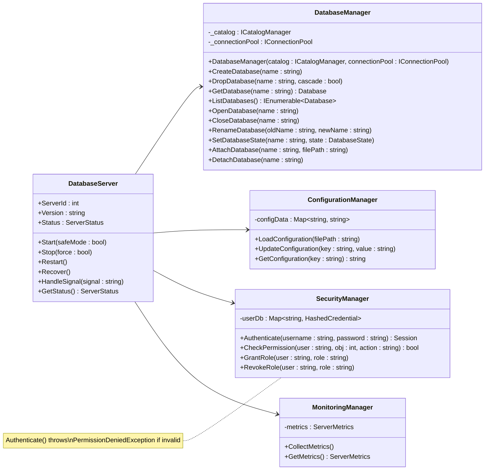
```mermaid
classDiagram
direction LR
class DatabaseServer {
    +ServerId : int
    +Version : string
    +Status : ServerStatus
    +Start(safeMode : bool)
    +Stop(force : bool)
    +Restart()
    +Recover()
    +HandleSignal(signal : string)
    +GetStatus() ServerStatus
}
class DatabaseManager {
    -_catalog : ICatalogManager
    -_connectionPool : IConnectionPool
    +DatabaseManager(catalog : ICatalogManager, connectionPool : IConnectionPool)
    +CreateDatabase(name : string)
    +DropDatabase(name : string, cascade : bool)
    +GetDatabase(name : string) Database
    +ListDatabases() IEnumerable~Database~
    +OpenDatabase(name : string)
    +CloseDatabase(name : string)
    +RenameDatabase(oldName : string, newName : string)
    +SetDatabaseState(name : string, state : DatabaseState)
    +AttachDatabase(name : string, filePath : string)
    +DetachDatabase(name : string)
}
class ConfigurationManager {
    -configData : Map~string, string~
    +LoadConfiguration(filePath : string)
    +UpdateConfiguration(key : string, value : string)
    +GetConfiguration(key : string) string
}
class SecurityManager {
    -userDb : Map~string, HashedCredential~
    +Authenticate(username : string, password : string) Session
    +CheckPermission(user : string, obj : int, action : string) bool
    +GrantRole(user : string, role : string)
    +RevokeRole(user : string, role : string)
}
note for SecurityManager "Authenticate() throws\nPermissionDeniedException if invalid"
class MonitoringManager {
    -metrics : ServerMetrics
    +CollectMetrics()
    +GetMetrics() ServerMetrics
}
DatabaseServer --> DatabaseManager
DatabaseServer --> ConfigurationManager
DatabaseServer --> SecurityManager
DatabaseServer --> MonitoringManager
```

### DatabaseServer
Covers: `Start_ShouldInitializeAllServices`, `Stop_ShouldFlushDirtyPagesBeforeShutdown`, `RecoverAfterCrash_ShouldReplayWAL`
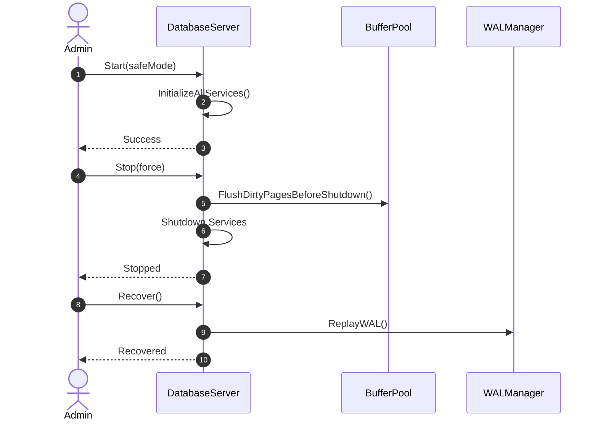
```mermaid
sequenceDiagram
    autonumber
    actor Admin
    participant Server as DatabaseServer
    participant Buffer as BufferPool
    participant WAL as WALManager
    
    Admin->>Server: Start(safeMode)
    Server->>Server: InitializeAllServices()
    Server-->>Admin: Success
    
    Admin->>Server: Stop(force)
    Server->>Buffer: FlushDirtyPagesBeforeShutdown()
    Server->>Server: Shutdown Services
    Server-->>Admin: Stopped
    
    Admin->>Server: Recover()
    Server->>WAL: ReplayWAL()
    Server-->>Admin: Recovered
```

### DatabaseManager
Covers: `CreateDatabase_ShouldCreateDatabaseSuccessfully`, `CreateDatabase_ShouldRejectDuplicateDatabaseName`, `CreateDatabase_ShouldReject_WhenPermissionDenied`, `DropDatabase_ShouldRemoveDatabaseSuccessfully`, `DropDatabase_ShouldReject_WhenDatabaseContainsSchemas`, `OpenDatabase_ShouldLoadStorageAndCatalog`, `CloseDatabase_ShouldFlushDirtyBuffers`
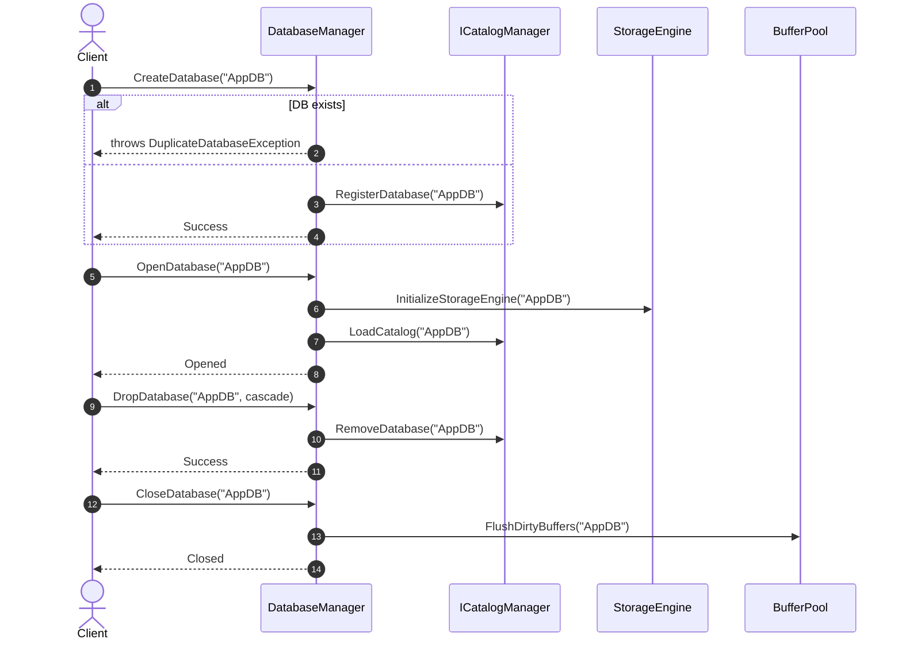
```mermaid
sequenceDiagram
    autonumber
    actor Client
    participant DBManager as DatabaseManager
    participant Catalog as ICatalogManager
    participant Storage as StorageEngine
    participant Buffer as BufferPool
    
    Client->>DBManager: CreateDatabase("AppDB")
    alt DB exists
        DBManager-->>Client: throws DuplicateDatabaseException
    else
        DBManager->>Catalog: RegisterDatabase("AppDB")
        DBManager-->>Client: Success
    end
    
    Client->>DBManager: OpenDatabase("AppDB")
    DBManager->>Storage: InitializeStorageEngine("AppDB")
    DBManager->>Catalog: LoadCatalog("AppDB")
    DBManager-->>Client: Opened
    
    Client->>DBManager: DropDatabase("AppDB", cascade)
    DBManager->>Catalog: RemoveDatabase("AppDB")
    DBManager-->>Client: Success
    
    Client->>DBManager: CloseDatabase("AppDB")
    DBManager->>Buffer: FlushDirtyBuffers("AppDB")
    DBManager-->>Client: Closed
```

---

## 2. Database Objects

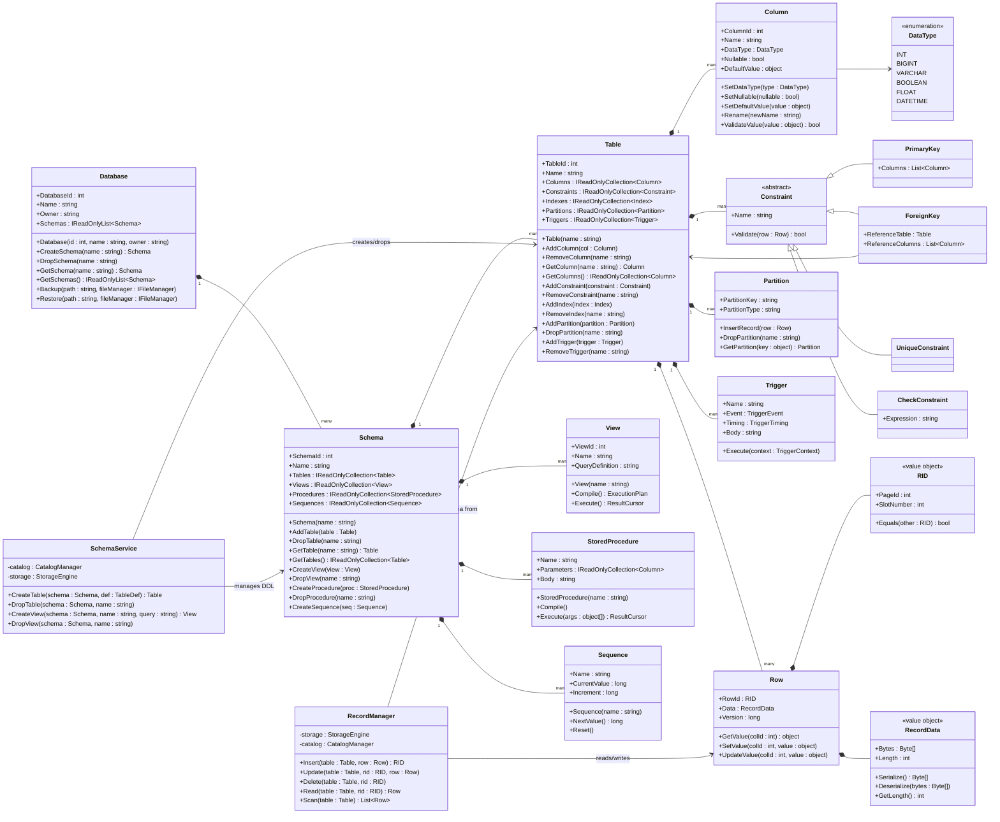
```mermaid
classDiagram
direction LR
class Database {
    +DatabaseId : int
    +Name : string
    +Owner : string
    +Schemas : IReadOnlyList~Schema~
    +Database(id : int, name : string, owner : string)
    +CreateSchema(name : string) Schema
    +DropSchema(name : string)
    +GetSchema(name : string) Schema
    +GetSchemas() IReadOnlyList~Schema~
    +Backup(path : string, fileManager : IFileManager)
    +Restore(path : string, fileManager : IFileManager)
}
class Schema {
    +SchemaId : int
    +Name : string
    +Tables : IReadOnlyCollection~Table~
    +Views : IReadOnlyCollection~View~
    +Procedures : IReadOnlyCollection~StoredProcedure~
    +Sequences : IReadOnlyCollection~Sequence~
    +Schema(name : string)
    +AddTable(table : Table)
    +DropTable(name : string)
    +GetTable(name : string) Table
    +GetTables() IReadOnlyCollection~Table~
    +CreateView(view : View)
    +DropView(name : string)
    +CreateProcedure(proc : StoredProcedure)
    +DropProcedure(name : string)
    +CreateSequence(seq : Sequence)
}
class Table {
    +TableId : int
    +Name : string
    +Columns : IReadOnlyCollection~Column~
    +Constraints : IReadOnlyCollection~Constraint~
    +Indexes : IReadOnlyCollection~Index~
    +Partitions : IReadOnlyCollection~Partition~
    +Triggers : IReadOnlyCollection~Trigger~
    +Table(name : string)
    +AddColumn(col : Column)
    +RemoveColumn(name : string)
    +GetColumn(name : string) Column
    +GetColumns() IReadOnlyCollection~Column~
    +AddConstraint(constraint : Constraint)
    +RemoveConstraint(name : string)
    +AddIndex(index : Index)
    +RemoveIndex(name : string)
    +AddPartition(partition : Partition)
    +DropPartition(name : string)
    +AddTrigger(trigger : Trigger)
    +RemoveTrigger(name : string)
}
class Column {
    +ColumnId : int
    +Name : string
    +DataType : DataType
    +Nullable : bool
    +DefaultValue : object
    +SetDataType(type : DataType)
    +SetNullable(nullable : bool)
    +SetDefaultValue(value : object)
    +Rename(newName : string)
    +ValidateValue(value : object) bool
}
class Row {
    +RowId : RID
    +Data : RecordData
    +Version : long
    +GetValue(colId : int) object
    +SetValue(colId : int, value : object)
    +UpdateValue(colId : int, value : object)
}
class RecordData {
    <<value object>>
    +Bytes : Byte[]
    +Length : int
    +Serialize() Byte[]
    +Deserialize(bytes : Byte[])
    +GetLength() int
}
class RID {
    <<value object>>
    +PageId : int
    +SlotNumber : int
    +Equals(other : RID) bool
}
class DataType {
    <<enumeration>>
    INT
    BIGINT
    VARCHAR
    BOOLEAN
    FLOAT
    DATETIME
}
class Constraint {
    <<abstract>>
    +Name : string
    +Validate(row : Row) bool
}
class PrimaryKey {
    +Columns : List~Column~
}
class ForeignKey {
    +ReferenceTable : Table
    +ReferenceColumns : List~Column~
}
class UniqueConstraint
class CheckConstraint {
    +Expression : string
}
class View {
    +ViewId : int
    +Name : string
    +QueryDefinition : string
    +View(name : string)
    +Compile() ExecutionPlan
    +Execute() ResultCursor
}
class StoredProcedure {
    +Name : string
    +Parameters : IReadOnlyCollection~Column~
    +Body : string
    +StoredProcedure(name : string)
    +Compile()
    +Execute(args : object[]) ResultCursor
}
class Sequence {
    +Name : string
    +CurrentValue : long
    +Increment : long
    +Sequence(name : string)
    +NextValue() long
    +Reset()
}
class Partition {
    +PartitionKey : string
    +PartitionType : string
    +InsertRecord(row : Row)
    +DropPartition(name : string)
    +GetPartition(key : object) Partition
}
class Trigger {
    +Name : string
    +Event : TriggerEvent
    +Timing : TriggerTiming
    +Body : string
    +Execute(context : TriggerContext)
}
Database "1" *-- "many" Schema
Schema "1" *-- "many" Table
Schema "1" *-- "many" View
Schema "1" *-- "many" StoredProcedure
Schema "1" *-- "many" Sequence
Table "1" *-- "many" Column
Table "1" *-- "many" Constraint
Table "1" *-- "many" Row
Table "1" *-- "many" Partition
Table "1" *-- "many" Trigger
Row *-- RID
Row *-- RecordData
Column --> DataType
Constraint <|-- PrimaryKey
Constraint <|-- ForeignKey
Constraint <|-- UniqueConstraint
Constraint <|-- CheckConstraint
ForeignKey --> Table
%% ── Domain Services ─────────────────────────────────
class SchemaService {
    -catalog : CatalogManager
    -storage : StorageEngine
    +CreateTable(schema : Schema, def : TableDef) Table
    +DropTable(schema : Schema, name : string)
    +CreateView(schema : Schema, name : string, query : string) View
    +DropView(schema : Schema, name : string)
}
class RecordManager {
    -storage : StorageEngine
    -catalog : CatalogManager
    +Insert(table : Table, row : Row) RID
    +Update(table : Table, rid : RID, row : Row)
    +Delete(table : Table, rid : RID)
    +Read(table : Table, rid : RID) Row
    +Scan(table : Table) List~Row~
}
SchemaService --> Schema : manages DDL
SchemaService --> Table : creates/drops
RecordManager --> Table : reads schema from
RecordManager --> Row : reads/writes
```

### Database Operations
Covers: `CreateSchema_ShouldAddSchemaToDatabase`, `CreateSchema_ShouldRejectDuplicateSchemaName`, `CreateSchema_ShouldReject_WhenPermissionDenied`, `CreateSchema_ShouldRollback_WhenCatalogRegistrationFails`, `DropSchema_ShouldRemoveExistingSchema`, `GetSchema_ShouldReturnExistingSchema`
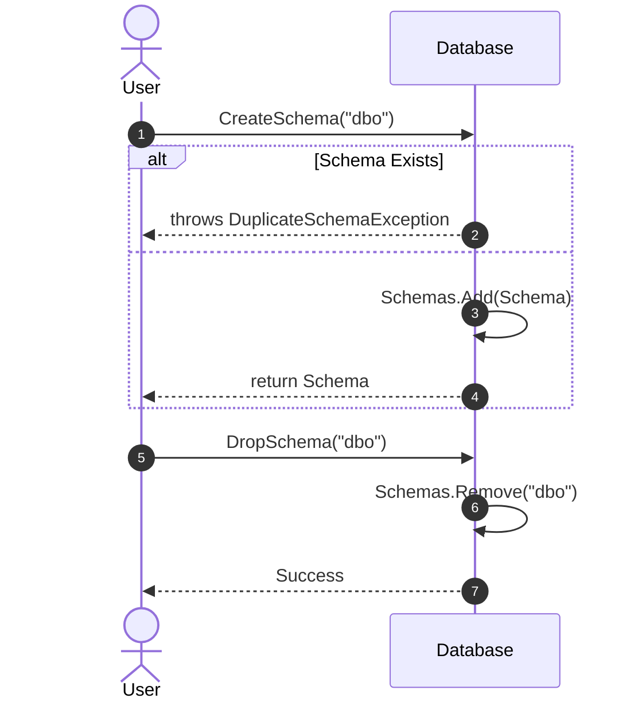
```mermaid
sequenceDiagram
    autonumber
    actor User
    participant DB as Database
    
    User->>DB: CreateSchema("dbo")
    alt Schema Exists
        DB-->>User: throws DuplicateSchemaException
    else
        DB->>DB: Schemas.Add(Schema)
        DB-->>User: return Schema
    end
    
    User->>DB: DropSchema("dbo")
    DB->>DB: Schemas.Remove("dbo")
    DB-->>User: Success
```

### Schema & Table Operations
Covers: `AddTable_ShouldAddTableSuccessfully`, `AddTable_ShouldRejectDuplicateTableName`, `DropTable_ShouldRemoveExistingTable`, `DropTable_ShouldReject_WhenReferencedByForeignKey`, `GetTable_ShouldReturnTable_WhenExists`, `AddColumn_ShouldAddColumnSuccessfully`, `AddColumn_ShouldRejectDuplicateColumnName`, `DropColumn_ShouldReject_WhenReferencedByConstraint`, `AddConstraint_ShouldRegisterConstraint`, `AddIndex_ShouldRegisterIndex`
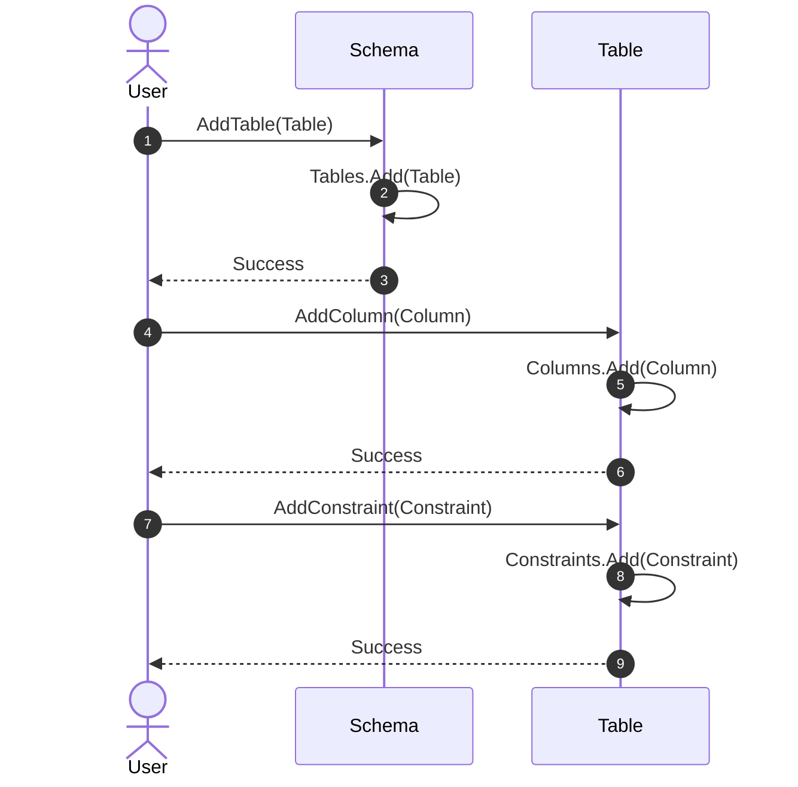
```mermaid
sequenceDiagram
    autonumber
    actor User
    participant Sch as Schema
    participant Tbl as Table
    
    User->>Sch: AddTable(Table)
    Sch->>Sch: Tables.Add(Table)
    Sch-->>User: Success
    
    User->>Tbl: AddColumn(Column)
    Tbl->>Tbl: Columns.Add(Column)
    Tbl-->>User: Success
    
    User->>Tbl: AddConstraint(Constraint)
    Tbl->>Tbl: Constraints.Add(Constraint)
    Tbl-->>User: Success
```

## Constraint & Index

### Constraints Validation
Covers: `Validate_ShouldAcceptUniqueKey`, `Validate_ShouldRejectDuplicateKey`, `Validate_ShouldAcceptExistingReferencedRow`, `Validate_ShouldRejectMissingReferencedRow`, `Validate_ShouldCascadeDelete_WhenCascadeEnabled`, `Validate_ShouldRejectDuplicateValue`, `Validate_ShouldRejectInvalidExpression`
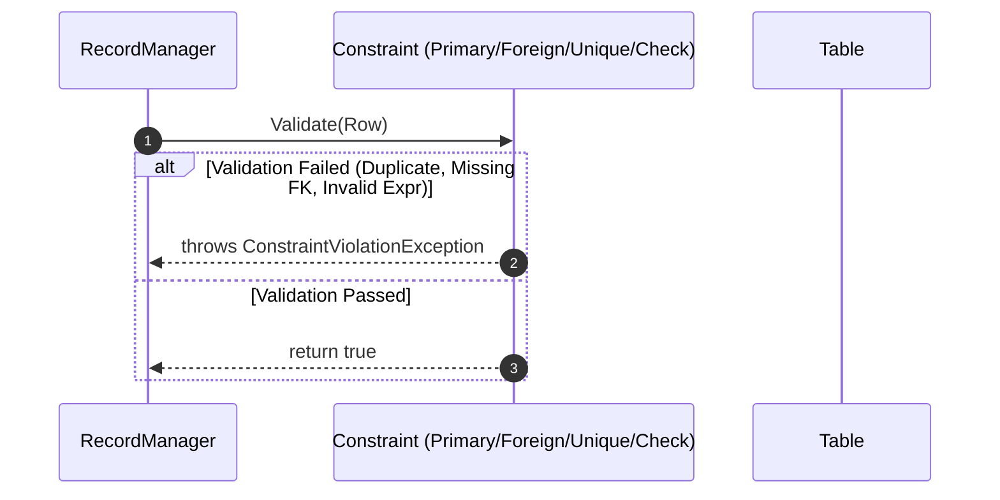
```mermaid
sequenceDiagram
    autonumber
    participant RecordMgr as RecordManager
    participant Constr as Constraint (Primary/Foreign/Unique/Check)
    participant Tbl as Table
    
    RecordMgr->>Constr: Validate(Row)
    alt Validation Failed (Duplicate, Missing FK, Invalid Expr)
        Constr-->>RecordMgr: throws ConstraintViolationException
    else Validation Passed
        Constr-->>RecordMgr: return true
    end
```

### Index & IndexManager
Covers: `Insert_ShouldKeepTreeBalanced`, `Search_ShouldFindExistingKey`, `Delete_ShouldRebalanceTreeAfterDeletion`, `CreateIndex_ShouldRegisterIndex`, `CreateIndex_ShouldRejectDuplicateIndexName`, `FindBestIndex_ShouldReturnOptimalIndexForQuery`
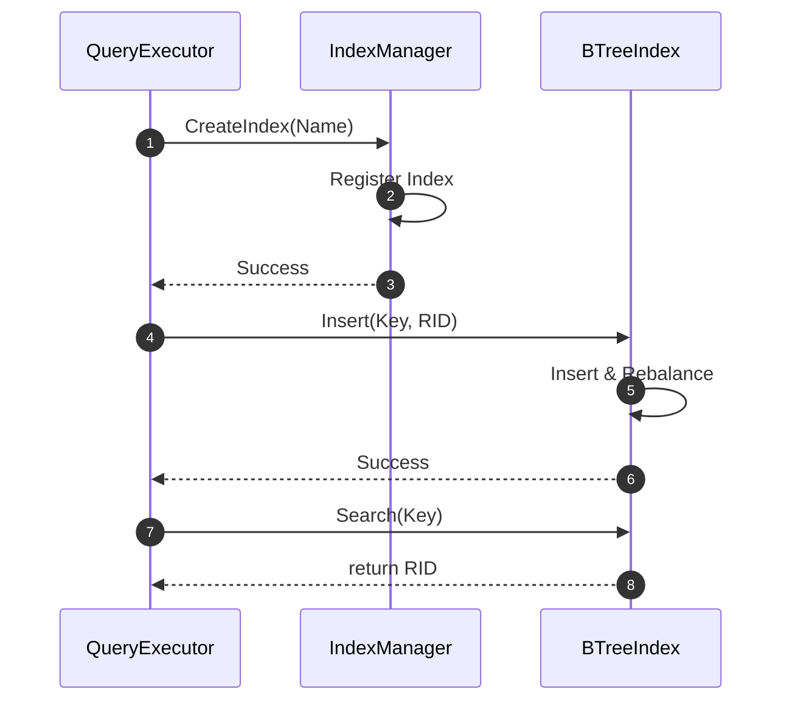
```mermaid
sequenceDiagram
    autonumber
    participant Engine as QueryExecutor
    participant IdxMgr as IndexManager
    participant BTree as BTreeIndex
    
    Engine->>IdxMgr: CreateIndex(Name)
    IdxMgr->>IdxMgr: Register Index
    IdxMgr-->>Engine: Success
    
    Engine->>BTree: Insert(Key, RID)
    BTree->>BTree: Insert & Rebalance
    BTree-->>Engine: Success
    
    Engine->>BTree: Search(Key)
    BTree-->>Engine: return RID
```

## Domain Services

### Schema & Table Services
Covers: `CreateSchema_ShouldCreateSchemaSuccessfully`, `CreateSchema_ShouldRejectDuplicateSchemaName`, `CreateSchema_ShouldCheckPermissionBeforeCreation`, `CreateSchema_ShouldRollback_WhenStorageFails`, `CreateSchema_ShouldRollback_WhenCatalogFails`, `DropSchema_ShouldRemoveExistingSchema`, `CreateTable_ShouldCreateTableSuccessfully`, `CreateTable_ShouldRejectDuplicateTableName`, `DropTable_ShouldRemoveExistingTable`
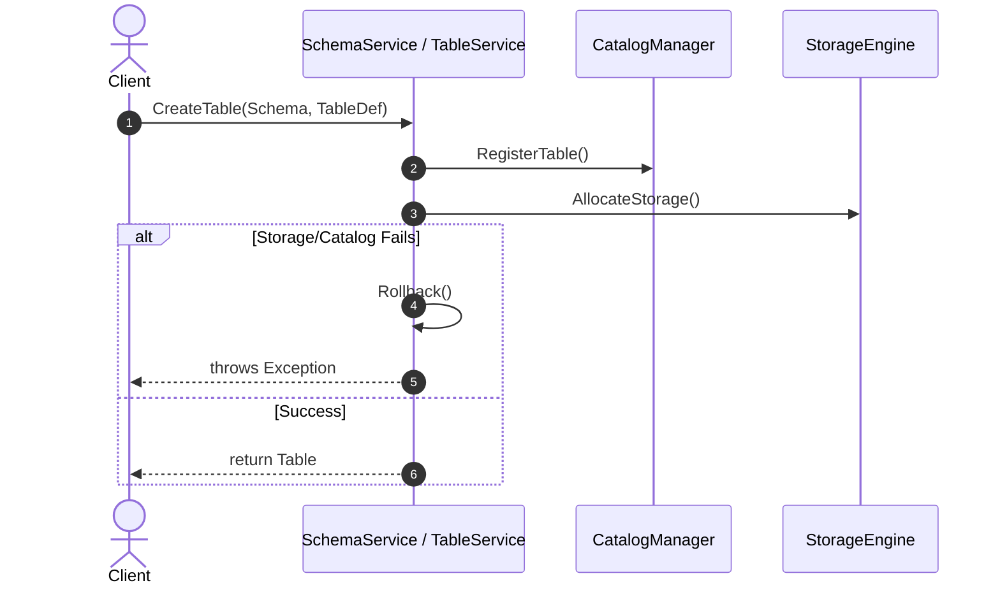
```mermaid
sequenceDiagram
    autonumber
    actor Client
    participant Svc as SchemaService / TableService
    participant CatMgr as CatalogManager
    participant Storage as StorageEngine
    
    Client->>Svc: CreateTable(Schema, TableDef)
    Svc->>CatMgr: RegisterTable()
    Svc->>Storage: AllocateStorage()
    alt Storage/Catalog Fails
        Svc->>Svc: Rollback()
        Svc-->>Client: throws Exception
    else Success
        Svc-->>Client: return Table
    end
```

### RecordManager
Covers: `InsertRecord_ShouldValidateConstraintsBeforeInsert`, `InsertRecord_ShouldUpdateIndexes`, `InsertRecord_ShouldRollback_WhenConstraintValidationFails`, `UpdateRecord_ShouldValidateConstraints`, `UpdateRecord_ShouldRollback_WhenIndexUpdateFails`, `DeleteRecord_ShouldValidateForeignKeyConstraints`, `DeleteRecord_ShouldRollback_WhenForeignKeyValidationFails`
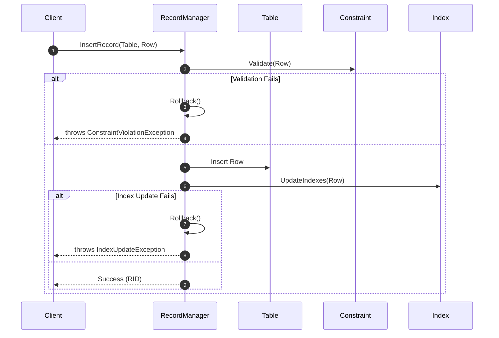
```mermaid
sequenceDiagram
    autonumber
    participant Client
    participant RecMgr as RecordManager
    participant Tbl as Table
    participant Constr as Constraint
    participant Idx as Index
    
    Client->>RecMgr: InsertRecord(Table, Row)
    RecMgr->>Constr: Validate(Row)
    alt Validation Fails
        RecMgr->>RecMgr: Rollback()
        RecMgr-->>Client: throws ConstraintViolationException
    else
        RecMgr->>Tbl: Insert Row
        RecMgr->>Idx: UpdateIndexes(Row)
        alt Index Update Fails
            RecMgr->>RecMgr: Rollback()
            RecMgr-->>Client: throws IndexUpdateException
        else
            RecMgr-->>Client: Success (RID)
        end
    end
```

---

## 3. Storage Engine

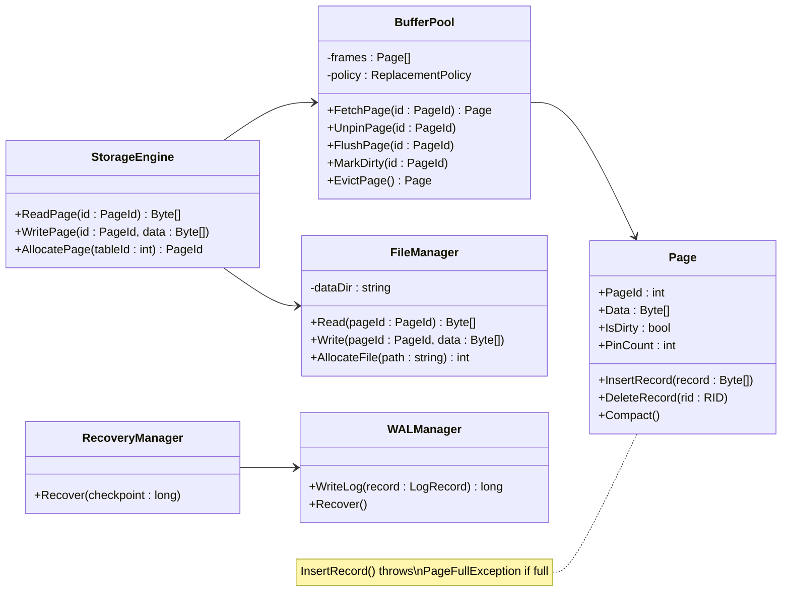
```mermaid
classDiagram
direction LR
class StorageEngine {
    +ReadPage(id : PageId) Byte[]
    +WritePage(id : PageId, data : Byte[])
    +AllocatePage(tableId : int) PageId
}
class BufferPool {
    -frames : Page[]
    -policy : ReplacementPolicy
    +FetchPage(id : PageId) Page
    +UnpinPage(id : PageId)
    +FlushPage(id : PageId)
    +MarkDirty(id : PageId)
    +EvictPage() Page
}
class Page {
    +PageId : int
    +Data : Byte[]
    +IsDirty : bool
    +PinCount : int
    +InsertRecord(record : Byte[])
    +DeleteRecord(rid : RID)
    +Compact()
}
note for Page "InsertRecord() throws\nPageFullException if full"
class FileManager {
    -dataDir : string
    +Read(pageId : PageId) Byte[]
    +Write(pageId : PageId, data : Byte[])
    +AllocateFile(path : string) int
}
class WALManager {
    +WriteLog(record : LogRecord) long
    +Recover()
}
class RecoveryManager {
    +Recover(checkpoint : long)
}
StorageEngine --> BufferPool
StorageEngine --> FileManager
BufferPool --> Page
RecoveryManager --> WALManager
```

### BufferPool Operations
Covers: `FetchPage_ShouldLoadPageIntoBuffer`, `FetchPage_ShouldReturnCachedPage_WhenAlreadyLoaded`, `FlushPage_ShouldWriteDirtyPageToDisk`, `FlushDirtyPage_ShouldWriteWALBeforeDisk`, `EvictPage_ShouldUseReplacementPolicy`, `EvictPage_ShouldNotEvictPinnedPage`
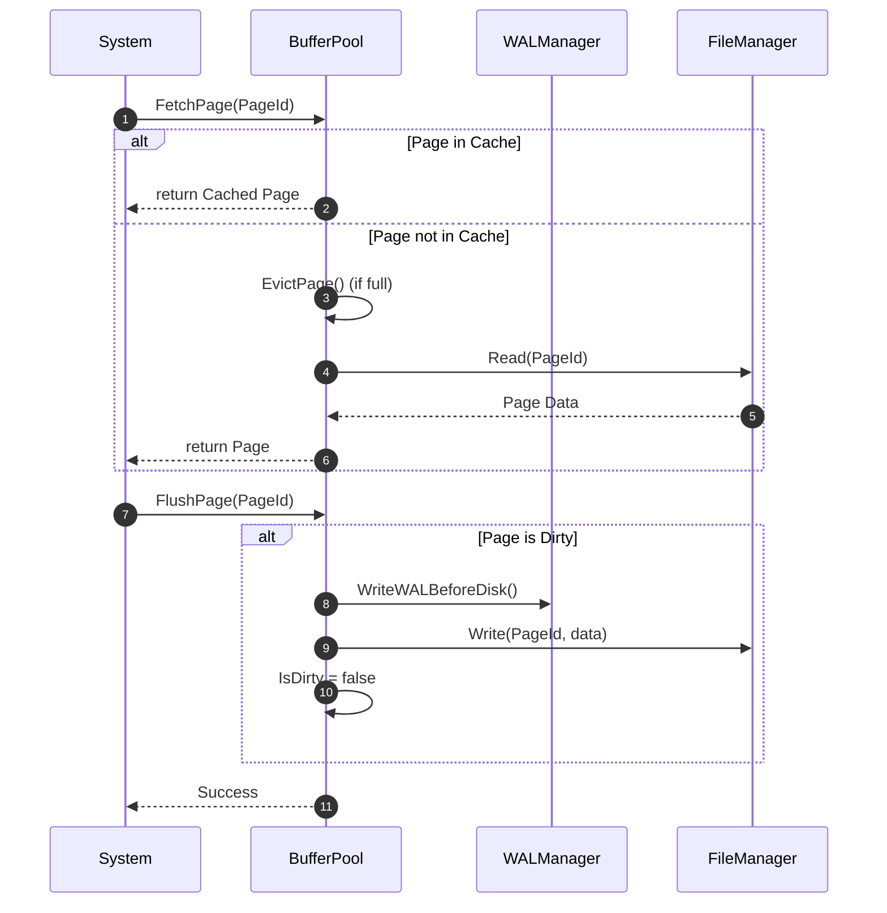
```mermaid
sequenceDiagram
    autonumber
    participant System
    participant Buffer as BufferPool
    participant WAL as WALManager
    participant Disk as FileManager
    
    %% Fetch Page
    System->>Buffer: FetchPage(PageId)
    alt Page in Cache
        Buffer-->>System: return Cached Page
    else Page not in Cache
        Buffer->>Buffer: EvictPage() (if full)
        Buffer->>Disk: Read(PageId)
        Disk-->>Buffer: Page Data
        Buffer-->>System: return Page
    end
    
    %% Flush Page
    System->>Buffer: FlushPage(PageId)
    alt Page is Dirty
        Buffer->>WAL: WriteWALBeforeDisk()
        Buffer->>Disk: Write(PageId, data)
        Buffer->>Buffer: IsDirty = false
    end
    Buffer-->>System: Success
```

### Page & FileManager
Covers: `InsertRecord_ShouldReject_WhenPageIsFull`, `DeleteRecord_ShouldRemoveRecord`, `Compact_ShouldReclaimFreeSpace`, `ReadPage_ShouldReturnRequestedPage`, `WritePage_ShouldPersistPageData`
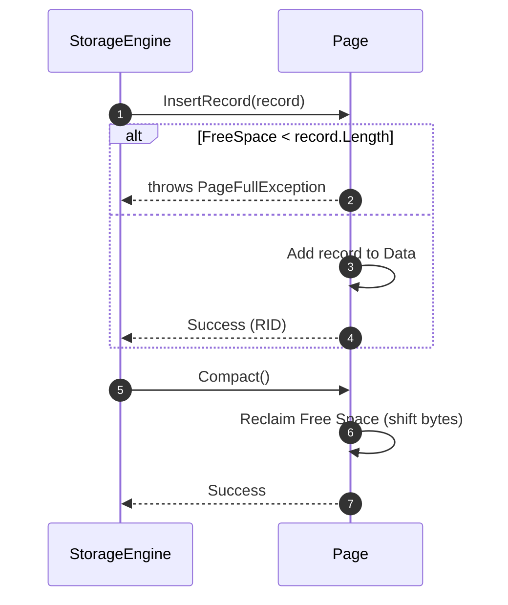
```mermaid
sequenceDiagram
    autonumber
    participant Storage as StorageEngine
    participant Pg as Page
    
    Storage->>Pg: InsertRecord(record)
    alt FreeSpace < record.Length
        Pg-->>Storage: throws PageFullException
    else
        Pg->>Pg: Add record to Data
        Pg-->>Storage: Success (RID)
    end
    
    Storage->>Pg: Compact()
    Pg->>Pg: Reclaim Free Space (shift bytes)
    Pg-->>Storage: Success
```

### Logging & Recovery
Covers: `WriteLog_ShouldAssignIncreasingLSN`, `Recover_ShouldReplayCommittedTransactions`, `Recover_ShouldUndoUncommittedTransactions`, `Recover_ShouldRestoreConsistentDatabase`
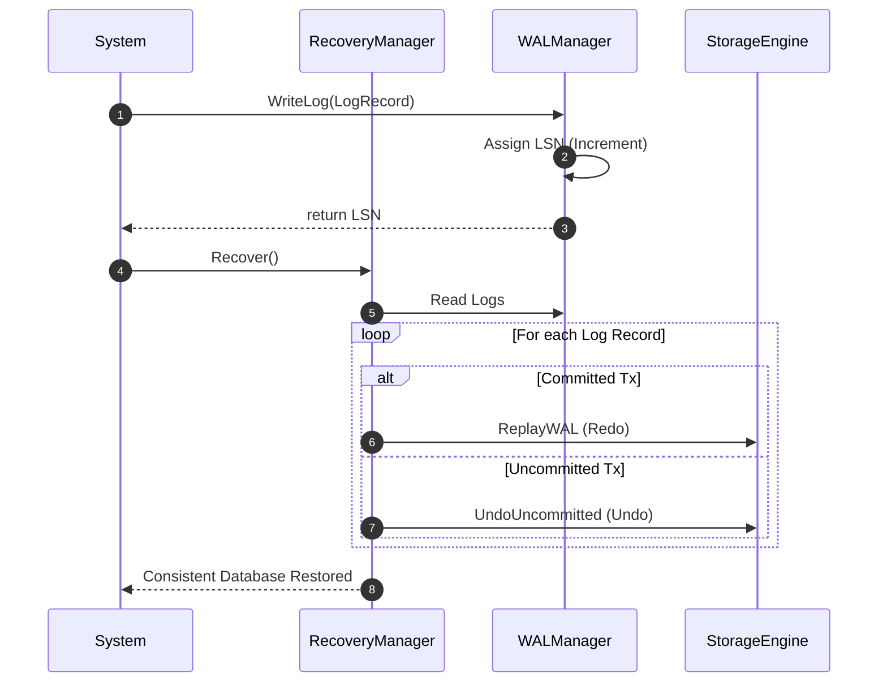
```mermaid
sequenceDiagram
    autonumber
    participant System
    participant RecMgr as RecoveryManager
    participant WAL as WALManager
    participant Storage as StorageEngine
    
    %% Write Log
    System->>WAL: WriteLog(LogRecord)
    WAL->>WAL: Assign LSN (Increment)
    WAL-->>System: return LSN
    
    %% Recovery
    System->>RecMgr: Recover()
    RecMgr->>WAL: Read Logs
    loop For each Log Record
        alt Committed Tx
            RecMgr->>Storage: ReplayWAL (Redo)
        else Uncommitted Tx
            RecMgr->>Storage: UndoUncommitted (Undo)
        end
    end
    RecMgr-->>System: Consistent Database Restored
```

---

## 4. Transaction

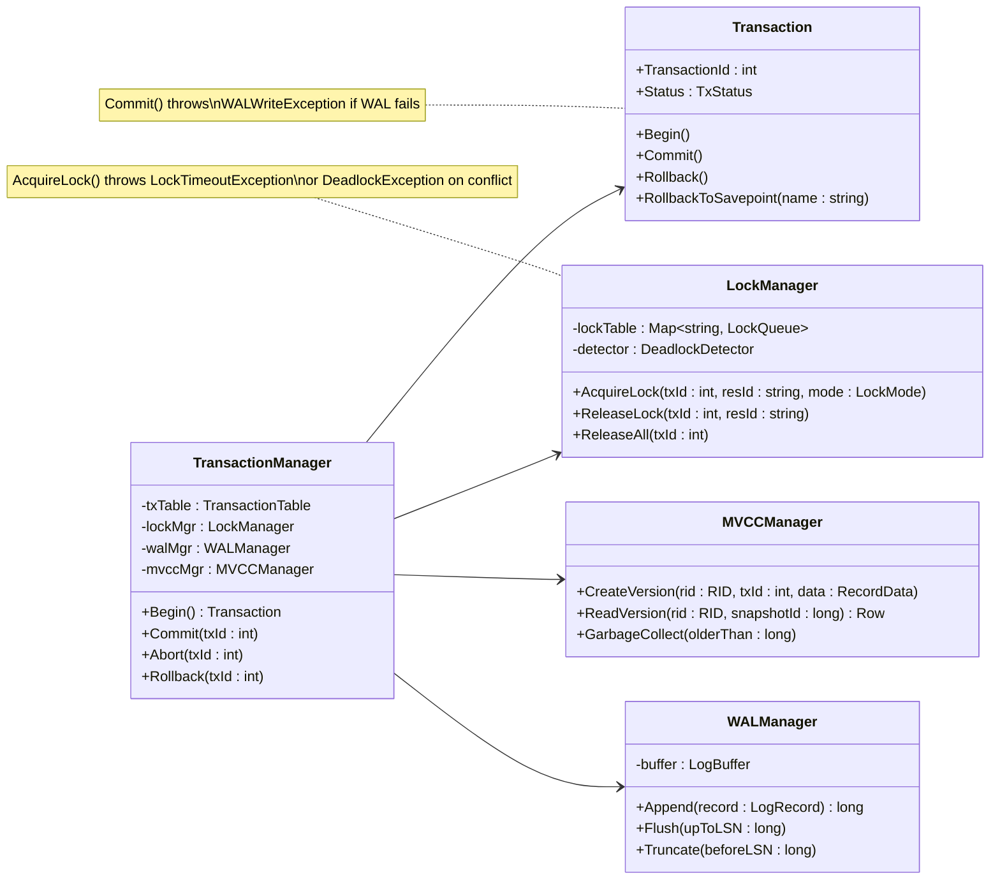
```mermaid
classDiagram
direction LR
class TransactionManager {
    -txTable : TransactionTable
    -lockMgr : LockManager
    -walMgr : WALManager
    -mvccMgr : MVCCManager
    +Begin() Transaction
    +Commit(txId : int)
    +Abort(txId : int)
    +Rollback(txId : int)
}
class Transaction {
    +TransactionId : int
    +Status : TxStatus
    +Begin()
    +Commit()
    +Rollback()
    +RollbackToSavepoint(name : string)
}
note for Transaction "Commit() throws\nWALWriteException if WAL fails"
class LockManager {
    -lockTable : Map~string, LockQueue~
    -detector : DeadlockDetector
    +AcquireLock(txId : int, resId : string, mode : LockMode)
    +ReleaseLock(txId : int, resId : string)
    +ReleaseAll(txId : int)
}
note for LockManager "AcquireLock() throws LockTimeoutException\nor DeadlockException on conflict"
class MVCCManager {
    +CreateVersion(rid : RID, txId : int, data : RecordData)
    +ReadVersion(rid : RID, snapshotId : long) Row
    +GarbageCollect(olderThan : long)
}
class WALManager {
    -buffer : LogBuffer
    +Append(record : LogRecord) long
    +Flush(upToLSN : long)
    +Truncate(beforeLSN : long)
}
TransactionManager --> Transaction
TransactionManager --> LockManager
TransactionManager --> MVCCManager
TransactionManager --> WALManager
```

### Transaction Lifecycle & TransactionManager
Covers: `Begin_ShouldCreateActiveTransaction`, `Commit_ShouldPersistChanges`, `Commit_ShouldWriteWALBeforePersistingData`, `Commit_ShouldFail_WhenWALWriteFails`, `Rollback_ShouldUndoAllChanges`, `Rollback_ShouldRestoreOriginalPageState`, `RollbackToSavepoint_ShouldRestorePreviousState`, `CommitTransaction_ShouldReleaseAllLocks`, `RollbackTransaction_ShouldReleaseAllLocks`
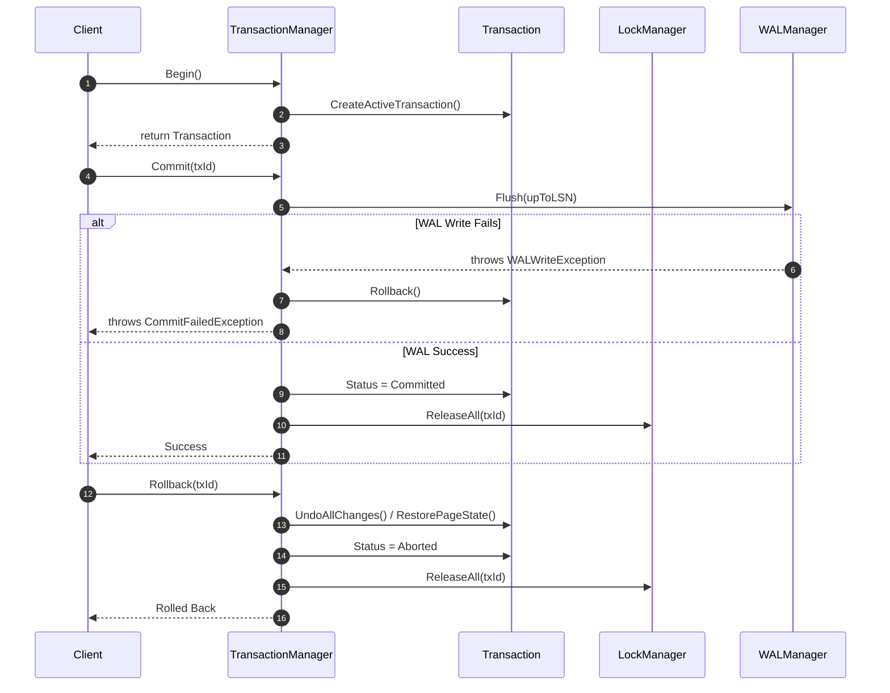
```mermaid
sequenceDiagram
    autonumber
    participant Client
    participant TxMgr as TransactionManager
    participant Tx as Transaction
    participant LockMgr as LockManager
    participant WAL as WALManager
    
    %% Begin
    Client->>TxMgr: Begin()
    TxMgr->>Tx: CreateActiveTransaction()
    TxMgr-->>Client: return Transaction
    
    %% Commit
    Client->>TxMgr: Commit(txId)
    TxMgr->>WAL: Flush(upToLSN)
    alt WAL Write Fails
        WAL-->>TxMgr: throws WALWriteException
        TxMgr->>Tx: Rollback()
        TxMgr-->>Client: throws CommitFailedException
    else WAL Success
        TxMgr->>Tx: Status = Committed
        TxMgr->>LockMgr: ReleaseAll(txId)
        TxMgr-->>Client: Success
    end
    
    %% Rollback
    Client->>TxMgr: Rollback(txId)
    TxMgr->>Tx: UndoAllChanges() / RestorePageState()
    TxMgr->>Tx: Status = Aborted
    TxMgr->>LockMgr: ReleaseAll(txId)
    TxMgr-->>Client: Rolled Back
```

### LockManager & MVCC
Covers: `AcquireSharedLock_ShouldGrantLock_WhenNoConflict`, `AcquireExclusiveLock_ShouldWait_WhenSharedLockExists`, `DetectDeadlock_ShouldIdentifyCircularWait`, `Read_ShouldIgnoreUncommittedVersion`
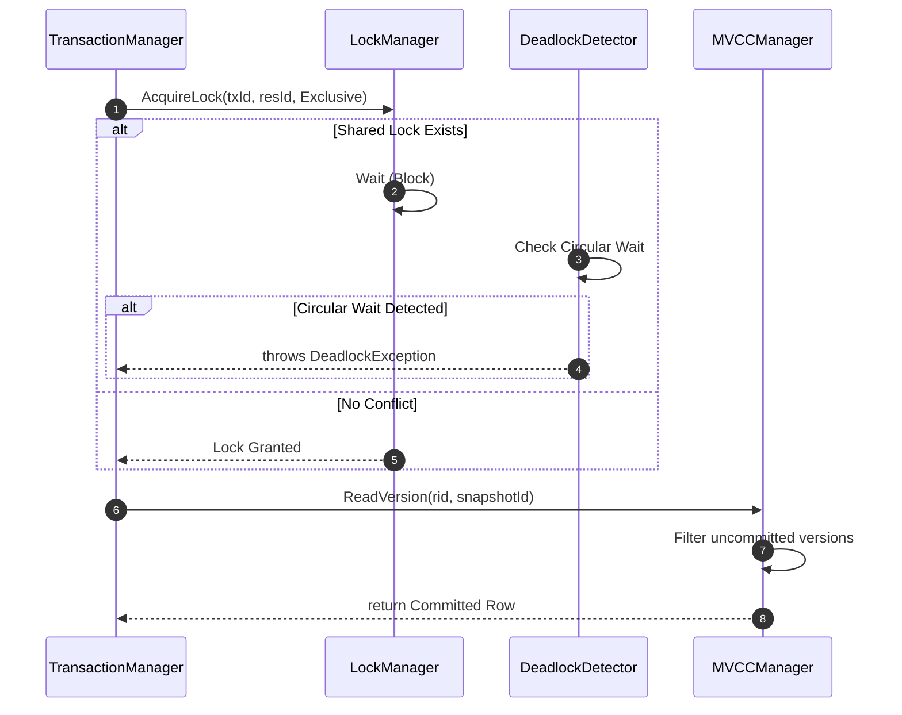
```mermaid
sequenceDiagram
    autonumber
    participant TxMgr as TransactionManager
    participant LockMgr as LockManager
    participant Detector as DeadlockDetector
    participant MVCC as MVCCManager
    
    %% Locking
    TxMgr->>LockMgr: AcquireLock(txId, resId, Exclusive)
    alt Shared Lock Exists
        LockMgr->>LockMgr: Wait (Block)
        Detector->>Detector: Check Circular Wait
        alt Circular Wait Detected
            Detector-->>TxMgr: throws DeadlockException
        end
    else No Conflict
        LockMgr-->>TxMgr: Lock Granted
    end
    
    %% MVCC Read
    TxMgr->>MVCC: ReadVersion(rid, snapshotId)
    MVCC->>MVCC: Filter uncommitted versions
    MVCC-->>TxMgr: return Committed Row
```

---

## 5. Query Processor

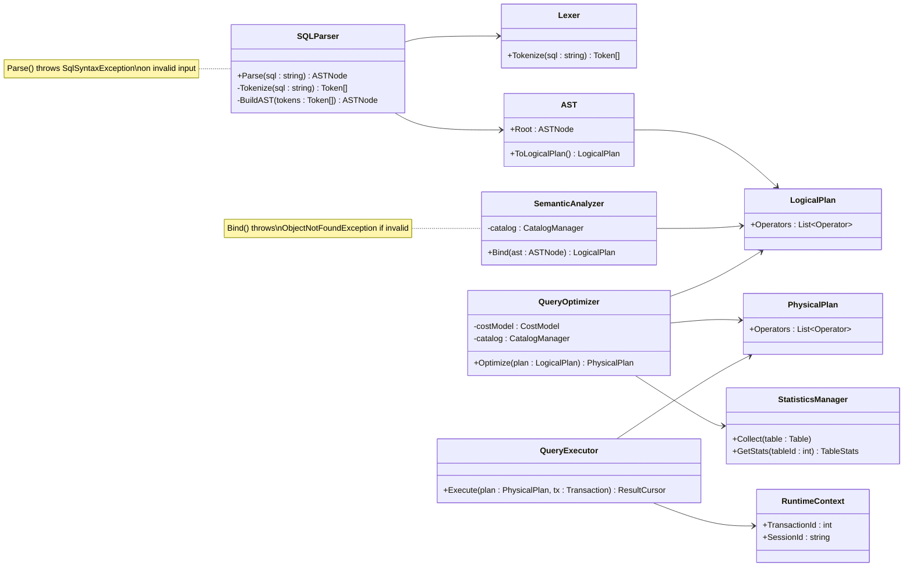
```mermaid
classDiagram
direction LR
class SQLParser {
    +Parse(sql : string) ASTNode
    -Tokenize(sql : string) Token[]
    -BuildAST(tokens : Token[]) ASTNode
}
note for SQLParser "Parse() throws SqlSyntaxException\non invalid input"
class Lexer {
    +Tokenize(sql : string) Token[]
}
class SemanticAnalyzer {
    -catalog : CatalogManager
    +Bind(ast : ASTNode) LogicalPlan
}
note for SemanticAnalyzer "Bind() throws\nObjectNotFoundException if invalid"
class AST {
    +Root : ASTNode
    +ToLogicalPlan() LogicalPlan
}
class QueryOptimizer {
    -costModel : CostModel
    -catalog : CatalogManager
    +Optimize(plan : LogicalPlan) PhysicalPlan
}
class LogicalPlan {
    +Operators : List~Operator~
}
class PhysicalPlan {
    +Operators : List~Operator~
}
class StatisticsManager {
    +Collect(table : Table)
    +GetStats(tableId : int) TableStats
}
class QueryExecutor {
    +Execute(plan : PhysicalPlan, tx : Transaction) ResultCursor
}
class RuntimeContext {
    +TransactionId : int
    +SessionId : string
}
SQLParser --> Lexer
SQLParser --> AST
AST --> LogicalPlan
SemanticAnalyzer --> LogicalPlan
QueryOptimizer --> LogicalPlan
QueryOptimizer --> PhysicalPlan
QueryOptimizer --> StatisticsManager
QueryExecutor --> PhysicalPlan
QueryExecutor --> RuntimeContext
```

### SQL Parsing & Semantic Analysis
Covers: `ParseSelect_ShouldGenerateAST`, `ParseInsert_ShouldGenerateAST`, `ParseCreate_ShouldGenerateASTForDDL`, `Parse_ShouldThrow_WhenSqlSyntaxIsInvalid`, `Bind_ShouldResolveTableNames`, `Bind_ShouldThrow_WhenTableDoesNotExist`, `Bind_ShouldThrow_WhenColumnDoesNotExist`
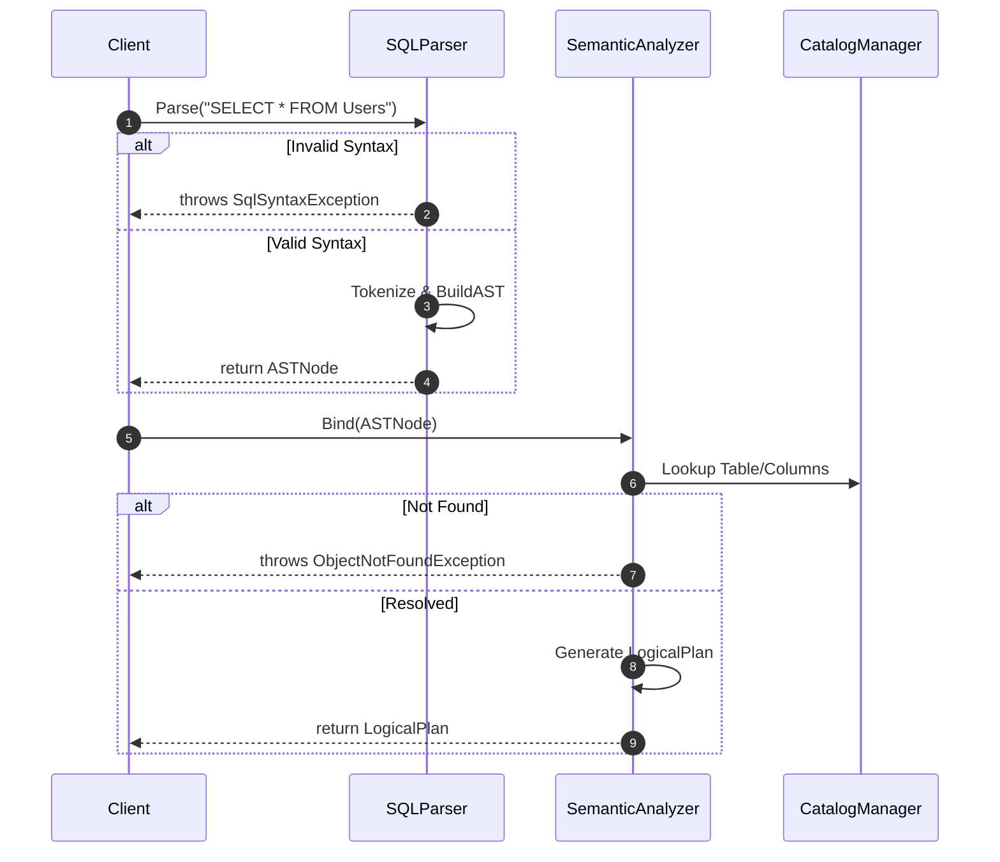
```mermaid
sequenceDiagram
    autonumber
    participant Client
    participant Parser as SQLParser
    participant Analyzer as SemanticAnalyzer
    participant CatMgr as CatalogManager
    
    Client->>Parser: Parse("SELECT * FROM Users")
    alt Invalid Syntax
        Parser-->>Client: throws SqlSyntaxException
    else Valid Syntax
        Parser->>Parser: Tokenize & BuildAST
        Parser-->>Client: return ASTNode
    end
    
    Client->>Analyzer: Bind(ASTNode)
    Analyzer->>CatMgr: Lookup Table/Columns
    alt Not Found
        Analyzer-->>Client: throws ObjectNotFoundException
    else Resolved
        Analyzer->>Analyzer: Generate LogicalPlan
        Analyzer-->>Client: return LogicalPlan
    end
```

### Query Optimization
Covers: `Optimize_ShouldChooseIndexScan_WhenIndexExists`, `Optimize_ShouldChooseTableScan_WhenNoIndexExists`, `Optimize_ShouldOptimizeJoinOrder`, `Optimize_ShouldApplyPredicatePushdown`
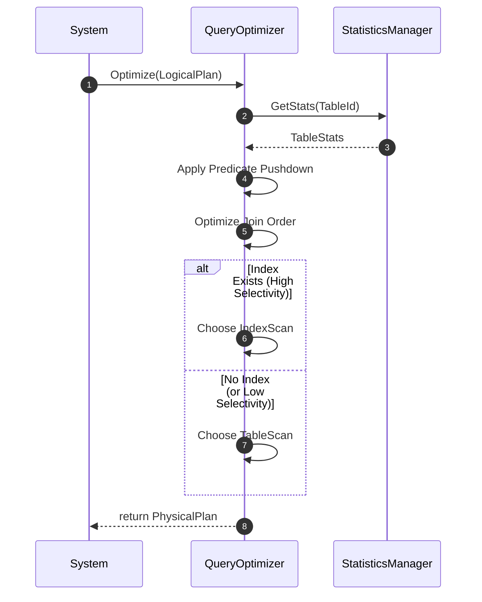
```mermaid
sequenceDiagram
    autonumber
    participant System
    participant Optimizer as QueryOptimizer
    participant Stats as StatisticsManager
    
    System->>Optimizer: Optimize(LogicalPlan)
    Optimizer->>Stats: GetStats(TableId)
    Stats-->>Optimizer: TableStats
    
    Optimizer->>Optimizer: Apply Predicate Pushdown
    Optimizer->>Optimizer: Optimize Join Order
    
    alt Index Exists (High Selectivity)
        Optimizer->>Optimizer: Choose IndexScan
    else No Index (or Low Selectivity)
        Optimizer->>Optimizer: Choose TableScan
    end
    Optimizer-->>System: return PhysicalPlan
```

### Query Execution
Covers: `ExecuteSelect_ShouldReturnMatchingRows`, `ExecuteInsert_ShouldInsertRecord`, `ExecuteUpdate_ShouldModifyExistingRows`, `ExecuteDelete_ShouldDeleteMatchingRows`, `ExecuteJoin_ShouldReturnJoinedRows`, `ExecuteAggregate_ShouldReturnAggregatedResult`, `Execute_ShouldThrow_WhenExecutionPlanIsInvalid`
```mermaid
sequenceDiagram
    autonumber
    participant Client
    participant Exec as QueryExecutor
    participant Plan as PhysicalPlan
    participant Storage as StorageEngine/RecordManager
    
    Client->>Exec: Execute(PhysicalPlan, Transaction)
    alt Invalid Plan
        Exec-->>Client: throws InvalidExecutionPlanException
    else Valid Plan
        Exec->>Plan: Execute Operators (Select/Join/Aggregate)
        Plan->>Storage: Read/Write Data
        Storage-->>Plan: Rows
        Plan-->>Exec: ResultCursor
        Exec-->>Client: return ResultCursor
    end
```

---

## 6. Catalog

```mermaid
classDiagram
direction LR
class CatalogManager {
    -sysTables : Map~string, object~
    +RegisterDatabase(name : string)
    +RegisterSchema(dbName : string, schemaName : string)
    +RegisterTable(table : Table)
    +GetDatabase(name : string) Database
    +GetSchema(dbName : string, schemaName : string) Schema
    +GetTable(name : string) Table
    +GetIndex(name : string) Index
    +FindTable(name : string) Table
    +ResolveObjectName(name : string) object
    +DropTable(name : string)
    +DropSchema(name : string)
    +DeleteMeta(id : int)
}
note for CatalogManager "GetTable() / GetIndex() throws\nNotFoundException if not found"
class Database
class Schema
class Table
class Index
CatalogManager --> Database
CatalogManager --> Schema
CatalogManager --> Table
CatalogManager --> Index
```

### Catalog Registration (Database, Schema, Table)
Covers: `RegisterDatabase_ShouldAddDatabaseMetadata`, `RegisterDatabase_ShouldRejectDuplicateDatabase`, `RegisterSchema_ShouldAddSchemaMetadata`, `RegisterSchema_ShouldRejectDuplicateSchema`, `RegisterTable_ShouldAddTableMetadata`, `RegisterTable_ShouldRejectDuplicateTable`, `RegisterTable_ShouldRollback_WhenStorageFails`
```mermaid
sequenceDiagram
    autonumber
    participant Engine as Engine
    participant CatMgr as CatalogManager
    participant Storage as StorageEngine
    
    %% Register Database & Schema
    Engine->>CatMgr: RegisterDatabase("NewDB")
    alt DB exists
        CatMgr-->>Engine: throws DuplicateDatabaseException
    else
        CatMgr->>CatMgr: Add Database Metadata
        CatMgr-->>Engine: Success
    end
    
    %% Register Table
    Engine->>CatMgr: RegisterTable(Table)
    alt Table exists
        CatMgr-->>Engine: throws DuplicateTableException
    else
        CatMgr->>Storage: AllocateStorage(Table)
        alt Storage Fails
            Storage-->>CatMgr: throws StorageException
            CatMgr->>CatMgr: Rollback Metadata
            CatMgr-->>Engine: throws Exception
        else
            CatMgr->>CatMgr: Add Table Metadata
            CatMgr-->>Engine: Success
        end
    end
```

### Metadata Lookup & Dependency Management
Covers: `FindTable_ShouldReturnQualifiedTable`, `ResolveObjectName_ShouldResolveSchemaObject`, `DropTable_ShouldReject_WhenReferencedByForeignKey`, `DropSchema_ShouldReject_WhenSchemaContainsObjects`
```mermaid
sequenceDiagram
    autonumber
    participant Client
    participant CatMgr as CatalogManager
    participant SysTable as sysTables (Map)
    
    %% Lookup
    Client->>CatMgr: FindTable("Users")
    CatMgr->>SysTable: Lookup("Users")
    SysTable-->>CatMgr: Table Metadata
    CatMgr-->>Client: return Table
    
    %% Drop Dependency Check
    Client->>CatMgr: DropTable("Users")
    CatMgr->>CatMgr: CheckForeignKeys("Users")
    alt Referenced by FK
        CatMgr-->>Client: throws DependencyViolationException
    else
        CatMgr->>SysTable: Remove("Users")
        CatMgr-->>Client: Success
    end
```

---

## 7. Security

```mermaid
classDiagram
direction LR
class SecurityManager {
    -userDb : Map~string, HashedCredential~
    +Authenticate(username : string, password : string) Session
    +Authorize(user : string, obj : int, action : string) bool
    +HasPermission(user : string, obj : int, action : string) bool
    +CheckPermission(user : string, obj : int, action : string) bool
    +GrantRole(user : string, role : string)
    +RevokeRole(user : string, role : string)
}
note for SecurityManager "Authenticate() throws\nPermissionDeniedException if invalid"
class Session {
    +SessionId : string
    +User : User
    +CreatedAt : DateTime
    +IsValid() bool
}
class User {
    +UserId : int
    +Username : string
    +PasswordHash : string
}
class Role {
    +RoleId : int
    +Name : string
}
class Permission {
    +Action : string
    +ObjectId : int
}
SecurityManager --> User
SecurityManager --> Role
SecurityManager --> Session
Role --> Permission
```

### Authentication
Covers: `Login_ShouldAuthenticateValidUser`, `Login_ShouldRejectInvalidUsernameOrPassword`, `Authenticate_ShouldValidateUserCredentials`
```mermaid
sequenceDiagram
    autonumber
    actor Client
    participant SecMgr as SecurityManager
    participant UserDB as userDb (Map)
    
    Client->>SecMgr: Authenticate("admin", "password123")
    SecMgr->>UserDB: Get("admin")
    alt User not found or invalid password
        SecMgr-->>Client: throws PermissionDeniedException
    else Valid credentials
        SecMgr->>SecMgr: Create Session
        SecMgr-->>Client: return Session
    end
```

### Permission & Authorization
Covers: `HasPermission_ShouldReturnTrue_WhenPermissionExists`, `HasPermission_ShouldReturnFalse_WhenPermissionDoesNotExist`, `Authorize_ShouldAllowAuthorizedUser`, `Authorize_ShouldRejectUnauthorizedUser`, `Authorize_ShouldCheckObjectPermissions`, `Authorize_ShouldVerifyUserPermission`
```mermaid
sequenceDiagram
    autonumber
    actor Client
    participant SecMgr as SecurityManager
    participant UserRoles as User/Role/Permission
    
    Client->>SecMgr: HasPermission("admin", 1, "SELECT")
    SecMgr->>UserRoles: Check Roles & Permissions
    alt Permission Exists
        SecMgr-->>Client: return true
    else Permission Missing
        SecMgr-->>Client: return false
    end
    
    Client->>SecMgr: Authorize("admin", 1, "SELECT")
    SecMgr->>SecMgr: HasPermission("admin", 1, "SELECT")
    alt true
        SecMgr-->>Client: return true (Authorized)
    else false
        SecMgr-->>Client: throws UnauthorizedAccessException
    end
```