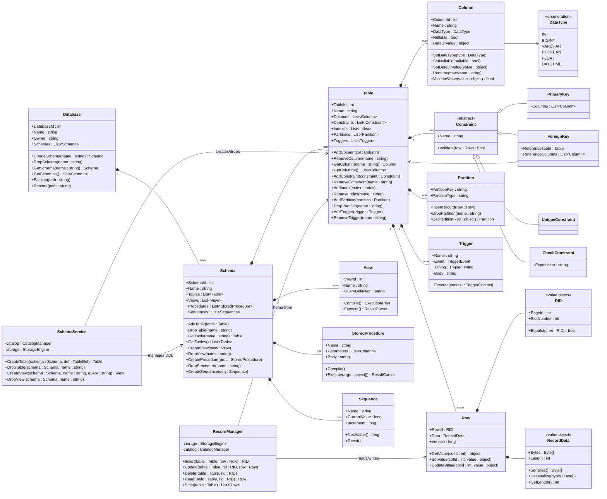
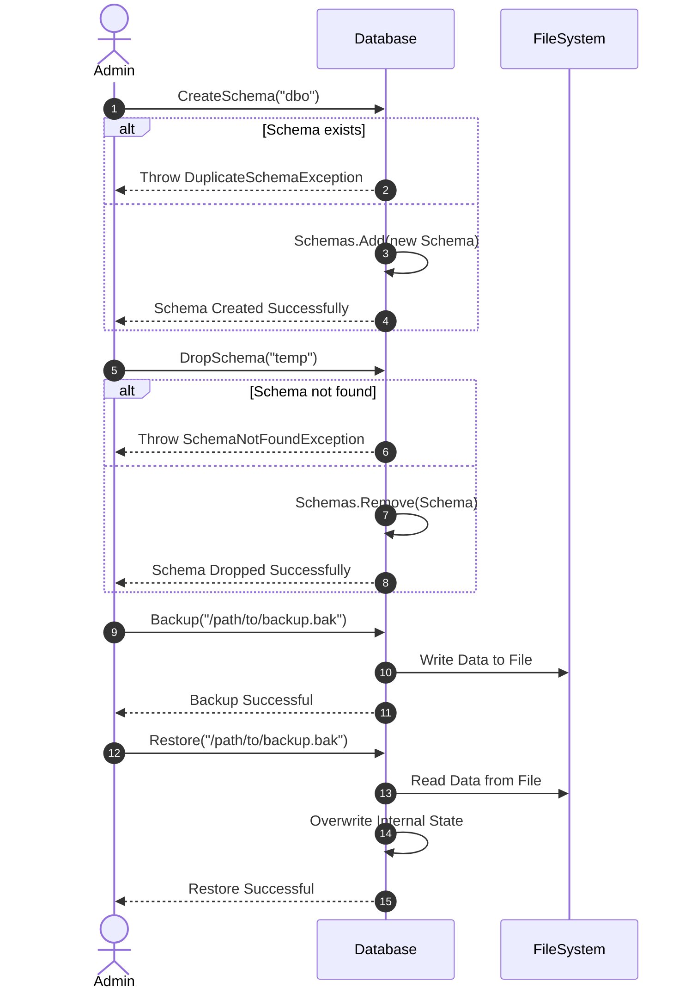
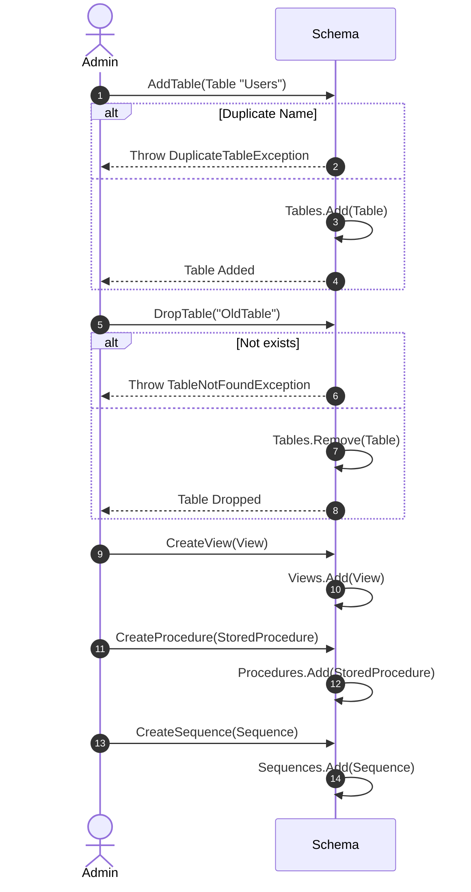
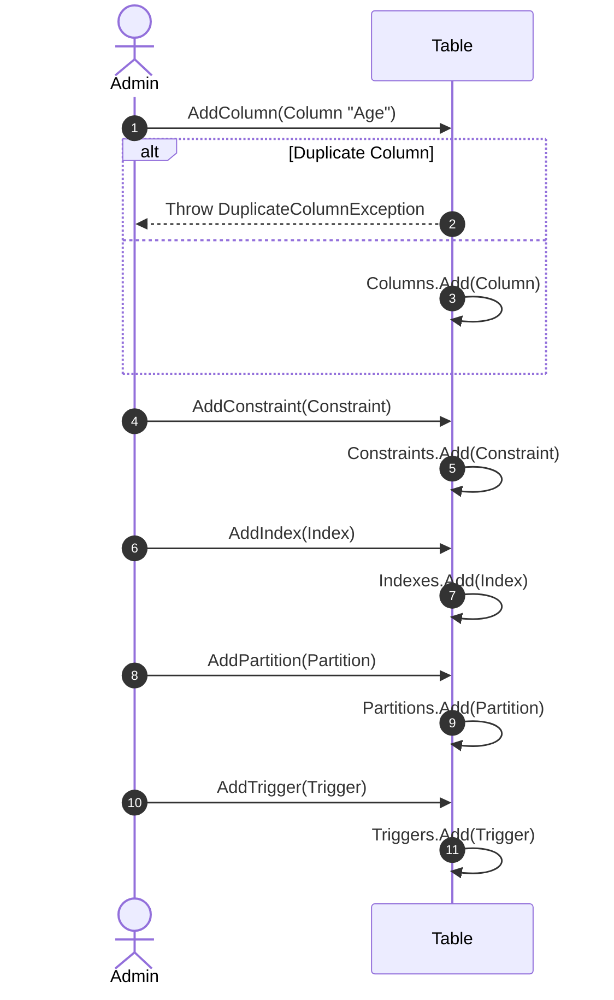
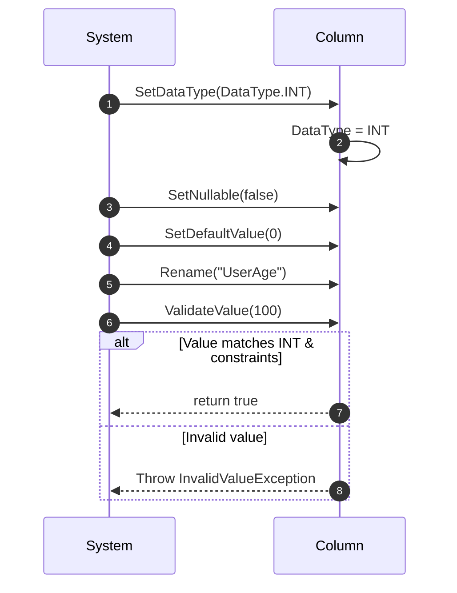
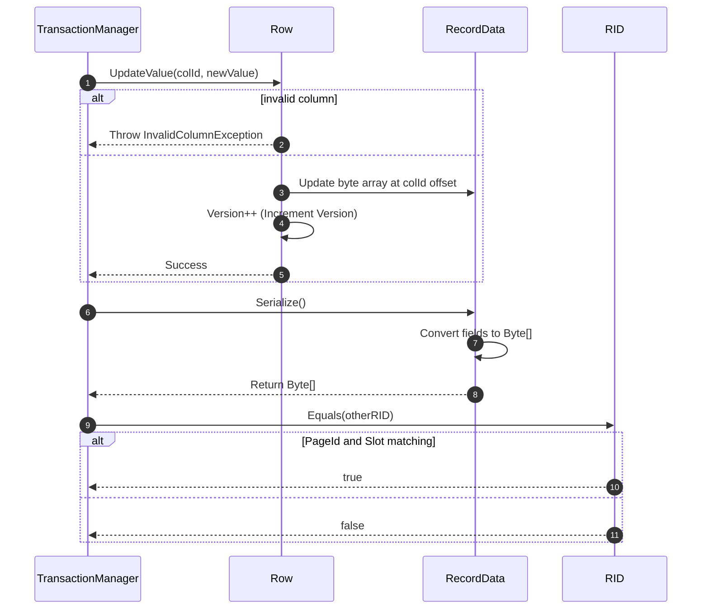
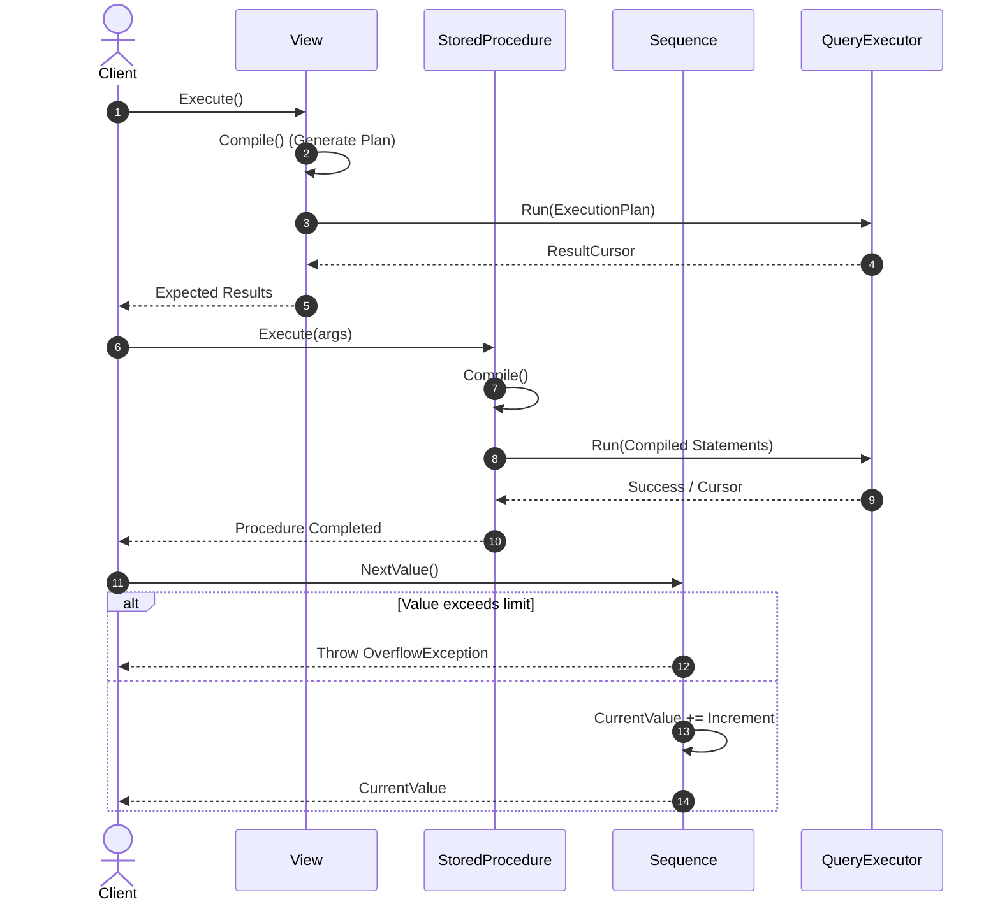
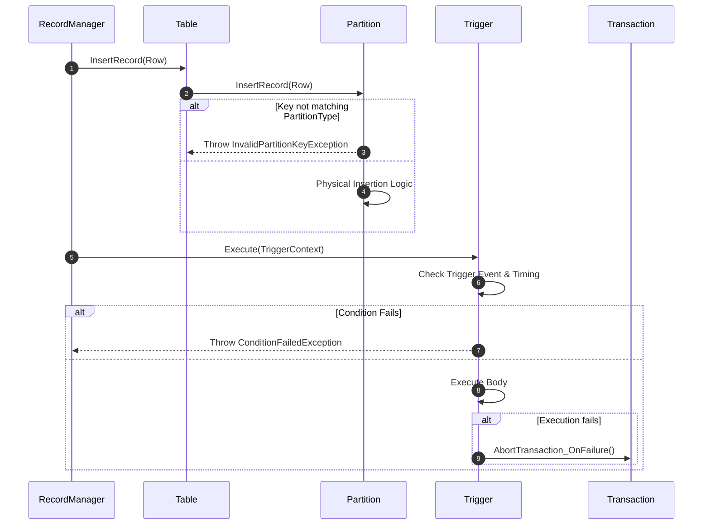
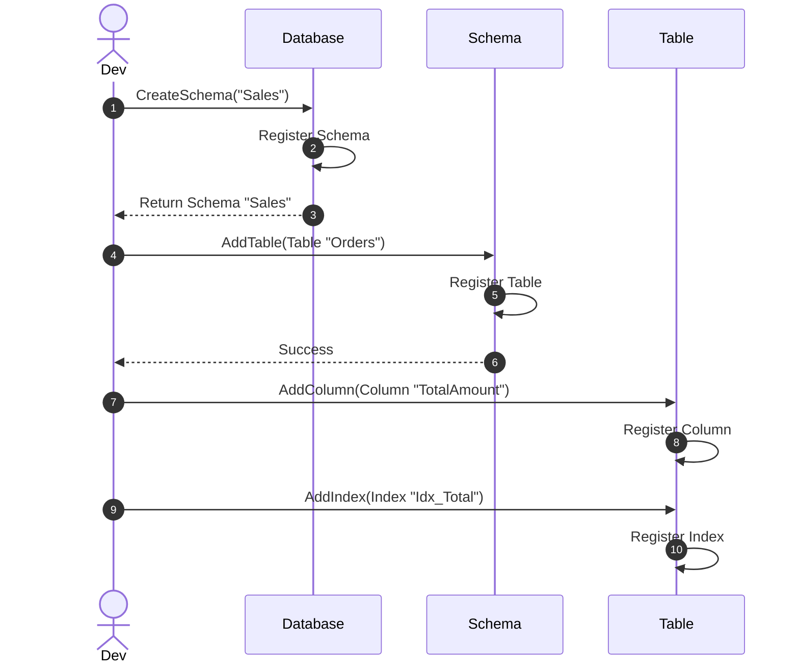

# Database Objects

## 1. Updated Class Diagram

*(Đã bổ sung các thuộc tính và phương thức còn thiếu để hỗ trợ đầy đủ các Unit Test được định nghĩa)*

---

## 2. Sequence Diagrams

### 2.1. Database & Schema Operations

#### Database Lifecycle (Create/Drop Schema, Backup/Restore)
Covers: `CreateSchema`, `DropSchema`, `GetSchema`, `GetSchemas`, `Backup`, `Restore`

#### Schema Operations (Add Table, View, Procedure, Sequence)
Covers: `AddTable`, `DropTable`, `GetTable`, `GetTables`, `CreateView`, `DropView`, `CreateProcedure`, `DropProcedure`, `CreateSequence`

### 2.2. Table & Column Operations

#### Table Schema Adjustments
Covers: `AddColumn`, `RemoveColumn`, `AddConstraint`, `RemoveConstraint`, `AddIndex`, `RemoveIndex`, `AddPartition`, `DropPartition`, `AddTrigger`, `RemoveTrigger`

#### Column Attribute Management & Validation
Covers: `SetDataType`, `SetNullable`, `SetDefaultValue`, `Rename`, `ValidateValue`

### 2.3. Data Structures: Row, RecordData & RID

#### Row & RecordData Manipulation
Covers: `GetValue`, `SetValue`, `UpdateValue`, `Serialize`, `Deserialize`, `RID.Equals`

### 2.4. Programmability & Automations

#### View, Stored Procedure, & Sequence Execution
Covers: `View.Compile`, `View.Execute`, `StoredProcedure.Compile`, `StoredProcedure.Execute`, `Sequence.NextValue`, `Sequence.Reset`

#### Triggers & Partitions
Covers: `Trigger.Execute`, `Partition.InsertRecord`

### 2.5. Integration Flow

#### DDL Object Creation Workflow (Database -> Schema -> Table -> Column)
Covers: `Database_CreateSchema_ShouldRegisterSchema`, `Schema_AddTable_ShouldRegisterTable`, `Table_AddColumn_ShouldRegisterColumn`, `Table_AddIndex_ShouldRegisterIndex`

