# Server & Database Management
## 1. Class Diagram
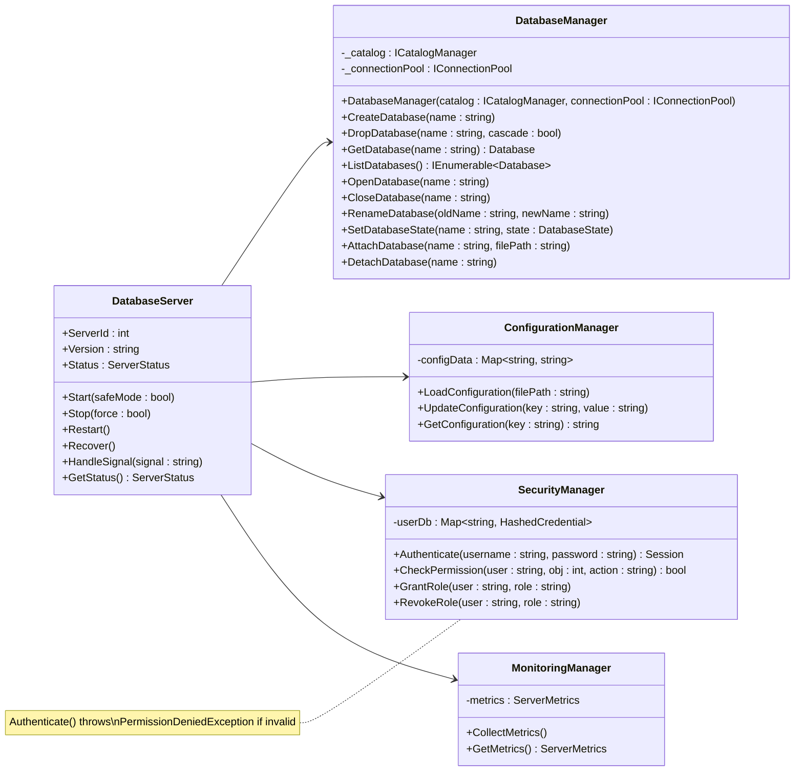
## 2. Sequence Diagrams
### 2.1 DatabaseServer Operations
#### Start Server Flow
Covers: `Start_ShouldInitializeAllServices`, `Start_ShouldOpenNetworkPortForConnections`, `Start_ShouldStartBackgroundWorkers`, `Start_ShouldStartInSafeMode_WhenConfigured`, `Start_ShouldReject_WhenServerAlreadyRunning`
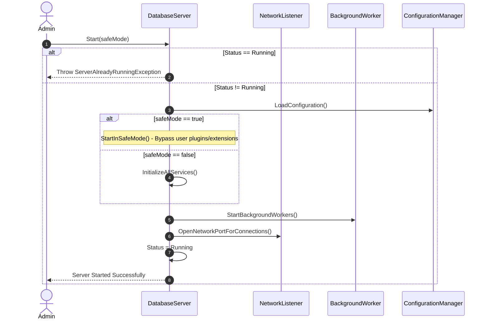
#### Stop & Restart Server Flow
Covers: `Stop_ShouldShutdownAllServices`, `Stop_ShouldFlushDirtyPagesBeforeShutdown`, `Stop_ShouldRejectNewConnections_WhileShuttingDown`, `Stop_ShouldWaitForActiveTransactions_WhenGraceful`, `Stop_ShouldTerminateActiveConnections_WhenForced`, `Restart_ShouldRestartServerSuccessfully`, `HandleSignal_ShouldInitiateGracefulShutdown`, `GetStatus_ShouldReturnCorrectServerState`
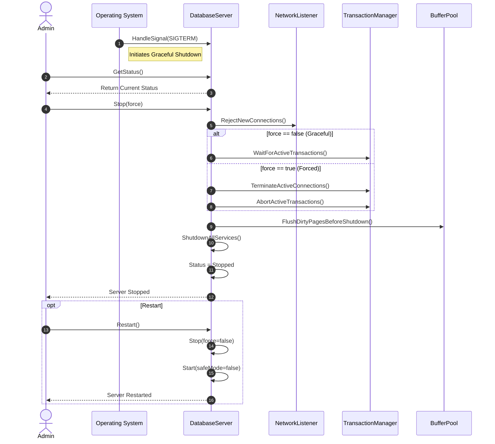
#### Crash Recovery Flow
Covers: `RecoverAfterCrash_ShouldReplayWAL`
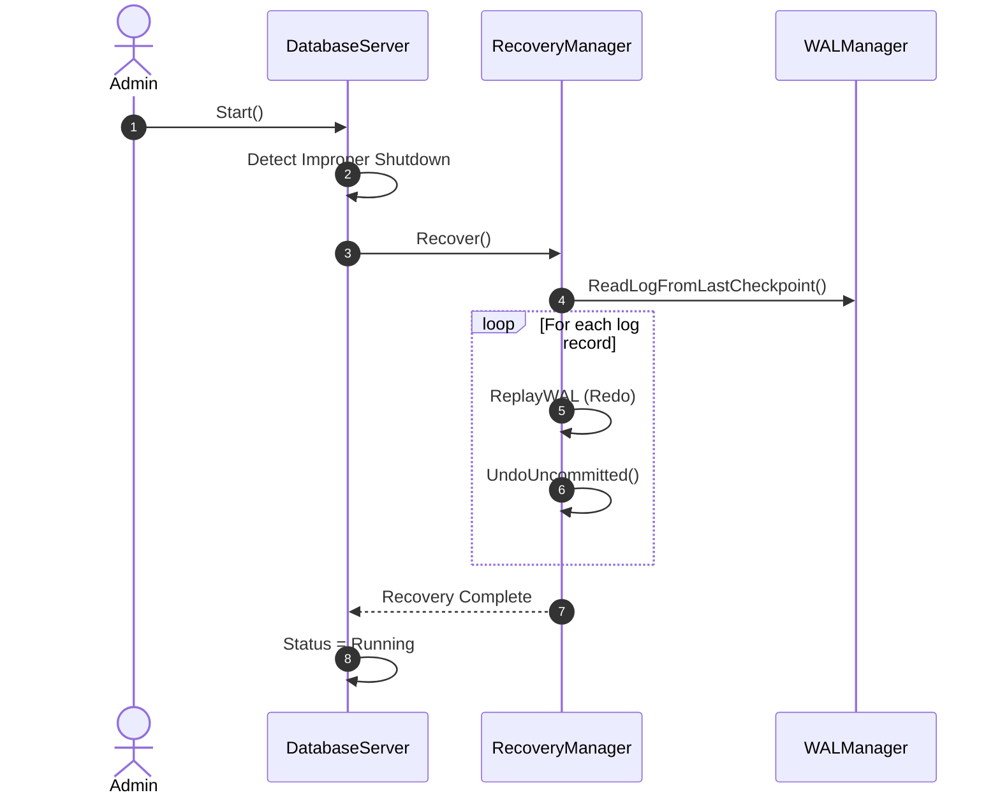
### 2.2 DatabaseManager Operations
#### Create & Drop Database
Covers: `CreateDatabase_ShouldCreateDatabaseSuccessfully`, `CreateDatabase_ShouldRejectDuplicateDatabaseName`, `CreateDatabase_ShouldRejectInvalidName`, `DropDatabase_ShouldRemoveDatabaseSuccessfully`, `DropDatabase_ShouldRejectOpenDatabase`, `DropDatabase_ShouldForceCloseConnections_WhenCascade`
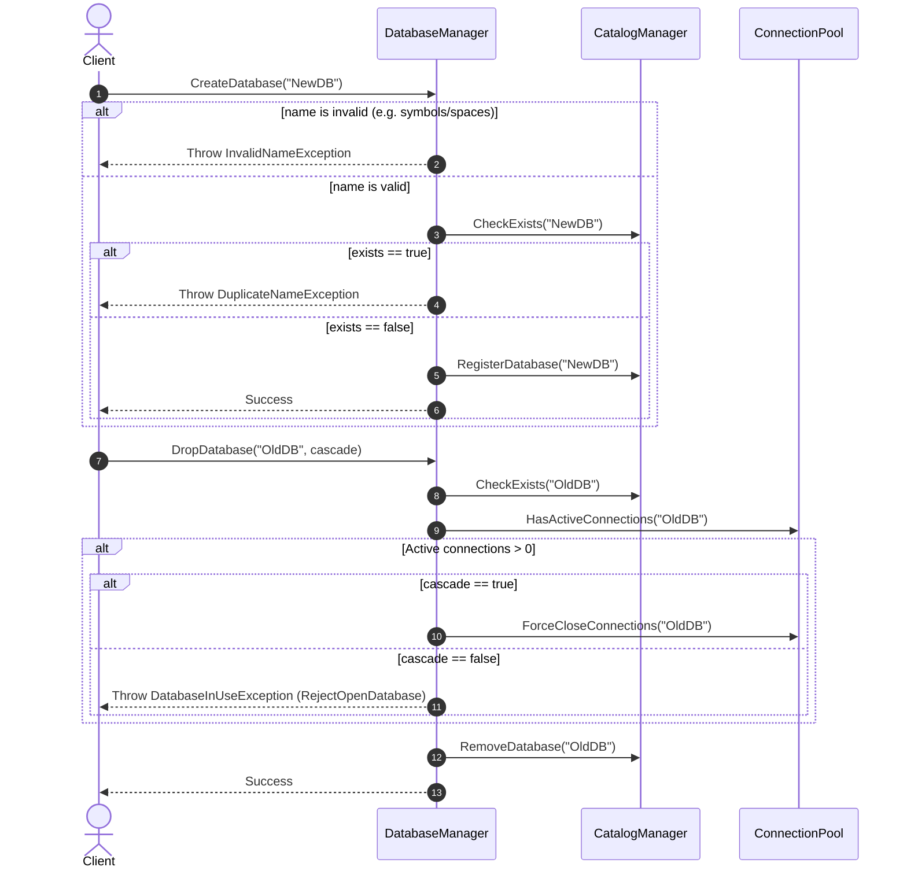
#### Open, Close & Rename Database
Covers: `OpenDatabase_ShouldLoadStorageAndCatalog`, `OpenDatabase_ShouldReject_WhenDatabaseIsOffline`, `CloseDatabase_ShouldFlushDirtyBuffers`, `RenameDatabase_ShouldUpdateNameSuccessfully`, `RenameDatabase_ShouldRejectDuplicateName`
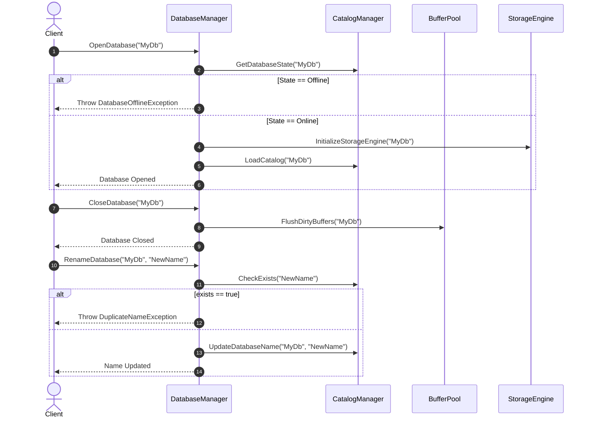
#### Database State & Attachment
Covers: `SetDatabaseState_ShouldSetToReadOnly`, `SetDatabaseState_ShouldSetToOffline`, `AttachDatabase_ShouldRegisterExistingDatabaseFiles`, `DetachDatabase_ShouldUnregisterButKeepFiles`
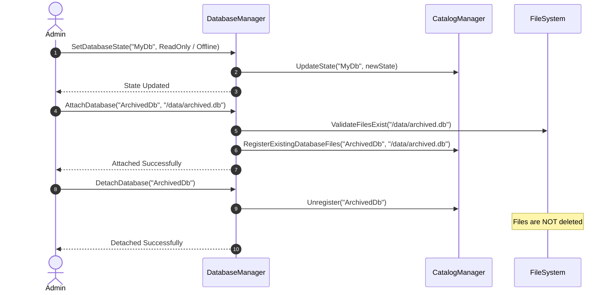
### 2.3 Configuration & Monitoring
#### Configuration Management
Covers: `LoadConfiguration_ShouldLoadServerConfiguration`, `LoadConfiguration_ShouldUseDefaultConfiguration_WhenFileNotExists`, `UpdateConfiguration_ShouldPersistChanges`, `GetConfiguration_ShouldReturnConfiguredValue`
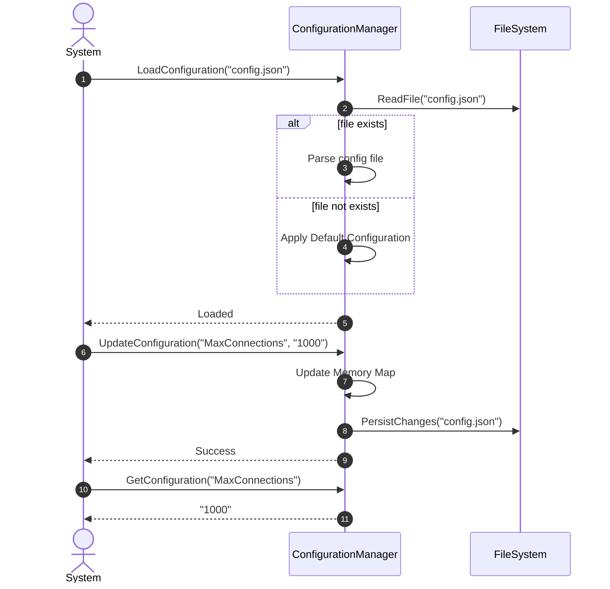
#### Monitoring Management
Covers: `CollectMetrics_ShouldCollectServerMetrics`, `CollectMetrics_ShouldCollectBufferPoolStatistics`, `CollectMetrics_ShouldCollectTransactionStatistics`, `GetMetrics_ShouldReturnLatestMetrics`
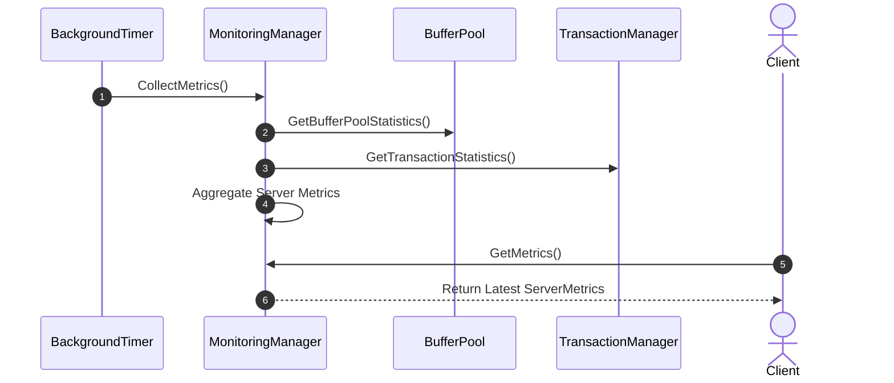
### 2.4 Integration Flow
#### Full Server Boot & DB Initialization Flow
Covers: `StartServer_ShouldLoadConfigurationBeforeInitializingServices`, `StartServer_ShouldInitializeDatabaseManager`, `StartServer_ShouldInitializeStorageEngine`, `CreateDatabase_ShouldRegisterDatabaseInCatalog`, `OpenDatabase_ShouldInitializeStorageEngine`
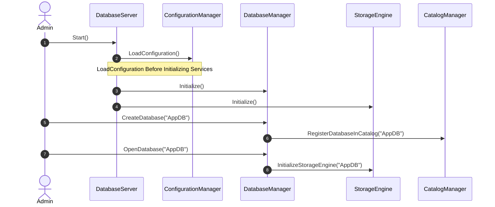
#### Full Server Shutdown Flow
Covers: `StopServer_ShouldFlushDirtyPagesBeforeShutdown`, `StopServer_ShouldShutdownAllManagers`, `CloseDatabase_ShouldFlushPendingChanges`
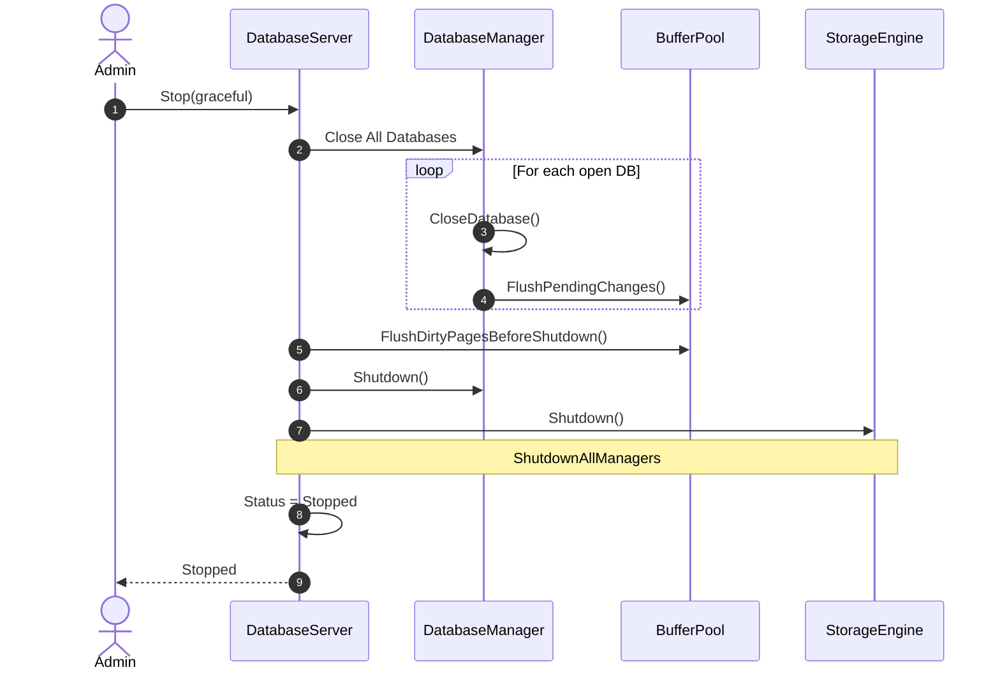
